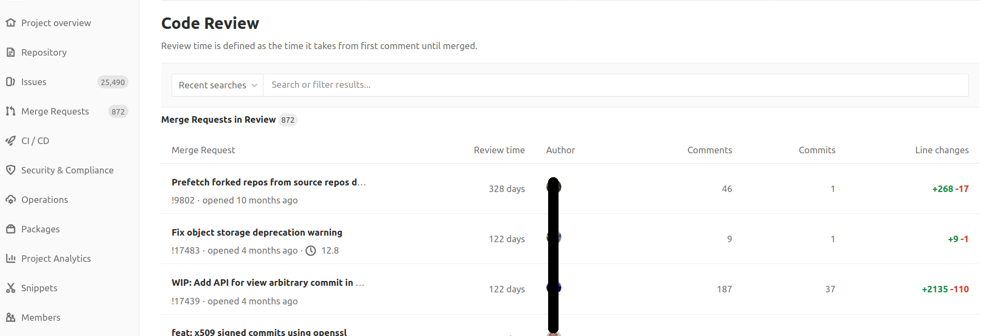

# Code Review Analytics **(STARTER)**

> [Introduced](https://gitlab.com/gitlab-org/gitlab/-/issues/38062) in [GitLab Starter](https://about.gitlab.com/pricing/) 12.7.

Code Review Analytics makes it easy to view the longest-running reviews among open merge requests and
enables you to:

1. Take action on individual merge requests.
1. Reduce overall cycle time.

NOTE: **Note:**
Initially, no data appears. Data is populated as users comment on open merge requests.

## Overview

Code Review Analytics displays a table of open merge requests that have at least one non-author comment. The review time is measured from the time the first non-author comment was submitted.

To access Code Review Analytics, from your project's menu, go to **Project Analytics > Code Review**.

You can filter the list of merge requests by milestone and label.

The table is sorted by:

- **Review time**: Helping you to quickly find the longest-running reviews which may need intervention
  or to be broken down into smaller parts.
- Other columns: Display the author, approvers, comment count, and line change (-/+) counts.

## Use cases

This feature is designed for [development team leaders](https://about.gitlab.com/handbook/marketing/product-marketing/roles-personas/#delaney-development-team-lead)
and others who want to understand broad code review dynamics, and identify patterns to explain them.

You can use Code Review Analytics to:

- Expose your team's unique challenges with code review.
- Identify improvements that might substantially accelerate your development cycle.
- Your team agrees that code review is moving too slow.
- The [Value Stream Analytics feature](value_stream_analytics.md) shows that reviews are your team's most time-consuming step.
- Analyze the patterns and trends of different types of work that are moving slow.

For example:

- Lots of comments or commits? Maybe the code is too complex.
- A particular author is involved? Maybe more training is required.
- Few comments and approvers? Maybe your team is understaffed.

## Permissions

- On [Starter or Bronze tier](https://about.gitlab.com/pricing/) and above.
- By users with Reporter access and above.
