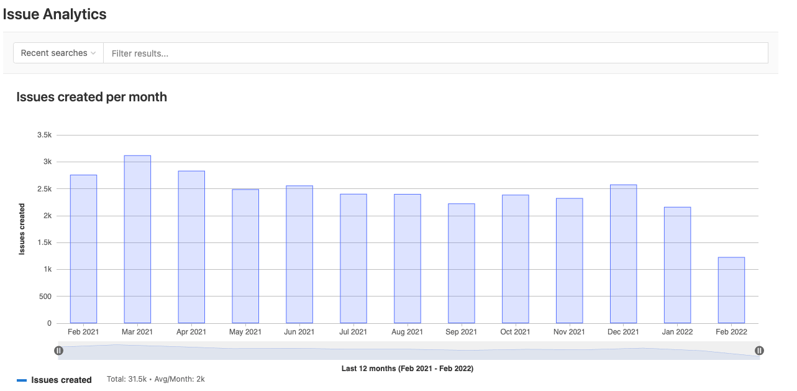

# Issue analytics for projects **(PREMIUM ALL)**

> [Introduced](https://gitlab.com/gitlab-org/gitlab/-/issues/196561) in GitLab 12.9.

Issue analytics is a bar graph which illustrates the number of issues created each month.
The default time span is 13 months, which includes the current month, and the 12 months
prior.

To access the chart:

1. On the left sidebar, select **Search or go to** and find your project.
1. Select **Analyze > Issue analytics**.

You can also access the chart from the [Value Streams Dashboard](value_streams_dashboard.md#dashboard-metrics-and-drill-down-reports) through the **New issues** drill-down report.

Hover over each bar to see the total number of issues.

To narrow the scope of issues included in the graph, enter your criteria in the
**Search or filter results...** field. Criteria from the following list can be typed in or selected from a menu:

- Author
- Assignee
- Milestone
- Label
- My reaction
- Weight

You can change the total number of months displayed by setting a URL parameter.
For example, `https://gitlab.com/groups/gitlab-org/-/issues_analytics?months_back=15`
shows a total of 15 months for the chart in the GitLab.org group.

## Enhanced issue analytics **(ULTIMATE ALL)**

> [Introduced](https://gitlab.com/gitlab-org/gitlab/-/issues/233905/) in GitLab 16.4 [with a flag](../../administration/feature_flags.md) named `issues_completed_analytics_feature_flag`. Disabled by default.

FLAG:
On self-managed GitLab, by default this feature is not available. To make it available, an administrator can
[enable the feature flag](../../administration/feature_flags.md) named `issues_completed_analytics_feature_flag`. On GitLab.com, this feature is not
available. This feature is not ready for production use.

Enhanced issue analytics display the additional metric "Issues closed", which represents the total number of resolved issues in your project over a selected period.
You can use this metric to improve the overall turn-around time and value delivered to your customers.

## Drill into the information

> [Introduced](https://gitlab.com/gitlab-org/gitlab/-/issues/196547) in GitLab 13.1.

You can examine details of individual issues by browsing the table
located below the chart.

The chart displays the top 100 issues based on the global page filters.

