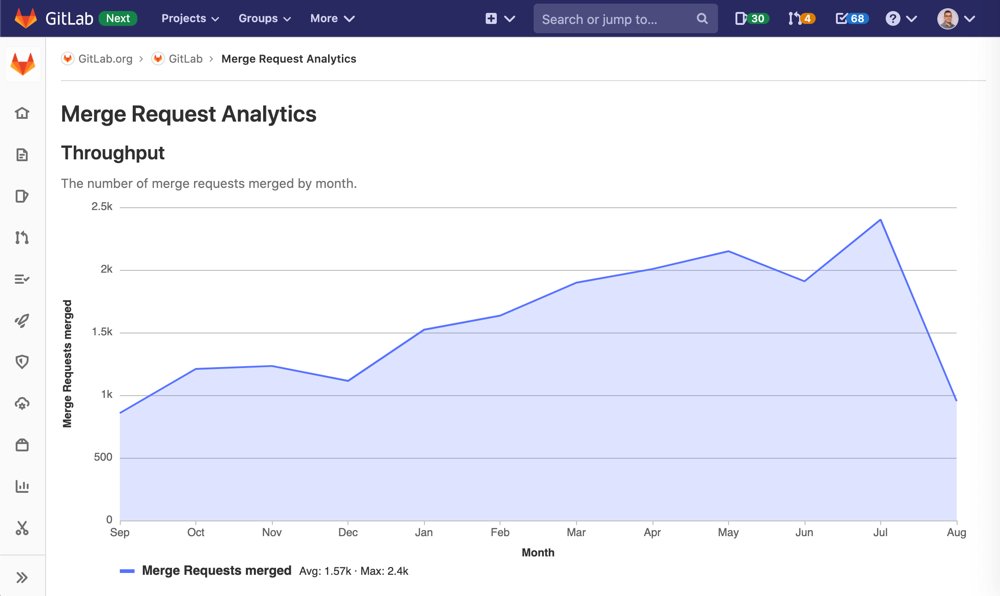

# Merge Request Analytics **(STARTER)**

> [Introduced](https://gitlab.com/gitlab-org/gitlab/-/issues/229045) in [GitLab Starter](https://about.gitlab.com/pricing/) 13.3.

Merge Request Analytics helps you understand the efficiency of your code review process, and the productivity of your team.

## Overview

Merge Request Analytics displays information about all accepted merge requests.

The Throughput chart shows the number of completed merge requests, by month. Merge request throughput is
a common measure of productivity in software engineering. Although imperfect, the average throughput can
be a meaningful benchmark of your team's overall productivity.

To access Merge Request Analytics, from your project's menu, go to **Analytics > Merge Request**.

## Use cases

This feature is designed for [development team leaders](https://about.gitlab.com/handbook/marketing/product-marketing/roles-personas/#delaney-development-team-lead)
and others who want to understand broad patterns in code review and productivity.

You can use Merge Request Analytics to expose when your team is most and least productive, and
identify improvements that might substantially accelerate your development cycle.

Merge Request Analytics could be used when:

- You want to know if you were more productive this month than last month, or 12 months ago.
- You want to drill into low- or high-productivity months to understand the work that took place.

## Permissions

- On [Starter or Bronze tier](https://about.gitlab.com/pricing/) and above.
