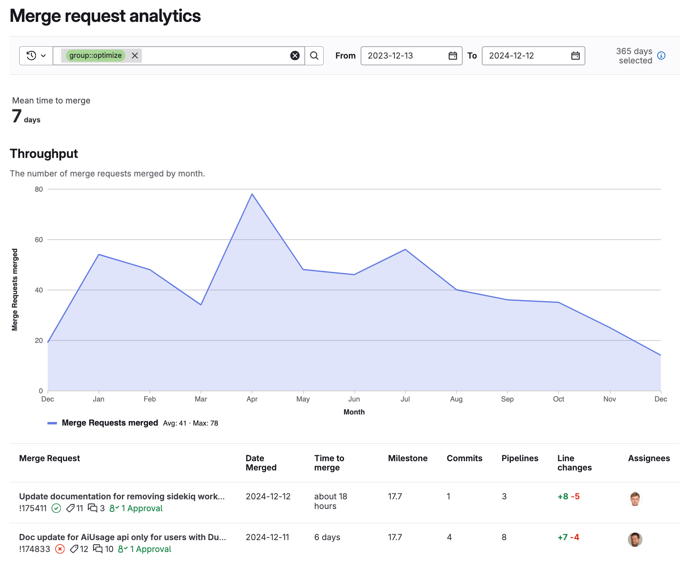

DETAILS:
**Tier:** Premium, Ultimate
**Offering:** GitLab.com, GitLab Self-Managed, GitLab Dedicated

Merge request analytics provide DevOps managers with valuable insights into their team's code review and merging workflows.
Based on the detailed metrics and trends related to merge requests, organizations can monitor and optimize their development processes.

Use merge request analytics to view:

- The number of merge requests your organization merged per month.
- The average time between merge request creation and merge event.
- Information about each merged merge request (such as milestone, commits, line changes, and assignees).

You can use merge request analytics to identify:

- Low or high productivity months.
- The efficiency and productivity of your merge request and code review processes.

These insights can help you make data-driven decisions like:

- Resource allocation: Address low productivity periods by reallocating resources or adjusting timelines.
- Performance benchmarking: Highlight high-performing teams and share best practices.
- Milestone planning: Adjust timelines based on historical merging trends.
- Process optimization: Identify and resolve bottlenecks in code review and merging workflows.

## View merge request analytics

Prerequisites:

- You must have at least the Reporter role.

To view merge request analytics:

1. On the left sidebar, select **Search or go to** and find your project.
1. Select **Analyze > Merge request analytics**.

## View the number of merge requests in a date range

To view the number of merge requests merged during a specific date range:

1. On the left sidebar, select **Search or go to** and find your project.
1. Select **Analyze > Merge request analytics**.
1. Optional. Filter results:
   1. Select the filter bar.
   1. Select a parameter.
   1. Select a value or enter text to refine the results.
   1. To adjust the date range:
      - In the **From** field, select a start date.
      - In the **To** field, select an end date.

The **Throughput** chart shows issues closed or merge requests merged (not closed) over a period of
time.

The table shows up to 20 merge requests per page, and includes
the following information about each merge request:

- Merge request name
- Date merged
- Time to merge
- Milestone
- Commits
- Pipelines
- Line changes
- Assignees

## View average time between merge request creation and merge

The number in **Mean time to merge** shows the average time between when a merge request is
created and when it's merged. Closed and not yet merged merge requests are not included.

To view **Mean time to merge**:

1. On the left sidebar, select **Search or go to** and find your project.
1. Select **Analyze > Merge request analytics**. The **Mean time to merge** number
   is displayed on the dashboard.
