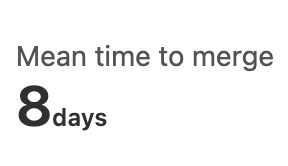
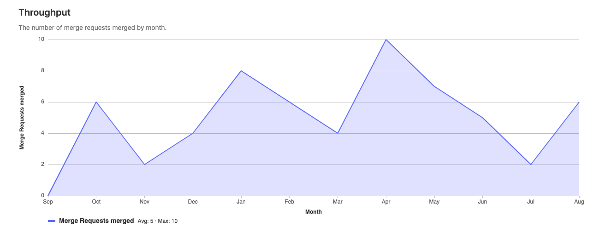
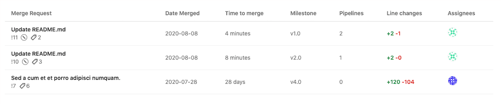

# Merge Request Analytics **(PREMIUM)**

> - [Introduced](https://gitlab.com/gitlab-org/gitlab/-/issues/229045) in GitLab 13.3.
> - Moved to GitLab Premium in 13.9.

Merge Request Analytics helps you understand the efficiency of your code review process, and the productivity of your team.

## Overview

Merge Request Analytics displays information that will help you evaluate the efficiency and productivity of your merge request process.

The Throughput chart shows the number of merge requests merged, by month. Merge request throughput is
a common measure of productivity in software engineering. Although imperfect, the average throughput can
be a meaningful benchmark of your team's overall productivity.

To access Merge Request Analytics, from your project's menu, go to **Analytics > Merge Request**.

## Use cases

This feature is designed for [development team leaders](https://about.gitlab.com/handbook/marketing/strategic-marketing/roles-personas/#delaney-development-team-lead)
and others who want to understand broad patterns in code review and productivity.

You can use Merge Request Analytics to expose when your team is most and least productive, and
identify improvements that might substantially accelerate your development cycle.

Merge Request Analytics could be used when:

- You want to know if you were more productive this month than last month, or 12 months ago.
- You want to drill into low- or high-productivity months to understand the work that took place.

## Visualizations and data

The following visualizations and data are available, representing all merge requests that were merged in the given date range.

### Mean time to merge

> [Introduced](https://gitlab.com/gitlab-org/gitlab/-/issues/229389) in GitLab 13.9.

The mean time to merge (MTTM) metric shows the average time between when a merge request is created,
and when it is merged. To view how the MTTM changes over time, compare MTTM across different date ranges.

### Throughput chart

The throughput chart shows the number of merge requests merged per month.

### Throughput table

> [Introduced](https://gitlab.com/gitlab-org/gitlab/-/issues/232651) in GitLab 13.3.

The Throughput table displays the most recent merge requests merged in the date range. The
table displays up to 20 merge requests at a time. If there are more than 20 merge requests,
you can paginate to them. For each merge request, you can review the following data:

- Title (as a link to the merge request itself)
- ID
- Pipeline status
- Label count
- Comment count
- Approval count (if approved)
- Date merged
- Time to merge
- Milestone
- Commit count
- Pipeline count
- Line change counts
- Assignees

## Filter the data

> [Introduced](https://gitlab.com/gitlab-org/gitlab/-/issues/229266) in GitLab 13.4

You can filter the data that is presented on the page based on the following parameters:

- Author
- Assignee
- Label
- Milestone
- Source branch
- Target branch

To filter results:

1. Click on the filter bar.
1. Select a parameter to filter by.
1. Select a value from the autocompleted results, or enter search text to refine the results.
1. Hit the "Return" key.

## Date range

The date range is set to the past 12 months by default. You can modify the date range by changing the "From" and/or "To" values that appear alongside the filter bar. After changing either value, the data displayed on the page will update automatically.

## Tip: Bookmark preferred settings

You can bookmark preferred filters and date ranges. After you have applied a change to the
filter bar or the date range, you'll see that information in the URL. You can create a
bookmark for those preferred settings in your browser.

## Permissions

The **Merge Request Analytics** feature can be accessed only:

- On [Premium](https://about.gitlab.com/pricing/) and above.
- By users with [Reporter access](../permissions.md) and above.
