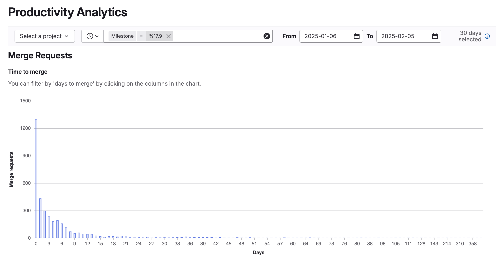

DETAILS:
**Tier:** Premium, Ultimate
**Offering:** GitLab.com, GitLab Self-Managed, GitLab Dedicated

Productivity analytics display information about merge requests for groups.

Use productivity analytics to identify:

- Your development velocity based on how long it takes for a merge request to merge.
- Potential causes of merge requests that take a long time to merge.
- Authors, labels, or milestones that take the longest time to merge or contain most changes.

To view merge request data for projects, use [merge request analytics](../analytics/merge_request_analytics.md).

## Charts

Productivity analytics display the following charts:

- Bar charts that illustrate the:
  - Number of merge requests by number of days to merge.
  - Time between commits, comments, and merge dates.
  - Number of commits, lines of code, and files changed.
- A scatterplot that illustrates the number of merge request metrics (such as number of commits per merge request) per day (merged date).
- A table that lists merge request titles, time to merge, and duration between commits, comments, and merge dates.

## View productivity analytics

Prerequisites:

- You must have at least the Reporter role for the group.

1. On the left sidebar, select **Search or go to** and find your group.
1. Select **Analyze > Productivity analytics**.
1. Optional. Filter results:

- To view analytics for a specific project, from the **Projects** dropdown list, select a project.
- To filter results by author, milestone, or label, select **Filter results** and enter a value.
- To adjust the date range:
  - In the **From** field, select a start date.
  - In the **To** field, select an end date.
