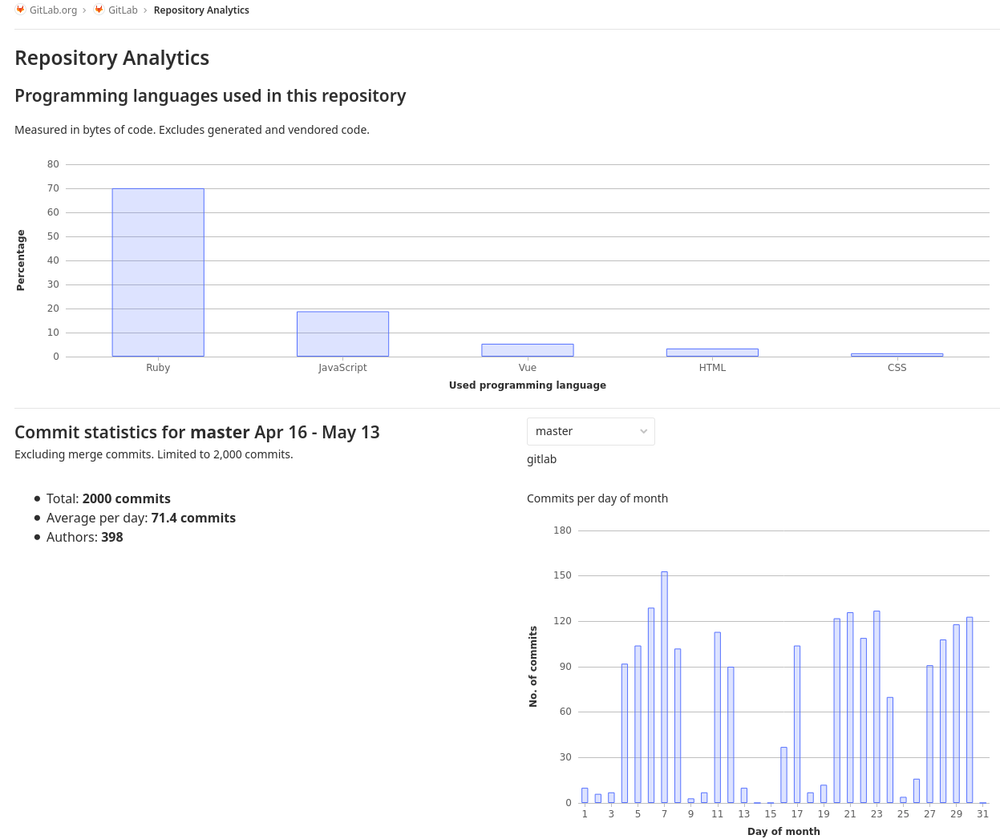

# Repository Analytics

Get high-level overview of the project's Git repository.

## Availability

Repository Analytics is part of [GitLab Community Edition](https://gitlab.com/gitlab-org/gitlab-foss). It's available to anyone who has permission to clone the repository.

The feature requires:

- An initialized Git repository.
- At least one commit in the default branch (`master` by default).

## Overview

You can find Repository Analytics in the project's sidebar. To access the page, go to **{chart}** **Analytics > Repository**.

NOTE:
Without a Git commit in the default branch, the menu item won't be visible.
Commits in a project's [wiki](../project/wiki/index.md#track-wiki-events) are not included in the analysis.

### Charts

The data in the charts are updated soon after each commit in the default branch.

Available charts:

- Programming languages used in the repository
- Code coverage history (last 3 months) ([Introduced](https://gitlab.com/gitlab-org/gitlab/-/issues/33743) in GitLab 13.1)
- Commit statistics (last month)
- Commits per day of month
- Commits per weekday
- Commits per day hour (UTC)
