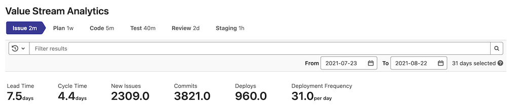
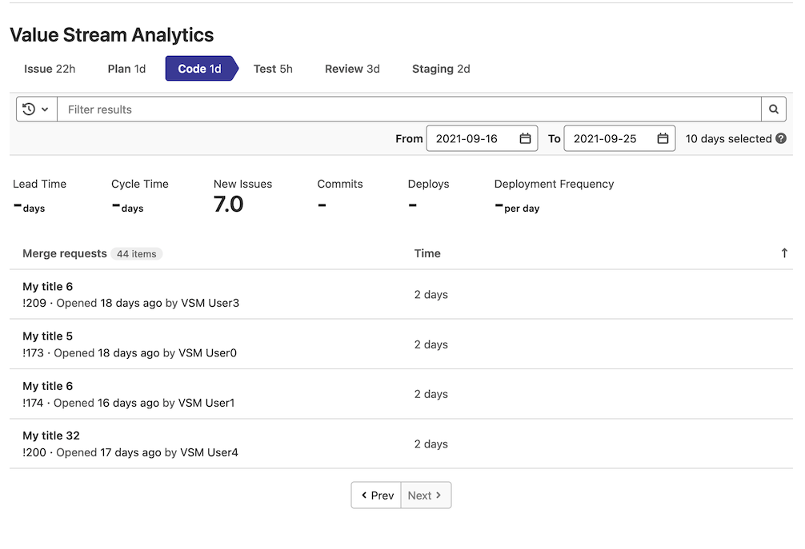

# Value stream analytics for projects **(FREE)**

> - Introduced as cycle analytics prior to GitLab 12.3 at the project level.
> - [Introduced](https://gitlab.com/gitlab-org/gitlab/-/issues/12077) in GitLab Premium 12.3 at the group level.
> - [Renamed](https://gitlab.com/gitlab-org/gitlab/-/merge_requests/23427) from cycle analytics to value stream analytics in GitLab 12.8.

Value stream analytics measures the time spent to go from an
[idea to production](https://about.gitlab.com/blog/2016/08/05/continuous-integration-delivery-and-deployment-with-gitlab/#from-idea-to-production-with-gitlab)
(also known as cycle time) for each of your projects or groups. Value stream analytics displays the median time
spent in each stage defined in the process.

You can use value stream analytics to determine the velocity of a given
project. It points to bottlenecks in the development process, enabling management
to uncover, triage, and identify the root cause of slowdowns in the software development life cycle.

For information about how to contribute to the development of value stream analytics, see our [contributor documentation](../../development/value_stream_analytics.md).

To access value stream analytics for a project:

1. On the top bar, select **Menu > Projects** and find your project.
1. On the left sidebar, select **Analytics > Value stream**.

NOTE:
[Value stream analytics for groups](../group/value_stream_analytics) is also available.

## Default stages

The stages tracked by value stream analytics by default represent the [GitLab flow](../../topics/gitlab_flow.md). You can customize these stages in value stream analytics for groups.

- **Issue** (Tracker)
  - Time to schedule an issue (by milestone or by adding it to an issue board)
- **Plan** (Board)
  - Time to first commit
- **Code** (IDE)
  - Time to create a merge request
- **Test** (CI)
  - Time it takes GitLab CI/CD to test your code
- **Review** (Merge request)
  - Time spent on code review
- **Staging** (Continuous Deployment)
  - Time between merging and deploying to production

## Filter value stream analytics data

> [Introduced](https://gitlab.com/gitlab-org/gitlab/-/issues/326701) in GitLab 14.3

You can filter analytics based on the following parameters:

- Milestones (Group level)
- Labels (Group level)
- Author
- Assignees

To filter results:

1. Select the **Filter results** text box.
1. Select a parameter.
1. Select a value. To find a value in the list, enter the value name.

### Date ranges

To filter analytics results based on a date range,
select different **From** and **To** days
from the date picker (default: last 30 days).

### Stage table

> Sorting the stage table [introduced](https://gitlab.com/gitlab-org/gitlab/-/issues/335974) in GitLab 14.4.

The stage table shows a list of related workflow items for the selected stage. This can include:

- CI/CD jobs
- Issues
- Merge requests
- Pipelines

A little badge next to the workflow items table header shows the number of workflow items that
completed the selected stage.

The stage table also includes the **Time** column, which shows how long it takes each item to pass
through the selected value stream stage.

To sort the stage table by a table column, select the table header.
You can sort in ascending or descending order. To find items that spent the most time in a stage,
potentially causing bottlenecks in your value stream, sort the table by the **Time** column.
From there, select individual items to drill in and investigate how delays are happening.
To see which items most recently exited the stage, sort by the work item column on the left.

The table displays 20 items per page. If there are more than 20 items, you can use the
**Prev** and **Next** buttons to navigate through the pages.

## How Time metrics are measured

The **Time** metrics near the top of the page are measured as follows:

- **Lead time**: Median time from issue created to issue closed.
- **Cycle time**: Median time from first commit to issue closed. (You can associate a commit with an issue by [crosslinking in the commit message](../project/issues/crosslinking_issues.md#from-commit-messages).)
- **Lead Time for Changes**: median duration between merge request merge and deployment to a production environment for all MRs deployed in the given time period. [Introduced](https://gitlab.com/gitlab-org/gitlab/-/issues/340150) in GitLab 14.5 (Ultimate only).

## Deployment metrics (**PREMIUM**)

> [Introduced](https://gitlab.com/gitlab-org/gitlab/-/issues/337256) in GitLab 11.3.

Value stream analytics exposes two deployment related metrics near the top of the page:

- **Deploys:** The number of successful deployments in the date range.
- **Deployment Frequency:** The average number of successful deployments.

The deployment metrics calculation uses the same method as the
[value stream analytics for groups](../group/value_stream_analytics/index.md#how-metrics-are-measured).
Both of them are based on the [DORA API](../../api/dora/metrics.md#devops-research-and-assessment-dora-key-metrics-api).

## How the stages are measured

Value stream analytics uses start events and end events to measure the time that an issue or merge request spends in each stage.
For example, a stage might start when one label is added to an issue and end when another label is added.
Items aren't included in the stage time calculation if they have not reached the end event.

| Stage   | Description   |
|---------|---------------|
| Issue   | Measures the median time between creating an issue and taking action to solve it, by either labeling it or adding it to a milestone, whichever comes first. The label is tracked only if it already includes an [issue board list](../project/issue_board.md) created for it. |
| Plan    | Measures the median time between the action you took for the previous stage, and pushing the first commit to the branch. That first branch commit triggers the separation between **Plan** and **Code**, and at least one of the commits in the branch must include the related issue number (such as `#42`). If the issue number is *not* included in a commit, that data is not included in the measurement time of the stage. |
| Code    | Measures the median time between pushing a first commit (previous stage) and creating a merge request (MR). The process is tracked with the [issue closing pattern](../project/issues/managing_issues.md#closing-issues-automatically) in the description of the merge request. For example, if the issue is closed with `Closes #xxx`, it's assumed that `xxx` is issue number for the merge request). If there is no closing pattern, the start time is set to the create time of the first commit. |
| Test    | Essentially the start to finish time for all pipelines. Measures the median time to run the entire pipeline for that project. Related to the time required by GitLab CI/CD to run every job for the commits pushed to that merge request, as defined in the previous stage. |
| Review  | Measures the median time taken to review merge requests with a closing issue pattern, from creation to merge. |
| Staging | Measures the median time between merging the merge request (with a closing issue pattern) to the first deployment to a [production environment](#how-the-production-environment-is-identified). Data not collected without a production environment. |

How this works:

1. Issues and merge requests are grouped in pairs, where the merge request has the
   [closing pattern](../project/issues/managing_issues.md#closing-issues-automatically)
   for the corresponding issue. Issue and merge request pairs without closing patterns are
   not included.
1. Issue and merge request pairs are filtered by the last XX days, specified through the UI
   (default is `90` days). Pairs outside the filtered range are not included.
1. For the remaining pairs, review information needed for stages, including
   issue creation date and merge request merge time.

In short, the value stream analytics dashboard tracks data related to [GitLab flow](../../topics/gitlab_flow.md). It does not include data for:

- Merge requests that do not close an issue.
- Issues that do not include labels present in the issue board.
- Issues without a milestone.
- Staging stages, in projects without a [production environment](#how-the-production-environment-is-identified).

## How the production environment is identified

Value stream analytics identifies production environments based on the
[deployment tier of environments](../../ci/environments/index.md#deployment-tier-of-environments).

## Example workflow

Here's a fictional workflow of a single cycle that happens in a
single day, passing through all seven stages. If a stage doesn't have
a start and a stop mark, it isn't measured and hence isn't calculated in the median
time. It's assumed that milestones are created, and CI for testing and setting
environments is configured.

1. Issue is created at 09:00 (start of **Issue** stage).
1. Issue is added to a milestone at 11:00 (stop of **Issue** stage and start of
   **Plan** stage).
1. Start working on the issue, create a branch locally, and make one commit at
   12:00.
1. Make a second commit to the branch that mentions the issue number at 12:30
   (stop of **Plan** stage and start of **Code** stage).
1. Push branch, and create a merge request that contains the [issue closing pattern](../project/issues/managing_issues.md#closing-issues-automatically)
   in its description at 14:00 (stop of **Code** stage and start of **Test** and
   **Review** stages).
1. The CI starts running your scripts defined in [`.gitlab-ci.yml`](../../ci/yaml/index.md) and
   takes 5 minutes (stop of **Test** stage).
1. Review merge request, ensure that everything is okay, and then merge the merge
   request at 19:00 (stop of **Review** stage and start of **Staging** stage).
1. The merge request is merged, and a deployment to the `production`
   environment starts and finishes at 19:30 (stop of **Staging** stage).

From the previous example we see the time used for each stage:

- **Issue**: 2 hrs (09:00 to 11:00)
- **Plan**: 1 hr (11:00 to 12:00)
- **Code**: 2 hrs (12:00 to 14:00)
- **Test**: 5 minutes
- **Review**: 5 hrs (14:00 to 19:00)
- **Staging**: 30 minutes (19:00 to 19:30)

More information:

- Although the previous example specifies the issue number in a later commit, the process
  still collects analytics data for the issue.
- The time required in the **Test** stage isn't included in the overall time of
  the cycle. The time is included in the **Review** process, as every merge request should be
  tested.
- The previous example illustrates only one cycle of the multiple stages. Value
  stream analytics, on its dashboard, shows the calculated median elapsed time
  for these issues.

## Permissions

The permissions for the value stream analytics for projects dashboard include:

| Project type | Permissions                           |
|--------------|---------------------------------------|
| Public       | Anyone can access                     |
| Internal     | Any authenticated user can access     |
| Private      | Any member Guest and above can access |

You can [read more about permissions](../../user/permissions.md) in general.

## More resources

Learn more about value stream analytics with the following resources:

- [Value stream analytics feature page](https://about.gitlab.com/stages-devops-lifecycle/value-stream-analytics/).
- [Value stream analytics feature preview](https://about.gitlab.com/blog/2016/09/16/feature-preview-introducing-cycle-analytics/).
- [Value stream analytics feature highlight](https://about.gitlab.com/blog/2016/09/21/cycle-analytics-feature-highlight/).
