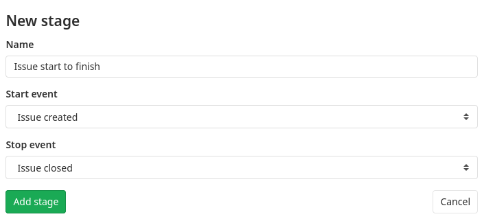
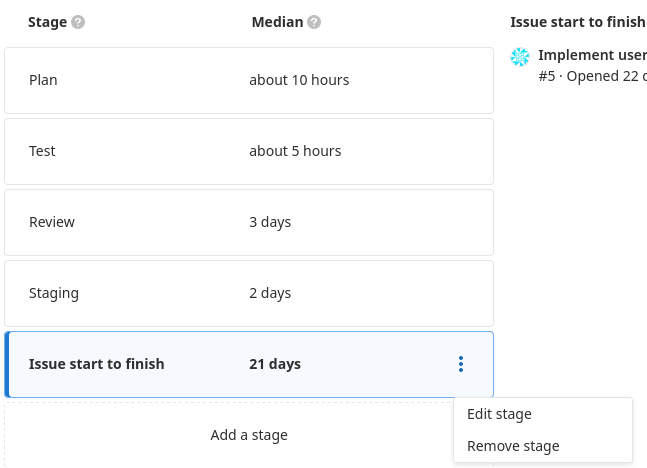
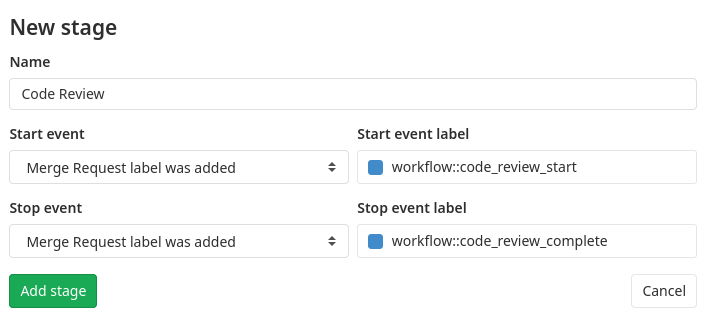

# Value Stream Analytics

> - Introduced as Cycle Analytics prior to GitLab 12.3 at the project level.
> - [Introduced](https://gitlab.com/gitlab-org/gitlab/issues/12077) in [GitLab Premium](https://about.gitlab.com/pricing/) 12.3 at the group level.
> - [Renamed](https://gitlab.com/gitlab-org/gitlab/-/merge_requests/23427) from Cycle Analytics to Value Stream Analytics in GitLab 12.8.

Value Stream Analytics measures the time spent to go from an
[idea to production](https://about.gitlab.com/blog/2016/08/05/continuous-integration-delivery-and-deployment-with-gitlab/#from-idea-to-production-with-gitlab)
(also known as cycle time) for each of your projects. Value Stream Analytics displays the median time
spent in each stage defined in the process.

For information on how to contribute to the development of Value Stream Analytics, see our [contributor documentation](../../development/value_stream_analytics.md).

NOTE: **Note:**
Use the `cycle_analytics` feature flag to enable at the group level.

Value Stream Analytics is useful in order to quickly determine the velocity of a given
project. It points to bottlenecks in the development process, enabling management
to uncover, triage, and identify the root cause of slowdowns in the software development life cycle.

Value Stream Analytics is tightly coupled with the [GitLab flow](../../topics/gitlab_flow.md) and
calculates a separate median for each stage.

## Overview

Value Stream Analytics is available:

- From GitLab 12.9, at the group level via **Group > Analytics > Value Stream**. **(PREMIUM)**
- At the project level via **Project > Value Stream Analytics**.

There are seven stages that are tracked as part of the Value Stream Analytics calculations.

- **Issue** (Tracker)
  - Time to schedule an issue (by milestone or by adding it to an issue board)
- **Plan** (Board)
  - Time to first commit
- **Code** (IDE)
  - Time to create a merge request
- **Test** (CI)
  - Time it takes GitLab CI/CD to test your code
- **Review** (Merge Request/MR)
  - Time spent on code review
- **Staging** (Continuous Deployment)
  - Time between merging and deploying to production
- **Total** (Total)
  - Total lifecycle time. That is, the velocity of the project or team. [Previously known](https://gitlab.com/gitlab-org/gitlab/issues/38317) as **Production**.

## Date ranges

> [Introduced](https://gitlab.com/gitlab-org/gitlab/issues/13216) in GitLab 12.4.

GitLab provides the ability to filter analytics based on a date range. To filter results:

1. Select a group.
1. Optionally select a project.
1. Select a date range using the available date pickers.

## How the data is measured

Value Stream Analytics records cycle time and data based on the project issues with the
exception of the staging and total stages, where only data deployed to
production are measured.

Specifically, if your CI is not set up and you have not defined a `production`
or `production/*` [environment](../../ci/yaml/README.md#environment), then you will not have any
data for this stage.

Each stage of Value Stream Analytics is further described in the table below.

| **Stage** | **Description** |
| --------- | --------------- |
| Issue     | Measures the median time between creating an issue and taking action to solve it, by either labeling it or adding it to a milestone, whatever comes first. The label will be tracked only if it already has an [Issue Board list](../project/issue_board.md) created for it. |
| Plan      | Measures the median time between the action you took for the previous stage, and pushing the first commit to the branch. The very first commit of the branch is the one that triggers the separation between **Plan** and **Code**, and at least one of the commits in the branch needs to contain the related issue number (e.g., `#42`). If none of the commits in the branch mention the related issue number, it is not considered to the measurement time of the stage. |
| Code      | Measures the median time between pushing a first commit (previous stage) and creating a merge request (MR) related to that commit. The key to keep the process tracked is to include the [issue closing pattern](../project/issues/managing_issues.md#closing-issues-automatically) to the description of the merge request (for example, `Closes #xxx`, where `xxx` is the number of the issue related to this merge request). If the issue closing pattern is not present in the merge request description, the MR is not considered to the measurement time of the stage. |
| Test      | Measures the median time to run the entire pipeline for that project. It's related to the time GitLab CI/CD takes to run every job for the commits pushed to that merge request defined in the previous stage. It is basically the start->finish time for all pipelines. |
| Review    | Measures the median time taken to review the merge request that has a closing issue pattern, between its creation and until it's merged. |
| Staging   | Measures the median time between merging the merge request with a closing issue pattern until the very first deployment to production. It's tracked by the environment set to `production` or matching `production/*` (case-sensitive, `Production` won't work) in your GitLab CI/CD configuration. If there isn't a production environment, this is not tracked. |
| Total | The sum of all time (medians) taken to run the entire process, from issue creation to deploying the code to production. [Previously known](https://gitlab.com/gitlab-org/gitlab/issues/38317) as **Production**. |

How this works, behind the scenes:

1. Issues and merge requests are grouped together in pairs, such that for each
   `<issue, merge request>` pair, the merge request has the [issue closing pattern](../project/issues/managing_issues.md#closing-issues-automatically)
   for the corresponding issue. All other issues and merge requests are **not**
   considered.
1. Then the `<issue, merge request>` pairs are filtered out by last XX days (specified
   by the UI - default is 90 days). So it prohibits these pairs from being considered.
1. For the remaining `<issue, merge request>` pairs, we check the information that
   we need for the stages, like issue creation date, merge request merge time,
   etc.

To sum up, anything that doesn't follow [GitLab flow](../../workflow/gitlab_flow.md) will not be tracked and the
Value Stream Analytics dashboard will not present any data for:

- Merge requests that do not close an issue.
- Issues not labeled with a label present in the Issue Board or for issues not assigned a milestone.
- Staging and production stages, if the project has no `production` or `production/*`
  environment.

## Example workflow

Below is a simple fictional workflow of a single cycle that happens in a
single day passing through all seven stages. Note that if a stage does not have
a start and a stop mark, it is not measured and hence not calculated in the median
time. It is assumed that milestones are created and CI for testing and setting
environments is configured.

1. Issue is created at 09:00 (start of **Issue** stage).
1. Issue is added to a milestone at 11:00 (stop of **Issue** stage / start of
   **Plan** stage).
1. Start working on the issue, create a branch locally and make one commit at
   12:00.
1. Make a second commit to the branch which mentions the issue number at 12.30
   (stop of **Plan** stage / start of **Code** stage).
1. Push branch and create a merge request that contains the [issue closing pattern](../project/issues/managing_issues.md#closing-issues-automatically)
   in its description at 14:00 (stop of **Code** stage / start of **Test** and
   **Review** stages).
1. The CI starts running your scripts defined in [`.gitlab-ci.yml`](../../ci/yaml/README.md) and
   takes 5min (stop of **Test** stage).
1. Review merge request, ensure that everything is OK and merge the merge
   request at 19:00. (stop of **Review** stage / start of **Staging** stage).
1. Now that the merge request is merged, a deployment to the `production`
   environment starts and finishes at 19:30 (stop of **Staging** stage).
1. The cycle completes and the sum of the median times of the previous stages
   is recorded to the **Total** stage. That is the time between creating an
   issue and deploying its relevant merge request to production.

From the above example you can conclude the time it took each stage to complete
as long as their total time:

- **Issue**: 2h (11:00 - 09:00)
- **Plan**: 1h (12:00 - 11:00)
- **Code**: 2h (14:00 - 12:00)
- **Test**: 5min
- **Review**: 5h (19:00 - 14:00)
- **Staging**: 30min (19:30 - 19:00)
- **Total**: Since this stage measures the sum of median time of all
  previous stages, we cannot calculate it if we don't know the status of the
  stages before. In case this is the very first cycle that is run in the project,
  then the **Total** time is 10h 30min (19:30 - 09:00)

A few notes:

- In the above example we demonstrated that it doesn't matter if your first
  commit doesn't mention the issue number, you can do this later in any commit
  of the branch you are working on.
- You can see that the **Test** stage is not calculated to the overall time of
  the cycle since it is included in the **Review** process (every MR should be
  tested).
- The example above was just **one cycle** of the seven stages. Add multiple
  cycles, calculate their median time and the result is what the dashboard of
  Value Stream Analytics is showing.

## Customizable Value Stream Analytics

> [Introduced](https://gitlab.com/gitlab-org/gitlab/-/issues/12196) in GitLab 12.9.

The default stages are designed to work straight out of the box, but they might not be suitable for
all teams. Different teams use different approaches to building software, so some teams might want
to customize their Value Stream Analytics.

GitLab allows users to hide default stages and create custom stages that align better to their
development workflow.

NOTE: **Note:**
Customizability is [only available for group-level](https://gitlab.com/gitlab-org/gitlab/-/issues/35823#note_272558950) Value Stream Analytics.

### Adding a stage

In the following example we're creating a new stage that measures and tracks issues from creation
time until they are closed.

1. Navigate to your group's **Analytics > Value Stream**.
1. Click the **Add a stage** button.
1. Fill in the new stage form:
   - Name: Issue start to finish.
   - Start event: Issue created.
   - End event: Issue closed.
1. Click the **Add stage** button.



The new stage is persisted and it will always show up on the Value Stream Analytics page for your
group.

If you want to alter or delete the stage, you can easily do that for customized stages by:

1. Hovering over the stage.
1. Clicking the vertical ellipsis (**{ellipsis_v}**) button that appears.



Creating a custom stage requires specifying two events:

- A start.
- An end.

Be careful to choose a start event that occurs *before* your end event. For example, consider a
stage that:

- Started when an issue is added to a board.
- Ended when the issue is created.

This stage would not work because the end event has already happened when the start event occurs.
To prevent such invalid stages, the UI prohibits incompatible start and end events. After you select
the start event, the stop event dropdown will only list the compatible events.

### Re-ordering stages

> [Introduced](https://gitlab.com/gitlab-org/gitlab/-/issues/196698) in GitLab 12.10.

Once a custom stage has been added, you can "drag and drop" stages to rearrange their order. These changes are automatically saved to the system.

### Label based stages

The pre-defined start and end events can cover many use cases involving both issues and merge requests.

For supporting more complex workflows, use stages based on group labels. These events are based on
labels being added or removed. In particular, [scoped labels](../project/labels.md#scoped-labels-premium)
are useful for complex workflows.

In this example, we'd like to measure more accurate code review times. The workflow is the following:

- When the code review starts, the reviewer adds `workflow::code_review_start` label to the merge request.
- When the code review is finished, the reviewer adds `workflow::code_review_complete` label to the merge request.

Creating a new stage called "Code Review":



### Hiding unused stages

Sometimes certain default stages are not relevant to a team. In this case, you can easily hide stages
so they no longer appear in the list. To hide stages:

1. Add a custom stage to activate customizability.
1. Hover over the default stage you want to hide.
1. Click the vertical ellipsis (**{ellipsis_v}**) button that appears and select **Hide stage**.

To recover a default stage that was previously hidden:

1. Click **Add a stage** button.
1. In the top right corner open the **Recover hidden stage** dropdown.
1. Select a stage.

## Days to completion chart

> [Introduced](https://gitlab.com/gitlab-org/gitlab/-/merge_requests/21631) in GitLab 12.6.

This chart visually depicts the total number of days it takes for cycles to be completed.

This chart uses the global page filters for displaying data based on the selected
group, projects, and timeframe. In addition, specific stages can be selected
from within the chart itself.

### Chart median line

> [Introduced](https://gitlab.com/gitlab-org/gitlab/issues/36675) in GitLab 12.7.

The median line on the chart displays data that is offset by the number of days selected.
For example, if 30 days worth of data has been selected (for example, 2019-12-16 to 2020-01-15) the
median line will represent the previous 30 days worth of data (2019-11-16 to 2019-12-16)
as a metric to compare against.

### Disabling chart

This chart is enabled by default. If you have a self-managed instance, an
administrator can open a Rails console and disable it with the following command:

```ruby
Feature.disable(:cycle_analytics_scatterplot_enabled)
```

### Disabling chart median line

This chart's median line is enabled by default. If you have a self-managed instance, an
administrator can open a Rails console and disable it with the following command:

```ruby
Feature.disable(:cycle_analytics_scatterplot_median_enabled)
```

## Type of work - Tasks by type chart

> [Introduced](https://gitlab.com/gitlab-org/gitlab/-/issues/32421) in GitLab 12.10.

This chart shows a cumulative count of issues and merge requests per day.

This chart uses the global page filters for displaying data based on the selected
group, projects, and timeframe. The chart defaults to showing counts for issues but can be
toggled to show data for merge requests and further refined for specific group-level labels.

By default the top group-level labels (max. 10) are pre-selected, with the ability to
select up to a total of 15 labels.

### Disabling chart

This chart is enabled by default. If you have a self-managed instance, an
administrator can open a Rails console and disable it with the following command:

```ruby
Feature.disable(:tasks_by_type_chart)
```

## Permissions

The current permissions on the Project Value Stream Analytics dashboard are:

- Public projects - anyone can access.
- Internal projects - any authenticated user can access.
- Private projects - any member Guest and above can access.

You can [read more about permissions](../../ci/yaml/README.md) in general.

NOTE: **Note:**
As of GitLab 12.3, the project-level page is deprecated. You should access
project-level Value Stream Analytics from **Analytics > Value Stream Analytics** in the top
navigation bar. We will ensure that the same project-level functionality is available
to CE users in the new analytics space.

For Value Stream Analytics functionality introduced in GitLab 12.3 and later:

- Users must have Reporter access or above.
- Features are available only on
  [Premium or Silver tiers](https://about.gitlab.com/pricing/) and above.

## Troubleshooting

If you see an error as listed in the following table, try the noted solution:

| Error                                       | Solution                                                                                                                                                                                                                           |
|---------------------------------------------|------------------------------------------------------------------------------------------------------------------------------------------------------------------------------------------------------------------------------------|
| There was an error fetching the top labels. | Manually enable tasks by type feature in the [rails console](../../administration/troubleshooting/navigating_gitlab_via_rails_console.md#starting-a-rails-console-session), specifically `Feature.enable(:tasks_by_type_chart)`. |

## More resources

Learn more about Value Stream Analytics in the following resources:

- [Value Stream Analytics feature page](https://about.gitlab.com/stages-devops-lifecycle/value-stream-analytics/).
- [Value Stream Analytics feature preview](https://about.gitlab.com/blog/2016/09/16/feature-preview-introducing-cycle-analytics/).
- [Value Stream Analytics feature highlight](https://about.gitlab.com/blog/2016/09/21/cycle-analytics-feature-highlight/).
