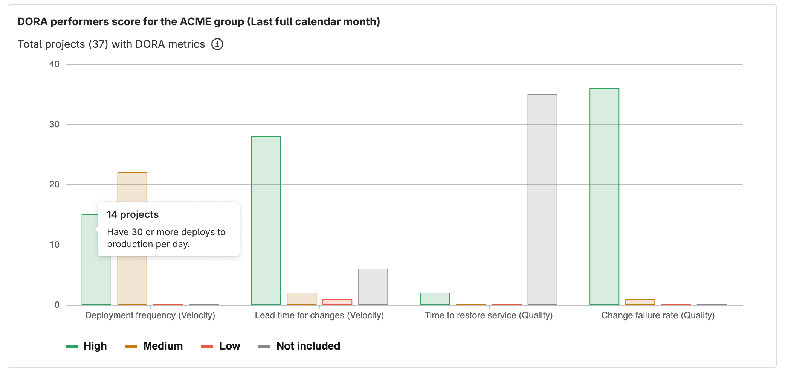
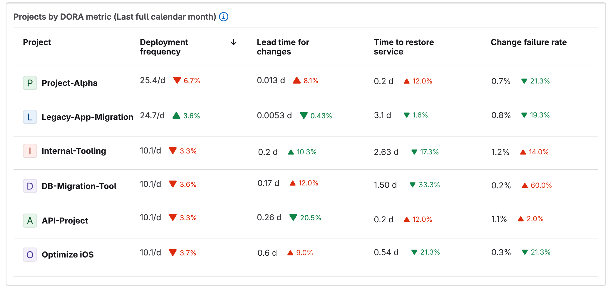

DETAILS:
**Tier:** Ultimate
**Offering:** GitLab.com, GitLab Self-Managed, GitLab Dedicated

> - Introduced in GitLab 15.8 as a closed [beta](../../policy/development_stages_support.md#beta) feature [with a flag](../../administration/feature_flags.md) named `group_analytics_dashboards_page`. Disabled by default.
> - Released in GitLab 15.11 as an open [beta](../../policy/development_stages_support.md#beta) feature [with a flag](../../administration/feature_flags.md) named `group_analytics_dashboards_page`. Enabled by default.
> - [Generally available](https://gitlab.com/gitlab-org/gitlab/-/issues/392734) in GitLab 16.0. Feature flag `group_analytics_dashboards_page` removed.

To help us improve the Value Streams Dashboard, share feedback about your experience in this [survey](https://gitlab.fra1.qualtrics.com/jfe/form/SV_50guMGNU2HhLeT4).
For more information, see the [Value Stream Management category direction page](https://about.gitlab.com/direction/plan/value_stream_management/).

The Value Streams Dashboard is a customizable dashboard you can use to identify trends, patterns, and opportunities for digital transformation improvements.
The centralized UI in the Value Streams Dashboard acts as the single source of truth (SSOT), where all stakeholders can access and view the same set of metrics that are relevant to the organization.
The Value Streams Dashboard includes [panels](#value-streams-dashboard-panels) that visualize the following metrics:

- [DORA metrics](dora_metrics.md)
- [Value Stream Analytics (VSA) - flow metrics](../group/value_stream_analytics/_index.md)
- [Vulnerabilities](https://gitlab.com/gitlab-org/gitlab/-/security/vulnerability_report) metrics
- [GitLab Duo Code Suggestions](../project/repository/code_suggestions/_index.md)

With the Value Streams Dashboard, you can:

- Track and compare the above metrics over a period of time.
- Identify downward trends early on.
- Understand security exposure.
- Drill down into individual projects or metrics to take actions for improvement.
- Understand the impact of adding AI to the software development lifecycle (SDLC) and demonstrate the return on investment (ROI) of investments in GitLab Duo.

For a click-through demo, see [the Value Stream Management product tour](https://gitlab.navattic.com/vsm).

To view the Value Streams Dashboard as an analytics dashboard for a group:

1. On the left sidebar, select **Search or go to** and find your group.
1. Select **Analyze > Analytics dashboards**.
1. From the list of available dashboards, select **Value Streams Dashboard**.

NOTE:
Data displayed on the Value Streams Dashboard is continuously collected in the backend.
If you upgrade to the Ultimate tier, you get access to historical data, and can view metrics about past GitLab usage and performance.

## Value Streams Dashboard panels

The Value Streams Dashboard panels have a default configuration, but you can also [customize the dashboard panels](#customize-the-dashboard-panels).

### Overview panel

> - [Introduced](https://gitlab.com/gitlab-org/gitlab/-/issues/439699) in GitLab 16.7 [with a flag](../../administration/feature_flags.md) named `group_analytics_dashboard_dynamic_vsd`. Disabled by default.
> - [Generally available](https://gitlab.com/gitlab-org/gitlab/-/issues/432185) in GitLab 17.0.
> - Feature flag `group_analytics_dashboard_dynamic_vsd` [removed](https://gitlab.com/gitlab-org/gitlab/-/issues/441206) in GitLab 17.0.

The Overview panel provides a holistic view of the top-level namespace activity by visualizing key DevOps metrics.
The panel displays metrics for:

- Subgroups
- Projects
- Users
- Issues
- Merge requests
- Pipelines

Data displayed in the Overview panel is collected by batch processing. GitLab stores record counts for each subgroup in the database, then aggregates the record counts to provide metrics for the top-level group.
Data is aggregated monthly, around the end of the month, on a best-effort basis depending on the load on GitLab systems.

For more information, see [epic 10417](https://gitlab.com/groups/gitlab-org/-/epics/10417#iterations-path).

NOTE:
To view metrics on the Overview panel, the [background aggregation](#enable-or-disable-overview-background-aggregation) must be enabled.

### DevSecOps metrics comparison panels

> - Contributor count metric at the group level [introduced](https://gitlab.com/gitlab-org/gitlab/-/issues/433353) to GitLab.com in GitLab 16.9.

The DevSecOps metrics comparison panels display metrics for a group or project
in the month-to-date, last month, the month before, and the past 180 days.
These visualizations help you understand whether the key DevSecOps metrics improve month over month. The Value Stream Dashboard displays three DevSecOps metric comparison panels:

- Lifecycle metrics
- DORA metrics
- Security metrics

In each comparison panel, you can:

- Compare the performance between groups, projects, and teams at a glance.
- Identify the teams and projects that are the largest value contributors, overperforming, or underperforming.
- Drill down the metrics for further analysis.

When you hover over a metric, a tooltip displays an explanation of the metric and a link to the related documentation page.

The monthly values also indicate a percentage increase or decrease compared to the previous month.

The sparkline for the past six months represents value trends over this time period, not the percentage change rate.
The sparkline color ranges from blue to green, where green indicates a positive trend, and blue indicates a negative trend.
Sparklines help you identify patterns in metric trends (such as seasonal changes) over time.

#### Filter a DevSecOps metrics comparison panel by labels

Label filters are appended as query parameters to the URL of the drill-down report of each eligible metric and automatically applied.
If a comparison panel from the configuration file is enabled with `filters.labels`, the drill-down links inherit the labels from the panel filter.

```yaml
panels:
  - title: 'Group dora metrics'
    visualization: vsd_dora_metrics_table
    queryOverrides:
      namespace: my-dora-group
      filters:
        labels:
          - in_development
          - in_review
```

NOTE:
Only labels that exactly match the specified filters are applied.

### DORA Performers score panel

> - [Introduced](https://gitlab.com/gitlab-org/gitlab/-/issues/386843) in GitLab 16.3 [with a flag](../../administration/feature_flags.md) named `dora_performers_score_panel`. Disabled by default.
> - [Enabled on GitLab.com](https://gitlab.com/gitlab-org/gitlab/-/issues/439737) in GitLab 16.9.
> - [Generally available](https://gitlab.com/gitlab-org/gitlab/-/issues/440694) in GitLab 16.11. Feature flag `dora_performers_score_panel` removed.

The [DORA](dora_metrics.md) Performers score panel is a group-level bar chart that visualizes the status of the organization's DevOps performance levels across different projects for the last full calendar month.



The chart is a breakdown of your project's DORA scores, [categorized](https://cloud.google.com/blog/products/devops-sre/dora-2022-accelerate-state-of-devops-report-now-out) as high, medium, or low.
The chart aggregates all the child projects in the group.

The chart bars display the total number of projects per score category, calculated monthly.
To exclude data from the chart (for example, **Not included**), in the legend select the series you want to exclude.
Hovering over each bar reveals a dialog that explains the score's definition.

For example, if a project has a high score for deployment frequency (velocity), it means that the project has one or more deploys to production per day.

| Metric | Description | High | Medium | Low |
|--------|-------------|------|--------|-----|
| Deployment frequency  | The number of deploys to production per day | ≥30 | 1-29 | \<1 |
| Lead time for changes | The number of days to go from code committed to code successfully running in production| ≤7 | 8-29 | ≥30 |
| Time to restore service | The number of days to restore service when a service incident or a defect that impacts users occurs | ≤1 | 2-6 | ≥7 |
| Change failure rate  | The percentage of changes to production resulted in degraded service | ≤15% | 16%-44% | ≥45% |

To learn more, see the blog post [Inside DORA Performers score in GitLab Value Streams Dashboard](https://about.gitlab.com/blog/2024/01/18/inside-dora-performers-score-in-gitlab-value-streams-dashboard/).

#### Filter the DORA Performers score by project topics

When you customize dashboards with a YAML configuration,
you can filter the displayed projects by assigned [topics](../project/project_topics.md).

```yaml
panels:
  - title: 'My dora performers scores'
    visualization: dora_performers_score
    queryOverrides:
      namespace: group/my-custom-group
      filters:
        projectTopics:
          - JavaScript
          - Vue.js
```

If multiple topics are provided, all topics must match for the project to be included in the results.

### Projects by DORA metric

> - [Introduced](https://gitlab.com/gitlab-org/gitlab/-/issues/408516) in GitLab 17.7.

The **Projects by [DORA](dora_metrics.md) metric** panel is a group-level table that lists the status of the organization's DevOps performance levels across projects.

The table lists all projects with their DORA metrics, aggregating data from child projects in groups and subgroups.
The metrics are aggregated for the last full calendar month.

You can sort the projects by metric values, helping you identify high, medium, and low-performing projects.
For further investigation, you can select a project name to drill down into that project's page.



## Enable or disable overview background aggregation

DETAILS:
**Tier:** Ultimate
**Offering:** GitLab Self-Managed, GitLab Dedicated

> - [Introduced](https://gitlab.com/gitlab-org/gitlab/-/merge_requests/120610) in GitLab 16.1 [with a flag](../../administration/feature_flags.md) named `value_stream_dashboard_on_off_setting`. Disabled by default.
> - [Enabled on GitLab Self-Managed](https://gitlab.com/gitlab-org/gitlab/-/merge_requests/130704) in GitLab 16.4.
> - [Feature flag `value_stream_dashboard_on_off_setting` removed](https://gitlab.com/gitlab-org/gitlab/-/merge_requests/134619) in GitLab 16.6.

To enable or disable the overview count aggregation for the Value Streams Dashboard:

1. On the left sidebar, select **Search or go to** and find your group.
   This group must be at the top level.
1. Select **Settings > Analytics**.
1. In **Value Streams Dashboard**, select or clear the **Enable overview background aggregation for Value Streams Dashboard** checkbox.

To retrieve aggregated usage counts in the group, use the [GraphQL API](../../api/graphql/reference/_index.md#groupvaluestreamdashboardusageoverview).

## View the Value Streams Dashboard

Prerequisites:

- You must have at least the Reporter role for the group.
- Overview background aggregation for Value Streams Dashboards must be enabled.
- To view the contributor count metric in the comparison panel, you must [set up ClickHouse](../../integration/clickhouse.md).

To view the Value Streams Dashboard:

- From Analytics Dashboards:

  1. On the group left sidebar, select **Search or go to** and find your group.
  1. Select **Analyze > Analytics Dashboards**.

- From Value Stream Analytics:

  1. On the left sidebar, select **Search or go to** and find your project or group.
  1. Select **Analyze > Value stream analytics**.
  1. Below the **Filter results** text box, in the **Lifecycle metrics** row, select **Value Streams Dashboard / DORA**.
  1. Optional. To open the new page, append this path `/analytics/dashboards/value_streams_dashboard` to the group URL (for example, `https://gitlab.com/groups/gitlab-org/-/analytics/dashboards/value_streams_dashboard`).

### View the Value Streams Dashboard for a project

> - [Introduced](https://gitlab.com/gitlab-org/gitlab/-/merge_requests/137483) in GitLab 16.7 [with a flag](../../administration/feature_flags.md) named `project_analytics_dashboard_dynamic_vsd`. Disabled by default.
> - Feature flag `project_analytics_dashboard_dynamic_vsd` [removed](https://gitlab.com/gitlab-org/gitlab/-/issues/441207) in GitLab 17.5.

Prerequisites:

- You must have at least the Reporter role for the project.
- Overview background aggregation for Value Streams Dashboards must be enabled.

To view the Value Streams Dashboard as an analytics dashboard for a project:

1. On the left sidebar, select **Search or go to** and find your project.
1. Select **Analyze > Analytics dashboards**.
1. From the list of available dashboards, select **Value Streams Dashboard**.

### Schedule Value Streams Dashboard reports

You can schedule reports using the CI/CD component
[Value Streams Dashboard Scheduled Reports tool](https://gitlab.com/components/vsd-reports-generator).
This tool saves time and effort by eliminating the need to manually search for the right dashboard with the relevant data, so that you can focus on analyzing insights.
By scheduling reports, you can ensure that the decision-makers in your organization receive proactive, timely, and relevant information.

The Scheduled Reports tool collects metrics from projects or groups through the public GitLab GraphQL API,
then builds a report using [GitLab Flavored Markdown](../markdown.md),
and opens an issue in a specified project.
The issue includes a comparison metrics table in Markdown format.

See an [example scheduled report](https://gitlab.com/components/vsd-reports-generator#example-for-monthly-executive-value-streams-report). To learn more, see the blog post [New Scheduled Reports Generation tool simplifies value stream management](https://about.gitlab.com/blog/2024/06/20/new-scheduled-reports-generation-tool-simplifies-value-stream-management/).

## Customize the dashboard panels

You can customize the Value Streams Dashboard and configure what subgroups and projects to include in the page.

To customize the default content of the page, you need to create a YAML configuration file in a project of your choice.
In this file, you can define various settings and parameters, such as title, description, and number of panels and labels filters.
The file is schema-driven and managed with version control systems like Git.
This enables tracking and maintaining a history of configuration changes, reverting to previous versions if necessary, and collaborating effectively with team members.
Query parameters can still be used to override the YAML configuration.

Before you customize the dashboard panels, you must select a project to store your YAML configuration file.

Prerequisites:

- You must have at least the Maintainer role for the group.

1. On the left sidebar, select **Search or go to** and find your group.
1. Select **Settings > Analytics**.
1. Select the project where you would like to store your YAML configuration file.
1. Select **Save changes**.

After you have set up the project, set up the configuration file:

1. On the left sidebar, select **Search or go to** and find the project you selected in the previous step.
1. In the default branch, create the configuration file: `.gitlab/analytics/dashboards/value_streams/value_streams.yaml`.
1. In the `value_streams.yaml` configuration file, fill in the configuration options:

|Field|Description|
|---|---|
| `title` | Custom name for the panel |
|`queryOverrides` (formerly `data`) | Overrides data query parameters specific to each visualization. |
|`namespace` (subfield of `queryOverrides`) | Group or project path to use for the panel |
|`filters` (subfield of `queryOverrides`) | Filters the query for each visualization type. See [supported visualizations](#supported-visualization-filters). |
| `visualization` | The type of visualization to be rendered. Supported options are `dora_chart`, `dora_performers_score`, and `usage_overview`. |
| `gridAttributes` | The size and positioning of the panel |
| `xPos` (subfield of `gridAttributes`) | Horizontal position of the panel |
| `yPos` (subfield of `gridAttributes`) | Vertical position of the panel |
| `width` (subfield of `gridAttributes`) | Width of the panel (max. 12) |
| `height` (subfield of `gridAttributes`) | Height of the panel |

```yaml
# version - The latest version of the analytics dashboard schema
version: '2'

# title - Change the title of the Value Streams Dashboard.
title: 'Custom Dashboard title'

# description - Change the description of the Value Streams Dashboard. [optional]
description: 'Custom description'

# panels - List of panels that contain panel settings.
#   title - Change the title of the panel.
#   visualization - The type of visualization to be rendered
#   gridAttributes - The size and positioning of the panel
#   queryOverrides.namespace - The Group or Project path to use for the chart panel
#   queryOverrides.filters.excludeMetrics - Hide rows by metric ID from the chart panel.
#   queryOverrides.filters.labels -
#     Only show results for data that matches the queried label(s). If multiple labels are provided,
#     only a single label needs to match for the data to be included in the results.
#     Compatible metrics (other metrics will be automatically excluded):
#       * lead_time
#       * cycle_time
#       * issues
#       * issues_completed
#       * merge_request_throughput
panels:
  - title: 'Group usage overview'
    visualization: usage_overview
    queryOverrides:
      namespace: group
      filters:
        include:
          - groups
          - projects
    gridAttributes:
      yPos: 1
      xPos: 1
      height: 1
      width: 12
  - title: 'Group dora and issue metrics'
    visualization: dora_chart
    queryOverrides:
      namespace: group
      filters:
        excludeMetrics:
          - deployment_frequency
          - deploys
        labels:
          - in_development
          - in_review
    gridAttributes:
      yPos: 2
      xPos: 1
      height: 12
      width: 12
  - title: 'My dora performers scores'
    visualization: dora_performers_score
    queryOverrides:
      namespace: group/my-project
      filters:
        projectTopics:
          - ruby
          - javasript
    gridAttributes:
      yPos: 26
      xPos: 1
      height: 12
      width: 12
```

### Supported visualization filters

The `filters` subfield on the `queryOverrides` field can be used to customize the data displayed in a panel.

#### DevSecOps metrics comparison panel filters

Filters for the `dora_chart` visualization.

|Filter|Description|Supported values|
|---|---|---|
|`excludeMetrics`| Hides rows by metric ID from the chart panel | `deployment_frequency`, `lead_time_for_changes`,`time_to_restore_service`, `change_failure_rate`, `lead_time`, `cycle_time`, `issues`, `issues_completed`, `deploys`, `merge_request_throughput`, `median_time_to_merge`, `contributor_count`, `vulnerability_critical`, `vulnerability_high`|
| `labels` | Filters data by labels | Any available group label. Label filtering is supported by the following metrics: `lead_time`, `cycle_time`, `issues`, `issues_completed`, `merge_request_throughput`, `median_time_to_merge`. |

#### DORA Performers score panel filters

Filters for the `dora_performers_score` visualization.

|Filter|Description|Supported values|
|---|---|---|
|`projectTopics`|Filters the projects shown based on their assigned [topics](../project/project_topics.md)| Any available group topic|

#### Usage overview panel filters

Filters for the `usage_overview` visualization.

##### Group and subgroup namespaces

|Filter|Description|Supported values|
|---|---|---|
|`include`|Limits the metrics returned, by default displays all available| `groups`, `projects`, `issues`, `merge_requests`, `pipelines`, `users`|

##### Project namespaces

|Filter|Description|Supported values|
|---|---|---|
|`include`|Limits the metrics returned, by default displays all available| `issues`, `merge_requests`, `pipelines`|

## Dashboard metrics and drill-down reports

| Metric | Description | Drill-down report | Documentation page | ID |
| ------ | ----------- | --------------- | ------------------ | -- |
| Deployment frequency | Average number of deployments to production per day. This metric measures how often value is delivered to end users. | [Deployment frequency tab](https://gitlab.com/groups/gitlab-org/-/analytics/ci_cd?tab=deployment-frequency) | [Deployment frequency](dora_metrics.md#deployment-frequency) | `deployment_frequency` |
| Lead time for changes | The time to successfully deliver a commit into production. This metric reflects the efficiency of CI/CD pipelines. | [Lead time tab](https://gitlab.com/groups/gitlab-org/-/analytics/ci_cd?tab=lead-time) | [Lead time for changes](dora_metrics.md#lead-time-for-changes) | `lead_time_for_changes` |
| Time to restore service | The time it takes an organization to recover from a failure in production. | [Time to restore service tab](https://gitlab.com/groups/gitlab-org/-/analytics/ci_cd?tab=time-to-restore-service) | [Time to restore service](dora_metrics.md#time-to-restore-service) | `time_to_restore_service` |
| Change failure rate | Percentage of deployments that cause an incident in production. | [Change failure rate tab](https://gitlab.com/groups/gitlab-org/-/analytics/ci_cd?tab=change-failure-rate) | [Change failure rate](dora_metrics.md#change-failure-rate) | `change_failure_rate` |
| Lead time | Median time from issue created to issue closed. | [Value Stream Analytics](https://gitlab.com/groups/gitlab-org/-/analytics/value_stream_analytics) | [View the lead time and cycle time for issues](../group/value_stream_analytics/_index.md#lifecycle-metrics) | `lead_time` |
| Cycle time | Median time from the earliest commit of a linked issue's merge request to when that issue is closed. | [VSA overview](https://gitlab.com/groups/gitlab-org/-/analytics/value_stream_analytics) | [View the lead time and cycle time for issues](../group/value_stream_analytics/_index.md#lifecycle-metrics) | `cycle_time` |
| Issues created | Number of new issues created. | [Issue Analytics](https://gitlab.com/groups/gitlab-org/-/issues_analytics) | [Issue Analytics](../group/issues_analytics/_index.md) | `issues` |
| Issues closed | Number of issues closed by month. | [Issue Analytics](https://gitlab.com/groups/gitlab-org/-/issues_analytics) | [Issue Analytics](../group/issues_analytics/_index.md) | `issues_completed` |
| Number of deploys | Total number of deploys to production. | [Merge Request Analytics](https://gitlab.com/gitlab-org/gitlab/-/analytics/merge_request_analytics) | [Merge request analytics](merge_request_analytics.md) | `deploys` |
| Merge request throughput | The number of merge requests merged by month. | [Groups Productivity analytics](productivity_analytics.md), [Projects Merge Request Analytics](https://gitlab.com/gitlab-org/gitlab/-/analytics/merge_request_analytics)  | [Groups Productivity analytics](productivity_analytics.md) [Projects Merge request analytics](merge_request_analytics.md) | `merge_request_throughput` |
| Median time to merge | Median time between merge request created and merge request merged. | [Groups Productivity analytics](productivity_analytics.md), [Projects Merge Request Analytics](https://gitlab.com/gitlab-org/gitlab/-/analytics/merge_request_analytics)  | [Groups Productivity analytics](productivity_analytics.md) [Projects Merge request analytics](merge_request_analytics.md) | `median_time_to_merge` |
| Contributor count | Number of monthly unique users with contributions in the group.| [Contribution Analytics](https://gitlab.com/groups/gitlab-org/-/contribution_analytics) | [User contribution events](../profile/contributions_calendar.md#user-contribution-events) | `contributor_count` |
| Critical vulnerabilities over time | Critical vulnerabilities over time in project or group | [Vulnerability report](https://gitlab.com/gitlab-org/gitlab/-/security/vulnerability_report) | [Vulnerability report](../application_security/vulnerability_report/_index.md) | `vulnerability_critical` |
| High vulnerabilities over time | High vulnerabilities over time in project or group | [Vulnerability report](https://gitlab.com/gitlab-org/gitlab/-/security/vulnerability_report) | [Vulnerability report](../application_security/vulnerability_report/_index.md) | `vulnerability_high` |

## Value Streams Dashboard metrics with Jira

The following metrics do not depend on using Jira:

- DORA Deployment frequency
- DORA Lead time for changes
- Number of deploys
- Merge request throughput
- Median time to merge
- Vulnerabilities
