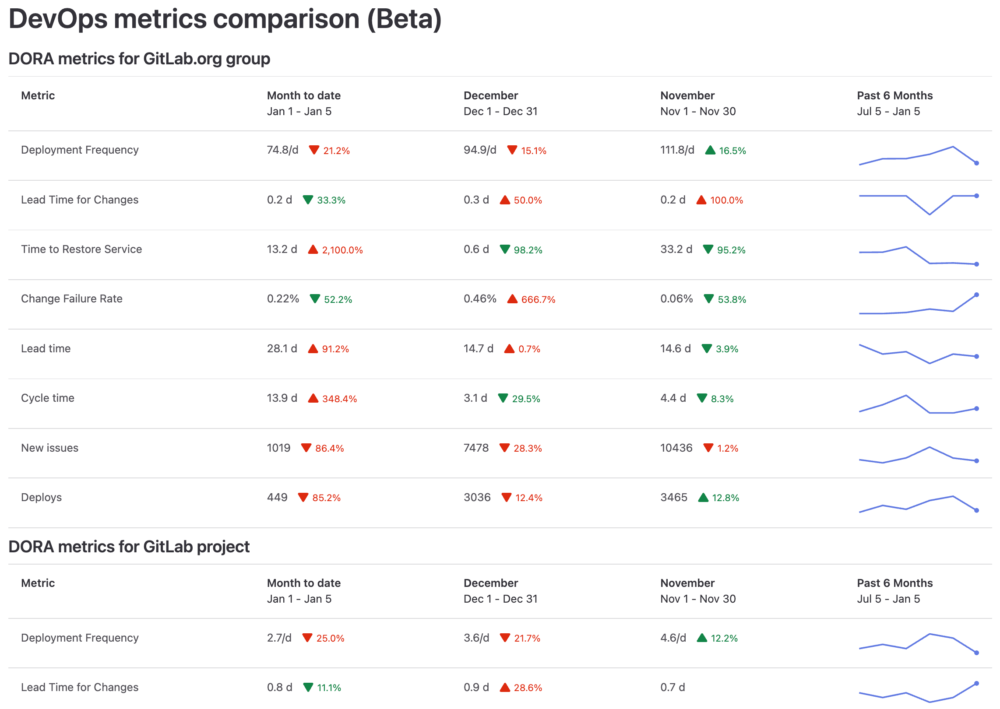

# Value Streams Dashboard (Beta) **(ULTIMATE)**

> - Introduced in GitLab 15.8 as a Closed [Beta](../../policy/alpha-beta-support.md#beta) feature [with a flag](../../administration/feature_flags.md) named `group_analytics_dashboards_page`. Disabled by default.
> - Released in GitLab 15.11 as an Open [Beta](../../policy/alpha-beta-support.md#beta) feature [with a flag](../../administration/feature_flags.md) named `group_analytics_dashboards_page`. Enabled by default.
> - [Generally available](https://gitlab.com/gitlab-org/gitlab/-/issues/392734) in GitLab 16.0. Feature flag `group_analytics_dashboards_page` removed.

You can leave feedback on dashboard bugs or functionality in [issue 381787](https://gitlab.com/gitlab-org/gitlab/-/issues/381787).

The Value Streams Dashboard is a customizable dashboard that enables decision-makers to identify trends, patterns, and opportunities for digital transformation improvements.
This page is a work in progress, and we're updating the information as we add more features.
For more information, see the [Value Stream Management category direction page](https://about.gitlab.com/direction/plan/value_stream_management/).

## Initial use case

Our initial use case is focused on providing the ability to compare software delivery metrics.
This comparison can help decision-makers understand whether projects and groups are improving.

The beta version of the Value Streams Dashboard includes the following metrics:

- [DORA metrics](dora_metrics.md)
- [Value Stream Analytics (VSA) - flow metrics](../group/value_stream_analytics/index.md)

The Value Streams Dashboard allows you to:

- Aggregate data records from different APIs.
- Track software performance (DORA) and flow of value (VSA) across the organization.

## DevOps metrics comparison

The DevOps metrics comparison displays DORA4 and flow metrics for a group or project in the
month-to-date, last month, the month before, and the past 180 days.

This visualization helps you get a high-level custom view over multiple DevOps metrics and
understand whether they're improving month over month. You can compare the performance between
groups, projects, and teams at a glance. This visualization helps you identify the teams and projects
that are the largest value contributors, overperforming, or underperforming.

You can also drill down the metrics for further analysis.
When you hover over a metric, a tooltip displays an explanation of the metric and a link to the related documentation page.

## View the value streams dashboard

Prerequisite:

- To view the value streams dashboard for a group, you must have at least the Reporter role for the group.

To view the value streams dashboard:

1. On the top bar, select **Main menu**, and:
   - For a project, select **Projects** and find your project.
   - For a group, select **Groups** and find your group.
1. On the left sidebar, select **Analytics > Value stream**.
1. Below the **Filter results** text box, in the **Key metrics** row, select **Value Streams Dashboard | DORA**.
1. Optional. To open the new page, append this path `/analytics/dashboards/value_streams_dashboard` to the group URL
(for example, `https://gitlab.com/groups/gitlab-org/-/analytics/dashboards/value_streams_dashboard`).

## Customize the dashboard panels

You can customize the Value Streams Dashboard and configure what subgroups and projects to include in the page.

A view can display maximum four subgroups or projects.

To display multiple subgroups and projects, specify their path as a URL parameter.

For example, the parameter `query=gitlab-org/gitlab-foss,gitlab-org/gitlab,gitlab-org/gitlab-design,gitlab-org/gitlab-docs` displays three separate panels, one each for the:

- `gitlab-org` group
- `gitlab-ui` project
- `gitlab-org/plan-stage` subgroup

## Dashboard metrics and drill-down reports

| Metric | Description | Drill-down report | Documentation page |
| ------ | ----------- | --------------- | ------------------ |
| Deployment frequency | Average number of deployments to production per day. This metric measures how often value is delivered to end users. | [Deployment frequency tab](https://gitlab.com/groups/gitlab-org/-/analytics/ci_cd?tab=deployment-frequency) | [Deployment frequency](dora_metrics.md#deployment-frequency) |
| Lead time for changes | The time to successfully deliver a commit into production. This metric reflects the efficiency of CI/CD pipelines. | [Lead time tab](https://gitlab.com/groups/gitlab-org/-/analytics/ci_cd?tab=lead-time) | [Lead time for changes](dora_metrics.md#lead-time-for-changes) |
| Time to restore service | The time it takes an organization to recover from a failure in production. | [Time to restore service tab](https://gitlab.com/groups/gitlab-org/-/analytics/ci_cd?tab=time-to-restore-service) | [Time to restore service](dora_metrics.md#time-to-restore-service) |
| Change failure rate | Percentage of deployments that cause an incident in production. | [Change failure rate tab](https://gitlab.com/groups/gitlab-org/-/analytics/ci_cd?tab=change-failure-rate) | [Change failure rate](dora_metrics.md#change-failure-rate) |
| Lead time | Median time from issue created to issue closed. | [Value Stream Analytics](https://gitlab.com/groups/gitlab-org/-/analytics/value_stream_analytics) | [View the lead time and cycle time for issues](../group/value_stream_analytics/index.md#key-metrics) |
| Cycle time | Median time from the earliest commit of a linked issue's merge request to when that issue is closed. | [VSA overview](https://gitlab.com/groups/gitlab-org/-/analytics/value_stream_analytics) | [View the lead time and cycle time for issues](../group/value_stream_analytics/index.md#key-metrics) |
| New issues | Number of new issues created. | [Issue Analytics](https://gitlab.com/groups/gitlab-org/-/issues_analytics) | Issue analytics [for projects](issue_analytics.md) and [for groups](../../user/group/issues_analytics/index.md) |
| Number of deploys | Total number of deploys to production. | [Merge Request Analytics](https://gitlab.com/gitlab-org/gitlab/-/analytics/merge_request_analytics) | [Merge request analytics](merge_request_analytics.md) |
