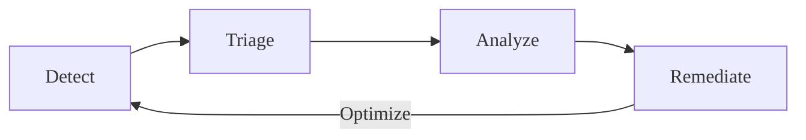



- Tier: Free, Premium, Ultimate
- Offering: GitLab.com, GitLab Self-Managed, GitLab Dedicated



GitLab application security testing provides continuous detection of vulnerabilities, during
development and after changes are deployed.

Application security testing scans your project's source code, dependencies, libraries, and
container images. Runtime vulnerabilities are detected through simulated attacks and fuzz testing
against your deployed application in a test environment.

During development, scans run automatically as part of CI/CD pipelines when code is committed or
merge requests are created. Security findings appear directly in merge requests and IDEs, notifying
developers before code is merged. This proactive approach reduces the cost and effort of fixing
issues later in development.

Outside the development cycle, you can run security scans on demand, or schedule them to run at
regular intervals. As vulnerability databases are updated with newly discovered threats and zero-day
exploits, new risks to your project's software libraries and container images are identified.
Together, these methods identify risks that weren't previously known during the original development
cycle.

For a click-through demo, see [Integrating security to the pipeline](https://gitlab.navattic.com/gitlab-scans).
<!-- Demo published on 2024-01-15 -->

## Vulnerability management cycle

GitLab enables a comprehensive vulnerability management workflow that helps you continuously
improve your application security posture. This workflow is an ongoing cycle of detection,
triage, analysis, remediation, and optimization.

1. Detect - Identify vulnerabilities through automated security testing.
1. Triage - Evaluate and prioritize vulnerabilities to determine which need immediate attention and
   which can be addressed later.
1. Analyze - Conduct detailed analysis of confirmed vulnerabilities to understand their impact and
   determine appropriate remediation strategies.
1. Remediate - Fix the root cause of vulnerabilities or implement appropriate risk mitigation
   measures.

Use results from each phase to improve the next cycle. For example, adjust detection rules to reduce
false positives identified during analysis.

This cycle repeats with each code change, allowing you to incrementally improve both your
application security and your vulnerability management processes. This continuous refinement means
your vulnerability management becomes more effective and efficient over time.
