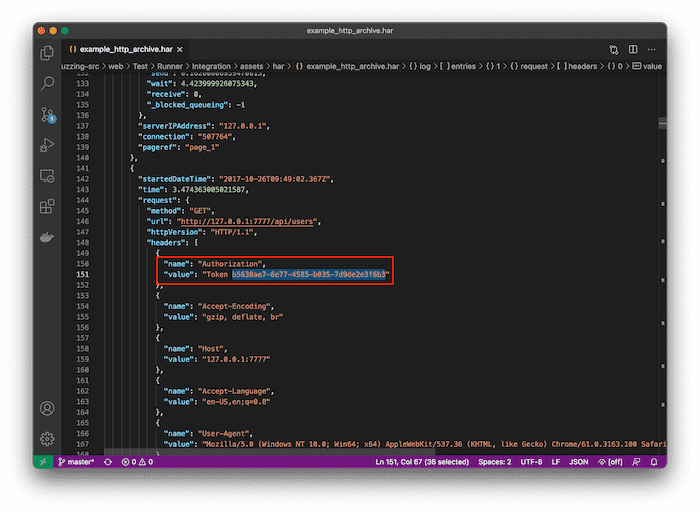

# HTTP Archive format **(ULTIMATE)**

HTTP Archive (HAR) format files are an industry standard for exchanging information about HTTP
requests and HTTP responses. A HAR file's content is JSON formatted, containing browser interactions
with a web site. The file extension `.har` is commonly used.

The HAR files can be used to perform [web API Fuzz Testing](index.md#http-archive-har) as part of
your [GitLab CI/CD](../../../ci/index.md) pipelines.

WARNING:
A HAR file stores information exchanged between web client and web server. It could also
store sensitive information such as authentication tokens, API keys, and session cookies. We
recommend that you review the HAR file contents before adding them to a repository.

## HAR file creation

You can create HAR files manually or by using a specialized tool for recording web sessions. We
recommend using a specialized tool. However, it is important to make sure files created by these
tools do not expose sensitive information, and can be safely used.

The following tools can be used generate a HAR file based on your network activity. They
automatically record your network activity and generate the HAR file:

1. [GitLab HAR Recorder](#gitlab-har-recorder).
1. [Insomnia API Client](#insomnia-api-client).
1. [Fiddler debugging proxy](#fiddler-debugging-proxy).
1. [Safari web browser](#safari-web-browser).
1. [Chrome web browser](#chrome-web-browser).
1. [Firefox web browser](#firefox-web-browser).

WARNING:
HAR files may contain sensitive information such as authentication tokens, API keys, and
session cookies. We recommend that you review the HAR file contents before adding them to a
repository.

### GitLab HAR Recorder

[GitLab HAR Recorder](https://gitlab.com/gitlab-org/security-products/har-recorder) is a command
line tool for recording HTTP messages and saving them to HTTP Archive (HAR) files. For more details
about the GitLab HAR Recorder, see the [homepage](https://gitlab.com/gitlab-org/security-products/har-recorder).

#### Install GitLab HAR Recorder

Prerequisites:

- Install Python 3.6 or greater.
- For Microsoft Windows, you must also install `Microsoft Visual C++ 14.0`. It's included with
  *Build Tools for Visual Studio* from [Visual Studio Downloads page](https://visualstudio.microsoft.com/downloads/).
- Install HAR Recorder.

Install GitLab HAR Recorder:

  ```shell
  pip install gitlab-har-recorder --extra-index-url https://gitlab.com/api/v4/projects/22441624/packages/pypi/simple
  ```

#### Create a HAR file with GitLab HAR Recorder

1. Start recorder with the proxy port and HAR filename.
1. Complete the browser actions, using the proxy.
   1. Make sure proxy is used!
1. Stop the recorder.

To verify the HAR contains all requests, use the [HAR Viewer (online)](http://www.softwareishard.com/har/viewer/).
[Google Admin Toolbox HAR Analyzer](https://toolbox.googleapps.com/apps/har_analyzer/)

### Insomnia API Client

[Insomnia API Client](https://insomnia.rest/) is an API design tool that among many uses, helps
you to design, describe, and test your API. You can also use it to generate HAR files that can be
used in [Web API Fuzz Testing](index.md#http-archive-har).

#### Create a HAR file with the Insomnia API Client

1. Define or import your API.
   - Postman v2.
   - Curl.
   - OpenAPI v2, v3.
1. Verify each API call works.
   - If you imported an OpenAPI specification, go through and add working data.
1. Select **API > Import/Export**.
1. Select **Export Data > Current Workspace**.
1. Select requests to include in the HAR file.
1. Select **Export**.
1. In the **Select Export Type** dropdown select **HAR -- HTTP Archive Format**.
1. Select **Done**.
1. Enter a location and filename for the HAR file.

### Fiddler debugging proxy

[Fiddler](https://www.telerik.com/fiddler) is a web debugger tool. It captures HTTP and HTTP(S)
network traffic and allows you to examine each request. It also lets you export the requests and
responses in HAR format.

#### Create a HAR file with Fiddler

1. Go to the [Fiddler home page](https://www.telerik.com/fiddler) and sign in. If you don't already
have an account, first create an account.
1. Browse pages that call an API. Fiddler automatically captures the requests.
1. Select one or more requests, then from the context menu, select **Export > Selected Sessions**.
1. In the **Choose Format** dropdown select **HTTPArchive v1.2**.
1. Enter a filename and select **Save**.

Fiddler shows a popup message confirming the export has succeeded.

### Safari web browser

[Safari](https://www.apple.com/safari/) is a web browser maintained by Apple. As web development
evolves, browsers support new capabilities. With Safari you can explore network traffic and
export it as a HAR file.

#### Create a HAR file with Safari

Prerequisites:

- Enable the `Develop` menu item.
  1. Open Safari's preferences. Press <kbd>Command</kbd>+<kbd>,</kbd> or from the menu, select
     **Safari > Preferences...**.
  1. Select **Advanced** tab, then select `Show Develop menu item in menu bar`.
  1. Close the **Preferences** window.

1. Open the **Web Inspector**. Press <kbd>Option</kbd>+<kbd>Command</kbd>+<kbd>i</kbd>, or from the
   menu, select **Develop > Show Web Inspector**.
1. Select the **Network** tab, and select **Preserve Log**.
1. Browse pages that call the API.
1. Open the **Web Inspector** and select the **Network** tab
1. Right-click on the request to export and select **Export HAR**.
1. Enter a filename and select **Save**.

### Chrome web browser

[Chrome](https://www.google.com/chrome/) is a web browser maintained by Google. As web development
evolves, browsers support new capabilities. With Chrome you can explore network traffic and
export it as a HAR file.

#### Create a HAR file with Chrome

1. From the Chrome context menu, select **Inspect**.
1. Select the **Network** tab.
1. Select **Preserve log**.
1. Browse pages that call the API.
1. Select one or more requests.
1. Right click and select **Save all as HAR with content**.
1. Enter a filename and select **Save**.
1. To append additional requests, select and save them to the same file.

### Firefox Web Browser

[Firefox](https://www.mozilla.org/en-US/firefox/new/) is a web browser maintained by Mozilla. As web
development evolves, browsers support new capabilities. With Firefox you can explore network traffic
and export it as a HAR file.

#### Create a HAR file with Firefox

1. From the Firefox context menu, select **Inspect**.
1. Select the **Network** tab.
1. Browse pages that call the API.
1. Check the **Network** tab and confirm requests are being recorded. If there is a message
   `Perform a request or Reload the page to see detailed information about network activity`,
   select **Reload** to start recording requests.
1. Select one or more requests.
1. Right click and select **Save All As HAR**.
1. Enter a filename and select **Save**.
1. To append additional requests, select and save them to the same file.

## HAR verification

Before using HAR files it's important to make sure they don't expose any sensitive information.

For each HAR file you should:

- View the HAR file's content
- Review the HAR file for sensitive information
- Edit or remove sensitive information

### View HAR file contents

We recommend viewing a HAR file's content in a tool that can present its content in a structured
way. Several HAR file viewers are available online. If you would prefer not to upload the HAR file,
you can use a tool installed on your computer. HAR files used JSON format, so can also be viewed in
a text editor.

Tools recommended for viewing HAR files include:

- [HAR Viewer](http://www.softwareishard.com/har/viewer/) - (online)
- [Google Admin Toolbox HAR Analyzer](https://toolbox.googleapps.com/apps/har_analyzer/) - (online)
- [Fiddler](https://www.telerik.com/fiddler) - local
- [Insomnia API Client](https://insomnia.rest/) - local

## Review HAR file content

Review the HAR file for any of the following:

- Information that could help to grant access to your application, for example: authentication
  tokens, authentication tokens, cookies, API keys.
- [Personally Identifiable Information (PII)](https://en.wikipedia.org/wiki/Personal_data).

We strongly recommended that you [edit or remove it](#edit-or-remove-sensitive-information) any
sensitive information.

Use the following as a checklist to start with. Note that it's not an exhaustive list.

- Look for secrets. For example: if your application requires authentication, check common locations
  or authentication information:
  - Authentication related headers. For example: cookies, authorization. These headers could contain
    valid information.
  - A request related to authentication. The body of these requests might contain information such
    as user credentials or tokens.
  - Session tokens. Session tokens could grant access to your application. The location of these
    token could vary. They could be in headers, query parameters or body.
- Look for Personally Identifiable Information
  - For example, if your application retrieves a list of users and their personal data: phones,
    names, emails.
  - Authentication information might also contain personal information.

## Edit or remove sensitive information

Edit or remove sensitive information found during the [HAR file content review](#review-har-file-content).
HAR files are JSON files and can be edited in any text editor.

After editing the HAR file, open it in a HAR file viewer to verify its formatting and structure are
intact.

The following example demonstrates use of [Visual Studio Code](https://code.visualstudio.com/) text
editor to edit an Authorization token found in a header.


