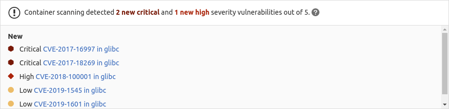

# Container Scanning **(ULTIMATE)**

> [Introduced](https://gitlab.com/gitlab-org/gitlab/-/merge_requests/3672) in [GitLab Ultimate](https://about.gitlab.com/pricing/) 10.4.

WARNING:
Versions of GitLab prior to 14.0 used Clair as the default container scanning engine. GitLab 14.0
removes Clair from the product and replaces it with two new scanners. If you
run container scanning with the default settings, GitLab switches you seamlessly and automatically
to Trivy in GitLab 14.0. However, if you customized the variables in your container scanning job,
you should review the [migration guide](#change-scanners)
and make any necessary updates.

Your application's Docker image may itself be based on Docker images that contain known
vulnerabilities. By including an extra job in your pipeline that scans for those vulnerabilities and
displays them in a merge request, you can use GitLab to audit your Docker-based apps.

GitLab provides integration with open-source tools for vulnerability static analysis in containers:

- [Trivy](https://github.com/aquasecurity/trivy)
- [Grype](https://github.com/anchore/grype)

To integrate GitLab with security scanners other than those listed here, see
[Security scanner integration](../../../development/integrations/secure.md).

You can enable container scanning by doing one of the following:

- [Include the CI job](#configuration) in your existing `.gitlab-ci.yml` file.
- Implicitly use [Auto Container Scanning](../../../topics/autodevops/stages.md#auto-container-scanning),
  provided by [Auto DevOps](../../../topics/autodevops/index.md).

GitLab compares the found vulnerabilities between the source and target branches, and shows the
information directly in the merge request.



## Requirements

To enable container scanning in your pipeline, you need the following:

- [GitLab Runner](https://docs.gitlab.com/runner/) with the [`docker`](https://docs.gitlab.com/runner/executors/docker.html)
  or [`kubernetes`](https://docs.gitlab.com/runner/install/kubernetes.html) executor.
- Docker `18.09.03` or higher installed on the same computer as the runner. If you're using the
  shared runners on GitLab.com, then this is already the case.
- An image matching the [supported distributions](#supported-distributions).
- [Build and push](../../packages/container_registry/index.md#build-and-push-by-using-gitlab-cicd)
  the Docker image to your project's container registry. If using a third-party container
  registry, you might need to provide authentication credentials using the `DOCKER_USER` and
  `DOCKER_PASSWORD` [configuration variables](#available-cicd-variables).
- The name of the Docker image to scan, in the `DOCKER_IMAGE` [configuration variable](#available-cicd-variables).

## Configuration

How you enable container scanning depends on your GitLab version:

- GitLab 11.9 and later: [Include](../../../ci/yaml/index.md#includetemplate) the
  [`Container-Scanning.gitlab-ci.yml` template](https://gitlab.com/gitlab-org/gitlab/-/blob/master/lib/gitlab/ci/templates/Security/Container-Scanning.gitlab-ci.yml)
  that comes with your GitLab installation.
- GitLab versions earlier than 11.9: Copy and use the job from the
  [`Container-Scanning.gitlab-ci.yml` template](https://gitlab.com/gitlab-org/gitlab/-/blob/master/lib/gitlab/ci/templates/Security/Container-Scanning.gitlab-ci.yml).

Other changes:

- GitLab 13.6 [introduced](https://gitlab.com/gitlab-org/gitlab/-/issues/263482) better support for
  [FIPS](https://csrc.nist.gov/publications/detail/fips/140/2/final) by upgrading the
  `CS_MAJOR_VERSION` from `2` to `3`. Version `3` of the `container_scanning` Docker image uses
  [`centos:centos8`](https://hub.docker.com/_/centos)
  as the new base. It also removes the use of the [start.sh](https://gitlab.com/gitlab-org/security-products/analyzers/klar/-/merge_requests/77)
  script and instead executes the analyzer by default. Any customizations made to the
  `container_scanning` job's [`before_script`](../../../ci/yaml/index.md#before_script)
  and [`after_script`](../../../ci/yaml/index.md#after_script)
  blocks may not work with the new version. To roll back to the previous [`alpine:3.11.3`](https://hub.docker.com/_/alpine)-based
  Docker image, you can specify the major version through the [`CS_MAJOR_VERSION`](#available-cicd-variables)
  variable.
- GitLab 13.9 [introduced](https://gitlab.com/gitlab-org/gitlab/-/issues/322656) integration with
  [Trivy](https://github.com/aquasecurity/trivy) by upgrading `CS_MAJOR_VERSION` from `3` to `4`.
- GitLab 14.0 [introduced](https://gitlab.com/gitlab-org/gitlab/-/merge_requests/61850)
  an integration with [Trivy](https://github.com/aquasecurity/trivy)
  as the default for container scanning, and also [introduced](https://gitlab.com/gitlab-org/gitlab/-/issues/326279)
  an integration with [Grype](https://github.com/anchore/grype)
  as an alternative scanner.

To include the `Container-Scanning.gitlab-ci.yml` template (GitLab 11.9 and later), add the
following to your `.gitlab-ci.yml` file:

```yaml
include:
  - template: Security/Container-Scanning.gitlab-ci.yml
```

The included template:

- Creates a `container_scanning` job in your CI/CD pipeline.
- Pulls the built Docker image from your project's [container registry](../../packages/container_registry/index.md)
  (see [requirements](#requirements)) and scans it for possible vulnerabilities.

GitLab saves the results as a
[Container Scanning report artifact](../../../ci/yaml/index.md#artifactsreportscontainer_scanning)
that you can download and analyze later. When downloading, you always receive the most-recent
artifact.

The following is a sample `.gitlab-ci.yml` that builds your Docker image, pushes it to the container
registry, and scans the image:

```yaml
build:
  image: docker:latest
  stage: build
  services:
    - docker:dind
  variables:
    IMAGE: $CI_REGISTRY_IMAGE/$CI_COMMIT_REF_SLUG:$CI_COMMIT_SHA
  script:
    - docker info
    - docker login -u "$CI_REGISTRY_USER" -p "$CI_REGISTRY_PASSWORD" $CI_REGISTRY
    - docker build -t $IMAGE .
    - docker push $IMAGE

include:
  - template: Security/Container-Scanning.gitlab-ci.yml
```

### Customizing the container scanning settings

There may be cases where you want to customize how GitLab scans your containers. For example, you
may want to enable more verbose output, access a Docker registry that requires
authentication, and more. To change such settings, use the [`variables`](../../../ci/yaml/index.md#variables)
parameter in your `.gitlab-ci.yml` to set [CI/CD variables](#available-cicd-variables).
The variables you set in your `.gitlab-ci.yml` overwrite those in
`Container-Scanning.gitlab-ci.yml`.

This example [includes](../../../ci/yaml/index.md#include) the container scanning template and
enables verbose output for the analyzer:

```yaml
include:
  - template: Security/Container-Scanning.gitlab-ci.yml

variables:
    SECURE_LOG_LEVEL: 'debug'
```

#### Available CI/CD variables

You can [configure](#customizing-the-container-scanning-settings) analyzers by using the following CI/CD variables:

| CI/CD Variable                 | Default       | Description | Scanner |
| ------------------------------ | ------------- | ----------- | ------------ |
| `ADDITIONAL_CA_CERT_BUNDLE`    | `""`          | Bundle of CA certs that you want to trust. See [Using a custom SSL CA certificate authority](#using-a-custom-ssl-ca-certificate-authority) for more details. | All |
| `CI_APPLICATION_REPOSITORY`    | `$CI_REGISTRY_IMAGE/$CI_COMMIT_REF_SLUG` | Docker repository URL for the image to be scanned. | All |
| `CI_APPLICATION_TAG`           | `$CI_COMMIT_SHA` | Docker repository tag for the image to be scanned. | All |
| `CS_ANALYZER_IMAGE`            | `registry.gitlab.com/security-products/container-scanning:4` | Docker image of the analyzer. | All |
| `CS_DOCKER_INSECURE`           | `"false"`     | Allow access to secure Docker registries using HTTPS without validating the certificates. | All |
| `CS_REGISTRY_INSECURE`         | `"false"`     | Allow access to insecure registries (HTTP only). Should only be set to `true` when testing the image locally. | Trivy. The registry must listen on port `80/tcp`. |
| `CS_SEVERITY_THRESHOLD`        | `UNKNOWN`     | Severity level threshold. The scanner outputs vulnerabilities with severity level higher than or equal to this threshold. Supported levels are Unknown, Low, Medium, High, and Critical. | Trivy |
| `DOCKER_IMAGE`                 | `$CI_APPLICATION_REPOSITORY:$CI_APPLICATION_TAG` | The Docker image to be scanned. If set, this variable overrides the `$CI_APPLICATION_REPOSITORY` and `$CI_APPLICATION_TAG` variables. | All |
| `DOCKER_PASSWORD`              | `$CI_REGISTRY_PASSWORD` | Password for accessing a Docker registry requiring authentication. | All |
| `DOCKER_USER`                  | `$CI_REGISTRY_USER` | Username for accessing a Docker registry requiring authentication. | All |
| `DOCKERFILE_PATH`              | `Dockerfile`  | The path to the `Dockerfile` to use for generating remediations. By default, the scanner looks for a file named `Dockerfile` in the root directory of the project. You should configure this variable only if your `Dockerfile` is in a non-standard location, such as a subdirectory. See [Solutions for vulnerabilities](#solutions-for-vulnerabilities-auto-remediation) for more details. | All |
| `SECURE_LOG_LEVEL`             | `info`        | Set the minimum logging level. Messages of this logging level or higher are output. From highest to lowest severity, the logging levels are: `fatal`, `error`, `warn`, `info`, `debug`. [Introduced](https://gitlab.com/gitlab-org/gitlab/-/issues/10880) in GitLab 13.1. | All |

### Supported distributions

Support depends on the scanner:

- [Grype](https://github.com/anchore/grype#grype)
- [Trivy](https://aquasecurity.github.io/trivy/latest/vuln-detection/os/) (Default).

### Overriding the container scanning template

If you want to override the job definition (for example, to change properties like `variables`), you
must declare and override a job after the template inclusion, and then
specify any additional keys.

This example sets `GIT_STRATEGY` to `fetch`:

```yaml
include:
  - template: Security/Container-Scanning.gitlab-ci.yml

container_scanning:
  variables:
    GIT_STRATEGY: fetch
```

### Change scanners

The container-scanning analyzer can use different scanners, depending on the value of the
`CS_ANALYZER_IMAGE` configuration variable.

The following options are available:

| Scanner name | `CS_ANALYZER_IMAGE` |
| ------------ | ------------------- |
| Default ([Trivy](https://github.com/aquasecurity/trivy)) | `registry.gitlab.com/security-products/container-scanning:4` |
| [Grype](https://github.com/anchore/grype)                | `registry.gitlab.com/security-products/container-scanning/grype:4` |
| Trivy                                                    | `registry.gitlab.com/security-products/container-scanning/trivy:4` |

If you're migrating from a GitLab 13.x release to a GitLab 14.x release and have customized the
`container_scanning` job or its CI variables, you might need to perform these migration steps in
your CI file:

1. Remove these variables:

   - `CS_MAJOR_VERSION`
   - `CS_PROJECT`
   - `SECURE_ANALYZERS_PREFIX`

1. Review the `CS_ANALYZER_IMAGE` variable. It no longer depends on the variables above and its new
   default value is `registry.gitlab.com/security-products/container-scanning:4`. If you have an
   offline environment, see
   [Running container scanning in an offline environment](#running-container-scanning-in-an-offline-environment).

1. If present, remove the `.cs_common` and `container_scanning_new` configuration sections.

1. If the `container_scanning` section is present, it's safer to create one from scratch based on
   the new version of the [`Container-Scanning.gitlab-ci.yml` template](https://gitlab.com/gitlab-org/gitlab/-/blob/master/lib/gitlab/ci/templates/Security/Container-Scanning.gitlab-ci.yml).
   Once finished, it should not have any variables that are only applicable to Klar or Clair. For a
   complete list of supported variables, see [available variables](#available-cicd-variables).

1. Make any [necessary customizations](#customizing-the-container-scanning-settings)
   to the chosen scanner. We recommend that you minimize such customizations, as they might require
   changes in future GitLab major releases.

1. Trigger a new run of a pipeline that includes the `container_scanning` job. Inspect the job
   output and ensure that the log messages do not mention Clair.

NOTE:
Prior to the GitLab 14.0 release, any variable defined under the scope `container_scanning` is not
considered for scanners other than Clair. In GitLab 14.0 and later, all variables can be defined
either as a global variable or under `container_scanning`.

### Using a custom SSL CA certificate authority

You can use the `ADDITIONAL_CA_CERT_BUNDLE` CI/CD variable to configure a custom SSL CA certificate authority, which is used to verify the peer when fetching Docker images from a registry which uses HTTPS. The `ADDITIONAL_CA_CERT_BUNDLE` value should contain the [text representation of the X.509 PEM public-key certificate](https://tools.ietf.org/html/rfc7468#section-5.1). For example, to configure this value in the `.gitlab-ci.yml` file, use the following:

```yaml
container_scanning:
  variables:
    ADDITIONAL_CA_CERT_BUNDLE: |
        -----BEGIN CERTIFICATE-----
        MIIGqTCCBJGgAwIBAgIQI7AVxxVwg2kch4d56XNdDjANBgkqhkiG9w0BAQsFADCB
        ...
        jWgmPqF3vUbZE0EyScetPJquRFRKIesyJuBFMAs=
        -----END CERTIFICATE-----
```

The `ADDITIONAL_CA_CERT_BUNDLE` value can also be configured as a [custom variable in the UI](../../../ci/variables/index.md#custom-cicd-variables), either as a `file`, which requires the path to the certificate, or as a variable, which requires the text representation of the certificate.

### Vulnerability allowlisting

To allowlist specific vulnerabilities, follow these steps:

1. Set `GIT_STRATEGY: fetch` in your `.gitlab-ci.yml` file by following the instructions in
   [overriding the container scanning template](#overriding-the-container-scanning-template).
1. Define the allowlisted vulnerabilities in a YAML file named `vulnerability-allowlist.yml`. This must use
   the format described in [`vulnerability-allowlist.yml` data format](#vulnerability-allowlistyml-data-format).
1. Add the `vulnerability-allowlist.yml` file to the root folder of your project's Git repository.

#### vulnerability-allowlist.yml data format

The `vulnerability-allowlist.yml` file is a YAML file that specifies a list of CVE IDs of vulnerabilities that are **allowed** to exist, because they're _false positives_, or they're _not applicable_.

If a matching entry is found in the `vulnerability-allowlist.yml` file, the following happens:

- The vulnerability **is not included** when the analyzer generates the `gl-container-scanning-report.json` file.
- The Security tab of the pipeline **does not show** the vulnerability. It is not included in the JSON file, which is the source of truth for the Security tab.

Example `vulnerability-allowlist.yml` file:

```yaml
generalallowlist:
  CVE-2019-8696:
  CVE-2014-8166: cups
  CVE-2017-18248:
images:
  registry.gitlab.com/gitlab-org/security-products/dast/webgoat-8.0@sha256:
    CVE-2018-4180:
  your.private.registry:5000/centos:
    CVE-2015-1419: libxml2
    CVE-2015-1447:
```

This example excludes from `gl-container-scanning-report.json`:

1. All vulnerabilities with CVE IDs: _CVE-2019-8696_, _CVE-2014-8166_, _CVE-2017-18248_.
1. All vulnerabilities found in the `registry.gitlab.com/gitlab-org/security-products/dast/webgoat-8.0@sha256` container image with CVE ID _CVE-2018-4180_.
1. All vulnerabilities found in `your.private.registry:5000/centos` container with CVE IDs _CVE-2015-1419_, _CVE-2015-1447_.

##### File format

- `generalallowlist` block allows you to specify CVE IDs globally. All vulnerabilities with matching CVE IDs are excluded from the scan report.

- `images` block allows you to specify CVE IDs for each container image independently. All vulnerabilities from the given image with matching CVE IDs are excluded from the scan report. The image name is retrieved from one of the environment variables used to specify the Docker image to be scanned, such as `$CI_APPLICATION_REPOSITORY:$CI_APPLICATION_TAG` or `DOCKER_IMAGE`. The image provided in this block **must** match this value and **must not** include the tag value. For example, if you specify the image to be scanned using `DOCKER_IMAGE=alpine:3.7`, then you would use `alpine` in the `images` block, but you cannot use `alpine:3.7`.

  You can specify container image in multiple ways:

  - as image name only (such as `centos`).
  - as full image name with registry hostname (such as `your.private.registry:5000/centos`).
  - as full image name with registry hostname and sha256 label (such as `registry.gitlab.com/gitlab-org/security-products/dast/webgoat-8.0@sha256`).

NOTE:
The string after CVE ID (`cups` and `libxml2` in the previous example) is an optional comment format. It has **no impact** on the handling of vulnerabilities. You can include comments to describe the vulnerability.

##### Container scanning job log format

You can verify the results of your scan and the correctness of your `vulnerability-allowlist.yml` file by looking
at the logs that are produced by the container scanning analyzer in `container_scanning` job details.

The log contains a list of found vulnerabilities as a table, for example:

```plaintext
+------------+-------------------------+------------------------+-----------------------+------------------------------------------------------------------------+
|   STATUS   |      CVE SEVERITY       |      PACKAGE NAME      |    PACKAGE VERSION    |                            CVE DESCRIPTION                             |
+------------+-------------------------+------------------------+-----------------------+------------------------------------------------------------------------+
|  Approved  |   High CVE-2019-3462    |          apt           |         1.4.8         | Incorrect sanitation of the 302 redirect field in HTTP transport metho |
|            |                         |                        |                       | d of apt versions 1.4.8 and earlier can lead to content injection by a |
|            |                         |                        |                       |  MITM attacker, potentially leading to remote code execution on the ta |
|            |                         |                        |                       |                             rget machine.                              |
+------------+-------------------------+------------------------+-----------------------+------------------------------------------------------------------------+
| Unapproved |  Medium CVE-2020-27350  |          apt           |         1.4.8         | APT had several integer overflows and underflows while parsing .deb pa |
|            |                         |                        |                       | ckages, aka GHSL-2020-168 GHSL-2020-169, in files apt-pkg/contrib/extr |
|            |                         |                        |                       | acttar.cc, apt-pkg/deb/debfile.cc, and apt-pkg/contrib/arfile.cc. This |
|            |                         |                        |                       |  issue affects: apt 1.2.32ubuntu0 versions prior to 1.2.32ubuntu0.2; 1 |
|            |                         |                        |                       | .6.12ubuntu0 versions prior to 1.6.12ubuntu0.2; 2.0.2ubuntu0 versions  |
|            |                         |                        |                       | prior to 2.0.2ubuntu0.2; 2.1.10ubuntu0 versions prior to 2.1.10ubuntu0 |
|            |                         |                        |                       |                                  .1;                                   |
+------------+-------------------------+------------------------+-----------------------+------------------------------------------------------------------------+
| Unapproved |  Medium CVE-2020-3810   |          apt           |         1.4.8         | Missing input validation in the ar/tar implementations of APT before v |
|            |                         |                        |                       | ersion 2.1.2 could result in denial of service when processing special |
|            |                         |                        |                       |                         ly crafted deb files.                          |
+------------+-------------------------+------------------------+-----------------------+------------------------------------------------------------------------+
```

Vulnerabilities in the log are marked as `Approved` when the corresponding CVE ID is added to the `vulnerability-allowlist.yml` file.

### Running container scanning in an offline environment

For self-managed GitLab instances in an environment with limited, restricted, or intermittent access
to external resources through the internet, some adjustments are required for the container scanning job to
successfully run. For more information, see [Offline environments](../offline_deployments/index.md).

#### Requirements for offline container Scanning

To use container scanning in an offline environment, you need:

- GitLab Runner with the [`docker` or `kubernetes` executor](#requirements).
- To configure a local Docker container registry with copies of the container scanning images. You
  can find these images in their respective registries:

| GitLab Analyzer | Container Registry |
| --- | --- |
| [Container-Scanning](https://gitlab.com/gitlab-org/security-products/analyzers/container-scanning) | [Container-Scanning container registry](https://gitlab.com/security-products/container-scanning/container_registry/) |

Note that GitLab Runner has a [default `pull policy` of `always`](https://docs.gitlab.com/runner/executors/docker.html#using-the-always-pull-policy),
meaning the runner tries to pull Docker images from the GitLab container registry even if a local
copy is available. The GitLab Runner [`pull_policy` can be set to `if-not-present`](https://docs.gitlab.com/runner/executors/docker.html#using-the-if-not-present-pull-policy)
in an offline environment if you prefer using only locally available Docker images. However, we
recommend keeping the pull policy setting to `always` if not in an offline environment, as this
enables the use of updated scanners in your CI/CD pipelines.

##### Support for Custom Certificate Authorities

Support for custom certificate authorities was introduced in the following versions:

| Scanner | Version |
| -------- | ------- |
| `Trivy` | [4.0.0](https://gitlab.com/gitlab-org/security-products/analyzers/container-scanning/-/releases/4.0.0) |
| `Grype` | [4.3.0](https://gitlab.com/gitlab-org/security-products/analyzers/container-scanning/-/releases/4.3.0) |

#### Make GitLab container scanning analyzer images available inside your Docker registry

For container scanning, import the following images from `registry.gitlab.com` into your
[local Docker container registry](../../packages/container_registry/index.md):

```plaintext
registry.gitlab.com/security-products/container-scanning:4
registry.gitlab.com/security-products/container-scanning/grype:4
registry.gitlab.com/security-products/container-scanning/trivy:4
```

The process for importing Docker images into a local offline Docker registry depends on
**your network security policy**. Please consult your IT staff to find an accepted and approved
process by which you can import or temporarily access external resources. These scanners
are [periodically updated](../vulnerabilities/index.md#vulnerability-scanner-maintenance),
and you may be able to make occasional updates on your own.

For more information, see [the specific steps on how to update an image with a pipeline](#automating-container-scanning-vulnerability-database-updates-with-a-pipeline).

For details on saving and transporting Docker images as a file, see Docker's documentation on
[`docker save`](https://docs.docker.com/engine/reference/commandline/save/), [`docker load`](https://docs.docker.com/engine/reference/commandline/load/),
[`docker export`](https://docs.docker.com/engine/reference/commandline/export/), and [`docker import`](https://docs.docker.com/engine/reference/commandline/import/).

#### Set container scanning CI/CD variables to use local container scanner analyzers

1. [Override the container scanning template](#overriding-the-container-scanning-template) in your `.gitlab-ci.yml` file to refer to the Docker images hosted on your local Docker container registry:

   ```yaml
   include:
     - template: Security/Container-Scanning.gitlab-ci.yml

   container_scanning:
     image: $CI_REGISTRY/namespace/gitlab-container-scanning
   ```

1. If your local Docker container registry is running securely over `HTTPS`, but you're using a
   self-signed certificate, then you must set `CS_DOCKER_INSECURE: "true"` in the above
   `container_scanning` section of your `.gitlab-ci.yml`.

#### Automating container scanning vulnerability database updates with a pipeline

We recommend that you set up a [scheduled pipeline](../../../ci/pipelines/schedules.md)
to fetch the latest vulnerabilities database on a preset schedule.
Automating this with a pipeline means you do not have to do it manually each time. You can use the
following `.gitlab-yml.ci` example as a template.

```yaml
variables:
  SOURCE_IMAGE: registry.gitlab.com/security-products/container-scanning:4
  TARGET_IMAGE: $CI_REGISTRY/namespace/gitlab-container-scanning

image: docker:stable

update-scanner-image:
  services:
    - docker:dind
  script:
    - docker pull $SOURCE_IMAGE
    - docker tag $SOURCE_IMAGE $TARGET_IMAGE
    - echo "$CI_REGISTRY_PASSWORD" | docker login $CI_REGISTRY --username $CI_REGISTRY_USER --password-stdin
    - docker push $TARGET_IMAGE
```

The above template works for a GitLab Docker registry running on a local installation. However, if
you're using a non-GitLab Docker registry, you must change the `$CI_REGISTRY` value and the
`docker login` credentials to match your local registry's details.

## Running the standalone container scanning tool

It's possible to run the [GitLab container scanning tool](https://gitlab.com/gitlab-org/security-products/analyzers/container-scanning)
against a Docker container without needing to run it within the context of a CI job. To scan an
image directly, follow these steps:

1. Run [Docker Desktop](https://www.docker.com/products/docker-desktop)
   or [Docker Machine](https://github.com/docker/machine).

1. Run the analyzer's Docker image, passing the image and tag you want to analyze in the
   `CI_APPLICATION_REPOSITORY` and `CI_APPLICATION_TAG` variables:

   ```shell
   docker run \
     --interactive --rm \
     --volume "$PWD":/tmp/app \
     -e CI_PROJECT_DIR=/tmp/app \
     -e CI_APPLICATION_REPOSITORY=registry.gitlab.com/gitlab-org/security-products/dast/webgoat-8.0@sha256 \
     -e CI_APPLICATION_TAG=bc09fe2e0721dfaeee79364115aeedf2174cce0947b9ae5fe7c33312ee019a4e \
     registry.gitlab.com/security-products/container-scanning
   ```

The results are stored in `gl-container-scanning-report.json`.

## Reports JSON format

The container scanning tool emits a JSON report file. For more information, see the
[schema for this report](https://gitlab.com/gitlab-org/security-products/security-report-schemas/-/blob/master/dist/container-scanning-report-format.json).

Here's an example container scanning report:

```json-doc
{
  "version": "3.0.0",
  "vulnerabilities": [
    {
      "id": "df52bc8ce9a2ae56bbcb0c4ecda62123fbd6f69b",
      "category": "container_scanning",
      "message": "CVE-2019-3462 in apt-1.4.8",
      "description": "Incorrect sanitation of the 302 redirect field in HTTP transport method of apt versions 1.4.8 and earlier can lead to content injection by a MITM attacker, potentially leading to remote code execution on the target machine.",
      "severity": "High",
      "confidence": "Unknown",
      "solution": "Upgrade apt from 1.4.8 to 1.4.9",
      "scanner": {
        "id": "trivy",
        "name": "trivy"
      },
      "location": {
        "dependency": {
          "package": {
            "name": "apt"
          },
          "version": "1.4.8"
        },
        "operating_system": "debian:9.4",
        "image": "registry.gitlab.com/gitlab-org/security-products/dast/webgoat-8.0@sha256:bc09fe2e0721dfaeee79364115aeedf2174cce0947b9ae5fe7c33312ee019a4e"
      },
      "identifiers": [
        {
          "type": "cve",
          "name": "CVE-2019-3462",
          "value": "CVE-2019-3462",
          "url": "http://www.securityfocus.com/bid/106690"
        }
      ],
      "links": [
        {
          "url": "http://www.securityfocus.com/bid/106690"
        },
        {
          "url": "https://cve.mitre.org/cgi-bin/cvename.cgi?name=CVE-2019-3462"
        },
        {
          "url": "https://lists.apache.org/thread.html/8338a0f605bdbb3a6098bb76f666a95fc2b2f53f37fa1ecc89f1146f@%3Cdevnull.infra.apache.org%3E"
        },
        {
          "url": "https://lists.debian.org/debian-lts-announce/2019/01/msg00013.html"
        },
        {
          "url": "https://lists.debian.org/debian-lts-announce/2019/01/msg00014.html"
        },
        {
          "url": "https://security.netapp.com/advisory/ntap-20190125-0002/"
        },
        {
          "url": "https://usn.ubuntu.com/3863-1/"
        },
        {
          "url": "https://usn.ubuntu.com/3863-2/"
        },
        {
          "url": "https://usn.ubuntu.com/usn/usn-3863-1"
        },
        {
          "url": "https://usn.ubuntu.com/usn/usn-3863-2"
        },
        {
          "url": "https://www.debian.org/security/2019/dsa-4371"
        }
      ]
    }
  ],
  "remediations": []
  "scan": {
    "scanner": {
      "id": "trivy",
      "name": "Trivy",
      "url": "https://github.com/aquasecurity/trivy/",
      "vendor": {
        "name": "GitLab"
      },
      "version": "0.16.0"
    },
    "type": "container_scanning",
    "start_time": "2021-04-14T19:45:58",
    "end_time": "2021-04-14T19:46:18",
    "status": "success"
  }
}
```

## Security Dashboard

The [Security Dashboard](../security_dashboard/index.md) shows you an overview of all
the security vulnerabilities in your groups, projects and pipelines.

## Vulnerabilities database update

If you use container scanning and want more information about the vulnerabilities database update,
see the [maintenance table](../vulnerabilities/index.md#vulnerability-scanner-maintenance).

## Interacting with the vulnerabilities

After a vulnerability is found, you can [address it](../vulnerabilities/index.md).

## Solutions for vulnerabilities (auto-remediation)

Some vulnerabilities can be fixed by applying the solution that GitLab
automatically generates.

To enable remediation support, the scanning tool _must_ have access to the `Dockerfile` specified by
the [`DOCKERFILE_PATH`](#available-cicd-variables) CI/CD variable. To ensure that the scanning tool
has access to this
file, it's necessary to set [`GIT_STRATEGY: fetch`](../../../ci/runners/configure_runners.md#git-strategy) in
your `.gitlab-ci.yml` file by following the instructions described in this document's
[overriding the container scanning template](#overriding-the-container-scanning-template) section.

Read more about the [solutions for vulnerabilities](../vulnerabilities/index.md#resolve-a-vulnerability).

## Troubleshooting

### `docker: Error response from daemon: failed to copy xattrs`

When the runner uses the `docker` executor and NFS is used
(for example, `/var/lib/docker` is on an NFS mount), container scanning might fail with
an error like the following:

```plaintext
docker: Error response from daemon: failed to copy xattrs: failed to set xattr "security.selinux" on /path/to/file: operation not supported.
```

This is a result of a bug in Docker which is now [fixed](https://github.com/containerd/continuity/pull/138 "fs: add WithAllowXAttrErrors CopyOpt").
To prevent the error, ensure the Docker version that the runner is using is
`18.09.03` or higher. For more information, see
[issue #10241](https://gitlab.com/gitlab-org/gitlab/-/issues/10241 "Investigate why Container Scanning is not working with NFS mounts").

### Getting warning message `gl-container-scanning-report.json: no matching files`

For information on this, see the [general Application Security troubleshooting section](../../../ci/pipelines/job_artifacts.md#error-message-no-files-to-upload).
