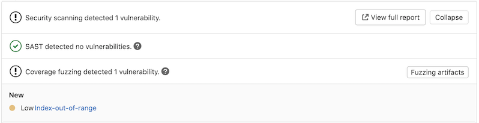

# Coverage Guided Fuzz Testing **(ULTIMATE)**

GitLab allows you to add coverage-guided fuzz testing to your pipelines. This helps you discover
bugs and potential security issues that other QA processes may miss. Coverage-guided fuzzing sends
random inputs to an instrumented version of your application in an effort to cause unexpected
behavior, such as a crash. Such behavior indicates a bug that you should address.

We recommend that you use fuzz testing in addition to the other security scanners in [GitLab Secure](../index.md)
and your own test processes. If you're using [GitLab CI/CD](../../../ci/index.md),
you can run your coverage-guided fuzz tests as part your CI/CD workflow. You can take advantage of
coverage-guided fuzzing by including the CI job in your existing `.gitlab-ci.yml` file.

## Supported fuzzing engines and languages

GitLab supports these languages through the fuzzing engine listed for each. We currently provide a
Docker image for apps written in Go, but you can test the other languages below by providing a
Docker image with the fuzz engine to run your app.

| Language | Fuzzing Engine | Example |
|----------|----------------|---------|
| C/C++    | [libFuzzer](https://llvm.org/docs/LibFuzzer.html) | [c-cpp-example](https://gitlab.com/gitlab-org/security-products/demos/coverage-fuzzing/c-cpp-fuzzing-example) |
| GoLang   | [go-fuzz (libFuzzer support)](https://github.com/dvyukov/go-fuzz) | [go-fuzzing-example](https://gitlab.com/gitlab-org/security-products/demos/coverage-fuzzing/go-fuzzing-example) |
| Swift    | [libFuzzer](https://github.com/apple/swift/blob/master/docs/libFuzzerIntegration.md) | [swift-fuzzing-example](https://gitlab.com/gitlab-org/security-products/demos/coverage-fuzzing/swift-fuzzing-example) |
| Rust     | [cargo-fuzz (libFuzzer support)](https://github.com/rust-fuzz/cargo-fuzz) | [rust-fuzzing-example](https://gitlab.com/gitlab-org/security-products/demos/coverage-fuzzing/rust-fuzzing-example) |
| Java     | [Javafuzz](https://gitlab.com/gitlab-org/security-products/analyzers/fuzzers/javafuzz) (recommended) | [javafuzz-fuzzing-example](https://gitlab.com/gitlab-org/security-products/demos/coverage-fuzzing/javafuzz-fuzzing-example) |
| Java     | [JQF](https://github.com/rohanpadhye/JQF) (not preferred) | [jqf-fuzzing-example](https://gitlab.com/gitlab-org/security-products/demos/coverage-fuzzing/java-fuzzing-example) |
| JavaScript | [`jsfuzz`](https://gitlab.com/gitlab-org/security-products/analyzers/fuzzers/jsfuzz)| [jsfuzz-fuzzing-example](https://gitlab.com/gitlab-org/security-products/demos/coverage-fuzzing/jsfuzz-fuzzing-example) |
| Python | [`pythonfuzz`](https://gitlab.com/gitlab-org/security-products/analyzers/fuzzers/pythonfuzz)| [pythonfuzz-fuzzing-example](https://gitlab.com/gitlab-org/security-products/demos/coverage-fuzzing/pythonfuzz-fuzzing-example) |
| AFL (any language that works on top of AFL)      | [AFL](https://lcamtuf.coredump.cx/afl/)| [afl-fuzzing-example](https://gitlab.com/gitlab-org/security-products/demos/coverage-fuzzing/afl-fuzzing-example) |

## Configuration

To enable fuzzing, you must
[include](../../../ci/yaml/index.md#includetemplate)
the [`Coverage-Fuzzing.gitlab-ci.yml` template](https://gitlab.com/gitlab-org/gitlab/-/blob/master/lib/gitlab/ci/templates/Security/Coverage-Fuzzing.gitlab-ci.yml)
provided as part of your GitLab installation.

To do so, add the following to your `.gitlab-ci.yml` file:

```yaml
stages:
  - fuzz

include:
  - template: Coverage-Fuzzing.gitlab-ci.yml

my_fuzz_target:
  extends: .fuzz_base
  script:
    # Build your fuzz target binary in these steps, then run it with gitlab-cov-fuzz>
    # See our example repos for how you could do this with any of our supported languages
    - ./gitlab-cov-fuzz run --regression=$REGRESSION -- <your fuzz target>
```

The included template makes available the [hidden job](../../../ci/yaml/index.md#hide-jobs)
`.fuzz_base`, which you must [extend](../../../ci/yaml/index.md#extends) for each of your fuzz
targets. Each fuzz target **must** have a separate job. For example, the
[go-fuzzing-example project](https://gitlab.com/gitlab-org/security-products/demos/go-fuzzing-example)
contains one job that extends `.fuzz_base` for its single fuzz target.

Note that the hidden job `.fuzz_base` uses several YAML keys that you must not override in your own
job. If you include these keys in your own job, you must copy their original content. These keys
are:

- `before_script`
- `artifacts`
- `rules`

The `my_fuzz_target` job (the separate job for your fuzz target) does the following:

- Extends `.fuzz_base`.
- Compiles the fuzz target with [go-fuzz](https://github.com/dvyukov/go-fuzz).
- Runs the target with the `gitlab-cov-fuzz` command, which is available to each job that extends
  `.fuzz_base`.
- Runs on a fuzz stage that usually comes after a test stage.

The `gitlab-cov-fuzz` is a command-line tool that runs the instrumented application. It parses and
analyzes the exception information that the fuzzer outputs. It also downloads the [corpus](#glossary)
and crash events from previous pipelines automatically. This helps your fuzz targets build on the
progress of previous fuzzing jobs. The parsed crash events and data are written to
`gl-coverage-fuzzing-report.json`.

### Artifacts

Each fuzzing step outputs these artifacts:

- `gl-coverage-fuzzing-report.json`: This file's format may change in future releases.
- `artifacts.zip`: This file contains two directories:
  - `corpus`: Holds all test cases generated by the current and all previous jobs.
  - `crashes`: Holds all crash events the current job encountered as well as those not fixed in
    previous jobs.

### Types of Fuzzing Jobs

There are two types of jobs:

- Fuzzing: Standard fuzzing session. You can configure a long session through a user defined
  timeout.
- Regression: Run the fuzz targets through the accumulated test cases generated by previous fuzzing
  sessions plus fixed crashes from previous sessions. This is usually very quick.

Here's our current suggestion for configuring your fuzz target's timeout:

- Set `COVFUZZ_BRANCH` to the branch where you want to run long-running (asynchronous) fuzzing
  jobs. This is normally the default branch.
- Use regression or short-running fuzzing jobs for other branches or merge requests.

This suggestion helps find new bugs on the development branch and catch old bugs in merge requests
(like unit tests).

You can configure this by passing `--regression=false/true` to `gitlab-cov-fuzz` as the [Go example](https://gitlab.com/gitlab-org/security-products/demos/go-fuzzing-example/-/blob/master/.gitlab-ci.yml)
shows. Also note that `gitlab-cov-fuzz` is a wrapper, so you can pass those arguments to configure
any option available in the underlying fuzzing engine.

### Available CI/CD variables

| CI/CD variable        | Description                                                                    |
|-----------------------|--------------------------------------------------------------------------------|
| `COVFUZZ_BRANCH`      | The branch for long-running fuzzing jobs. This is normally the default branch. |
| `COVFUZZ_SEED_CORPUS` | Path to a seed corpus directory. The default is empty.                         |
| `COVFUZZ_URL_PREFIX`  | Path to the `gitlab-cov-fuzz` repository cloned for use with an offline environment. You should only change this when using an offline environment. The default value is `https://gitlab.com/gitlab-org/security-products/analyzers/gitlab-cov-fuzz/-/raw`. |

The files in the seed corpus (`COVFUZZ_SEED_CORPUS`), if provided, aren't updated unless you commit new
files to your Git repository. There's usually no need to frequently update the seed corpus. As part
of the GitLab artifacts system, GitLab saves in a corpus directory the new test cases that every run
generates. In any subsequent runs, GitLab also reuses the generated corpus together with the seed
corpus.

### Reports JSON format

> [Introduced](https://gitlab.com/gitlab-org/gitlab/-/issues/220062) in [GitLab Ultimate](https://about.gitlab.com/pricing/) 13.3 as an [Alpha feature](https://about.gitlab.com/handbook/product/gitlab-the-product/#alpha).

The `gitlab-cov-fuzz` tool emits a JSON report file. For more information, see the
[schema for this report](https://gitlab.com/gitlab-org/security-products/security-report-schemas/-/blob/master/dist/coverage-fuzzing-report-format.json).

You can download the JSON report file from the CI pipelines page. For more information, see
[Downloading artifacts](../../../ci/pipelines/job_artifacts.md#download-job-artifacts).

Here's an example coverage fuzzing report:

```json-doc
{
  "version": "v1.0.8",
  "regression": false,
  "exit_code": -1,
  "vulnerabilities": [
    {
      "category": "coverage_fuzzing",
      "message": "Heap-buffer-overflow\nREAD 1",
      "description": "Heap-buffer-overflow\nREAD 1",
      "severity": "Critical",
      "stacktrace_snippet": "INFO: Seed: 3415817494\nINFO: Loaded 1 modules   (7 inline 8-bit counters): 7 [0x10eee2470, 0x10eee2477), \nINFO: Loaded 1 PC tables (7 PCs): 7 [0x10eee2478,0x10eee24e8), \nINFO:        5 files found in corpus\nINFO: -max_len is not provided; libFuzzer will not generate inputs larger than 4096 bytes\nINFO: seed corpus: files: 5 min: 1b max: 4b total: 14b rss: 26Mb\n#6\tINITED cov: 7 ft: 7 corp: 5/14b exec/s: 0 rss: 26Mb\n=================================================================\n==43405==ERROR: AddressSanitizer: heap-buffer-overflow on address 0x602000001573 at pc 0x00010eea205a bp 0x7ffee0d5e090 sp 0x7ffee0d5e088\nREAD of size 1 at 0x602000001573 thread T0\n    #0 0x10eea2059 in FuzzMe(unsigned char const*, unsigned long) fuzz_me.cc:9\n    #1 0x10eea20ba in LLVMFuzzerTestOneInput fuzz_me.cc:13\n    #2 0x10eebe020 in fuzzer::Fuzzer::ExecuteCallback(unsigned char const*, unsigned long) FuzzerLoop.cpp:556\n    #3 0x10eebd765 in fuzzer::Fuzzer::RunOne(unsigned char const*, unsigned long, bool, fuzzer::InputInfo*, bool*) FuzzerLoop.cpp:470\n    #4 0x10eebf966 in fuzzer::Fuzzer::MutateAndTestOne() FuzzerLoop.cpp:698\n    #5 0x10eec0665 in fuzzer::Fuzzer::Loop(std::__1::vector\u003cfuzzer::SizedFile, fuzzer::fuzzer_allocator\u003cfuzzer::SizedFile\u003e \u003e\u0026) FuzzerLoop.cpp:830\n    #6 0x10eead0cd in fuzzer::FuzzerDriver(int*, char***, int (*)(unsigned char const*, unsigned long)) FuzzerDriver.cpp:829\n    #7 0x10eedaf82 in main FuzzerMain.cpp:19\n    #8 0x7fff684fecc8 in start+0x0 (libdyld.dylib:x86_64+0x1acc8)\n\n0x602000001573 is located 0 bytes to the right of 3-byte region [0x602000001570,0x602000001573)\nallocated by thread T0 here:\n    #0 0x10ef92cfd in wrap__Znam+0x7d (libclang_rt.asan_osx_dynamic.dylib:x86_64+0x50cfd)\n    #1 0x10eebdf31 in fuzzer::Fuzzer::ExecuteCallback(unsigned char const*, unsigned long) FuzzerLoop.cpp:541\n    #2 0x10eebd765 in fuzzer::Fuzzer::RunOne(unsigned char const*, unsigned long, bool, fuzzer::InputInfo*, bool*) FuzzerLoop.cpp:470\n    #3 0x10eebf966 in fuzzer::Fuzzer::MutateAndTestOne() FuzzerLoop.cpp:698\n    #4 0x10eec0665 in fuzzer::Fuzzer::Loop(std::__1::vector\u003cfuzzer::SizedFile, fuzzer::fuzzer_allocator\u003cfuzzer::SizedFile\u003e \u003e\u0026) FuzzerLoop.cpp:830\n    #5 0x10eead0cd in fuzzer::FuzzerDriver(int*, char***, int (*)(unsigned char const*, unsigned long)) FuzzerDriver.cpp:829\n    #6 0x10eedaf82 in main FuzzerMain.cpp:19\n    #7 0x7fff684fecc8 in start+0x0 (libdyld.dylib:x86_64+0x1acc8)\n\nSUMMARY: AddressSanitizer: heap-buffer-overflow fuzz_me.cc:9 in FuzzMe(unsigned char const*, unsigned long)\nShadow bytes around the buggy address:\n  0x1c0400000250: fa fa fd fa fa fa fd fa fa fa fd fa fa fa fd fa\n  0x1c0400000260: fa fa fd fa fa fa fd fa fa fa fd fa fa fa fd fa\n  0x1c0400000270: fa fa fd fa fa fa fd fa fa fa fd fa fa fa fd fa\n  0x1c0400000280: fa fa fd fa fa fa fd fa fa fa fd fa fa fa fd fa\n  0x1c0400000290: fa fa fd fa fa fa fd fa fa fa fd fa fa fa fd fa\n=\u003e0x1c04000002a0: fa fa fd fa fa fa fd fa fa fa fd fa fa fa[03]fa\n  0x1c04000002b0: fa fa fa fa fa fa fa fa fa fa fa fa fa fa fa fa\n  0x1c04000002c0: fa fa fa fa fa fa fa fa fa fa fa fa fa fa fa fa\n  0x1c04000002d0: fa fa fa fa fa fa fa fa fa fa fa fa fa fa fa fa\n  0x1c04000002e0: fa fa fa fa fa fa fa fa fa fa fa fa fa fa fa fa\n  0x1c04000002f0: fa fa fa fa fa fa fa fa fa fa fa fa fa fa fa fa\nShadow byte legend (one shadow byte represents 8 application bytes):\n  Addressable:           00\n  Partially addressable: 01 02 03 04 05 06 07 \n  Heap left redzone:       fa\n  Freed heap region:       fd\n  Stack left redzone:      f1\n  Stack mid redzone:       f2\n  Stack right redzone:     f3\n  Stack after return:      f5\n  Stack use after scope:   f8\n  Global redzone:          f9\n  Global init order:       f6\n  Poisoned by user:        f7\n  Container overflow:      fc\n  Array cookie:            ac\n  Intra object redzone:    bb\n  ASan internal:           fe\n  Left alloca redzone:     ca\n  Right alloca redzone:    cb\n  Shadow gap:              cc\n==43405==ABORTING\nMS: 1 EraseBytes-; base unit: de3a753d4f1def197604865d76dba888d6aefc71\n0x46,0x55,0x5a,\nFUZ\nartifact_prefix='./crashes/'; Test unit written to ./crashes/crash-0eb8e4ed029b774d80f2b66408203801cb982a60\nBase64: RlVa\nstat::number_of_executed_units: 122\nstat::average_exec_per_sec:     0\nstat::new_units_added:          0\nstat::slowest_unit_time_sec:    0\nstat::peak_rss_mb:              28",
      "scanner": {
        "id": "libFuzzer",
        "name": "libFuzzer"
      },
      "location": {
        "crash_address": "0x602000001573",
        "crash_state": "FuzzMe\nstart\nstart+0x0\n\n",
        "crash_type": "Heap-buffer-overflow\nREAD 1"
      },
      "tool": "libFuzzer"
    }
  ]
}
```

### Additional Configuration

The `gitlab-cov-fuzz` command passes all arguments it receives to the underlying fuzzing engine. You
can therefore use all the options available in that fuzzing engine. For more information on these
options, see the underlying fuzzing engine's documentation.

### Offline Environment

To use coverage fuzzing in an offline environment, follow these steps:

1. Clone [`gitlab-cov-fuzz`](https://gitlab.com/gitlab-org/security-products/analyzers/gitlab-cov-fuzz)
   to a private repository that your offline GitLab instance can access.

1. For each fuzzing step, set `COVFUZZ_URL_PREFIX` to `${NEW_URL_GITLAB_COV_FUZ}/-/raw`, where
   `NEW_URL_GITLAB_COV_FUZ` is the URL of the private `gitlab-cov-fuzz` clone that you set up in the
   first step.

### Continuous fuzzing (long-running asynchronous fuzzing jobs)

It's also possible to run the fuzzing jobs longer and without blocking your main pipeline. This
configuration uses the GitLab [parent-child pipelines](../../../ci/pipelines/parent_child_pipelines.md).
The full example is available in the [repository](https://gitlab.com/gitlab-org/security-products/demos/coverage-fuzzing/go-fuzzing-example/-/tree/continuous_fuzzing#running-go-fuzz-from-ci).
This example uses Go, but is applicable for any other supported languages.

The suggested workflow in this scenario is to have long-running, asynchronous fuzzing jobs on a
main/development branch, and short, blocking sync fuzzing jobs on all other branches and MRs. This
is a good way to balance the needs of letting a developer's per-commit pipeline complete quickly,
and also giving the fuzzer a large amount of time to fully explore and test the app.

Long-running fuzzing jobs are usually necessary for the coverage guided fuzzer to find deeper bugs
in your latest codebase. THe following is an example of what `.gitlab-ci.yml` looks like in this
workflow (for the full example, see the [repository](https://gitlab.com/gitlab-org/security-products/demos/coverage-fuzzing/go-fuzzing-example/-/tree/continuous_fuzzing)):

```yaml

sync_fuzzing:
  variables:
    COVFUZZ_ADDITIONAL_ARGS: '-max_total_time=300'
  trigger:
    include: .covfuzz-ci.yml
    strategy: depend
  rules:
    - if: $CI_COMMIT_BRANCH != 'continuous_fuzzing' && $CI_PIPELINE_SOURCE != 'merge_request_event'

async_fuzzing:
  variables:
    COVFUZZ_ADDITIONAL_ARGS: '-max_total_time=3600'
  trigger:
    include: .covfuzz-ci.yml
  rules:
    - if: $CI_COMMIT_BRANCH == 'continuous_fuzzing' && $CI_PIPELINE_SOURCE != 'merge_request_event'
```

This essentially creates two steps:

1. `sync_fuzzing`: Runs all your fuzz targets for a short period of time in a blocking
   configuration. This finds simple bugs and allows you to be confident that your MRs aren't
   introducing new bugs or causing old bugs to reappear.
1. `async_fuzzing`: Runs on your branch and finds deep bugs in your code without blocking your
   development cycle and MRs.

The `covfuzz-ci.yml` is the same as that in the [original synchronous example](https://gitlab.com/gitlab-org/security-products/demos/coverage-fuzzing/go-fuzzing-example#running-go-fuzz-from-ci).

## Interacting with the vulnerabilities

After a vulnerability is found, you can [address it](../vulnerabilities/index.md).
The merge request widget lists the vulnerability and contains a button for downloading the fuzzing
artifacts. By clicking one of the detected vulnerabilities, you can see its details.



You can also view the vulnerability from the [Security Dashboard](../security_dashboard/index.md),
which shows an overview of all the security vulnerabilities in your groups, projects, and pipelines.

Clicking the vulnerability opens a modal that provides additional information about the
vulnerability:

- Status: The vulnerability's status. As with any type of vulnerability, a coverage fuzzing
  vulnerability can be Detected, Confirmed, Dismissed, or Resolved.
- Project: The project in which the vulnerability exists.
- Crash type: The type of crash or weakness in the code. This typically maps to a [CWE](https://cwe.mitre.org/).
- Crash state: A normalized version of the stack trace, containing the last three functions of the
  crash (without random addresses).
- Stack trace snippet: The last few lines of the stack trace, which shows details about the crash.
- Identifier: The vulnerability's identifier. This maps to either a [CVE](https://cve.mitre.org/)
  or [CWE](https://cwe.mitre.org/).
- Severity: The vulnerability's severity. This can be Critical, High, Medium, Low, Info, or Unknown.
- Scanner: The scanner that detected the vulnerability (for example, Coverage Fuzzing).
- Scanner Provider: The engine that did the scan. For Coverage Fuzzing, this can be any of the
  engines listed in [Supported fuzzing engines and languages](#supported-fuzzing-engines-and-languages).

### Glossary

- Seed corpus: The set of test cases given as initial input to the fuzz target. This usually speeds
  up the fuzz target substantially. This can be either manually created test cases or auto-generated
  with the fuzz target itself from previous runs.
- Corpus: The set of meaningful test cases that are generated while the fuzzer is running. Each
  meaningful test case produces new coverage in the tested program. It's advised to re-use the
  corpus and pass it to subsequent runs.
