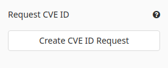
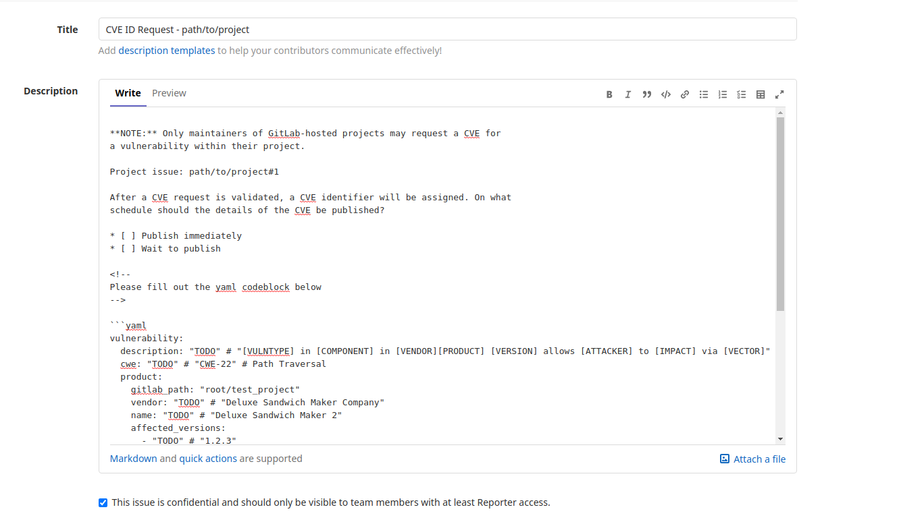
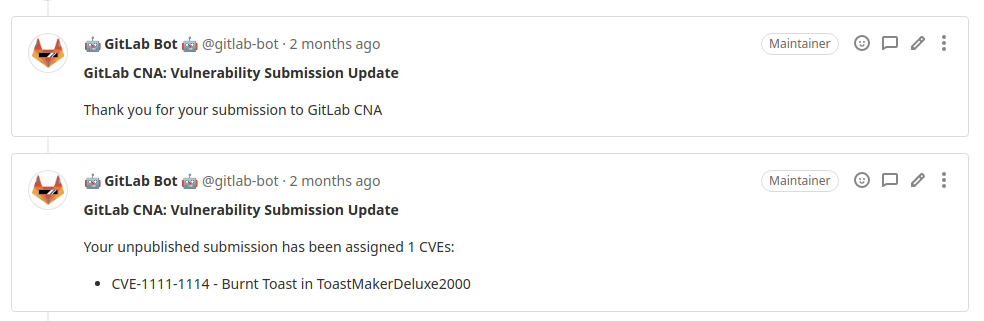
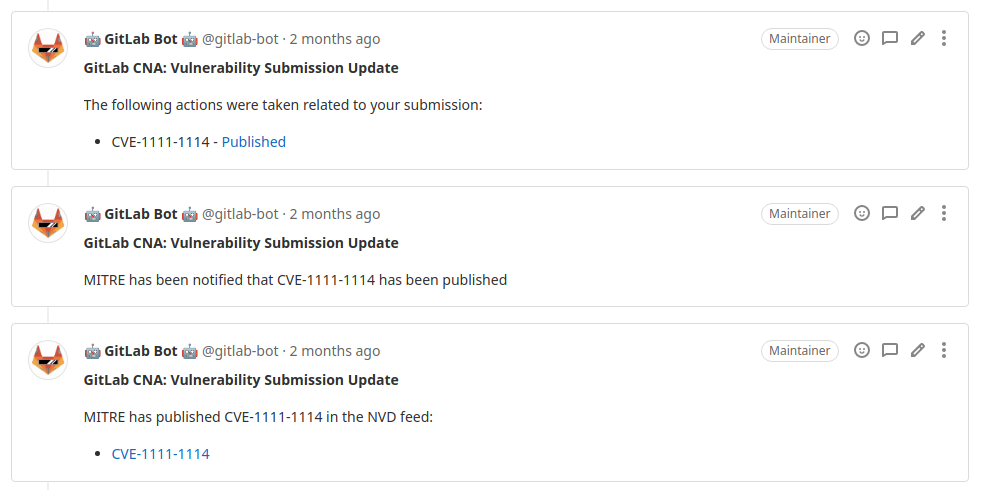

# CVE ID Requests **(ULTIMATE SAAS)**

> [Introduced](https://gitlab.com/gitlab-org/gitlab/-/merge_requests/41203) in GitLab 13.4, only for public projects on GitLab.com.

As part of [our role as a CVE Numbering Authority](https://about.gitlab.com/security/cve/)
([CNA](https://cve.mitre.org/cve/cna.html)), you may request
[CVE](https://cve.mitre.org/index.html) identifiers from GitLab to track
vulnerabilities found within your project.

## Overview

CVE identifiers track specific vulnerabilities within projects. Having a CVE assigned to a
vulnerability in your project helps your users stay secure and informed. For example,
[dependency scanning tools](../application_security/dependency_scanning/index.md)
can detect when vulnerable versions of your project are used as a dependency.

## Conditions

If the following conditions are met, a **Request CVE ID** button appears in your issue sidebar:

- The project is hosted in GitLab.com.
- The project is public.
- You are a maintainer of the project.
- The issue is confidential.

## Submitting a CVE ID Request

Clicking the **Request CVE ID** button in the issue sidebar takes you to the new issue page for
the [GitLab CVE project](https://gitlab.com/gitlab-org/cves).

Creating the confidential issue starts the CVE request process.

You are required to fill in the issue description, which includes:

- A description of the vulnerability
- The project's vendor and name
- Impacted versions
- Fixed versions
- The vulnerability type (a [CWE](https://cwe.mitre.org/data/index.html) identifier)
- A [CVSS v3 vector](https://nvd.nist.gov/vuln-metrics/cvss/v3-calculator)

## CVE Assignment

GitLab triages your submitted CVE ID request and communicates with you throughout the CVE validation
and assignment process.

Once a CVE identifier is assigned, you may use and reference it as you see fit.

Details of the vulnerability submitted in the CVE ID request are published according to your
schedule. It's common to request a CVE for an unpatched vulnerability, reference the assigned CVE
identifier in release notes, and later publish the vulnerability's details after the fix is
released.

Separate communications notify you when different stages of the publication process are complete.

