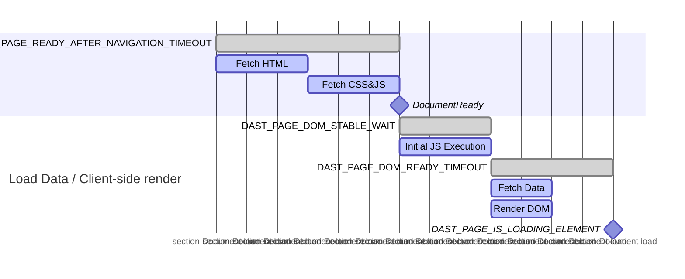

## Managing scope

Scope controls what URLs DAST follows when crawling the target application. Properly managed scope minimizes scan run time while ensuring only the target application is checked for vulnerabilities.

### Types of scope

There are three types of scope:

- in scope
- out of scope
- excluded from scope

#### In scope

DAST follows in-scope URLs and searches the DOM for subsequent actions to perform to continue the crawl.
Recorded in-scope HTTP messages are passively checked for vulnerabilities and used to build attacks when running a full scan.

#### Out of scope

DAST follows out-of-scope URLs for non-document content types such as image, stylesheet, font, script, or AJAX request.
[Authentication](#scope-works-differently-during-authentication) aside, DAST does not follow out-of-scope URLs for full page loads, such as when clicking a link to an external website.
Except for passive checks that search for information leaks, recorded HTTP messages for out-of-scope URLs are not checked for vulnerabilities.

#### Excluded from scope

DAST does not follow excluded-from-scope URLs. Except for passive checks that search for information leaks, recorded HTTP messages for excluded-from-scope URLs are not checked for vulnerabilities.

### Scope works differently during authentication

Many target applications have an authentication process that depends on external websites, such as when using an identity access management provider for single sign on (SSO).
To ensure that DAST can authenticate with these providers, DAST follows out-of-scope URLs for full page loads during authentication. DAST does not follow excluded-from-scope URLs.

### How DAST blocks HTTP requests

DAST instructs the browser to make the HTTP request as usual when blocking a request due to scope rules. The request is subsequently intercepted and rejected with the reason `BlockedByClient`.
This approach allows DAST to record the HTTP request while ensuring it never reaches the target server. Passive checks such as [200.1](../checks/200.1.md) use these recorded requests to verify information sent to external hosts.

### How to configure scope

By default, URLs matching the host of the target application are considered in-scope. All other hosts are considered out-of-scope.

Scope is configured using the following variables:

- Use `DAST_SCOPE_ALLOW_HOSTS` to add in-scope hosts.
- Use `DAST_SCOPE_IGNORE_HOSTS` to add to out-of-scope hosts.
- Use `DAST_SCOPE_EXCLUDE_HOSTS` to add to excluded-from-scope hosts.
- Use `DAST_SCOPE_EXCLUDE_URLS` to set specific URLs to be excluded-from-scope.

Rules:

- Excluding a host is given priority over ignoring a host, which is given priority over allowing a host.
- Configuring scope for a host does not configure scope for the subdomains of that host.
- Configuring scope for a host does not configure scope for all ports on that host.

The following could be a typical configuration:

```yaml
include:
  - template: DAST.gitlab-ci.yml

dast:
  variables:
    DAST_TARGET_URL: "https://my.site.com"                   # my.site.com URLs are considered in-scope by default
    DAST_SCOPE_ALLOW_HOSTS: "api.site.com:8443"       # include the API as part of the scan
    DAST_SCOPE_IGNORE_HOSTS: "analytics.site.com"      # explicitly disregard analytics from the scan
    DAST_SCOPE_EXCLUDE_HOSTS: "ads.site.com"           # don't visit any URLs on the ads subdomain
    DAST_SCOPE_EXCLUDE_URLS: "https://my.site.com/user/logout"  # don't visit this URL
```

## Vulnerability detection

DAST detects vulnerabilities through our comprehensive [browser-based vulnerability checks](../checks/_index.md). These checks identify security issues in your web applications during scanning.

The crawler runs the target website in a browser with DAST configured as the proxy server. This
ensures that all requests and responses made by the browser are passively scanned by DAST. When
running a full scan, active vulnerability checks executed by DAST do not use a browser. This
difference in how vulnerabilities are checked can cause issues that require certain features of the
target website to be disabled to ensure the scan works as intended.

For example, for a target website that contains forms with Anti-CSRF tokens, a passive scan works as
intended because the browser displays pages and forms as if a user is viewing the page. However,
active vulnerability checks that run in a full scan cannot submit forms containing Anti-CSRF tokens.
In such cases, disable Anti-CSRF tokens when running a full scan.

## Managing scan time

It is expected that running the browser-based crawler results in better coverage for many web applications, when compared to the standard GitLab DAST solution.
This can come at a cost of increased scan time.

You can manage the trade-off between coverage and scan time with the following measures:

- If the target application has template-based pages or repetitive content, you can [group URLs](#grouped-urls) using the `DAST_CRAWL_GROUPED_URLS` variable.
- Vertically scale the runner and use a higher number of browsers with the [variable](variables.md) `DAST_CRAWL_WORKER_COUNT`. The default is dynamically set to the number of usable logical CPUs.
- Limit the number of actions executed by the browser with the [variable](variables.md) `DAST_CRAWL_MAX_ACTIONS`. The default is `10,000`.
- Limit the page depth that the browser-based crawler checks coverage on with the [variable](variables.md) `DAST_CRAWL_MAX_DEPTH`. The crawler uses a breadth-first search strategy, so pages with smaller depth are crawled first. The default is `10`.
- Limit the time taken to crawl the target application with the [variable](variables.md) `DAST_CRAWL_TIMEOUT`. The default is `24h`. Scans continue with passive and active checks when the crawler times out.
- Build the crawl graph with the [variable](variables.md) `DAST_CRAWL_GRAPH` to see what pages are being crawled.
- Prevent pages from being crawled using the [variable](variables.md) `DAST_SCOPE_EXCLUDE_URLS`.
- Prevent elements being selected using the [variable](variables.md) `DAST_SCOPE_EXCLUDE_ELEMENTS`. Use with caution, as defining this variable causes an extra lookup for each page crawled.
- If the target application has minimal or fast rendering, consider reducing the [variable](variables.md) `DAST_PAGE_DOM_STABLE_WAIT` to a smaller value. The default is `500ms`.

## Timeouts

Due to poor network conditions or heavy application load, the default timeouts may not be applicable to your application.

Browser-based scans offer the ability to adjust various timeouts to ensure it continues smoothly as it transitions from one page to the next. These values are configured using a [Duration string](https://pkg.go.dev/time#ParseDuration), which allow you to configure durations with a prefix: `m` for minutes, `s` for seconds, and `ms` for milliseconds.

Navigations, or the act of loading a new page, usually require the most amount of time because they are
loading multiple new resources such as JavaScript or CSS files. Depending on the size of these resources, or the speed at which they are returned, the default `DAST_PAGE_READY_AFTER_NAVIGATION_TIMEOUT` may not be sufficient.

Stability timeouts, such as those configurable with `DAST_PAGE_DOM_READY_TIMEOUT` or `DAST_PAGE_READY_AFTER_ACTION_TIMEOUT`, can also be configured. Stability timeouts determine when browser-based scans consider
a page fully loaded. Browser-based scans consider a page loaded when:

1. The [DOMContentLoaded](https://developer.mozilla.org/en-US/docs/Web/API/Document/DOMContentLoaded_event) event has fired.
1. There are no open or outstanding requests that are deemed important, such as JavaScript and CSS. Media files are usually deemed unimportant.
1. Depending on whether the browser executed a navigation, was forcibly transitioned, or action:

   - There are no new Document Object Model (DOM) modification events after the `DAST_PAGE_DOM_READY_TIMEOUT` or `DAST_PAGE_READY_AFTER_ACTION_TIMEOUT` durations.

After these events have occurred, browser-based scans consider the page loaded and ready, and attempt the next action.

If your application experiences latency or returns many navigation failures, consider adjusting the timeout values such as in this example:

```yaml
include:
  - template: DAST.gitlab-ci.yml

dast:
  variables:
    DAST_TARGET_URL: "https://my.site.com"
    DAST_PAGE_READY_AFTER_NAVIGATION_TIMEOUT: "45s"
    DAST_PAGE_READY_AFTER_ACTION_TIMEOUT: "15s"
    DAST_PAGE_DOM_READY_TIMEOUT: "15s"
```



Adjusting these values may impact scan time because they adjust how long each browser waits for various activities to complete.



### Page readiness timeouts

Page readiness refers to the state when a page has loaded completely, its DOM has stabilized, and interactive elements are available. Proper page readiness detection is crucial for:

- **Scanning accuracy**: Analyzing pages before they're fully loaded can miss content or produce false negatives.
- **Crawl efficiency**: Waiting too long wastes scanning time, while not waiting enough misses dynamic content.
- **Modern web application support**: Single-page applications, AJAX-heavy sites, and progressive loading patterns require sophisticated readiness detection.

Using a sequence of optional configurable timeouts, the DAST scanner can detect when different parts of a page have loaded completely.

#### Timeout variables

Use the following CI/CD variables to customize DAST page readiness timeouts.
For a comprehensive list, see [Available CI/CD variables](variables.md).

| Timeout Variable | Default | Description |
|:-----------------|:--------|:------------|
| `DAST_PAGE_READY_AFTER_NAVIGATION_TIMEOUT` | `15s` | The maximum amount of time to wait for a browser to navigate from one page to another. Used during the Document Load phase for full page loads. |
| `DAST_PAGE_READY_AFTER_ACTION_TIMEOUT` | `7s` | The maximum amount of time to wait for a browser to consider a page loaded and ready for analysis. Used as an alternative to `DAST_PAGE_READY_AFTER_NAVIGATION_TIMEOUT` for in-page actions that don't trigger a full page load. |
| `DAST_PAGE_DOM_STABLE_WAIT` | `500ms` | Define how long to wait for updates to the DOM before checking a page is stable. Used at the beginning of the client-side render phase. |
| `DAST_PAGE_DOM_READY_TIMEOUT` | `6s` | The maximum amount of time to wait for a browser to consider a page loaded and ready for analysis after a navigation completes. Controls waiting for background data fetching and DOM rendering. |
| `DAST_PAGE_IS_LOADING_ELEMENT` | None | Selector that when no longer visible on the page, indicates to the analyzer that the page has finished loading and the scan can continue. Marks the end of the client-side render process. |

#### Page loading workflow

Modern web applications load in multiple stages. The DAST scanner has specific timeouts for
each step in the process:

1. **Document loading**: The browser fetches and processes the basic page structure.

   1. Fetch HTML content from the server.
   1. Load referenced CSS and JavaScript files.
   1. Parse content and renders the initial page.
   1. Trigger the standard "document ready" event.

   This phase uses either `DAST_PAGE_READY_AFTER_NAVIGATION_TIMEOUT` (for full page loads) or `DAST_PAGE_READY_AFTER_ACTION_TIMEOUT` (for in-page actions), which sets the maximum wait time for document loading.

1. **Client-Side rendering**: After initial loading, many single-page applications:

   - Perform initial JavaScript execution (`DAST_PAGE_DOM_STABLE_WAIT`).
   - Fetch background data with AJAX or other API calls.
   - Render a DOM and performs updates based on fetched data (`DAST_PAGE_DOM_READY_TIMEOUT`).
   - Display page loading indicators (`DAST_PAGE_IS_LOADING_ELEMENT`).

   The scanner monitors these activities to determine when the page is ready for interaction.

The following chart illustrates the sequence timeouts used when crawling a page:



## Grouped URLs

When you run the DAST scanner against your website, a typical scan might take several hours to complete.
This delay happens when your website contains thousands of similar pages that use the same template with
varying information. DAST treats each page as separate and analyzes them individually, spending most of
the scan time crawling these similar pages.

For example:

- E-commerce sites with thousands of product pages (`/products/item-123`, `/products/item-456`)
- Social platforms with user profiles (`/users/john`, `/users/jane`)
- Content management systems with categorized articles (`/blog/category/tech`, `/blog/category/news`)
- Search interfaces with paginated results (`/search?q=term&page=1`, `/search?q=term&page=2`)

Instead of treating every URL as unique, grouped URLs allow you to define wildcard patterns that group
similar URLs together. When DAST encounters URLs that match these patterns, it analyzes one representative
URL from each group to reduce scan time while maintaining security coverage.
For example, if all product detail pages follow the same structure and security model, DAST only needs to
test one of them thoroughly.

### How grouped URLs work

When you configure grouped URL patterns, DAST's crawler optimizes the crawl:

1. Pattern matching: As the crawler discovers new URLs, it checks each one against your defined patterns.
1. Smart grouping: URLs that match a pattern are grouped together, with only the first discovered URL fully
   analyzed.
1. Navigation skipped: Subsequent URLs that match the same pattern are skipped from full crawling but still recorded
   for reporting.
1. Security coverage: The security analysis performed on the representative URL applies to the entire group.



A URL that gets skipped because of the grouped URLs configuration might appear as **visited** or **failed** in the crawl
graph. This is a known issue. For more information, see [issue 577252](https://gitlab.com/gitlab-org/gitlab/-/issues/577252).



### Example configuration guide

The following example uses a hypothetical e-commerce website. This site has product listing pages that have variable filters
as query parameters, and product detail pages with the product identifier as a sub-path in the URL.

**Analyze your application's URL patterns**

Before configuring grouped URLs, understand your application's URL structure:

1. Review your sitemap or application routes.
1. Examine DAST logs from previous scans to identify repetitive patterns.
1. Categorize URLs by their functional purpose (product pages, user profiles, search results).
1. Identify template-based pages that share the same page structure.

In this example, a scan of the e-commerce site produces the following URLs in [the log file found in the CI artifacts](../troubleshooting.md#log-destination):

```plaintext
INF REPT  visited 8 URLs
INF REPT  URL visited: (DOC www.your-site.com/products?category=vegetables&sort=price) GET www.your-site.com/products?category=vegetables&sort=price
INF REPT  URL visited: (DOC www.your-site.com/products?category=fruits&sort=price) GET www.your-site.com/products?category=fruits&sort=price
INF REPT  URL visited: (DOC www.your-site.com/products?category=frozen&sort=price) GET www.your-site.com/products?category=frozen&sort=price
INF REPT  URL visited: (DOC www.your-site.com/products?category=frozen&sort=price) GET www.your-site.com/products?category=frozen&sort=price
INF REPT  URL visited: (DOC www.your-site.com/products/029039-apple-93000/details) GET www.your-site.com/products/029039-apple-93000/details
INF REPT  URL visited: (DOC www.your-site.com/products/99345-orange-33322/details) GET www.your-site.com/products/99345-orange/details
INF REPT  URL visited: (DOC www.your-site.com/products/90845-orange-33992/details) GET www.your-site.com/products/90845-orange/details
INF REPT  URL visited: (DOC www.your-site.com/products/100232-bananas-2677/details) GET www.your-site.com/products/100232-bananas-2677/details
```

The first four URLs represent product listing pages with different `category` and `sort` filters.
The last four URLs represent individual product detail pages with unique product identifiers.
Two of the product detail pages have `orange` in their identifiers.

These two sets of pages likely share the same underlying templates and security characteristics.
Without optimization using grouped URLs, DAST would crawl and test all eight pages individually.

**Design your wildcard patterns**

When you create patterns, follow these rules:

1. Include at least one `*` wildcard for pattern recognition. A `*` matches zero or more characters in the URL.
   URLs are matched by characters rather than specific parts of the URL. A `*` can match more than one sub-path of the URL.
1. Look for which characters in the URL vary over the crawl. Be specific to avoid over-grouping unrelated pages.
1. Consider pattern order. If a page matches multiple patterns, the first pattern specified is used.

Configure the patterns for the e-commerce website:

1. Product categories listing group pattern: The first four URLs can be grouped logically using the pattern
   `www.your-site.com/products?category=*&sort=price`. This pattern matches all pages that use both the category
   filters and define `price` as the `sort` filter.
1. Product details group pattern: The last four URLs can be grouped logically using the pattern
   `www.your-site.com/products/*/details`. This pattern matches all product detail pages regardless of
   the product identifier.

You can also split the product details group pattern further into two groups:

1. Orange product details group pattern: The pattern `www.your-site.com/products/*orange*/details` matches the two URLs for oranges.
1. Generic product details group pattern: The pattern `www.your-site.com/products/*/details` matches all other products.

One page can match more than one URL pattern. Specify patterns in the order you want them matched. For example,
`www.your-site.com/products/4782-orange-777/details` matches both patterns but this is an orange product detail page.
To ensure it matches the orange product details group pattern, specify the orange product details before the generic
product details group pattern in configuration.

**Configure the `DAST_CRAWL_GROUPED_URLS` variable**

Add the configuration to your `.gitlab-ci.yml` file:

```yaml
include:
  - template: DAST.gitlab-ci.yml

dast:
  variables:
    DAST_TARGET_URL: "https://your-site.com"
    DAST_CRAWL_GROUPED_URLS: "https://your-site.com/products?category=*&sort=price,https://your-site.com/products/*orange*/details,https://your-site.com/products/*/details"
```

**Monitor and validate**

After you implement grouped URLs:

1. Check the crawl graph (if enabled) to verify grouping behavior. You should see fewer branches in the crawl graph.
1. Review scan logs to confirm expected URL blocking. You should see fewer visited URLs.
1. Validate that security coverage is not compromised. The number of findings might decrease because only one page per group is scanned for vulnerabilities.
1. Measure performance improvements in scan duration. The scan should take less time to finish.

#### Advanced configuration examples

The following examples demonstrate advanced patterns for common web application scenarios:

**Multiple query parameters with wildcards**

For search or filter pages with multiple varying parameters:

```yaml
dast:
  variables:
    DAST_TARGET_URL: "https://your-site.com"
    # Match search results with any query and page number
    DAST_CRAWL_GROUPED_URLS: "https://your-site.com/search?q=*&page=*,https://your-site.com/search?q=*&page=*&sort=*"
```

This groups all search result pages together, regardless of search terms, pagination, or sorting options.

**Combine path and query parameter patterns**

For applications with both dynamic paths and query strings:

```yaml
dast:
  variables:
    DAST_TARGET_URL: "https://your-site.com"
    DAST_CRAWL_GROUPED_URLS: |
      https://your-site.com/api/v1/users/*/profile?tab=*,
      https://your-site.com/dashboard/*/reports?year=*&month=*,
      https://your-site.com/catalog/*/items?filter=*
```

This configuration groups:

- User profile pages with different tabs.
- Dashboard reports across different time periods.
- Catalog items with various filters.

**Hierarchical URL patterns**

For nested resource structures with multiple levels:

```yaml
dast:
  variables:
    DAST_TARGET_URL: "https://your-site.com"
    DAST_CRAWL_GROUPED_URLS: |
      https://your-site.com/organizations/*/teams/*/members/*,
      https://your-site.com/projects/*/issues/*/comments,
      https://your-site.com/categories/*/subcategories/*/products/*
```

This configuration handles deeply nested URLs where multiple path segments vary.

**API endpoints with resource IDs**

For REST API endpoints with varying resource identifiers:

```yaml
dast:
  variables:
    DAST_TARGET_URL: "https://api.your-site.com"
    DAST_CRAWL_GROUPED_URLS: |
      https://api.your-site.com/v1/customers/*/orders,
      https://api.your-site.com/v1/customers/*/orders/*,
      https://api.your-site.com/v2/resources/*/relationships/*,
      https://api.your-site.com/*/items?id=*
```

This configuration groups API endpoints by their resource type rather than individual IDs.

**Locale and language variations**

For internationalized sites with language or region codes:

```yaml
dast:
  variables:
    DAST_TARGET_URL: "https://your-site.com"
    DAST_CRAWL_GROUPED_URLS: |
      https://your-site.com/*/products/*,
      https://your-site.com/*/*/articles/*,
      https://*.your-site.com/content/*
```

This configuration groups:

- Product pages across different languages (`/en/products/123`, `/fr/products/123`).
- Articles with language and region codes (`/en/us/articles/guide`).
- Subdomain-based locales (`en.your-site.com/content/page`).

**Session and token parameters**

For URLs with session IDs or temporary tokens that should be grouped:

```yaml
dast:
  variables:
    DAST_TARGET_URL: "https://your-site.com"
    DAST_CRAWL_GROUPED_URLS: |
      https://your-site.com/checkout?session=*,
      https://your-site.com/verify?token=*&email=*,
      https://your-site.com/share/*?ref=*
```

This configuration prevents DAST from treating each unique session or token as a separate page.

##### Complex e-commerce scenarios

For comprehensive e-commerce site optimization:

```yaml
dast:
  variables:
    DAST_TARGET_URL: "https://shop.your-site.com"
    DAST_CRAWL_GROUPED_URLS: |
      https://shop.your-site.com/products?category=*&brand=*&price=*,
      https://shop.your-site.com/products/*/reviews?page=*,
      https://shop.your-site.com/products/*/reviews?page=*&sort=*,
      https://shop.your-site.com/cart?item=*&quantity=*,
      https://shop.your-site.com/user/orders/*/tracking,
      https://shop.your-site.com/compare?products=*
```

This configuration handles:

- Product listings with multiple filter combinations.
- Paginated product reviews with different sorting.
- Shopping cart variations.
- Order tracking pages.
- Product comparison pages.

**Pattern order for specificity**

When patterns overlap, order them from most specific to most general:

```yaml
dast:
  variables:
    DAST_TARGET_URL: "https://your-site.com"
    # Order matters: specific patterns first, general patterns last
    DAST_CRAWL_GROUPED_URLS: |
      https://your-site.com/products/*-premium-*/details,
      https://your-site.com/products/*-sale-*/details,
      https://your-site.com/products/*/details,
      https://your-site.com/products/*
```

This configuration ensures that premium and sale products are grouped separately before they fall back to the general product pattern.

**Exclude specific patterns from grouping**

Combine with `DAST_SCOPE_EXCLUDE_URLS` to exclude certain URLs from both grouping and scanning:

```yaml
dast:
  variables:
    DAST_TARGET_URL: "https://your-site.com"
    DAST_CRAWL_GROUPED_URLS: "https://your-site.com/articles/*/comments?page=*"
    # Exclude logout and admin URLs from scanning entirely
    DAST_SCOPE_EXCLUDE_URLS: "https://your-site.com/logout,https://your-site.com/admin/*"
```

This configuration groups article comment pages while excluding logout and admin URLs from the scan.
