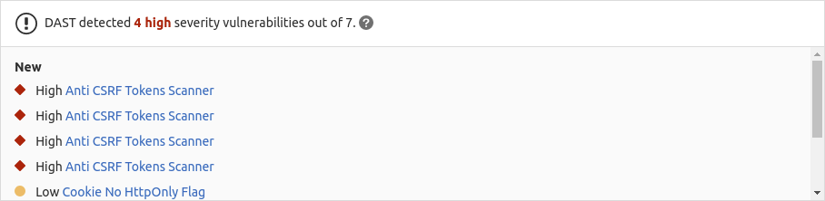

# Dynamic Application Security Testing (DAST) **(ULTIMATE)**

> [Introduced](https://gitlab.com/gitlab-org/gitlab/-/issues/4348) in [GitLab Ultimate](https://about.gitlab.com/pricing/) 10.4.

Running [static checks](../sast/index.md) on your code is the first step to detect
vulnerabilities that can put the security of your code at risk. Yet, once
deployed, your application is exposed to a new category of possible attacks,
such as cross-site scripting or broken authentication flaws. This is where
Dynamic Application Security Testing (DAST) comes into place.

NOTE: **Note:**
The whitepaper ["A Seismic Shift in Application Security"](https://about.gitlab.com/resources/whitepaper-seismic-shift-application-security/)
explains how 4 of the top 6 attacks were application based. Download it to learn how to protect your
organization.

## Overview

If you're using [GitLab CI/CD](../../../ci/README.md), you can analyze your running web applications
for known vulnerabilities using Dynamic Application Security Testing (DAST).
You can take advantage of DAST by either [including the CI job](#configuration) in
your existing `.gitlab-ci.yml` file or by implicitly using
[Auto DAST](../../../topics/autodevops/stages.md#auto-dast),
provided by [Auto DevOps](../../../topics/autodevops/index.md).

GitLab checks the DAST report, compares the found vulnerabilities between the source and target
branches, and shows the information on the merge request.

Note that this comparison logic uses only the latest pipeline executed for the target branch's base
commit. Running the pipeline on any other commit has no effect on the merge request.



By clicking on one of the detected linked vulnerabilities, you can
see the details and the URL(s) affected.


[Dynamic Application Security Testing (DAST)](https://en.wikipedia.org/wiki/Dynamic_Application_Security_Testing)
uses the popular open source tool [OWASP Zed Attack Proxy](https://www.zaproxy.org/)
to perform an analysis on your running web application.

By default, DAST executes [ZAP Baseline Scan](https://www.zaproxy.org/docs/docker/baseline-scan/)
and performs passive scanning only. It doesn't actively attack your application.
However, DAST can be [configured](#full-scan)
to also perform an *active scan*: attack your application and produce a more extensive security report.
It can be very useful combined with [Review Apps](../../../ci/review_apps/index.md).

Note that a pipeline may consist of multiple jobs, including SAST and DAST scanning. If any job
fails to finish for any reason, the security dashboard doesn't show DAST scanner output. For
example, if the DAST job finishes but the SAST job fails, the security dashboard doesn't show DAST
results. On failure, the analyzer outputs an
[exit code](../../../development/integrations/secure.md#exit-code).

## Use cases

It helps you automatically find security vulnerabilities in your running web
applications while you're developing and testing your applications.

## Requirements

To run a DAST job, you need GitLab Runner with the
[`docker` executor](https://docs.gitlab.com/runner/executors/docker.html).

## Configuration

For GitLab 11.9 and later, to enable DAST, you must
[include](../../../ci/yaml/README.md#includetemplate) the
[`DAST.gitlab-ci.yml` template](https://gitlab.com/gitlab-org/gitlab/blob/master/lib/gitlab/ci/templates/Security/DAST.gitlab-ci.yml)
that's provided as a part of your GitLab installation. For GitLab versions earlier
than 11.9, you can copy and use the job as defined in that template.

Add the following to your `.gitlab-ci.yml` file:

```yaml
include:
  - template: DAST.gitlab-ci.yml

variables:
  DAST_WEBSITE: https://example.com
```

There are two ways to define the URL to be scanned by DAST:

1. Set the `DAST_WEBSITE` [variable](../../../ci/yaml/README.md#variables).

1. Add it in an `environment_url.txt` file at the root of your project.
   This is useful for testing in dynamic environments. To run DAST against an application
   dynamically created during a GitLab CI/CD pipeline, a job that runs prior to the DAST scan must
   persist the application's domain in an `environment_url.txt` file. DAST automatically parses the
   `environment_url.txt` file to find its scan target.

   For example, in a job that runs prior to DAST, you could include code that looks similar to:

   ```yaml
   script:
     - echo http://${CI_PROJECT_ID}-${CI_ENVIRONMENT_SLUG}.domain.com > environment_url.txt
   artifacts:
     paths: [environment_url.txt]
     when: always
   ```
  
   You can see an example of this in our [Auto DevOps CI YAML](https://gitlab.com/gitlab-org/gitlab/blob/master/lib/gitlab/ci/templates/Jobs/Deploy.gitlab-ci.yml) file.

If both values are set, the `DAST_WEBSITE` value takes precedence.

The included template creates a `dast` job in your CI/CD pipeline and scans
your project's source code for possible vulnerabilities.

The results are saved as a
[DAST report artifact](../../../ci/pipelines/job_artifacts.md#artifactsreportsdast)
that you can later download and analyze. Due to implementation limitations we
always take the latest DAST artifact available. Behind the scenes, the
[GitLab DAST Docker image](https://gitlab.com/gitlab-org/security-products/dast)
is used to run the tests on the specified URL and scan it for possible vulnerabilities.

By default, the DAST template uses the latest major version of the DAST Docker
image. Using the `DAST_VERSION` variable, you can choose how DAST updates:

- Automatically update DAST with new features and fixes by pinning to a major version (such as `1`).
- Only update fixes by pinning to a minor version (such as `1.6`).
- Prevent all updates by pinning to a specific version (such as `1.6.4`).

Find the latest DAST versions on the [Releases](https://gitlab.com/gitlab-org/security-products/dast/-/releases) page.

### When DAST scans run

When using `DAST.gitlab-ci.yml` template, the `dast` job is run last as shown in
the example below. To ensure DAST is scanning the latest code, your CI pipeline
should deploy changes to the web server in one of the jobs preceding the `dast` job.

```yaml
stages:
  - build
  - test
  - deploy
  - dast
```

Be aware that if your pipeline is configured to deploy to the same webserver in
each run, running a pipeline while another is still running could cause a race condition
where one pipeline overwrites the code from another pipeline. The site to be scanned
should be excluded from changes for the duration of a DAST scan.
The only changes to the site should be from the DAST scanner. Be aware that any
changes that users, scheduled tasks, database changes, code changes, other pipelines, or other scanners make to
the site during a scan could lead to inaccurate results.

### Hide sensitive information

> [Introduced](https://gitlab.com/gitlab-org/gitlab/-/issues/36332) in GitLab 13.1.

HTTP request and response headers may contain sensitive information, including cookies and
authorization credentials. By default, the following headers are masked:

- `Authorization`.
- `Proxy-Authorization`.
- `Set-Cookie` (values only).
- `Cookie` (values only).

Using the [`DAST_MASK_HTTP_HEADERS` variable](#available-variables), you can list the
headers whose values you want masked. For details on how to mask headers, see
[Customizing the DAST settings](#customizing-the-dast-settings).

### Authentication

It's also possible to authenticate the user before performing the DAST checks.

NOTE: **Note:**
We highly recommended that you configure the scanner to authenticate to the application,
otherwise it cannot check most of the application for security risks, as most
of your application is likely not accessible without authentication. It is also recommended
that you periodically confirm the scanner's authentication is still working as this tends to break over
time due to authentication changes to the application.

Create masked variables to pass the credentials that DAST uses.
To create masked variables for the username and password, see [Create a custom variable in the UI](../../../ci/variables/README.md#create-a-custom-variable-in-the-ui).
Note that the key of the username variable must be `DAST_USERNAME`
and the key of the password variable must be `DAST_PASSWORD`.

Other variables that are related to authenticated scans are:

```yaml
include:
  - template: DAST.gitlab-ci.yml

variables:
  DAST_WEBSITE: https://example.com
  DAST_AUTH_URL: https://example.com/sign-in
  DAST_USERNAME_FIELD: session[user]  # the name of username field at the sign-in HTML form
  DAST_PASSWORD_FIELD: session[password]  # the name of password field at the sign-in HTML form
  DAST_SUBMIT_FIELD: login # the `id` or `name` of the element that when clicked will submit the login form or the password form of a multi-page login process
  DAST_FIRST_SUBMIT_FIELD: next # the `id` or `name` of the element that when clicked will submit the username form of a multi-page login process
  DAST_AUTH_EXCLUDE_URLS: http://example.com/sign-out,http://example.com/sign-out-2  # optional, URLs to skip during the authenticated scan; comma-separated, no spaces in between
```

The results are saved as a
[DAST report artifact](../../../ci/pipelines/job_artifacts.md#artifactsreportsdast)
that you can later download and analyze.
Due to implementation limitations, we always take the latest DAST artifact available.

DANGER: **Warning:**
**NEVER** run an authenticated scan against a production server. When an authenticated
scan is run, it may perform *any* function that the authenticated user can. This
includes actions like modifying and deleting data, submitting forms, and following links.
Only run an authenticated scan against a test server.

### Full scan

DAST can be configured to perform [ZAP Full Scan](https://github.com/zaproxy/zaproxy/wiki/ZAP-Full-Scan), which
includes both passive and active scanning against the same target website:

```yaml
include:
  - template: DAST.gitlab-ci.yml

variables:
  DAST_FULL_SCAN_ENABLED: "true"
```

If your DAST job exceeds the job timeout and you need to reduce the scan duration, we shared some
tips for optimizing DAST scans in a [blog post](https://about.gitlab.com/blog/2020/08/31/how-to-configure-dast-full-scans-for-complex-web-applications/).

#### Domain validation

The DAST job can be run anywhere, which means you can accidentally hit live web servers
and potentially damage them. You could even take down your production environment.
For that reason, you should use domain validation.

Domain validation is not required by default. It can be required by setting the
[environment variable](#available-variables) `DAST_FULL_SCAN_DOMAIN_VALIDATION_REQUIRED` to `"true"`.

```yaml
include:
  - template: DAST.gitlab-ci.yml

variables:
  DAST_FULL_SCAN_ENABLED: "true"
  DAST_FULL_SCAN_DOMAIN_VALIDATION_REQUIRED: "true"
```

Since ZAP full scan actively attacks the target application, DAST sends a ping
to the target (normally defined in `DAST_WEBSITE` or `environment_url.txt`) beforehand.

- If `DAST_FULL_SCAN_DOMAIN_VALIDATION_REQUIRED` is `false` or unset, the scan
  proceeds unless the response to the ping includes a `Gitlab-DAST-Permission`
  header with a value of `deny`.
- If `DAST_FULL_SCAN_DOMAIN_VALIDATION_REQUIRED` is `true`, the scan exits
  unless the response to the ping includes a `Gitlab-DAST-Permission` header with
  a value of `allow`.

Here are some examples of adding the `Gitlab-DAST-Permission` header to a response
in Rails, Django, and Node (with Express).

##### Ruby on Rails

Here's how you would add a
[custom header in Ruby on Rails](https://guides.rubyonrails.org/action_controller_overview.html#setting-custom-headers):

```ruby
class DastWebsiteTargetController < ActionController::Base
  def dast_website_target
    response.headers['Gitlab-DAST-Permission'] = 'allow'

    head :ok
  end
end
```

##### Django

Here's how you would add a
[custom header in Django](https://docs.djangoproject.com/en/2.2/ref/request-response/#setting-header-fields):

```python
class DastWebsiteTargetView(View):
    def head(self, *args, **kwargs):
      response = HttpResponse()
      response['Gitlab-Dast-Permission'] = 'allow'

      return response
```

##### Node (with Express)

Here's how you would add a
[custom header in Node (with Express)](http://expressjs.com/en/5x/api.html#res.append):

```javascript
app.get('/dast-website-target', function(req, res) {
  res.append('Gitlab-DAST-Permission', 'allow')
  res.send('Respond to DAST ping')
})
```

##### Domain validation header via a proxy

It's also possible to add the `Gitlab-DAST-Permission` header via a proxy.

###### NGINX

The following configuration allows NGINX to act as a reverse proxy and add the
`Gitlab-DAST-Permission` [header](http://nginx.org/en/docs/http/ngx_http_headers_module.html#add_header):

```nginx
# default.conf
server {
    listen 80;
    server_name localhost;

    location / {
        proxy_pass http://test-application;
        add_header Gitlab-DAST-Permission allow;
    }
}
```

###### Apache

Apache can also be used as a [reverse proxy](https://httpd.apache.org/docs/2.4/mod/mod_proxy.html)
to add the `Gitlab-DAST-Permission` [header](https://httpd.apache.org/docs/current/mod/mod_headers.html).

To do so, add the following lines to `httpd.conf`:

```plaintext
# httpd.conf
LoadModule proxy_module modules/mod_proxy.so
LoadModule proxy_connect_module modules/mod_proxy_connect.so
LoadModule proxy_http_module modules/mod_proxy_http.so

<VirtualHost *:80>
  ProxyPass "/" "http://test-application.com/"
  ProxyPassReverse "/" "http://test-application.com/"
  Header set Gitlab-DAST-Permission "allow"
</VirtualHost>
```

[This snippet](https://gitlab.com/gitlab-org/security-products/dast/snippets/1894732) contains a complete `httpd.conf` file
configured to act as a remote proxy and add the `Gitlab-DAST-Permission` header.

### API scan

> [Introduced](https://gitlab.com/gitlab-org/gitlab/-/issues/10928) in [GitLab Ultimate](https://about.gitlab.com/pricing/) 12.10.

Using an API specification as a scan's target is a useful way to seed URLs for scanning an API.
Vulnerability rules in an API scan are different than those in a normal website scan.

#### Specification format

API scans support OpenAPI V2 and OpenAPI V3 specifications. You can define these specifications using `JSON` or `YAML`.

#### Import API specification from a URL

If your API specification is accessible at a URL, you can pass that URL in directly as the target.
The specification does not have to be hosted on the same host as the API being tested.

```yaml
include:
  - template: DAST.gitlab-ci.yml

variables:
  DAST_API_SPECIFICATION: http://my.api/api-specification.yml
```

#### Import API specification from a file

If your API specification is in your repository, you can provide the specification's
filename directly as the target. The specification file is expected to be in the
`/zap/wrk` directory.

```yaml
dast:
  script:
    - mkdir -p /zap/wrk
    - cp api-specification.yml /zap/wrk/api-specification.yml
    - /analyze -t $DAST_WEBSITE
  variables:
    GIT_STRATEGY: fetch
    DAST_API_SPECIFICATION: api-specification.yml
```

#### Full API scan

API scans support full scanning, which can be enabled by using the `DAST_FULL_SCAN_ENABLED`
environment variable. Domain validation is not supported for full API scans.

#### Host override

Specifications often define a host, which contains a domain name and a port. The
host referenced may be different than the host of the API's review instance.
This can cause incorrect URLs to be imported, or a scan on an incorrect host.
Use the `DAST_API_HOST_OVERRIDE` environment variable to override these values.

For example, with a OpenAPI V3 specification containing:

```yaml
servers:
  - url: https://api.host.com
```

If the test version of the API is running at `https://api-test.host.com`, then
the following DAST configuration can be used:

```yaml
include:
  - template: DAST.gitlab-ci.yml

variables:
  DAST_API_SPECIFICATION: http://api-test.host.com/api-specification.yml
  DAST_API_HOST_OVERRIDE: api-test.host.com
```

Note that using a host override is ONLY supported when importing the API specification from a URL.
It doesn't work and is ignored when importing the specification from a file. This is due to a
limitation in the ZAP OpenAPI extension.

#### Authentication using headers

Tokens in request headers are often used as a way to authenticate API requests.
You can achieve this by using the `DAST_REQUEST_HEADERS` environment variable.
Headers are applied to every request DAST makes.

```yaml
include:
  - template: DAST.gitlab-ci.yml

variables:
  DAST_API_SPECIFICATION: http://api-test.api.com/api-specification.yml
  DAST_REQUEST_HEADERS: "Authorization: Bearer my.token"
```

### URL scan

> [Introduced](https://gitlab.com/gitlab-org/gitlab/-/issues/214120) in [GitLab Ultimate](https://about.gitlab.com/pricing/) 13.4.

A URL scan allows you to specify which parts of a website are scanned by DAST.

#### Define the URLs to scan

URLs to scan can be specified by either of the following methods:

- Use `DAST_PATHS_FILE` environment variable to specify the name of a file containing the paths.
- Use `DAST_PATHS` environment variable to list the paths.

##### Use DAST_PATHS_FILE environment variable

> [Introduced](https://gitlab.com/gitlab-org/gitlab/-/issues/258825) in GitLab 13.6.

To define the URLs to scan in a file, create a plain text file with one path per line.

```txt
page1.html
/page2.html
category/shoes/page1.html
```

To scan the URLs in that file, set the environment variable `DAST_PATHS_FILE` to the path of that file.

```yaml
include:
  - template: DAST.gitlab-ci.yml

variables:
  DAST_PATHS_FILE: url_file.txt
```

By default, DAST scans do not clone the project repository. If the file is checked in to the project, instruct the DAST job to clone the project by setting GIT_STRATEGY to fetch. The file is expected to be in the `/zap/wrk` directory.

```yaml
dast:
  script:
    - mkdir -p /zap/wrk
    - cp url_file.txt /zap/wrk/url_file.txt
    - /analyze -t $DAST_WEBSITE
  variables:
    GIT_STRATEGY: fetch
    DAST_PATHS_FILE: url_file.txt
```

##### Use DAST_PATHS environment variable

> [Introduced](https://gitlab.com/gitlab-org/gitlab/-/issues/214120) in GitLab 13.4.

To specify the paths to scan in an environment variable, add a comma-separated list of the paths to the `DAST_PATHS`
environment variable. Note that you can only scan paths of a single host.

```yaml
include:
  - template: DAST.gitlab-ci.yml

variables:
  DAST_PATHS=/page1.html,/category1/page1.html,/page3.html
```

When using `DAST_PATHS` and `DAST_PATHS_FILE`, note the following:

- `DAST_WEBSITE` must be defined when using either `DAST_PATHS_FILE` or `DAST_PATHS`. The paths listed in either use `DAST_WEBSITE` to build the URLs to scan
- Spidering is disabled when `DAST_PATHS` or `DAST_PATHS_FILE` are defined
- `DAST_PATHS_FILE` and `DAST_PATHS` can not be used together
- The `DAST_PATHS` environment variable has a limit of about 130kb. If you have a list or paths
  greater than this, use `DAST_PATHS_FILE`.

#### Full Scan

To perform a [full scan](#full-scan) on the listed paths, use the `DAST_FULL_SCAN_ENABLED` environment variable.

### Customizing the DAST settings

CAUTION: **Deprecation:**
Beginning in GitLab 13.0, the use of [`only` and `except`](../../../ci/yaml/README.md#onlyexcept-basic)
is no longer supported. When overriding the template, you must use [`rules`](../../../ci/yaml/README.md#rules) instead.

The DAST settings can be changed through environment variables by using the
[`variables`](../../../ci/yaml/README.md#variables) parameter in `.gitlab-ci.yml`.
These variables are documented in [available variables](#available-variables).

For example:

```yaml
include:
  - template: DAST.gitlab-ci.yml

variables:
  DAST_WEBSITE: https://example.com
  DAST_SPIDER_MINS: 120
```

Because the template is [evaluated before](../../../ci/yaml/README.md#include) the pipeline
configuration, the last mention of the variable takes precedence.

### Available variables

DAST can be [configured](#customizing-the-dast-settings) using environment variables.

| Environment variable        | Type | Description                                                                    |
|-----------------------------| -----------|--------------------------------------------------------------------------------|
| `SECURE_ANALYZERS_PREFIX`   | URL | Set the Docker registry base address from which to download the analyzer. |
| `DAST_WEBSITE`  | URL | The URL of the website to scan. `DAST_API_SPECIFICATION` must be specified if this is omitted. |
| `DAST_API_SPECIFICATION`  | URL or string | The API specification to import. The specification can be hosted at a URL, or the name of a file present in the `/zap/wrk` directory. `DAST_WEBSITE` must be specified if this is omitted. |
| `DAST_SPIDER_START_AT_HOST`  | boolean | Set to `false` to prevent DAST from resetting the target to its host before scanning. When `true`, non-host targets `http://test.site/some_path` is reset to `http://test.site` before scan. Default: `true`. [Introduced](https://gitlab.com/gitlab-org/gitlab/-/issues/258805) in GitLab 13.6. |
| `DAST_AUTH_URL` | URL | The URL of the page containing the sign-in HTML form on the target website. `DAST_USERNAME` and `DAST_PASSWORD` are submitted with the login form to create an authenticated scan. Not supported for API scans. |
| `DAST_USERNAME` | string | The username to authenticate to in the website. |
| `DAST_PASSWORD` | string | The password to authenticate to in the website. |
| `DAST_USERNAME_FIELD` | string | The name of username field at the sign-in HTML form. |
| `DAST_PASSWORD_FIELD` | string | The name of password field at the sign-in HTML form. |
| `DAST_MASK_HTTP_HEADERS` | string | Comma-separated list of request and response headers to be masked (GitLab 13.1). Must contain **all** headers to be masked. Refer to [list of headers that are masked by default](#hide-sensitive-information). |
| `DAST_AUTH_EXCLUDE_URLS` | URLs | The URLs to skip during the authenticated scan; comma-separated. Regular expression syntax can be used to match multiple URLs. For example, `.*` matches an arbitrary character sequence. Not supported for API scans. |
| `DAST_FULL_SCAN_ENABLED` | boolean | Set to `true` to run a [ZAP Full Scan](https://github.com/zaproxy/zaproxy/wiki/ZAP-Full-Scan) instead of a [ZAP Baseline Scan](https://github.com/zaproxy/zaproxy/wiki/ZAP-Baseline-Scan). Default: `false` |
| `DAST_FULL_SCAN_DOMAIN_VALIDATION_REQUIRED` | boolean | Set to `true` to require [domain validation](#domain-validation) when running DAST full scans. Not supported for API scans. Default: `false` |
| `DAST_AUTO_UPDATE_ADDONS` | boolean | ZAP add-ons are pinned to specific versions in the DAST Docker image. Set to `true` to download the latest versions when the scan starts. Default: `false` |
| `DAST_API_HOST_OVERRIDE` | string | Used to override domains defined in API specification files. Only supported when importing the API specification from a URL. Example: `example.com:8080` |
| `DAST_EXCLUDE_RULES` | string | Set to a comma-separated list of Vulnerability Rule IDs to exclude them from running during the scan. Rule IDs are numbers and can be found from the DAST log or on the [ZAP project](https://github.com/zaproxy/zaproxy/blob/develop/docs/scanners.md). For example, `HTTP Parameter Override` has a rule ID of `10026`. **Note:** In earlier versions of GitLab the excluded rules were executed but alerts they generated were suppressed. [Introduced](https://gitlab.com/gitlab-org/gitlab/-/issues/118641) in GitLab 12.10. |
| `DAST_REQUEST_HEADERS` | string | Set to a comma-separated list of request header names and values. Headers are added to every request made by DAST. For example, `Cache-control: no-cache,User-Agent: DAST/1.0` |
| `DAST_DEBUG` | boolean | Enable debug message output. Default: `false`. [Introduced](https://gitlab.com/gitlab-org/gitlab/-/issues/12652) in GitLab 13.1. |
| `DAST_SPIDER_MINS` | number | The maximum duration of the spider scan in minutes. Set to `0` for unlimited. Default: One minute, or unlimited when the scan is a full scan. [Introduced](https://gitlab.com/gitlab-org/gitlab/-/issues/12652) in GitLab 13.1. |
| `DAST_HTML_REPORT` | string | The filename of the HTML report written at the end of a scan. [Introduced](https://gitlab.com/gitlab-org/gitlab/-/issues/12652) in GitLab 13.1. |
| `DAST_MARKDOWN_REPORT` | string | The filename of the Markdown report written at the end of a scan. [Introduced](https://gitlab.com/gitlab-org/gitlab/-/issues/12652) in GitLab 13.1.|
| `DAST_XML_REPORT` | string | The filename of the XML report written at the end of a scan. [Introduced](https://gitlab.com/gitlab-org/gitlab/-/issues/12652) in GitLab 13.1. |
| `DAST_INCLUDE_ALPHA_VULNERABILITIES` | boolean | Set to `true` to include alpha passive and active scan rules. Default: `false`. [Introduced](https://gitlab.com/gitlab-org/gitlab/-/issues/12652) in GitLab 13.1. |
| `DAST_USE_AJAX_SPIDER` | boolean | Set to `true` to use the AJAX spider in addition to the traditional spider, useful for crawling sites that require JavaScript. Default: `false`. [Introduced](https://gitlab.com/gitlab-org/gitlab/-/issues/12652) in GitLab 13.1. |
| `DAST_PATHS` | string | Set to a comma-separated list of URLs for DAST to scan. For example, `/page1.html,/category1/page3.html,/page2.html`. [Introduced](https://gitlab.com/gitlab-org/gitlab/-/issues/214120) in GitLab 13.4. |
| `DAST_PATHS_FILE` | string | The file path containing the paths within `DAST_WEBSITE` to scan. The file must be plain text with one path per line and be in `/zap/wrk`. [Introduced](https://gitlab.com/gitlab-org/gitlab/-/issues/258825) in GitLab 13.6. |
| `DAST_SUBMIT_FIELD` | string | The `id` or `name` of the element that when clicked submits the login form or the password form of a multi-page login process. [Introduced](https://gitlab.com/gitlab-org/gitlab-ee/issues/9894) in GitLab 12.4. |
| `DAST_FIRST_SUBMIT_FIELD` | string | The `id` or `name` of the element that when clicked submits the username form of a multi-page login process. [Introduced](https://gitlab.com/gitlab-org/gitlab-ee/issues/9894) in GitLab 12.4. |
| `DAST_ZAP_CLI_OPTIONS` | string | ZAP server command-line options. For example, `-Xmx3072m` would set the Java maximum memory allocation pool size. [Introduced](https://gitlab.com/gitlab-org/gitlab/-/issues/12652) in GitLab 13.1. |
| `DAST_ZAP_LOG_CONFIGURATION` | string | Set to a semicolon-separated list of additional log4j properties for the ZAP Server. For example, `log4j.logger.org.parosproxy.paros.network.HttpSender=DEBUG;log4j.logger.com.crawljax=DEBUG` |

### DAST command-line options

Not all DAST configuration is available via environment variables. To find out all
possible options, run the following configuration.
Available command-line options are printed to the job log:

```yaml
include:
  template: DAST.gitlab-ci.yml

dast:
  script:
    - /analyze --help
```

You must then overwrite the `script` command to pass in the appropriate
argument. For example, vulnerability definitions in alpha can be included with
`-a`. The following configuration includes those definitions:

```yaml
include:
  template: DAST.gitlab-ci.yml

dast:
  script:
    - export DAST_WEBSITE=${DAST_WEBSITE:-$(cat environment_url.txt)}
    - /analyze -a -t $DAST_WEBSITE
```

### Custom ZAProxy configuration

The ZAProxy server contains many [useful configurable values](https://gitlab.com/gitlab-org/gitlab/-/issues/36437#note_245801885).
Many key/values for `-config` remain undocumented, but there is an untested list of
[possible keys](https://gitlab.com/gitlab-org/gitlab/-/issues/36437#note_244981023).
Note that these options are not supported by DAST, and may break the DAST scan
when used. An example of how to rewrite the Authorization header value with `TOKEN` follows:

```yaml
include:
  template: DAST.gitlab-ci.yml

variables:
  DAST_ZAP_CLI_OPTIONS: "-config replacer.full_list(0).description=auth -config replacer.full_list(0).enabled=true -config replacer.full_list(0).matchtype=REQ_HEADER -config replacer.full_list(0).matchstr=Authorization -config replacer.full_list(0).regex=false -config replacer.full_list(0).replacement=TOKEN"
```

### Cloning the project's repository

The DAST job does not require the project's repository to be present when running, so by default
[`GIT_STRATEGY`](../../../ci/runners/README.md#git-strategy) is set to `none`.

### Debugging DAST jobs

A DAST job has two executing processes:

- The ZAP server.
- A series of scripts that start, control and stop the ZAP server.

Debug mode of the scripts can be enabled by using the `DAST_DEBUG` environment variable. This can help when troubleshooting the job,
and outputs statements indicating what percentage of the scan is complete.
For details on using variables, see [Overriding the DAST template](#customizing-the-dast-settings).

Debug mode of the ZAP server can be enabled using the `DAST_ZAP_LOG_CONFIGURATION` environment variable.
The following table outlines examples of values that can be set and the effect that they have on the output that is logged.
Multiple values can be specified, separated by semicolons.

| Log configuration value                                      | Effect                                                            |
|--------------------------------------------------            | ----------------------------------------------------------------- |
| `log4j.rootLogger=DEBUG`                                     | Enable all debug logging statements.                              |
| `log4j.logger.org.apache.commons.httpclient=DEBUG`           | Log every HTTP request and response made by the ZAP server.       |
| `log4j.logger.org.zaproxy.zap.spider.SpiderController=DEBUG` | Log URLs found during the spider scan of the target.              |
| `log4j.logger.com.crawljax=DEBUG`                            | Enable Ajax Crawler debug logging statements.                     |
| `log4j.logger.org.parosproxy.paros=DEBUG`                    | Enable ZAP server proxy debug logging statements.                 |
| `log4j.logger.org.zaproxy.zap=DEBUG`                         | Enable debug logging statements of the general ZAP server code.   |

## Running DAST in an offline environment

For self-managed GitLab instances in an environment with limited, restricted, or intermittent access
to external resources through the internet, some adjustments are required for the DAST job to
successfully run. For more information, see [Offline environments](../offline_deployments/index.md).

### Requirements for offline DAST support

To use DAST in an offline environment, you need:

- GitLab Runner with the [`docker` or `kubernetes` executor](#requirements).
- Docker Container Registry with a locally available copy of the DAST
  [container image](https://gitlab.com/gitlab-org/security-products/dast), found in the
  [DAST container registry](https://gitlab.com/gitlab-org/security-products/dast/container_registry).

Note that GitLab Runner has a [default `pull policy` of `always`](https://docs.gitlab.com/runner/executors/docker.html#using-the-always-pull-policy),
meaning the runner tries to pull Docker images from the GitLab container registry even if a local
copy is available. The GitLab Runner [`pull_policy` can be set to `if-not-present`](https://docs.gitlab.com/runner/executors/docker.html#using-the-if-not-present-pull-policy)
in an offline environment if you prefer using only locally available Docker images. However, we
recommend keeping the pull policy setting to `always` if not in an offline environment, as this
enables the use of updated scanners in your CI/CD pipelines.

### Make GitLab DAST analyzer images available inside your Docker registry

For DAST, import the following default DAST analyzer image from `registry.gitlab.com` to your [local Docker container registry](../../packages/container_registry/index.md):

- `registry.gitlab.com/gitlab-org/security-products/dast:latest`

The process for importing Docker images into a local offline Docker registry depends on
**your network security policy**. Please consult your IT staff to find an accepted and approved
process by which external resources can be imported or temporarily accessed. Note
that these scanners are [updated periodically](../index.md#maintenance-and-update-of-the-vulnerabilities-database)
with new definitions, so consider if you're able to make periodic updates yourself.

For details on saving and transporting Docker images as a file, see Docker's documentation on
[`docker save`](https://docs.docker.com/engine/reference/commandline/save/),
[`docker load`](https://docs.docker.com/engine/reference/commandline/load/),
[`docker export`](https://docs.docker.com/engine/reference/commandline/export/), and
[`docker import`](https://docs.docker.com/engine/reference/commandline/import/).

### Set DAST CI job variables to use local DAST analyzers

Add the following configuration to your `.gitlab-ci.yml` file. You must replace `image` to refer to
the DAST Docker image hosted on your local Docker container registry:

```yaml
include:
  - template: DAST.gitlab-ci.yml
dast:
  image: registry.example.com/namespace/dast:latest
```

The DAST job should now use local copies of the DAST analyzers to scan your code and generate
security reports without requiring internet access.

Alternatively, you can use the variable `SECURE_ANALYZERS_PREFIX` to override the base registry address of the `dast` image.

## Site profile

A site profile describes the attributes of a web site to scan on demand with DAST. A site profile is
required for an on-demand DAST scan.

A site profile contains the following:

- **Profile name**: A name you assign to the site to be scanned.
- **Target URL**: The URL that DAST runs against.

### Create a site profile

To create a site profile:

1. From your project's home page, go to **Security & Compliance > Configuration**.
1. Click **Manage** in the **DAST Profiles** row.
1. Click **New Profile > Site Profile**.
1. Type in a unique **Profile name** and **Target URL** then click **Save profile**.

### Edit a site profile

To edit an existing site profile:

1. From your project's home page, go to **Security & Compliance > Configuration**.
1. Click **Manage** in the **DAST Profiles** row.
1. Click **Edit** in the row of the profile to edit.
1. Edit the **Profile name** and **Target URL**, then click **Save profile**.

### Delete a site profile

To delete an existing site profile:

1. From your project's home page, go to **Security & Compliance > Configuration**.
1. Click **Manage** in the **DAST Profiles** row.
1. Click **{remove}** (Delete profile) in the row of the profile to delete.

## Scanner profile

> - [Introduced](https://gitlab.com/gitlab-org/gitlab/-/issues/222767) in GitLab 13.4.

A scanner profile defines the scanner settings used to run an on-demand scan:

- **Profile name:** A name you give the scanner profile. For example, "Spider_15".
- **Spider timeout:** The maximum number of minutes allowed for the spider to traverse the site.
- **Target timeout:** The maximum number of seconds DAST waits for the site to be available before
  starting the scan.
- **Scan mode:** A passive scan monitors all HTTP messages (requests and responses) sent to the target. An active scan attacks the target to find potential vulnerabilities.
- **AJAX spider:**  Run the AJAX spider, in addition to the traditional spider, to crawl the target site.
- **Debug messages:** Include debug messages in the DAST console output.

Scan mode, AJAX spider, Debug messages are [added in GitLab 13.5](https://gitlab.com/gitlab-org/gitlab/-/issues/225804)

### Create a scanner profile

To create a scanner profile:

1. From your project's home page, go to **Security & Compliance > Configuration**.
1. Click **Manage** in the **DAST Profiles** row.
1. Click **New Profile > Scanner Profile**.
1. Enter a unique **Profile name**, the desired **Spider timeout**, and the **Target timeout**.
1. Click **Save profile**.

### Edit a scanner profile

To edit a scanner profile:

1. From your project's home page, go to **Security & Compliance > Configuration**.
1. Click **Manage** in the **DAST Profiles** row.
1. Click **Edit** in the scanner profile's row.

### Delete a scanner profile

To delete a scanner profile:

1. From your project's home page, go to **Security & Compliance > Configuration**.
1. Click **Manage** in the **DAST Profiles** row.
1. Click **{remove}** (Delete profile) in the scanner profile's row.

## On-demand scans

> - [Introduced](https://gitlab.com/gitlab-org/gitlab/-/issues/218465) in GitLab 13.2.
> - [Improved](https://gitlab.com/gitlab-org/gitlab/-/issues/218465) in GitLab 13.3.

An on-demand DAST scan runs outside the DevOps life cycle. Changes in your repository don't trigger
the scan. You must start it manually.

An on-demand DAST scan:

- Uses settings in the site profile and scanner profile you select when you run the scan,
  instead of those in the `.gitlab-ci.yml` file.
- Is associated with your project's default branch.

### Run an on-demand DAST scan

NOTE: **Note:**
You must have permission to run an on-demand DAST scan against a protected branch.
The default branch is automatically protected. For more information, see
[Pipeline security on protected branches](../../../ci/pipelines/index.md#pipeline-security-on-protected-branches).

To run an on-demand DAST scan, you need:

- A [scanner profile](#create-a-scanner-profile).
- A [site profile](#create-a-site-profile).

1. From your project's home page, go to **Security & Compliance > On-demand Scans** in the left sidebar.
1. Click **Create new DAST scan**.
1. In **Scanner profile**, select a scanner profile from the dropdown.
1. In **Site profile**, select a site profile from the dropdown.
1. Click **Run scan**.

The on-demand DAST scan runs and the project's dashboard shows the results.

## Reports

The DAST tool outputs a report file in JSON format by default. However, this tool can also generate reports in
Markdown, HTML, and XML. For more information, see the [schema for DAST reports](https://gitlab.com/gitlab-org/security-products/security-report-schemas/-/blob/master/dist/dast-report-format.json).

### List of URLs scanned

When DAST completes scanning, the merge request page states the number of URLs scanned.
Click **View details** to view the web console output which includes the list of scanned URLs.


### JSON

CAUTION: **Caution:**
The JSON report artifacts are not a public API of DAST and their format is expected to change in the future.

The DAST tool always emits a JSON report file called `gl-dast-report.json` and
sample reports can be found in the
[DAST repository](https://gitlab.com/gitlab-org/security-products/dast/-/tree/master/test/end-to-end/expect).

There are two formats of data in the JSON report that are used side by side:

- The proprietary ZAP format, which is planned to be deprecated.
- A common format that is planned to the default in the future.

### Other formats

Reports can also be generated in Markdown, HTML, and XML. These can be published as artifacts using the following configuration:

```yaml
include:
  template: DAST.gitlab-ci.yml

dast:
  variables:
    DAST_HTML_REPORT: report.html
    DAST_MARKDOWN_REPORT: report.md
    DAST_XML_REPORT: report.xml
  artifacts:
    paths:
      - $DAST_HTML_REPORT
      - $DAST_MARKDOWN_REPORT
      - $DAST_XML_REPORT
      - gl-dast-report.json
```

## Security Dashboard

The Security Dashboard is a good place to get an overview of all the security
vulnerabilities in your groups, projects and pipelines. Read more about the
[Security Dashboard](../security_dashboard/index.md).

## Bleeding-edge vulnerability definitions

ZAP first creates rules in the `alpha` class. After a testing period with
the community, they are promoted to `beta`. DAST uses `beta` definitions by
default. To request `alpha` definitions, use the
`DAST_INCLUDE_ALPHA_VULNERABILITIES` environment variable as shown in the
following configuration:

```yaml
include:
  template: DAST.gitlab-ci.yml

variables:
  DAST_INCLUDE_ALPHA_VULNERABILITIES: "true"
```

## Interacting with the vulnerabilities

Once a vulnerability is found, you can interact with it. Read more on how to
[interact with the vulnerabilities](../index.md#interacting-with-the-vulnerabilities).

## Vulnerabilities database update

For more information about the vulnerabilities database update, check the
[maintenance table](../index.md#maintenance-and-update-of-the-vulnerabilities-database).

## Optimizing DAST

By default, DAST downloads all artifacts defined by previous jobs in the pipeline. If
your DAST job does not rely on `environment_url.txt` to define the URL under test or any other files created
in previous jobs, we recommend you don't download artifacts. To avoid downloading
artifacts, add the following to your `gitlab-ci.yml` file:

```json
dast:
   dependencies: []
```

## Troubleshooting

### Running out of memory

By default, ZAProxy, which DAST relies on, is allocated memory that sums to 25%
of the total memory on the host.
Since it keeps most of its information in memory during a scan,
it's possible for DAST to run out of memory while scanning large applications.
This results in the following error:

```plaintext
[zap.out] java.lang.OutOfMemoryError: Java heap space
```

Fortunately, it's straightforward to increase the amount of memory available
for DAST by using the `DAST_ZAP_CLI_OPTIONS` environment variable:

```yaml
include:
  - template: DAST.gitlab-ci.yml

variables:
  DAST_ZAP_CLI_OPTIONS: "-Xmx3072m"
```

Here, DAST is being allocated 3072 MB.
Change the number after `-Xmx` to the required memory amount.

### DAST job exceeding the job timeout

If your DAST job exceeds the job timeout and you need to reduce the scan duration, we shared some tips for optimizing DAST scans in a [blog post](https://about.gitlab.com/blog/2020/08/31/how-to-configure-dast-full-scans-for-complex-web-applications/).

### Getting warning message `gl-dast-report.json: no matching files`

For information on this, see the [general Application Security troubleshooting section](../../../ci/pipelines/job_artifacts.md#error-message-no-files-to-upload).

<!-- ## Troubleshooting

Include any troubleshooting steps that you can foresee. If you know beforehand what issues
one might have when setting this up, or when something is changed, or on upgrading, it's
important to describe those, too. Think of things that may go wrong and include them here.
This is important to minimize requests for support, and to avoid doc comments with
questions that you know someone might ask.

Each scenario can be a third-level heading, e.g. `### Getting error message X`.
If you have none to add when creating a doc, leave this section in place
but commented out to help encourage others to add to it in the future. -->
