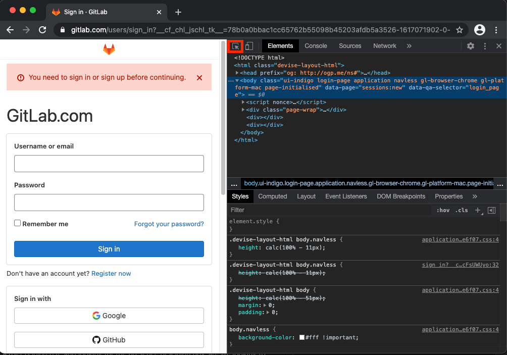
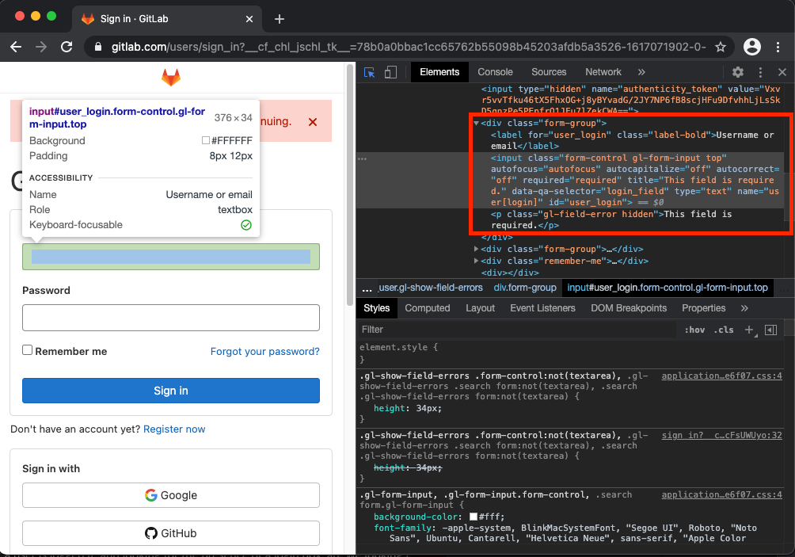
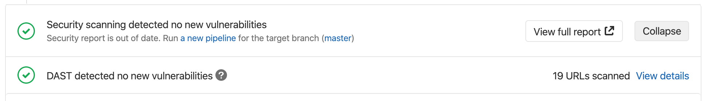

# Dynamic Application Security Testing (DAST) **(ULTIMATE)**

If you deploy your web application into a new environment, your application may
become exposed to new types of attacks. For example, misconfigurations of your
application server or incorrect assumptions about security controls may not be
visible from the source code.

Dynamic Application Security Testing (DAST) examines applications for
vulnerabilities like these in deployed environments. DAST uses the open source
tool [OWASP Zed Attack Proxy](https://www.zaproxy.org/) for analysis.

After DAST creates its report, GitLab evaluates it for discovered
vulnerabilities between the source and target branches. Relevant
findings are noted in the merge request.

The comparison logic uses only the latest pipeline executed for the target
branch's base commit. Running the pipeline on other commits has no effect on
the merge request.

NOTE:
To learn how four of the top six attacks were application-based and how
to protect your organization, download our
["A Seismic Shift in Application Security"](https://about.gitlab.com/resources/whitepaper-seismic-shift-application-security/)
whitepaper.

## DAST application analysis

DAST can analyze applications in two ways:

- Passive scan only (DAST default). DAST executes
  [ZAP's Baseline Scan](https://www.zaproxy.org/docs/docker/baseline-scan/) and doesn't
  actively attack your application.
- Passive and active scan. DAST can be [configured](#full-scan) to also perform an active scan
  to attack your application and produce a more extensive security report. It can be very
  useful when combined with [Review Apps](../../../ci/review_apps/index.md).

NOTE:
A pipeline may consist of multiple jobs, including SAST and DAST scanning. If any job
fails to finish for any reason, the security dashboard doesn't show DAST scanner output. For
example, if the DAST job finishes but the SAST job fails, the security dashboard doesn't show DAST
results. On failure, the analyzer outputs an
[exit code](../../../development/integrations/secure.md#exit-code).

## Prerequisites

- [GitLab Runner](../../../ci/runners/index.md) available, with the
[`docker` executor](https://docs.gitlab.com/runner/executors/docker.html).
- Target application deployed. For more details, read [Deployment options](#deployment-options).

### Deployment options

Depending on the complexity of the target application, there are a few options as to how to deploy and configure
the DAST template. We provided a set of example applications with their configurations in our
[DAST demonstrations](https://gitlab.com/gitlab-org/security-products/demos/dast/) project.

#### Review Apps

Review Apps are the most involved method of deploying your DAST target application. To assist in the process,
we created a Review App deployment using Google Kubernetes Engine (GKE). This example can be found in our
[Review Apps - GKE](https://gitlab.com/gitlab-org/security-products/demos/dast/review-app-gke) project, along with detailed
instructions in the [README.md](https://gitlab.com/gitlab-org/security-products/demos/dast/review-app-gke/-/blob/master/README.md)
on how to configure Review Apps for DAST.

#### Docker Services

If your application utilizes Docker containers you have another option for deploying and scanning with DAST.
After your Docker build job completes and your image is added to your container registry, you can use the image as a
[service](../../../ci/services/index.md).

By using service definitions in your `gitlab-ci.yml`, you can scan services with the DAST analyzer.

```yaml
stages:
  - build
  - dast

include:
  - template: DAST.gitlab-ci.yml

# Deploys the container to the GitLab container registry
deploy:
  services:
  - name: docker:dind
    alias: dind
  image: docker:19.03.5
  stage: build
  script:
    - docker login -u gitlab-ci-token -p $CI_JOB_TOKEN $CI_REGISTRY
    - docker pull $CI_REGISTRY_IMAGE:latest || true
    - docker build --tag $CI_REGISTRY_IMAGE:$CI_COMMIT_SHA --tag $CI_REGISTRY_IMAGE:latest .
    - docker push $CI_REGISTRY_IMAGE:$CI_COMMIT_SHA
    - docker push $CI_REGISTRY_IMAGE:latest

services: # use services to link your app container to the dast job
  - name: $CI_REGISTRY_IMAGE:$CI_COMMIT_SHA
    alias: yourapp

variables:
  DAST_FULL_SCAN_ENABLED: "true" # do a full scan
  DAST_ZAP_USE_AJAX_SPIDER: "true" # use the ajax spider
```

Most applications depend on multiple services such as databases or caching services. By default, services defined in the services fields cannot communicate
with each another. To allow communication between services, enable the `FF_NETWORK_PER_BUILD` [feature flag](https://docs.gitlab.com/runner/configuration/feature-flags.html#available-feature-flags).

```yaml
variables:
  FF_NETWORK_PER_BUILD: "true" # enable network per build so all services can communicate on the same network

services: # use services to link the container to the dast job
  - name: mongo:latest
    alias: mongo
  - name: $CI_REGISTRY_IMAGE:$CI_COMMIT_SHA
    alias: yourapp
```

## DAST run options

You can use DAST to examine your web application:

- Automatically, initiated by a merge request.
- Manually, initiated on demand.

Some of the differences between these run options:

| Automatic scan                                                   | On-demand scan                |
|:-----------------------------------------------------------------|:------------------------------|
| DAST scan is initiated by a merge request.                       | DAST scan is initiated manually, outside the DevOps life cycle. |
| CI/CD variables are sourced from `.gitlab-ci.yml`.               | CI/CD variables are provided in the UI. |
| All [DAST CI/CD variables](#available-cicd-variables) available. | Subset of [DAST CI/CD variables](#available-cicd-variables) available. |
| `DAST.gitlab-ci.yml` template.                                   | `DAST-On-Demand-Scan.gitlab-ci.yml` template. |

### Enable automatic DAST run

To enable DAST to run automatically, either:

- Enable [Auto DAST](../../../topics/autodevops/stages.md#auto-dast) (provided
  by [Auto DevOps](../../../topics/autodevops/index.md)).
- [Include the DAST template](#include-the-dast-template) in your existing
  `.gitlab-ci.yml` file.
- [Configure DAST using the UI](#configure-dast-using-the-ui).

### DAST job order

When using the `DAST.gitlab-ci.yml` template, the `dast` stage is run last as shown in
the example below. To ensure DAST scans the latest code, deploy your application
in a stage before the `dast` stage.

```yaml
  stages:
    - build
    - test
    - deploy
    - dast
```

Be aware that if your pipeline is configured to deploy to the same webserver in
each run, running a pipeline while another is still running could cause a race condition
where one pipeline overwrites the code from another pipeline. The site to be scanned
should be excluded from changes for the duration of a DAST scan.
The only changes to the site should be from the DAST scanner. Be aware that any
changes that users, scheduled tasks, database changes, code changes, other pipelines, or other scanners make to
the site during a scan could lead to inaccurate results.

#### Include the DAST template

> This template was [updated](https://gitlab.com/gitlab-org/gitlab/-/merge_requests/62597) to DAST_VERSION: 2 in GitLab 14.0.

If you want to manually add DAST to your application, the DAST job is defined
in a CI/CD template file. Updates to the template are provided with GitLab
upgrades, allowing you to benefit from any improvements and additions.

To include the DAST template:

1. Select the CI/CD template you want to use:

   - [`DAST.gitlab-ci.yml`](https://gitlab.com/gitlab-org/gitlab/-/blob/master/lib/gitlab/ci/templates/Security/DAST.gitlab-ci.yml):
     Stable version of the DAST CI/CD template.
   - [`DAST.latest.gitlab-ci.yml`](https://gitlab.com/gitlab-org/gitlab/-/blob/master/lib/gitlab/ci/templates/Security/DAST.latest.gitlab-ci.yml):
     Latest version of the DAST template. ([Introduced](https://gitlab.com/gitlab-org/gitlab/-/issues/254325)
     in GitLab 13.8).

   WARNING:
   The latest version of the template may include breaking changes. Use the
   stable template unless you need a feature provided only in the latest template.

   For more information about template versioning, see the
   [CI/CD documentation](../../../development/cicd/templates.md#latest-version).

1. Add a `dast` stage to your GitLab CI stages configuration:

    ```yaml
    stages:
      - dast
    ```

1. Add the template to GitLab, based on your version of GitLab:

   - In GitLab 11.9 and later, [include](../../../ci/yaml/index.md#includetemplate)
     the template by adding the following to your `.gitlab-ci.yml` file:

     ```yaml
     include:
       - template: <template_file.yml>

     variables:
       DAST_WEBSITE: https://example.com
     ```

   - In GitLab 11.8 and earlier, add the contents of the template to your
     `.gitlab_ci.yml` file.

1. Define the URL to be scanned by DAST by using one of these methods:

   - Set the `DAST_WEBSITE` [CI/CD variable](../../../ci/yaml/index.md#variables).
     If set, this value takes precedence.

   - Add the URL in an `environment_url.txt` file at the root of your project. This is
     useful for testing in dynamic environments. To run DAST against an application
     dynamically created during a GitLab CI/CD pipeline, a job that runs prior to
     the DAST scan must persist the application's domain in an `environment_url.txt`
     file. DAST automatically parses the `environment_url.txt` file to find its
     scan target.

     For example, in a job that runs prior to DAST, you could include code that
     looks similar to:

     ```yaml
     script:
       - echo http://${CI_PROJECT_ID}-${CI_ENVIRONMENT_SLUG}.domain.com > environment_url.txt
     artifacts:
       paths: [environment_url.txt]
       when: always
     ```

     You can see an example of this in our
     [Auto DevOps CI YAML](https://gitlab.com/gitlab-org/gitlab/-/blob/master/lib/gitlab/ci/templates/Jobs/Deploy.gitlab-ci.yml)
     file.

The included template creates a `dast` job in your CI/CD pipeline and scans
your project's running application for possible vulnerabilities.

The results are saved as a
[DAST report artifact](../../../ci/yaml/index.md#artifactsreportsdast)
that you can later download and analyze. Due to implementation limitations, we
always take the latest DAST artifact available. Behind the scenes, the
[GitLab DAST Docker image](https://gitlab.com/security-products/dast)
is used to run the tests on the specified URL and scan it for possible
vulnerabilities.

By default, the DAST template uses the latest major version of the DAST Docker
image. Using the `DAST_VERSION` variable, you can choose how DAST updates:

- Automatically update DAST with new features and fixes by pinning to a major
  version (such as `1`).
- Only update fixes by pinning to a minor version (such as `1.6`).
- Prevent all updates by pinning to a specific version (such as `1.6.4`).

Find the latest DAST versions on the [Releases](https://gitlab.com/security-products/dast/-/releases)
page.

#### Configure DAST using the UI

You can enable or configure DAST settings using the UI. The generated settings are formatted so they
can be conveniently pasted into the `.gitlab-ci.yml` file.

1. From the project's home page, go to **Security & Compliance > Configuration**.
1. In the **Dynamic Application Security Testing (DAST)** section, select **Enable DAST** or
   **Configure DAST**.
1. Select the desired **Scanner profile**, or select **Create scanner profile** and save a
   scanner profile. For more details, see [scanner profiles](#scanner-profile).
1. Select the desired **Site profile**, or select **Create site profile** and save a site
   profile. For more details, see [site profiles](#site-profile).
1. Select **Generate code snippet**. A modal opens with the YAML snippet corresponding to the
   options you selected.
1. Do one of the following:
   1. Select **Copy code only** to copy the snippet to your clipboard.
   1. Select **Copy code and open `.gitlab-ci.yml` file** to copy the snippet to your clipboard. The
   CI/CD Editor then opens.
      1. Paste the snippet into the `.gitlab-ci.yml` file.
      1. Select the **Lint** tab to confirm the edited `.gitlab-ci.yml` file is valid.
      1. Select **Commit changes**.

#### Crawling web applications dependent on JavaScript

GitLab has released a new browser-based crawler, an add-on to DAST that uses a browser to crawl web applications for content. This crawler replaces the standard DAST Spider and Ajax Crawler, and uses the same authentication mechanisms as a normal DAST scan.

The browser-based crawler crawls websites by browsing web pages as a user would. This approach works well with web applications that make heavy use of JavaScript, such as Single Page Applications.

For more details, including setup instructions, see [DAST browser-based crawler](browser_based.md).

### Full scan

DAST can be configured to perform [ZAP Full Scan](https://github.com/zaproxy/zaproxy/wiki/ZAP-Full-Scan), which
includes both passive and active scanning against the same target website:

```yaml
include:
  - template: DAST.gitlab-ci.yml

variables:
  DAST_FULL_SCAN_ENABLED: "true"
```

If your DAST job exceeds the job timeout and you need to reduce the scan duration, we shared some
tips for optimizing DAST scans in a [blog post](https://about.gitlab.com/blog/2020/08/31/how-to-configure-dast-full-scans-for-complex-web-applications/).

### API scan

> - [Introduced](https://gitlab.com/gitlab-org/gitlab/-/issues/10928) in [GitLab Ultimate](https://about.gitlab.com/pricing/) 12.10.
> - A new DAST API scanning engine was introduced in [GitLab Ultimate](https://about.gitlab.com/pricing/) 13.10.

Using an API specification as a scan's target is a useful way to seed URLs for scanning an API.
Vulnerability rules in an API scan are different than those in a normal website scan.

A new DAST API scanning engine is available in GitLab 13.12 and later. For more details, see [DAST API scanning engine](../dast_api). The new scanning engine supports REST, SOAP, GraphQL, and generic APIs using forms, XML, and JSON. Testing can be performed using OpenAPI, Postman Collections, and HTTP Archive (HAR) documents.

#### Specification format

API scans support OpenAPI V2 and OpenAPI V3 specifications. You can define these specifications using `JSON` or `YAML`.

#### Import API specification from a URL

If your API specification is accessible at a URL, you can pass that URL in directly as the target.
The specification does not have to be hosted on the same host as the API being tested.

```yaml
include:
  - template: DAST.gitlab-ci.yml

variables:
  DAST_API_OPENAPI: http://my.api/api-specification.yml
```

#### Import API specification from a file

If your API specification file is in your repository, you can provide its filename as the target.
The API specification file must be in the `/zap/wrk` directory.

```yaml
dast:
  before_script:
    - mkdir -p /zap/wrk
    - cp api-specification.yml /zap/wrk/api-specification.yml
  variables:
    GIT_STRATEGY: fetch
    DAST_API_OPENAPI: api-specification.yml
```

#### Full API scan

API scans support full scanning, which can be enabled by using the `DAST_FULL_SCAN_ENABLED`
CI/CD variable. Domain validation is not supported for full API scans.

#### Host override

Specifications often define a host, which contains a domain name and a port. The
host referenced may be different than the host of the API's review instance.
This can cause incorrect URLs to be imported, or a scan on an incorrect host.
Use the `DAST_API_HOST_OVERRIDE` CI/CD variable to override these values.

WARNING:
When using the API host override feature, you cannot use the `$DAST_WEBSITE` variable to override the hostname.
A host override is _only_ supported when importing the API specification from a URL. Attempts to override the
host throw an error when the API specification is imported from a file. This is due to a limitation in the
ZAP OpenAPI extension.

For example, with a OpenAPI V3 specification containing:

```yaml
servers:
  - url: https://api.host.com
```

If the test version of the API is running at `https://api-test.host.com`, then
the following DAST configuration can be used:

```yaml
include:
  - template: DAST.gitlab-ci.yml

variables:
  DAST_API_OPENAPI: http://api-test.host.com/api-specification.yml
  DAST_API_HOST_OVERRIDE: api-test.host.com
```

#### Authentication using headers

Tokens in request headers are often used as a way to authenticate API requests.
You can achieve this by using the `DAST_REQUEST_HEADERS` CI/CD variable.
Headers are applied to every request DAST makes.

```yaml
include:
  - template: DAST.gitlab-ci.yml

variables:
  DAST_API_OPENAPI: http://api-test.api.com/api-specification.yml
  DAST_REQUEST_HEADERS: "Authorization: Bearer my.token"
```

### URL scan

> - [Introduced](https://gitlab.com/gitlab-org/gitlab/-/issues/214120) in [GitLab Ultimate](https://about.gitlab.com/pricing/) 13.4.
> - [Improved](https://gitlab.com/gitlab-org/gitlab/-/issues/273141) in GitLab 13.11.

A URL scan allows you to specify which parts of a website are scanned by DAST.

#### Define the URLs to scan

URLs to scan can be specified by either of the following methods:

- Use `DAST_PATHS_FILE` CI/CD variable to specify the name of a file containing the paths.
- Use `DAST_PATHS` variable to list the paths.

##### Use `DAST_PATHS_FILE` CI/CD variable

> [Introduced](https://gitlab.com/gitlab-org/gitlab/-/issues/258825) in GitLab 13.6.

To define the URLs to scan in a file, create a plain text file with one path per line.

```plaintext
page1.html
/page2.html
category/shoes/page1.html
```

To scan the URLs in that file, set the CI/CD variable `DAST_PATHS_FILE` to the path of that file.
The file can be checked into the project repository or generated as an artifact by a job that
runs before DAST.

By default, DAST scans do not clone the project repository. Instruct the DAST job to clone
the project by setting `GIT_STRATEGY` to fetch. Give a file path relative to `CI_PROJECT_DIR` to `DAST_PATHS_FILE`.

```yaml
include:
  - template: DAST.gitlab-ci.yml

variables:
  GIT_STRATEGY: fetch
  DAST_PATHS_FILE: url_file.txt  # url_file.txt lives in the root directory of the project
```

##### Use `DAST_PATHS` CI/CD variable

> [Introduced](https://gitlab.com/gitlab-org/gitlab/-/issues/214120) in GitLab 13.4.

To specify the paths to scan in a CI/CD variable, add a comma-separated list of the paths to the `DAST_PATHS`
variable. Note that you can only scan paths of a single host.

```yaml
include:
  - template: DAST.gitlab-ci.yml

variables:
  DAST_PATHS: "/page1.html,/category1/page1.html,/page3.html"
```

When using `DAST_PATHS` and `DAST_PATHS_FILE`, note the following:

- `DAST_WEBSITE` must be defined when using either `DAST_PATHS_FILE` or `DAST_PATHS`. The paths listed in either use `DAST_WEBSITE` to build the URLs to scan
- Spidering is disabled when `DAST_PATHS` or `DAST_PATHS_FILE` are defined
- `DAST_PATHS_FILE` and `DAST_PATHS` can not be used together
- The `DAST_PATHS` variable has a limit of about 130kb. If you have a list or paths
  greater than this, use `DAST_PATHS_FILE`.

#### Full Scan

To perform a [full scan](#full-scan) on the listed paths, use the `DAST_FULL_SCAN_ENABLED` CI/CD variable.

### View details of a vulnerability detected by DAST

> [Introduced](https://gitlab.com/gitlab-org/gitlab/-/issues/36332) in [GitLab Ultimate](https://about.gitlab.com/pricing/) 13.1.

Vulnerabilities detected by DAST occur in the live web application. Addressing these types of
vulnerabilities requires specific information. DAST provides the information required to
investigate and rectify the underlying cause.

To view details of vulnerabilities detected by DAST:

1. To see all vulnerabilities detected, either:
   - Go to your project and select **Security & Compliance**.
   - Go to the merge request and select the **Security** tab.

1. Select a vulnerability's description. The following details are provided:

   | Field            | Description                                                        |
   |:-----------------|:------------------------------------------------------------------ |
   | Description      | Description of the vulnerability.                                  |
   | Project          | Namespace and project in which the vulnerability was detected.     |
   | Method           | HTTP method used to detect the vulnerability.                      |
   | URL              | URL at which the vulnerability was detected.                       |
   | Request Headers  | Headers of the request.                                            |
   | Response Status  | Response status received from the application.                     |
   | Response Headers | Headers of the response received from the application.             |
   | Evidence         | Evidence of the data found that verified the vulnerability. Often a snippet of the request or response, this can be used to help verify that the finding is a vulnerability. |
   | Identifiers      | Identifiers of the vulnerability.                                  |
   | Severity         | Severity of the vulnerability.                                     |
   | Scanner Type     | Type of vulnerability report.                                      |
   | Links            | Links to further details of the detected vulnerability.            |
   | Solution         | Details of a recommended solution to the vulnerability (optional). |

### Customizing the DAST settings

WARNING:
Beginning in GitLab 13.0, the use of [`only` and `except`](../../../ci/yaml/index.md#only--except)
is no longer supported. When overriding the template, you must use [`rules`](../../../ci/yaml/index.md#rules) instead.

The DAST settings can be changed through CI/CD variables by using the
[`variables`](../../../ci/yaml/index.md#variables) parameter in `.gitlab-ci.yml`.
These variables are documented in [available variables](#available-cicd-variables).

For example:

```yaml
include:
  - template: DAST.gitlab-ci.yml

variables:
  DAST_WEBSITE: https://example.com
  DAST_SPIDER_MINS: 120
```

Because the template is [evaluated before](../../../ci/yaml/index.md#include) the pipeline
configuration, the last mention of the variable takes precedence.

#### Enabling and disabling rules

A complete list of the rules that DAST uses to scan for vulnerabilities can be
found in the [ZAP docs](https://www.zaproxy.org/docs/alerts/).

`DAST_EXCLUDE_RULES` disables the rules with the given IDs.

`DAST_ONLY_INCLUDE_RULES` restricts the set of rules used in the scan to
those with the given IDs.

`DAST_EXCLUDE_RULES` and `DAST_ONLY_INCLUDE_RULES` are mutually exclusive and a
DAST scan with both configured exits with an error.

By default, several rules are disabled because they either take a long time to
run or frequently generate false positives. The complete list of disabled rules
can be found in [exclude_rules.yml](https://gitlab.com/gitlab-org/security-products/dast/-/blob/main/src/config/exclude_rules.yml).

### Hide sensitive information

> [Introduced](https://gitlab.com/gitlab-org/gitlab/-/issues/36332) in GitLab 13.1.

HTTP request and response headers may contain sensitive information, including cookies and
authorization credentials. By default, the following headers are masked:

- `Authorization`.
- `Proxy-Authorization`.
- `Set-Cookie` (values only).
- `Cookie` (values only).

Using the [`DAST_MASK_HTTP_HEADERS` CI/CD variable](#available-cicd-variables), you can list the
headers whose values you want masked. For details on how to mask headers, see
[Customizing the DAST settings](#customizing-the-dast-settings).

## Authentication

NOTE:
We highly recommend you configure the scanner to authenticate to the application. If you don't, it cannot check most of the application for security risks, as most
of your application is likely not accessible without authentication. We also recommend
you periodically confirm the scanner's authentication is still working, as this tends to break over
time due to authentication changes to the application.

Create masked CI/CD variables to pass the credentials that DAST uses.
To create masked variables for the username and password, see [Create a custom variable in the UI](../../../ci/variables/index.md#custom-cicd-variables).
The key of the username variable must be `DAST_USERNAME`,
and the key of the password variable must be `DAST_PASSWORD`.

After DAST has authenticated with the application, all cookies are collected from the web browser.
For each cookie a matching session token is created for use by ZAP. This ensures ZAP is recognized
by the application as correctly authenticated.

Authentication supports single form logins, multi-step login forms, and authenticating to URLs outside of the configured target URL.

Variables that are related to authenticated scans are:

```yaml
include:
  - template: DAST.gitlab-ci.yml

dast:
  variables:
    DAST_WEBSITE: "https://example.com"
    DAST_AUTH_URL: "https://login.example.com/"
    DAST_BROWSER_PATH_TO_LOGIN_FORM: "css:.navigation-menu,css:.login-menu-item" # optional list of selectors that should be clicked on prior to attempting to input username/password into the sign-in HTML form
    DAST_USERNAME: "admin"
    DAST_PASSWORD: "P@55w0rd!"
    DAST_USERNAME_FIELD: "name:username" # a selector describing the element containing the username field at the sign-in HTML form
    DAST_PASSWORD_FIELD: "id:password" # a selector describing the element containing the password field at the sign-in HTML form
    DAST_FIRST_SUBMIT_FIELD: "css:button[type='user-submit']" # optional, the selector of the element that when clicked will submit the username form of a multi-page login process
    DAST_SUBMIT_FIELD: "css:button[type='submit']" # the selector of the element that when clicked will submit the login form or the password form of a multi-page login process
    DAST_EXCLUDE_URLS: "http://example.com/sign-out"  # optional, URLs to skip during the authenticated scan; comma-separated, no spaces in between
    DAST_AUTH_VERIFICATION_URL: "http://example.com/loggedin_page"  # optional, used to verify authentication is successful by expecting this URL once the login form has been submitted
    DAST_AUTH_VERIFICATION_SELECTOR: "css:.user-profile" # optional, used to verify authentication is successful by expecting a selector to be present on the page once the login form has been submitted
    DAST_AUTH_VERIFICATION_LOGIN_FORM: "true" # optional, used to verify authentication is successful by ensuring there are no login forms on the page once the login form has been submitted
    DAST_AUTH_REPORT: "true" # optionally output an authentication debug report
```

WARNING:
**NEVER** run an authenticated scan against a production server. When an authenticated
scan is run, it may perform *any* function that the authenticated user can. This
includes actions like modifying and deleting data, submitting forms, and following links.
Only run an authenticated scan against a test server.

### Log in using automatic detection of the login form

By providing a `DAST_USERNAME`, `DAST_PASSWORD`, and `DAST_AUTH_URL`, DAST will attempt to authenticate to the
target application by locating the login form based on a determination about whether or not the form contains username or password fields.

Automatic detection is "best-effort", and depending on the application being scanned may provide either a resilient login experience or one that fails to authenticate the user.

Login process:

1. The `DAST_AUTH_URL` is loaded into the browser, and any forms on the page are located.
   1. If a form contains a username and password field, `DAST_USERNAME` and `DAST_PASSWORD` is inputted into the respective fields, the form submit button is clicked and the user is logged in.
   1. If a form contains only a username field, it is assumed that the login form is multi-step.
      1. The `DAST_USERNAME` is inputted into the username field and the form submit button is clicked.
      1. The subsequent pages loads where it is expected that a form exists and contains a password field. If found, `DAST_PASSWORD` is inputted, form submit button is clicked and the user is logged in.

### Log in using explicit selection of the login form

By providing a `DAST_USERNAME_FIELD`, `DAST_PASSWORD_FIELD`, and `DAST_SUBMIT_FIELD`, in addition to the fields required for automatic login,
DAST will attempt to authenticate to the target application by locating the login form based on the selectors provided.
Most applications will benefit from this approach to authentication.

Login process:

1. The `DAST_AUTH_URL` is loaded into the browser, and any forms on the page are located.
   1. If the `DAST_FIRST_SUBMIT_FIELD` is not defined, then `DAST_USERNAME` is inputted into `DAST_USERNAME_FIELD`, `DAST_PASSWORD` is inputted into `DAST_PASSWORD_FIELD`, `DAST_SUBMIT_FIELD` is clicked and the user is logged in.
   1. If the `DAST_FIRST_SUBMIT_FIELD` is defined, then it is assumed that the login form is multi-step.
      1. The `DAST_USERNAME` is inputted into the `DAST_USERNAME_FIELD` field and the `DAST_FIRST_SUBMIT_FIELD` is clicked.
      1. The subsequent pages loads where the `DAST_PASSWORD` is inputted into the `DAST_PASSWORD_FIELD` field, the `DAST_SUBMIT_FIELD` is clicked and the user is logged in.

### Verifying successful login

Once the login form has been submitted, DAST determines if the login was successful. Unsuccessful attempts at authentication cause the scan to halt.

Following the submission of the login form, authentication is determined to be unsuccessful when:

- A `400` or `500` series HTTP response status code is returned.
- A new cookie/browser storage value determined to be sufficiently random has not been set.

In addition to these checks, the user can configure their own verification checks.
Each of the following checks can be used in conjunction with one another, if none are configured by default the presence of a login form is checked.

#### Verifying based on the URL

When `DAST_AUTH_VERIFICATION_URL` is configured, the URL displayed in the browser tab post login form submission is directly compared to the URL in the CI/CD variable.
If these are not exactly the same, authentication is deemed to be unsuccessful.

For example:

```yaml
include:
  - template: DAST.gitlab-ci.yml

dast:
  variables:
    DAST_WEBSITE: "https://example.com"
    ...
    DAST_AUTH_VERIFICATION_URL: "https://example.com/user/welcome"
```

#### Verify based on presence of an element

When `DAST_AUTH_VERIFICATION_SELECTOR` is configured, the page displayed in the browser tab is searched for an element described by the selector in the CI/CD variable.
If no element is found, authentication is deemed to be unsuccessful.

For example:

```yaml
include:
  - template: DAST.gitlab-ci.yml

dast:
  variables:
    DAST_WEBSITE: "https://example.com"
    ...
    DAST_AUTH_VERIFICATION_SELECTOR: "css:.welcome-user"
```

#### Verify based on presence of a login form

When `DAST_AUTH_VERIFICATION_LOGIN_FORM` is configured, the page displayed in the browser tab is searched for a form that is detected to be a login form.
If any such form is found, authentication is deemed to be unsuccessful.

For example:

```yaml
include:
  - template: DAST.gitlab-ci.yml

dast:
  variables:
    DAST_WEBSITE: "https://example.com"
    ...
    DAST_AUTH_VERIFICATION_LOGIN_FORM: "true"
```

### View the login form

Many web applications show the user the login form in a pop-up (modal) window.
For these applications, navigating to the form requires both:

- A starting URL.
- A list of elements to click to display the modal window.

When `DAST_BROWSER_PATH_TO_LOGIN_FORM` is present, like in this example:

```yaml
include:
  - template: DAST.gitlab-ci.yml

dast:
  variables:
    DAST_WEBSITE: "https://my.site.com"
    ...
    DAST_AUTH_URL: "https://my.site.com/admin"
    DAST_BROWSER_PATH_TO_LOGIN_FORM: "css:.navigation-menu,css:.login-menu-item"
```

DAST performs these actions:

1. Load the `DAST_AUTH_URL` page, such as `https://my.site.com/admin`.
1. After the page loads, DAST selects elements found by the selectors described
   in `DAST_BROWSER_PATH_TO_LOGIN_FORM`. This example opens the navigation menu
   and selects the login menu, to display the login modal window.
1. To continue the authentication process, DAST fills in the username and password
   on the login form.

### Configure the authentication debug output

It is often difficult to understand the cause of an authentication failure when running DAST in a CI/CD pipeline.
To assist users in debugging authentication issues, a debug report can be generated and saved as a job artifact.
This HTML report contains all steps made during the login process, along with HTTP requests and responses, the Document Object Model (DOM) and screenshots.


An example configuration where the authentication debug report is exported may look like the following:

```yaml
dast:
  variables:
    DAST_WEBSITE: "https://example.com"
    ...
    DAST_AUTH_REPORT: "true"
  artifacts:
    paths: [gl-dast-debug-auth-report.html]
    when: always
```

### Available CI/CD variables

You can use CI/CD variables to customize DAST.

| CI/CD variable                                  | Type          | Description                    |
|:------------------------------------------------|:--------------|:-------------------------------|
| `SECURE_ANALYZERS_PREFIX`                       | URL           | Set the Docker registry base address from which to download the analyzer. |
| `DAST_WEBSITE` <sup>1</sup>                     | URL           | The URL of the website to scan. `DAST_API_OPENAPI` must be specified if this is omitted. |
| `DAST_API_OPENAPI`                              | URL or string | The API specification to import. The specification can be hosted at a URL, or the name of a file present in the `/zap/wrk` directory. `DAST_WEBSITE` must be specified if this is omitted. |
| `DAST_API_SPECIFICATION` <sup>1</sup>           | URL or string | [Deprecated](https://gitlab.com/gitlab-org/gitlab/-/issues/290241) in GitLab 13.12 and replaced by `DAST_API_OPENAPI`. To be removed in GitLab 15.0. The API specification to import. The specification can be hosted at a URL, or the name of a file present in the `/zap/wrk` directory. `DAST_WEBSITE` must be specified if this is omitted. |
| `DAST_SPIDER_START_AT_HOST`                     | boolean       | Set to `false` to prevent DAST from resetting the target to its host before scanning. When `true`, non-host targets `http://test.site/some_path` is reset to `http://test.site` before scan. Default: `true`. [Introduced](https://gitlab.com/gitlab-org/gitlab/-/issues/258805) in GitLab 13.6. |
| `DAST_AUTH_URL` <sup>1</sup>                    | URL           | The URL of the page containing the sign-in HTML form on the target website. `DAST_USERNAME` and `DAST_PASSWORD` are submitted with the login form to create an authenticated scan. Not supported for API scans. |
| `DAST_BROWSER_PATH_TO_LOGIN_FORM` <sup>1</sup>  | selector      | Comma-separated list of selectors that will be clicked on prior to attempting to enter `DAST_USERNAME` and `DAST_PASSWORD` into the login form. [Introduced](https://gitlab.com/gitlab-org/gitlab/-/issues/326633) in GitLab 14.1. |
| `DAST_USERNAME` <sup>1</sup>                    | string        | The username to authenticate to in the website. |
| `DAST_PASSWORD` <sup>1</sup>                    | string        | The password to authenticate to in the website. |
| `DAST_USERNAME_FIELD` <sup>1</sup>              | string        | The name of username field at the sign-in HTML form. |
| `DAST_PASSWORD_FIELD` <sup>1</sup>              | string        | The name of password field at the sign-in HTML form. |
| `DAST_SKIP_TARGET_CHECK`                        | boolean       | Set to `true` to prevent DAST from checking that the target is available before scanning. Default: `false`. [Introduced](https://gitlab.com/gitlab-org/gitlab/-/issues/229067) in GitLab 13.8. |
| `DAST_MASK_HTTP_HEADERS`                        | string        | Comma-separated list of request and response headers to be masked (GitLab 13.1). Must contain **all** headers to be masked. Refer to [list of headers that are masked by default](#hide-sensitive-information). |
| `DAST_EXCLUDE_URLS` <sup>1</sup>                | URLs          | The URLs to skip during the authenticated scan; comma-separated. Regular expression syntax can be used to match multiple URLs. For example, `.*` matches an arbitrary character sequence. Not supported for API scans. |
| `DAST_FULL_SCAN_ENABLED` <sup>1</sup>           | boolean       | Set to `true` to run a [ZAP Full Scan](https://github.com/zaproxy/zaproxy/wiki/ZAP-Full-Scan) instead of a [ZAP Baseline Scan](https://github.com/zaproxy/zaproxy/wiki/ZAP-Baseline-Scan). Default: `false` |
| `DAST_FULL_SCAN_DOMAIN_VALIDATION_REQUIRED`     | boolean       | **{warning}** **[Removed](https://gitlab.com/gitlab-org/gitlab/-/issues/293595)** in GitLab 14.0. Set to `true` to require domain validation when running DAST full scans. Not supported for API scans. Default: `false` |
| `DAST_AUTO_UPDATE_ADDONS`                       | boolean       | ZAP add-ons are pinned to specific versions in the DAST Docker image. Set to `true` to download the latest versions when the scan starts. Default: `false` |
| `DAST_API_HOST_OVERRIDE` <sup>1</sup>           | string        | Used to override domains defined in API specification files. Only supported when importing the API specification from a URL. Example: `example.com:8080` |
| `DAST_EXCLUDE_RULES`                            | string        | Set to a comma-separated list of Vulnerability Rule IDs to exclude them from running during the scan. Rule IDs are numbers and can be found from the DAST log or on the [ZAP project](https://www.zaproxy.org/docs/alerts/). For example, `HTTP Parameter Override` has a rule ID of `10026`. Cannot be used when `DAST_ONLY_INCLUDE_RULES` is set. **Note:** In earlier versions of GitLab the excluded rules were executed but vulnerabilities they generated were suppressed. [Introduced](https://gitlab.com/gitlab-org/gitlab/-/issues/118641) in GitLab 12.10. |
| `DAST_ONLY_INCLUDE_RULES`                       | string        | Set to a comma-separated list of Vulnerability Rule IDs to configure the scan to run only them. Rule IDs are numbers and can be found from the DAST log or on the [ZAP project](https://www.zaproxy.org/docs/alerts/). Cannot be used when `DAST_EXCLUDE_RULES` is set. [Introduced](https://gitlab.com/gitlab-org/gitlab/-/issues/250651) in GitLab 13.12. |
| `DAST_REQUEST_HEADERS` <sup>1</sup>             | string        | Set to a comma-separated list of request header names and values. Headers are added to every request made by DAST. For example, `Cache-control: no-cache,User-Agent: DAST/1.0` |
| `DAST_DEBUG` <sup>1</sup>                       | boolean       | Enable debug message output. Default: `false`. [Introduced](https://gitlab.com/gitlab-org/gitlab/-/issues/12652) in GitLab 13.1. |
| `DAST_TARGET_AVAILABILITY_TIMEOUT` <sup>1</sup> | number        | Time limit in seconds to wait for target availability. |
| `DAST_SPIDER_MINS` <sup>1</sup>                 | number        | The maximum duration of the spider scan in minutes. Set to `0` for unlimited. Default: One minute, or unlimited when the scan is a full scan. [Introduced](https://gitlab.com/gitlab-org/gitlab/-/issues/12652) in GitLab 13.1. |
| `DAST_HTML_REPORT`                              | string        | The filename of the HTML report written at the end of a scan. [Introduced](https://gitlab.com/gitlab-org/gitlab/-/issues/12652) in GitLab 13.1. |
| `DAST_MARKDOWN_REPORT`                          | string        | The filename of the Markdown report written at the end of a scan. [Introduced](https://gitlab.com/gitlab-org/gitlab/-/issues/12652) in GitLab 13.1. |
| `DAST_XML_REPORT`                               | string        | The filename of the XML report written at the end of a scan. [Introduced](https://gitlab.com/gitlab-org/gitlab/-/issues/12652) in GitLab 13.1. |
| `DAST_INCLUDE_ALPHA_VULNERABILITIES`            | boolean       | Set to `true` to include alpha passive and active scan rules. Default: `false`. [Introduced](https://gitlab.com/gitlab-org/gitlab/-/issues/12652) in GitLab 13.1. |
| `DAST_USE_AJAX_SPIDER` <sup>1</sup>             | boolean       | Set to `true` to use the AJAX spider in addition to the traditional spider, useful for crawling sites that require JavaScript. Default: `false`. [Introduced](https://gitlab.com/gitlab-org/gitlab/-/issues/12652) in GitLab 13.1. |
| `DAST_PATHS`                                    | string        | Set to a comma-separated list of URLs for DAST to scan. For example, `/page1.html,/category1/page3.html,/page2.html`. [Introduced](https://gitlab.com/gitlab-org/gitlab/-/issues/214120) in GitLab 13.4. |
| `DAST_PATHS_FILE`                               | string        | The file path containing the paths within `DAST_WEBSITE` to scan. The file must be plain text with one path per line. [Introduced](https://gitlab.com/gitlab-org/gitlab/-/issues/258825) in GitLab 13.6. |
| `DAST_SUBMIT_FIELD`                             | string        | The `id` or `name` of the element that when clicked submits the login form or the password form of a multi-page login process. [Introduced](https://gitlab.com/gitlab-org/gitlab-ee/issues/9894) in GitLab 12.4. |
| `DAST_FIRST_SUBMIT_FIELD`                       | string        | The `id` or `name` of the element that when clicked submits the username form of a multi-page login process. [Introduced](https://gitlab.com/gitlab-org/gitlab-ee/issues/9894) in GitLab 12.4. |
| `DAST_ZAP_CLI_OPTIONS`                          | string        | ZAP server command-line options. For example, `-Xmx3072m` would set the Java maximum memory allocation pool size. [Introduced](https://gitlab.com/gitlab-org/gitlab/-/issues/12652) in GitLab 13.1. |
| `DAST_ZAP_LOG_CONFIGURATION`                    | string        | Set to a semicolon-separated list of additional log4j properties for the ZAP Server. For example, `log4j.logger.org.parosproxy.paros.network.HttpSender=DEBUG;log4j.logger.com.crawljax=DEBUG` |
| `DAST_AUTH_EXCLUDE_URLS`                        | URLs          | **{warning}** **[Removed](https://gitlab.com/gitlab-org/gitlab/-/issues/289959)** in GitLab 14.0. Replaced by `DAST_EXCLUDE_URLS`. The URLs to skip during the authenticated scan; comma-separated. Regular expression syntax can be used to match multiple URLs. For example, `.*` matches an arbitrary character sequence. Not supported for API scans. |
| `DAST_AGGREGATE_VULNERABILITIES`                | boolean       | Vulnerability aggregation is set to `true` by default. To disable this feature and see each vulnerability individually set to `false`. [Introduced](https://gitlab.com/gitlab-org/gitlab/-/issues/254043) in GitLab 14.0. |
| `DAST_MAX_URLS_PER_VULNERABILITY`               | number        | The maximum number of URLs reported for a single vulnerability. `DAST_MAX_URLS_PER_VULNERABILITY` is set to `50` by default. To list all the URLs set to `0`. [Introduced](https://gitlab.com/gitlab-org/security-products/dast/-/merge_requests/433) in GitLab 13.12. |
| `DAST_AUTH_REPORT`                              | boolean       | Used in combination with exporting the `gl-dast-debug-auth-report.html` artifact to aid in debugging authentication issues. |
| `DAST_AUTH_VERIFICATION_URL` <sup>1</sup>       | URL           | A URL only accessible to logged in users that DAST can use to confirm successful authentication. If provided, DAST exits if it cannot access the URL. [Introduced](https://gitlab.com/gitlab-org/gitlab/-/issues/207335) in GitLab 13.8. |
| `DAST_AUTH_VERIFICATION_SELECTOR`               | selector      | Verifies successful authentication by checking for presence of a selector once the login form has been submitted. Example: `css:.user-photo` |
| `DAST_AUTH_VERIFICATION_LOGIN_FORM`             | boolean       | Verifies successful authentication by checking for the lack of a login form once the login form has been submitted. |
| `DAST_ADVERTISE_SCAN`                           | boolean       | Set to `true` to add a `Via` header to every request sent, advertising that the request was sent as part of a GitLab DAST scan. [Introduced](https://gitlab.com/gitlab-org/gitlab/-/issues/334947) in GitLab 14.1. |

1. Available to an on-demand DAST scan.

#### Selectors

Selectors are used by CI/CD variables to specify the location of an element displayed on a page in a browser.
Selectors have the format `type`:`search string`. The crawler will search for the selector using the search string based on the type.

| Selector type | Example                            | Description |
| ------------- | ---------------------------------- | ----------- |
| `css`         | `css:.password-field`              | Searches for a HTML element having the supplied CSS selector. Selectors should be as specific as possible for performance reasons. |
| `id`          | `id:element`                       | Searches for an HTML element with the provided element ID. |
| `name`        | `name:element`                     | Searches for an HTML element with the provided element name. |
| `xpath`       | `xpath://input[@id="my-button"]/a` | Searches for a HTML element with the provided XPath. Note that XPath searches are expected to be less performant than other searches. |
| None provided | `a.click-me`                       | Defaults to searching using a CSS selector. |

##### Find selectors with Google Chrome

Chrome DevTools element selector tool is an effective way to find a selector.

1. Open Chrome and navigate to the page where you would like to find a selector, for example, the login page for your site.
1. Open the `Elements` tab in Chrome DevTools with the keyboard shortcut `Command + Shift + c` in macOS or `Ctrl + Shift + c` in Windows.
1. Select the `Select an element in the page to select it` tool.
   
1. Select the field on your page that you would like to know the selector for.
1. Once the tool is active, highlight a field you wish to view the details of.
   
1. Once highlighted, you can see the element's details, including attributes that would make a good candidate for a selector.

In this example, the `id="user_login"` appears to be a good candidate. You can use this as a selector as the DAST username field by setting 
`DAST_USERNAME_FIELD: "id:user_login"`. 

##### Choose the right selector

Judicious choice of selector leads to a scan that is resilient to the application changing.

In order of preference, it is recommended to choose as selectors:

- `id` fields. These are generally unique on a page, and rarely change.
- `name` fields. These are generally unique on a page, and rarely change.
- `class` values specific to the field, such as the selector `"css:.username"` for the `username` class on the username field.
- Presence of field specific data attributes, such as the selector, `"css:[data-username]"` when the `data-username` field has any value on the username field.
- Multiple `class` hierarchy values, such as the selector `"css:.login-form .username"` when there are multiple elements with class `username` but only one nested inside the element with the class `login-form`.

When using selectors to locate specific fields we recommend you avoid searching on:

- Any `id`, `name`, `attribute`, `class` or `value` that is dynamically generated.
- Generic class names, such as `column-10` and `dark-grey`.
- XPath searches as they are less performant than other selector searches.
- Unscoped searches, such as those beginning with `css:*` and `xpath://*`.

### DAST command-line options

Not all DAST configuration is available via CI/CD variables. To find out all
possible options, run the following configuration.
Available command-line options are printed to the job log:

```yaml
include:
  template: DAST.gitlab-ci.yml

dast:
  script:
    - /analyze --help
```

You must then overwrite the `script` command to pass in the appropriate
argument. For example, vulnerability definitions in alpha can be included with
`-a`. The following configuration includes those definitions:

```yaml
include:
  template: DAST.gitlab-ci.yml

dast:
  script:
    - export DAST_WEBSITE=${DAST_WEBSITE:-$(cat environment_url.txt)}
    - /analyze -a -t $DAST_WEBSITE
```

### Custom ZAProxy configuration

The ZAProxy server contains many [useful configurable values](https://gitlab.com/gitlab-org/gitlab/-/issues/36437#note_245801885).
Many key/values for `-config` remain undocumented, but there is an untested list of
[possible keys](https://gitlab.com/gitlab-org/gitlab/-/issues/36437#note_244981023).
Note that these options are not supported by DAST, and may break the DAST scan
when used. An example of how to rewrite the Authorization header value with `TOKEN` follows:

```yaml
include:
  template: DAST.gitlab-ci.yml

variables:
  DAST_ZAP_CLI_OPTIONS: "-config replacer.full_list(0).description=auth -config replacer.full_list(0).enabled=true -config replacer.full_list(0).matchtype=REQ_HEADER -config replacer.full_list(0).matchstr=Authorization -config replacer.full_list(0).regex=false -config replacer.full_list(0).replacement=TOKEN"
```

### Bleeding-edge vulnerability definitions

ZAP first creates rules in the `alpha` class. After a testing period with
the community, they are promoted to `beta`. DAST uses `beta` definitions by
default. To request `alpha` definitions, use the
`DAST_INCLUDE_ALPHA_VULNERABILITIES` CI/CD variable as shown in the
following configuration:

```yaml
include:
  template: DAST.gitlab-ci.yml

variables:
  DAST_INCLUDE_ALPHA_VULNERABILITIES: "true"
```

### Cloning the project's repository

The DAST job does not require the project's repository to be present when running, so by default
[`GIT_STRATEGY`](../../../ci/runners/configure_runners.md#git-strategy) is set to `none`.

### Debugging DAST jobs

A DAST job has two executing processes:

- The ZAP server.
- A series of scripts that start, control and stop the ZAP server.

Debug mode of the scripts can be enabled by using the `DAST_DEBUG` CI/CD variable. This can help when troubleshooting the job,
and outputs statements indicating what percentage of the scan is complete.
For details on using variables, see [Overriding the DAST template](#customizing-the-dast-settings).

Debug mode of the ZAP server can be enabled using the `DAST_ZAP_LOG_CONFIGURATION` variable.
The following table outlines examples of values that can be set and the effect that they have on the output that is logged.
Multiple values can be specified, separated by semicolons.

For example, `log4j.logger.org.parosproxy.paros.network.HttpSender=DEBUG;log4j.logger.com.crawljax=DEBUG`.

| Log configuration value                                      | Effect                                                            |
|--------------------------------------------------            | ----------------------------------------------------------------- |
| `log4j.rootLogger=DEBUG`                                     | Enable all debug logging statements.                              |
| `log4j.logger.org.apache.commons.httpclient=DEBUG`           | Log every HTTP request and response made by the ZAP server.       |
| `log4j.logger.org.zaproxy.zap.spider.SpiderController=DEBUG` | Log URLs found during the spider scan of the target.              |
| `log4j.logger.com.crawljax=DEBUG`                            | Enable Ajax Crawler debug logging statements.                     |
| `log4j.logger.org.parosproxy.paros=DEBUG`                    | Enable ZAP server proxy debug logging statements.                 |
| `log4j.logger.org.zaproxy.zap=DEBUG`                         | Enable debug logging statements of the general ZAP server code.   |

## Running DAST in an offline environment

For self-managed GitLab instances in an environment with limited, restricted, or intermittent access
to external resources through the internet, some adjustments are required for the DAST job to
successfully run. For more information, see [Offline environments](../offline_deployments/index.md).

### Requirements for offline DAST support

To use DAST in an offline environment, you need:

- GitLab Runner with the [`docker` or `kubernetes` executor](#prerequisites).
- Docker Container Registry with a locally available copy of the DAST
  [container image](https://gitlab.com/security-products/dast), found in the
  [DAST container registry](https://gitlab.com/security-products/dast/container_registry).

Note that GitLab Runner has a [default `pull policy` of `always`](https://docs.gitlab.com/runner/executors/docker.html#using-the-always-pull-policy),
meaning the runner tries to pull Docker images from the GitLab container registry even if a local
copy is available. The GitLab Runner [`pull_policy` can be set to `if-not-present`](https://docs.gitlab.com/runner/executors/docker.html#using-the-if-not-present-pull-policy)
in an offline environment if you prefer using only locally available Docker images. However, we
recommend keeping the pull policy setting to `always` if not in an offline environment, as this
enables the use of updated scanners in your CI/CD pipelines.

### Make GitLab DAST analyzer images available inside your Docker registry

For DAST, import the following default DAST analyzer image from `registry.gitlab.com` to your [local Docker container registry](../../packages/container_registry/index.md):

- `registry.gitlab.com/security-products/dast:latest`

The process for importing Docker images into a local offline Docker registry depends on
**your network security policy**. Please consult your IT staff to find an accepted and approved
process by which external resources can be imported or temporarily accessed.
These scanners are [periodically updated](../vulnerabilities/index.md#vulnerability-scanner-maintenance)
with new definitions, and you may be able to make occasional updates on your own.

For details on saving and transporting Docker images as a file, see Docker's documentation on
[`docker save`](https://docs.docker.com/engine/reference/commandline/save/),
[`docker load`](https://docs.docker.com/engine/reference/commandline/load/),
[`docker export`](https://docs.docker.com/engine/reference/commandline/export/), and
[`docker import`](https://docs.docker.com/engine/reference/commandline/import/).

### Set DAST CI/CD job variables to use local DAST analyzers

Add the following configuration to your `.gitlab-ci.yml` file. You must replace `image` to refer to
the DAST Docker image hosted on your local Docker container registry:

```yaml
include:
  - template: DAST.gitlab-ci.yml
dast:
  image: registry.example.com/namespace/dast:latest
```

The DAST job should now use local copies of the DAST analyzers to scan your code and generate
security reports without requiring internet access.

Alternatively, you can use the CI/CD variable `SECURE_ANALYZERS_PREFIX` to override the base registry address of the `dast` image.

## On-demand scans

> - [Introduced](https://gitlab.com/gitlab-org/gitlab/-/issues/218465) in GitLab 13.2.
> - [Improved](https://gitlab.com/gitlab-org/gitlab/-/issues/218465) in GitLab 13.3.
> - The saved scans feature was [introduced](https://gitlab.com/groups/gitlab-org/-/epics/5100) in GitLab 13.9.
> - The option to select a branch was [introduced](https://gitlab.com/groups/gitlab-org/-/epics/4847) in GitLab 13.10.
> - DAST branch selection [feature flag removed](https://gitlab.com/gitlab-org/gitlab/-/issues/322672) in GitLab 13.11.
> - Auditing for DAST profile management was [introduced](https://gitlab.com/gitlab-org/gitlab/-/issues/217872) in GitLab 14.1.

An on-demand DAST scan runs outside the DevOps life cycle. Changes in your repository don't trigger
the scan. You must start it manually.

An on-demand DAST scan:

- Can run a specific combination of a [site profile](#site-profile) and a
  [scanner profile](#scanner-profile).
- Is associated with your project's default branch.
- Is saved on creation so it can be run later.

In GitLab 13.10 and later, you can select to run an on-demand scan against a specific branch.

### On-demand scan modes

An on-demand scan can be run in active or passive mode:

- _Passive mode_ is the default and runs a ZAP Baseline Scan.
- _Active mode_ runs a ZAP Full Scan which is potentially harmful to the site being scanned. To
  minimize the risk of accidental damage, running an active scan requires a [validated site
  profile](#site-profile-validation).

### Run an on-demand DAST scan

NOTE:
You must have permission to run an on-demand DAST scan against a protected branch.
The default branch is automatically protected. For more information, see
[Pipeline security on protected branches](../../../ci/pipelines/index.md#pipeline-security-on-protected-branches).

Prerequisites:

- A [scanner profile](#create-a-scanner-profile).
- A [site profile](#create-a-site-profile).
- If you are running an active scan the site profile must be [validated](#validate-a-site-profile).

To run an on-demand scan, either:

- [Create and run an on-demand scan](#create-and-run-an-on-demand-scan).
- [Run a previously saved on-demand scan](#run-a-saved-on-demand-scan).

#### Create and run an on-demand scan

1. From your project's home page, go to **Security & Compliance > On-demand Scans** in the left
   sidebar.
1. Complete the **Scan name** and **Description** fields.
1. In GitLab 13.10 and later, select the desired branch from the **Branch** dropdown.
1. In **Scanner profile**, select a scanner profile from the dropdown.
1. In **Site profile**, select a site profile from the dropdown.
1. To run the on-demand scan now, select **Save and run scan**. Otherwise select **Save scan** to
   [run](#run-a-saved-on-demand-scan) it later.

The on-demand DAST scan runs and the project's dashboard shows the results.

### List saved on-demand scans

To list saved on-demand scans:

1. From your project's home page, go to **Security & Compliance > Configuration**.
1. Select the **Saved Scans** tab.

### View details of an on-demand scan

To view details of an on-demand scan:

1. From your project's home page, go to **Security & Compliance > Configuration**.
1. Select **Manage DAST scans**.
1. Select **Manage** in the **DAST Profiles** row.
1. Select the **Saved Scans** tab.
1. In the saved scan's row select **More actions** (**{ellipsis_v}**), then select **Edit**.

### Run a saved on-demand scan

To run a saved on-demand scan:

1. From your project's home page, go to **Security & Compliance > Configuration**.
1. Select **Manage DAST scans**.
1. Select **Manage** in the **DAST Profiles** row.
1. Select the **Saved Scans** tab.
1. In the scan's row select **Run scan**.

   If the branch saved in the scan no longer exists, you must first
   [edit the scan](#edit-an-on-demand-scan), select a new branch, and save the edited scan.

The on-demand DAST scan runs and the project's dashboard shows the results.

### Edit an on-demand scan

To edit an on-demand scan:

1. From your project's home page, go to **Security & Compliance > Configuration**.
1. Select **Manage DAST scans**.
1. Select **Manage** in the **DAST Profiles** row.
1. Select the **Saved Scans** tab.
1. In the saved scan's row select **More actions** (**{ellipsis_v}**), then select **Edit**.
1. Edit the form.
1. Select **Save scan**.

### Delete an on-demand scan

To delete an on-demand scan:

1. From your project's home page, go to **Security & Compliance > Configuration**.
1. Select **Manage DAST scans**.
1. Select **Manage** in the **DAST Profiles** row.
1. Select the **Saved Scans** tab.
1. In the saved scan's row select **More actions** (**{ellipsis_v}**), then select **Delete**.
1. Select **Delete** to confirm the deletion.

### Site profile

A site profile describes the attributes of a web site to scan on demand with DAST. A site profile is
required for an on-demand DAST scan.

A site profile contains the following:

- **Profile name**: A name you assign to the site to be scanned.
- **Site type**: The type of target to be scanned, either website or API scan.
- **Target URL**: The URL that DAST runs against.
- **Excluded URLs**: A comma-separated list of URLs to exclude from the scan.
- **Request headers**: A comma-separated list of HTTP request headers, including names and values. These headers are added to every request made by DAST.
- **Authentication**:
  - **Authenticated URL**: The URL of the page containing the sign-in HTML form on the target website. The username and password are submitted with the login form to create an authenticated scan.
  - **Username**: The username used to authenticate to the website.
  - **Password**: The password used to authenticate to the website.
  - **Username form field**: The name of username field at the sign-in HTML form.
  - **Password form field**: The name of password field at the sign-in HTML form.

When an API site type is selected, a [host override](#host-override) is used to ensure the API being scanned is on the same host as the target. This is done to reduce the risk of running an active scan against the wrong API.

#### Site profile validation

> [Introduced](https://gitlab.com/gitlab-org/gitlab/-/issues/233020) in GitLab 13.8.

Site profile validation reduces the risk of running an active scan against the wrong website. A site
must be validated before an active scan can run against it. The site validation methods are as
follows:

- _Text file validation_ requires a text file be uploaded to the target site. The text file is
  allocated a name and content that is unique to the project. The validation process checks the
  file's content.
- _Header validation_ requires the header `Gitlab-On-Demand-DAST` be added to the target site,
  with a value unique to the project. The validation process checks that the header is present, and
  checks its value.

Both methods are equivalent in functionality. Use whichever is feasible.

#### Create a site profile

To create a site profile:

1. From your project's home page, go to **Security & Compliance > Configuration**.
1. Select **Manage** in the **DAST Profiles** row.
1. Select **New > Site Profile**.
1. Complete the fields then select **Save profile**.

The site profile is created.

#### Edit a site profile

To edit an existing site profile:

1. From your project's home page, go to **Security & Compliance > Configuration**.
1. In the **DAST Profiles** row select **Manage**.
1. Select the **Site Profiles** tab.
1. In the profile's row select the **More actions** (**{ellipsis_v}**) menu, then select **Edit**.
1. Edit the fields then select **Save profile**.

If a site profile is linked to a security policy, a user cannot edit the profile from this page. See
[Scan Policies](../policies/index.md)
for more information.

#### Delete a site profile

To delete an existing site profile:

1. From your project's home page, go to **Security & Compliance > Configuration**.
1. In the **DAST Profiles** row select **Manage**.
1. Select the **Site Profiles** tab.
1. In the profile's row select the **More actions** (**{ellipsis_v}**) menu, then select **Delete**.
1. Select **Delete** to confirm the deletion.

If a site profile is linked to a security policy, a user cannot delete the profile from this page.
See [Scan Policies](../policies/index.md)
for more information.

#### Validate a site profile

Prerequisites:

- A site profile.

To validate a site profile:

1. From your project's home page, go to **Security & Compliance > Configuration**.
1. In the **DAST Profiles** row select **Manage**.
1. Select the **Site Profiles** tab.
1. In the profile's row select **Validate** or **Retry validation**.
1. Select the validation method.
   1. For **Text file validation**:
      1. Download the validation file listed in **Step 2**.
      1. Upload the validation file to the host. Upload the file to the location in
         **Step 3** or any location you prefer.
      1. Select **Validate**.
   1. For **Header validation**:
      1. Select the clipboard icon in **Step 2**.
      1. Edit the header of the site to validate, and paste the clipboard content.
      1. Select the input field in **Step 3** and enter the location of the header.
      1. Select **Validate**.

The site is validated and an active scan can run against it.

If a validated site profile's target URL is edited, the site's validation status is revoked.

#### Revoke a site profile's validation status

Note that all site profiles with the same URL have their validation status revoked.

To revoke a site profile's validation status:

1. From your project's home page, go to **Security & Compliance > Configuration**.
1. In the **DAST Profiles** row select **Manage**.
1. Select **Revoke validation** beside the validated profile.

The site profile's validation status is revoked.

#### Validated site profile headers

The following are code samples of how you can provide the required site profile header in your
application.

##### Ruby on Rails example for on-demand scan

Here's how you can add a custom header in a Ruby on Rails application:

```ruby
class DastWebsiteTargetController < ActionController::Base
  def dast_website_target
    response.headers['Gitlab-On-Demand-DAST'] = '0dd79c9a-7b29-4e26-a815-eaaf53fcab1c'
    head :ok
  end
end
```

##### Django example for on-demand scan

Here's how you can add a
[custom header in Django](https://docs.djangoproject.com/en/2.2/ref/request-response/#setting-header-fields):

```python
class DastWebsiteTargetView(View):
    def head(self, *args, **kwargs):
      response = HttpResponse()
      response['Gitlab-On-Demand-DAST'] = '0dd79c9a-7b29-4e26-a815-eaaf53fcab1c'

      return response
```

##### Node (with Express) example for on-demand scan

Here's how you can add a
[custom header in Node (with Express)](http://expressjs.com/en/5x/api.html#res.append):

```javascript
app.get('/dast-website-target', function(req, res) {
  res.append('Gitlab-On-Demand-DAST', '0dd79c9a-7b29-4e26-a815-eaaf53fcab1c')
  res.send('Respond to DAST ping')
})
```

### Scanner profile

> - [Introduced](https://gitlab.com/gitlab-org/gitlab/-/issues/222767) in GitLab 13.4.
> - [Added](https://gitlab.com/gitlab-org/gitlab/-/issues/225804) in GitLab 13.5: scan mode, AJAX spider, debug messages.

A scanner profile defines the scanner settings used to run an on-demand scan:

- **Profile name:** A name you give the scanner profile. For example, "Spider_15".
- **Scan mode:** A passive scan monitors all HTTP messages (requests and responses) sent to the target. An active scan attacks the target to find potential vulnerabilities.
- **Spider timeout:** The maximum number of minutes allowed for the spider to traverse the site.
- **Target timeout:** The maximum number of seconds DAST waits for the site to be available before
  starting the scan.
- **AJAX spider:**  Run the AJAX spider, in addition to the traditional spider, to crawl the target site.
- **Debug messages:** Include debug messages in the DAST console output.

#### Create a scanner profile

To create a scanner profile:

1. From your project's home page, go to **Security & Compliance > Configuration**.
1. In the **DAST Profiles** row select **Manage**.
1. Select **New > Scanner Profile**.
1. Complete the form. For details of each field, see [Scanner profile](#scanner-profile).
1. Click **Save profile**.

#### Edit a scanner profile

To edit a scanner profile:

1. From your project's home page, go to **Security & Compliance > Configuration**.
1. Click **Manage** in the **DAST Profiles** row.
1. Select the **Scanner Profiles** tab.
1. In the scanner's row select the **More actions** (**{ellipsis_v}**) menu, then select **Edit**.
1. Edit the form.
1. Select **Save profile**.

If a scanner profile is linked to a security policy, a user cannot edit the profile from this page.
See [Scan Policies](../policies/index.md)
for more information.

#### Delete a scanner profile

To delete a scanner profile:

1. From your project's home page, go to **Security & Compliance > Configuration**.
1. Click **Manage** in the **DAST Profiles** row.
1. Select the **Scanner Profiles** tab.
1. In the scanner's row select the **More actions** (**{ellipsis_v}**) menu, then select **Delete**.
1. Select **Delete**.

If a scanner profile is linked to a security policy, a user cannot delete the profile from this
page. See [Scan Policies](../policies/index.md)
for more information.

### Auditing

> [Introduced](https://gitlab.com/gitlab-org/gitlab/-/issues/217872) in GitLab 14.1.

The creation, updating, and deletion of DAST profiles, DAST scanner profiles,
and DAST site profiles are included in the [audit log](../../../administration/audit_events.md).

## Reports

The DAST tool outputs a report file in JSON format by default. However, this tool can also generate reports in
Markdown, HTML, and XML. For more information, see the [schema for DAST reports](https://gitlab.com/gitlab-org/security-products/security-report-schemas/-/blob/master/dist/dast-report-format.json).

### List of URLs scanned

When DAST completes scanning, the merge request page states the number of URLs scanned.
Click **View details** to view the web console output which includes the list of scanned URLs.



### JSON

WARNING:
The JSON report artifacts are not a public API of DAST and their format is expected to change in the future.

The DAST tool always emits a JSON report file called `gl-dast-report.json` and
sample reports can be found in the
[DAST repository](https://gitlab.com/gitlab-org/security-products/dast/-/tree/master/test/end-to-end/expect).

### Other formats

Reports can also be generated in Markdown, HTML, and XML. These can be published as artifacts using the following configuration:

```yaml
include:
  template: DAST.gitlab-ci.yml

dast:
  variables:
    DAST_HTML_REPORT: report.html
    DAST_MARKDOWN_REPORT: report.md
    DAST_XML_REPORT: report.xml
  artifacts:
    paths:
      - $DAST_HTML_REPORT
      - $DAST_MARKDOWN_REPORT
      - $DAST_XML_REPORT
      - gl-dast-report.json
```

## Optimizing DAST

By default, DAST downloads all artifacts defined by previous jobs in the pipeline. If
your DAST job does not rely on `environment_url.txt` to define the URL under test or any other files created
in previous jobs, we recommend you don't download artifacts. To avoid downloading
artifacts, add the following to your `gitlab-ci.yml` file:

```json
dast:
   dependencies: []
```
