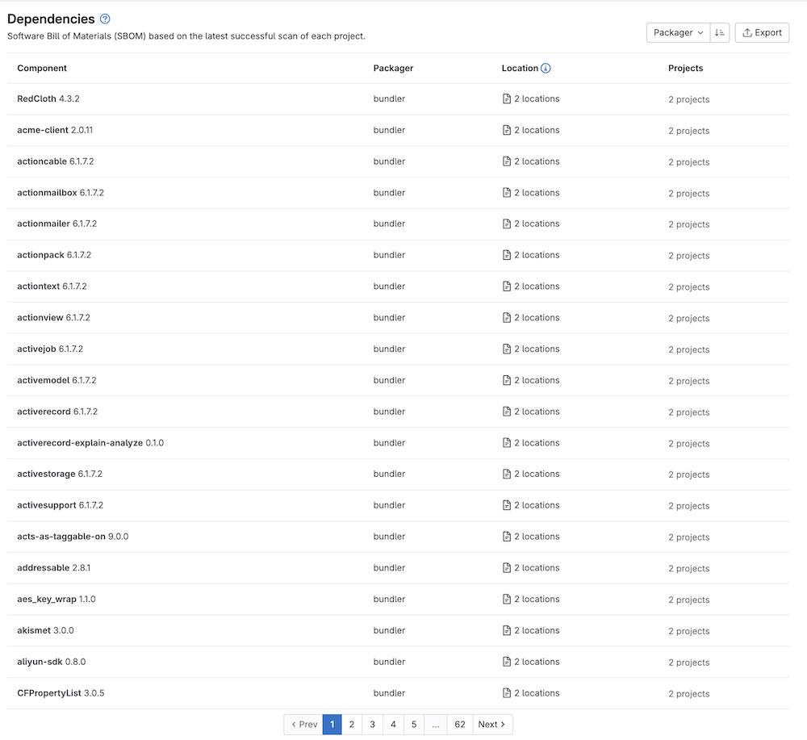
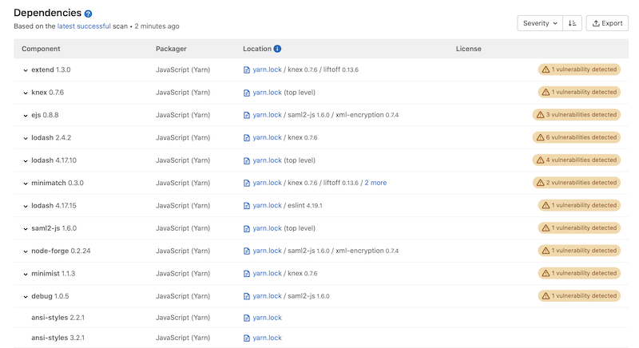

DETAILS:
**Tier:** Ultimate
**Offering:** GitLab.com, GitLab Self-Managed, GitLab Dedicated

> - Group-level dependency list [introduced](https://gitlab.com/groups/gitlab-org/-/epics/8090) in GitLab 16.2 [with a flag](../../../administration/feature_flags.md) named `group_level_dependencies`. Disabled by default.
> - Group-level dependency list [enabled on GitLab.com and GitLab Self-Managed](https://gitlab.com/gitlab-org/gitlab/-/issues/411257) in GitLab 16.4.
> - [Generally available](https://gitlab.com/gitlab-org/gitlab/-/merge_requests/132015) in GitLab 16.5. Feature flag `group_level_dependencies` removed.

Use the dependency list to review your project or group's dependencies and key details about those
dependencies, including their known vulnerabilities. This list is a collection of dependencies in your
project, including existing and new findings. This information is sometimes referred to as a
Software Bill of Materials, SBOM, or BOM.

<i class="fa fa-youtube-play youtube" aria-hidden="true"></i>
For an overview, see [Project Dependency](https://www.youtube.com/watch?v=ckqkn9Tnbw4).

## Prerequisites

To list your project's dependencies the SBOM document must:

- Comply with [the CycloneDX specification](https://github.com/CycloneDX/specification) version `1.4`, `1.5`, or `1.6`. Online validator available on [CycloneDX Web Tool](https://cyclonedx.github.io/cyclonedx-web-tool/validate).
- Be uploaded as [a CI/CD artifact report](../../../ci/yaml/artifacts_reports.md#artifactsreportscyclonedx) from a successful pipeline on the default branch.

NOTE:
Although this is not mandatory for populating the dependency list, the SBOM document must include and comply with the
[GitLab CycloneDX property taxonomy](../../../development/sec/cyclonedx_property_taxonomy.md) to provide some properties and to enable some security features.

GitLab already generates this document when the following requirements are met:

- The [Dependency Scanning](../dependency_scanning/_index.md)
  or [Container Scanning](../container_scanning/_index.md)
  CI job must be configured for your project.
- Your project uses at least one of the
  [languages and package managers](../dependency_scanning/_index.md#supported-languages-and-package-managers)
  supported by Gemnasium.
- A successful pipeline was run on the default branch.
  You should not change the default behavior of allowing the
  [application security jobs](../detect/_index.md) to fail.

## View project dependencies

> - In GitLab 17.2, the `location` field no longer links to the commit where the dependency was last detected when the feature flag `skip_sbom_occurrences_update_on_pipeline_id_change` is enabled. The flag is disabled by default.
> - In GitLab 17.3 the `location` field always links to the commit where the dependency was first detected. Feature flag `skip_sbom_occurrences_update_on_pipeline_id_change` removed.

To view the dependencies of a project or all projects in a group:

1. On the left sidebar, select **Search or go to** and find your project or group.
1. Select **Secure > Dependency list**.

Details of each dependency are listed, sorted by decreasing severity of vulnerabilities (if any). You can sort the list instead by component name, packager, or license.

| Field     | Description |
|:----------|:-----------|
| Component | The dependency's name and version. |
| Packager  | The packager used to install the dependency. |
| Location  | For system dependencies, this lists the image that was scanned. For application dependencies, this shows a link to the packager-specific lock file in your project that declared the dependency. It also shows the [direct dependents](#dependency-paths) of the dependency, if any, and if supported. |
| License (for projects only) | Links to dependency's software licenses. A warning badge that includes the number of vulnerabilities detected in the dependency. |
| Projects (for groups only) | Links to the project with the dependency. If multiple projects have the same dependency, the total number of these projects is shown. To go to a project with this dependency, select the **Projects** number, then search for and select its name. The project search feature is supported only on groups that have up to 600 occurrences in their group hierarchy. |

## Filter dependency list

> - [Introduced](https://gitlab.com/gitlab-org/gitlab/-/issues/422356) dependency filtering for groups in GitLab 16.7 [with a flag](../../../administration/feature_flags.md) named `group_level_dependencies_filtering`. Disabled by default.
> - Dependency filtering for group [generally available](https://gitlab.com/gitlab-org/gitlab/-/issues/422356) in GitLab 16.10. Feature flag `group_level_dependencies_filtering` removed.
> - [Introduced](https://gitlab.com/gitlab-org/gitlab/-/issues/513320) dependency filtering for projects in GitLab 17.9 with a flag named [`project_component_filter`](../../../administration/feature_flags.md). Enabled by default.

You can filter the dependency list to focus on only a subset of dependencies. The dependency
list is available for groups and projects.

For groups, you can filter by:

- Project
- License
- Components

For projects, you can filter by:

- Components

To filter the dependency list:

1. On the left sidebar, at the top, select **Search GitLab** (**{search}**) to find your group or project.
1. Select **Secure > Dependency list**.
1. Select the filter bar.
1. Select a filter, then from the dropdown list select one or more criteria.
   To close the dropdown list, select outside of it. To add more filters, repeat this step.
1. To apply the selected filters, press <kbd>Enter</kbd>.

The dependency list shows only dependencies that match your filters.

## Vulnerabilities

If a dependency has known vulnerabilities, view them by selecting the arrow next to the
dependency's name or the badge that indicates how many known vulnerabilities exist. For each
vulnerability, its severity and description appears below it. To view more details of a vulnerability,
select the vulnerability's description. The [vulnerability's details](../vulnerabilities/_index.md) page is opened.

## Dependency paths

> - Dependency path information from CycloneDX SBOM was [introduced](https://gitlab.com/gitlab-org/gitlab/-/issues/393061) in GitLab 16.9 [with a flag](../../../administration/feature_flags.md) named `project_level_sbom_occurrences`. Disabled by default.
> - Dependency path information from CycloneDX SBOM was [enabled on GitLab.com, GitLab Self-Managed, and GitLab Dedicated](https://gitlab.com/gitlab-org/gitlab/-/issues/434371) in GitLab 17.0.
> - [Generally available](https://gitlab.com/gitlab-org/gitlab/-/issues/457633) in GitLab 17.4. Feature flag `project_level_sbom_occurrences` removed.

The dependency list shows the direct dependents of a listed component if the component is transient and belongs to any supported package manager.

NOTE:
The dependency path is only displayed for dependencies that have vulnerabilities.

Dependency paths are supported for the following package managers:

- [Conan](https://conan.io)
- [Gradle](https://gradle.org/)&nbsp;<strong><a href="#notes-regarding-dependency-path-support">1</a></strong>
- [Maven](https://maven.apache.org/)&nbsp;<strong><a href="#notes-regarding-dependency-path-support">1</a></strong>
- [NPM](https://www.npmjs.com/)&nbsp;<strong><a href="#notes-regarding-dependency-path-support">1</a></strong>
- [NuGet](https://www.nuget.org/)
- [Pipenv](https://pipenv.pypa.io/en/latest/)&nbsp;<strong><a href="#notes-regarding-dependency-path-support">1</a></strong>
- [pip-tools](https://pip-tools.readthedocs.io/en/latest/)&nbsp;<strong><a href="#notes-regarding-dependency-path-support">1</a></strong>
- [pnpm](https://pnpm.io/)&nbsp;<strong><a href="#notes-regarding-dependency-path-support">1</a></strong>
- [Poetry](https://python-poetry.org/)&nbsp;<strong><a href="#notes-regarding-dependency-path-support">1</a></strong>
- [sbt](https://www.scala-sbt.org)
- [Yarn 1.x](https://classic.yarnpkg.com/lang/en/)

<ol>
  <li>
    
    
Supported only when using the <a href="https://gitlab.com/components/dependency-scanning/-/tree/main/templates/main">`dependency-scanning` component</a>.

  </li>
</ol>

### Licenses

If the [Dependency Scanning](../dependency_scanning/_index.md) CI job is configured,
[discovered licenses](../../compliance/license_scanning_of_cyclonedx_files/_index.md) are displayed on this page.

## Download the dependency list

You can download the full list of dependencies and their details in JSON format. The dependency
list shows only the results of the last successful pipeline that ran on the default branch.

To download the dependency list:

1. On the left sidebar, select **Search or go to** and find your project or group.
1. Select **Secure > Dependency list**.
1. Select **Export**.

## Troubleshooting

### License appears as 'unknown'

The license for a specific dependency might show up as `unknown` for a few possible reasons. This section describes how to determine whether a specific dependency's license shows up as `unknown` for a known reason.

#### License is 'unknown' upstream

Check the license specified for the dependency upstream:

- For C/C++ packages, check [Conancenter](https://conan.io/center).
- For npm packages, check [npmjs.com](https://www.npmjs.com/).
- For Python packages, check [PyPI](https://pypi.org/).
- For NuGet packages, check [Nuget](https://www.nuget.org/packages).
- For Go packages, check [pkg.go.dev](https://pkg.go.dev/).

If the license appears as `unknown` upstream, it is expected that GitLab will show the **License** for that dependency to be `unknown` as well.

#### License includes SPDX license expression

[SPDX license expressions](https://spdx.github.io/spdx-spec/v2.3/SPDX-license-expressions/) are not supported. Dependencies with SPDX license expressions appear with a **License** that is `unknown`. An example of an SPDX license expression is `(MIT OR CC0-1.0)`. Read more in [issue 336878](https://gitlab.com/gitlab-org/gitlab/-/issues/336878).

#### Package version not in Package Metadata DB

The specific version of the dependency package must exist in the [Package Metadata Database](../../../topics/offline/quick_start_guide.md#enabling-the-package-metadata-database). If it doesn't, the **License** for that dependency appears as `unknown`. Read more in [issue 440218](https://gitlab.com/gitlab-org/gitlab/-/issues/440218) about Go modules.

#### Package name contains special characters

If the name of the dependency package contains a hyphen (`-`) the **License** may appear as `unknown`. This can happen when packages are added manually to `requirements.txt` or when `pip-compile` is used. This happens because GitLab does not normalize Python package names in accordance with the guidance on [normalized names in PEP 503](https://peps.python.org/pep-0503/#normalized-names) when ingesting information about dependencies. Read more in [issue 440391](https://gitlab.com/gitlab-org/gitlab/-/issues/440391).
