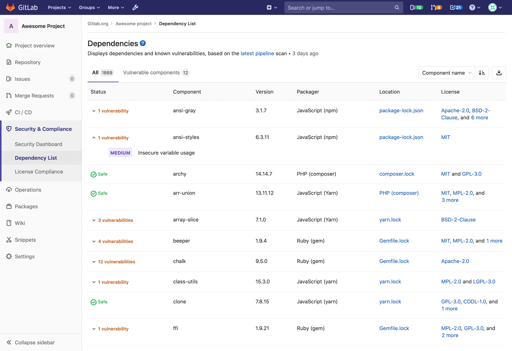

# Dependency List **(ULTIMATE)**

> [Introduced](https://gitlab.com/gitlab-org/gitlab/issues/10075) in [GitLab Ultimate](https://about.gitlab.com/pricing/) 12.0.

The Dependency list allows you to see your project's dependencies, and key
details about them, including their known vulnerabilities. To see it,
navigate to **Security & Compliance > Dependency List** in your project's
sidebar.

## Requirements

1. The [Dependency Scanning](../dependency_scanning/index.md) CI job must be
   configured for your project.
1. Your project uses at least one of the
   [languages and package managers](../dependency_scanning/index.md#supported-languages-and-package-managers)
   supported by Gemnasium.

## Viewing dependencies

Dependencies are displayed with the following information:

| Field     | Description |
| --------- | ----------- |
| Status    | Displays whether or not the dependency has any known vulnerabilities |
| Component | The dependency's name |
| Version   | The exact locked version of the dependency your project uses |
| Packager  | The packager used to install the depedency |
| Location  | A link to the packager-specific lockfile in your project that declared the dependency |
| License   | Links to dependency's software licenses |

Dependencies shown are initially sorted by their names. They can also be sorted
by the packager they were installed by, or by the severity of their known
vulnerabilities.

There is a second list under the `Vulnerable components` tab displaying only
those dependencies with known vulnerabilities. If there are none, this tab is
disabled.

### Vulnerabilities

If a dependency has known vulnerabilities, they can be viewed by clicking on the
`Status` cell of that dependency. The severity and description of each
vulnerability will then be displayed below it.

## Licenses

> [Introduced](https://gitlab.com/gitlab-org/gitlab/issues/10536) in GitLab Ultimate 12.3.

If the [License Compliance](../license_compliance/index.md) CI job is configured,
the [discovered licenses](../license_compliance/index.md#supported-languages-and-package-managers) will be displayed on this page.

## Downloading the Dependency List

Your project's full list of dependencies and their details can be downloaded in
`JSON` format by clicking on the download button.
