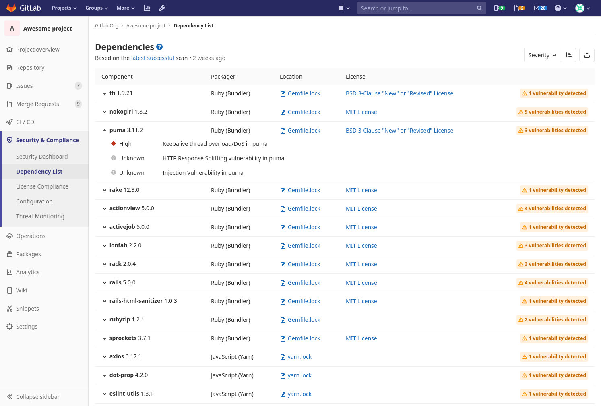

# Dependency List **(ULTIMATE)**

> [Introduced](https://gitlab.com/gitlab-org/gitlab/-/issues/10075) in [GitLab Ultimate](https://about.gitlab.com/pricing/) 12.0.

The Dependency list allows you to see your project's dependencies, and key
details about them, including their known vulnerabilities. To see it,
navigate to **Security & Compliance > Dependency List** in your project's
sidebar. This information is sometimes referred to as a Software Bill of Materials or SBoM / BOM.

## Requirements

1. The [Dependency Scanning](../dependency_scanning/index.md) CI job must be
   configured for your project.
1. Your project uses at least one of the
   [languages and package managers](../dependency_scanning/index.md#supported-languages-and-package-managers)
   supported by Gemnasium.

## Viewing dependencies

Dependencies are displayed with the following information:

| Field     | Description |
| --------- | ----------- |
| Component | The dependency's name and version |
| Packager  | The packager used to install the dependency |
| Location  | A link to the packager-specific lock file in your project that declared the dependency |
| License   | Links to dependency's software licenses |

Dependencies shown are initially sorted by the severity of their known vulnerabilities, if any. They
can also be sorted by name or by the packager that installed them.

### Vulnerabilities

If a dependency has known vulnerabilities, you can view them by clicking the arrow next to the
dependency's name or the badge that indicates how many known vulnerabilities exist. For each
vulnerability, its severity and description then appears below it.

## Licenses

> [Introduced](https://gitlab.com/gitlab-org/gitlab/-/issues/10536) in GitLab Ultimate 12.3.

If the [License Compliance](../../compliance/license_compliance/index.md) CI job is configured,
the [discovered licenses](../../compliance/license_compliance/index.md#supported-languages-and-package-managers) will be displayed on this page.

## Downloading the Dependency List

Your project's full list of dependencies and their details can be downloaded in
`JSON` format by clicking on the download button.
