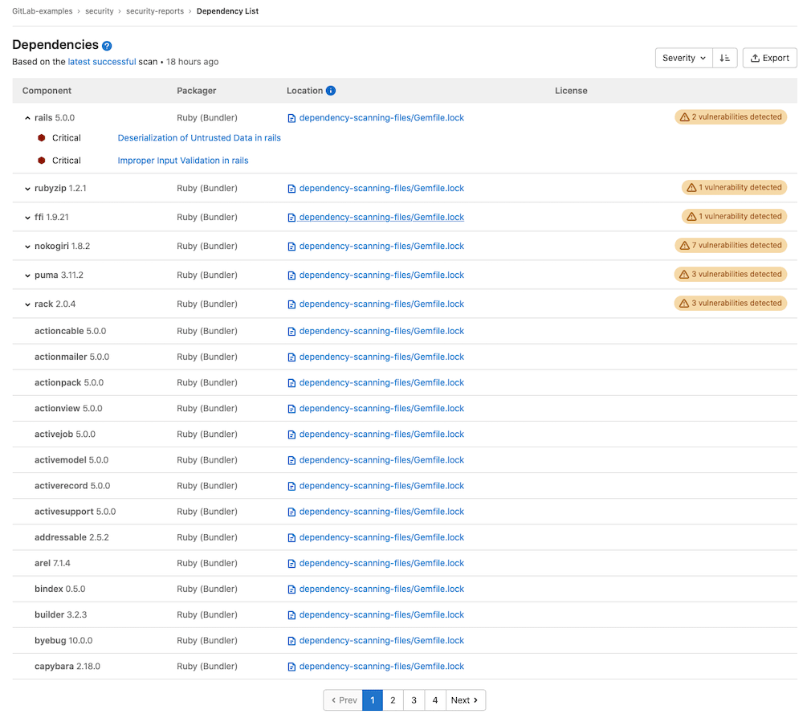

# Dependency list **(ULTIMATE)**

> [Introduced](https://gitlab.com/gitlab-org/gitlab/-/issues/10075) in GitLab Ultimate 12.0.

Use the dependency list to review your project's dependencies and key
details about those dependencies, including their known vulnerabilities. It is a collection of dependencies in your project, including existing and new findings. To see the dependency list, go to your project and select **Security & Compliance > Dependency List**.
This information is sometimes referred to as a Software Bill of Materials or SBoM / BOM.

The dependency list only shows the results of the last successful pipeline to run on the default branch. This is why we recommend not changing the default behavior of allowing the secure jobs to fail.

## Prerequisites

To view your project's dependencies, ensure you meet the following requirements:

- The [Dependency Scanning](../dependency_scanning/index.md) CI job must be
  configured for your project.
- Your project uses at least one of the
  [languages and package managers](../dependency_scanning/index.md#supported-languages-and-package-managers)
  supported by Gemnasium.

## View a project's dependencies

GitLab displays dependencies with the following information:

| Field     | Description |
|-----------|-------------|
| Component | The dependency's name and version. |
| Packager  | The packager used to install the dependency. |
| Location  | A link to the packager-specific lock file in your project that declared the dependency. It also shows the [dependency path](#dependency-paths) to a top-level dependency, if any, and if supported. |
| License   | Links to dependency's software licenses. |

Displayed dependencies are initially sorted by the severity of their known vulnerabilities, if any. They
can also be sorted by name or by the packager that installed them.

### Vulnerabilities

If a dependency has known vulnerabilities, view them by clicking the arrow next to the
dependency's name or the badge that indicates how many known vulnerabilities exist. For each
vulnerability, its severity and description appears below it. To view more details of a vulnerability,
select the vulnerability’s description. The [vulnerability's details](../vulnerabilities) page is opened.

### Dependency paths

The dependency list shows the path between a dependency and a top-level dependency it's connected
to, if any. There are many possible paths connecting a transient dependency to top-level
dependencies, but the user interface shows only one of the shortest paths.

Dependency paths are supported for the following package managers:

- [NuGet](https://www.nuget.org/)
- [Yarn 1.x](https://classic.yarnpkg.com/lang/en/)

## Licenses

> [Introduced](https://gitlab.com/gitlab-org/gitlab/-/issues/10536) in GitLab Ultimate 12.3.

If the [License Compliance](../../compliance/license_compliance/index.md) CI job is configured,
[discovered licenses](../../compliance/license_compliance/index.md#supported-languages-and-package-managers) are displayed on this page.

## Downloading the dependency list

You can download your project's full list of dependencies and their details in
`JSON` format by selecting the download button.
