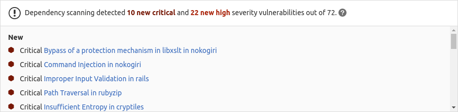

<style>
table.ds-table tr:nth-child(even) {
    background-color: transparent;
}

table.ds-table td {
    border-left: 1px solid #dbdbdb;
    border-right: 1px solid #dbdbdb;
    border-bottom: 1px solid #dbdbdb;
}

table.ds-table tr td:first-child {
    border-left: 0;
}

table.ds-table tr td:last-child {
    border-right: 0;
}

table.ds-table ul {
    font-size: 1em;
    list-style-type: none;
    padding-left: 0px;
    margin-bottom: 0px;
}

table.no-vertical-table-lines td {
    border-left: none;
    border-right: none;
    border-bottom: 1px solid #f0f0f0;
}

table.no-vertical-table-lines tr {
    border-top: none;
}
</style>

DETAILS:
**Tier:** Ultimate
**Offering:** GitLab.com, GitLab Self-Managed, GitLab Dedicated

Dependency Scanning analyzes your application's dependencies for known vulnerabilities. All
dependencies are scanned, including transitive dependencies, also known as nested dependencies.

Dependency Scanning is often considered part of Software Composition Analysis (SCA). SCA can contain
aspects of inspecting the items your code uses. These items typically include application and system
dependencies that are almost always imported from external sources, rather than sourced from items
you wrote yourself.

Dependency Scanning can run in the development phase of your application's lifecycle. Every time a
pipeline runs, vulnerabilities are identified and compared between the source and target branches.
Vulnerabilities and their severity are listed in the merge request, enabling you to proactively
address the risk to your application, before the code change is committed.
Vulnerabilities can also be identified outside a pipeline by
[Continuous Vulnerability Scanning](../continuous_vulnerability_scanning/_index.md).

GitLab offers both Dependency Scanning and [Container Scanning](../container_scanning/_index.md) to
ensure coverage for all of these dependency types. To cover as much of your risk area as possible,
we encourage you to use all of our security scanners. For a comparison of these features, see
[Dependency Scanning compared to Container Scanning](../comparison_dependency_and_container_scanning.md).



WARNING:
Dependency Scanning does not support runtime installation of compilers and interpreters.

- <i class="fa fa-youtube-play youtube" aria-hidden="true"></i>
  For an overview, see [Dependency Scanning](https://www.youtube.com/watch?v=TBnfbGk4c4o)
- <i class="fa fa-youtube-play youtube" aria-hidden="true"></i>
  For an interactive reading and how-to demo of this Dependency Scanning documentation, see [How to use dependency scanning tutorial hands-on GitLab Application Security part 3](https://youtu.be/ii05cMbJ4xQ?feature=shared)
- <i class="fa fa-youtube-play youtube" aria-hidden="true"></i>
  For other interactive reading and how-to demos, see [Get Started With GitLab Application Security Playlist](https://www.youtube.com/playlist?list=PL05JrBw4t0KrUrjDoefSkgZLx5aJYFaF9)

## Supported languages and package managers

The following languages and dependency managers are supported by Dependency Scanning:

<!-- markdownlint-disable MD044 -->
<table class="ds-table">
  <thead>
    <tr>
      <th>Language</th>
      <th>Language versions</th>
      <th>Package manager</th>
      <th>Supported files</th>
      <th><a href="#how-multiple-files-are-processed">Processes multiple files?</a></th>
    </tr>
  </thead>
  <tbody>
    <tr>
      <td>.NET</td>
      <td rowspan="2">All versions</td>
      <td rowspan="2"><a href="https://www.nuget.org/">NuGet</a></td>
      <td rowspan="2"><a href="https://learn.microsoft.com/en-us/nuget/consume-packages/package-references-in-project-files#enabling-lock-file"><code>packages.lock.json</code></a></td>
      <td rowspan="2">Y</td>
    </tr>
    <tr>
      <td>C#</td>
    </tr>
    <tr>
      <td>C</td>
      <td rowspan="2">All versions</td>
      <td rowspan="2"><a href="https://conan.io/">Conan</a></td>
      <td rowspan="2"><a href="https://docs.conan.io/en/latest/versioning/lockfiles.html"><code>conan.lock</code></a></td>
      <td rowspan="2">Y</td>
    </tr>
    <tr>
      <td>C++</td>
    </tr>
    <tr>
      <td>Go</td>
      <td>All versions</td>
      <td><a href="https://go.dev/">Go</a></td>
      <td>
        <ul>
          <li><code>go.mod</code></li>
        </ul>
      </td>
      <td>Y</td>
    </tr>
    <tr>
      <td rowspan="2">Java and Kotlin</td>
      <td rowspan="2">
        8 LTS,
        11 LTS,
        17 LTS,
        or 21 LTS<sup><b><a href="#notes-regarding-supported-languages-and-package-managers-1">1</a></b></sup>
      </td>
      <td><a href="https://gradle.org/">Gradle</a><sup><b><a href="#notes-regarding-supported-languages-and-package-managers-2">2</a></b></sup></td>
      <td>
        <ul>
            <li><code>build.gradle</code></li>
            <li><code>build.gradle.kts</code></li>
        </ul>
      </td>
      <td>N</td>
    </tr>
    <tr>
      <td><a href="https://maven.apache.org/">Maven</a><sup><b><a href="#notes-regarding-supported-languages-and-package-managers-6">6</a></b></sup></td>
      <td><code>pom.xml</code></td>
      <td>N</td>
    </tr>
    <tr>
      <td rowspan="3">JavaScript and TypeScript</td>
      <td rowspan="3">All versions</td>
      <td><a href="https://www.npmjs.com/">npm</a></td>
      <td>
        <ul>
            <li><code>package-lock.json</code></li>
            <li><code>npm-shrinkwrap.json</code></li>
        </ul>
      </td>
      <td>Y</td>
    </tr>
    <tr>
      <td><a href="https://classic.yarnpkg.com/en/">yarn</a></td>
      <td><code>yarn.lock</code></td>
      <td>Y</td>
    </tr>
    <tr>
      <td><a href="https://pnpm.io/">pnpm</a><sup><b><a href="#notes-regarding-supported-languages-and-package-managers-3">3</a></b></sup></td>
      <td><code>pnpm-lock.yaml</code></td>
      <td>Y</td>
    </tr>
    <tr>
      <td>PHP</td>
      <td>All versions</td>
      <td><a href="https://getcomposer.org/">Composer</a></td>
      <td><code>composer.lock</code></td>
      <td>Y</td>
    </tr>
    <tr>
      <td rowspan="5">Python</td>
      <td rowspan="5">3.11<sup><b><a href="#notes-regarding-supported-languages-and-package-managers-7">7</a></b></sup></td>
      <td><a href="https://setuptools.readthedocs.io/en/latest/">setuptools</a><sup><b><a href="#notes-regarding-supported-languages-and-package-managers-8">8</a></b></sup></td>
      <td><code>setup.py</code></td>
      <td>N</td>
    </tr>
    <tr>
      <td><a href="https://pip.pypa.io/en/stable/">pip</a></td>
      <td>
        <ul>
            <li><code>requirements.txt</code></li>
            <li><code>requirements.pip</code></li>
            <li><code>requires.txt</code></li>
        </ul>
      </td>
      <td>N</td>
    </tr>
    <tr>
      <td><a href="https://pipenv.pypa.io/en/latest/">Pipenv</a></td>
      <td>
        <ul>
            <li><a href="https://pipenv.pypa.io/en/latest/pipfile.html#example-pipfile"><code>Pipfile</code></a></li>
            <li><a href="https://pipenv.pypa.io/en/latest/pipfile.html#example-pipfile-lock"><code>Pipfile.lock</code></a></li>
        </ul>
      </td>
      <td>N</td>
    </tr>
    <tr>
      <td><a href="https://python-poetry.org/">Poetry</a><sup><b><a href="#notes-regarding-supported-languages-and-package-managers-4">4</a></b></sup></td>
      <td><code>poetry.lock</code></td>
      <td>N</td>
    </tr>
    <tr>
      <td><a href="https://docs.astral.sh/uv/">uv</a></td>
      <td><code>uv.lock</code></td>
      <td>Y</td>
    </tr>
    <tr>
      <td>Ruby</td>
      <td>All versions</td>
      <td><a href="https://bundler.io/">Bundler</a></td>
      <td>
        <ul>
            <li><code>Gemfile.lock</code></li>
            <li><code>gems.locked</code></li>
        </ul>
      </td>
      <td>Y</td>
    </tr>
    <tr>
      <td>Scala</td>
      <td>All versions</td>
      <td><a href="https://www.scala-sbt.org/">sbt</a><sup><b><a href="#notes-regarding-supported-languages-and-package-managers-5">5</a></b></sup></td>
      <td><code>build.sbt</code></td>
      <td>N</td>
    </tr>
    <tr>
      <td>Swift</td>
      <td>All versions</td>
      <td><a href="https://swift.org/package-manager/">Swift Package Manager</a></td>
      <td><code>Package.resolved</code></td>
      <td>N</td>
    </tr>
    <tr>
      <td>Cocoapods<sup><b><a href="#notes-regarding-supported-languages-and-package-managers-9">9</a></b></sup></td>
      <td>All versions</td>
      <td><a href="https://cocoapods.org/">CocoaPods</a></td>
      <td><code>Podfile.lock</code></td>
      <td>N</td>
    </tr>
  </tbody>
</table>

<ol>
  <li>
    <a id="notes-regarding-supported-languages-and-package-managers-1"></a>
    <p>
      Java 21 LTS for <a href="https://www.scala-sbt.org/">sbt</a> is limited to version 1.9.7. Support for more <a href="https://www.scala-sbt.org/">sbt</a> versions can be tracked in <a href="https://gitlab.com/gitlab-org/gitlab/-/issues/430335">issue 430335</a>.
      It is not supported when <a href="https://docs.gitlab.com/ee/development/fips_compliance.html#enable-fips-mode">FIPS mode</a> is enabled.
    </p>
  </li>
  <li>
    <a id="notes-regarding-supported-languages-and-package-managers-2"></a>
    <p>
      Gradle is not supported when <a href="https://docs.gitlab.com/ee/development/fips_compliance.html#enable-fips-mode">FIPS mode</a> is enabled.
    </p>
  </li>
  <li>
    <a id="notes-regarding-supported-languages-and-package-managers-3"></a>
    <p>
      Support for <code>pnpm</code> lockfiles was <a href="https://gitlab.com/gitlab-org/gitlab/-/issues/336809">introduced in GitLab 15.11</a>. <code>pnpm</code> lockfiles do not store bundled dependencies, so the reported dependencies may differ from <code>npm</code> or <code>yarn</code>.
    </p>
  </li>
  <li>
    <a id="notes-regarding-supported-languages-and-package-managers-4"></a>
    <p>
      Support for <a href="https://python-poetry.org/">Poetry</a> projects with a <code>poetry.lock</code> file was <a href="https://gitlab.com/gitlab-org/gitlab/-/issues/7006">added in GitLab 15.0</a>.
      Support for projects without a <code>poetry.lock</code> file is tracked in issue:
      <a href="https://gitlab.com/gitlab-org/gitlab/-/issues/32774">Poetry's pyproject.toml support for dependency scanning.</a>
    </p>
  </li>
  <li>
    <a id="notes-regarding-supported-languages-and-package-managers-5"></a>
    <p>
      Support for sbt 1.0.x was <a href="https://gitlab.com/gitlab-org/gitlab/-/issues/415835">deprecated</a> in GitLab 16.8 and <a href="https://gitlab.com/gitlab-org/gitlab/-/issues/436985">removed</a> in GitLab 17.0.
    </p>
  </li>
  <li>
    <a id="notes-regarding-supported-languages-and-package-managers-6"></a>
    <p>
      Support for Maven below 3.8.8 was <a href="https://gitlab.com/gitlab-org/gitlab/-/issues/438772">deprecated</a> in GitLab 16.9 and will be removed in GitLab 17.0.
    </p>
  </li>
  <li>
    <a id="notes-regarding-supported-languages-and-package-managers-7"></a>
    <p>
      Support for prior Python versions was <a href="https://gitlab.com/gitlab-org/gitlab/-/issues/441201">deprecated</a> in GitLab 16.9 and <a href="https://gitlab.com/gitlab-org/gitlab/-/issues/441491">removed</a> in GitLab 17.0.
    </p>
  </li>
  <li>
    <a id="notes-regarding-supported-languages-and-package-managers-8"></a>
    <p>
      Excludes both <code>pip</code> and <code>setuptools</code> from the report as they are required by the installer.
    </p>
  </li>
  <li>
    <a id="notes-regarding-supported-languages-and-package-managers-9"></a>
    <p>
      Only SBOM, without advisories. See <a href="https://gitlab.com/gitlab-org/gitlab/-/issues/468764">spike on CocoaPods advisories research</a>.
    </p>
  </li>
</ol>
<!-- markdownlint-enable MD044 -->

## Dependency detection

Dependency Scanning automatically detects the languages used in the repository. All analyzers
matching the detected languages are run. There is usually no need to customize the selection of
analyzers. We recommend not specifying the analyzers so you automatically use the full selection for
best coverage, avoiding the need to make adjustments when there are deprecations or removals.
However, you can override the selection using the variable `DS_EXCLUDED_ANALYZERS`.

The language detection relies on CI job [`rules`](../../../ci/yaml/_index.md#rules) to detect
[supported dependency file](#how-analyzers-are-triggered)

For Java and Python, when a supported dependency file is detected, Dependency Scanning attempts to
build the project and execute some Java or Python commands to get the list of dependencies. For all
other projects, the lock file is parsed to obtain the list of dependencies without needing to build
the project first.

All direct and transitive dependencies are analyzed, without a limit to the depth of transitive dependencies.

### Analyzers

Dependency Scanning supports the following official
[Gemnasium-based](https://gitlab.com/gitlab-org/security-products/analyzers/gemnasium) analyzers:

- `gemnasium`
- `gemnasium-maven`
- `gemnasium-python`

The analyzers are published as Docker images, which Dependency Scanning uses to launch dedicated
containers for each analysis. You can also integrate a custom
[security scanner](../../../development/integrations/secure.md).

Each analyzer is updated as new versions of Gemnasium are released. For more information, see the
analyzer [Release Process documentation](../../../development/sec/analyzer_development_guide.md#versioning-and-release-process).

### How analyzers obtain dependency information

GitLab analyzers obtain dependency information using one of the following two methods:

1. [Parsing lockfiles directly.](#obtaining-dependency-information-by-parsing-lockfiles)
1. [Running a package manager or build tool to generate a dependency information file which is then parsed.](#obtaining-dependency-information-by-running-a-package-manager-to-generate-a-parsable-file)

#### Obtaining dependency information by parsing lockfiles

The following package managers use lockfiles that GitLab analyzers are capable of parsing directly:

<!-- markdownlint-disable MD044 -->
<table class="ds-table no-vertical-table-lines">
  <thead>
    <tr>
      <th>Package Manager</th>
      <th>Supported File Format Versions</th>
      <th>Tested Package Manager Versions</th>
    </tr>
  </thead>
  <tbody>
    <tr>
      <td>Bundler</td>
      <td>Not applicable</td>
      <td>
        <a href="https://gitlab.com/gitlab-org/security-products/analyzers/gemnasium/-/blob/master/qa/fixtures/ruby-bundler/default/Gemfile.lock#L118">1.17.3</a>,
        <a href="https://gitlab.com/gitlab-org/security-products/tests/ruby-bundler/-/blob/bundler2-FREEZE/Gemfile.lock#L118">2.1.4</a>
      </td>
    </tr>
    <tr>
      <td>Composer</td>
      <td>Not applicable</td>
      <td>
        <a href="https://gitlab.com/gitlab-org/security-products/analyzers/gemnasium/-/blob/master/qa/fixtures/php-composer/default/composer.lock">1.x</a>
      </td>
    </tr>
    <tr>
      <td>Conan</td>
      <td>0.4</td>
      <td>
        <a href="https://gitlab.com/gitlab-org/security-products/analyzers/gemnasium/-/blob/master/qa/fixtures/c-conan/default/conan.lock#L38">1.x</a>
      </td>
    </tr>
    <tr>
      <td>Go</td>
      <td>Not applicable</td>
      <td>
        <a href="https://gitlab.com/gitlab-org/security-products/analyzers/gemnasium/-/blob/master/qa/fixtures/go-modules/gosum/default/go.sum">1.x</a>
      </td>
    </tr>
    <tr>
      <td>NuGet</td>
      <td>v1, v2<sup><b><a href="#notes-regarding-parsing-lockfiles-1">1</a></b></sup></td>
      <td>
        <a href="https://gitlab.com/gitlab-org/security-products/analyzers/gemnasium/-/blob/master/qa/fixtures/csharp-nuget-dotnetcore/default/src/web.api/packages.lock.json#L2">4.9</a>
      </td>
    </tr>
    <tr>
      <td>npm</td>
      <td>v1, v2, v3<sup><b><a href="#notes-regarding-parsing-lockfiles-2">2</a></b></sup></td>
      <td>
        <a href="https://gitlab.com/gitlab-org/security-products/analyzers/gemnasium/-/blob/master/qa/fixtures/js-npm/default/package-lock.json#L4">6.x</a>,
        <a href="https://gitlab.com/gitlab-org/security-products/analyzers/gemnasium/-/blob/master/qa/fixtures/js-npm/lockfileVersion2/package-lock.json#L4">7.x</a>,
        <a href="https://gitlab.com/gitlab-org/security-products/analyzers/gemnasium/-/blob/master/scanner/parser/npm/fixtures/lockfile-v3/simple/package-lock.json#L4">9.x</a>
      </td>
    </tr>
    <tr>
      <td>pnpm</td>
      <td>v5, v6, v9</td>
      <td>
        <a href="https://gitlab.com/gitlab-org/security-products/analyzers/gemnasium/-/blob/master/qa/fixtures/js-pnpm/default/pnpm-lock.yaml#L1">7.x</a>,
        <a href="https://gitlab.com/gitlab-org/security-products/analyzers/gemnasium/-/blob/master/scanner/parser/pnpm/fixtures/v6/simple/pnpm-lock.yaml#L1">8.x</a>
        <a href="https://gitlab.com/gitlab-org/security-products/analyzers/gemnasium/-/blob/master/scanner/parser/pnpm/fixtures/v9/simple/pnpm-lock.yaml#L1">9.x</a>
      </td>
    </tr>
    <tr>
      <td>yarn</td>
      <td>versions 1, 2, 3, 4<sup><b><a href="#notes-regarding-parsing-lockfiles-3">3</a></b></sup></td>
      <td>
        <a href="https://gitlab.com/gitlab-org/security-products/analyzers/gemnasium/-/blob/master/qa/fixtures/js-yarn/classic/default/yarn.lock#L2">1.x</a>,
        <a href="https://gitlab.com/gitlab-org/security-products/analyzers/gemnasium/-/blob/master/qa/fixtures/js-yarn/berry/v2/default/yarn.lock">2.x</a>,
        <a href="https://gitlab.com/gitlab-org/security-products/analyzers/gemnasium/-/blob/master/qa/fixtures/js-yarn/berry/v3/default/yarn.lock">3.x</a>
      </td>
    </tr>
    <tr>
      <td>Poetry</td>
      <td>v1</td>
      <td>
        <a href="https://gitlab.com/gitlab-org/security-products/analyzers/gemnasium/-/blob/master/qa/fixtures/python-poetry/default/poetry.lock">1.x</a>
      </td>
    </tr>
    <tr>
      <td>uv</td>
      <td>v0.x</td>
      <td>
        <a href="https://gitlab.com/gitlab-org/security-products/analyzers/gemnasium/-/blob/master/scanner/parser/uv/fixtures/simple/uv.lock">0.x</a>
      </td>
    </tr>
  </tbody>
</table>

<ol>
  <li>
    <a id="notes-regarding-parsing-lockfiles-1"></a>
    <p>
      Support for NuGet version 2 lock files was <a href="https://gitlab.com/gitlab-org/gitlab/-/issues/398680">introduced</a> in GitLab 16.2.
    </p>
  </li>
  <li>
    <a id="notes-regarding-parsing-lockfiles-2"></a>
    <p>
      Support for <code>lockfileVersion = 3</code> was <a href="https://gitlab.com/gitlab-org/gitlab/-/issues/365176">introduced</a> in GitLab 15.7.
    </p>
  </li>
  <li>
    <a id="notes-regarding-parsing-lockfiles-3"></a>
    <p>
      Support for Yarn version 4 was <a href="https://gitlab.com/gitlab-org/gitlab/-/issues/431752">introduced</a> in GitLab 16.11.
    </p>
    <p>
      The following features are not supported for Yarn Berry:
    </p>
    <ul>
      <li>
        <a href="https://yarnpkg.com/features/workspaces">workspaces</a>
      </li>
      <li>
        <a href="https://yarnpkg.com/cli/patch">yarn patch</a>
      </li>
    </ul>
    <p>
      Yarn files that contain a patch, a workspace, or both, are still processed, but these features are ignored.
    </p>
  </li>
</ol>
<!-- markdownlint-enable MD044 -->

#### Obtaining dependency information by running a package manager to generate a parsable file

To support the following package managers, the GitLab analyzers proceed in two steps:

1. Execute the package manager or a specific task, to export the dependency information.
1. Parse the exported dependency information.

<!-- markdownlint-disable MD044 -->
<table class="ds-table no-vertical-table-lines">
  <thead>
    <tr>
      <th>Package Manager</th>
      <th>Pre-installed Versions</th>
      <th>Tested Versions</th>
    </tr>
  </thead>
  <tbody>
    <tr>
      <td>sbt</td>
      <td><a href="https://gitlab.com/gitlab-org/security-products/analyzers/gemnasium/-/blob/v5.2.14/build/gemnasium-maven/debian/config/.tool-versions#L4">1.6.2</a></td>
      <td>
        <a href="https://gitlab.com/gitlab-org/security-products/analyzers/gemnasium/-/blob/v5.2.14/spec/gemnasium-maven_image_spec.rb#L794-798">1.1.6</a>,
        <a href="https://gitlab.com/gitlab-org/security-products/analyzers/gemnasium/-/blob/v5.2.14/spec/gemnasium-maven_image_spec.rb#L800-805">1.2.8</a>,
        <a href="https://gitlab.com/gitlab-org/security-products/analyzers/gemnasium/-/blob/v5.2.14/spec/gemnasium-maven_image_spec.rb#L722-725">1.3.12</a>,
        <a href="https://gitlab.com/gitlab-org/security-products/analyzers/gemnasium/-/blob/v5.2.14/spec/gemnasium-maven_image_spec.rb#L722-725">1.4.6</a>,
        <a href="https://gitlab.com/gitlab-org/security-products/analyzers/gemnasium/-/blob/v5.2.14/spec/gemnasium-maven_image_spec.rb#L742-746">1.5.8</a>,
        <a href="https://gitlab.com/gitlab-org/security-products/analyzers/gemnasium/-/blob/v5.2.14/spec/gemnasium-maven_image_spec.rb#L748-762">1.6.2</a>,
        <a href="https://gitlab.com/gitlab-org/security-products/analyzers/gemnasium/-/blob/v5.2.14/spec/gemnasium-maven_image_spec.rb#L764-768">1.7.3</a>,
        <a href="https://gitlab.com/gitlab-org/security-products/analyzers/gemnasium/-/blob/v5.2.14/spec/gemnasium-maven_image_spec.rb#L770-774">1.8.3</a>,
        <a href="https://gitlab.com/gitlab-org/security-products/analyzers/gemnasium/-/blob/v5.2.14/spec/gemnasium-maven_image_spec.rb#L776-781">1.9.6</a>,
        <a href="https://gitlab.com/gitlab-org/security-products/analyzers/gemnasium/-/blob/v5.2.14/.gitlab/ci/gemnasium-maven.gitlab-ci.yml#L111-121">1.9.7</a>
      </td>
    </tr>
    <tr>
      <td>maven</td>
      <td><a href="https://gitlab.com/gitlab-org/security-products/analyzers/gemnasium/-/blob/v5.3.1/build/gemnasium-maven/debian/config/.tool-versions#L3">3.9.8</a></td>
      <td>
        <a href="https://gitlab.com/gitlab-org/security-products/analyzers/gemnasium/-/blob/v5.3.1/spec/gemnasium-maven_image_spec.rb#L92-94">3.9.8</a><sup><b><a href="#exported-dependency-information-notes-1">1</a></b></sup>
      </td>
    </tr>
    <tr>
      <td>Gradle</td>
      <td>
        <a href="https://gitlab.com/gitlab-org/security-products/analyzers/gemnasium/-/blob/v5.2.14/build/gemnasium-maven/debian/config/.tool-versions#L5">6.7.1</a><sup><b><a href="#exported-dependency-information-notes-2">2</a></b></sup>,
        <a href="https://gitlab.com/gitlab-org/security-products/analyzers/gemnasium/-/blob/v5.2.14/build/gemnasium-maven/debian/config/.tool-versions#L5">7.6.4</a><sup><b><a href="#exported-dependency-information-notes-2">2</a></b></sup>,
        <a href="https://gitlab.com/gitlab-org/security-products/analyzers/gemnasium/-/blob/v5.2.14/build/gemnasium-maven/debian/config/.tool-versions#L5">8.8</a><sup><b><a href="#exported-dependency-information-notes-2">2</a></b></sup>
      </td>
      <td>
        <a href="https://gitlab.com/gitlab-org/security-products/analyzers/gemnasium/-/blob/v5.2.14/spec/gemnasium-maven_image_spec.rb#L316-321">5.6</a>,
        <a href="https://gitlab.com/gitlab-org/security-products/analyzers/gemnasium/-/blob/v5.2.14/spec/gemnasium-maven_image_spec.rb#L323-328">6.7</a>,
        <a href="https://gitlab.com/gitlab-org/security-products/analyzers/gemnasium/-/blob/v5.2.14/spec/gemnasium-maven_image_spec.rb#L330-335">6.9</a>,
        <a href="https://gitlab.com/gitlab-org/security-products/analyzers/gemnasium/-/blob/v5.2.14/spec/gemnasium-maven_image_spec.rb#L337-341">7.6</a>,
        <a href="https://gitlab.com/gitlab-org/security-products/analyzers/gemnasium/-/blob/v5.2.14/spec/gemnasium-maven_image_spec.rb#L343-347">8.8</a>
      </td>
    </tr>
    <tr>
      <td>setuptools</td>
      <td>
        <a href="https://gitlab.com/gitlab-org/security-products/analyzers/gemnasium/-/blob/v5.4.1/build/gemnasium-python/requirements.txt#L41">70.3.0</a>
      </td>
      <td>
        <a href="https://gitlab.com/gitlab-org/security-products/analyzers/gemnasium/-/blob/v5.4.1/spec/gemnasium-python_image_spec.rb#L294-316">&gt;= 70.3.0</a>
      </td>
    </tr>
    <tr>
      <td>pip</td>
      <td>
        <a href="https://gitlab.com/gitlab-org/security-products/analyzers/gemnasium/-/blob/v5.2.14/build/gemnasium-python/debian/Dockerfile#L21">24</a>
      </td>
      <td>
        <a href="https://gitlab.com/gitlab-org/security-products/analyzers/gemnasium/-/blob/v5.2.14/spec/gemnasium-python_image_spec.rb#L77-90">24</a>
      </td>
    </tr>
    <tr>
      <td>Pipenv</td>
      <td>
        <a href="https://gitlab.com/gitlab-org/security-products/analyzers/gemnasium/-/blob/v5.2.14/build/gemnasium-python/requirements.txt#L23">2023.11.15</a>
      </td>
      <td>
        <a href="https://gitlab.com/gitlab-org/security-products/analyzers/gemnasium/-/blob/v5.2.14/spec/gemnasium-python_image_spec.rb#L243-256">2023.11.15</a><sup><b><a href="#exported-dependency-information-notes-3">3</a></b></sup>,
        <a href="https://gitlab.com/gitlab-org/security-products/analyzers/gemnasium/-/blob/v5.2.14/spec/gemnasium-python_image_spec.rb#L219-241">2023.11.15</a>
      </td>
    </tr>
    <tr>
      <td>Go</td>
      <td>
        <a href="https://gitlab.com/gitlab-org/security-products/analyzers/gemnasium/-/blob/v5.2.14/build/gemnasium/alpine/Dockerfile#L91-93">1.21</a>
      </td>
      <td>
        <a href="https://gitlab.com/gitlab-org/security-products/analyzers/gemnasium/-/blob/v5.2.14/build/gemnasium/alpine/Dockerfile#L91-93">1.21</a><sup><strong><a href="#exported-dependency-information-notes-4">4</a></strong></sup>
      </td>
    </tr>
  </tbody>
</table>

<ol>
  <li>
    <a id="exported-dependency-information-notes-1"></a>
    <p>
      This test uses the default version of <code>maven</code> specified by the <a href="https://gitlab.com/gitlab-org/security-products/analyzers/gemnasium/-/blob/v5.2.14/build/gemnasium-maven/debian/config/.tool-versions#L3"><code>.tool-versions</code></a> file.
    </p>
  </li>
  <li>
    <a id="exported-dependency-information-notes-2"></a>
    <p>
      Different versions of Java require different versions of Gradle. The versions of Gradle listed in the above table are pre-installed
      in the analyzer image. The version of Gradle used by the analyzer depends on whether your project uses a <code>gradlew</code>
      (Gradle wrapper) file or not:
    </p>
    <ul>
      <li>
        <p>
          If your project <i>does not use</i> a <code>gradlew</code> file, then the analyzer automatically switches to one of the
          pre-installed Gradle versions, based on the version of Java specified by the
          <a href="#analyzer-specific-settings"><code>DS_JAVA_VERSION</code></a> variable (default version is <code>17</code>).
        </p>
        <p>
          For Java versions <code>8</code> and <code>11</code>, Gradle <code>6.7.1</code> is automatically selected, Java <code>17</code> uses Gradle <code>7.6.4</code>, and Java <code>21</code> uses Gradle <code>8.8</code>.
        </p>
      </li>
      <li>
        <p>
          If your project <i>does use</i> a <code>gradlew</code> file, then the version of Gradle pre-installed in the analyzer image is
          ignored, and the version specified in your <code>gradlew</code> file is used instead.
        </p>
      </li>
    </ul>
  </li>
  <li>
    <a id="exported-dependency-information-notes-3"></a>
    <p>
      This test confirms that if a <code>Pipfile.lock</code> file is found, it is used by <a href="https://gitlab.com/gitlab-org/security-products/analyzers/gemnasium">Gemnasium</a> to scan the exact package versions listed in this file.
    </p>
  </li>
  <li>
    <a id="exported-dependency-information-notes-4"></a>
    <p>
      Because of the implementation of <code>go build</code>, the Go build process requires network access, a pre-loaded mod cache via <code>go mod download</code>, or vendored dependencies. For more information,
      refer to the Go documentation on <a href="https://pkg.go.dev/cmd/go#hdr-Compile_packages_and_dependencies">compiling packages and dependencies</a>.
    </p>
  </li>
</ol>
<!-- markdownlint-enable MD044 -->

### How analyzers are triggered

GitLab relies on [`rules:exists`](../../../ci/yaml/_index.md#rulesexists) to start the relevant analyzers for the languages detected by the presence of the
`Supported files` in the repository as shown in the [table above](#supported-languages-and-package-managers).
A maximum of two directory levels from the repository's root is searched. For example, the
`gemnasium-dependency_scanning` job is enabled if a repository contains either `Gemfile`,
`api/Gemfile`, or `api/client/Gemfile`, but not if the only supported dependency file is
`api/v1/client/Gemfile`.

### How multiple files are processed

NOTE:
If you've run into problems while scanning multiple files, contribute a comment to
[this issue](https://gitlab.com/gitlab-org/gitlab/-/issues/337056).

#### Python

We only execute one installation in the directory where either a requirements file or a lock file has been detected. Dependencies are only analyzed by `gemnasium-python` for the first file that is detected. Files are searched for in the following order:

1. `requirements.txt`, `requirements.pip`, or `requires.txt` for projects using Pip.
1. `Pipfile` or `Pipfile.lock` for projects using Pipenv.
1. `poetry.lock` for projects using Poetry.
1. `setup.py` for project using Setuptools.

The search begins with the root directory and then continues with subdirectories if no builds are found in the root directory. Consequently a Poetry lock file in the root directory would be detected before a Pipenv file in a subdirectory.

#### Java and Scala

We only execute one build in the directory where a build file has been detected. For large projects that include
multiple Gradle, Maven, or sbt builds, or any combination of these, `gemnasium-maven` only analyzes dependencies for the first build file
that is detected. Build files are searched for in the following order:

1. `pom.xml` for single or [multi-module](https://maven.apache.org/pom.html#Aggregation) Maven projects.
1. `build.gradle` or `build.gradle.kts` for single or [multi-project](https://docs.gradle.org/current/userguide/intro_multi_project_builds.html) Gradle builds.
1. `build.sbt` for single or [multi-project](https://www.scala-sbt.org/1.x/docs/Multi-Project.html) sbt builds.

The search begins with the root directory and then continues with subdirectories if no builds are found in the root directory. Consequently an sbt build file in the root directory would be detected before a Gradle build file in a subdirectory.
For [multi-module](https://maven.apache.org/pom.html#Aggregation) Maven projects, and multi-project [Gradle](https://docs.gradle.org/current/userguide/intro_multi_project_builds.html) and [sbt](https://www.scala-sbt.org/1.x/docs/Multi-Project.html) builds, sub-module and sub-project files are analyzed if they are declared in the parent build file.

#### JavaScript

The following analyzers are executed, each of which have different behavior when processing multiple files:

- [Gemnasium](https://gitlab.com/gitlab-org/security-products/analyzers/gemnasium)

  Supports multiple lockfiles

- [Retire.js](https://retirejs.github.io/retire.js/)

  Does not support multiple lockfiles. When multiple lockfiles exist, `Retire.js`
  analyzes the first lockfile discovered while traversing the directory tree in alphabetical order.

The `gemnasium` analyzer scans supports JavaScript projects for vendored libraries
(that is, those checked into the project but not managed by the package manager).

#### Go

Multiple files are supported. When a `go.mod` file is detected, the analyzer attempts to generate a [build list](https://go.dev/ref/mod#glos-build-list) using
[Minimal Version Selection](https://go.dev/ref/mod#glos-minimal-version-selection). If this fails, the analyzer instead attempts to parse the dependencies within the `go.mod` file.

As a requirement, the `go.mod` file should be cleaned up using the command `go mod tidy` to ensure proper management of dependencies. The process is repeated for every detected `go.mod` file.

#### PHP, C, C++, .NET, C&#35;, Ruby, JavaScript

The analyzer for these languages supports multiple lockfiles.

#### Support for additional languages

Support for additional languages, dependency managers, and dependency files are tracked in the following issues:

| Package Managers    | Languages | Supported files | Scan tools | Issue |
| ------------------- | --------- | --------------- | ---------- | ----- |
| [Poetry](https://python-poetry.org/) | Python | `pyproject.toml` | [Gemnasium](https://gitlab.com/gitlab-org/security-products/analyzers/gemnasium) | [GitLab#32774](https://gitlab.com/gitlab-org/gitlab/-/issues/32774) |

## Configuration

Enable the dependency scanning analyzer to ensure it scans your application's dependencies for known
vulnerabilities. You can then adjust its behavior by using CI/CD variables.

### Enabling the analyzer

Prerequisites:

- The `test` stage is required in the `.gitlab-ci.yml` file.
- With self-managed runners you need a GitLab Runner with the
  [`docker`](https://docs.gitlab.com/runner/executors/docker.html) or
  [`kubernetes`](https://docs.gitlab.com/runner/install/kubernetes.html) executor.
- If you're using SaaS runners on GitLab.com, this is enabled by default.

To enable the analyzer, either:

- Enable [Auto DevOps](../../../topics/autodevops/_index.md), which includes dependency scanning.
- Use a preconfigured merge request.
- Create a [scan execution policy](../policies/scan_execution_policies.md) that enforces dependency
  scanning.
- Edit the `.gitlab-ci.yml` file manually.
- [Use CI/CD components](#use-cicd-components)

#### Use a preconfigured merge request

This method automatically prepares a merge request that includes the Dependency Scanning template
in the `.gitlab-ci.yml` file. You then merge the merge request to enable Dependency Scanning.

NOTE:
This method works best with no existing `.gitlab-ci.yml` file, or with a minimal configuration file.
If you have a complex GitLab configuration file it might not be parsed successfully, and an error
might occur. In that case, use the [manual](#edit-the-gitlab-ciyml-file-manually) method instead.

To enable Dependency Scanning:

1. On the left sidebar, select **Search or go to** and find your project.
1. Select **Secure > Security configuration**.
1. In the **Dependency Scanning** row, select **Configure with a merge request**.
1. Select **Create merge request**.
1. Review the merge request, then select **Merge**.

Pipelines now include a Dependency Scanning job.

#### Edit the `.gitlab-ci.yml` file manually

This method requires you to manually edit the existing `.gitlab-ci.yml` file. Use this method if
your GitLab CI/CD configuration file is complex.

To enable Dependency Scanning:

1. On the left sidebar, select **Search or go to** and find your project.
1. Select **Build > Pipeline editor**.
1. If no `.gitlab-ci.yml` file exists, select **Configure pipeline**, then delete the example
   content.
1. Copy and paste the following to the bottom of the `.gitlab-ci.yml` file. If an `include` line
   already exists, add only the `template` line below it.

   ```yaml
   include:
     - template: Jobs/Dependency-Scanning.gitlab-ci.yml
   ```

1. Select the **Validate** tab, then select **Validate pipeline**.

   The message **Simulation completed successfully** confirms the file is valid.
1. Select the **Edit** tab.
1. Complete the fields. Do not use the default branch for the **Branch** field.
1. Select the **Start a new merge request with these changes** checkbox, then select **Commit
   changes**.
1. Complete the fields according to your standard workflow, then select **Create
   merge request**.
1. Review and edit the merge request according to your standard workflow, then select **Merge**.

Pipelines now include a Dependency Scanning job.

#### Use CI/CD components

> - [Introduced](https://gitlab.com/gitlab-org/gitlab/-/issues/454143) in GitLab 17.0. This feature is an [experiment](../../../policy/development_stages_support.md).
> - The dependency scanning CI/CD component only supports Android projects.

Use [CI/CD components](../../../ci/components/_index.md) to perform Dependency Scanning of your
application. For instructions, see the respective component's README file.

##### Available CI/CD components

See <https://gitlab.com/explore/catalog/components/dependency-scanning>

### Running jobs in merge request pipelines

See [Use security scanning tools with merge request pipelines](../detect/roll_out_security_scanning.md#use-security-scanning-tools-with-merge-request-pipelines)

### Customizing analyzer behavior

To customize Dependency Scanning, use [CI/CD variables](#available-cicd-variables).

WARNING:
Test all customization of GitLab analyzers in a merge request before merging these changes to the
default branch. Failure to do so can give unexpected results, including a large number of false
positives.

### Overriding dependency scanning jobs

To override a job definition (for example, to change properties like `variables` or `dependencies`),
declare a new job with the same name as the one to override. Place this new job after the template
inclusion and specify any additional keys under it. For example, this disables `DS_REMEDIATE` for
the `gemnasium` analyzer:

```yaml
include:
  - template: Jobs/Dependency-Scanning.gitlab-ci.yml

gemnasium-dependency_scanning:
  variables:
    DS_REMEDIATE: "false"
```

To override the `dependencies: []` attribute, add an override job as above, targeting this attribute:

```yaml
include:
  - template: Jobs/Dependency-Scanning.gitlab-ci.yml

gemnasium-dependency_scanning:
  dependencies: ["build"]
```

### Available CI/CD variables

You can use CI/CD variables to [customize](#customizing-analyzer-behavior) dependency scanning behavior.

#### Global analyzer settings

The following variables allow configuration of global dependency scanning settings.

| CI/CD variables             | Description |
| ----------------------------|------------ |
| `ADDITIONAL_CA_CERT_BUNDLE` | Bundle of CA certificates to trust. The bundle of certificates provided here is also used by other tools during the scanning process, such as `git`, `yarn`, or `npm`. For more details, see [Custom TLS certificate authority](#custom-tls-certificate-authority). |
| `DS_EXCLUDED_ANALYZERS`     | Specify the analyzers (by name) to exclude from Dependency Scanning. For more information, see [Analyzers](#analyzers). |
| `DS_EXCLUDED_PATHS`         | Exclude files and directories from the scan based on the paths. A comma-separated list of patterns. Patterns can be globs (see [`doublestar.Match`](https://pkg.go.dev/github.com/bmatcuk/doublestar/v4@v4.0.2#Match) for supported patterns), or file or folder paths (for example, `doc,spec`). Parent directories also match patterns. This is a pre-filter which is applied _before_ the scan is executed. Default: `"spec, test, tests, tmp"`. |
| `DS_IMAGE_SUFFIX`           | Suffix added to the image name. (GitLab team members can view more information in this confidential issue: `https://gitlab.com/gitlab-org/gitlab/-/issues/354796`). Automatically set to `"-fips"` when FIPS mode is enabled. |
| `DS_MAX_DEPTH`              | Defines how many directory levels deep that the analyzer should search for supported files to scan. A value of `-1` scans all directories regardless of depth. Default: `2`. |
| `SECURE_ANALYZERS_PREFIX`   | Override the name of the Docker registry providing the official default images (proxy). |

#### Analyzer-specific settings

The following variables configure the behavior of specific dependency scanning analyzers.

| CI/CD variable                       | Analyzer           | Default                      | Description |
|--------------------------------------|--------------------|------------------------------|-------------|
| `GEMNASIUM_DB_LOCAL_PATH`            | `gemnasium`        | `/gemnasium-db`              | Path to local Gemnasium database. |
| `GEMNASIUM_DB_UPDATE_DISABLED`       | `gemnasium`        | `"false"`                    | Disable automatic updates for the `gemnasium-db` advisory database. For usage see [Access to the GitLab Advisory Database](#access-to-the-gitlab-advisory-database). |
| `GEMNASIUM_DB_REMOTE_URL`            | `gemnasium`        | `https://gitlab.com/gitlab-org/security-products/gemnasium-db.git` | Repository URL for fetching the GitLab Advisory Database. |
| `GEMNASIUM_DB_REF_NAME`              | `gemnasium`        | `master`                     | Branch name for remote repository database. `GEMNASIUM_DB_REMOTE_URL` is required. |
| `DS_REMEDIATE`                       | `gemnasium`        | `"true"`, `"false"` in FIPS mode | Enable automatic remediation of vulnerable dependencies. Not supported in FIPS mode. |
| `DS_REMEDIATE_TIMEOUT`               | `gemnasium`        | `5m`                         | Timeout for auto-remediation. |
| `GEMNASIUM_LIBRARY_SCAN_ENABLED`     | `gemnasium`        | `"true"`                     | Enable detecting vulnerabilities in vendored JavaScript libraries (libraries which are not managed by a package manager). This functionality requires a JavaScript lockfile to be present in a commit, otherwise Dependency Scanning is not executed and vendored files are not scanned.<br>Dependency scanning uses the [Retire.js](https://github.com/RetireJS/retire.js) scanner to detect a limited set of vulnerabilities. For details of which vulnerabilities are detected, see the [Retire.js repository](https://github.com/RetireJS/retire.js/blob/master/repository/jsrepository.json). |
| `DS_INCLUDE_DEV_DEPENDENCIES`        | `gemnasium`        | `"true"`                     | When set to `"false"`, development dependencies and their vulnerabilities are not reported. Only projects using Composer, Maven, npm, pnpm, Pipenv or Poetry are supported. [Introduced](https://gitlab.com/gitlab-org/gitlab/-/issues/227861) in GitLab 15.1. |
| `GOOS`                               | `gemnasium`        | `"linux"`                    | The operating system for which to compile Go code. |
| `GOARCH`                             | `gemnasium`        | `"amd64"`                    | The architecture of the processor for which to compile Go code. |
| `GOFLAGS`                            | `gemnasium`        |                              | The flags passed to the `go build` tool. |
| `GOPRIVATE`                          | `gemnasium`        |                              | A list of glob patterns and prefixes to be fetched from source. For more information, see the Go private modules [documentation](https://go.dev/ref/mod#private-modules). |
| `DS_JAVA_VERSION`                    | `gemnasium-maven`  | `17`                         | Version of Java. Available versions: `8`, `11`, `17`, `21`. |
| `MAVEN_CLI_OPTS`                     | `gemnasium-maven`  | `"-DskipTests --batch-mode"` | List of command line arguments that are passed to `maven` by the analyzer. See an example for [using private repositories](#authenticate-with-a-private-maven-repository). |
| `GRADLE_CLI_OPTS`                    | `gemnasium-maven`  |                              | List of command line arguments that are passed to `gradle` by the analyzer. |
| `GRADLE_PLUGIN_INIT_PATH`            | `gemnasium-maven`  | `"gemnasium-init.gradle"`    | Specifies the path to the Gradle initialization script. The init script must include `allprojects { apply plugin: 'project-report' }` to ensure compatibility. |
| `DS_GRADLE_RESOLUTION_POLICY`        | `gemnasium-maven`  | `"failed"`                   | Controls Gradle dependency resolution strictness. Accepts `"none"` to allow partial results, or `"failed"` to fail the scan when any dependencies fail to resolve. |
| `SBT_CLI_OPTS`                       | `gemnasium-maven`  |                              | List of command-line arguments that the analyzer passes to `sbt`. |
| `PIP_INDEX_URL`                      | `gemnasium-python` | `https://pypi.org/simple`    | Base URL of Python Package Index. |
| `PIP_EXTRA_INDEX_URL`                | `gemnasium-python` |                              | Array of [extra URLs](https://pip.pypa.io/en/stable/reference/pip_install/#cmdoption-extra-index-url) of package indexes to use in addition to `PIP_INDEX_URL`. Comma-separated. **Warning:** Read [the following security consideration](#python-projects) when using this environment variable. |
| `PIP_REQUIREMENTS_FILE`              | `gemnasium-python` |                              | Pip requirements file to be scanned. This is a filename and not a path. When this environment variable is set only the specified file is scanned. |
| `PIPENV_PYPI_MIRROR`                 | `gemnasium-python` |                              | If set, overrides the PyPi index used by Pipenv with a [mirror](https://github.com/pypa/pipenv/blob/v2022.1.8/pipenv/environments.py#L263). |
| `DS_PIP_VERSION`                     | `gemnasium-python` |                              | Force the install of a specific pip version (example: `"19.3"`), otherwise the pip installed in the Docker image is used. |
| `DS_PIP_DEPENDENCY_PATH`             | `gemnasium-python` |                              | Path to load Python pip dependencies from. |

#### Other variables

The previous tables are not an exhaustive list of all variables that can be used. They contain all specific GitLab and analyzer variables we support and test. There are many variables, such as environment variables, that you can pass in and they do work. This is a large list, many of which we may be unaware of, and as such is not documented.

For example, to pass the non-GitLab environment variable `HTTPS_PROXY` to all Dependency Scanning jobs,
set it as a [CI/CD variable in your `.gitlab-ci.yml`](../../../ci/variables/_index.md#define-a-cicd-variable-in-the-gitlab-ciyml-file)
file like this:

```yaml
variables:
  HTTPS_PROXY: "https://squid-proxy:3128"
```

NOTE:
Gradle projects require [an additional variable](#using-a-proxy-with-gradle-projects) setup to use a proxy.

Alternatively we may use it in specific jobs, like Dependency Scanning:

```yaml
dependency_scanning:
  variables:
    HTTPS_PROXY: $HTTPS_PROXY
```

As we have not tested all variables you may find some do work and others do not.
If one does not work and you need it we suggest
[submitting a feature request](https://gitlab.com/gitlab-org/gitlab/-/issues/new?issuable_template=Feature%20proposal%20-%20detailed&issue[title]=Docs%20feedback%20-%20feature%20proposal:%20Write%20your%20title)
or [contributing to the code](../../../development/_index.md) to enable it to be used.

### Custom TLS certificate authority

Dependency Scanning allows for use of custom TLS certificates for SSL/TLS connections instead of the
default shipped with the analyzer container image.

Support for custom certificate authorities was introduced in the following versions.

| Analyzer           | Version                                                                                                |
|--------------------|--------------------------------------------------------------------------------------------------------|
| `gemnasium`        | [v2.8.0](https://gitlab.com/gitlab-org/security-products/analyzers/gemnasium/-/releases/v2.8.0)        |
| `gemnasium-maven`  | [v2.9.0](https://gitlab.com/gitlab-org/security-products/analyzers/gemnasium-maven/-/releases/v2.9.0)  |
| `gemnasium-python` | [v2.7.0](https://gitlab.com/gitlab-org/security-products/analyzers/gemnasium-python/-/releases/v2.7.0) |

#### Using a custom TLS certificate authority

To use a custom TLS certificate authority, assign the
[text representation of the X.509 PEM public-key certificate](https://www.rfc-editor.org/rfc/rfc7468#section-5.1)
to the CI/CD variable `ADDITIONAL_CA_CERT_BUNDLE`.

For example, to configure the certificate in the `.gitlab-ci.yml` file:

```yaml
variables:
  ADDITIONAL_CA_CERT_BUNDLE: |
      -----BEGIN CERTIFICATE-----
      MIIGqTCCBJGgAwIBAgIQI7AVxxVwg2kch4d56XNdDjANBgkqhkiG9w0BAQsFADCB
      ...
      jWgmPqF3vUbZE0EyScetPJquRFRKIesyJuBFMAs=
      -----END CERTIFICATE-----
```

### Authenticate with a private Maven repository

To use a private Maven repository that requires authentication, you should store your credentials in
a CI/CD variable and reference them in your Maven settings file. Do not add the credentials to your
`.gitlab-ci.yml` file.

To authenticate with a private Maven repository:

1. Add the `MAVEN_CLI_OPTS` CI/CD variable to your
   [project's settings](../../../ci/variables/_index.md#for-a-project), setting the value to include
   your credentials.

   For example, if your username is `myuser` and the password is `verysecret`:

   | Type     | Key              | Value |
   |----------|------------------|-------|
   | Variable | `MAVEN_CLI_OPTS` | `--settings mysettings.xml -Drepository.password=verysecret -Drepository.user=myuser` |

1. Create a Maven settings file with your server configuration.

   For example, add the following to the settings file `mysettings.xml`. This file is referenced in
   the `MAVEN_CLI_OPTS` CI/CD variable.

   ```xml
   <!-- mysettings.xml -->
   <settings>
       ...
       <servers>
           <server>
               <id>private_server</id>
               <username>${repository.user}</username>
               <password>${repository.password}</password>
           </server>
       </servers>
   </settings>
   ```

### FIPS-enabled images

> - Introduced in GitLab 15.0 - Gemnasium uses FIPS-enabled images when FIPS mode is enabled.

GitLab also offers [FIPS-enabled Red Hat UBI](https://www.redhat.com/en/blog/introducing-red-hat-universal-base-image)
versions of the Gemnasium images. When FIPS mode is enabled in the GitLab instance, Gemnasium
scanning jobs automatically use the FIPS-enabled images. To manually switch to FIPS-enabled images,
set the variable `DS_IMAGE_SUFFIX` to `"-fips"`.

Dependency scanning for Gradle projects and auto-remediation for Yarn projects are not supported in FIPS mode.

FIPS-enabled images are based on RedHat's UBI micro.
They don't have package managers such as `dnf` or `microdnf`
so it's not possible to install system packages at runtime.

## Output

Dependency Scanning produces the following output:

- **Dependency scanning report**: Contains details of all vulnerabilities detected in dependencies.
- **CycloneDX Software Bill of Materials**: Software Bill of Materials (SBOM) for each supported
  lock or build file detected.

### Dependency scanning report

Dependency scanning outputs a report containing details of all vulnerabilities. The report is
processed internally and the results are shown in the UI. The report is also output as an artifact
of the dependency scanning job, named `gl-dependency-scanning-report.json`.

For more details of the dependency scanning report, see:

- [Security scanner integration](../../../development/integrations/secure.md).
- [Dependency scanning report schema](https://gitlab.com/gitlab-org/security-products/security-report-schemas/-/blob/master/dist/dependency-scanning-report-format.json).

### CycloneDX Software Bill of Materials

> - Generally available in GitLab 15.7.

Dependency Scanning outputs a [CycloneDX](https://cyclonedx.org/) Software Bill of Materials (SBOM)
for each supported lock or build file it detects.

The CycloneDX SBOMs are:

- Named `gl-sbom-<package-type>-<package-manager>.cdx.json`.
- Available as job artifacts of the dependency scanning job.
- Saved in the same directory as the detected lock or build files.

For example, if your project has the following structure:

```plaintext
.
├── ruby-project/
│   └── Gemfile.lock
├── ruby-project-2/
│   └── Gemfile.lock
├── php-project/
│   └── composer.lock
└── go-project/
    └── go.sum
```

Then the Gemnasium scanner generates the following CycloneDX SBOMs:

```plaintext
.
├── ruby-project/
│   ├── Gemfile.lock
│   └── gl-sbom-gem-bundler.cdx.json
├── ruby-project-2/
│   ├── Gemfile.lock
│   └── gl-sbom-gem-bundler.cdx.json
├── php-project/
│   ├── composer.lock
│   └── gl-sbom-packagist-composer.cdx.json
└── go-project/
    ├── go.sum
    └── gl-sbom-go-go.cdx.json
```

#### Merging multiple CycloneDX SBOMs

You can use a CI/CD job to merge the multiple CycloneDX SBOMs into a single SBOM. GitLab uses
[CycloneDX Properties](https://cyclonedx.org/use-cases/#properties--name-value-store) to store
implementation-specific details in the metadata of each CycloneDX SBOM, such as the location of
build and lock files. If multiple CycloneDX SBOMs are merged together, this information is removed
from the resulting merged file.

For example, the following `.gitlab-ci.yml` extract demonstrates how the Cyclone SBOM files can be
merged, and the resulting file validated.

```yaml
stages:
  - test
  - merge-cyclonedx-sboms

include:
  - template: Jobs/Dependency-Scanning.gitlab-ci.yml

merge cyclonedx sboms:
  stage: merge-cyclonedx-sboms
  image:
    name: cyclonedx/cyclonedx-cli:0.25.1
    entrypoint: [""]
  script:
    - find . -name "gl-sbom-*.cdx.json" -exec cyclonedx merge --output-file gl-sbom-all.cdx.json --input-files "{}" +
    # optional: validate the merged sbom
    - cyclonedx validate --input-version v1_4 --input-file gl-sbom-all.cdx.json
  artifacts:
    paths:
      - gl-sbom-all.cdx.json
```

## Contributing to the vulnerability database

To find a vulnerability, you can search the [`GitLab Advisory Database`](https://advisories.gitlab.com/).
You can also [submit new vulnerabilities](https://gitlab.com/gitlab-org/security-products/gemnasium-db/blob/master/CONTRIBUTING.md).

## Offline environment

DETAILS:
**Tier:** Ultimate
**Offering:** GitLab Self-Managed

For instances in an environment with limited, restricted, or intermittent access
to external resources through the internet, some adjustments are required for dependency scanning
jobs to run successfully. For more information, see [Offline environments](../offline_deployments/_index.md).

### Requirements

To run dependency scanning in an offline environment you must have:

- A GitLab Runner with the `docker` or `kubernetes` executor
- Local copies of the dependency scanning analyzer images
- Access to the [GitLab Advisory Database](https://gitlab.com/gitlab-org/security-products/gemnasium-db)

### Local copies of analyzer images

To use dependency scanning with all [supported languages and frameworks](#supported-languages-and-package-managers):

1. Import the following default dependency scanning analyzer images from `registry.gitlab.com` into
   your [local Docker container registry](../../packages/container_registry/_index.md):

   ```plaintext
   registry.gitlab.com/security-products/gemnasium:5
   registry.gitlab.com/security-products/gemnasium:5-fips
   registry.gitlab.com/security-products/gemnasium-maven:5
   registry.gitlab.com/security-products/gemnasium-maven:5-fips
   registry.gitlab.com/security-products/gemnasium-python:5
   registry.gitlab.com/security-products/gemnasium-python:5-fips
   ```

   The process for importing Docker images into a local offline Docker registry depends on
   **your network security policy**. Consult your IT staff to find an accepted and approved
   process by which external resources can be imported or temporarily accessed.
   These scanners are [periodically updated](../_index.md#vulnerability-scanner-maintenance)
   with new definitions, and you may want to download them regularly.

1. Configure GitLab CI/CD to use the local analyzers.

   Set the value of the CI/CD variable `SECURE_ANALYZERS_PREFIX` to your local Docker registry - in
   this example, `docker-registry.example.com`.

   ```yaml
   include:
     - template: Jobs/Dependency-Scanning.gitlab-ci.yml

   variables:
     SECURE_ANALYZERS_PREFIX: "docker-registry.example.com/analyzers"
   ```

### Access to the GitLab Advisory Database

The [GitLab Advisory Database](https://gitlab.com/gitlab-org/security-products/gemnasium-db) is the
source of vulnerability data used by the `gemnasium`, `gemnasium-maven`, and `gemnasium-python`
analyzers. The Docker images of these analyzers include a clone of the database.
The clone is synchronized with the database before starting a scan,
to ensure the analyzers have the latest vulnerability data.

In an offline environment, the default host of the GitLab Advisory Database can't be accessed.
Instead, you must host the database somewhere that it is accessible to the GitLab runners. You must
also update the database manually at your own schedule.

Available options for hosting the database are:

- [Use a clone of the GitLab Advisory Database](#use-a-copy-of-the-gitlab-advisory-database).
- [Use a copy of the GitLab Advisory Database](#use-a-copy-of-the-gitlab-advisory-database).

#### Use a clone of the GitLab Advisory Database

Using a clone of the GitLab Advisory Database is recommended because it is the most efficient
method.

To host a clone of the GitLab Advisory Database:

1. Clone the GitLab Advisory Database to a host that is accessible by HTTP from the GitLab runners.
1. In your `.gitlab-ci.yml` file, set the value of the CI/CD variable `GEMNASIUM_DB_REMOTE_URL` to
   the URL of the Git repository.

For example:

```yaml
variables:
  GEMNASIUM_DB_REMOTE_URL: https://users-own-copy.example.com/gemnasium-db.git
```

#### Use a copy of the GitLab Advisory Database

Using a copy of the GitLab Advisory Database requires you to host an archive file which is
downloaded by the analyzers.

To use a copy of the GitLab Advisory Database:

1. Download an archive of the GitLab Advisory Database to a host that is accessible by HTTP from the
   GitLab runners. The archive is located at
   `https://gitlab.com/gitlab-org/security-products/gemnasium-db/-/archive/master/gemnasium-db-master.tar.gz`.
1. Update your `.gitlab-ci.yml` file.

   - Set CI/CD variable `GEMNASIUM_DB_LOCAL_PATH` to use the local copy of the database.
   - Set CI/CD variable `GEMNASIUM_DB_UPDATE_DISABLED` to disable the database update.
   - Download and extract the advisory database before the scan begins.

   ```yaml
   variables:
     GEMNASIUM_DB_LOCAL_PATH: ./gemnasium-db-local
     GEMNASIUM_DB_UPDATE_DISABLED: "true"

   dependency_scanning:
     before_script:
       - wget https://local.example.com/gemnasium_db.tar.gz
       - mkdir -p $GEMNASIUM_DB_LOCAL_PATH
       - tar -xzvf gemnasium_db.tar.gz --strip-components=1 -C $GEMNASIUM_DB_LOCAL_PATH
   ```

## Using a proxy with Gradle projects

The Gradle wrapper script does not read the `HTTP(S)_PROXY` environment variables. See [this upstream issue](https://github.com/gradle/gradle/issues/11065).

To make the Gradle wrapper script use a proxy, you can specify the options using the `GRADLE_CLI_OPTS` CI/CD variable:

```yaml
variables:
  GRADLE_CLI_OPTS: "-Dhttps.proxyHost=squid-proxy -Dhttps.proxyPort=3128 -Dhttp.proxyHost=squid-proxy -Dhttp.proxyPort=3128 -Dhttp.nonProxyHosts=localhost"
```

## Using a proxy with Maven projects

Maven does not read the `HTTP(S)_PROXY` environment variables.

To make the Maven dependency scanner use a proxy, you can configure it using a `settings.xml` file (see [Maven documentation](https://maven.apache.org/guides/mini/guide-proxies.html)) and instruct Maven to use this configuration by using the `MAVEN_CLI_OPTS` CI/CD variable:

```yaml
variables:
  MAVEN_CLI_OPTS: "--settings mysettings.xml"
```

## Specific settings for languages and package managers

See the following sections for configuring specific languages and package managers.

### Python (pip)

If you need to install Python packages before the analyzer runs, you should use `pip install --user` in the `before_script` of the scanning job. The `--user` flag causes project dependencies to be installed in the user directory. If you do not pass the `--user` option, packages are installed globally, and they are not scanned and don't show up when listing project dependencies.

### Python (setuptools)

If you need to install Python packages before the analyzer runs, you should use `python setup.py install --user` in the `before_script` of the scanning job. The `--user` flag causes project dependencies to be installed in the user directory. If you do not pass the `--user` option, packages are installed globally, and they are not scanned and don't show up when listing project dependencies.

When using self-signed certificates for your private PyPi repository, no extra job configuration (aside
from the template `.gitlab-ci.yml` above) is needed. However, you must update your `setup.py` to
ensure that it can reach your private repository. Here is an example configuration:

1. Update `setup.py` to create a `dependency_links` attribute pointing at your private repository for each
   dependency in the `install_requires` list:

   ```python
   install_requires=['pyparsing>=2.0.3'],
   dependency_links=['https://pypi.example.com/simple/pyparsing'],
   ```

1. Fetch the certificate from your repository URL and add it to the project:

   ```shell
   printf "\n" | openssl s_client -connect pypi.example.com:443 -servername pypi.example.com | sed -ne '/-BEGIN CERTIFICATE-/,/-END CERTIFICATE-/p' > internal.crt
   ```

1. Point `setup.py` at the newly downloaded certificate:

   ```python
   import setuptools.ssl_support
   setuptools.ssl_support.cert_paths = ['internal.crt']
   ```

### Python (Pipenv)

If running in a limited network connectivity environment, you must configure the `PIPENV_PYPI_MIRROR`
variable to use a private PyPi mirror. This mirror must contain both default and development dependencies.

```yaml
variables:
  PIPENV_PYPI_MIRROR: https://pypi.example.com/simple
```

<!-- markdownlint-disable MD044 -->
Alternatively, if it's not possible to use a private registry, you can load the required packages
into the Pipenv virtual environment cache. For this option, the project must check in the
`Pipfile.lock` into the repository, and load both default and development packages into the cache.
See the example [python-pipenv](https://gitlab.com/gitlab-org/security-products/tests/python-pipenv/-/blob/41cc017bd1ed302f6edebcfa3bc2922f428e07b6/.gitlab-ci.yml#L20-42)
project for an example of how this can be done.
<!-- markdownlint-enable MD044 -->

## Warnings

We recommend that you use the most recent version of all containers, and the most recent supported version of all package managers and languages. Using previous versions carries an increased security risk because unsupported versions may no longer benefit from active security reporting and backporting of security fixes.

### Gradle projects

Do not override the `reports.html.destination` or `reports.html.outputLocation` properties when generating an HTML dependency report for Gradle projects. Doing so prevents Dependency Scanning from functioning correctly.

### Maven Projects

In isolated networks, if the central repository is a private registry (explicitly set with the `<mirror>` directive), Maven builds may fail to find the `gemnasium-maven-plugin` dependency. This issue occurs because Maven doesn't search the local repository (`/root/.m2`) by default and attempts to fetch from the central repository. The result is an error about the missing dependency.

#### Workaround

To resolve this issue, add a `<pluginRepositories>` section to your `settings.xml` file. This allows Maven to find plugins in the local repository.

Before you begin, consider the following:

- This workaround is only for environments where the default Maven central repository is mirrored to a private registry.
- After applying this workaround, Maven searches the local repository for plugins, which may have security implications in some environments. Make sure this aligns with your organization's security policies.

Follow these steps to modify the `settings.xml` file:

1. Locate your Maven `settings.xml` file. This file is typically found in one of these locations:

   - `/root/.m2/settings.xml` for the root user.
   - `~/.m2/settings.xml` for a regular user.
   - `${maven.home}/conf/settings.xml` global settings.

1. Check if there's an existing `<pluginRepositories>` section in the file.

1. If a `<pluginRepositories>` section already exists, add only the following `<pluginRepository>` element inside it.
Otherwise, add the entire `<pluginRepositories>` section:

      ```xml
        <pluginRepositories>
          <pluginRepository>
              <id>local2</id>
              <name>local repository</name>
              <url>file:///root/.m2/repository/</url>
          </pluginRepository>
        </pluginRepositories>
      ```

1. Run your Maven build or dependency scanning process again.

### Python projects

Extra care needs to be taken when using the [`PIP_EXTRA_INDEX_URL`](https://pipenv.pypa.io/en/latest/indexes.html)
environment variable due to a possible exploit documented by [CVE-2018-20225](https://nvd.nist.gov/vuln/detail/CVE-2018-20225):

> An issue was discovered in pip (all versions) because it installs the version with the highest version number, even if the user had
intended to obtain a private package from a private index. This only affects use of the `PIP_EXTRA_INDEX_URL` option, and exploitation
requires that the package does not already exist in the public index (and thus the attacker can put the package there with an arbitrary
version number).

### Version number parsing

In some cases it's not possible to determine if the version of a project dependency is in the affected range of a security advisory.

For example:

- The version is unknown.
- The version is invalid.
- Parsing the version or comparing it to the range fails.
- The version is a branch, like `dev-master` or `1.5.x`.
- The compared versions are ambiguous. For example, `1.0.0-20241502` can't be compared to `1.0.0-2`
  because one version contains a timestamp while the other does not.

In these cases, the analyzer skips the dependency and outputs a message to the log.

The GitLab analyzers do not make assumptions as they could result in a false positive or false
negative. For a discussion, see [issue 442027](https://gitlab.com/gitlab-org/gitlab/-/issues/442027).

## Build Swift projects

Swift Package Manager (SPM) is the official tool for managing the distribution of Swift code.
It's integrated with the Swift build system to automate the process of downloading, compiling, and linking dependencies.

Follow these best practices when you build a Swift project with SPM.

1. Include a `Package.resolved` file.

   The `Package.resolved` file locks your dependencies to specific versions.
   Always commit this file to your repository to ensure consistency across
   different environments.

   ```shell
   git add Package.resolved
   git commit -m "Add Package.resolved to lock dependencies"
   ```

1. To build your Swift project, use the following commands:

   ```shell
   # Update dependencies
   swift package update

   # Build the project
   swift build
   ```

1. To configure CI/CD, add these steps to your `.gitlab-ci.yml` file:

   ```yaml
   swift-build:
     stage: build
     script:
       - swift package update
       - swift build
   ```

1. Optional. If you use private Swift package repositories with self-signed certificates,
   you might need to add the certificate to your project and configure Swift to trust it:

   1. Fetch the certificate:

      ```shell
      echo | openssl s_client -servername your.repo.url -connect your.repo.url:443 | sed -ne '/-BEGIN CERTIFICATE-/,/-END
      CERTIFICATE-/p' > repo-cert.crt
      ```

   1. Add these lines to your Swift package manifest (`Package.swift`):

      ```swift
      import Foundation

      #if canImport(Security)
      import Security
      #endif

      extension Package {
          public static func addCustomCertificate() {
              guard let certPath = Bundle.module.path(forResource: "repo-cert", ofType: "crt") else {
                  fatalError("Certificate not found")
              }
              SecCertificateAddToSystemStore(SecCertificateCreateWithData(nil, try! Data(contentsOf: URL(fileURLWithPath: certPath)) as CFData)!)
          }
      }

      // Call this before defining your package
      Package.addCustomCertificate()
      ```

Always test your build process in a clean environment to ensure your
dependencies are correctly specified and resolve automatically.

## Build CocoaPods projects

CocoaPods is a popular dependency manager for Swift and Objective-C Cocoa projects. It provides a standard format for managing external libraries in iOS, macOS, watchOS, and tvOS projects.

Follow these best practices when you build projects that use CocoaPods for dependency management.

1. Include a `Podfile.lock` file.

   The `Podfile.lock` file is crucial for locking your dependencies to specific versions. Always commit this file to your repository to ensure consistency across different environments.

   ```shell
   git add Podfile.lock
   git commit -m "Add Podfile.lock to lock CocoaPods dependencies"
   ```

1. You can build your project with one of the following:

   - The `xcodebuild` command-line tool:

     ```shell
     # Install CocoaPods dependencies
     pod install

     # Build the project
     xcodebuild -workspace YourWorkspace.xcworkspace -scheme YourScheme build
     ```

   - The Xcode IDE:

     1. Open your `.xcworkspace` file in Xcode.
     1. Select your target scheme.
     1. Select **Product > Build**. You can also press <kbd>⌘</kbd>+<kbd>B</kbd>.

   - [fastlane](https://fastlane.tools/), a tool for automating builds and releases for iOS and Android apps:

     1. Install `fastlane`:

        ```shell
        sudo gem install fastlane
        ```

     1. In your project, configure `fastlane`:

        ```shell
        fastlane init
        ```

     1. Add a lane to your `fastfile`:

        ```ruby
        lane :build do
          cocoapods
          gym(scheme: "YourScheme")
        end
        ```

     1. Run the build:

        ```shell
        fastlane build
        ```

   - If your project uses both CocoaPods and Carthage, you can use Carthage to build your dependencies:

     1. Create a `Cartfile` that includes your CocoaPods dependencies.
     1. Run the following:

        ```shell
        carthage update --platform iOS
        ```

1. Configure CI/CD to build the project according to your preferred method.

   For example, using `xcodebuild`:

   ```yaml
   cocoapods-build:
     stage: build
     script:
       - pod install
       - xcodebuild -workspace YourWorkspace.xcworkspace -scheme YourScheme build
   ```

1. Optional. If you use private CocoaPods repositories,
   you might need to configure your project to access them:

   1. Add the private spec repo:

      ```shell
      pod repo add REPO_NAME SOURCE_URL
      ```

   1. In your Podfile, specify the source:

      ```ruby
      source 'https://github.com/CocoaPods/Specs.git'
      source 'SOURCE_URL'
      ```

1. Optional. If your private CocoaPods repository uses SSL, ensure the SSL certificate is properly configured:

   - If you use a self-signed certificate, add it to your system's trusted certificates.
     You can also specify the SSL configuration in your `.netrc` file:

     ```netrc
     machine your.private.repo.url
       login your_username
       password your_password
     ```

1. After you update your Podfile, run `pod install` to install dependencies and update your workspace.

Remember to always run `pod install` after updating your Podfile to ensure all dependencies are properly installed and the workspace is updated.
