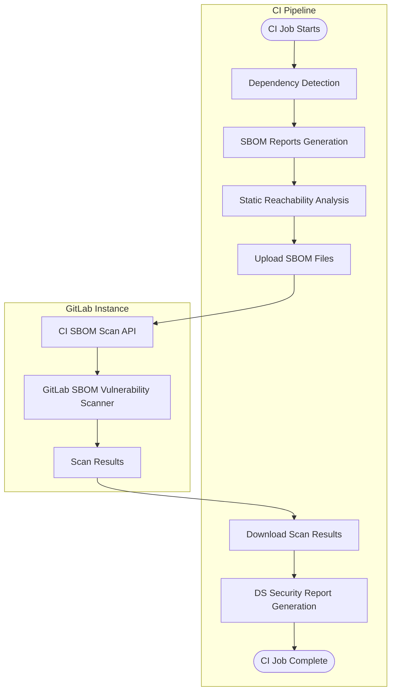



- Tier: Ultimate
- Offering: GitLab.com, GitLab Self-Managed, GitLab Dedicated
- Status: Limited Availability (GitLab.com)





- [Introduced](https://gitlab.com/gitlab-org/gitlab/-/issues/395692) in GitLab 17.1 and officially released in GitLab 17.3 with a flag named `dependency_scanning_using_sbom_reports`.
- [Enabled on GitLab.com, GitLab Self-Managed, and GitLab Dedicated](https://gitlab.com/gitlab-org/gitlab/-/issues/395692) in GitLab 17.5.
- Released [lockfile-based dependency scanning](https://gitlab.com/gitlab-org/security-products/analyzers/dependency-scanning/-/blob/main/README.md?ref_type=heads#supported-files) analyzer as an [Experiment](../../../../policy/development_stages_support.md#experiment) in GitLab 17.4.
- Released [dependency scanning CI/CD component](https://gitlab.com/explore/catalog/components/dependency-scanning) version [`0.4.0`](https://gitlab.com/components/dependency-scanning/-/tags/0.4.0) in GitLab 17.5 with support for the [lockfile-based dependency scanning](https://gitlab.com/gitlab-org/security-products/analyzers/dependency-scanning/-/blob/main/README.md?ref_type=heads#supported-files) analyzer.
- [Enabled by default with the latest dependency scanning CI/CD templates](https://gitlab.com/gitlab-org/gitlab/-/issues/519597) for Cargo, Conda, Cocoapods, and Swift in GitLab 17.9.
- Feature flag `dependency_scanning_using_sbom_reports` removed in GitLab 17.10.
- Released as Limited Availability on GitLab.com only with a new [V2 CI/CD dependency scanning template](https://gitlab.com/gitlab-org/gitlab/-/merge_requests/201175/) in GitLab 18.5. Using the dependency scanning SBOM API behind feature flag `dependency_scanning_sbom_scan_api` disabled by default. 



Dependency scanning using CycloneDX SBOM analyzes your application's dependencies for known
vulnerabilities. All dependencies are scanned, [including transitive dependencies](../_index.md).

Dependency scanning is often considered part of Software Composition Analysis (SCA). SCA can contain
aspects of inspecting the items your code uses. These items typically include application and system
dependencies that are almost always imported from external sources, rather than sourced from items
you wrote yourself.

Dependency scanning can run in the development phase of your application's lifecycle. Every time a
pipeline produces an SBOM report, security findings are identified and compared between the source
and target branches. Findings and their severity are listed in the merge request, enabling you to
proactively address the risk to your application, before the code change is committed. Security
findings for reported SBOM components are also identified by
[continuous vulnerability scanning](../../continuous_vulnerability_scanning/_index.md)
when new security advisories are published, independently from CI/CD pipelines.

GitLab offers both dependency scanning and [container scanning](../../container_scanning/_index.md) to
ensure coverage for all of these dependency types. To cover as much of your risk area as possible,
we encourage you to use all of our security scanners. For a comparison of these features, see
[Dependency scanning compared to container scanning](../../comparison_dependency_and_container_scanning.md).

Share any feedback on the new dependency scanning analyzer in this [feedback issue](https://gitlab.com/gitlab-org/gitlab/-/issues/523458).

## Getting started

Prerequisites:

- A [supported lock file or dependency graph](https://gitlab.com/gitlab-org/security-products/analyzers/dependency-scanning/#supported-files)
  must exist in the repository or must be passed as an artifact to the `dependency-scanning` job.
- With self-managed runners you need a GitLab Runner with the
  [`docker`](https://docs.gitlab.com/runner/executors/docker.html) or
  [`kubernetes`](https://docs.gitlab.com/runner/install/kubernetes.html) executor.
  - If you're using SaaS runners on GitLab.com, this is enabled by default.
- [Package metadata](../../../../administration/settings/security_and_compliance.md#choose-package-registry-metadata-to-sync) for all PURL types that you intend to scan must be synced in the GitLab instance. For GitLab.com and GitLab Dedicated this is handled automatically.

### Enabling the analyzer

To enable the analyzer, use one of the following options:

- The `v2` dependency scanning CI/CD template `Dependency-Scanning.v2.gitlab-ci.yml`

  ```yaml
  include:
    - template: Jobs/Dependency-Scanning.v2.gitlab-ci.yml
  ```

- A [security policy](#security-policies) with the `v2` template.

#### Language-specific instructions

If your project doesn't have a supported lock file dependency graph committed to its
repository, you need to provide one.

The examples below show how to create a file that is supported by the GitLab analyzer for popular
languages and package managers. See also the complete list of [Supported languages and files](#supported-languages-and-files).

##### Go

If your project provides only a `go.mod` file, the dependency scanning analyzer can still extract the list of components. However, [dependency path](../../dependency_list/_index.md#dependency-paths) information is not available. Additionally, you might encounter false positives if there are multiple versions of the same module.

To benefit from improved component detection and feature coverage, you should provide a `go.graph` file generated using the [`go mod graph` command](https://go.dev/ref/mod#go-mod-graph) from the Go toolchain.

The following example `.gitlab-ci.yml` demonstrates how to enable the analyzer
with [dependency path](../../dependency_list/_index.md#dependency-paths)
support on a Go project. The dependency graph is output as a job artifact in the `build`
stage, before dependency scanning runs.

```yaml
stages:
  - build
  - test

include:
  - template: Jobs/Dependency-Scanning.v2.gitlab-ci.yml
go:build:
  stage: build
  image: "golang:latest"
  script:
    - "go mod tidy"
    - "go build ./..."
    - "go mod graph > go.graph"
  artifacts:
    when: on_success
    access: developer
    paths: ["**/go.graph"]

```

##### Gradle

For Gradle projects use either of the following methods to create a dependency graph.

- Nebula Gradle Dependency Lock Plugin
- Gradle's HtmlDependencyReportTask

###### Dependency lock plugin

This method gives information about dependencies which are direct.

To enable the analyzer on a Gradle project:

1. Edit the `build.gradle` or `build.gradle.kts` to use the
   [gradle-dependency-lock-plugin](https://github.com/nebula-plugins/gradle-dependency-lock-plugin/wiki/Usage#example) or use an init script.
1. Configure the `.gitlab-ci.yml` file to generate the `dependencies.lock` and `dependencies.direct.lock` artifacts, and pass them
   to the `dependency-scanning` job.

The following example demonstrates how to configure the analyzer
for a Gradle project.

```yaml
stages:
  - build
  - test

image: gradle:8.0-jdk11

include:
  - template: Jobs/Dependency-Scanning.v2.gitlab-ci.yml

generate nebula lockfile:
  # Running in the build stage ensures that the dependency-scanning job
  # receives the scannable artifacts.
  stage: build
  script:
    - |
      cat << EOF > nebula.gradle
      initscript {
          repositories {
            mavenCentral()
          }
          dependencies {
              classpath 'com.netflix.nebula:gradle-dependency-lock-plugin:12.7.1'
          }
      }

      allprojects {
          apply plugin: nebula.plugin.dependencylock.DependencyLockPlugin
      }
      EOF
      ./gradlew --init-script nebula.gradle -PdependencyLock.includeTransitives=true -PdependencyLock.lockFile=dependencies.lock generateLock saveLock
      ./gradlew --init-script nebula.gradle -PdependencyLock.includeTransitives=false -PdependencyLock.lockFile=dependencies.direct.lock generateLock saveLock
      # generateLock saves the lock file in the build/ directory of a project
      # and saveLock copies it into the root of a project. To avoid duplicates
      # and get an accurate location of the dependency, use find to remove the
      # lock files in the build/ directory only.
  after_script:
    - find . -path '*/build/dependencies*.lock' -print -delete
  # Collect all generated artifacts and pass them onto jobs in sequential stages.
  artifacts:
    paths:
      - '**/dependencies*.lock'
```

###### HtmlDependencyReportTask

This method gives information about dependencies which are both transitive and direct.

The [HtmlDependencyReportTask](https://docs.gradle.org/current/dsl/org.gradle.api.reporting.dependencies.HtmlDependencyReportTask.html)
is an alternative way to get the list of dependencies for a Gradle project (tested with `gradle`
versions 4 through 8). To enable use of this method with dependency scanning the artifact from running the
`gradle htmlDependencyReport` task needs to be available.

```yaml
stages:
  - build
  - test

# Define the image that contains Java and Gradle
image: gradle:8.0-jdk11

include:
  - template: Jobs/Dependency-Scanning.v2.gitlab-ci.yml

build:
  stage: build
  script:
    - gradle --init-script report.gradle htmlDependencyReport
  # The gradle task writes the dependency report as a javascript file under
  # build/reports/project/dependencies. Because the file has an un-standardized
  # name, the after_script finds and renames the file to
  # `gradle-html-dependency-report.js` copying it to the  same directory as
  # `build.gradle`
  after_script:
    - |
      reports_dir=build/reports/project/dependencies
      while IFS= read -r -d '' src; do
        dest="${src%%/$reports_dir/*}/gradle-html-dependency-report.js"
        cp $src $dest
      done < <(find . -type f -path "*/${reports_dir}/*.js" -not -path "*/${reports_dir}/js/*" -print0)
  # Pass html report artifact to subsequent dependency scanning stage.
  artifacts:
    paths:
      - "**/gradle-html-dependency-report.js"
```

The command above uses the `report.gradle` file and can be supplied through `--init-script` or its contents can be added to `build.gradle` directly:

```kotlin
allprojects {
    apply plugin: 'project-report'
}
```



The dependency report may indicate that dependencies for some configurations `FAILED` to be
resolved. In this case dependency scanning logs a warning but does not fail the job. If you prefer
to have the pipeline fail if resolution failures are reported, add the following extra steps to the
`build` example above.



```shell
while IFS= read -r -d '' file; do
  grep --quiet -E '"resolvable":\s*"FAILED' $file && echo "Dependency report has dependencies with FAILED resolution status" && exit 1
done < <(find . -type f -path "*/gradle-html-dependency-report.js -print0)
```

##### Maven

The following example `.gitlab-ci.yml` demonstrates how to enable the analyzer
on a Maven project. The dependency graph is output as a job artifact
in the `build` stage, before dependency scanning runs.

Requirement: use at least version `3.7.0` of the maven-dependency-plugin.

```yaml
stages:
  - build
  - test

image: maven:3.9.9-eclipse-temurin-21

include:
  - template: Jobs/Dependency-Scanning.v2.gitlab-ci.yml

build:
  # Running in the build stage ensures that the dependency-scanning job
  # receives the maven.graph.json artifacts.
  stage: build
  script:
    - mvn install
    - mvn org.apache.maven.plugins:maven-dependency-plugin:3.8.1:tree -DoutputType=json -DoutputFile=maven.graph.json
  # Collect all maven.graph.json artifacts and pass them onto jobs
  # in sequential stages.
  artifacts:
    paths:
      - "**/*.jar"
      - "**/maven.graph.json"
```

##### pip

If your project provides a `requirements.txt` lock file generated by the [pip-compile command line tool](https://pip-tools.readthedocs.io/en/latest/cli/pip-compile/),
the dependency scanning analyzer can extract the list of components and the dependency graph information,
which provides support for the [dependency path](../../dependency_list/_index.md#dependency-paths) feature.

Alternatively, your project can provide a `pipdeptree.json` dependency graph export generated by the [`pipdeptree --json` command line utility](https://pypi.org/project/pipdeptree/).

The following example `.gitlab-ci.yml` demonstrates how to enable the analyzer
with [dependency path](../../dependency_list/_index.md#dependency-paths)
support on a pip project. The `build` stage outputs the dependency graph as a job artifact
before dependency scanning runs.

```yaml
stages:
  - build
  - test

include:
  - template: Jobs/Dependency-Scanning.v2.gitlab-ci.yml

build:
  stage: build
  image: "python:latest"
  script:
    - "pip install -r requirements.txt"
    - "pip install pipdeptree"
    # Run pipdeptree to get project's dependencies and exclude pipdeptree itself to avoid false positives
    - "pipdeptree -e pipdeptree --json > pipdeptree.json"
  artifacts:
    when: on_success
    access: developer
    paths: ["**/pipdeptree.json"]
```

Because of a [known issue](https://github.com/tox-dev/pipdeptree/issues/107), `pipdeptree` does not mark
[optional dependencies](https://setuptools.pypa.io/en/latest/userguide/dependency_management.html#optional-dependencies)
as dependencies of the parent package. As a result, dependency scanning marks them as direct dependencies of the project,
instead of as transitive dependencies.

##### Pipenv

If your project provides only a `Pipfile.lock` file, the dependency scanning analyzer can still extract the list of components. However, [dependency path](../../dependency_list/_index.md#dependency-paths) information is not available.

To benefit from improved feature coverage, you should provide a `pipenv.graph.json` file generated by the [`pipenv graph` command](https://pipenv.pypa.io/en/latest/cli.html#graph).

The following example `.gitlab-ci.yml` demonstrates how to enable the analyzer
with [dependency path](../../dependency_list/_index.md#dependency-paths)
support on a Pipenv project. The `build` stage outputs the dependency graph as a job artifact
before dependency scanning runs.

```yaml
stages:
  - build
  - test

include:
  - template: Jobs/Dependency-Scanning.v2.gitlab-ci.yml

build:
  stage: build
  image: "python:3.12"
  script:
    - "pip install pipenv"
    - "pipenv install"
    - "pipenv graph --json-tree > pipenv.graph.json"
  artifacts:
    when: on_success
    access: developer
    paths: ["**/pipenv.graph.json"]
```

##### sbt

To enable the analyzer on an sbt project:

- Edit the `plugins.sbt` to use the
  [sbt-dependency-graph plugin](https://github.com/sbt/sbt-dependency-graph/blob/master/README.md#usage-instructions).

The following example `.gitlab-ci.yml` demonstrates how to enable the analyzer
with [dependency path](../../dependency_list/_index.md#dependency-paths)
support in an sbt project. The `build` stage outputs the dependency graph as a job artifact
before dependency scanning runs.

```yaml
stages:
  - build
  - test

include:
  - template: Jobs/Dependency-Scanning.v2.gitlab-ci.yml

build:
  stage: build
  image: "sbtscala/scala-sbt:eclipse-temurin-17.0.13_11_1.10.7_3.6.3"
  script:
    - "sbt dependencyDot"
  artifacts:
    when: on_success
    access: developer
    paths: ["**/dependencies-compile.dot"]
```

## Understanding the results

The dependency scanning analyzer produces a CycloneDX Software Bill of Materials (SBOM) for each supported
lock file or dependency graph export detected. 
It also generates a single dependency scanning report for all scanned SBOM documents.

### CycloneDX Software Bill of Materials

The dependency scanning analyzer outputs a [CycloneDX](https://cyclonedx.org/) Software Bill of Materials (SBOM)
for each supported lock or dependency graph export it detects. The CycloneDX SBOMs are created as job artifacts.

The CycloneDX SBOMs are:

- Named `gl-sbom-<package-type>-<package-manager>.cdx.json`.
- Available as job artifacts of the dependency scanning job.
- Uploaded as `cyclonedx` reports.
- Saved in the same directory as the detected lock or dependency graph exports files.

For example, if your project has the following structure:

```plaintext
.
├── ruby-project/
│   └── Gemfile.lock
├── ruby-project-2/
│   └── Gemfile.lock
└── php-project/
    └── composer.lock
```

The following CycloneDX SBOMs are created as job artifacts:

```plaintext
.
├── ruby-project/
│   ├── Gemfile.lock
│   └── gl-sbom-gem-bundler.cdx.json
├── ruby-project-2/
│   ├── Gemfile.lock
│   └── gl-sbom-gem-bundler.cdx.json
└── php-project/
    ├── composer.lock
    └── gl-sbom-packagist-composer.cdx.json
```

### Merging multiple CycloneDX SBOMs

You can use a CI/CD job to merge the multiple CycloneDX SBOMs into a single SBOM.



GitLab uses [CycloneDX Properties](https://cyclonedx.org/use-cases/#properties--name-value-store)
to store implementation-specific details in the metadata of each CycloneDX SBOM, such as the
location of dependency graph exports and lock files. If multiple CycloneDX SBOMs are merged together,
this information is removed from the resulting merged file.



For example, the following `.gitlab-ci.yml` extract demonstrates how the Cyclone SBOM files can be
merged, and the resulting file validated.

```yaml
stages:
  - test
  - merge-cyclonedx-sboms

include:
  - component: $CI_SERVER_FQDN/components/dependency-scanning/main@0

merge cyclonedx sboms:
  stage: merge-cyclonedx-sboms
  image:
    name: cyclonedx/cyclonedx-cli:0.27.1
    entrypoint: [""]
  script:
    - find . -name "gl-sbom-*.cdx.json" -exec cyclonedx merge --output-file gl-sbom-all.cdx.json --input-files "{}" +
    # optional: validate the merged sbom
    - cyclonedx validate --input-version v1_6 --input-file gl-sbom-all.cdx.json
  artifacts:
    paths:
      - gl-sbom-all.cdx.json
```

### Dependency scanning report 

The dependency scanning analyzer outputs a single dependency scanning report containing vulnerabilities
for all lock files scanned.

The dependency scanning report is:

- Named `gl-dependency-scanning-report.json`.
- Available as a job artifact of the dependency scanning job
- Uploaded as a `dependency_scanning` report.
- Saved in the root directory of the project. 

## Optimization

To optimize dependency scanning with SBOM according to your requirements you can:

- Exclude files and directories from the scan.
- Define the max depth to look for files.

### Exclude files and directories from the scan

To exclude files or directories from being targeted by the scan use `excluded_paths` spec input or `DS_EXCLUDED_PATHS` with a comma-separated list of patterns in your `.gitlab-ci.yml`.

### Define the max depth to look for files

To optimize the analyzer behavior you may set a maximum depth value. A value of `-1` scans all directories regardless of depth. The default is `2`. To do so, use either `max_scan_depth` spec input or `DS_MAX_DEPTH` CI/CD variable in your `.gitlab-ci.yml`.

## Roll out

After you are confident in the dependency scanning with SBOM results for a single project, you can extend its implementation to additional projects:

- Use [enforced scan execution](../../detect/security_configuration.md#create-a-shared-configuration) to apply dependency scanning with SBOM settings across groups.
- If you have unique requirements, dependency scanning with SBOM can be run in [offline environments](#offline-support).

## Supported package types

For the security analysis to be effective, the components listed in your SBOM report must have corresponding
entries in the [GitLab advisory database](../../gitlab_advisory_database/_index.md).

The GitLab SBOM Vulnerability Scanner can report dependency scanning vulnerabilities for components with the
following [PURL types](https://github.com/package-url/purl-spec/blob/346589846130317464b677bc4eab30bf5040183a/PURL-TYPES.rst):

- `cargo`
- `composer`
- `conan`
- `gem`
- `golang`
- `maven`
- `npm`
- `nuget`
- `pypi`
- `swift`

## Supported languages and files

| Language | Package Manager | File(s) | Description | Dependency Graph Support | Static Reachability Support |
| -------- | --------------- | ------- | ----------- | ------------------------ | --------------------------- |
| C# | nuget | `packages.lock.json` | Lock files generated by `nuget`. |  Yes |  No |
| C/C++ | conan | `conan.lock` | Lock files generated by `conan`. |  Yes |  No |
| C/C++/Fortran/Go/Python/R | conda | `conda-lock.yml` | Environment files generated by `conda-lock`. |  No |  No |
| Dart | pub | `pubspec.lock`, `pub.graph.json` | Lock files generated by `pub`. Dependency graph derived from `dart pub deps --json > pub.graph.json`. |  Yes |  No |
| Go | go | `go.mod`, `go.graph` | Module files generated by the standard `go` toolchain. Dependency graph derived from `go mod graph > go.graph`. |  Yes |  No |
| Java | ivy | `ivy-report.xml` | Dependency graph exports generated by the `report` Apache Ant task. |  No |  No |
| Java | maven | `maven.graph.json` | Dependency graph exports generated by `mvn dependency:tree -DoutputType=json`. |  Yes |  No |
| Java/Kotlin | gradle | `dependencies.lock`, `dependencies.direct.lock` | Lock files generated by [gradle-dependency-lock-plugin](https://github.com/nebula-plugins/gradle-dependency-lock-plugin). |  Yes |  No |
| Java/Kotlin | gradle | `gradle-html-dependency-report.js` | Dependency graph exports generated by the [htmlDependencyReport](https://docs.gradle.org/current/dsl/org.gradle.api.tasks.diagnostics.DependencyReportTask.html) task. |  Yes |  No |
| JavaScript/TypeScript | npm | `package-lock.json`, `npm-shrinkwrap.json` | Lock files generated by `npm` v5 or later (earlier versions, which do not generate a `lockfileVersion` attribute, are not supported). |  Yes |  Yes |
| JavaScript/TypeScript | pnpm | `pnpm-lock.yaml` | Lock files generated by `pnpm`. |  Yes |  Yes |
| JavaScript/TypeScript | yarn | `yarn.lock` | Lock files generated by `yarn`. |  Yes |  Yes |
| PHP | composer | `composer.lock` | Lock files generated by `composer`. |  Yes |  No |
| Python | pip | `pipdeptree.json` | Dependency graph exports generated by `pipdeptree --json`. |  Yes |  Yes |
| Python | pip | `requirements.txt` | Dependency lock files generated by `pip-compile`. |  Yes |  Yes |
| Python | pipenv | `Pipfile.lock` | Lock files generated by `pipenv`. |  No |  No |
| Python | pipenv | `pipenv.graph.json` | Dependency graph exports generated by `pipenv graph --json-tree >pipenv.graph.json`. |  Yes |  Yes |
| Python | poetry | `poetry.lock` | Lock files generated by `poetry`. |  Yes |  Yes |
| Python | uv | `uv.lock` | Lock files generated by `uv`. |  Yes |  Yes |
| Ruby | bundler | `Gemfile.lock`, `gems.locked` | Lock files generated by `bundler`. |  Yes |  No |
| Rust | cargo | `Cargo.lock` | Lock files generated by `cargo`. |  Yes |  No |
| Scala | sbt | `dependencies-compile.dot` | Dependency graph exports generated by `sbt dependencyDot`. |  Yes |  No |
| Swift | swift | `Package.resolved` | Lock files generated by `swift`. |  No |  No |

### Package hash information

Dependency scanning SBOMs include package hash information when available. This information is provided only for NuGet packages.
Package hashes appear in the following locations within the SBOM, allowing you to verify package integrity and authenticity:

- Dedicated hashes field
- PURL qualifiers

For example:

```json
{
  "name": "Iesi.Collections",
  "version": "4.0.4",
  "purl": "pkg:nuget/Iesi.Collections@4.0.4?sha512=8e579b4a3bf66bb6a661f297114b0f0d27f6622f6bd3f164bef4fa0f2ede865ef3f1dbbe7531aa283bbe7d86e713e5ae233fefde9ad89b58e90658ccad8d69f9",
  "hashes": [
    {
      "alg": "SHA-512",
      "content": "8e579b4a3bf66bb6a661f297114b0f0d27f6622f6bd3f164bef4fa0f2ede865ef3f1dbbe7531aa283bbe7d86e713e5ae233fefde9ad89b58e90658ccad8d69f9"
    }
  ],
  "type": "library",
  "bom-ref": "pkg:nuget/Iesi.Collections@4.0.4?sha512=8e579b4a3bf66bb6a661f297114b0f0d27f6622f6bd3f164bef4fa0f2ede865ef3f1dbbe7531aa283bbe7d86e713e5ae233fefde9ad89b58e90658ccad8d69f9"
}
```

## Customizing analyzer behavior

How to customize the analyzer varies depending on the enablement solution.



Test all customization of GitLab analyzers in a merge request before merging these changes to the
default branch. Failure to do so can give unexpected results, including a large number of false
positives.



### Customizing behavior with the CI/CD template

#### Available spec inputs

The following spec inputs can be used in combination with the `Dependency-Scanning.v2.gitlab-ci.yml` template. 

| Spec Input | Type | Default | Description |
|------------|------|---------|-------------|
| `job_name` | string | `"dependency-scanning"` | The name of the dependency scanning job. |
| `stage` | string | `test` | The stage of the dependency scanning job. |
| `allow_failure` | boolean | `true` | Whether the dependency scanning job failure should fail the pipeline. |
| `analyzer_image_prefix` | string | `"$CI_TEMPLATE_REGISTRY_HOST/security-products"` | The registry URL prefix pointing to the repository of the analyzer. |
| `analyzer_image_name` | string | `"dependency-scanning"` | The repository of the analyzer image used by the dependency-scanning job. |
| `analyzer_image_version` | string | `"1"` | The version of the analyzer image used by the dependency-scanning job. |
| `enable_mr_pipelines` | boolean | `true` | Control whether dependency scanning job runs in MR or branch pipeline. |
| `pipcompile_requirements_file_name_pattern` | string |  | Custom requirements file name pattern to use when analyzing. The pattern should match file names only, not directory paths. See [doublestar library](https://www.github.com/bmatcuk/doublestar/tree/v1#patterns) for syntax details. |
| `max_scan_depth` | number | `2` | Defines how many directory levels analyzer should search for supported files. A value of -1 means the analyzer will search all directories regardless of depth. |
| `excluded_paths` | string | `"**/spec,**/test,**/tests,**/tmp"` | A comma-separated list of paths (globs supported) to exclude from the scan. |
| `include_dev_dependencies` | boolean | `true` | Include development/test dependencies when scanning a supported file. |
| `enable_static_reachability` | boolean | `false` | Enable [static reachability](../static_reachability.md). |
| `analyzer_log_level` | string | `"info"` | Logging level for dependency scanning. The options are fatal, error, warn, info, debug. |
| `enable_vulnerability_scan` | boolean | `true` | Enable the vulnerability analysis of generated SBOMs |
| `api_timeout` | number | `10` | Dependency scanning SBOM API request timeout in seconds. |
| `api_scan_download_delay` | number | `3` | Dependency scanning SBOM API initial delay in seconds before downloading scan results. |

#### Available CI/CD variables

These variables can replace spec inputs and are also compatible with the beta `latest` template.

| CI/CD variables             | Description |
| ----------------------------|------------ |
| `DS_EXCLUDED_ANALYZERS`     | Specify the analyzers (by name) to exclude from dependency scanning. |
| `DS_EXCLUDED_PATHS`         | Exclude files and directories from the scan based on the paths. A comma-separated list of patterns. Patterns can be globs (see [`doublestar.Match`](https://pkg.go.dev/github.com/bmatcuk/doublestar/v4@v4.0.2#Match) for supported patterns), or file or folder paths (for example, `doc,spec`). Parent directories also match patterns. This is a pre-filter which is applied before the scan is executed. Applies both for dependency detection and static reachability. Default: `"spec, test, tests, tmp"`. |
| `DS_MAX_DEPTH`              | Defines how many directory levels deep that the analyzer should search for supported files to scan. A value of `-1` scans all directories regardless of depth. Default: `2`. |
| `DS_INCLUDE_DEV_DEPENDENCIES` | When set to `"false"`, development dependencies are not reported. Only projects using Composer, Conda, Gradle, Maven, npm, pnpm, Pipenv, Poetry, or uv are supported. Default: `"true"` |
| `DS_PIPCOMPILE_REQUIREMENTS_FILE_NAME_PATTERN`   | Defines which requirement files to process using glob pattern matching (for example, `requirements*.txt` or `*-requirements.txt`). The pattern should match filenames only, not directory paths. See [glob pattern documentation](https://github.com/bmatcuk/doublestar/tree/v1?tab=readme-ov-file#patterns) for syntax details. |
| `SECURE_ANALYZERS_PREFIX`   | Override the name of the Docker registry providing the official default images (proxy). |
| `DS_FF_LINK_COMPONENTS_TO_GIT_FILES`   | Link components in the dependency list to files committed to the repository rather than lockfiles and graph files generated dynamically in a CI/CD pipeline. This ensures all components are linked to a source file in the repository. Default: `"false"`. |
| `SEARCH_IGNORE_HIDDEN_DIRS` |  Ignore hidden directories. Works both for dependency scanning and static reachability. Default: `"true"`. |
| `DS_STATIC_REACHABILITY_ENABLED` | Enables [static reachability](../static_reachability.md). Default: `"false"`. |
| `DS_ENABLE_VULNERABILITY_SCAN`| Enable vulnerability scanning of generated SBOM files. Generates a [dependency scanning report](#dependency-scanning-report). Default: `"true"`. |
| `DS_API_TIMEOUT` | Dependency scanning SBOM API request timeout in seconds (minimum: `5`, maximum: `300`) Default: `10` |
| `DS_API_SCAN_DOWNLOAD_DELAY` | Initial delay in seconds before downloading scan results (minimum: 1, maximum: 120) Default: `3` |
| `SECURE_LOG_LEVEL` | Log level. Default: `"info"`. |

## How it scans an application

The dependency scanning using SBOM feature relies on a decomposed dependency analysis approach that separates dependency detection from other analyses, like static reachability or vulnerability scanning. 

This separation of concerns and the modularity of this architecture allows to better support customers through expansion
of language support, a tighter integration and experience within the GitLab platform, and a shift towards industry standard
report types.

The overall flow of dependency scanning is illustrated below 



In the dependency detection phase the analyzer parses available lockfiles to build a comprehensive inventory of your project's dependencies and their relationship (dependency graph). This inventory is captured in a CycloneDX SBOM (Software Bill of Materials) document. 

In the static reachability phase he analyzer parses source files to identify which SBOM components are actively used and marks them accordingly in the SBOM file.
This allows users to prioritize vulnerabilities based on whether the vulnerable component is reachable.
For more information, see the [static reachability page](../static_reachability.md).

The SBOM documents are temporarily uploaded to the GitLab instance via the dependency scanning SBOM API.
The GitLab SBOM vulnerability scanner engine matches the SBOM components against advisories to generate a list of findings which is returned to the analyzer for inclusion in the dependency scanning report. 

The API makes use of the default `CI_JOB_TOKEN` for authentication. Overriding the `CI_JOB_TOKEN` value with a different token might lead to 403 - forbidden responses from the API.

Users can configure the analyzer client that communicates with the dependency scanning SBOM API by using: 

- `vulnerability_scan_api_timeout` or `DS_API_TIMEOUT`
- `vulnerability_scan_api_download_delay` or `DS_API_SCAN_DOWNLOAD_DELAY`

For more information see [available spec inputs](#available-spec-inputs) and [available CI/CD variables](#available-cicd-variables).

The generated reports are uploaded to the GitLab instance when the CI job completes and usually processed after pipeline completion. 

The SBOM reports are used to support other SBOM based features like the [Dependency List](../../dependency_list/_index.md), [License Scanning](../../../compliance/license_scanning_of_cyclonedx_files/_index.md) or [Continuous Vulnerability Scanning](../../continuous_vulnerability_scanning/_index.md).

The Dependency Scanning report follows the generic process for [security scanning results](../../detect/security_scanning_results.md)

- If the dependency scanning report is declared by a CI/CD job on the default branch: vulnerabilities are created,
and can be seen in the [vulnerability report](../../vulnerability_report/_index.md).
- If the dependency scanning report is declared by a CI/CD job on a non-default branch: security findings are created,
and can be seen in the [security tab of the pipeline view](../../detect/security_scanning_results.md) and MR security widget.

## Offline support



- Tier: Ultimate
- Offering: GitLab Self-Managed



For instances in an environment with limited, restricted, or intermittent access
to external resources through the internet, you need to make some adjustments to run dependency scanning jobs successfully.
For more information, see [offline environments](../../offline_deployments/_index.md). 

### Requirements

To run dependency scanning in an offline environment you must have:

- A GitLab Runner with the `docker` or `kubernetes` executor.
- Local copies of the dependency scanning analyzer images.
- Access to the [Package Metadata Database](../../../../topics/offline/quick_start_guide.md#enabling-the-package-metadata-database). Required to have license and advisory data for your dependencies.

### Local copies of analyzer images

To use the dependency scanning analyzer:

1. Import the following default dependency scanning analyzer images from `registry.gitlab.com` into
   your [local Docker container registry](../../../packages/container_registry/_index.md):

   ```plaintext
   registry.gitlab.com/security-products/dependency-scanning:v1
   ```

   The process for importing Docker images into a local offline Docker registry depends on
   **your network security policy**. Consult your IT staff to find an accepted and approved
   process by which external resources can be imported or temporarily accessed.
   These scanners are [periodically updated](../../detect/vulnerability_scanner_maintenance.md)
   with new definitions, and you may want to download them regularly. In case your offline instance
   has access to the GitLab registry you can use the [Security-Binaries template](../../offline_deployments/_index.md#using-the-official-gitlab-template) to download the latest dependency scanning analyzer image.

1. Configure GitLab CI/CD to use the local analyzers.

   Set the value of the CI/CD variable `SECURE_ANALYZERS_PREFIX` or `analyzer_image_prefix` spec input to your local Docker registry - in
   this example, `docker-registry.example.com`.

   ```yaml
   include:
     - template: Jobs/Dependency-Scanning.v2.gitlab-ci.yml

   variables:
     SECURE_ANALYZERS_PREFIX: "docker-registry.example.com/analyzers"
   ```

## Security policies

Use security policies to enforce dependency scanning across multiple projects.
The appropriate policy type depends on whether your projects have scannable artifacts committed to their repositories.

### Scan execution policies

[Scan execution policies](../../policies/scan_execution_policies.md) are supported for all projects that have scannable artifacts committed to their repositories. These artifacts include lockfiles, dependency graph files, and other files that can be directly analyzed to identify dependencies.

For projects with these artifacts, scan execution policies provide the fastest and most straightforward way to enforce dependency scanning.

### Pipeline execution policies

For projects that don't have scannable artifacts committed to their repositories,
you must use [pipeline execution policies](../../policies/pipeline_execution_policies.md).
These policies use a custom CI/CD job to generate scannable artifacts before invoking dependency scanning.

Pipeline execution policies:

- Generate lockfiles or dependency graphs as part of your CI/CD pipeline.
- Customize the dependency detection process for your specific project requirements.
- Implement the language-specific instructions for build tools like Gradle and Maven.

#### Example: Pipeline execution policy for a Gradle project

For a Gradle project without a scannable artifact committed to the repository, a pipeline execution policy with an artifact generation step is required. This example uses the `nebula` plugin.

In the dedicated security policies project create or update the main policy file (for example, `policy.yml`):

```yaml
pipeline_execution_policy:
- name: Enforce Gradle dependency scanning with SBOM
  description: Generate dependency artifact and run dependency scanning.
  enabled: true
  pipeline_config_strategy: inject_policy
  content:
    include:
      - project: $SECURITY_POLICIES_PROJECT
        file: "dependency-scanning.yml"
```

Add `dependency-scanning.yml`:

```yaml
stages:
  - build
  - test

include:
  - template: Jobs/Dependency-Scanning.v2.gitlab-ci.yml

generate nebula lockfile:
  image: openjdk:11-jdk
  stage: build
  script:
    - |
      cat << EOF > nebula.gradle
      initscript {
          repositories {
            mavenCentral()
          }
          dependencies {
              classpath 'com.netflix.nebula:gradle-dependency-lock-plugin:12.7.1'
          }
      }

      allprojects {
          apply plugin: nebula.plugin.dependencylock.DependencyLockPlugin
      }
      EOF
      ./gradlew --init-script nebula.gradle -PdependencyLock.includeTransitives=true -PdependencyLock.lockFile=dependencies.lock generateLock saveLock
      ./gradlew --init-script nebula.gradle -PdependencyLock.includeTransitives=false -PdependencyLock.lockFile=dependencies.direct.lock generateLock saveLock
  after_script:
    - find . -path '*/build/dependencies.lock' -print -delete
  artifacts:
    paths:
      - '**/dependencies.lock'
      - '**/dependencies.direct.lock'
```

This approach ensures that:

1. A pipeline run in the Gradle project generates the scannable artifacts.
1. Dependency scanning is enforced and has access to the scannable artifacts.
1. All projects in the policy scope consistently follow the same dependency scanning approach.
1. Configuration changes can be managed centrally and applied across multiple projects.

For more details on implementing pipeline execution policies for different build tools, refer to the [language-specific instructions](#language-specific-instructions).

## Other ways of enabling the new dependency scanning feature

We strongly suggest you enable the dependency scanning feature using the `v2` template. 
In case this is not possible you can choose one of the following ways: 

### Using the `latest` template 



The `latest` template is not considered stable and may include breaking changes. See [template editions](../../detect/security_configuration.md#template-editions).



Use the `latest` dependency scanning CI/CD template `Dependency-Scanning.latest.gitlab-ci.yml` to enable a GitLab provided analyzer.

- The (deprecated) Gemnasium analyzer is used by default.
- To enable the new dependency scanning analyzer, set the CI/CD variable `DS_ENFORCE_NEW_ANALYZER` to `true`.
- A [supported lock file, dependency graph](https://gitlab.com/gitlab-org/security-products/analyzers/dependency-scanning/#supported-files), or [trigger file](#trigger-files-for-the-latest-template) must exist in the repository to create the `dependency-scanning` job in pipelines.

  ```yaml
  include:
    - template: Jobs/Dependency-Scanning.latest.gitlab-ci.yml

  variables:
    DS_ENFORCE_NEW_ANALYZER: 'true'
  ```

Alternatively you can enable the feature using the [Scan Execution Policies](../../policies/scan_execution_policies.md) with the `latest` template and enforce the new dependency scanning analyzer by setting the CI/CD variable `DS_ENFORCE_NEW_ANALYZER` to `true`.

Please make sure you follow the [language-specific instructions](#language-specific-instructions). 
If you wish to customise the analyzer behavior use the [available CI/CD variables](#available-cicd-variables)

#### Trigger files for the `latest` template

Trigger files create a `dependency-scanning` CI/CD job when using the [latest dependency scanning CI template](https://gitlab.com/gitlab-org/gitlab/-/blob/master/lib/gitlab/ci/templates/Jobs/Dependency-Scanning.latest.gitlab-ci.yml).
The analyzer does not scan these files.
Your project can be supported if you use a trigger file to [build](#language-specific-instructions) a [supported lock file](https://gitlab.com/gitlab-org/security-products/analyzers/dependency-scanning/#supported-files).

| Language | Files |
| -------- | ------- |
| C#/Visual Basic | `*.csproj`, `*.vbproj` |
| Java | `pom.xml` |
| Java/Kotlin | `build.gradle`, `build.gradle.kts` |
| Python | `requirements.pip`, `Pipfile`, `requires.txt`, `setup.py` |
| Scala | `build.sbt` |  

### Using the Dependency Scanning CI/CD component



The [dependency scanning CI/CD component] is in Beta and subject to change. 



Use the [dependency scanning CI/CD component](https://gitlab.com/explore/catalog/components/dependency-scanning) to enable the new dependency scanning analyzer. Before choosing this approach, review the current [limitations](../../../../ci/components/_index.md) for GitLab Self-Managed.

  ```yaml
  include:
    - component: $CI_SERVER_FQDN/components/dependency-scanning/main@0
  ```

Please make sure you follow the [language-specific instructions](#language-specific-instructions).

When using the dependency scanning CI/CD component, the analyzer can be customized by configuring the [inputs](https://gitlab.com/explore/catalog/components/dependency-scanning).

### Bringing your own SBOM 



Third-party SBOM support is technically possible but highly subject to change as we complete official support with this [epic](https://www.gitlab.com/groups/gitlab-org/-/epics/14760).



Use your own CycloneDX SBOM document generated with a 3rd party CycloneDX SBOM generator or a custom tool as [a CI/CD artifact report](../../../../ci/yaml/artifacts_reports.md#artifactsreportscyclonedx) in a custom CI job.

To activate dependency scanning using SBOM, the provided CycloneDX SBOM document must:

- Comply with [the CycloneDX specification](https://github.com/CycloneDX/specification) version `1.4`, `1.5`, or `1.6`. Online validator available on [CycloneDX Web Tool](https://cyclonedx.github.io/cyclonedx-web-tool/validate).
- Comply with [the GitLab CycloneDX property taxonomy](../../../../development/sec/cyclonedx_property_taxonomy.md).
- Be uploaded as [a CI/CD artifact report](../../../../ci/yaml/artifacts_reports.md#artifactsreportscyclonedx) from a successful CI job.

## Troubleshooting

When working with dependency scanning, you might encounter the following issues.

### Warning: `grep: command not found`

The analyzer image contains minimal dependencies to decrease the image's attack surface.
As a result, utilities commonly found in other images, like `grep`, are missing from the image.
This may result in a warning like `/usr/bin/bash: line 3: grep: command not found` to appear in
the job log. This warning does not impact the results of the analyzer and can be ignored.

### Compliance framework compatibility

When using SBOM-based dependency scanning on GitLab Self-Managed instances, there are compatibility considerations with compliance frameworks:

- GitLab.com (SaaS): The "Dependency scanning running" compliance control works correctly with SBOM-based dependency scanning.
- GitLab Self-Managed from 18.4: The "Dependency scanning running" compliance control may fail when using SBOM-based dependency scanning (`DS_ENFORCE_NEW_ANALYZER: 'true'`) because the traditional `gl-dependency-scanning-report.json` artifact is not generated.

Workaround for Self-Managed instances: If you need to pass compliance framework checks that require the "Dependency scanning running" control, you can use the `v2` template (`Jobs/Dependency-Scanning.v2.gitlab-ci.yml`) which generates both SBOM and dependency scanning reports

For more information about compliance controls, see [GitLab compliance controls](../../../compliance/compliance_frameworks/_index.md#gitlab-compliance-controls).
