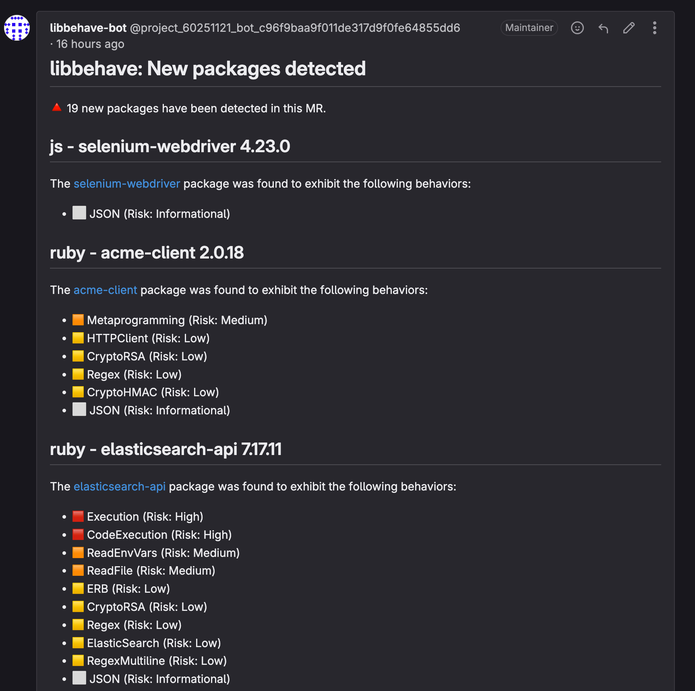
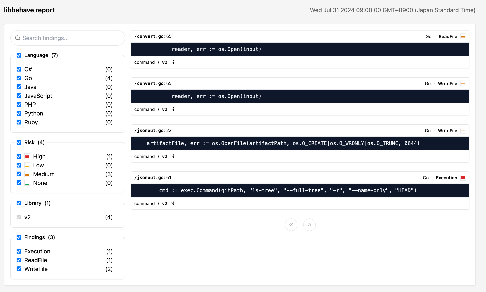

DETAILS:
**Tier:** Ultimate
**Offering:** GitLab.com, GitLab Self-Managed, GitLab Dedicated
**Status:** Experiment

Libbehave is an experimental feature that scans your dependencies during merge request pipelines to
identify newly added libraries and their potentially risky behaviors. While traditional dependency
scanning looks for known vulnerabilities, Libbehave gives insight into what features and behaviors
your dependencies exhibit.

Each feature detected by Libbehave is assigned a "riskiness" score of either:

- Informational: No risk, but may assist in cataloguing features of a dependency (for example, uses
  JSON).
- Low: Small risk, can highlight a dependency is doing a security sensitive action such as using
  encryption.
- Medium: Moderate level of risk, can be used to interact with the file system or read environment
  variables where sensitive data may be stored or accessed.
- High: Highest level of risk, these behaviors are commonly abused in security vulnerabilities such
  as executing OS commands or dynamically evaluating code.

Features that Libbehave detects include:

- Executing OS commands
- Executing dynamic code (eval)
- Reading/writing files
- Opening network sockets
- Reading/expanding archives (ZIP/tar/Gzip)
- Interacting with external services by using HTTP clients, Redis, Elastic Cache, Relational
  Management Database (RMDB) servers, SSH, Git
- Serializing data in various formats: XML, YAML, MessagePack, Protocol Buffers, JSON, and
  language-specific formats
- Templating
- Popular frameworks
- Upload/download of files

For demos of Libbehave for each supported package manager type, see
[our Libbehave demo projects](https://gitlab.com/gitlab-org/security-products/demos/experiments/libbehave).

## Supported languages and package managers

The following languages and package managers are supported by Libbehave:

- C# ([NuGet](https://www.nuget.org/))
  - Reads `Directory.Build.props` files (replacing property values if found)
  - Reads `*.deps.json` files
  - Reads `**/*.dll` and `**/*.exe` files
- Go
  - Reads `go.mod` files
- Java ([Maven](https://maven.org))
  - Reads `pom.xml` files (replacing property values if found)
  - Reads `**/gradle.lockfile*` files
- JavaScript/TypeScript ([npmjs](https://npmjs.com))
  - Reads `**/package-lock.json` files
  - Reads `**/yarn.lock` files
  - Reads `**/pnpm-lock.yaml` files
- Python ([pypi](https://pypi.org))
  - Reads `**/*requirements*.txt` files
  - Reads `**/poetry.lock` files
  - Reads `**/Pipfile.lock` files
  - Reads `**/setup.py` files
  - Reads packages in egg or wheel installation directories:
    - Reads `**/*dist-info/METADATA`, `**/*egg-info/PKG-INFO`, `**/*DIST-INFO/METADATA`, and
      `**/*EGG-INFO/PKG-INFO` files
- PHP ([Composer/Packagist](https://packagist.org/))
  - Reads `**/installed.json` files
  - Reads `**/composer.lock` files
  - Reads `**/php/.registry/.channel.*/*.reg"` files
- Ruby ([Rubygems](https://rubygems.org))
  - Reads `**/Gemfile.lock` files
  - Reads `**/specifications/**/*.gemspec` files
  - Reads `**/*.gemspec` files

The above files are analyzed for new dependencies only if the files have been modified in the source branch.

## Configuration

Prerequisites:

- Pipeline is part of an active [merge request pipeline](../../../ci/pipelines/merge_request_pipelines.md) that has a defined source and target Git branch.
- Project includes one of the [supported languages](#supported-languages-and-package-managers).
- Project is adding new dependencies to the source or feature branch.
- For merge request (MR) comments, ensure a Guest level [project access token](../../project/settings/project_access_tokens.md),
  and the source branch is either a protected branch or the **Protect variable** CI/CD variable
  [option is unchecked](../../../ci/variables/_index.md#for-a-project).

Libbehave is exposed through [CI/CD components](../../../ci/components/_index.md). To enable it, configure your project's
`.gitlab-ci.yml` file as follows:

```yaml
include:
  - component: $CI_SERVER_FQDN/security-products/experiments/libbehave/libbehave@v0.1.0
    inputs:
      stage: test
```

The above configuration enables the Libbehave CI component for the test stage. This will create a new job called `libbehave-experiment`.

### Configuring MR comments

To configure MR comments for Libbehave:

1. Create a [project access token](../../project/settings/project_access_tokens.md) with the following attributes:
   - Guest level access
     - Enter name for the token, for example, `libbehave-bot`.
     - Select the scope `api`.

   Copy the project access token to your clipboard. It's required in the next step.
1. Add the token as a [project CI/CD variable](../../../ci/variables/_index.md):
   - Set **Visibility** to "Masked".
   - Uncheck the "Protect variable" option under **Flags**, to allow access from non-protected branches.
   - Set the key variable name to `BEHAVE_TOKEN`.
   - Set the value to your newly created project access token.
1. The CI/CD component automatically uses the `BEHAVE_TOKEN` so you do not need to specify it in the
   component inputs.

```yaml
include:
  - component: $CI_SERVER_FQDN/security-products/experiments/libbehave/libbehave@v0.1.0
    inputs:
      stage: test
```

With this configuration, Libbehave can create MR comments with the analysis results.

### Available CI/CD inputs and variables

You can use CI/CD variables to customize the [CI component](https://gitlab.com/security-products/experiments/libbehave) of Libbehave.

The following variables configure the behavior of how Libbehave runs.

| CI/CD variable                        | CLI Argument | Default | Description                                                          |
|---------------------------------------|--------------|---------|----------------------------------------------------------------------|
| `CI_MERGE_REQUEST_SOURCE_BRANCH_NAME` | `-source`    | `""`    | Source branch to diff against (for example, feature-branch)          |
| `CI_MERGE_REQUEST_TARGET_BRANCH_NAME` | `-target`    | `""`    | Target branch to diff against (for example, main)                    |
| `BEHAVE_TIMEOUT`                      | `-timeout`   | `"30m"` | Maximum time allowed to analyze and download packages (example: 30m) |
| `BEHAVE_TOKEN`                        | `-token`     | `""`    | Optional. Access token (required to create an MR comment)            |
| `CI_PROJECT_ID`                       | `-project`   | `""`    | Optional. Project ID to create MR note with results                  |
| `CI_MERGE_REQUEST_IID`                | `-mrid`      | `""`    | Optional. Merge request ID to create MR note with results            |

The following flags are available, but are untested and should be left at their default values:

| CI/CD variable         | CLI Argument     | Default       | Description                 |
|------------------------|------------------|---------------|-----------------------------|
| `BEHAVE_RULE_PATHS`    | `-rules`         | `"/dist"`     | The path to the rule files. |
| `BEHAVE_TARGET_DIR`    | `-dir`           | `""`          | The target directory to run behave against. |
| `BEHAVE_NO_GIT_IGNORE` | `-no-git-ignore` | `true`        | Whether to scan files in `.gitignore`. Providing the argument will not scan them, by default it will. |
| `BEHAVE_OUTPUT_PATH`   | `-output`        | `"behaveout"` | The path to store scan results, extracted artifacts and report results. |
| `BEHAVE_INCLUDE_LANG`  | `-include-lang`  | `""`          | Include a language, one of: `csharp`, `go`, `java`, `js`, `php`, `python`, or `ruby`, separated by ',' excludes all others not specified. |
| `BEHAVE_EXCLUDE_LANG`  | `-exclude-lang`  | `""`          | Exclude a language, one of: `csharp`, `go`, `java`, `js`, `php`, `python`, or `ruby`, separated by ',', includes all others not specified. |
| `BEHAVE_EXCLUDE_FILES` | `-exclude-`      | `""`          | Exclude files or paths by regular expressions, individual regular expressions are separated by ','. |

As we have not tested all variables you may find some will work and others will not.
If one does not work and you need it, we suggest
[submitting a feature request](https://gitlab.com/gitlab-org/gitlab/-/issues/new?issuable_template=Feature%20proposal%20-%20detailed&issue[title]=Docs%20feedback%20-%20feature%20proposal:%20Write%20your%20title)
or [contributing to the code](../../../development/_index.md) to enable it to be used.

## Dependency detection and analysis

Libbehave analyzes and reports findings on any newly added dependencies and is meant to run in
[merge request pipelines](../../../ci/pipelines/merge_request_pipelines.md). That means if your
merge request does not include any new dependencies, then Libbehave returns zero results.

Detection works differently, depending on the language and package manager used. By default, those
supported package managers have their package manager related files parsed to identify which
dependencies are being added. This information is gathered and then used to call out to the
respective package manager API to download the identified package's artifacts.

After they're downloaded, the dependencies are extracted and analyzed using static analysis methods
based on Semgrep, with a configured set of checks.

In the case of Java and C#, an additional step is taken to decompile the binary artifacts prior to
running static analysis.

### Known issues

Each language has its own known issues.

All package files such as `Gemfile.lock` and `requirements.txt` must provide explicit versions.
Version ranges are not supported.

<!-- markdownlint-disable MD003 -->
<!-- markdownlint-disable MD020 -->
#### C\#
<!-- markdownlint-disable MD020 -->
<!-- markdownlint-enable MD003 -->

- Property or variable replacement in `.props` or `.csproj` files do not account for nested project files.
  It replaces any variable that matches a global set of extracted variables and their values.
- Decompiles downloaded dependencies, so source to line translation may not be 1:1.
- Libbehave decompiles _all_ .NET versions that exist in a NuGet package. This may be optimized in the future.
  - For example, some dependencies will package multiple DLLs in a single archive targeting
    different framework versions (example: net20/Some.dll, net45/Some.dll).

#### Java

- Does not support [inheritance](https://maven.apache.org/pom.html#inheritance) for `pom.xml` files.
- Only supports Maven and not custom JFrog or other artifact repositories.
- Decompiles downloaded dependencies, so source to line translation may not be 1:1.

#### Python

- Attempt to download source packages from PyPI for analysis. If there is no source package,
  Libbehave downloads the first available `bdist_wheel` package which may not match the target OS.

## Output

Libbehave produces the following output:

- **Job summary**: The summary of findings are output directly into the CI/CD output job console for
  a quick view of which features a dependency detected.
- **MR comment summary**: The summary of findings are output as an MR comment note for easier
  review. This requires an access token to be configured to give the job access to write to the MR
note section.
- **HTML artifact**: An HTML artifact that contains a searchable set of libraries and identified
  features as well as the exact lines of code that triggered the finding.

### Job summary

The job summary requires no extra configuration and will always be presented after a successful
analysis.

Example of what the Job Summary output looks like:

```plaintext
# ... job output ... #

[=== libbehave: New packages detected ===]
🔺 4 new packages have been detected in this MR.
[= java - open-vulnerability-clients 6.1.7 =]
The https://mvnrepository.com/artifact/io.github.jeremylong/open-vulnerability-clients package was found to exhibit the following behaviors:
    - 🟧 GzipReadArchive (Risk: Medium)
-----------------
[= java - jdiagnostics 1.0.7 =]
The https://mvnrepository.com/artifact/org.anarres.jdiagnostics/jdiagnostics package was found to exhibit the following behaviors:
    - 🟥 CryptoMD5 (Risk: High)
    - 🟧 WriteFile (Risk: Medium)
    - 🟧 ReadFile (Risk: Medium)
    - 🟧 ReadEnvVars (Risk: Medium)
-----------------
[= java - commons-dbcp2 2.12.0 =]
The https://mvnrepository.com/artifact/org.apache.commons/commons-dbcp2 package was found to exhibit the following behaviors:
    - 🟥 JavaObjectSerialization (Risk: High)
    - 🟧 Passwords (Risk: Medium)
-----------------
[= java - jmockit 1.49 =]
The https://mvnrepository.com/artifact/org.jmockit/jmockit package was found to exhibit the following behaviors:
    - 🟥 JavaObjectSerialization (Risk: High)
    - 🟧 WriteFile (Risk: Medium)
    - 🟧 ReadFile (Risk: Medium)
    - 🟨 CryptoRAND (Risk: Low)
-----------------
```

### MR comment summary

The MR Comment Summary output requires an access token with Guest level access be created for the
project that the Libbehave component has been configured for. The access token should then be
[configured for the project](../../../ci/variables/_index.md#for-a-project). Because feature branches
are not protected by default, ensure the **Protect variable** setting is unchecked, otherwise the
Libbehave job will not be able to read the access token's value.



### HTML artifact

The HTML artifact will appear in your jobs artifacts output (`behaveout/gl-libbehave.html`) and
should be accessible in your job artifact downloads.



## Offline environment (not supported)

Libbehave does not work in offline environments as it pulls down dependencies directly from the
various package managers.

## Troubleshooting

### Job is not run

If the Libbehave job is not run, ensure your project is configured to run
[merge request pipelines](../../../ci/pipelines/merge_request_pipelines.md).

### MR comment is not being added

This is usually due to the `BEHAVE_TOKEN` not being set. Ensure the access token has Guest level
access and the **Protect variable** option is unchecked in the **Settings > CI/CD** variables
settings.

#### I'm getting error "{401 Permission Denied}"

This is usually due to the `BEHAVE_TOKEN` not containing the correct value. Ensure the access token
has Guest level access.
