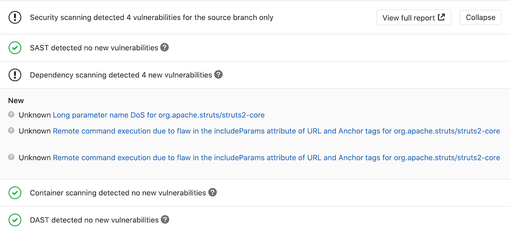

# Dependency Scanning **(ULTIMATE)**

> [Introduced](https://gitlab.com/gitlab-org/gitlab/issues/5105) in [GitLab Ultimate](https://about.gitlab.com/pricing/) 10.7.

Dependency Scanning helps to automatically find security vulnerabilities in your dependencies
while you're developing and testing your applications, such as when your
application is using an external (open source) library which is known to be vulnerable.

## Overview

If you're using [GitLab CI/CD](../../../ci/README.md), you can analyze your dependencies for known
vulnerabilities using Dependency Scanning.
All dependencies are scanned, including the transitive dependencies (also known as nested dependencies).
You can take advantage of Dependency Scanning by either [including the Dependency Scanning template](#configuration)
in your existing `.gitlab-ci.yml` file or by implicitly using
the [Auto Dependency Scanning](../../../topics/autodevops/stages.md#auto-dependency-scanning-ultimate)
provided by [Auto DevOps](../../../topics/autodevops/index.md).

GitLab checks the Dependency Scanning report, compares the found vulnerabilities
between the source and target branches, and shows the information on the
merge request.



The results are sorted by the severity of the vulnerability:

1. Critical
1. High
1. Medium
1. Low
1. Unknown
1. Everything else

## Requirements

To run a Dependency Scanning job, by default, you need GitLab Runner with the
[`docker`](https://docs.gitlab.com/runner/executors/docker.html#use-docker-in-docker-with-privileged-mode) or
[`kubernetes`](https://docs.gitlab.com/runner/install/kubernetes.html#running-privileged-containers-for-the-runners)
executor running in privileged mode. If you're using the shared Runners on GitLab.com,
this is enabled by default.

CAUTION: **Caution:**
If you use your own Runners, make sure your installed version of Docker
is **not** `19.03.0`. See [troubleshooting information](#error-response-from-daemon-error-processing-tar-file-docker-tar-relocation-error) for details.

Privileged mode is not necessary if you've [disabled Docker in Docker for Dependency Scanning](#disabling-docker-in-docker-for-dependency-scanning)

## Supported languages and package managers

The following languages and dependency managers are supported.

| Language (package managers)  | Supported | Scan tool(s) |
|----------------------------- | --------- | ------------ |
| Java ([Gradle](https://gradle.org/)) | yes | [Gemnasium](https://gitlab.com/gitlab-org/security-products/gemnasium) |
| Java ([Maven](https://maven.apache.org/)) | yes | [Gemnasium](https://gitlab.com/gitlab-org/security-products/gemnasium) |
| JavaScript ([npm](https://www.npmjs.com/), [yarn](https://classic.yarnpkg.com/en/)) | yes | [Gemnasium](https://gitlab.com/gitlab-org/security-products/gemnasium), [Retire.js](https://retirejs.github.io/retire.js/)         |
| PHP ([Composer](https://getcomposer.org/))  | yes | [Gemnasium](https://gitlab.com/gitlab-org/security-products/gemnasium) |
| Python ([pip](https://pip.pypa.io/en/stable/)) | yes | [Gemnasium](https://gitlab.com/gitlab-org/security-products/gemnasium) |
| Python ([Pipfile](https://pipenv.kennethreitz.org/en/latest/basics/)) | not currently ([issue](https://gitlab.com/gitlab-org/gitlab/issues/11756 "Pipfile.lock support for Dependency Scanning"))| not available |
| Python ([poetry](https://python-poetry.org/)) | not currently ([issue](https://gitlab.com/gitlab-org/gitlab/issues/7006 "Support Poetry in Dependency Scanning")) | not available |
| Ruby ([gem](https://rubygems.org/)) | yes | [Gemnasium](https://gitlab.com/gitlab-org/security-products/gemnasium), [bundler-audit](https://github.com/rubysec/bundler-audit) |
| Scala ([sbt](https://www.scala-sbt.org/)) | yes | [Gemnasium](https://gitlab.com/gitlab-org/security-products/gemnasium) |
| Go ([Go Modules](https://github.com/golang/go/wiki/Modules)) | yes ([alpha](https://gitlab.com/gitlab-org/gitlab/issues/7132)) | [Gemnasium](https://gitlab.com/gitlab-org/security-products/gemnasium) |

## Contribute your scanner

The [Security Scanner Integration](../../../development/integrations/secure.md) documentation explains how to integrate other security scanners into GitLab.

## Configuration

To enable Dependency Scanning for GitLab 11.9 and later, you must
[include](../../../ci/yaml/README.md#includetemplate) the
[`Dependency-Scanning.gitlab-ci.yml` template](https://gitlab.com/gitlab-org/gitlab/blob/master/lib/gitlab/ci/templates/Security/Dependency-Scanning.gitlab-ci.yml)
that's provided as a part of your GitLab installation.
For GitLab versions earlier than 11.9, you can copy and use the job as defined
that template.

Add the following to your `.gitlab-ci.yml` file:

```yaml
include:
  - template: Dependency-Scanning.gitlab-ci.yml
```

The included template will create a `dependency_scanning` job in your CI/CD
pipeline and scan your project's source code for possible vulnerabilities.
The results will be saved as a
[Dependency Scanning report artifact](../../../ci/pipelines/job_artifacts.md#artifactsreportsdependency_scanning-ultimate)
that you can later download and analyze. Due to implementation limitations, we
always take the latest Dependency Scanning artifact available.

### Customizing the Dependency Scanning settings

The Dependency Scanning settings can be changed through [environment variables](#available-variables) by using the
[`variables`](../../../ci/yaml/README.md#variables) parameter in `.gitlab-ci.yml`.
For example:

```yaml
include:
  - template: Dependency-Scanning.gitlab-ci.yml

variables:
  DS_PYTHON_VERSION: 2
```

Because template is [evaluated before](../../../ci/yaml/README.md#include) the pipeline
configuration, the last mention of the variable will take precedence.

### Overriding the Dependency Scanning template

CAUTION: **Deprecation:**
Beginning in GitLab 13.0, the use of [`only` and `except`](../../../ci/yaml/README.md#onlyexcept-basic)
is no longer supported. When overriding the template, you must use [`rules`](../../../ci/yaml/README.md#rules) instead.

If you want to override the job definition, such as changing properties like
`variables` or `dependencies`, you must declare a `dependency_scanning` job
after the template inclusion, and specify any additional keys under it. For example:

```yaml
include:
  - template: Dependency-Scanning.gitlab-ci.yml

dependency_scanning:
  variables:
    CI_DEBUG_TRACE: "true"
```

### Available variables

Dependency Scanning can be [configured](#customizing-the-dependency-scanning-settings)
using environment variables.

#### Configuring Dependency Scanning

The following variables allow configuration of global dependency scanning settings.

| Environment variable                    | Description |
| --------------------------------------- |------------ |
| `DS_ANALYZER_IMAGE_PREFIX`              | Override the name of the Docker registry providing the official default images (proxy). Read more about [customizing analyzers](analyzers.md). |
| `DS_DEFAULT_ANALYZERS`                  | Override the names of the official default images. Read more about [customizing analyzers](analyzers.md). |
| `DS_DISABLE_DIND`                       | Disable Docker-in-Docker and run analyzers [individually](#disabling-docker-in-docker-for-dependency-scanning).|
| `ADDITIONAL_CA_CERT_BUNDLE`             | Bundle of CA certs to trust. |
| `DS_EXCLUDED_PATHS`                     | Exclude vulnerabilities from output based on the paths. A comma-separated list of patterns. Patterns can be globs, or file or folder paths (for example, `doc,spec`). Parent directories also match patterns. |

#### Configuring Docker-in-Docker orchestrator

The following variables configure the Docker-in-Docker orchestrator.

| Environment variable                    | Default     | Description |
| --------------------------------------- | ----------- | ----------- |
| `DS_ANALYZER_IMAGES`                    |             | Comma-separated list of custom images. The official default images are still enabled. Read more about [customizing analyzers](analyzers.md). |
| `DS_ANALYZER_IMAGE_TAG`                 |             | Override the Docker tag of the official default images. Read more about [customizing analyzers](analyzers.md). |
| `DS_PULL_ANALYZER_IMAGES`               |             | Pull the images from the Docker registry (set to `0` to disable). |
| `DS_DOCKER_CLIENT_NEGOTIATION_TIMEOUT`  | 2m          | Time limit for Docker client negotiation. Timeouts are parsed using Go's [`ParseDuration`](https://golang.org/pkg/time/#ParseDuration). Valid time units are `ns`, `us` (or `µs`), `ms`, `s`, `m`, or `h`. For example, `300ms`, `1.5h`, or `2h45m`. |
| `DS_PULL_ANALYZER_IMAGE_TIMEOUT`        | 5m          | Time limit when pulling an analyzer's image. Timeouts are parsed using Go's [`ParseDuration`](https://golang.org/pkg/time/#ParseDuration). Valid time units are `ns`, `us` (or `µs`), `ms`, `s`, `m`, or `h`. For example, `300ms`, `1.5h`, or `2h45m`. |
| `DS_RUN_ANALYZER_TIMEOUT`               | 20m         | Time limit when running an analyzer. Timeouts are parsed using Go's [`ParseDuration`](https://golang.org/pkg/time/#ParseDuration). Valid time units are `ns`, `us` (or `µs`), `ms`, `s`, `m`, or `h`. For example, `300ms`, `1.5h`, or `2h45m`. |

#### Configuring specific analyzers used by Dependency Scanning

The following variables are used for configuring specific analyzers (used for a specific language/framework).

| Environment variable                    | Analyzer           | Default                      | Description |
| --------------------------------------- | ------------------ | ---------------------------- |------------ |
| `GEMNASIUM_DB_LOCAL_PATH`               | `gemnasium`        | `/gemnasium-db`              | Path to local Gemnasium database. |
| `GEMNASIUM_DB_REMOTE_URL`               | `gemnasium`        | `https://gitlab.com/gitlab-org/security-products/gemnasium-db.git` | Repository URL for fetching the Gemnasium database. |
| `GEMNASIUM_DB_REF_NAME`                 | `gemnasium`        | `master`                     | Branch name for remote repository database. `GEMNASIUM_DB_REMOTE_URL` is required. |
| `DS_REMEDIATE`                          | `gemnasium`        | `"true"`                       | Enable automatic remediation of vulnerable dependencies.  |
| `PIP_INDEX_URL`                         | `gemnasium-python` | `https://pypi.org/simple`    | Base URL of Python Package Index. |
| `PIP_EXTRA_INDEX_URL`                   | `gemnasium-python` |                              | Array of [extra URLs](https://pip.pypa.io/en/stable/reference/pip_install/#cmdoption-extra-index-url) of package indexes to use in addition to `PIP_INDEX_URL`. Comma-separated. |
| `PIP_REQUIREMENTS_FILE`                 | `gemnasium-python` |                              | Pip requirements file to be scanned. |
| `DS_PIP_VERSION`                        | `gemnasium-python` |                              | Force the install of a specific pip version (example: `"19.3"`), otherwise the pip installed in the Docker image is used. ([Introduced](https://gitlab.com/gitlab-org/gitlab/issues/12811) in GitLab 12.7) |
| `DS_PIP_DEPENDENCY_PATH`                | `gemnasium-python` |                              | Path to load Python pip dependencies from. ([Introduced](https://gitlab.com/gitlab-org/gitlab/issues/12412) in GitLab 12.2) |
| `DS_PYTHON_VERSION`                     | `retire.js`        |                              | Version of Python. If set to 2, dependencies are installed using Python 2.7 instead of Python 3.6. ([Introduced](https://gitlab.com/gitlab-org/gitlab/issues/12296) in GitLab 12.1)|
| `MAVEN_CLI_OPTS`                        | `gemnasium-maven`  | `"-DskipTests --batch-mode"` | List of command line arguments that will be passed to `maven` by the analyzer. See an example for [using private repositories](../index.md#using-private-maven-repos). |
| `GRADLE_CLI_OPTS`                        | `gemnasium-maven`  | | List of command line arguments that will be passed to `gradle` by the analyzer. |
| `SBT_CLI_OPTS`                        | `gemnasium-maven`  | | List of command-line arguments that the analyzer will pass to `sbt`. |
| `BUNDLER_AUDIT_UPDATE_DISABLED`         | `bundler-audit`    | `"false"`                      | Disable automatic updates for the `bundler-audit` analyzer. Useful if you're running Dependency Scanning in an offline, air-gapped environment.|
| `BUNDLER_AUDIT_ADVISORY_DB_URL`         | `bundler-audit`    | `https://github.com/rubysec/ruby-advisory-db` | URL of the advisory database used by bundler-audit. |
| `BUNDLER_AUDIT_ADVISORY_DB_REF_NAME`    | `bundler-audit`    | `master`                     | Git ref for the advisory database specified by `BUNDLER_AUDIT_ADVISORY_DB_URL`. |
| `RETIREJS_JS_ADVISORY_DB`               | `retire.js`        | `https://raw.githubusercontent.com/RetireJS/retire.js/master/repository/jsrepository.json` | Path or URL to `retire.js` JS vulnerability data file. Note that if the URL hosting the data file uses a custom SSL certificate, for example in an offline installation, you can pass the certificate in the `ADDITIONAL_CA_CERT_BUNDLE` environment variable. |
| `RETIREJS_NODE_ADVISORY_DB`             | `retire.js`        | `https://raw.githubusercontent.com/RetireJS/retire.js/master/repository/npmrepository.json` | Path or URL to `retire.js` node vulnerability data file. Note that if the URL hosting the data file uses a custom SSL certificate, for example in an offline installation, you can pass the certificate in the `ADDITIONAL_CA_CERT_BUNDLE` environment variable. |
| `RETIREJS_ADVISORY_DB_INSECURE`         | `retire.js`        | `false`                      | Enable fetching remote JS and Node vulnerability data files (defined by the `RETIREJS_JS_ADVISORY_DB` and `RETIREJS_NODE_ADVISORY_DB` variables) from hosts using an insecure or self-signed SSL (TLS) certificate. |

### Using private Maven repos

If your private Maven repository requires login credentials,
you can use the `MAVEN_CLI_OPTS` environment variable.

Read more on [how to use private Maven repositories](../index.md#using-private-maven-repos).

### Disabling Docker in Docker for Dependency Scanning

> [Introduced](https://gitlab.com/gitlab-org/gitlab/issues/12487) in GitLab Ultimate 12.5.

You can avoid the need for Docker in Docker by running the individual analyzers.
This does not require running the executor in privileged mode. For example:

```yaml
include:
  - template: Dependency-Scanning.gitlab-ci.yml

variables:
  DS_DISABLE_DIND: "true"
```

This will create individual `<analyzer-name>-dependency_scanning` jobs for each analyzer that runs in your CI/CD pipeline.

By removing Docker-in-Docker (DIND), GitLab relies on [Linguist](https://github.com/github/linguist)
to start relevant analyzers depending on the detected repository language(s) instead of the
[orchestrator](https://gitlab.com/gitlab-org/security-products/dependency-scanning/). However, there
are some differences in the way repository languages are detected between DIND and non-DIND. You can
observe these differences by checking both Linguist and the common library. For instance, Linguist
looks for `*.java` files to spin up the [gemnasium-maven](https://gitlab.com/gitlab-org/security-products/analyzers/gemnasium-maven)
image, while orchestrator only looks for the existence of `pom.xml` or `build.gradle`. GitLab uses
Linguist to detect new file types in the default branch. This means that when introducing files or
dependencies for a new language or package manager, the corresponding scans won't be triggered in
the merge request, and will only run on the default branch once the merge request is merged. This will be addressed by
[#211702](https://gitlab.com/gitlab-org/gitlab/-/issues/211702).

## Interacting with the vulnerabilities

Once a vulnerability is found, you can interact with it. Read more on how to
[interact with the vulnerabilities](../index.md#interacting-with-the-vulnerabilities).

## Solutions for vulnerabilities (auto-remediation)

Some vulnerabilities can be fixed by applying the solution that GitLab
automatically generates. Read more about the
[solutions for vulnerabilities](../index.md#solutions-for-vulnerabilities-auto-remediation).

## Security Dashboard

The Security Dashboard is a good place to get an overview of all the security
vulnerabilities in your groups, projects and pipelines. Read more about the
[Security Dashboard](../security_dashboard/index.md).

## Vulnerabilities database update

For more information about the vulnerabilities database update, check the
[maintenance table](../index.md#maintenance-and-update-of-the-vulnerabilities-database).

## Dependency List

An additional benefit of Dependency Scanning is the ability to view your
project's dependencies and their known vulnerabilities. Read more about
the [Dependency List](../dependency_list/index.md).

## Reports JSON format

CAUTION: **Caution:**
The JSON report artifacts are not a public API of Dependency Scanning and their format may change in the future.

The Dependency Scanning tool emits a JSON report file. Here is an example of the report structure with all important parts of
it highlighted:

```json-doc
{
  "version": "2.0",
  "vulnerabilities": [
    {
      "id": "51e83874-0ff6-4677-a4c5-249060554eae",
      "category": "dependency_scanning",
      "name": "Regular Expression Denial of Service",
      "message": "Regular Expression Denial of Service in debug",
      "description": "The debug module is vulnerable to regular expression denial of service when untrusted user input is passed into the `o` formatter. It takes around 50k characters to block for 2 seconds making this a low severity issue.",
      "severity": "Unknown",
      "solution": "Upgrade to latest versions.",
      "scanner": {
        "id": "gemnasium",
        "name": "Gemnasium"
      },
      "location": {
        "file": "yarn.lock",
        "dependency": {
          "package": {
            "name": "debug"
          },
          "version": "1.0.5"
        }
      },
      "identifiers": [
        {
          "type": "gemnasium",
          "name": "Gemnasium-37283ed4-0380-40d7-ada7-2d994afcc62a",
          "value": "37283ed4-0380-40d7-ada7-2d994afcc62a",
          "url": "https://deps.sec.gitlab.com/packages/npm/debug/versions/1.0.5/advisories"
        }
      ],
      "links": [
        {
          "url": "https://nodesecurity.io/advisories/534"
        },
        {
          "url": "https://github.com/visionmedia/debug/issues/501"
        },
        {
          "url": "https://github.com/visionmedia/debug/pull/504"
        }
      ]
    },
    {
      "id": "5d681b13-e8fa-4668-957e-8d88f932ddc7",
      "category": "dependency_scanning",
      "name": "Authentication bypass via incorrect DOM traversal and canonicalization",
      "message": "Authentication bypass via incorrect DOM traversal and canonicalization in saml2-js",
      "description": "Some XML DOM traversal and canonicalization APIs may be inconsistent in handling of comments within XML nodes. Incorrect use of these APIs by some SAML libraries results in incorrect parsing of the inner text of XML nodes such that any inner text after the comment is lost prior to cryptographically signing the SAML message. Text after the comment therefore has no impact on the signature on the SAML message.\r\n\r\nA remote attacker can modify SAML content for a SAML service provider without invalidating the cryptographic signature, which may allow attackers to bypass primary authentication for the affected SAML service provider.",
      "severity": "Unknown",
      "solution": "Upgrade to fixed version.\r\n",
      "scanner": {
        "id": "gemnasium",
        "name": "Gemnasium"
      },
      "location": {
        "file": "yarn.lock",
        "dependency": {
          "package": {
            "name": "saml2-js"
          },
          "version": "1.5.0"
        }
      },
      "identifiers": [
        {
          "type": "gemnasium",
          "name": "Gemnasium-9952e574-7b5b-46fa-a270-aeb694198a98",
          "value": "9952e574-7b5b-46fa-a270-aeb694198a98",
          "url": "https://deps.sec.gitlab.com/packages/npm/saml2-js/versions/1.5.0/advisories"
        },
        {
          "type": "cve",
          "name": "CVE-2017-11429",
          "value": "CVE-2017-11429",
          "url": "https://cve.mitre.org/cgi-bin/cvename.cgi?name=CVE-2017-11429"
        }
      ],
      "links": [
        {
          "url": "https://github.com/Clever/saml2/commit/3546cb61fd541f219abda364c5b919633609ef3d#diff-af730f9f738de1c9ad87596df3f6de84R279"
        },
        {
          "url": "https://github.com/Clever/saml2/issues/127"
        },
        {
          "url": "https://www.kb.cert.org/vuls/id/475445"
        }
      ]
    }
  ],
  "remediations": [
    {
      "fixes": [
        {
          "id": "5d681b13-e8fa-4668-957e-8d88f932ddc7",
        }
      ],
      "summary": "Upgrade saml2-js",
      "diff": "ZGlmZiAtLWdpdCBhL...OR0d1ZUc2THh3UT09Cg==" // some content is omitted for brevity
    }
  ]
}
```

CAUTION: **Deprecation:**
Beginning with GitLab 12.9, dependency scanning no longer reports `undefined` severity and confidence levels.

This table describes the report file structure nodes and their meaning. All fields are mandatory to be present in
the report JSON, unless stated otherwise. The presence of optional fields depends on the underlying analyzers used.

| Report JSON node                                     | Description |
|------------------------------------------------------|-------------|
| `version`                                            | Report syntax version used to generate this JSON. |
| `vulnerabilities`                                    | Array of vulnerability objects. |
| `vulnerabilities[].id`                               | Unique identifier of the vulnerability. |
| `vulnerabilities[].category`                         | Where this vulnerability belongs, such as SAST or Dependency Scanning. For Dependency Scanning, it will always be `dependency_scanning`. |
| `vulnerabilities[].name`                             | Name of the vulnerability. Must not include the occurrence's specific information. Optional. |
| `vulnerabilities[].message`                          | A short text that describes the vulnerability. May include occurrence's specific information. Optional. |
| `vulnerabilities[].description`                      | A long text that describes the vulnerability. Optional. |
| `vulnerabilities[].cve`                              | (**DEPRECATED - use `vulnerabilities[].id` instead**) A fingerprint string value that represents a concrete occurrence of the vulnerability. Used to determine whether two vulnerability occurrences are same or different. May not be 100% accurate. **This is NOT a [CVE](https://cve.mitre.org/)**.                                                                                                                                      |
| `vulnerabilities[].severity`                         | How much the vulnerability impacts the software. Possible values: `Info`, `Unknown`, `Low`, `Medium`, `High`, `Critical`. |
| `vulnerabilities[].confidence`                       | How reliable the vulnerability's assessment is. Possible values: `Ignore`, `Unknown`, `Experimental`, `Low`, `Medium`, `High`, `Confirmed`. |
| `vulnerabilities[].solution`                         | Explanation of how to fix the vulnerability. Optional. |
| `vulnerabilities[].scanner`                          | A node that describes the analyzer used to find this vulnerability. |
| `vulnerabilities[].scanner.id`                       | ID of the scanner as a `snake_case` string. |
| `vulnerabilities[].scanner.name`                     | Name of the scanner, for display purposes. |
| `vulnerabilities[].location`                         | A node that tells where the vulnerability is located. |
| `vulnerabilities[].location.file`                    | Path to the dependencies file (such as `yarn.lock`). Optional. |
| `vulnerabilities[].location.dependency`              | A node that describes the dependency of a project where the vulnerability is located. |
| `vulnerabilities[].location.dependency.package`      | A node that provides the information on the package where the vulnerability is located. |
| `vulnerabilities[].location.dependency.package.name` | Name of the package where the vulnerability is located. Optional. |
| `vulnerabilities[].location.dependency.version`      | Version of the vulnerable package. Optional. |
| `vulnerabilities[].identifiers`                      | An ordered array of references that identify a vulnerability on internal or external DBs. |
| `vulnerabilities[].identifiers[].type`               | Type of the identifier. Possible values: common identifier types (among `cve`, `cwe`, `osvdb`, and `usn`) or analyzer-dependent ones (such as `gemnasium` for [Gemnasium](https://gitlab.com/gitlab-org/security-products/analyzers/gemnasium/)). |
| `vulnerabilities[].identifiers[].name`               | Name of the identifier for display purpose. |
| `vulnerabilities[].identifiers[].value`              | Value of the identifier for matching purpose. |
| `vulnerabilities[].identifiers[].url`                | URL to identifier's documentation. Optional. |
| `vulnerabilities[].links`                            | An array of references to external documentation pieces or articles that describe the vulnerability further. Optional. |
| `vulnerabilities[].links[].name`                     | Name of the vulnerability details link. Optional. |
| `vulnerabilities[].links[].url`                      | URL of the vulnerability details document. Optional. |
| `remediations`                                       | An array of objects containing information on cured vulnerabilities along with patch diffs to apply. Empty if no remediations provided by an underlying analyzer. |
| `remediations[].fixes`                               | An array of strings that represent references to vulnerabilities fixed by this particular remediation. |
| `remediations[].fixes[].id`                          | The ID of a fixed vulnerability. |
| `remediations[].fixes[].cve`                         | (**DEPRECATED - use `remediations[].fixes[].id` instead**) A string value that describes a fixed vulnerability in the same format as `vulnerabilities[].cve`. |
| `remediations[].summary`                             | Overview of how the vulnerabilities have been fixed. |
| `remediations[].diff`                                | Base64-encoded remediation code diff, compatible with [`git apply`](https://git-scm.com/docs/git-format-patch#_discussion). |

## Versioning and release process

Please check the [Release Process documentation](https://gitlab.com/gitlab-org/security-products/release/blob/master/docs/release_process.md).

## Contributing to the vulnerability database

You can search the [gemnasium-db](https://gitlab.com/gitlab-org/security-products/gemnasium-db) project
to find a vulnerability in the Gemnasium database.
You can also [submit new vulnerabilities](https://gitlab.com/gitlab-org/security-products/gemnasium-db/blob/master/CONTRIBUTING.md).

## Running Dependency Scanning in an offline environment

For self-managed GitLab instances in an environment with limited, restricted, or intermittent access
to external resources through the internet, some adjustments are required for Dependency Scanning
jobs to run successfully. For more information, see [Offline environments](../offline_deployments/index.md).

### Requirements for offline Dependency Scanning

Here are the requirements for using Dependency Scanning in an offline environment:

- [Disable Docker-In-Docker](#disabling-docker-in-docker-for-dependency-scanning).
- GitLab Runner with the [`docker` or `kubernetes` executor](#requirements).
- Docker Container Registry with locally available copies of Dependency Scanning [analyzer](https://gitlab.com/gitlab-org/security-products/analyzers) images.
- Host an offline Git copy of the [gemnasium-db advisory database](https://gitlab.com/gitlab-org/security-products/gemnasium-db/)
- _Only if scanning Ruby projects_: Host an offline Git copy of the [advisory database](https://github.com/rubysec/ruby-advisory-db).
- _Only if scanning npm/yarn projects_: Host an offline copy of the [retire.js](https://github.com/RetireJS/retire.js/) [node](https://github.com/RetireJS/retire.js/blob/master/repository/npmrepository.json) and [js](https://github.com/RetireJS/retire.js/blob/master/repository/jsrepository.json) advisory databases.

NOTE: **Note:**
GitLab Runner has a [default `pull policy` of `always`](https://docs.gitlab.com/runner/executors/docker.html#using-the-always-pull-policy),
meaning the Runner tries to pull Docker images from the GitLab container registry even if a local
copy is available. GitLab Runner's [`pull_policy` can be set to `if-not-present`](https://docs.gitlab.com/runner/executors/docker.html#using-the-if-not-present-pull-policy)
in an offline environment if you prefer using only locally available Docker images. However, we
recommend keeping the pull policy setting to `always` if not in an offline environment, as this
enables the use of updated scanners in your CI/CD pipelines.

### Make GitLab Dependency Scanning analyzer images available inside your Docker registry

For Dependency Scanning with all [supported languages and frameworks](#supported-languages-and-package-managers),
import the following default Dependency Scanning analyzer images from `registry.gitlab.com` into
your [local Docker container registry](../../packages/container_registry/index.md):

```plaintext
registry.gitlab.com/gitlab-org/security-products/analyzers/gemnasium:2
registry.gitlab.com/gitlab-org/security-products/analyzers/gemnasium-maven:2
registry.gitlab.com/gitlab-org/security-products/analyzers/gemnasium-python:2
registry.gitlab.com/gitlab-org/security-products/analyzers/retire.js:2
registry.gitlab.com/gitlab-org/security-products/analyzers/bundler-audit:2
```

The process for importing Docker images into a local offline Docker registry depends on
**your network security policy**. Please consult your IT staff to find an accepted and approved
process by which external resources can be imported or temporarily accessed.
Note that these scanners are [updated periodically](../index.md#maintenance-and-update-of-the-vulnerabilities-database)
with new definitions, so consider if you can make periodic updates yourself.

For details on saving and transporting Docker images as a file, see Docker's documentation on
[`docker save`](https://docs.docker.com/engine/reference/commandline/save/), [`docker load`](https://docs.docker.com/engine/reference/commandline/load/),
[`docker export`](https://docs.docker.com/engine/reference/commandline/export/), and [`docker import`](https://docs.docker.com/engine/reference/commandline/import/).

### Set Dependency Scanning CI job variables to use local Dependency Scanning analyzers

Add the following configuration to your `.gitlab-ci.yml` file. You must replace
`DS_ANALYZER_IMAGE_PREFIX` to refer to your local Docker container registry:

```yaml
include:
  - template: Dependency-Scanning.gitlab-ci.yml

variables:
  DS_DISABLE_DIND: "true"
  DS_ANALYZER_IMAGE_PREFIX: "docker-registry.example.com/analyzers"
```

See explanations of the variables above in the [configuration section](#configuration).

### Specific settings for languages and package managers

For every language and package manager, add the following to the variables section of
`.gitlab-ci.yml`:

```yaml
GEMNASIUM_DB_REMOTE_URL: "gitlab.example.com/gemnasium-db.git"
GIT_SSL_NO_VERIFY: "true"
```

See the following sections for additional instructions on specific languages and package managers.

#### JavaScript (npm and yarn) projects

Add the following to the variables section of `.gitlab-ci.yml`:

```yaml
RETIREJS_JS_ADVISORY_DB: "example.com/jsrepository.json"
RETIREJS_NODE_ADVISORY_DB: "example.com/npmrepository.json"
```

#### Ruby (gem) projects

Add the following to the variables section of `.gitlab-ci.yml`:

```yaml
BUNDLER_AUDIT_ADVISORY_DB_REF_NAME: "master"
BUNDLER_AUDIT_ADVISORY_DB_URL: "gitlab.example.com/ruby-advisory-db.git"
```

#### Java (Maven) projects

When using self-signed certificates, add the following job section to the `.gitlab-ci.yml`:

```yaml
gemnasium-maven-dependency_scanning:
  variables:
    MAVEN_CLI_OPTS: "-s settings.xml -Dmaven.wagon.http.ssl.insecure=true -Dmaven.wagon.http.ssl.allowall=true -Dmaven.wagon.http.ssl.ignore.validity.dates=true"
```

#### Java (Gradle) projects

When using self-signed certificates, add the following job section to the `.gitlab-ci.yml`:

```yaml
gemnasium-maven-dependency_scanning:
  before_script:
    - echo -n | openssl s_client -connect maven-repo.example.com:443 | sed -ne '/-BEGIN CERTIFICATE-/,/-END CERTIFICATE-/p' > /tmp/internal.crt
    - keytool -importcert -file /tmp/internal.crt -cacerts -storepass changeit -noprompt
```

This adds the self-signed certificates of your Maven repository to the Java KeyStore of the analyzer's Docker image.

#### Scala (sbt) projects

When using self-signed certificates, add the following job section to the `.gitlab-ci.yml`:

```yaml
gemnasium-maven-dependency_scanning:
  before_script:
    - echo -n | openssl s_client -connect maven-repo.example.com:443 | sed -ne '/-BEGIN CERTIFICATE-/,/-END CERTIFICATE-/p' > /tmp/internal.crt
    - keytool -importcert -file /tmp/internal.crt -cacerts -storepass changeit -noprompt
```

This adds the self-signed certificates of your Maven repository to the Java KeyStore of the analyzer's Docker image.

#### Python (pip) and Python (Pipfile) projects

Add the following `pip.conf` to your repository to define your index URL and trust its self-signed
certificate:

```toml
[global]
index-url = https://pypi.example.com
trusted-host = pypi.example.com
```

Add the following job section to `.gitlab-ci.yml`:

```yaml
gemnasium-python-dependency_scanning:
  before_script:
    - mkdir -p ~/.config/pip
    - cp pip.conf ~/.config/pip/pip.conf
```

#### Python (setuptools)

When using self-signed certificates for your private PyPi repository, no extra job configuration (aside
from the template `.gitlab-ci.yml` above) is needed. However, you must update your `setup.py` to
ensure that it can reach your private repository. Here is an example configuration:

1. Update `setup.py` to create a `dependency_links` attribute pointing at your private repository for each
   dependency in the `install_requires` list:

    ```python
    install_requires=['pyparsing>=2.0.3'],
    dependency_links=['https://pypi.example.com/simple/pyparsing'],
    ```

1. Fetch the certificate from your repository URL and add it to the project:

    ```bash
    echo -n | openssl s_client -connect pypi.example.com:443 | sed -ne '/-BEGIN CERTIFICATE-/,/-END CERTIFICATE-/p' > internal.crt
    ```

1. Point `setup.py` at the newly downloaded certificate:

    ```python
    import setuptools.ssl_support
    setuptools.ssl_support.cert_paths = ['internal.crt']
    ```

## Troubleshooting

### Error response from daemon: error processing tar file: docker-tar: relocation error

This error occurs when the Docker version used to run the SAST job is `19.03.0`.
Consider updating to Docker `19.03.1` or greater. Older versions are not
affected. Read more in
[this issue](https://gitlab.com/gitlab-org/gitlab/issues/13830#note_211354992 "Current SAST container fails").
