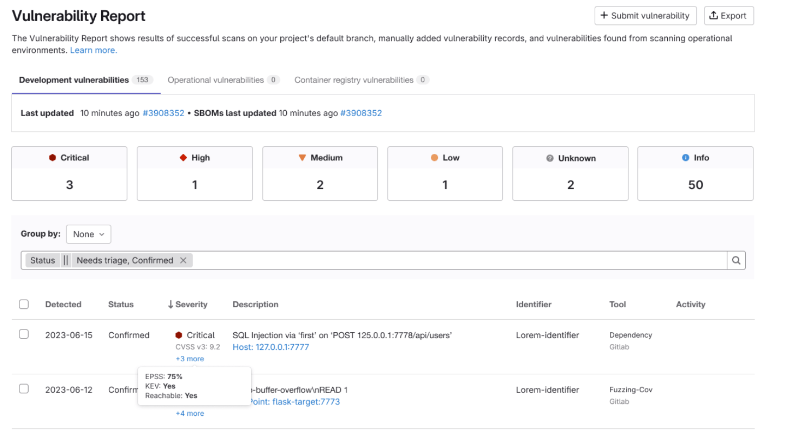
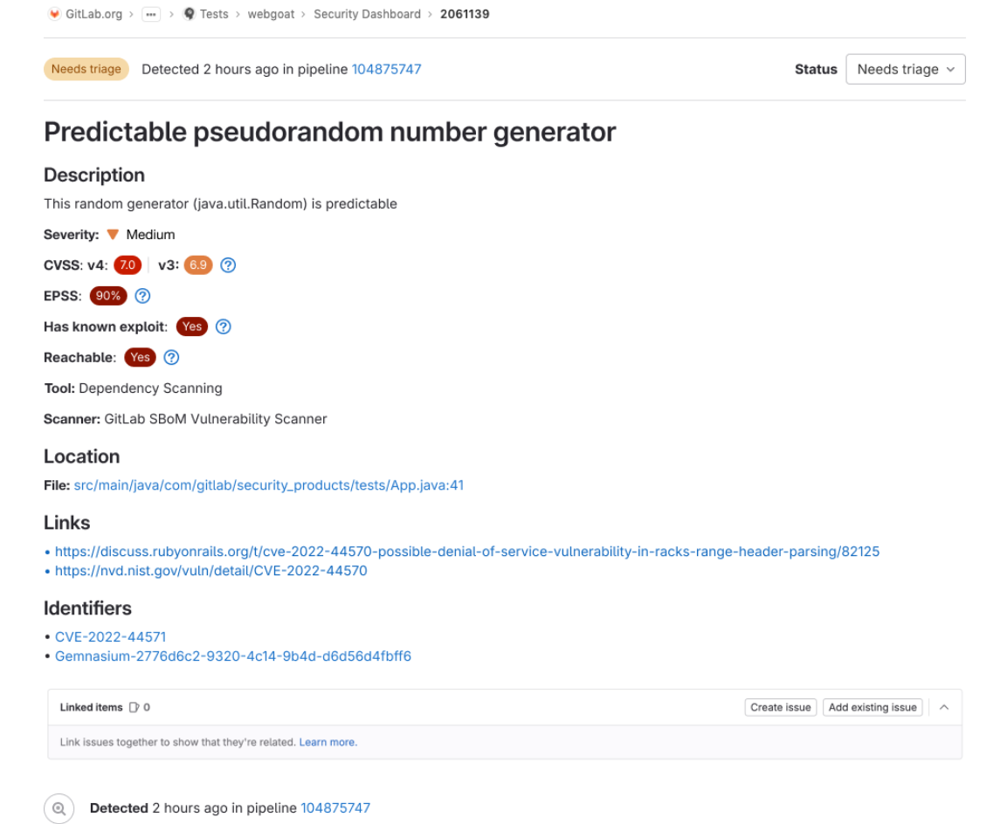



- Tier: Ultimate
- Offering: GitLab.com, GitLab Self-Managed, GitLab Dedicated
- Status: Beta





- [Introduced](https://gitlab.com/groups/gitlab-org/-/epics/14177) as an [experiment](../../../policy/development_stages_support.md) in GitLab 17.5.
- [Changed](https://gitlab.com/groups/gitlab-org/-/epics/15781) from experiment to beta in GitLab 17.11.



Static reachability analysis (SRA) helps you prioritize remediation of vulnerabilities in dependencies.

An application is generally deployed with many dependencies. Dependency scanning identifies which of
those dependencies have vulnerabilities. However, not all dependencies are used by an application.
Static reachability analysis identifies those dependencies that are used, in other words reachable,
and so are a higher security risk than others. Use this information to help prioritize remediation
of vulnerabilities according to risk.

To identify vulnerable dependencies that are reachable, either:

- Hover over the **Severity** value of a vulnerability in the vulnerability report.
- Check the `Reachable` value in the vulnerability page.
- Use a GraphQL query to list those vulnerabilities that are reachable.

## Supported languages and package managers

Static reachability analysis is available only for Python projects. SRA uses the new dependency
scanning analyzer to generate SBOMs and so supports the same package managers as the analyzer.

| Language | Supported Package Managers |
|----------|----------------------------|
| Python   | `pip`, `pipenv`, `poetry`, `uv` |

## Enable static reachability analysis

Enable static reachability analysis to identify high-risk dependencies.

Prerequisites:

- Enable [Dependency Scanning by using SBOM](dependency_scanning_sbom/_index.md#configuration).

  Make sure you follow the [pip](dependency_scanning_sbom/_index.md#pip) or [pipenv](dependency_scanning_sbom/_index.md#pipenv)
  related instructions for dependency scanning using SBOM. You can also use any other Python package manager that is [supported](https://gitlab.com/gitlab-org/security-products/analyzers/dependency-scanning#supported-files) by the DS analyzer.

To enable static reachability analysis:

- Edit the project `.gitlab-ci.yml` file and set `DS_STATIC_REACHABILITY_ENABLED` to `true`.

Enabling static reachability:

```yaml
stages:
  - build
  - test

include:
  - template: Jobs/Dependency-Scanning.latest.gitlab-ci.yml

variables:
  DS_STATIC_REACHABILITY_ENABLED: true
  DS_ENFORCE_NEW_ANALYZER: true

# Build job required by the DS analyzer to create pipdeptree.json
# https://docs.gitlab.com/user/application_security/dependency_scanning/dependency_scanning_sbom/#pip
build:
  stage: build
  image: "python:latest"
  script:
    - "pip install -r requirements.txt"
    - "pip install pipdeptree"
    - "pipdeptree --json > pipdeptree.json"
  artifacts:
    when: on_success
    access: developer
    paths: ["**/pipdeptree.json"]
```

The dependency scanning analyzer requires specific lock files to function properly. These files must
be generated during a build job on a stage prior to dependency scanning. By default, the dependency
scanning with reachability job is configured to depend on a job named `build`. If you need to use a
different name for your build job, you must override the dependency scanning `needs` section in your
configuration. Below is an example using `pip-compile` to generate a requirement lock file. This
file is passed to the new DS analyzer by using the `DS_PIPCOMPILE_REQUIREMENTS_FILE_NAME_PATTERN`
because the name is not standard.

```yaml
stages:
  - build
  - test

include:
  - template: Jobs/Dependency-Scanning.latest.gitlab-ci.yml

variables:
  DS_ENFORCE_NEW_ANALYZER: true
  DS_STATIC_REACHABILITY_ENABLED: true
  DS_PIPCOMPILE_REQUIREMENTS_FILE_NAME_PATTERN: "requirements-lock.txt"

create:
  stage: build
  image: "python:3.12"
  script:
    - pip install pip-tools
    - pip-compile requirements.txt -o requirements-lock.txt
  artifacts:
    when: on_success
    access: developer
    paths: ["**/requirements-lock.txt"]

dependency-scanning-with-reachability:
  needs:
    - job: gitlab-static-reachability
      optional: true
      artifacts: true
      # For supporting Scan Execution Policies.
    - job: gitlab-static-reachability-0
      optional: true
      artifacts: true
    - job: create # Instead of depending on build job it depends on `create` job
      optional: true
      artifacts: true
```

Static reachability introduces two key jobs:

- `gitlab-static-reachability`: Performs Static Reachability Analysis (SRA) on your Python files.
- `dependency-scanning-with-reachability`: Executes dependency scanning and generates an SBOM report enriched with reachability data. This job requires the artifact output from the `gitlab-static-reachability` job.



When you enable static reachability feature for non-Python projects, the
`gitlab-static-reachability` job will fail but won't break your pipeline, because it's configured to
allow failures. In such cases, the `dependency-scanning-with-reachability` job will perform standard
dependency scanning without adding reachability data to the SBOM.



Static reachability analysis functionality is supported in [Dependency Scanning analyzer](https://gitlab.com/gitlab-org/security-products/analyzers/dependency-scanning) version `0.23.0` and all subsequent versions.



Changes to the CI/CD configuration for static reachability integration are proposed for the GA release.



## How static reachability analysis works

Static reachability analysis requires two key components:

- Dependency scanning (DS): Generates an SBOM report that identifies all components and their transitive dependencies.
- GitLab Advanced SAST (GLAS): Performs static reachability analysis to provide a report showing direct dependencies usage in the codebase.

Static reachability analysis adds reachability data to the SBOM output by dependency scanning. The enriched SBOM is then ingested by the GitLab instance.

Reachability data in the UI can have one of the following values:

| Reachability values | Description                                                               |
|---------------------|---------------------------------------------------------------------------|
| Yes                 | The package linked to this vulnerability is confirmed reachable in code   |
| Not Found           | SRA ran successfully but did not detect usage of the vulnerable package   |
| Not Available       | SRA was not executed, therefore no reachability data exists               |

## Where to find the reachability data

The reachability data is available in the vulnerability report



and the vulnerability page



Finally reachability data can be reached using GraphQL.



When a vulnerability reachability value shows as "Not Found," exercise caution rather than completely dismissing it, because the beta version of SRA may produce false negatives.



## Restrictions

Static reachability analysis has the following limitations:

- Offline GitLab instances are not supported, though this is proposed for the GA release.
- When a direct dependency is marked as `in use`, all its transitive dependencies are also marked as `in use`.
- Requires the new [dependency scanning analyzer](https://gitlab.com/gitlab-org/security-products/analyzers/dependency-scanning). [Gemnasium](https://gitlab.com/gitlab-org/security-products/analyzers/gemnasium) analyzers are not supported.
- SRA on beta doesn't officially support pipeline execution policies.
- SRA on beta works with scan execution policies (SEP), but with the following restrictions:
  - only dependency scanning and/or static reachability jobs should be added through SEP. You should avoid having a policy while also including the latest dependency scanning template in your project configuration.
  - Users cannot override the build job name that `dependency-scanning-with-reachability` depends on. Consequently if a build job is required to create a lock file for the dependency scanning analyzer then the name must be named `build`.
