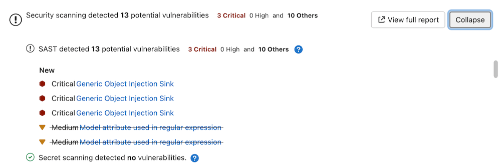

GitLab provides security scan results both for developers and those responsible for triaging,
analyzing, and remediating vulnerabilities.

During feature development, security scan results are shown in the pipeline and merge request. For
VS Code users, the
[GitLab Workflow extension for VS Code](../../../editor_extensions/visual_studio_code/_index.md) also
shows security scan results. Identifying risks during development means they can be
evaluated and remediated proactively.

Vulnerabilities in the default branch are available in the vulnerability report, enabling
efficient triaging, analysis, and remediation.

## Merge request

DETAILS:
**Tier:** Free, Premium, Ultimate
**Offering:** GitLab.com, GitLab Self-Managed, GitLab Dedicated

Output of all enabled application security tools is shown in a merge request widget. You can use
this information to manage the risk of any issues identified in the source branch.

### All tiers

Merge requests which have run security scans let you know that the generated
reports are available to download. To download a report, select
**Download results**, and select the desired report.

Security scans produce at least one of these [CI `artifacts:reports` types](../../../ci/yaml/artifacts_reports.md):

- `artifacts:reports:api_fuzzing`
- `artifacts:reports:container_scanning`
- `artifacts:reports:coverage_fuzzing`
- `artifacts:reports:dast`
- `artifacts:reports:dependency_scanning`
- `artifacts:reports:sast`
- `artifacts:reports:secret_detection`

In the Free tier, the reports above aren't parsed by GitLab. As a result, the widget does not change based on the results of the security scans.

### Ultimate

A merge request contains a security widget which displays a summary of the _new_ results. New results are determined by comparing the findings of the merge request against the findings of the most recent completed pipeline (`success`, `failed`, `canceled` or `skipped`) for the commit when the feature branch was created from the target branch.

GitLab checks the last 10 pipelines for the commit when the feature branch was created from the target branch to find one with security reports to use in comparison logic. If security scans have not run for the last 10 completed pipelines in the target branch when the feature branch was created, there is no base for comparison. The vulnerabilities from the merge request findings are listed as _new_ in the merge request security widget. We recommend you run a scan of the `default` (target) branch before enabling feature branch scans for your developers.

The MR security widget considers all supported pipeline sources (based on the [`CI_PIPELINE_SOURCE` variable](../../../ci/variables/predefined_variables.md)) when comparing results from both the source and target branches when determining if a merge request requires approval. Pipeline sources `webide` and `parent_pipeline` are not supported.

The merge request security widget displays only a subset of the vulnerabilities in the generated JSON artifact because it contains both new and existing findings.

From the merge request security widget, select **Expand** to unfold the widget, displaying any new and no longer detected (removed) findings by scan type.

For each security report type, the widget displays the first 25 added and 25 fixed findings, sorted by severity.
This is determined by comparing the security reports from the source branch and target branch pipelines.

As an example, consider two pipelines with these scan results:

- The source branch pipeline detects two vulnerabilities identified as `V1` and `V2`.
- The target branch pipeline detects two vulnerabilities identified as `V1` and `V3`.
- `V2` will show on the merge request widget as "added".
- `V3` will show on the merge request widget as "fixed".
- `V1` exists on both branches and is not shown on the merge request widget.

To see all findings on the source branch of the merge request, select **View full report** to go directly to the **Security** tab in the latest source branch pipeline.

