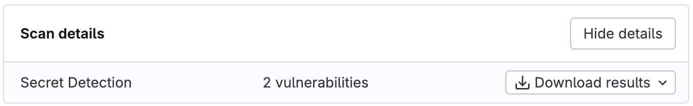
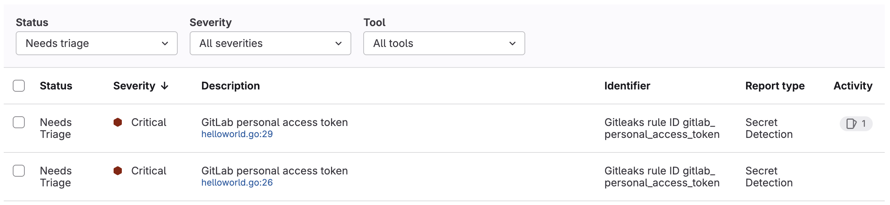
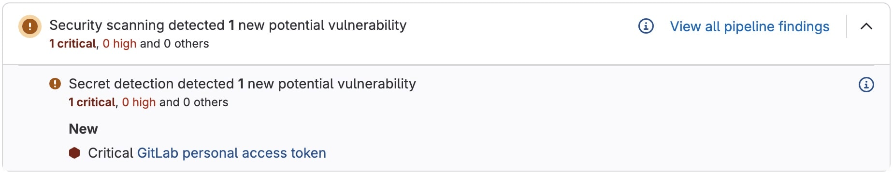



- Tier: Free, Premium, Ultimate
- Offering: GitLab.com, GitLab Self-Managed, GitLab Dedicated





- [Introduced](https://gitlab.com/gitlab-org/gitlab/-/issues/490334) in GitLab 17.9 [with a flag](../../../administration/feature_flags/_index.md) named `dependency_scanning_for_pipelines_with_cyclonedx_reports`. Disabled by default.
- [Enabled on GitLab.com and GitLab Self-Managed](https://gitlab.com/gitlab-org/gitlab/-/issues/490332) in GitLab 17.9.
- Feature flag `dependency_scanning_for_pipelines_with_cyclonedx_reports` removed in 17.10.



View and act on the results of pipeline security scanning in GitLab. Select security scanners run in
a pipeline and output security reports. The contents of these reports are processed and presented in
GitLab.

Key terminology for understanding security scan results:

Finding
: - A finding is a potential vulnerability identified in a development branch. A finding becomes a
    vulnerability when the branch is merged into the default branch.
: - Findings expire, either when the related CI/CD job artifact expires, or 90 days after the
    pipeline is created, even if the related job artifacts are locked.

Vulnerability
: - A vulnerability is a software security weakness identified in the default branch.
: - Vulnerability records persist until they are [archived](../vulnerability_archival/_index.md),
    even if the vulnerability is no longer detected in the default branch.

The presentation of security scanning results differs depending on the
[pipeline type](../../../ci/pipelines/pipeline_types.md) - branch pipeline or merge request
pipeline.

Vulnerabilities identified in the default branch are listed in the [vulnerability report](../vulnerability_report/_index.md).

| Vulnerability information                          | Branch<br />pipeline                                              | Merge request</br >pipeline |
|----------------------------------------------------|-------------------------------------------------------------------|-----------------------------|
| Security reports                                   |  Yes                       |  Yes |
| Pipeline security report<br />(Ultimate only)      |  Yes                       |  Yes |
| Merge request security widget<br />(Ultimate only) |  No                                |  Yes |
| Vulnerability report                               |  Yes - Default branch only |  No |

## Security report artifacts

Security scanners run in branch pipelines and, if enabled, merge request pipelines. Each security
scanner outputs a security report artifact containing details of all findings or vulnerabilities detected by
the specific security scanner. You can download these for analysis outside GitLab.

In a development (non-default) branch, findings include any vulnerabilities present in the target
branch when the development branch was created.

Expired findings are not shown in the pipeline's **Security** tab. To reproduce them, re-run the
pipeline.

### Download a security report



- Tier: Ultimate



You can download a security report, for example to analyze outside GitLab or for archival
purposes. A security report is a JSON file.

To download a security report:

1. On the left sidebar, select **Search or go to** and find your project. If you've [turned on the new navigation](../../interface_redesign.md#turn-new-navigation-on-or-off), this field is on the top bar.
1. Select **Build** > **Pipelines**.
1. Select the pipeline.
1. Select the **Security** tab.
1. Select **Download results**, then the desired security report.

The selected security report is downloaded to your device.



## Pipeline security report



- Tier: Ultimate



The pipeline security report contains details of all findings or vulnerabilities detected in the
branch. For a pipeline run against the default branch all vulnerabilities in the pipeline security
report are also in the vulnerability report.

For each finding or vulnerability you can:

- View further details by selecting its description.
- Change its status or severity.
- Create a GitLab issue to track any action taken to resolve or mitigate it.



### View pipeline security report

View the pipeline security report to see details of all findings or vulnerabilities detected in the
branch.

To view a pipeline security report:

1. On the left sidebar, select **Search or go to** and find your project. If you've [turned on the new navigation](../../interface_redesign.md#turn-new-navigation-on-or-off), this field is on the top bar.
1. Select **Build** > **Pipelines**.
1. Select the latest pipeline.

To see details of a finding or vulnerability, select its description.

### Change status or severity

You can change the status, severity, or both of a finding or vulnerability in the pipeline's
security tab. Any changes made to a finding persist when the branch is merged into the default
branch.

Prerequisites:

- You must have at least the Maintainer role for the project or the `admin_vulnerability` custom
  permission.

To change the status and severity of findings or vulnerabilities:

1. On the left sidebar, select **Search or go to** and find your project. If you've [turned on the new navigation](../../interface_redesign.md#turn-new-navigation-on-or-off), this field is on the top bar.
1. Select **Build** > **Pipelines**.
1. Select the latest pipeline.
1. Select the **Security** tab.
1. In the finding report:

     1. Select the findings or vulnerabilities you want to change.

        - To select individual findings or vulnerabilities, select the checkbox beside each.
        - To select all findings or vulnerabilities on the page, select the checkbox in the table
          header.

     1. In the **Select action** dropdown list, select either **Change status** or
        **Change severity**.

### Create an issue

Create an issue to track, document, and manage the remediation work for a finding or vulnerability.

1. On the left sidebar, select **Search or go to** and find your project. If you've [turned on the new navigation](../../interface_redesign.md#turn-new-navigation-on-or-off), this field is on the top bar.
1. Select **Build** > **Pipelines**.
1. Select the pipeline.
1. Select the **Security** tab.
1. Select a finding's description.
1. Select **Create issue**.

An issue is created in the project, with the description copied from the finding or vulnerability's
description.

## Merge request security widget



- Tier: Ultimate



The merge request displays a security widget that provides a summary of the difference the changes
would make to findings. It takes some time after the CI/CD pipeline has run to process the security
reports, so there may be a delay until the security widget is shown.

For example, consider two pipelines with these scan results:

- The source branch pipeline detects two vulnerabilities identified as `V1` and `V2`.
- The target branch pipeline detects two vulnerabilities identified as `V1` and `V3`.
- `V2` appears on the merge request widget as "added".
- `V3` appears on the merge request widget as "fixed".
- `V1` exists on both branches and is not shown on the merge request widget.

To show the differences between the source branch and the target branch, security reports from both
are required. The 10 most recent pipelines for the commit when the feature branch was created from
the target branch are checked for a security report. If one can't be found in the 10 most recent
pipelines then all findings are listed as new. Before enabling security scanning in merge requests
ensure that security scanning is enabled for the default branch.

### View security widget

View the merge request security widget to see the difference in findings the changes would make.

To view the security widget:

1. On the left sidebar, select **Search or go to** and find your project. If you've [turned on the new navigation](../../interface_redesign.md#turn-new-navigation-on-or-off), this field is on the top bar.
1. Select **Merge requests**.
1. Select a merge request.

To see the details for each security report type, select **Show details**
(). For each security report type, the widget displays the first 25
added and 25 fixed findings, sorted by severity. To see all findings on the source branch of the
merge request, select **View all pipeline findings**.



## Troubleshooting

When working with security scanning, you might encounter the following issues.

### Dismissed vulnerabilities are visible in MR security widget

When viewing the security widget in a merge request you might sometimes see dismissed
vulnerabilities are still listed.

No solution is yet available for this issue. For details, see
[issue 411235](https://gitlab.com/gitlab-org/gitlab/-/issues/411235).

### Report parsing and scan ingestion errors



These steps are to be used by GitLab Support to reproduce such errors.



Some security scans may result in errors in the **Security** tab of the pipeline related to report parsing or scan ingestion. If it is not possible to get a copy of the project from the user, you can reproduce the error using the report generated from the scan.

To recreate the error:

1. Obtain a copy of the report from the user. In this example, `gl-sast-report.json`.
1. Create a project.
1. Commit the report to the repository.
1. Add your `.gitlab-ci.yml` file and have the report as an artifact in a job.

   For example, to reproduce an error caused by a SAST job:

   ```yaml
   sample-job:
     script:
       - echo "Testing report"
     artifacts:
       reports:
         sast: gl-sast-report.json
   ```

1. After the pipeline completes, check the content of the pipeline's **Security** tab for errors.

You can replace `sast: gl-sast-report.json` with the respective [`artifacts:reports`](../../../ci/yaml/_index.md#artifactsreports) type and the correct JSON report filename depending on the scan that generated the report.
