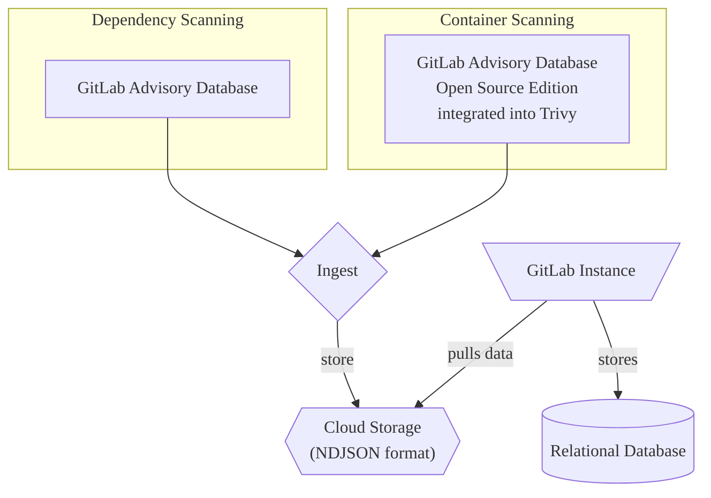

The [GitLab Advisory Database](https://gitlab.com/gitlab-org/security-products/gemnasium-db) serves as a repository for security advisories related to software dependencies. It is updated on an hourly basis with the latest security advisories.

The database is an essential component of both [Dependency Scanning](../dependency_scanning/_index.md) and [Container Scanning](../container_scanning/_index.md).

A free and open-source version of the GitLab Advisory Database is also available as [GitLab Advisory Database (Open Source Edition)](https://gitlab.com/gitlab-org/advisories-community). However, there is a 30-day delay in updates.

## Standardization

In our advisories, we adopt standardized practices to effectively communicate vulnerabilities and their impact.

- [CVE](../terminology/_index.md#cve)
- [CVSS](../terminology/_index.md#cvss)
- [CWE](../terminology/_index.md#cwe)

## Explore the database

To view the database content, go to the [GitLab Advisory Database](https://advisories.gitlab.com) home page. On the home page you can:

- Search the database, by identifier, package name, and description.
- View advisories that were added recently.
- View statistical information, including coverage and update frequency.

### Search

Each advisory has a page with the following details:

- **Identifiers**: Public identifiers. For example, CVE ID, GHSA ID, or the GitLab internal ID (`GMS-<year>-<nr>`).
- **Package Slug**: Package type and package name separated by a slash.
- **Vulnerability**: A short description of the security flaw.
- **Description**: A detailed description of the security flaw and potential risks.
- **Affected Versions**: The affected versions.
- **Solution**: How to remediate the vulnerability.
- **Last Modified**: The date when the advisory was last modified.

## Open Source Edition

GitLab provides a free and open-source version of the database, the [GitLab Advisory Database (Open Source Edition)](https://gitlab.com/gitlab-org/advisories-community).

The open-source version is a time-delayed clone of the GitLab Advisory Database, MIT-licensed and contains all advisories from the GitLab Advisory Database that are older than 30 days or with the `community-sync` flag.

## Integrations

- [Dependency Scanning](../dependency_scanning/_index.md)
- [Container Scanning](../container_scanning/_index.md)
- Third-party tools

NOTE:
GitLab Advisory Database Terms prohibit the use of data contained in the GitLab Advisory Database by third-party tools. Third-party integrators can use the MIT-licensed, time-delayed [repository clone](https://gitlab.com/gitlab-org/advisories-community) instead.

### How the database can be used

As an example, we highlight the use of the database as a source for an Advisory Ingestion process as part of Continuous Vulnerability Scans.

## Maintenance

The [Vulnerability Research](https://handbook.gitlab.com/handbook/engineering/development/sec/secure/vulnerability-research/) team is responsible for the maintenance and regular updates of the GitLab Advisory Database and the GitLab Advisory Database (Open Source Edition).

Community contributions are accessible in [advisories-community](https://gitlab.com/gitlab-org/advisories-community) via the `community-sync` flag.

## Contributing to the vulnerability database

If you know about a vulnerability that is not listed, you can contribute to the GitLab Advisory Database by either opening an issue or submit the vulnerability.

For more information, see [Contribution Guidelines](https://gitlab.com/gitlab-org/security-products/gemnasium-db/-/blob/master/CONTRIBUTING.md).

## License

The GitLab Advisory Database is freely accessible in accordance with the [GitLab Advisory Database Terms](https://gitlab.com/gitlab-org/security-products/gemnasium-db/-/blob/master/LICENSE.md#gitlab-advisory-database-term).
