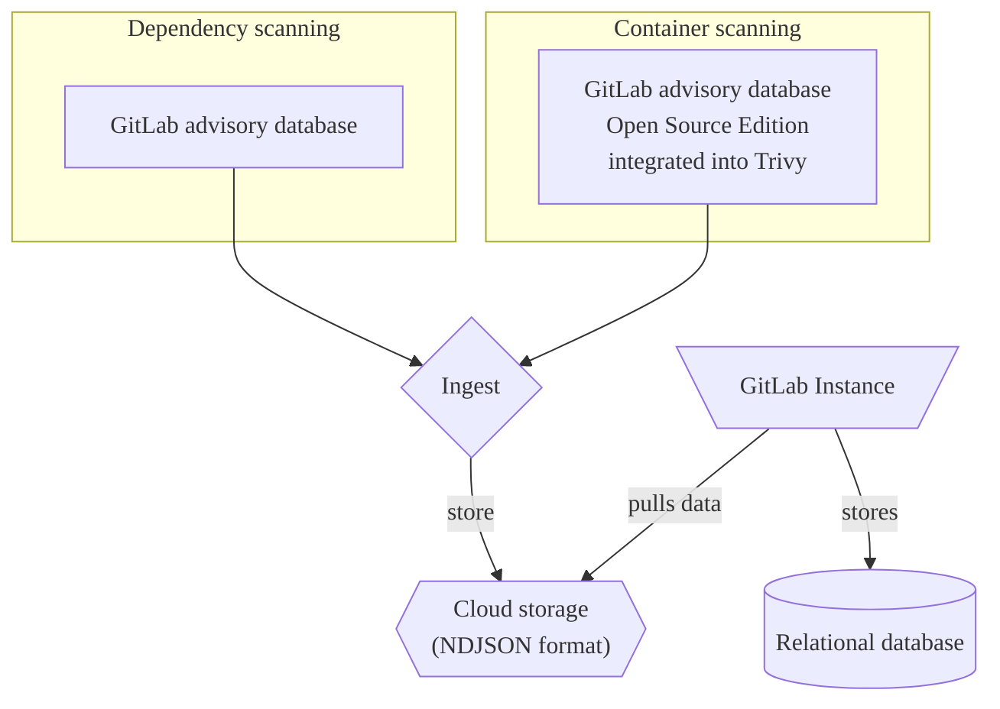

The [GitLab advisory database](https://gitlab.com/gitlab-org/security-products/gemnasium-db) serves as a repository for security advisories related to software dependencies. It is updated on an hourly basis with the latest security advisories.

The database is an essential component of both [dependency scanning](../dependency_scanning/_index.md) and [container scanning](../container_scanning/_index.md).

A free and open-source version of the GitLab advisory database is also available as [GitLab advisory database (open source edition)](https://gitlab.com/gitlab-org/advisories-community). The open source edition receives the same updates but with a 30-day delay.

## Standardization

In our advisories, we adopt standardized practices to effectively communicate vulnerabilities and their impact.

- [CVE](../terminology/_index.md#cve)
- [CVSS](../terminology/_index.md#cvss)
- [CWE](../terminology/_index.md#cwe)

## Explore the database

To view the database content, go to the [GitLab advisory database](https://advisories.gitlab.com) home page. On the home page you can:

- Search the database, by identifier, package name, and description.
- View advisories that were added recently.
- View statistical information, including coverage and update frequency.

### Search

Each advisory has a page with the following details:

- **Identifiers**: Public identifiers. For example, CVE ID, GHSA ID, or the GitLab internal ID (`GMS-<year>-<nr>`).
- **Package Slug**: Package type and package name separated by a slash.
- **Vulnerability**: A short description of the security flaw.
- **Description**: A detailed description of the security flaw and potential risks.
- **Affected Versions**: The affected versions.
- **Solution**: How to remediate the vulnerability.
- **Last Modified**: The date when the advisory was last modified.

## Open source edition

GitLab provides a free and open-source version of the database, the [GitLab advisory database (open source edition)](https://gitlab.com/gitlab-org/advisories-community).

The open-source version is a time-delayed clone of the GitLab advisory database, MIT-licensed and contains all advisories from the GitLab advisory database that are older than 30 days or with the `community-sync` flag.

## Integrations

- [Dependency scanning](../dependency_scanning/_index.md)
- [Container scanning](../container_scanning/_index.md)
- Third-party tools



GitLab advisory database terms prohibit the use of data contained in the GitLab advisory database by third-party tools. Third-party integrators can use the MIT-licensed, time-delayed [repository clone](https://gitlab.com/gitlab-org/advisories-community) instead.



### How the database can be used

As an example, we highlight the use of the database as a source for an advisory ingestion process as part of continuous vulnerability scans.

## Maintenance

The Vulnerability Research team is responsible for the maintenance and regular updates of the GitLab advisory database and the GitLab advisory database (open source edition).

Community contributions are accessible in [advisories-community](https://gitlab.com/gitlab-org/advisories-community) via the `community-sync` flag.

## Contributing to the vulnerability database

If you know about a vulnerability that is not listed, you can contribute to the GitLab advisory database by either opening an issue or submit the vulnerability.

For more information, see [Contribution guidelines](https://gitlab.com/gitlab-org/security-products/gemnasium-db/-/blob/master/CONTRIBUTING.md).

## License

The GitLab advisory database is freely accessible in accordance with the [GitLab advisory database terms](https://gitlab.com/gitlab-org/security-products/gemnasium-db/-/blob/master/LICENSE.md#gitlab-advisory-database-term).
