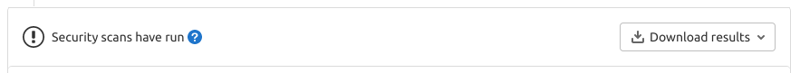
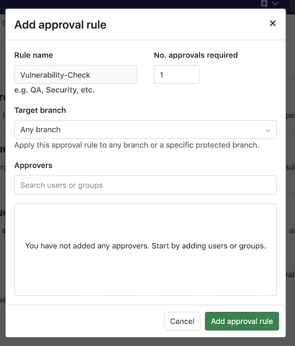
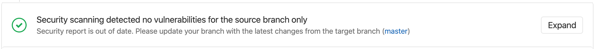
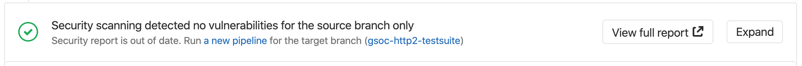

# Secure your application **(ULTIMATE)**

GitLab can check your application for security vulnerabilities including:

- Unauthorized access.
- Data leaks.
- Denial of service attacks.

Statistics and details on vulnerabilities are included in the merge request. Providing
actionable information _before_ changes are merged enables you to be proactive.

GitLab also provides high-level statistics of vulnerabilities across projects and groups:

- The [Security Dashboard](security_dashboard/index.md) provides a
  high-level view of vulnerabilities detected in your projects, pipeline, and groups.
- The [Threat Monitoring](threat_monitoring/index.md) page provides runtime security metrics
  for application environments. With the information provided,
  you can immediately begin risk analysis and remediation.

<i class="fa fa-youtube-play youtube" aria-hidden="true"></i>
For an overview of GitLab application security, see [Shifting Security Left](https://www.youtube.com/watch?v=XnYstHObqlA&t).

## Security scanning tools

GitLab uses the following tools to scan and report known vulnerabilities found in your project.

| Secure scanning tool                                                         | Description                                                            |
|:-----------------------------------------------------------------------------|:-----------------------------------------------------------------------|
| [Container Scanning](container_scanning/index.md) **(ULTIMATE)**                 | Scan Docker containers for known vulnerabilities.                      |
| [Dependency List](dependency_list/index.md) **(ULTIMATE)**                       | View your project's dependencies and their known vulnerabilities.      |
| [Dependency Scanning](dependency_scanning/index.md) **(ULTIMATE)**               | Analyze your dependencies for known vulnerabilities.                   |
| [Dynamic Application Security Testing (DAST)](dast/index.md) **(ULTIMATE)**      | Analyze running web applications for known vulnerabilities.            |
| [DAST API](dast_api/index.md) **(ULTIMATE)**                                     | Analyze running web APIs for known vulnerabilities.            |
| [API fuzzing](api_fuzzing/index.md) **(ULTIMATE)**                               | Find unknown bugs and vulnerabilities in web APIs with fuzzing.        |
| [Secret Detection](secret_detection/index.md)                                    | Analyze Git history for leaked secrets.                                |
| [Security Dashboard](security_dashboard/index.md) **(ULTIMATE)**                 | View vulnerabilities in all your projects and groups.                  |
| [Static Application Security Testing (SAST)](sast/index.md)                      | Analyze source code for known vulnerabilities.                         |
| [Coverage fuzzing](coverage_fuzzing/index.md) **(ULTIMATE)**                     | Find unknown bugs and vulnerabilities with coverage-guided fuzzing.    |
| [Cluster Image Scanning](cluster_image_scanning/index.md) **(ULTIMATE)**         | Scan Kubernetes clusters for known vulnerabilities.                      |

## Security scanning with Auto DevOps

To enable all GitLab Security scanning tools, with default settings, enable
[Auto DevOps](../../topics/autodevops/):

- [Auto SAST](../../topics/autodevops/stages.md#auto-sast)
- [Auto Secret Detection](../../topics/autodevops/stages.md#auto-secret-detection)
- [Auto DAST](../../topics/autodevops/stages.md#auto-dast)
- [Auto Dependency Scanning](../../topics/autodevops/stages.md#auto-dependency-scanning)
- [Auto License Compliance](../../topics/autodevops/stages.md#auto-license-compliance)
- [Auto Container Scanning](../../topics/autodevops/stages.md#auto-container-scanning)

While you cannot directly customize Auto DevOps, you can [include the Auto DevOps template in your project's `.gitlab-ci.yml` file](../../topics/autodevops/customize.md#customizing-gitlab-ciyml).

## Security scanning without Auto DevOps

To enable all GitLab security scanning tools, with the option of customizing settings, add the
GitLab CI/CD templates to your `.gitlab-ci.yml` file.

To enable Static Application Security Testing, Dependency Scanning, License Scanning, and Secret
Detection, add:

```yaml
include:
  - template: Security/Dependency-Scanning.gitlab-ci.yml
  - template: Security/License-Scanning.gitlab-ci.yml
  - template: Security/SAST.gitlab-ci.yml
  - template: Security/Secret-Detection.gitlab-ci.yml
```

To enable Dynamic Application Security Testing (DAST) scanning, add the following to your
`.gitlab-ci.yml`. Replace `https://staging.example.com` with a staging server's web address:

```yaml
include:
  - template: Security/DAST.gitlab-ci.yml

variables:
  DAST_WEBSITE: https://staging.example.com
```

For more details about each of the security scanning tools, see their respective
[documentation sections](#security-scanning-tools).

### Override the default registry base address

By default, GitLab security scanners use `registry.gitlab.com/gitlab-org/security-products/analyzers` as the
base address for Docker images. You can override this globally by setting the CI/CD variable
`SECURE_ANALYZERS_PREFIX` to another location. Note that this affects all scanners at once, except
the container-scanning analyzer which uses
`registry.gitlab.com/security-products/container-scanning` as its registry.

### Use security scanning tools with Pipelines for Merge Requests

By default, the application security jobs are configured to run for branch pipelines only.
To use them with [pipelines for merge requests](../../ci/pipelines/merge_request_pipelines.md),
you may need to override the default `rules:` configuration to add:

```yaml
rules:
  - if: $CI_PIPELINE_SOURCE == "merge_request_event"
```

## Default behavior of GitLab security scanning tools

### Secure jobs in your pipeline

If you add the security scanning jobs as described in [Security scanning with Auto DevOps](#security-scanning-with-auto-devops) or [Security scanning without Auto DevOps](#security-scanning-without-auto-devops) to your `.gitlab-ci.yml` each added [security scanning tool](#security-scanning-tools) behave as described below.

For each compatible analyzer, a job is created in the `test`, `dast` or `fuzz` stage of your pipeline and runs on the next new branch pipeline. Features such as the [Security Dashboard](security_dashboard/index.md), [Vulnerability Report](vulnerability_report/index.md), and [Dependency List](dependency_list/index.md) that rely on this scan data only show results from pipelines on the default branch. Please note that one tool may use many analyzers.

Our language and package manager specific jobs attempt to assess which analyzer(s) they should run for your project so that you can do less configuration.

If you want to override this to increase the pipeline speed you may choose which analyzers to exclude if you know they are not applicable (languages or package managers not contained in your project) by following variable customization directions for that specific tool.

### Secure job status

Jobs pass if they are able to complete a scan. A _pass_ result does NOT indicate if they did, or did not, identify findings. The only exception is coverage fuzzing, which fails if it identifies findings.

Jobs fail if they are unable to complete a scan. You can view the pipeline logs for more information.

All jobs are permitted to fail by default. This means that if they fail it do not fail the pipeline.

If you want to prevent vulnerabilities from being merged, you should do this by adding [Security Approvals in Merge Requests](#security-approvals-in-merge-requests) which prevents unknown, high or critical findings from being merged without an approval from a specific group of people that you choose.

We do not recommend changing the job [`allow_failure` setting](../../ci/yaml/index.md#allow_failure) as that fails the entire pipeline.

### JSON Artifact

The artifact generated by the secure analyzer contains all findings it discovers on the target branch, regardless of whether they were previously found, dismissed, or completely new (it puts in everything that it finds).

## View security scan information in merge requests **(FREE)**

> - [Introduced](https://gitlab.com/groups/gitlab-org/-/epics/4393) in GitLab Free 13.5.
> - Made [available in all tiers](https://gitlab.com/gitlab-org/gitlab/-/issues/273205) in 13.6.
> - Report download dropdown [added](https://gitlab.com/gitlab-org/gitlab/-/issues/273418) in 13.7.
> - [Feature flag removed](https://gitlab.com/gitlab-org/gitlab/-/issues/249550) in GitLab 13.9.

### All tiers

Merge requests which have run security scans let you know that the generated
reports are available to download. To download a report, click on the
**Download results** dropdown, and select the desired report.



### Ultimate

A merge request contains a security widget which displays a summary of the NEW results. New results are determined by comparing the current findings against existing findings in the target (default) branch (if there are prior findings).

We recommended you run a scan of the `default` branch before enabling feature branch scans for your developers. Otherwise, there is no base for comparison and all feature branches display the full scan results in the merge request security widget.

The merge request security widget displays only a subset of the vulnerabilities in the generated JSON artifact because it contains both NEW and EXISTING findings.

From the merge request security widget, select **Expand** to unfold the widget, displaying any new and no longer detected (removed) findings by scan type. Select **View Full Report** to go directly to the **Security** tab in the latest branch pipeline.

## View security scan information in the pipeline Security tab

A pipeline's security tab lists all findings in the current branch. It includes new findings introduced by this branch and existing vulnerabilities that were already present when the branch was created. These results likely do not match the findings displayed in the Merge Request security widget as those do not include the existing vulnerabilities (with the exception of showing any existing vulnerabilities that are no longer detected in the feature branch).

For more details, see [security tab](security_dashboard/index.md#pipeline-security).

## View security scan information in the Security Dashboard

The Security Dashboard show vulnerabilities present in a project's default branch. Data is updated every 24 hours. Vulnerability count updates resulting from any feature branches introducing new vulnerabilities that are merged to default are included after the daily data refresh.

For more details, see [Security Dashboard](security_dashboard/index.md).

## View security scan information in the Vulnerability Report

The vulnerability report shows the results of the last completed pipeline on the default branch. It is updated on every pipeline completion. All detected vulnerabilities are shown as well as any previous ones that are no longer detected in the latest scan. Vulnerabilities that are no longer detected may have been remediated or otherwise removed and can be marked as `Resolved` after proper verification. Vulnerabilities that are no longer detected are denoted with an icon for filtering and review.

By default, the vulnerability report does not show vulnerabilities of `dismissed` or `resolved` status so you can focus on open vulnerabilities. You can change the Status filter to see these.

[Read more about the Vulnerability report](vulnerability_report/index.md).

## Security approvals in merge requests

> [Introduced](https://gitlab.com/gitlab-org/gitlab/-/issues/9928) in [GitLab Ultimate](https://about.gitlab.com/pricing/) 12.2.

You can implement merge request approvals to require approval by selected users or a group when a
merge request would introduce one of the following security issues:

- A security vulnerability
- A software license compliance violation

When the Vulnerability-Check merge request rule is enabled, additional merge request approval
is required when the latest security report in a merge request:

- Contains a vulnerability of `high`, `critical`, or `unknown` severity that is not present in the
  target branch. Note that approval is still required for dismissed vulnerabilities.
- Is not generated during pipeline execution.

An approval is optional when the security report:

- Contains no new vulnerabilities when compared to the target branch.
- Contains only new vulnerabilities of `low` or `medium` severity.

When the License-Check merge request rule is enabled, additional approval is required if a merge
request contains a denied license. For more details, see [Enabling license approvals within a project](../compliance/license_compliance/index.md#enabling-license-approvals-within-a-project).

### Enable the Vulnerability-Check rule

Prerequisites:

- Maintainer or Owner [role](../permissions.md#project-members-permissions).

For this approval group, you must set the number of approvals required to greater than zero.

Follow these steps to enable `Vulnerability-Check`:

1. Go to your project and select **Settings > General**.
1. Expand **Merge request approvals**.
1. Select **Enable** or **Edit**.
1. Add or change the **Rule name** to `Vulnerability-Check` (case sensitive).
1. Set the **No. of approvals required** to greater than zero.
1. Select the **Target branch**.
1. Select the users or groups to provide approval.
1. Select **Add approval rule**.

Once this group is added to your project, the approval rule is enabled for all merge requests.
Any code changes cause the approvals required to reset.



## Using private Maven repositories

If you have a private Apache Maven repository that requires login credentials,
you can use the `MAVEN_CLI_OPTS` CI/CD variable
to pass a username and password. You can set it under your project's settings
so that your credentials aren't exposed in `.gitlab-ci.yml`.

If the username is `myuser` and the password is `verysecret` then you would
[set the following variable](../../ci/variables/index.md#custom-cicd-variables)
under your project's settings:

| Type     | Key              | Value |
| -------- | ---------------- | ----- |
| Variable | `MAVEN_CLI_OPTS` | `--settings mysettings.xml -Drepository.password=verysecret -Drepository.user=myuser` |

```xml
<!-- mysettings.xml -->
<settings>
    ...
    <servers>
        <server>
            <id>private_server</id>
            <username>${private.username}</username>
            <password>${private.password}</password>
        </server>
    </servers>
</settings>
```

## DAST On-Demand Scans

If you don’t want scans running in your normal DevOps process you can use on-demand scans instead. For more details, see [on-demand scans](dast/index.md#on-demand-scans). This feature is only available for DAST. If you run an on-demand scan against the default branch, it is reported as a "successful pipeline" and these results are included in the security dashboard and vulnerability report.

## Security report validation

> - [Introduced](https://gitlab.com/gitlab-org/gitlab/-/issues/321918) in GitLab 13.11.
> - Schema validation message [added](https://gitlab.com/gitlab-org/gitlab/-/issues/321730) in GitLab 14.0.

You can optionally enable validation of the security report artifacts based on the
[report schemas](https://gitlab.com/gitlab-org/security-products/security-report-schemas/-/tree/master/dist).
If you enable validation, GitLab validates the report artifacts before ingesting the vulnerabilities.
This prevents ingestion of broken vulnerability data into the database.

In GitLab 14.0 and later, the pipeline's **Security** tab lists any report artifacts
that failed validation. Security report validation must first be enabled.

### Enable security report validation

To enable report artifacts validation, set the `VALIDATE_SCHEMA` environment variable to `"true"` for the jobs in the `.gitlab-ci.yml` file.

For example, the configuration below enables validation for only the `sast` job:

  ```yaml
  include:
    - template: Security/Dependency-Scanning.gitlab-ci.yml
    - template: Security/License-Scanning.gitlab-ci.yml
    - template: Security/SAST.gitlab-ci.yml
    - template: Security/Secret-Detection.gitlab-ci.yml

  stages:
    - security-scan

  dependency_scanning:
    stage: security-scan

  license_scanning:
    stage: security-scan

  sast:
    stage: security-scan
    variables:
      VALIDATE_SCHEMA: "true"

  .secret-analyzer:
    stage: security-scan
  ```

## Interacting with findings and vulnerabilities

There are a variety of locations and ways to interact with the results of the security scanning tools:

- [Scan information in merge requests](#view-security-scan-information-in-merge-requests)
- [Project Security Dashboard](security_dashboard/#project-security-dashboard)
- [Security pipeline tab](security_dashboard/#pipeline-security)
- [Group Security Dashboard](security_dashboard/#group-security-dashboard)
- [Security Center](security_dashboard/#security-center)
- [Vulnerability Report](vulnerability_report/index.md)
- [Vulnerability Pages](vulnerabilities/index.md)
- [Dependency List](dependency_list/index.md)

For more details about which findings or vulnerabilities you can view in each of those locations, select the respective link. Each page details the ways in which you can interact with the findings and vulnerabilities. As an example, in most cases findings start out as _detected_ status. You have the option to:

- Change the status.
- Create an issue.
- Link it to an existing issue.
- [Resolve the vulnerability](vulnerabilities/index.md#resolve-a-vulnerability), if a solution is known.

## Troubleshooting

### Outdated security reports

When a security report generated for a merge request becomes outdated, the merge request shows a warning
message in the security widget and prompts you to take an appropriate action.

This can happen in two scenarios:

- Your [source branch is behind the target branch](#source-branch-is-behind-the-target-branch).
- The [target branch security report is out of date](#target-branch-security-report-is-out-of-date).

#### Source branch is behind the target branch

This means the most recent common ancestor commit between the target branch and the source branch is
not the most recent commit on the target branch. This is by far the most common situation.

In this case you must rebase or merge to incorporate the changes from the target branch.



#### Target branch security report is out of date

This can happen for many reasons, including failed jobs or new advisories. When the merge request shows that a
security report is out of date, you must run a new pipeline on the target branch.
You can do it quickly by following the hyperlink given to run a new pipeline.



### Getting error message `sast job: stage parameter should be [some stage name here]`

When [including](../../ci/yaml/index.md#includetemplate) a `.gitlab-ci.yml` template
like [`SAST.gitlab-ci.yml`](https://gitlab.com/gitlab-org/gitlab/-/blob/master/lib/gitlab/ci/templates/Security/SAST.gitlab-ci.yml),
the following error may occur, depending on your GitLab CI/CD configuration:

```plaintext
Found errors in your .gitlab-ci.yml:

* sast job: stage parameter should be unit-tests
```

This error appears when the included job's stage (named `test`) isn't declared in `.gitlab-ci.yml`.
To fix this issue, you can either:

- Add a `test` stage in your `.gitlab-ci.yml`.
- Override the default stage of each security job. For example, to use a pre-defined stage name `unit-tests`:

  ```yaml
  include:
    - template: Security/Dependency-Scanning.gitlab-ci.yml
    - template: Security/License-Scanning.gitlab-ci.yml
    - template: Security/SAST.gitlab-ci.yml
    - template: Security/Secret-Detection.gitlab-ci.yml

  stages:
    - unit-tests

  dependency_scanning:
    stage: unit-tests

  license_scanning:
    stage: unit-tests

  sast:
    stage: unit-tests

  .secret-analyzer:
    stage: unit-tests
  ```

[Learn more on overriding SAST jobs](sast/index.md#overriding-sast-jobs).
All the security scanning tools define their stage, so this error can occur with all of them.

### Getting warning messages `… report.json: no matching files`

This is often followed by the [error `No files to upload`](../../ci/pipelines/job_artifacts.md#error-message-no-files-to-upload),
and preceded by other errors or warnings that indicate why the JSON report wasn't generated. Please
check the entire job log for such messages. If you don't find these messages, retry the failed job
after setting `SECURE_LOG_LEVEL: "debug"` as a
[custom CI/CD variable](../../ci/variables/index.md#custom-cicd-variables).
This provides useful information to investigate further.

### Getting error message `sast job: config key may not be used with 'rules': only/except`

When [including](../../ci/yaml/index.md#includetemplate) a `.gitlab-ci.yml` template
like [`SAST.gitlab-ci.yml`](https://gitlab.com/gitlab-org/gitlab/-/blob/master/lib/gitlab/ci/templates/Security/SAST.gitlab-ci.yml),
the following error may occur, depending on your GitLab CI/CD configuration:

```plaintext
Found errors in your .gitlab-ci.yml:

    jobs:sast config key may not be used with `rules`: only/except
```

This error appears when the included job's `rules` configuration has been [overridden](sast/index.md#overriding-sast-jobs)
with [the deprecated `only` or `except` syntax.](../../ci/yaml/index.md#only--except)
To fix this issue, you must either:

- [Transition your `only/except` syntax to `rules`](#transitioning-your-onlyexcept-syntax-to-rules).
- (Temporarily) [Pin your templates to the deprecated versions](#pin-your-templates-to-the-deprecated-versions)

[Learn more on overriding SAST jobs](sast/index.md#overriding-sast-jobs).

#### Transitioning your `only/except` syntax to `rules`

When overriding the template to control job execution, previous instances of
[`only` or `except`](../../ci/yaml/index.md#only--except) are no longer compatible
and must be transitioned to [the `rules` syntax](../../ci/yaml/index.md#rules).

If your override is aimed at limiting jobs to only run on `master`, the previous syntax
would look similar to:

```yaml
include:
  - template: Security/SAST.gitlab-ci.yml

# Ensure that the scanning is only executed on master or merge requests
spotbugs-sast:
  only:
    refs:
      - master
      - merge_requests
```

To transition the above configuration to the new `rules` syntax, the override
would be written as follows:

```yaml
include:
  - template: Security/SAST.gitlab-ci.yml

# Ensure that the scanning is only executed on master or merge requests
spotbugs-sast:
  rules:
    - if: $CI_COMMIT_BRANCH == "master"
    - if: $CI_MERGE_REQUEST_ID
```

If your override is aimed at limiting jobs to only run on branches, not tags,
it would look similar to:

```yaml
include:
  - template: Security/SAST.gitlab-ci.yml

# Ensure that the scanning is not executed on tags
spotbugs-sast:
  except:
    - tags
```

To transition to the new `rules` syntax, the override would be rewritten as:

```yaml
include:
  - template: Security/SAST.gitlab-ci.yml

# Ensure that the scanning is not executed on tags
spotbugs-sast:
  rules:
    - if: $CI_COMMIT_TAG == null
```

[Learn more on the usage of `rules`](../../ci/yaml/index.md#rules).

#### Pin your templates to the deprecated versions

To ensure the latest support, we **strongly** recommend that you migrate to [`rules`](../../ci/yaml/index.md#rules).

If you're unable to immediately update your CI configuration, there are several workarounds that
involve pinning to the previous template versions, for example:

  ```yaml
  include:
    remote: 'https://gitlab.com/gitlab-org/gitlab/-/raw/12-10-stable-ee/lib/gitlab/ci/templates/Security/SAST.gitlab-ci.yml'
  ```

Additionally, we provide a dedicated project containing the versioned legacy templates.
This can be useful for offline setups or anyone wishing to use [Auto DevOps](../../topics/autodevops/index.md).

Instructions are available in the [legacy template project](https://gitlab.com/gitlab-org/auto-devops-v12-10).

#### Vulnerabilities are found, but the job succeeds. How can I have a pipeline fail instead?

This is the current default behavior, because the job's status indicates success or failure of the analyzer itself.
Analyzer results are displayed in the [job logs](../../ci/jobs/index.md#expand-and-collapse-job-log-sections),
[Merge Request widget](#view-security-scan-information-in-merge-requests)
or [Security Dashboard](security_dashboard/index.md).

### Error: job `is used for configuration only, and its script should not be executed`

[Changes made in GitLab 13.4](https://gitlab.com/gitlab-org/gitlab/-/merge_requests/41260)
to the `Security/Dependency-Scanning.gitlab-ci.yml` and `Security/SAST.gitlab-ci.yml`
templates mean that if you enable the `sast` or `dependency_scanning` jobs by setting the `rules` attribute,
they will fail with the error `(job) is used for configuration only, and its script should not be executed`.

The `sast` or `dependency_scanning` stanzas can be used to make changes to all SAST or Dependency Scanning,
such as changing `variables` or the `stage`, but they cannot be used to define shared `rules`.

There [is an issue open to improve extendability](https://gitlab.com/gitlab-org/gitlab/-/issues/218444).
Please upvote the issue to help with prioritization, and
[contributions are welcomed](https://about.gitlab.com/community/contribute/).
