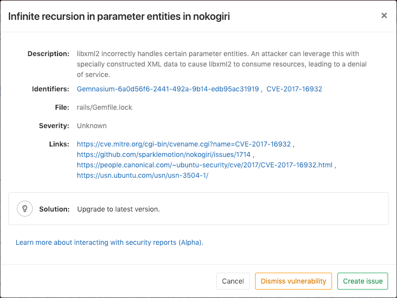
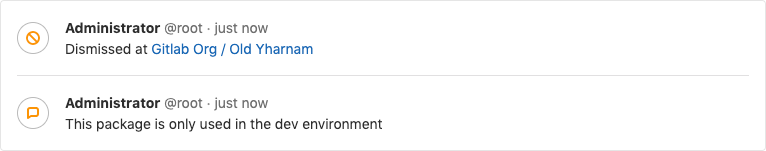
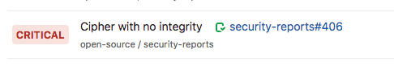
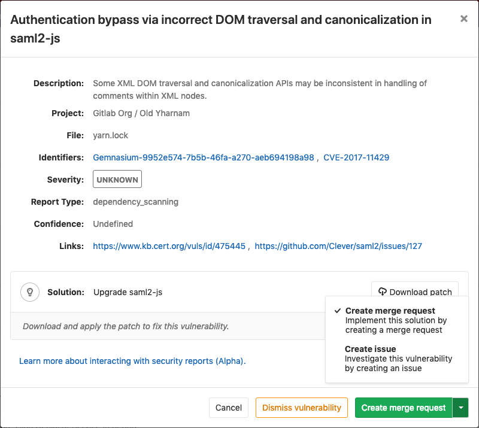

# GitLab Secure **(ULTIMATE)**

Check your application for security vulnerabilities that may lead to
unauthorized access, data leaks, and denial of services.

GitLab will perform static and dynamic tests on the code of your application,
looking for known flaws and report them in the merge request so you can fix
them before merging.

Security teams can use dashboards to get a high-level view on projects and
groups, and start remediation processes when needed.

<i class="fa fa-youtube-play youtube" aria-hidden="true"></i>
For an overview of application security with GitLab, see
[Security Deep Dive](https://www.youtube.com/watch?v=k4vEJnGYy84).

## Security scanning tools

GitLab can scan and report any vulnerabilities found in your project.

| Secure scanning tool                                                         | Description                                                            |
|:-----------------------------------------------------------------------------|:-----------------------------------------------------------------------|
| [Container Scanning](container_scanning/index.md) **(ULTIMATE)**             | Scan Docker containers for known vulnerabilities.                      |
| [Dependency Scanning](dependency_scanning/index.md) **(ULTIMATE)**           | Analyze your dependencies for known vulnerabilities.                   |
| [Dynamic Application Security Testing (DAST)](dast/index.md) **(ULTIMATE)**  | Analyze running web applications for known vulnerabilities.            |
| [License Management](license_management/index.md) **(ULTIMATE)**             | Search your project's dependencies for their licenses.                 |
| [Security Dashboard](security_dashboard/index.md) **(ULTIMATE)**             | View vulnerabilities in all your projects and groups.                  |
| [Static Application Security Testing (SAST)](sast/index.md) **(ULTIMATE)**   | Analyze source code for known vulnerabilities.                         |

## Maintenance and update of the vulnerabilities database

The various scanning tools and the vulnerabilities database are updated regularly.

| Secure scanning tool                                         | Vulnerabilities database updates          |
|:-------------------------------------------------------------|-------------------------------------------|
| [Container Scanning](container_scanning/index.md)            | Uses `clair` underneath and the latest `clair-db` version is used for each job run by running the [`latest` docker image tag](https://gitlab.com/gitlab-org/gitlab-ee/blob/438a0a56dc0882f22bdd82e700554525f552d91b/lib/gitlab/ci/templates/Security/Container-Scanning.gitlab-ci.yml#L37). The `clair-db` database [is updated daily according to the author](https://github.com/arminc/clair-local-scan#clair-server-or-local). |
| [Dependency Scanning](dependency_scanning/index.md)          | Relies on `bundler-audit` (for Rubygems), `retire.js` (for NPM packages) and `gemnasium` (GitLab's own tool for all libraries). `bundler-audit` and `retire.js` both fetch their vulnerabilities data from GitHub repositories, so vulnerabilities added to `ruby-advisory-db` and `retire.js` are immediately available. The tools themselves are updated once per month if there's a new version. The [Gemnasium DB](https://gitlab.com/gitlab-org/security-products/gemnasium-db) is updated at least once a week. |
| [Dynamic Application Security Testing (DAST)](dast/index.md) | Updated weekly on Sundays. The underlying tool, `zaproxy`, downloads fresh rules at startup. |
| [Static Application Security Testing (SAST)](sast/index.md)  | Relies exclusively on [the tools GitLab is wrapping](sast/index.md#supported-languages-and-frameworks). The underlying analyzers are updated at least once per month if a relevant update is available. The vulnerabilities database is updated by the upstream tools. |

You don't have to update GitLab to benefit from the latest vulnerabilities definitions,
but you may have to in the future.

The security tools are released as Docker images, and the vendored job definitions
to enable them are using the `x-y-stable` image tags that get overridden each time a new
release of the tools is pushed. The Docker images are updated to match the
previous GitLab releases, so they automatically get the latest versions of the
scanning tools without the user having to do anything.

This workflow comes with some drawbacks and there's a
[plan to change this](https://gitlab.com/gitlab-org/gitlab-ee/issues/9725).

## Interacting with the vulnerabilities

> Introduced in [GitLab Ultimate](https://about.gitlab.com/pricing) 10.8.

CAUTION: **Warning:**
This feature is currently [Alpha](https://about.gitlab.com/handbook/product/#alpha-beta-ga) and while you can start using it, it may receive important changes in the future.

Each security vulnerability in the merge request report or the
[Security Dashboard](security_dashboard/index.md) is actionable. Clicking on an
entry, a detailed information will pop up with different possible options:

- [Dismiss vulnerability](#dismissing-a-vulnerability): Dismissing a vulnerability
  will place a ~~strikethrough~~ styling on it.
- [Create issue](#creating-an-issue-for-a-vulnerability): The new issue will
  have the title and description pre-populated with the information from the
  vulnerability report and will be created as [confidential](../project/issues/confidential_issues.md) by default.
- [Solution](#solutions-for-vulnerabilities): For some vulnerabilities
  ([Dependency Scanning](dependency_scanning/index.md) and [Container Scanning](container_scanning/index.md))
  a solution is provided for how to fix the vulnerability.

### Dismissing a vulnerability

You can dismiss vulnerabilities by clicking the **Dismiss vulnerability** button.
This will dismiss the vulnerability and re-render it to reflect its dismissed state.
If you wish to undo this dismissal, you can click the **Undo dismiss** button.

#### Adding a dismissal reason

> Introduced in [GitLab Ultimate](https://about.gitlab.com/pricing) 12.0.

When dismissing a vulnerability, it's often helpful to provide a reason for doing so.
If you press the comment button next to **Dismiss vulnerability** in the modal, a text box will appear, allowing you to add a comment with your dismissal.
This comment can not currently be edited or removed, but [future versions](https://gitlab.com/gitlab-org/gitlab-ee/issues/11721) will add this functionality.

### Creating an issue for a vulnerability

You can create an issue for a vulnerability by selecting the **Create issue**
button from within the vulnerability modal or using the action buttons to the right of
a vulnerability row when in the group security dashboard.

This will create a [confidential issue](../project/issues/confidential_issues.md)
on the project this vulnerability came from and pre-fill it with some useful
information taken from the vulnerability report. Once the issue is created, you
will be redirected to it so you can edit, assign, or comment on it.

Upon returning to the group security dashboard, you'll see that
the vulnerability will now have an associated issue next to the name.

### Solutions for vulnerabilities

> Introduced in [GitLab Ultimate](https://about.gitlab.com/pricing) 11.7.

CAUTION: **Warning:**
Automatic Patch creation is only available for a subset of
[Dependency Scanning](dependency_scanning/index.md). At the moment only Node.JS
projects managed with yarn are supported.

Some vulnerabilities can be fixed by applying the solution that GitLab
automatically generates.

#### Manually applying the suggested patch

Some vulnerabilities can be fixed by applying a patch that is automatically
generated by GitLab. To apply the fix:

1. Click on the vulnerability.
1. Download and review the patch file `remediation.patch`.
1. Ensure your local project has the same commit checked out that was used to generate the patch.
1. Run `git apply remediation.patch`.
1. Verify and commit the changes to your branch.

#### Creating a merge request from a vulnerability

> [Introduced](https://gitlab.com/gitlab-org/gitlab-ee/issues/9224) in
> [GitLab Ultimate](https://about.gitlab.com/pricing) 11.9.

In certain cases, GitLab will allow you to create a merge request that will
automatically remediate the vulnerability. Any vulnerability that has a
[solution](#solutions-for-vulnerabilities) can have a merge request created to
automatically solve the issue.

If this action is available there will be a **Create merge request** button in the vulnerability modal.
Clicking on this button will create a merge request to apply the solution onto the source branch.

## Security approvals in merge requests **(ULTIMATE)**

> [Introduced](https://gitlab.com/gitlab-org/gitlab-ee/issues/9928) in [GitLab Ultimate](https://about.gitlab.com/pricing) 12.2.

Merge Request Approvals can be configured to require approval from a member 
of your security team when a vulnerability would be introduced by a merge request.

This threshold is defined as `high`, `critical`, or `unknown`
severity. When any vulnerabilities are present within a merge request, an
approval will be required from the `Vulnerability-Check` approver group.

### Enabling Security Approvals within a project

To enable Security Approvals, a [project approval rule](../project/merge_requests/merge_request_approvals.md#multiple-approval-rules-premium)
must be created with the case-sensitive name `Vulnerability-Check`. This approval
group must be set with an "Approvals required" count greater than zero.

Once this group has been added to your project, the approval rule will be enabled
for all Merge Requests.

Any code changes made will cause the count of approvals required to reset.

An approval will be required when a security report:

- Contains a new vulnerability of `high`, `critical`, or `unknown` severity.
- Is not generated during pipeline execution.

An approval will be optional when a security report:

- Contains no new vulnerabilities.
- Contains only new vulnerabilities of `low` or `medium` severity.

<!-- ## Troubleshooting

Include any troubleshooting steps that you can foresee. If you know beforehand what issues
one might have when setting this up, or when something is changed, or on upgrading, it's
important to describe those, too. Think of things that may go wrong and include them here.
This is important to minimize requests for support, and to avoid doc comments with
questions that you know someone might ask.

Each scenario can be a third-level heading, e.g. `### Getting error message X`.
If you have none to add when creating a doc, leave this section in place
but commented out to help encourage others to add to it in the future. -->
