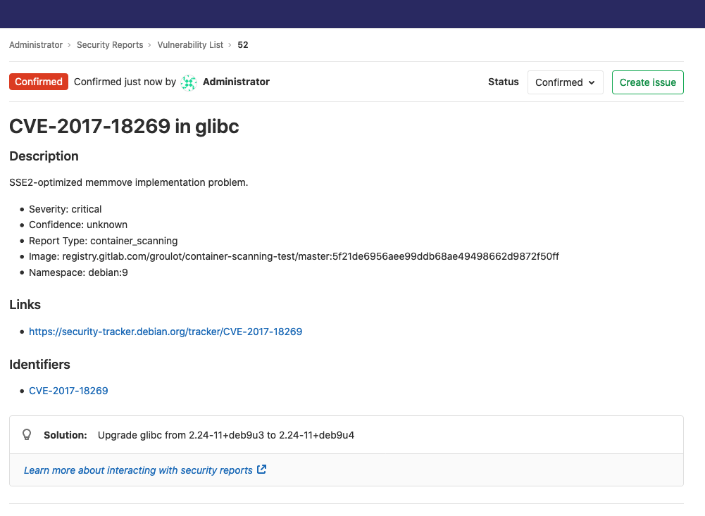
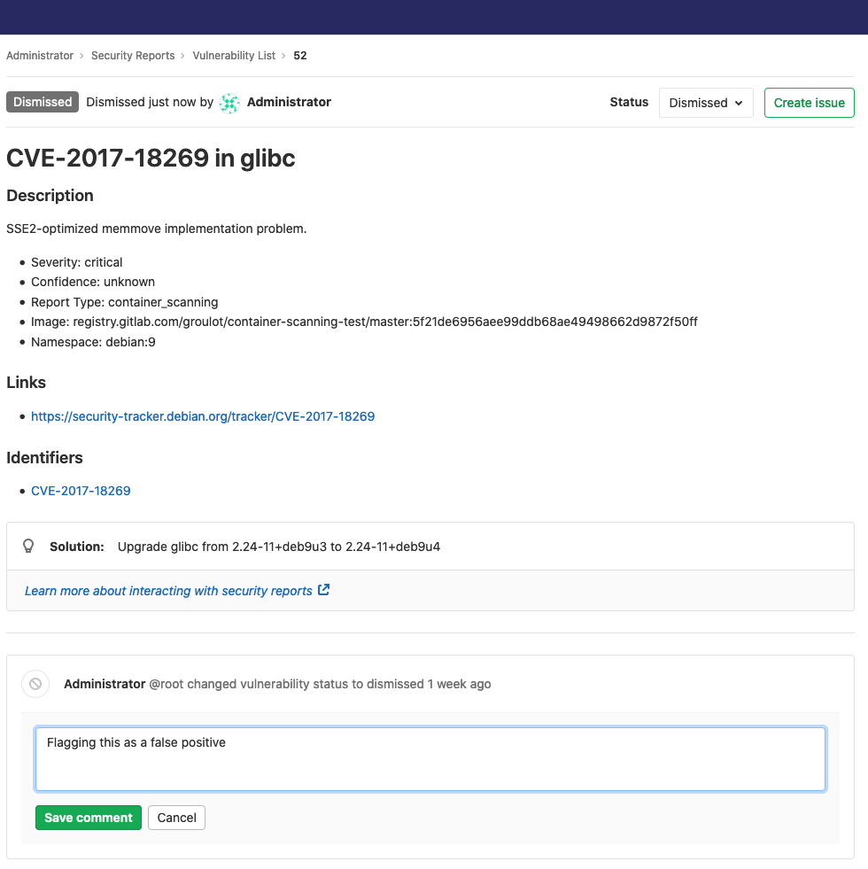
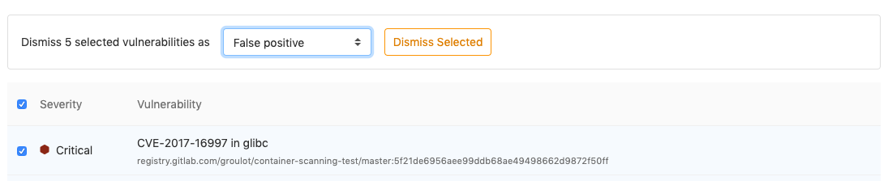
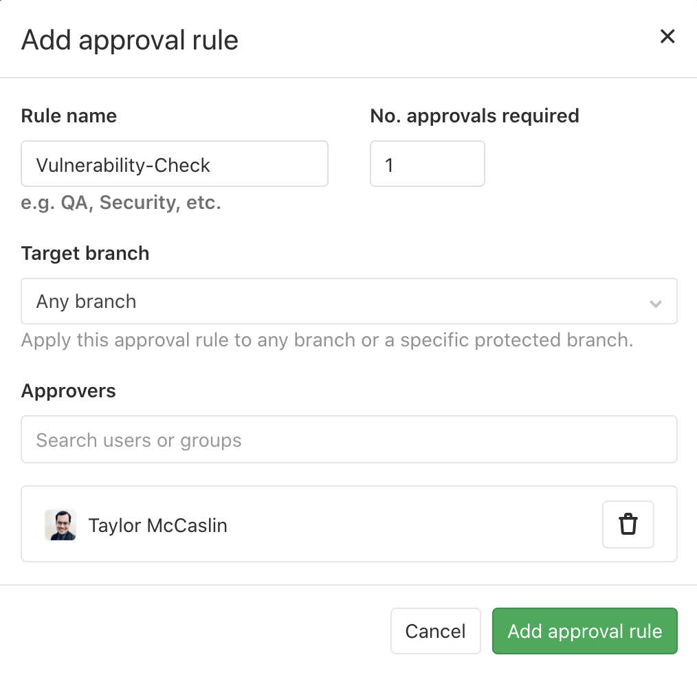

# GitLab Secure **(ULTIMATE)**

GitLab can check your application for security vulnerabilities that may lead to unauthorized access,
data leaks, denial of services, and more. GitLab reports vulnerabilities in the merge request so you
can fix them before merging. The [Security Dashboard](security_dashboard/index.md) provides a
high-level view of vulnerabilities detected in your projects, pipeline, and groups. The [Threat Monitoring](threat_monitoring/index.md)
page provides runtime security metrics for application environments. With the information provided,
you can immediately begin risk analysis and remediation.

<i class="fa fa-youtube-play youtube" aria-hidden="true"></i>
For an overview of application security with GitLab, see
[Security Deep Dive](https://www.youtube.com/watch?v=k4vEJnGYy84).

## Quick start

Get started quickly with Dependency Scanning, License Scanning, Static Application Security
Testing (SAST), and Secret Detection by adding the following to your `.gitlab-ci.yml`:

```yaml
include:
  - template: Dependency-Scanning.gitlab-ci.yml
  - template: License-Scanning.gitlab-ci.yml
  - template: SAST.gitlab-ci.yml
  - template: Secret-Detection.gitlab-ci.yml
```

To add Dynamic Application Security Testing (DAST) scanning, add the following to your
`.gitlab-ci.yml` and replace `https://staging.example.com` with a staging server's web address:

```yaml
include:
  - template: DAST.gitlab-ci.yml

variables:
  DAST_WEBSITE: https://staging.example.com
```

To ensure the DAST scanner runs *after* deploying the application to the staging server, review the [DAST full documentation](dast/index.md).

To add Container Scanning, follow the steps listed in the [Container Scanning documentation](container_scanning/index.md#requirements).

To further configure any of the other scanners, refer to each scanner's documentation.

### Override the default registry base address

By default, GitLab security scanners use `registry.gitlab.com/gitlab-org/security-products/analyzers` as the
base address for Docker images. You can override this globally by setting the variable
`SECURE_ANALYZERS_PREFIX` to another location. Note that this affects all scanners at once.

## Security scanning tools

GitLab uses the following tools to scan and report known vulnerabilities found in your project.

| Secure scanning tool                                                         | Description                                                            |
|:-----------------------------------------------------------------------------|:-----------------------------------------------------------------------|
| [Container Scanning](container_scanning/index.md) **(ULTIMATE)**             | Scan Docker containers for known vulnerabilities.                      |
| [Dependency List](dependency_list/index.md) **(ULTIMATE)**                   | View your project's dependencies and their known vulnerabilities.      |
| [Dependency Scanning](dependency_scanning/index.md) **(ULTIMATE)**           | Analyze your dependencies for known vulnerabilities.                   |
| [Dynamic Application Security Testing (DAST)](dast/index.md) **(ULTIMATE)**  | Analyze running web applications for known vulnerabilities.            |
| [Secret Detection](secret_detection/index.md) **(ULTIMATE)**                | Analyze Git history for leaked secrets.                                |
| [Security Dashboard](security_dashboard/index.md) **(ULTIMATE)**             | View vulnerabilities in all your projects and groups.                  |
| [Static Application Security Testing (SAST)](sast/index.md) **(ULTIMATE)**   | Analyze source code for known vulnerabilities.                         |

## Security Scanning with Auto DevOps

When [Auto DevOps](../../topics/autodevops/) is enabled, all GitLab Security scanning tools will be configured using default settings.

- [Auto SAST](../../topics/autodevops/stages.md#auto-sast-ultimate)
- [Auto Secret Detection](../../topics/autodevops/stages.md#auto-secret-detection-ultimate)
- [Auto DAST](../../topics/autodevops/stages.md#auto-dast-ultimate)
- [Auto Dependency Scanning](../../topics/autodevops/stages.md#auto-dependency-scanning-ultimate)
- [Auto License Compliance](../../topics/autodevops/stages.md#auto-license-compliance-ultimate)
- [Auto Container Scanning](../../topics/autodevops/stages.md#auto-container-scanning-ultimate)

While you cannot directly customize Auto DevOps, you can [include the Auto DevOps template in your project's `.gitlab-ci.yml` file](../../topics/autodevops/customize.md#customizing-gitlab-ciyml).

## Maintenance and update of the vulnerabilities database

The scanning tools and vulnerabilities database are updated regularly.

| Secure scanning tool                                         | Vulnerabilities database updates          |
|:-------------------------------------------------------------|-------------------------------------------|
| [Container Scanning](container_scanning/index.md)            | Uses `clair`. The latest `clair-db` version is used for each job by running the [`latest` Docker image tag](https://gitlab.com/gitlab-org/gitlab/blob/438a0a56dc0882f22bdd82e700554525f552d91b/lib/gitlab/ci/templates/Security/Container-Scanning.gitlab-ci.yml#L37). The `clair-db` database [is updated daily according to the author](https://github.com/arminc/clair-local-scan#clair-server-or-local). |
| [Dependency Scanning](dependency_scanning/index.md)          | Relies on `bundler-audit` (for Ruby gems), `retire.js` (for NPM packages), and `gemnasium` (GitLab's own tool for all libraries). Both `bundler-audit` and `retire.js` fetch their vulnerabilities data from GitHub repositories, so vulnerabilities added to `ruby-advisory-db` and `retire.js` are immediately available. The tools themselves are updated once per month if there's a new version. The [Gemnasium DB](https://gitlab.com/gitlab-org/security-products/gemnasium-db) is updated at least once a week. See our [current measurement of time from CVE being issued to our product being updated](https://about.gitlab.com/handbook/engineering/development/performance-indicators/#cve-issue-to-update). |
| [Dynamic Application Security Testing (DAST)](dast/index.md) | The scanning engine is updated on a periodic basis. See the [version of the underlying tool `zaproxy`](https://gitlab.com/gitlab-org/security-products/dast/blob/master/Dockerfile#L1). The scanning rules are downloaded at scan runtime. |
| [Static Application Security Testing (SAST)](sast/index.md)  | Relies exclusively on [the tools GitLab wraps](sast/index.md#supported-languages-and-frameworks). The underlying analyzers are updated at least once per month if a relevant update is available. The vulnerabilities database is updated by the upstream tools. |

Currently, you do not have to update GitLab to benefit from the latest vulnerabilities definitions.
The security tools are released as Docker images. The vendored job definitions that enable them use
major release tags according to [Semantic Versioning](https://semver.org/). Each new release of the
tools overrides these tags.
The Docker images are updated to match the previous GitLab releases, so users automatically get the
latest versions of the scanning tools without having to do anything. There are some known issues
with this approach, however, and there is a
[plan to resolve them](https://gitlab.com/gitlab-org/gitlab/-/issues/9725).

## Interacting with the vulnerabilities

> Introduced in [GitLab Ultimate](https://about.gitlab.com/pricing/) 10.8.

Each security vulnerability in the merge request report or the
[Security Dashboard](security_dashboard/index.md) is actionable. Click an entry to view detailed
information with several options:

- [Dismiss vulnerability](#dismissing-a-vulnerability): Dismissing a vulnerability styles it in
  strikethrough.
- [Create issue](#creating-an-issue-for-a-vulnerability): Create a new issue with the title and
  description pre-populated with information from the vulnerability report. By default, such issues
  are [confidential](../project/issues/confidential_issues.md).
- [Solution](#solutions-for-vulnerabilities-auto-remediation): For some vulnerabilities,
  a solution is provided for how to fix the vulnerability.



### Dismissing a vulnerability

To dismiss a vulnerability, you must set its status to Dismissed. Follow these steps to do so:

1. Select the vulnerability in the Security Dashboard.
1. Select **Dismissed** from the **Status** selector menu at the top-right.

You can undo this action by selecting a different status from the same menu.

#### Adding a dismissal reason

> Introduced in [GitLab Ultimate](https://about.gitlab.com/pricing/) 12.0.

When dismissing a vulnerability, it's often helpful to provide a reason for doing so. Upon setting a
vulnerability's status to Dismissed, a text box appears for you to add a comment with your
dismissal. Once added, you can edit or delete it. This allows you to add and update context for a
vulnerability as you learn more over time.



#### Dismissing multiple vulnerabilities

> Introduced in [GitLab Ultimate](https://about.gitlab.com/pricing/) 12.9.

You can dismiss multiple vulnerabilities at once, providing an optional reason.
Selecting the checkboxes on the side of each vulnerability in the list will select that individual vulnerability.
Alternatively, you can select all the vulnerabilities in the list by selecting the checkbox in the table header.
Deselecting the checkbox in the header will deselect all the vulnerabilities in the list.
Once you have selected some vulnerabilities, a menu appears at the top of the table that allows you to select a dismissal reason.
Pressing the "Dismiss Selected" button will dismiss all the selected vulnerabilities at once, with the reason you chose.



### Creating an issue for a vulnerability

You can create an issue for a vulnerability by selecting the **Create issue**
button from within the vulnerability modal, or by using the action buttons to the right of
a vulnerability row in the group security dashboard.

This creates a [confidential issue](../project/issues/confidential_issues.md) in the project the
vulnerability came from, and pre-populates it with some useful information taken from the vulnerability
report. Once the issue is created, you are redirected to it so you can edit, assign, or comment on
it.

Upon returning to the group security dashboard, the vulnerability now has an associated issue next
to the name.


### Solutions for vulnerabilities (auto-remediation)

> [Introduced](https://gitlab.com/gitlab-org/gitlab/-/issues/5656) in [GitLab Ultimate](https://about.gitlab.com/pricing/) 11.7.

Some vulnerabilities can be fixed by applying the solution that GitLab
automatically generates. The following scanners are supported:

- [Dependency Scanning](dependency_scanning/index.md):
  Automatic Patch creation is only available for Node.js projects managed with
  `yarn`.
- [Container Scanning](container_scanning/index.md)

#### Manually applying the suggested patch

Some vulnerabilities can be fixed by applying a patch that is automatically
generated by GitLab. To apply the fix:

1. Click the vulnerability.
1. Download and review the patch file `remediation.patch`.
1. Ensure your local project has the same commit checked out that was used to generate the patch.
1. Run `git apply remediation.patch`.
1. Verify and commit the changes to your branch.


#### Creating a merge request from a vulnerability

> [Introduced](https://gitlab.com/gitlab-org/gitlab/-/issues/9224) in [GitLab Ultimate](https://about.gitlab.com/pricing/) 11.9.

In certain cases, GitLab allows you to create a merge request that automatically remediates the
vulnerability. Any vulnerability that has a
[solution](#solutions-for-vulnerabilities-auto-remediation) can have a merge
request created to automatically solve the issue.

If this action is available, the vulnerability modal contains a **Create merge request** button.
Click this button to create a merge request to apply the solution onto the source branch.


## Security approvals in merge requests

> [Introduced](https://gitlab.com/gitlab-org/gitlab/-/issues/9928) in [GitLab Ultimate](https://about.gitlab.com/pricing/) 12.2.

Merge Request Approvals can be configured to require approval from a member of your
security team when a merge request would introduce one of the following security issues:

- A security vulnerability
- A software license compliance violation

The security vulnerability threshold is defined as `high`, `critical`, or `unknown` severity. The
`Vulnerability-Check` approver group must approve merge requests that contain vulnerabilities.

When GitLab can assess vulnerability severity, the rating can be one of the following:

- `unknown`
- `low`
- `medium`
- `high`
- `critical`

The rating `unknown` indicates that the underlying scanner doesn't contain or provide a severity
rating.

### Enabling Security Approvals within a project

To enable Security Approvals, a [project approval rule](../project/merge_requests/merge_request_approvals.md#adding--editing-a-default-approval-rule)
must be created with the case-sensitive name `Vulnerability-Check`. This approval group must be set
with the number of approvals required greater than zero. You must have Maintainer or Owner [permissions](../permissions.md#project-members-permissions) to manage approval rules.

1. Navigate to your project's **{settings}** **Settings > General** and expand **Merge request approvals**.
1. Click **Add approval rule**, or **Edit**.
   - Add or change the **Rule name** to `Vulnerability-Check` (case sensitive).



Once this group is added to your project, the approval rule is enabled for all merge requests.

Any code changes cause the approvals required to reset.

An approval is required when a security report:

- Contains a new vulnerability of `high`, `critical`, or `unknown` severity, regardless of dismissal.
- Is not generated during pipeline execution.

An approval is optional when a security report:

- Contains no new vulnerabilities.
- Contains only new vulnerabilities of `low` or `medium` severity.

## Enabling License Approvals within a project

> [Introduced](https://gitlab.com/gitlab-org/gitlab/-/issues/13067) in [GitLab Ultimate](https://about.gitlab.com/pricing/) 12.3.

To enable License Approvals, a [project approval rule](../project/merge_requests/merge_request_approvals.md#multiple-approval-rules-premium)
must be created with the case-sensitive name `License-Check`. This approval group must be set
with the number of approvals required greater than zero.

Once this group is added to your project, the approval rule is enabled for all Merge Requests. To
configure how this rule behaves, you can choose which licenses to `allow` or `deny` in the
[project policies for License Compliance](../compliance/license_compliance/index.md#project-policies-for-license-compliance)
section.

Any code changes cause the approvals required to reset.

An approval is required when a license report:

- Contains a dependency that includes a software license that is `denied`.
- Is not generated during pipeline execution.

An approval is optional when a license report:

- Contains no software license violations.
- Contains only new licenses that are `allowed` or unknown.

## Working in an offline environment

It is possible to run most of the GitLab security scanners when not
connected to the internet, in what is sometimes known as an offline,
limited connectivity, Local Area Network (LAN), Intranet, or "air-gap"
environment.

Read how to [operate the Secure scanners in an offline environment](offline_deployments/index.md).

## Using private Maven repos

If you have a private Apache Maven repository that requires login credentials,
you can use the `MAVEN_CLI_OPTS` environment variable
to pass a username and password. You can set it under your project's settings
so that your credentials aren't exposed in `.gitlab-ci.yml`.

If the username is `myuser` and the password is `verysecret` then you would
[set the following variable](../../ci/variables/README.md#create-a-custom-variable-in-the-ui)
under your project's settings:

| Type | Key | Value |
| ---- | --- | ----- |
| Variable | `MAVEN_CLI_OPTS` | `--settings mysettings.xml -Drepository.password=verysecret -Drepository.user=myuser` |

```xml
<!-- mysettings.xml -->
<settings>
    ...
    <servers>
        <server>
            <id>private_server</id>
            <username>${private.username}</username>
            <password>${private.password}</password>
        </server>
    </servers>
</settings>
```

## Outdated security reports

> [Introduced](https://gitlab.com/gitlab-org/gitlab/-/issues/4913) in GitLab 12.7.

When a security report generated for a merge request becomes outdated, the merge request shows a warning
message in the security widget and prompts you to take an appropriate action.

This can happen in two scenarios:

1. Your [source branch is behind the target branch](#source-branch-is-behind-the-target-branch).
1. The [target branch security report is out of date](#target-branch-security-report-is-out-of-date).

### Source branch is behind the target branch

This means the most recent common ancestor commit between the target branch and the source branch is
not the most recent commit on the target branch. This is by far the most common situation.

In this case you must rebase or merge to incorporate the changes from the target branch.


### Target branch security report is out of date

This can happen for many reasons, including failed jobs or new advisories. When the merge request shows that a
security report is out of date, you must run a new pipeline on the target branch.
You can do it quickly by following the hyperlink given to run a new pipeline.


## Troubleshooting

### Getting error message `sast job: stage parameter should be [some stage name here]`

When [including](../../ci/yaml/README.md#includetemplate) a `.gitlab-ci.yml` template
like [`SAST.gitlab-ci.yml`](https://gitlab.com/gitlab-org/gitlab/blob/master/lib/gitlab/ci/templates/Security/SAST.gitlab-ci.yml),
the following error may occur, depending on your GitLab CI/CD configuration:

```plaintext
Found errors in your .gitlab-ci.yml:

* sast job: stage parameter should be unit-tests
```

This error appears when the included job's stage (named `test`) isn't declared in `.gitlab-ci.yml`.
To fix this issue, you can either:

- Add a `test` stage in your `.gitlab-ci.yml`.
- Change the default stage of the included security jobs. For example, with SpotBugs (SAST):

  ```yaml
  include:
    template: SAST.gitlab-ci.yml

  spotbugs-sast:
    stage: unit-tests
  ```

[Learn more on overriding SAST jobs](sast/index.md#overriding-sast-jobs).
All the security scanning tools define their stage, so this error can occur with all of them.

### Getting error message `sast job: config key may not be used with 'rules': only/except`

When [including](../../ci/yaml/README.md#includetemplate) a `.gitlab-ci.yml` template
like [`SAST.gitlab-ci.yml`](https://gitlab.com/gitlab-org/gitlab/blob/master/lib/gitlab/ci/templates/Security/SAST.gitlab-ci.yml),
the following error may occur, depending on your GitLab CI/CD configuration:

```plaintext
Found errors in your .gitlab-ci.yml:

    jobs:sast config key may not be used with `rules`: only/except
```

This error appears when the included job's `rules` configuration has been [overridden](sast/index.md#overriding-sast-jobs)
with [the deprecated `only` or `except` syntax.](../../ci/yaml/README.md#onlyexcept-basic)
To fix this issue, you must either:

- [Transition your `only/except` syntax to `rules`](#transitioning-your-onlyexcept-syntax-to-rules).
- (Temporarily) [Pin your templates to the deprecated versions](#pin-your-templates-to-the-deprecated-versions)

[Learn more on overriding SAST jobs](sast/index.md#overriding-sast-jobs).

#### Transitioning your `only/except` syntax to `rules`

When overriding the template to control job execution, previous instances of
[`only` or `except`](../../ci/yaml/README.md#onlyexcept-basic) are no longer compatible
and must be transitioned to [the `rules` syntax](../../ci/yaml/README.md#rules).

If your override is aimed at limiting jobs to only run on `master`, the previous syntax
would look similar to:

```yaml
include:
  - template: SAST.gitlab-ci.yml

# Ensure that the scanning is only executed on master or merge requests
spotbugs-sast:
  only:
    refs:
      - master
      - merge_requests
```

To transition the above configuration to the new `rules` syntax, the override
would be written as follows:

```yaml
include:
  - template: SAST.gitlab-ci.yml

# Ensure that the scanning is only executed on master or merge requests
spotbugs-sast:
  rules:
    - if: $CI_COMMIT_BRANCH == "master"
    - if: $CI_MERGE_REQUEST_ID
```

If your override is aimed at limiting jobs to only run on branches, not tags,
it would look similar to:

```yaml
include:
  - template: SAST.gitlab-ci.yml

# Ensure that the scanning is not executed on tags
spotbugs-sast:
  except:
    - tags
```

To transition to the new `rules` syntax, the override would be rewritten as:

```yaml
include:
  - template: SAST.gitlab-ci.yml

# Ensure that the scanning is not executed on tags
spotbugs-sast:
  rules:
    - if: $CI_COMMIT_TAG == null
```

[Learn more on the usage of `rules`](../../ci/yaml/README.md#rules).

#### Pin your templates to the deprecated versions

To ensure the latest support, we **strongly** recommend that you migrate to [`rules`](../../ci/yaml/README.md#rules).

If you're unable to immediately update your CI configuration, there are several workarounds that
involve pinning to the previous template versions, for example:

  ```yaml
  include:
    remote: 'https://gitlab.com/gitlab-org/gitlab/-/raw/12-10-stable-ee/lib/gitlab/ci/templates/Security/SAST.gitlab-ci.yml'
  ```

Additionally, we provide a dedicated project containing the versioned legacy templates.
This can be useful for offline setups or anyone wishing to use [Auto DevOps](../../topics/autodevops/index.md).

Instructions are available in the [legacy template project](https://gitlab.com/gitlab-org/auto-devops-v12-10).
