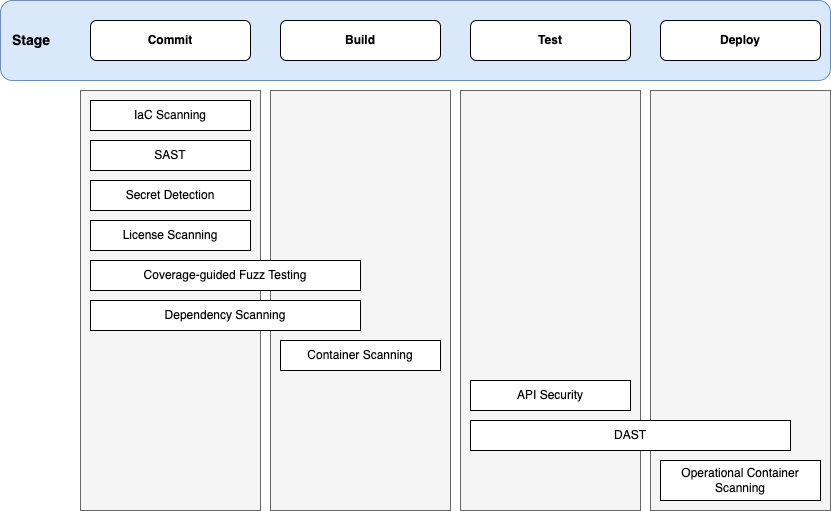
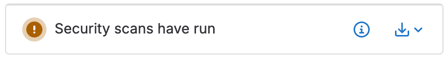
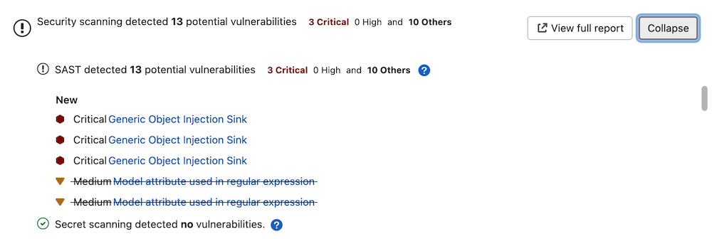

# Application security

DETAILS:
**Tier:** Ultimate
**Offering:** GitLab.com, Self-managed, GitLab Dedicated

GitLab can check your application for security vulnerabilities including:

- Unauthorized access.
- Data leaks.
- Denial of Service (DoS) attacks.

<i class="fa fa-youtube-play youtube" aria-hidden="true"></i>
For an overview of GitLab application security, see [Shifting Security Left](https://www.youtube.com/watch?v=XnYstHObqlA&t).

For a click-through demo, see [Integrating security to the pipeline](https://gitlab.navattic.com/gitlab-scans).
<!-- Demo published on 2024-01-15 -->

Statistics and details on vulnerabilities are included in the merge request. Providing
actionable information _before_ changes are merged enables you to be proactive.

To help with the task of managing and addressing vulnerabilities, GitLab provides a security
dashboard you can access from your project or group. For more details, see
[Security Dashboard](security_dashboard/index.md).

## Application coverage

GitLab analyzes various details of your application, either as part of your CI/CD pipeline or on a
schedule. Coverage includes:

- Source code.
- Dependencies in your projects or container images.
- Vulnerabilities in a running web application.
- Infrastructure as code configuration.

Each of the GitLab application security tools is relevant to specific stages of the feature development workflow.

- Commit
  - SAST
  - Secret Detection
  - IaC Scanning
  - Dependency Scanning
  - Coverage-guided Fuzz Testing
- Build
  - Container Scanning
- Test
  - API Security
  - DAST
- Deploy
  - Operational Container Scanning



### Source code analysis

Source code analysis occurs on every code commit. Details of vulnerabilities detected are provided
in the merge request.

A source code analysis can:

- Analyze source code for vulnerabilities - [Static Application Security Testing (SAST)](sast/index.md).
- Analyze the Git repository's history for secrets - [Secret Detection](secret_detection/index.md).

### Analysis of the running web application

Analysis of the web application occurs on every code commit. As part of the CI/CD pipeline, your
application is built, deployed to a test environment, and subjected to the following tests:

- Test application for known attack vectors - [Dynamic Application Security Testing (DAST)](dast/index.md).
- Analysis of APIs for known attack vectors - [API Security](dast_api/index.md).
- Analysis of web APIs for unknown bugs and vulnerabilities - [API fuzzing](api_fuzzing/index.md).

### Dependency analysis

Dependency analysis occurs on every code commit. Your application's dependencies are collated and
checked against a database of known vulnerabilities.

Dependency analysis can run:

- At build time - [Dependency Scanning](dependency_scanning/index.md).
- For projects that use container images, also after the final container
  image is built - [Container Scanning](container_scanning/index.md).

For more details, see
[Dependency Scanning compared to Container Scanning](comparison_dependency_and_container_scanning.md).

Additionally, dependencies in operational container images can be analyzed for vulnerabilities
on a regular schedule or cadence. For more details, see [Operational Container Scanning](../../user/clusters/agent/vulnerabilities.md).

### Infrastructure analysis

Your application's infrastructure is a source of potential vulnerabilities. To help defend
against this, infrastructure analysis occurs on every merge request. Checks are run against:

- Infrastructure as Code (IaC) configuration files that define your application's deployment
  environment - [Infrastructure as Code (IaC) Scanning](iac_scanning/index.md).

## Data privacy

Concerning data privacy in the domain of security scanners, GitLab processes the source code and performs analysis locally on the GitLab Runner. No data is transmitted outside GitLab infrastructure (server and runners).

Our scanners access the internet only to download the latest sets of signatures, rules, and patches. If you prefer the scanners do not access the internet, consider using an [offline environment](offline_deployments/index.md).

## Vulnerability scanner maintenance

The following vulnerability scanners and their databases are regularly updated:

| Secure scanning tool                                            | Vulnerabilities database updates |
|:----------------------------------------------------------------|:---------------------------------|
| [Container Scanning](container_scanning/index.md)            | A job runs on a daily basis to build new images with the latest vulnerability database updates from the upstream scanner. GitLab monitors this job through an internal alert that tells the engineering team when the database becomes more than 48 hours old. For more information, see the [Vulnerabilities database update](container_scanning/index.md#vulnerabilities-database). |
| [Dependency Scanning](dependency_scanning/index.md)          | Relies on the [GitLab Advisory Database](https://gitlab.com/gitlab-org/security-products/gemnasium-db). It is updated on a daily basis using [data from NVD, the `ruby-advisory-db` and the GitHub Advisory Database as data sources](https://gitlab.com/gitlab-org/security-products/gemnasium-db/-/blob/master/SOURCES.md). See our [current measurement of time from CVE being issued to our product being updated](https://handbook.gitlab.com/handbook/engineering/development/performance-indicators/#cve-issue-to-update). |
| [Dynamic Application Security Testing (DAST)](dast/index.md) | [DAST proxy-based](dast/proxy-based.md) and [browser-based](dast/browser_based.md) engines are updated on a periodic basis. [DAST proxy-based](dast/proxy-based.md) analyzer downloads the scanning rules at scan runtime. See the [version of the underlying tool `zaproxy`](https://gitlab.com/gitlab-org/security-products/dast/blob/main/Dockerfile#L27). [DAST browser-based](dast/browser_based.md) rules run [different vulnerability checks](dast/checks/index.md). |
| [Secret Detection](secret_detection/pipeline/index.md#detected-secrets) | GitLab maintains the [detection rules](secret_detection/pipeline/index.md#detected-secrets) and [accepts community contributions](secret_detection/pipeline/index.md#adding-new-patterns). The scanning engine is updated at least once per month if a relevant update is available. |
| [Static Application Security Testing (SAST)](sast/index.md)  | The source of scan rules depends on which [analyzer](sast/analyzers.md) is used for each [supported programming language](sast/index.md#supported-languages-and-frameworks). GitLab maintains a ruleset for the Semgrep-based analyzer and updates it regularly based on internal research and user feedback. For other analyzers, the ruleset is sourced from the upstream open-source scanner. Each analyzer is updated at least once per month if a relevant update is available. |

In versions of GitLab that use the same major version of the analyzer, you do not have to update
them to benefit from the latest vulnerabilities definitions. The security tools are released as
Docker images. The vendored job definitions that enable them use major release tags according to
[semantic versioning](https://semver.org/). Each new release of the tools overrides these tags.
Although in a major analyzer version you automatically get the latest versions of the scanning
tools, there are some [known issues](https://gitlab.com/gitlab-org/gitlab/-/issues/9725) with this
approach.

NOTE:
To get the most updated vulnerability information on existing vulnerabilities you may need to re-run the default branch's pipeline.

## Security scanning with Auto DevOps

To enable all GitLab Security scanning tools, with default settings, enable
[Auto DevOps](../../topics/autodevops/index.md):

- [Auto SAST](../../topics/autodevops/stages.md#auto-sast)
- [Auto Secret Detection](../../topics/autodevops/stages.md#auto-secret-detection)
- [Auto DAST](../../topics/autodevops/stages.md#auto-dast)
- [Auto Dependency Scanning](../../topics/autodevops/stages.md#auto-dependency-scanning)
- [Auto Container Scanning](../../topics/autodevops/stages.md#auto-container-scanning)

While you cannot directly customize Auto DevOps, you can [include the Auto DevOps template in your project's `.gitlab-ci.yml` file](../../topics/autodevops/customize.md#customize-gitlab-ciyml).

## Security scanning without Auto DevOps

To enable all GitLab security scanning tools with the option of customizing settings, add the
GitLab CI/CD templates to your `.gitlab-ci.yml` file.

WARNING:
All customization of GitLab security scanning tools should be tested in a merge request before
merging these changes to the default branch. Failure to do so can give unexpected results,
including a large number of false positives.

To enable Static Application Security Testing, Dependency Scanning, and Secret
Detection, add:

```yaml
include:
  - template: Jobs/Dependency-Scanning.gitlab-ci.yml
  - template: Jobs/SAST.gitlab-ci.yml
  - template: Jobs/Secret-Detection.gitlab-ci.yml
```

To enable Dynamic Application Security Testing (DAST) scanning, add the following to your
`.gitlab-ci.yml`. Replace `https://staging.example.com` with a staging server's web address:

```yaml
include:
  - template: Security/DAST.gitlab-ci.yml

variables:
  DAST_WEBSITE: https://staging.example.com
```

### Override the default registry base address

By default, GitLab security scanners use `registry.gitlab.com/security-products` as the
base address for Docker images. You can override this for most scanners by setting the CI/CD variable
`SECURE_ANALYZERS_PREFIX` to another location. This affects all scanners at once.

The [Container Scanning](container_scanning/index.md) analyzer is an exception, and it
does not use the `SECURE_ANALYZERS_PREFIX` variable. To override its Docker image, see
the instructions for
[Running container scanning in an offline environment](container_scanning/index.md#running-container-scanning-in-an-offline-environment).

### Use security scanning tools with merge request pipelines

By default, the application security jobs are configured to run for branch pipelines only.
To use them with [merge request pipelines](../../ci/pipelines/merge_request_pipelines.md),
you must reference the [`latest` templates](../../development/cicd/templates.md).

The latest version of the template may include breaking changes. Use the stable template unless you
need a feature provided only in the latest template.

All `latest` security templates support merge request pipelines.

For example, to run both SAST and Dependency Scanning, the following template is used:

```yaml
include:
  - template: Jobs/Dependency-Scanning.latest.gitlab-ci.yml
  - template: Jobs/SAST.latest.gitlab-ci.yml
```

NOTE:
Mixing `latest` and `stable` security templates can cause both MR and branch pipelines to run. We recommend choosing `latest` or `stable` for all security scanners.

NOTE:
Latest templates can receive breaking changes in any release.

For more information about template versioning, see the
[CI/CD documentation](../../development/cicd/templates.md#latest-version).

## Security scanning

For security scans that run in a CI/CD pipeline, the results are determined by:

- Which security scanning jobs run in the pipeline.
- Each job's status.
- Each job's output.

### Security jobs in your pipeline

The security scanning jobs that run in a CI/CD pipeline are determined by the following criteria:

1. Inclusion of security scanning templates

   The selection of security scanning jobs is first determined by which templates are included.
   Templates can be included by using AutoDevOps, a scan execution policy, or the
   `.gitlab-ci.yml` configuration file.

1. Evaluation of rules

   Each template has defined [rules](../../ci/yaml/index.md#rules) which determine if the analyzer
   is run.

   For example, the Secret Detection template includes the following rule. This rule states that
   secret detection should be run in branch pipelines. In the case of a merge request pipeline,
   secret detection is not run.

   ```yaml
   rules:
     - if: $CI_COMMIT_BRANCH
   ```

1. Analyzer logic

   If the template's rules dictate that the job is to be run, a job is created in the pipeline stage
   specified in the template. However, each analyzer has its own logic which determines if the
   analyzer itself is to be run.

   For example, if dependency scanning doesn't detect supported files at the default depth, the
   analyzer is not run and no artifacts are output.

After completing successfully, each job outputs artifacts. These artifacts are processed and the
results are available in GitLab. Results are shown only if all jobs are finished, including manual
ones. Additionally for some features, results are shown only if the pipeline runs on the default branch.

### Secure job status

Jobs pass if they are able to complete a scan. A _pass_ result does not indicate if they did, or did not, identify findings. The only exception is coverage fuzzing, which fails if it identifies findings.

Jobs fail if they are unable to complete a scan. You can view the pipeline logs for more information.

All jobs are permitted to fail by default. This means that if they fail, it does not fail the pipeline.

If you want to prevent vulnerabilities from being merged, you should do this by adding [Security Approvals in Merge Requests](#security-approvals-in-merge-requests) which prevents unknown, high or critical findings from being merged without an approval from a specific group of people that you choose.

We do not recommend changing the job [`allow_failure` setting](../../ci/yaml/index.md#allow_failure) as that fails the entire pipeline.

### JSON Artifact

The artifact generated by the secure analyzer contains all findings it discovers on the target branch, regardless of whether they were previously found, dismissed, or completely new (it puts in everything that it finds).

## View security scan information

Security scan information appears in multiple locations and formats:

- Merge request
- Pipeline security tab
- Security dashboard
- Vulnerability report
- GitLab Workflow extension for VS Code

### Merge request

DETAILS:
**Tier:** Free, Premium, Ultimate
**Offering:** GitLab.com, Self-managed, GitLab Dedicated

Output of all enabled application security tools is shown in a merge request widget. You can use
this information to manage the risk of any issues identified in the source branch.

#### All tiers

Merge requests which have run security scans let you know that the generated
reports are available to download. To download a report, select
**Download results**, and select the desired report.



Security scans produce at least one of these [CI `artifacts:reports` types](../../ci/yaml/artifacts_reports.md):

- `artifacts:reports:api_fuzzing`
- `artifacts:reports:container_scanning`
- `artifacts:reports:coverage_fuzzing`
- `artifacts:reports:dast`
- `artifacts:reports:dependency_scanning`
- `artifacts:reports:sast`
- `artifacts:reports:secret_detection`

In the Free tier, the reports above aren't parsed by GitLab. As a result, the widget does not change based on the results of the security scans.

#### Ultimate

A merge request contains a security widget which displays a summary of the _new_ results. New results are determined by comparing the findings of the merge request against the findings of the most recent completed pipeline (`success`, `failed`, `canceled` or `skipped`) for the commit when the feature branch was created from the target branch.

GitLab checks the last 10 pipelines for the commit when the feature branch was created from the target branch to find one with security reports to use in comparison logic. If security scans have not run for the last 10 completed pipelines in the target branch when the feature branch was created, there is no base for comparison. The vulnerabilities from the merge request findings are listed as _new_ in the merge request security widget. We recommend you run a scan of the `default` (target) branch before enabling feature branch scans for your developers.

The MR security widget considers all supported pipeline sources (based on the [`CI_PIPELINE_SOURCE` variable](../../ci/variables/predefined_variables.md)) when comparing results from both the source and target branches when determining if a merge request requires approval. Pipeline sources `webide` and `parent_pipeline` are not supported.

The merge request security widget displays only a subset of the vulnerabilities in the generated JSON artifact because it contains both new and existing findings.

From the merge request security widget, select **Expand** to unfold the widget, displaying any new and no longer detected (removed) findings by scan type.

For each security report type, the widget displays the first 25 added and 25 fixed findings, sorted by severity.
This is determined by comparing the security reports from the source branch and target branch pipelines.

As an example, consider two pipelines with these scan results:

- The source branch pipeline detects two vulnerabilities identified as `V1` and `V2`.
- The target branch pipeline detects two vulnerabilities identified as `V1` and `V3`.
- `V2` will show on the merge request widget as "added".
- `V3` will show on the merge request widget as "fixed".
- `V1` exists on both branches and is not shown on the merge request widget.

To see all findings on the source branch of the merge request, select **View full report** to go directly to the **Security** tab in the latest source branch pipeline.



### Pipeline security tab

A pipeline's security tab lists all findings from the security reports in the pipeline's
job artifacts. For more information see
[Vulnerabilities in a pipeline](vulnerability_report/pipeline.md).

### Security dashboard

The security dashboard shows the vulnerabilities on a project's default branch. Data is updated every 24 hours. Vulnerability count updates resulting from any feature branches introducing new vulnerabilities that are merged to default are included after the daily data refresh.

For more details, see [Security Dashboard](security_dashboard/index.md).

### Vulnerability report

The vulnerability report shows the results of the last completed pipeline on the default branch. It is updated on every pipeline completion. All detected vulnerabilities are shown and any previous ones that are no longer detected in the latest scan. Vulnerabilities that are no longer detected may have been remediated or otherwise removed and can be marked as `Resolved` after proper verification. Vulnerabilities that are no longer detected are denoted with an icon for filtering and review.

By default, the vulnerability report does not show vulnerabilities of `dismissed` or `resolved` status so you can focus on open vulnerabilities. You can change the Status filter to see these.

[Read more about the Vulnerability report](vulnerability_report/index.md).

### GitLab Workflow extension for VS Code

You can now see security findings directly in Visual Studio Code (VS Code) using [GitLab Workflow VS Code extension](../../editor_extensions/visual_studio_code/index.md), just as you would in a merge request.

For more details, see [extension page](https://marketplace.visualstudio.com/items?itemName=gitlab.gitlab-workflow#security-findings).

## Security approvals in merge requests

> - [Introduced](https://gitlab.com/gitlab-org/gitlab/-/issues/9928) in GitLab 12.2.
> - [Removed](https://gitlab.com/gitlab-org/gitlab/-/issues/357300) the Vulnerability-Check feature in GitLab 15.0.
> - [Removed](https://gitlab.com/gitlab-org/gitlab/-/issues/397067) the License-Check feature in GitLab 16.0.

You can enforce an additional approval for merge requests that would introduce one of the following
security issues:

- A security vulnerability. For more details, read [Merge request approval policies](policies/scan-result-policies.md).

## Using private Maven repositories

If you have a private Apache Maven repository that requires login credentials,
you can use the `MAVEN_CLI_OPTS` CI/CD variable
to pass a username and password. You can set it under your project's settings
so that your credentials aren't exposed in `.gitlab-ci.yml`.

If the username is `myuser` and the password is `verysecret` then you would
[set the following variable](../../ci/variables/index.md#for-a-project)
under your project's settings:

| Type     | Key              | Value |
| -------- | ---------------- | ----- |
| Variable | `MAVEN_CLI_OPTS` | `--settings mysettings.xml -Drepository.password=verysecret -Drepository.user=myuser` |

```xml
<!-- mysettings.xml -->
<settings>
    ...
    <servers>
        <server>
            <id>private_server</id>
            <username>${private.username}</username>
            <password>${private.password}</password>
        </server>
    </servers>
</settings>
```

## Using a custom scanning stage

When security scanning is enabled by including CI/CD templates as described in the
[Security scanning without Auto DevOps](#security-scanning-without-auto-devops) section, the scanning jobs
use the predefined `test` stage by default. If you specify a custom stage in your `.gitlab-ci.yml` file without
including a `test` stage, an error occurs.

For example, the following attempts to use a `unit-tests` stage:

```yaml
include:
  - template: Jobs/Dependency-Scanning.gitlab-ci.yml
  - template: Jobs/SAST.gitlab-ci.yml
  - template: Jobs/Secret-Detection.gitlab-ci.yml

stages:
  - unit-tests

custom job:
  stage: unit-tests
  script:
    - echo "custom job"
```

The above `.gitlab-ci.yml` causes a linting error:

```plaintext
Unable to create pipeline
- dependency_scanning job: chosen stage does not exist; available stages are .pre
- unit-tests
- .post
```

This error appears because the `test` stage used by the security scanning jobs isn't declared in the `.gitlab-ci.yml` file.
To fix this issue, you can either:

- Add a `test` stage in your `.gitlab-ci.yml`:

  ```yaml
  include:
    - template: Jobs/Dependency-Scanning.gitlab-ci.yml
    - template: Jobs/SAST.gitlab-ci.yml
    - template: Jobs/Secret-Detection.gitlab-ci.yml

  stages:
    - test
    - unit-tests

  custom job:
    stage: unit-tests
    script:
      - echo "custom job"
  ```

- Override the default stage of each security job. For example, to use a pre-defined stage named `unit-tests`:

  ```yaml
  include:
    - template: Jobs/Dependency-Scanning.gitlab-ci.yml
    - template: Jobs/SAST.gitlab-ci.yml
    - template: Jobs/Secret-Detection.gitlab-ci.yml

  stages:
    - unit-tests

  dependency_scanning:
    stage: unit-tests

  sast:
    stage: unit-tests

  .secret-analyzer:
    stage: unit-tests

  custom job:
    stage: unit-tests
    script:
      - echo "custom job"
  ```

For more information about overriding security jobs, see:

- [Overriding SAST jobs](sast/index.md#overriding-sast-jobs).
- [Overriding Dependency Scanning jobs](dependency_scanning/index.md#overriding-dependency-scanning-jobs).
- [Overriding Container Scanning jobs](container_scanning/index.md#overriding-the-container-scanning-template).
- [Overriding Secret Detection jobs](secret_detection/pipeline/index.md#configuration).
- [Overriding DAST jobs](dast/proxy-based.md#customize-dast-settings).

All the security scanning tools define their stage, so this error can occur with all of them.

## Self managed installation options

For self managed installations, you can choose to run most of the GitLab security scanners even when [not connected to the internet](offline_deployments/index.md).

Self managed installations can also run the security scanners on a GitLab Runner [running inside OpenShift](../../install/openshift_and_gitlab/index.md).

## Security report validation

> - [Introduced](https://gitlab.com/gitlab-org/gitlab/-/issues/321918) in GitLab 13.11.
> - Schema validation message [added](https://gitlab.com/gitlab-org/gitlab/-/issues/321730) in GitLab 14.0.

GitLab 15.0 enforces validation of the security report artifacts before ingesting the vulnerabilities.
This prevents ingestion of broken vulnerability data into the database. GitLab validates the
artifacts against the [report schemas](https://gitlab.com/gitlab-org/security-products/security-report-schemas/-/tree/master/dist),
according to the schema version declared in the report.

The pipeline's **Security** tab lists any report artifacts that failed validation, and the
validation error message.

Validation depends on the schema version declared in the security report artifact:

- If your security report specifies a supported schema version, GitLab uses this version to validate.
- If your security report uses a deprecated version, GitLab attempts validation against that version and adds a deprecation warning to the validation result.
- If your security report uses a supported MAJOR-MINOR version of the report schema but the PATCH version doesn't match any vendored versions, GitLab attempts to validate it against latest vendored PATCH version of the schema.
  - Example: security report uses version 14.1.1 but the latest vendored version is 14.1.0. GitLab would validate against schema version 14.1.0.
- If your security report uses a version that is not supported, GitLab attempts to validate it against the latest schema version available in your installation but doesn't ingest the report.
- If your security report does not specify a schema version, GitLab attempts to validate it against the latest schema version available in GitLab. Because the `version` property is required, validation always fails in this case, but other validation errors may also be present.

You can always find supported and deprecated schema versions in the [source code](https://gitlab.com/gitlab-org/gitlab/blob/master/lib/gitlab/ci/parsers/security/validators/schema_validator.rb).

## Interact with findings and vulnerabilities

You can interact with the results of the security scanning tools in several locations:

- [Scan information in merge requests](#merge-request)
- [Project Security Dashboard](security_dashboard/index.md#project-security-dashboard)
- [Security pipeline tab](security_dashboard/index.md)
- [Group Security Dashboard](security_dashboard/index.md#group-security-dashboard)
- [Security Center](security_dashboard/index.md#security-center)
- [Vulnerability Report](vulnerability_report/index.md)
- [Vulnerability Pages](vulnerabilities/index.md)
- [Dependency List](dependency_list/index.md)

For more details about which findings or vulnerabilities you can view in each of those locations,
select the respective link. Each page details the ways in which you can interact with the findings
and vulnerabilities. As an example, in most cases findings start out as a _detected_ status.

You have the option to:

- Change the status.
- Create an issue.
- Link it to an existing issue.
- [Resolve the vulnerability](vulnerabilities/index.md#resolve-a-vulnerability), if a solution is known.

## Security scanning configuration tips

Each GitLab security scanning tool has a default
[CI/CD configuration file](https://gitlab.com/gitlab-org/gitlab/-/tree/master/lib/gitlab/ci/templates/Security),
also known as a _template_.

When customizing the configuration:

- [Include](../../ci/yaml/index.md#include) the scanning tool's CI/CD template. Don't _copy_ the content
  of the template.
- Use the [stable](../../development/cicd/templates.md#stable-version) version of each template
  for production workflows. The stable version changes less often, and breaking changes are only
  made between major GitLab versions. The [latest](../../development/cicd/templates.md#latest-version)
  version contains the most recent changes, but may have significant changes between minor GitLab versions.
- Only override values in the template as needed. All other values are inherited from the template.

### Enforce scan execution

Security and compliance teams must ensure that security scans:

- Run on a regular basis for all projects.
- Can't be disabled by developers.

GitLab provides two methods of accomplishing this, each with advantages and disadvantages.

- [Compliance framework pipelines](../group/compliance_pipelines.md)
  are recommended when:

  - Scan execution enforcement is required for any scanner that uses a GitLab template, such as SAST IaC, DAST, Dependency Scanning,
    API Fuzzing, or Coverage-guided Fuzzing.
  - Scan execution enforcement is required for scanners external to GitLab.
  - Scan execution enforcement is required for custom jobs other than security scans.

- [Scan execution policies](policies/scan-execution-policies.md)
  are recommended when:

  - Scan execution enforcement is required for DAST which uses a DAST site or scan profile.
  - Scan execution enforcement is required for SAST, SAST IaC, Secret Detection, Dependency Scanning, or Container Scanning with project-specific
    variable customizations. To accomplish this, users must create a separate security policy per project.
  - Scans are required to run on a regular, scheduled cadence.

- Either solution can be used equally well when:

  - Scan execution enforcement is required for Container Scanning with no project-specific variable
    customizations.

Additional details about the differences between the two solutions are outlined below:

| | Compliance Framework Pipelines | Scan Execution Policies |
| ------ | ------ | ------ |
| **Flexibility** | Supports anything that can be done in a CI file. | Limited to only the items for which GitLab has explicitly added support. DAST, SAST, SAST IaC, Secret Detection, Dependency Scanning, and Container Scanning scans are supported. |
| **Usability** | Requires knowledge of CI YAML. | Follows a `rules` and `actions`-based YAML structure. |
| **Inclusion in CI pipeline** | The compliance pipeline is executed instead of the project's `.gitlab-ci.yml` file. To include the project's `.gitlab-ci.yml` file, use an `include` statement. Defined variables aren't allowed to be overwritten by the included project's YAML file. | Forced inclusion of a new job into the CI pipeline. DAST jobs that must be customized on a per-project basis can have project-level Site Profiles and Scan Profiles defined. To ensure separation of duties, these profiles are immutable when referenced in a scan execution policy. All jobs can be customized as part of the security policy itself with the same variables that are usually available to the CI job. |
| **Schedulable** | Has to be scheduled through a scheduled pipeline on each project. | Can be scheduled natively through the policy configuration itself. |
| **Separation of Duties** | Only group owners can create compliance framework labels. Only project owners can apply compliance framework labels to projects. The ability to make or approve changes to the compliance pipeline definition is limited to individuals who are explicitly given access to the project that contains the compliance pipeline. | Only project owners can define a linked security policy project. The ability to make or approve changes to security policies is limited to individuals who are explicitly given access to the security policy project. |
| **Ability to apply one standard to multiple projects** | The same compliance framework label can be applied to multiple projects inside a group. | The same security policy project can be used for multiple projects across GitLab with no requirement of being located in the same group. |

Feedback is welcome on our vision for [unifying the user experience for these two features](https://gitlab.com/groups/gitlab-org/-/epics/7312)
