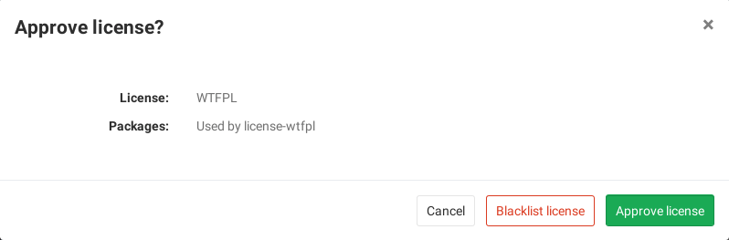
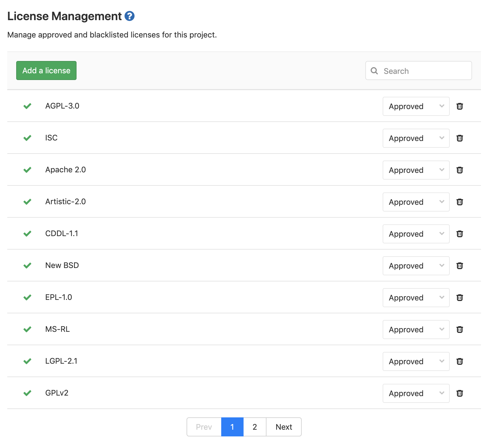

# License Management **[ULTIMATE]**

> [Introduced](https://gitlab.com/gitlab-org/gitlab-ee/issues/5483)
in [GitLab Ultimate](https://about.gitlab.com/pricing/) 11.0.

## Overview

If you are using [GitLab CI/CD](../../../ci/README.md), you can search your project dependencies for their licenses
using License Management.

You can take advantage of License Management by either [including the job](#configuring-license-management)
in your existing `.gitlab-ci.yml` file or by implicitly using
[Auto License Management](../../../topics/autodevops/index.md#auto-license-management-ultimate)
that is provided by [Auto DevOps](../../../topics/autodevops/index.md).

GitLab checks the License Management report, compares the licenses between the
source and target branches, and shows the information right on the merge request.
Blacklisted licenses will be clearly visible with an `x` red icon next to them
as well as new licenses which need a decision from you. In addition, you can
[manually approve or blacklist](#project-policies-for-license-management)
licenses in your project's settings.

NOTE: **Note:**
If the license management report doesn't have anything to compare to, no information
will be displayed in the merge request area. That is the case when you add the
`license_management` job in your `.gitlab-ci.yml` for the first time.
Consecutive merge requests will have something to compare to and the license
management report will be shown properly.


If you are a project or group Maintainer, you can click on a license to be given
the choice to approve it or blacklist it.



## Use cases

It helps you find what licenses your project uses in its dependencies, and decide for each of then
whether to allow it or forbid it. For example, your application is using an external (open source)
library whose license is incompatible with yours.

## Supported languages and package managers

The following languages and package managers are supported.

| Language   | Package managers                                                  |
|------------|-------------------------------------------------------------------|
| JavaScript | [Bower](https://bower.io/), [npm](https://www.npmjs.com/)         |
| Go         | [Godep](https://github.com/tools/godep), go get                   |
| Java       | [Gradle](https://gradle.org/), [Maven](https://maven.apache.org/) |
| .NET       | [Nuget](https://www.nuget.org/)                                   |
| Python     | [pip](https://pip.pypa.io/en/stable/)                             |
| Ruby       | [gem](https://rubygems.org/)                                      |

## Requirements

To run a License Management scanning job, you need GitLab Runner with the
[`docker` executor](https://docs.gitlab.com/runner/executors/docker.html).

## Configuring License Management

To enable License Management in your project, define a job in your `.gitlab-ci.yml`
file that generates the [License Management report artifact](../../../ci/yaml/README.md#artifactsreportslicense_management-ultimate).

This can be done in two ways:

- For GitLab 11.9 and later, including the provided `License-Management.gitlab-ci.yml` template (recommended).
- Manually specifying the job definition. Not recommended unless using GitLab
  11.8 and earlier.

The License Management settings can be changed through environment variables by using the
[`variables`](../../../ci/yaml/README.md#variables) parameter in `.gitlab-ci.yml`. These variables are documented in the [License Management documentation](https://gitlab.com/gitlab-org/security-products/license-management#settings).

### Including the provided template

NOTE: **Note:**
The CI/CD License Management template is supported on GitLab 11.9 and later versions.
For earlier versions, use the [manual job definition](#manual-job-definition-for-gitlab-115-and-later).

A CI/CD [License Management template](https://gitlab.com/gitlab-org/gitlab-ee/blob/master/lib/gitlab/ci/templates/Security/License-Management.gitlab-ci.yml)
with the default License Management job definition is provided as a part of your GitLab
installation which you can [include](../../../ci/yaml/README.md#includetemplate)
in your `.gitlab-ci.yml` file.

To enable License Management using the provided template, add the following to
your `.gitlab-ci.yml` file:

```yaml
include:
  template: License-Management.gitlab-ci.yml
```

The included template will create a `license_management` job in your CI/CD pipeline
and scan your dependencies to find their licenses.

The report will be saved as a
[License Management report artifact](../../../ci/yaml/README.md#artifactsreportslicense_management-ultimate)
that you can later download and analyze. Due to implementation limitations, we
always take the latest License Management artifact available. Behind the scenes, the
[GitLab License Management Docker image](https://gitlab.com/gitlab-org/security-products/license-management)
is used to detect the languages/frameworks and in turn analyzes the licenses.

#### Installing custom dependencies

> Introduced in [GitLab Ultimate](https://about.gitlab.com/pricing/) 11.4.

The `license_management` image already embeds many auto-detection scripts, languages,
and packages. Nevertheless, it's almost impossible to cover all cases for all projects.
That's why sometimes it's necessary to install extra packages, or to have extra steps
in the project automated setup, like the download and installation of a certificate.
For that, a `LICENSE_MANAGEMENT_SETUP_CMD` environment variable can be passed to the container,
with the required commands to run before the license detection.

If present, this variable will override the setup step necessary to install all the packages
of your application (e.g.: for a project with a `Gemfile`, the setup step could be
`bundle install`).

For example:

```yaml
include:
  template: License-Management.gitlab-ci.yml

variables:
  LICENSE_MANAGEMENT_SETUP_CMD: sh my-custom-install-script.sh
```

In this example, `my-custom-install-script.sh` is a shell script at the root
directory of your project.

#### Overriding the template

If you want to override the job definition (for example, change properties like
`variables` or `dependencies`), you need to declare a `license_management` job
after the template inclusion and specify any additional keys under it. For example:

```yaml
include:
  template: License-Management.gitlab-ci.yml

license_management:
  variables:
    CI_DEBUG_TRACE: "true"
```

#### Configuring Maven projects

The License Management tool provides a `MAVEN_CLI_OPTS` environment variable which can hold
the command line arguments to pass to the `mvn install` command which is executed under the hood.
Feel free to use it for the customization of Maven execution. For example:

```yaml
include:
  template: License-Management.gitlab-ci.yml

license_management:
  variables:
    MAVEN_CLI_OPTS: --debug
```

`mvn install` runs through all of the [build life cycle](http://maven.apache.org/guides/introduction/introduction-to-the-lifecycle.html)
stages prior to `install`, including `test`. Running unit tests is not directly
necessary for the license scanning purposes and consumes time, so it's skipped
by having the default value of `MAVEN_CLI_OPTS` as `-DskipTests`. If you want
to supply custom `MAVEN_CLI_OPTS` and skip tests at the same time, don't forget
to explicitly add `-DskipTests` to your options.
If you still need to run tests during `mvn install`, add `-DskipTests=false` to
`MAVEN_CLI_OPTS`.

### Manual job definition for GitLab 11.5 and later

For GitLab 11.5 and GitLab Runner 11.5 and later, the following `license_management`
job can be added:

```yaml
license_management:
  image:
    name: "registry.gitlab.com/gitlab-org/security-products/license-management:$CI_SERVER_VERSION_MAJOR-$CI_SERVER_VERSION_MINOR-stable"
    entrypoint: [""]
  stage: test
  allow_failure: true
  script:
    - /run.sh analyze .
  artifacts:
    reports:
      license_management: gl-license-management-report.json
```

If you want to install custom project dependencies via the `SETUP_CMD` variable:

```yaml
license_management:
  image:
    name: "registry.gitlab.com/gitlab-org/security-products/license-management:$CI_SERVER_VERSION_MAJOR-$CI_SERVER_VERSION_MINOR-stable"
    entrypoint: [""]
  stage: test
  variables:
    SETUP_CMD: ./my-custom-install-script.sh
  allow_failure: true
  script:
    - /run.sh analyze .
  artifacts:
    reports:
      license_management: gl-license-management-report.json
```

### Manual job definition for GitLab 11.4 and earlier (deprecated)

CAUTION: **Caution:**
Before GitLab 11.5, the License Management job and artifact had to be named specifically
to automatically extract the report data and show it in the merge request widget.
While these old job definitions are still maintained, they have been deprecated
and may be removed in the next major release, GitLab 12.0. You are strongly advised
to update your current `.gitlab-ci.yml` configuration to reflect that change.

For GitLab 11.4 and earlier, the job should look like:

```yaml
license_management:
  image:
    name: "registry.gitlab.com/gitlab-org/security-products/license-management:$CI_SERVER_VERSION_MAJOR-$CI_SERVER_VERSION_MINOR-stable"
    entrypoint: [""]
  stage: test
  allow_failure: true
  script:
    - /run.sh analyze .
  artifacts:
    paths: [gl-license-management-report.json]
```

## Project policies for License Management

> [Introduced](https://gitlab.com/gitlab-org/gitlab-ee/issues/5940)
in [GitLab Ultimate](https://about.gitlab.com/pricing/) 11.4.

From the project's settings:

- The list of licenses and their status can be managed.
- Licenses can be manually approved or blacklisted.

To approve or blacklist a license:

1. Either use the **Manage licenses** button in the merge request widget, or
   navigate to the project's **Settings > CI/CD** and expand the
   **License Management** section.
1. Click the **Add a license** button.
1. In the **License name** dropdown, either:
    - Select one of the available licenses. You can search for licenses in the field
   at the top of the list.
    - Enter arbitrary text in the field at the top of the list. This will cause the text to be
    added as a license name to the list.
1. Select the **Approve** or **Blacklist** radio button to approve or blacklist respectively
   the selected license.

   

## License Management report under pipelines

> [Introduced](https://gitlab.com/gitlab-org/gitlab-ee/issues/5491)
in [GitLab Ultimate](https://about.gitlab.com/pricing/) 11.2.

From your project's left sidebar, navigate to **CI/CD > Pipelines** and click on the
pipeline ID that has a `license_management` job to see the Licenses tab with the listed
licenses (if any).


