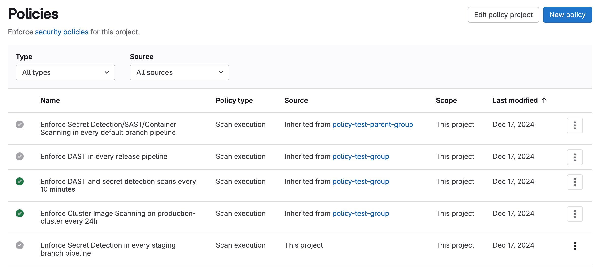



- Tier: Ultimate
- Offering: GitLab.com, GitLab Self-Managed, GitLab Dedicated



Policies provide security and compliance teams with a way to enforce controls globally in
their organization.

Security teams can ensure:

- Security scanners are enforced in development team pipelines with proper configuration.
- All scan jobs execute without any changes or alterations.
- Proper approvals are provided on merge requests, based on results from those findings.
- Vulnerabilities that are no longer detected are resolved automatically, reducing the workload of
  triaging vulnerabilities.

Compliance teams can enforce:

- Multiple approvers on all merge requests
- Projects settings based on organizational requirements, such as enabling or
  locking merge request settings or repository settings.

The following policy types are available:

- [Scan execution policy](scan_execution_policies.md). Enforce security scans, either as part of the
  pipeline or on a specified schedule.
- [Merge request approval policy](merge_request_approval_policies.md). Enforce project-level settings and
  approval rules based on scan results.
- [Pipeline execution policy](pipeline_execution_policies.md). Enforce CI/CD jobs as part of project pipelines.
  - [Scheduled pipeline execution policy (experiment)](scheduled_pipeline_execution_policies.md). Enforce custom CI/CD jobs on a scheduled cadence across projects, independent of commit activity.
- [Vulnerability management policy](vulnerability_management_policy.md). Automatically resolve
  vulnerabilities that are no longer detected in the default branch.

## Configure the policy scope

## `policy_scope` keyword

Use the `policy_scope` keyword to enforce the policy on only those groups, projects, compliance
frameworks, or a combination, that you specify.

| Field                   | Type     | Possible values          | Description |
|-------------------------|----------|--------------------------|-------------|
| `compliance_frameworks` | `array`  | Not applicable           | List of IDs of the compliance frameworks in scope for enforcement, in an array of objects with key `id`. |
| `projects`              | `object` | `including`, `excluding` | Use `excluding:` or `including:` then list the IDs of the projects you wish to include or exclude, in an array of objects with key `id`. |
| `groups`                | `object` | `including`              | Use `including:` then list the IDs of the groups you wish to include, in an array of objects with key `id`. Only groups linked to the same security policy project can be listed in the policy. |

### Scope examples

In this example, the scan execution policy enforces a SAST scan in every release pipeline, on
every project with the compliance frameworks with an ID either `2` or `11` applied to them.

```yaml
---
scan_execution_policy:
- name: Enforce specified scans in every release pipeline
  description: This policy enforces a SAST scan for release branches
  enabled: true
  rules:
  - type: pipeline
    branches:
    - release/*
  actions:
  - scan: sast
  policy_scope:
    compliance_frameworks:
      - id: 2
      - id: 11
```

In this example, the scan execution policy enforces a secret detection and SAST scan on pipelines
for the default branch, on all projects in the group with ID `203` (including all descendent
subgroups and their projects), excluding the project with ID `64`.

```yaml
- name: Enforce specified scans in every default branch pipeline
  description: This policy enforces Secret Detection and SAST scans for the default branch
  enabled: true
  rules:
  - type: pipeline
    branches:
    - main
  actions:
  - scan: secret_detection
  - scan: sast
  policy_scope:
    groups:
      including:
        - id: 203
    projects:
      excluding:
        - id: 64
```

## Separation of duties

Separation of duties is vital to successfully implementing policies. Implement policies that achieve
the necessary compliance and security requirements, while allowing development teams to achieve
their goals.

Security and compliance teams:

- Should be responsible for defining policies and working with development teams to ensure the
  policies meet their needs.

Development teams:

- Should not be able to disable, modify, or circumvent the policies in any way.

To enforce a security policy project on a group, subgroup, or project, you must have either:

- The Owner role in that group, subgroup, or project.
- A custom role in that group, subgroup, or project with the `manage_security_policy_link` permission.

The Owner role and custom roles with the `manage_security_policy_link` permission follow the standard hierarchy rules across groups, subgroups, and projects:

| Organization unit | Group owner or group `manage_security_policy_link` permission | Subgroup owner or subgroup `manage_security_policy_link` permission | Project owner or project `manage_security_policy_link` permission |
|-------------------|---------------------------------------------------------------|---------------------------------------------------------------------|-------------------------------------------------------------------|
| Group             |  Yes                          |  No                                |  No                              |
| Subgroup          |  Yes                          |  Yes                                |  No                              |
| Project           |  Yes                          |  Yes                                |  Yes                              |

### Required permissions

To create and manage security policies:

- For policies enforced on groups: You must have at least the Maintainer role for the group.
- For policies enforced on projects:
  - You must be the project owner.
  - You must be a group member with permissions to create projects in the group.



If you're not a group member, you may face limitations in adding or editing policies for your project. The ability to create and manage policies requires permissions to create projects in the group. Make sure you have the required permissions in the group, even when working with project-level policies.



## Policy recommendations

When implementing policies, consider the following recommendations.

### Branch names

When specifying branch names in a policy, use a generic category of protected branches, such as
**default branch** or **all protected branches**, not individual branch names.

A policy is enforced on a project only if the specified branch exists in that project. For example,
if your policy enforces rules on branch `main` but some projects in scope are using `production` as
their default branch, the policy is not applied for the latter.

### Push rules

In GitLab 17.3 and earlier, if you use push rules to
[validate branch names](../../project/repository/push_rules.md#validate-branch-names)
ensure they allow creation of branches with the prefix `update-policy-`. This branch naming prefix
is used when a security policy is created or amended. For example, `update-policy-1659094451`, where
`1659094451` is the timestamp. If push rules block the creation of the branch the following error
occurs:

```plaintext
Branch name `update-policy-<timestamp>` does not follow the pattern `<branch_name_regex>`.
```

In GitLab 17.4 and later, security policy
projects are excluded from push rules that enforce branch name validation.

### Security policy projects

To prevent the exposure of sensitive information that was intended to remain private in your security policy project, when you link security policy projects to other projects:

- Don't include sensitive content in your security policy projects.
- Before linking a private security policy project, review the member list of the target project to ensure all members should have access to your policy content.
- Evaluate the visibility settings of target projects.
- Use [security policy management](../../compliance/audit_event_types.md#security-policy-management) audit logs to monitor project linking.

These recommendations prevent sensitive information exposure for the following reasons:

- Shared visibility: When a private security project is linked to another project, users with access to the **Security Policies** page of the linked project can view the contents of the `.gitlab/security-policies/policy.yml` file. This includes linking a private security policy project to a public project, which can expose the policy contents to anyone who can access the public project.
- Access control: All members of the project to which a private security project is linked can view the policy file on the **Policy** page, even if they don't have access to the original private repository.

### Security and compliance controls

Project maintainers can create policies for projects that interfere with the execution of policies for groups. To limit who can modify policies for groups and ensure that compliance requirements are being met, when you implement critical security or compliance controls:

- Use custom roles to restrict who can create or modify pipeline execution policies at the project level.
- Configure protected branches for the default branch in your security policy projects to prevent direct pushes.
- Set up merge request approval rules in your security policy projects that require review from designated approvers.
- Monitor and review all policy changes in policies for both groups and projects.

## Policy management

The Policies page displays deployed policies for all available environments. You can check a
policy's information (for example, description or enforcement status), and create and edit deployed
policies:

1. On the left sidebar, select **Search or go to** and find your project. If you've [turned on the new navigation](../../interface_redesign.md#turn-new-navigation-on-or-off), this field is on the top bar.
1. Select **Secure** > **Policies**.



A green checkmark in the first column indicates that the policy is enabled and enforced on all groups and projects within its scope. A gray checkmark indicates that the policy is currently not enabled.

## Policy editor

Use the policy editor to create, edit, and delete policies:

1. On the left sidebar, select **Search or go to** and find your project. If you've [turned on the new navigation](../../interface_redesign.md#turn-new-navigation-on-or-off), this field is on the top bar.
1. Select **Secure** > **Policies**.
   - To create a new policy, select **New policy** which is located in the **Policies** page's header.
     You can then select which type of policy to create.
   - To edit an existing policy, select **Edit policy** in the selected policy drawer.

   The policy editor has two modes:

   Rule mode
   : Construct and preview policy rules using rule blocks and related controls.

   YAML mode
   : Enter a policy definition in YAML format. Suitable for expert users and cases that the rule
   mode doesn't support.

   You can switch between rule mode and YAML mode at any time. If your YAML has errors or
   unsupported data, rule mode turns off automatically. Fix the YAML first to use rule mode again.

1. Select **Configure with a merge request** to save and apply the changes.

   The policy's YAML is validated and any resulting errors are displayed.

1. Review and merge the resulting merge request.

   If you are a project owner and a security policy project is not associated with this project,
   a security policy project is created and linked to this project when the merge request is created.

### Annotate IDs in `policy.yml`



Status: Experiment





- [Introduced](https://gitlab.com/gitlab-org/gitlab/-/issues/497774) as an [experiment](../../../policy/development_stages_support.md) in GitLab 18.1 with an `annotate_ids` option defined in the `policy.yml` file.



To simplify your `policy.yml` file, GitLab can automatically add comments after IDs, such as project IDs, group IDs, user IDs, or compliance framework IDs. The annotations help users identify the meaning or origin of each ID, which makes the `policy.yml` file easier to understand and maintain.

To enable this experimental feature, add an `annotate_ids` section to the `experiments` section in the `.gitlab/security-policies/policy.yml` file for your security policy project:

```yaml
experiments:
  annotate_ids:
    enabled: true
```

After you enable the option, any change to the security policies made with the GitLab [policy editor](#policy-editor) creates annotation comments next to the IDs in the `policy.yml` file.



To apply the annotations, you must use the policy editor. If you edit the `policy.yml` file manually (for example, with a Git commit), the annotations are not applied.



For example:

```yaml
# Example policy.yml with annotated IDs
approval_policy:
- name: Your policy name
  # ... other policy fields ...
  policy_scope:
    projects:
      including:
      - id: 361 # my-group/my-project
  actions:
  - type: require_approval
    approvals_required: 1
    user_approvers_ids:
    - 75 # jane.doe
    group_approvers_ids:
    - 203 # security-approvers
```



When you apply annotations for the first time, GitLab creates the annotations for all IDs in the `policy.yml` file, including those in policies that you aren't editing.



## GitLab Security Policy Bot user

GitLab Security Policy Bot is an internal user that executes security policies across your GitLab instance. This bot is essential for security policies and scheduled pipelines to function properly.

The Security Policy Bot is responsible for:

- Scheduled pipeline execution: Triggers pipelines defined in scan execution policies with `type: schedule` rules.
- Container scanning automation: Triggers container scanning jobs when images are pushed with the `latest` tag.
- Policy enforcement: Executes security scans and compliance checks as defined in your security policies.
- Pipeline creation: Creates and manages policy-driven pipelines in projects where security policies are enforced.

### Account characteristics

The Security Policy Bot has the following characteristics:

- Created automatically in every project where a security policy is enforced.
- Runs with Guest role permissions in projects, with specific additional permissions.
- Does not count toward license limits as it is marked as an internal user.
- Each project gets its own Security Policy Bot instance when policies are applied.

### Permissions and access

The Security Policy Bot operates with minimal but essential permissions:

- Repository access: Read-only access to the repository content required for policy execution.
- Pipeline creation: Ability to create and trigger pipelines for policy enforcement.
- CI/CD variables: Access to project and group variables according to the variable precedence rules.
- Registry access: Can authenticate to container registries when configured with appropriate credentials.

### Limitations and restrictions

Be aware of the following limitations for the GitLab Security Policy Bot:

- Cannot be manually deleted: You cannot delete the bot in the UI.
- Cannot be modified: You cannot manually change the user settings or permissions.
- Project-bound: Each bot instance is tied to a specific project and you cannot shared an instance across projects.
- Policy-dependent: The bot's functionality is entirely dependent on the security policies configured for the project.

### Security troubleshooting



Vulnerability with abuse reports: GitLab Security Policy Bot instances can be banned or deleted through the abuse reporting system, which can prevent scheduled pipelines from running. Administrators should be aware that:

- Reporting a Security Policy Bot for abuse can lead to the bot being banned or deleted.
- Banning or deleting the bot causes scheduled pipelines to fail.
- Once banned, you cannot easily restore the bot through standard administrative actions.
- Security policy enforcement is completely disrupted until the bot is restored.

To prevent accidental disruption of security policies, administrators should exercise caution when processing abuse reports for internal user accounts.



If you experience issues with Security Policy Bot functionality:

#### Scheduled pipelines not running

If the scheduled pipelines are not running as configured:

- Verify the bot account exists and is not banned or deleted.
- Check that the security policy configuration is valid.
- Ensure the bot has the necessary permissions in the project.

#### Policy jobs failing

If the policy job are failing:

- Verify the bot has access to required CI/CD variables.
- Check that referenced CI/CD configuration files exist and are accessible.
- Review pipeline logs for specific error messages.

#### Container scanning not triggering

If container scanning is not triggering as configured:

- Confirm container scanning policies are properly configured.
- Verify the bot has registry authentication credentials, if required.
- Check that the `latest` tag push triggered the expected policy rules.

#### Bot account missing

If the bot account no longer exists:

- Re-apply or update the security policy to recreate the bot account.
- Contact your GitLab administrator if the bot was accidentally banned or deleted through abuse reports.

## Troubleshooting

When working with security policies, consider these troubleshooting tips:

- You should not link a security policy project to both a development project and the group or
  subgroup the development project belongs to. Linking this way results in approval
  rules from the merge request approval policies not being applied to merge requests in the development project.
- When creating a merge request approval policy, neither the array `severity_levels` nor the array
  `vulnerability_states` in the [`scan_finding` rule](merge_request_approval_policies.md#scan_finding-rule-type)
  can be left empty. For a working rule, at least one entry must exist for each array.
- The owner of a project can enforce policies for that project, provided they also have permissions to create projects in the group.
  Project owners who are not group members may face limitations in adding or editing policies. If you're unable to manage policies for your project,
  contact your group administrator to ensure you have the necessary permissions in the group.

If you are still experiencing issues, you can [view recent reported bugs](https://gitlab.com/gitlab-org/gitlab/-/issues/?sort=popularity&state=opened&label_name%5B%5D=group%3A%3Asecurity%20policies&label_name%5B%5D=type%3A%3Abug&first_page_size=20) and raise new unreported issues.

### Resynchronize policies with the GraphQL API

If you notice inconsistencies in any of the policies, such as policies that aren't being enforced or approvals that are incorrect, you can manually force a resynchronization of the policies with the GraphQL `resyncSecurityPolicies` mutation:

```graphql
mutation {
  resyncSecurityPolicies(input: { fullPath: "group-or-project-path" }) {
    errors
  }
}
```

Set `fullPath` to the path of the project or group to which the security policy project is assigned.
