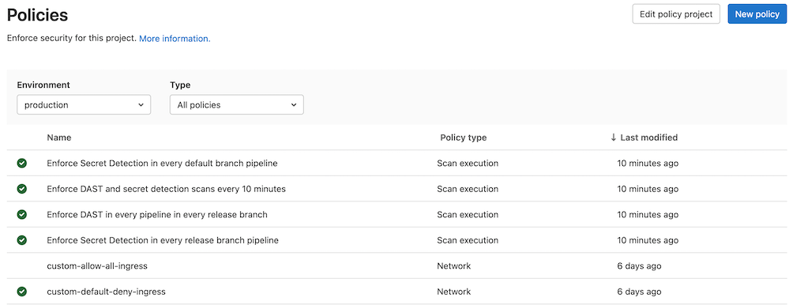
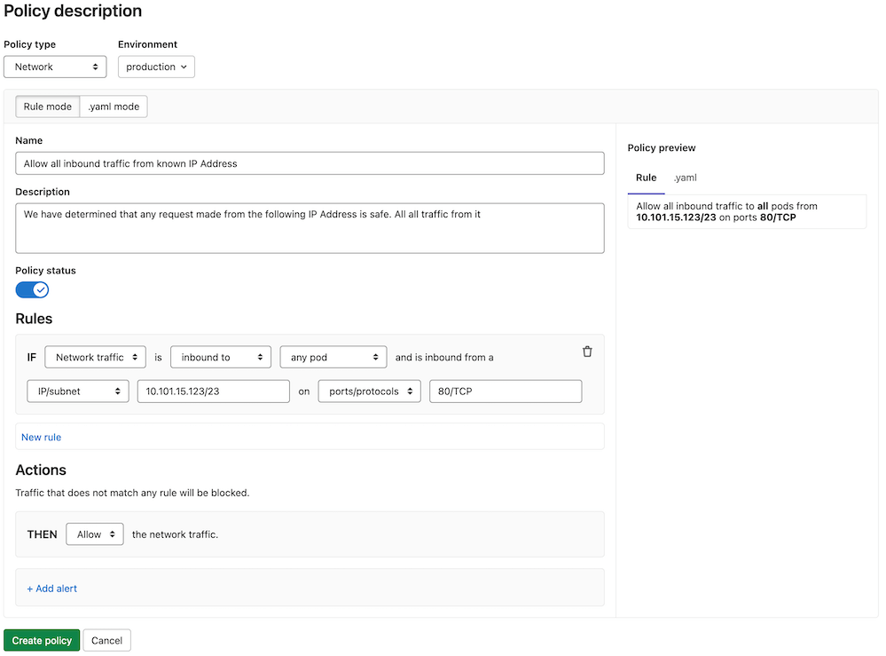
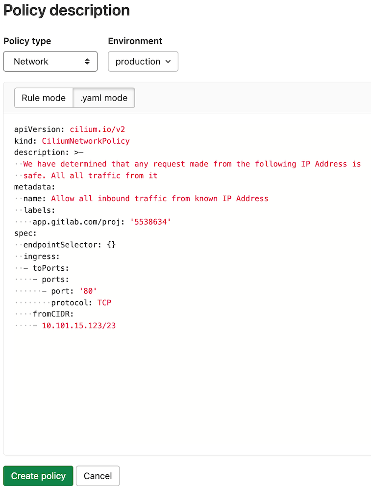
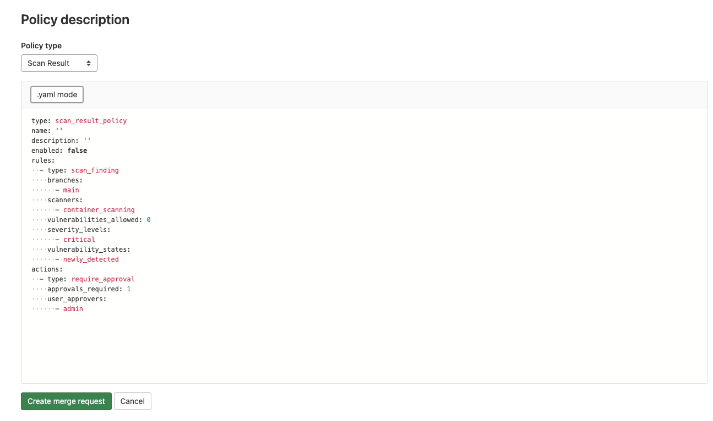

# Policies **(ULTIMATE)**

> - [Introduced](https://gitlab.com/groups/gitlab-org/-/epics/5329) in GitLab 13.10 with a flag named `security_orchestration_policies_configuration`. Disabled by default.
> - [Enabled on self-managed](https://gitlab.com/gitlab-org/gitlab/-/issues/321258) in GitLab 14.3.
> - [Feature flag removed](https://gitlab.com/gitlab-org/gitlab/-/issues/321258) in GitLab 14.4.

Policies in GitLab provide security teams a way to require scans of their choice to be run
whenever a project pipeline runs according to the configuration specified. Security teams can
therefore be confident that the scans they set up have not been changed, altered, or disabled. You
can access these by navigating to your project's **Security & Compliance > Policies** page.

GitLab supports the following security policies:

- [Container Network Policy](#container-network-policy)
- [Scan Execution Policy](#scan-execution-policy-schema)

## Policy management

The Policies page displays deployed
policies for all available environments. You can check a
policy's information (for example, description or enforcement
status), and create and edit deployed policies:

1. On the top bar, select **Menu > Projects** and find your project.
1. On the left sidebar, select **Security & Compliance > Policies**.



Network policies are fetched directly from the selected environment's
deployment platform while other policies are fetched from the project's
security policy project. Changes performed outside of this tab are
reflected upon refresh.

By default, the policy list contains predefined network policies in a
disabled state. Once enabled, a predefined policy deploys to the
selected environment's deployment platform and you can manage it like
the regular policies.

Note that if you're using [Auto DevOps](../../../topics/autodevops/index.md)
and change a policy in this section, your `auto-deploy-values.yaml` file doesn't update. Auto DevOps
users must make changes by following the
[Container Network Policy documentation](../../../topics/autodevops/stages.md#network-policy).

## Policy editor

> [Introduced](https://gitlab.com/groups/gitlab-org/-/epics/3403) in GitLab 13.4.

You can use the policy editor to create, edit, and delete policies:

1. On the top bar, select **Menu > Projects** and find your group.
1. On the left sidebar, select **Security & Compliance > Policies**.
   - To create a new policy, select **New policy** which is located in the **Policies** page's header.
   - To edit an existing policy, select **Edit policy** in the selected policy drawer.

The policy editor has two modes:

- The visual _Rule_ mode allows you to construct and preview policy
  rules using rule blocks and related controls.

  

- YAML mode allows you to enter a policy definition in `.yaml` format
  and is aimed at expert users and cases that the Rule mode doesn't
  support.

  

You can use both modes interchangeably and switch between them at any
time. If a YAML resource is incorrect or contains data not supported
by the Rule mode, Rule mode is automatically
disabled. If the YAML is incorrect, you must use YAML
mode to fix your policy before Rule mode is available again.

## Container Network Policy

> [Introduced](https://gitlab.com/gitlab-org/gitlab/-/issues/32365) in GitLab 12.9.

The **Container Network Policy** section provides packet flow metrics for
your application's Kubernetes namespace. This section has the following
prerequisites:

- Your project contains at least one [environment](../../../ci/environments/index.md).
- You've [installed Cilium](../../project/clusters/protect/container_network_security/quick_start_guide.md#use-the-cluster-management-template-to-install-cilium).
- You've configured the [Prometheus service](../../project/integrations/prometheus.md#enabling-prometheus-integration).

If you're using custom Helm values for Cilium, you must enable Hubble
with flow metrics for each namespace by adding the following lines to
your [Cilium values](../../project/clusters/protect/container_network_security/quick_start_guide.md#use-the-cluster-management-template-to-install-cilium):

```yaml
hubble:
  enabled: true
  metrics:
    enabled:
      - 'flow:sourceContext=namespace;destinationContext=namespace'
```

The **Container Network Policy** section displays the following information
about your packet flow:

- The total amount of the inbound and outbound packets
- The proportion of packets dropped according to the configured
  policies
- The per-second average rate of the forwarded and dropped packets
  accumulated over time window for the requested time interval

If a significant percentage of packets is dropped, you should
investigate it for potential threats by
examining the Cilium logs:

```shell
kubectl -n gitlab-managed-apps logs -l k8s-app=cilium -c cilium-monitor
```

### Change the status

To change a network policy's status:

- Select the network policy you want to update.
- Select **Edit policy**.
- Select the **Policy status** toggle to update the selected policy.
- Select **Save changes** to deploy network policy changes.

Disabled network policies have the `network-policy.gitlab.com/disabled_by: gitlab` selector inside
the `podSelector` block. This narrows the scope of such a policy and as a result it doesn't affect
any pods. The policy itself is still deployed to the corresponding deployment namespace.

### Container Network Policy editor

The policy editor only supports the [CiliumNetworkPolicy](https://docs.cilium.io/en/v1.8/policy/)
specification. Regular Kubernetes [NetworkPolicy](https://kubernetes.io/docs/reference/generated/kubernetes-api/v1.19/#networkpolicy-v1-networking-k8s-io)
resources aren't supported.

Rule mode supports the following rule types:

- [Labels](https://docs.cilium.io/en/v1.8/policy/language/#labels-based).
- [Entities](https://docs.cilium.io/en/v1.8/policy/language/#entities-based).
- [IP/CIDR](https://docs.cilium.io/en/v1.8/policy/language/#ip-cidr-based). Only
  the `toCIDR` block without `except` is supported.
- [DNS](https://docs.cilium.io/en/v1.8/policy/language/#dns-based).
- [Level 4](https://docs.cilium.io/en/v1.8/policy/language/#layer-4-examples)
  can be added to all other rules.

Once your policy is complete, save it by selecting **Save policy**
at the bottom of the editor. Existing policies can also be
removed from the editor interface by selecting **Delete policy**
at the bottom of the editor.

### Configure a Network Policy Alert

> - [Introduced](https://gitlab.com/groups/gitlab-org/-/epics/3438) and [enabled by default](https://gitlab.com/gitlab-org/gitlab/-/issues/287676) in GitLab 13.9.
> - The feature flag was removed and the Threat Monitoring Alerts Project was [made generally available](https://gitlab.com/gitlab-org/gitlab/-/issues/287676) in GitLab 14.0.

You can use policy alerts to track your policy's impact. Alerts are only available if you've
[installed](../../clusters/agent/repository.md)
and [configured](../../clusters/agent/install/index.md#register-the-agent-with-gitlab)
an agent for this project.

There are two ways to create policy alerts:

- In the [policy editor UI](#container-network-policy-editor),
  by clicking **Add alert**.
- In the policy editor's YAML mode, through the `metadata.annotations` property:

  ```yaml
  metadata:
    annotations:
      app.gitlab.com/alert: 'true'
  ```

Once added, the UI updates and displays a warning about the dangers of too many alerts.

## Security Policies project

NOTE:
We recommend using the [Security Policies project](#security-policies-project)
exclusively for managing policies for the project. Do not add your application's source code to such
projects.

The Security Policies feature is a repository to store policies. All security policies are stored as
the `.gitlab/security-policies/policy.yml` YAML file with this format:

```yaml
---
scan_execution_policy:
- name: Enforce DAST in every pipeline
  description: This policy enforces pipeline configuration to have a job with DAST scan
  enabled: true
  rules:
  - type: pipeline
    branches:
    - master
  actions:
  - scan: dast
    scanner_profile: Scanner Profile A
    site_profile: Site Profile B
- name: Enforce DAST in every pipeline in main branch
  description: This policy enforces pipeline configuration to have a job with DAST scan for main branch
  enabled: true
  rules:
  - type: pipeline
    branches:
    - main
  actions:
  - scan: dast
    scanner_profile: Scanner Profile C
    site_profile: Site Profile D
scan_result_policy:
- name: critical vulnerability CS approvals
  description: critical severity level only for container scanning
  enabled: true
  rules:
  - type: scan_finding
    branches:
    - main
    scanners:
    - container_scanning
    vulnerabilities_allowed: 1
    severity_levels:
    - critical
    vulnerability_states:
    - newly_detected
  actions:
  - type: require_approval
    approvals_required: 1
    user_approvers:
    - adalberto.dare
- name: secondary CS approvals
  description: secondary only for container scanning
  enabled: true
  rules:
  - type: scan_finding
    branches:
    - main
    scanners:
    - container_scanning
    vulnerabilities_allowed: 1
    severity_levels:
    - low
    - unknown
    vulnerability_states:
    - newly_detected
  actions:
  - type: require_approval
    approvals_required: 1
    user_approvers:
    - sam.white
```

## Security Policy project selection

NOTE:
Only project Owners have the [permissions](../../permissions.md#project-members-permissions)
to select Security Policy Project.

When the Security Policy project is created and policies are created within that repository, you
must create an association between that project and the project you want to apply policies to:

1. On the top bar, select **Menu > Projects** and find your project.
1. On the left sidebar, select **Security & Compliance > Policies**.
1. Select **Edit Policy Project**, and search for and select the
   project you would like to link from the dropdown menu.
1. Select **Save**.

   

### Unlink Security Policy projects

Project owners can unlink Security Policy projects from development projects. To do this, follow
the steps described in [Security Policy project selection](#security-policy-project-selection),
but select the trash can icon in the modal.

## Scan execution policies

Project owners can use scan execution policies to require that security scans run on a specified
schedule or with the project pipeline. Required scans are injected into the CI pipeline as new jobs
with a long, random job name. In the unlikely event of a job name collision, the security policy job
overwrites any pre-existing job in the pipeline.

This feature has some overlap with [compliance framework pipelines](../../project/settings/#compliance-pipeline-configuration),
as we have not [unified the user experience for these two features](https://gitlab.com/groups/gitlab-org/-/epics/7312).
For details on the similarities and differences between these features, see
[Enforce scan execution](../#enforce-scan-execution).

### Scan Execution Policy editor

NOTE:
Only project Owners have the [permissions](../../permissions.md#project-members-permissions)
to select Security Policy Project.

Once your policy is complete, save it by selecting **Create via merge request**
at the bottom of the editor. You are redirected to the merge request on the project's
configured security policy project. If one does not link to your project, a security
policy project is automatically created. Existing policies can also be
removed from the editor interface by selecting **Delete policy**
at the bottom of the editor.


The policy editor currently only supports the YAML mode. The Rule mode is tracked in the [Allow Users to Edit Rule-mode Scan Execution Policies in the Policy UI](https://gitlab.com/groups/gitlab-org/-/epics/5363) epic.

### Scan Execution Policies Schema

The YAML file with Scan Execution Policies consists of an array of objects matching Scan Execution Policy Schema nested under the `scan_execution_policy` key. You can configure a maximum of 5 policies under the `scan_execution_policy` key.

When you save a new policy, GitLab validates its contents against [this JSON schema](https://gitlab.com/gitlab-org/gitlab/-/blob/master/ee/app/validators/json_schemas/security_orchestration_policy.json).
If you're not familiar with how to read [JSON schemas](https://json-schema.org/),
the following sections and tables provide an alternative.

| Field | Type | Possible values | Description |
|-------|------|-----------------|-------------|
| `scan_execution_policy` | `array` of Scan Execution Policy |  | List of scan execution policies (maximum 5) |

### Scan Execution Policy Schema

| Field | Type | Possible values | Description |
|-------|------|-----------------|-------------|
| `name` | `string` |  | Name of the policy. |
| `description` (optional) | `string` |  | Description of the policy. |
| `enabled` | `boolean` | `true`, `false` | Flag to enable (`true`) or disable (`false`) the policy. |
| `rules` | `array` of rules |  | List of rules that the policy applies. |
| `actions` | `array` of actions |  | List of actions that the policy enforces. |

### `pipeline` rule type

This rule enforces the defined actions whenever the pipeline runs for a selected branch.

| Field | Type | Possible values | Description |
|-------|------|-----------------|-------------|
| `type` | `string` | `pipeline` | The rule's type. |
| `branches` | `array` of `string` | `*` or the branch's name | The branch the given policy applies to (supports wildcard). |

### `schedule` rule type

This rule enforces the defined actions and schedules a scan on the provided date/time.

| Field      | Type | Possible values | Description |
|------------|------|-----------------|-------------|
| `type`     | `string` | `schedule` | The rule's type. |
| `branches` | `array` of `string` | `*` or the branch's name | The branch the given policy applies to (supports wildcard). |
| `cadence`  | `string` | CRON expression (for example, `0 0 * * *`) | A whitespace-separated string containing five fields that represents the scheduled time. |
| `clusters` | `object` | | The cluster where the given policy enforces running selected scans (only for `container_scanning`/`cluster_image_scanning` scans). The key of the object is the name of the Kubernetes cluster configured for your project in GitLab. In the optionally provided value of the object, you can precisely select Kubernetes resources that are scanned. |

#### `cluster` schema

Use this schema to define `clusters` objects in the [`schedule` rule type](#schedule-rule-type).

| Field        | Type                | Possible values          | Description |
|--------------|---------------------|--------------------------|-------------|
| `containers` | `array` of `string` | | The container name that is scanned (only the first value is currently supported). |
| `resources`  | `array` of `string` | | The resource name that is scanned (only the first value is currently supported). |
| `namespaces` | `array` of `string` | | The namespace that is scanned (only the first value is currently supported). |
| `kinds`      | `array` of `string` | `deployment`/`daemonset` | The resource kind that should be scanned (only the first value is currently supported). |

### `scan` action type

This action executes the selected `scan` with additional parameters when conditions for at least one
rule in the defined policy are met.

| Field | Type | Possible values | Description |
|-------|------|-----------------|-------------|
| `scan` | `string` | `dast`, `secret_detection`, `sast`, `container_scanning`, `cluster_image_scanning` | The action's type. |
| `site_profile` | `string` | Name of the selected [DAST site profile](../dast/index.md#site-profile). | The DAST site profile to execute the DAST scan. This field should only be set if `scan` type is `dast`. |
| `scanner_profile` | `string` or `null` | Name of the selected [DAST scanner profile](../dast/index.md#scanner-profile). | The DAST scanner profile to execute the DAST scan. This field should only be set if `scan` type is `dast`.|
| `variables` | `object` | | Set of variables applied and enforced for the selected scan. The object's key is the variable name with a value provided as a string. |

Note the following:

- You must create the [site profile](../dast/index.md#site-profile) and [scanner profile](../dast/index.md#scanner-profile)
  with selected names for each project that is assigned to the selected Security Policy Project.
  Otherwise, the policy is not applied and a job with an error message is created instead.
- Once you associate the site profile and scanner profile by name in the policy, it is not possible
  to modify or delete them. If you want to modify them, you must first disable the policy by setting
  the `active` flag to `false`.
- When configuring policies with a scheduled DAST scan, the author of the commit in the security
  policy project's repository must have access to the scanner and site profiles. Otherwise, the scan
  is not scheduled successfully.
- For a secret detection scan, only rules with the default ruleset are supported. [Custom rulesets](../secret_detection/index.md#custom-rulesets)
  are not supported.
- A secret detection scan runs in `normal` mode when executed as part of a pipeline, and in
  [`historic`](../secret_detection/index.md#full-history-secret-detection)
  mode when executed as part of a scheduled scan.
- A container scanning and cluster image scanning scans configured for the `pipeline` rule type ignores the cluster defined in the `clusters` object.
  They use predefined CI/CD variables defined for your project. Cluster selection with the `clusters` object is supported for the `schedule` rule type.
  Cluster with name provided in `clusters` object must be created and configured for the project. To be able to successfully perform the `container_scanning`/`cluster_image_scanning` scans for the cluster you must follow instructions for the [Cluster Image Scanning feature](../cluster_image_scanning/index.md#prerequisites).
- The SAST scan uses the default template and runs in a [child pipeline](../../../ci/pipelines/parent_child_pipelines.md).

### Example security policies project

You can use this example in a `.gitlab/security-policies/policy.yml`, as described in
[Security policies project](#security-policies-project).

```yaml
---
scan_execution_policy:
- name: Enforce DAST in every release pipeline
  description: This policy enforces pipeline configuration to have a job with DAST scan for release branches
  enabled: true
  rules:
  - type: pipeline
    branches:
    - release/*
  actions:
  - scan: dast
    scanner_profile: Scanner Profile A
    site_profile: Site Profile B
- name: Enforce DAST and secret detection scans every 10 minutes
  description: This policy enforces DAST and secret detection scans to run every 10 minutes
  enabled: true
  rules:
  - type: schedule
    branches:
    - main
    cadence: "*/10 * * * *"
  actions:
  - scan: dast
    scanner_profile: Scanner Profile C
    site_profile: Site Profile D
  - scan: secret_detection
- name: Enforce Secret Detection and Container Scanning in every default branch pipeline
  description: This policy enforces pipeline configuration to have a job with Secret Detection and Container Scanning scans for the default branch
  enabled: true
  rules:
  - type: pipeline
    branches:
    - main
  actions:
  - scan: secret_detection
  - scan: sast
    variables:
      SAST_EXCLUDED_ANALYZERS: brakeman
  - scan: container_scanning
- name: Enforce Cluster Image Scanning on production-cluster every 24h
  description: This policy enforces Cluster Image Scanning scan to run every 24 hours
  enabled: true
  rules:
  - type: schedule
    cadence: "15 3 * * *"
    clusters:
      production-cluster:
        containers:
        - database
        resources:
        - production-application
        namespaces:
        - production-namespace
        kinds:
        - deployment
  actions:
  - scan: cluster_image_scanning
```

In this example:

- For every pipeline executed on branches that match the `release/*` wildcard (for example, branch
  `release/v1.2.1`), DAST scans run with `Scanner Profile A` and `Site Profile B`.
- DAST and secret detection scans run every 10 minutes. The DAST scan runs with `Scanner Profile C`
  and `Site Profile D`.
- Secret detection, container scanning, and SAST scans run for every pipeline executed on the `main`
  branch. The SAST scan runs with the `SAST_EXCLUDED_ANALYZER` variable set to `"brakeman"`.
- Cluster Image Scanning scan runs every 24h. The scan runs on the `production-cluster` cluster and fetches vulnerabilities
  from the container with the name `database` configured for deployment with the name `production-application` in the `production-namespace` namespace.

### Example for scan execution policy editor

You can use this example in the YAML mode of the [Scan Execution Policy editor](#scan-execution-policy-editor).
It corresponds to a single object from the previous example.

```yaml
name: Enforce Secret Detection and Container Scanning in every default branch pipeline
description: This policy enforces pipeline configuration to have a job with Secret Detection and Container Scanning scans for the default branch
enabled: true
rules:
  - type: pipeline
    branches:
      - main
actions:
  - scan: secret_detection
  - scan: container_scanning
```

### Scan Result Policy editor

> [Introduced](https://gitlab.com/gitlab-org/gitlab/-/merge_requests/77814) in GitLab 14.8 with a flag named `scan_result_policy`. Disabled by default.

NOTE:
Only project Owners have the [permissions](../../permissions.md#project-members-permissions)
to select Security Policy Project.

Once your policy is complete, save it by selecting **Create merge request** at the bottom of the
editor. This redirects you to the merge request on the project's configured security policy project.
If a security policy project doesn't link to your project, GitLab creates such a project for you.
Existing policies can also be removed from the editor interface by selecting **Delete policy** at
the bottom of the editor.

The policy editor only supports YAML mode. To follow work on Rule mode, see the epic
[Allow Users to Edit Rule-mode Scan Result Policies in the Policy UI](https://gitlab.com/groups/gitlab-org/-/epics/5363).



### Scan Result Policies schema

The YAML file with Scan Result Policies consists of an array of objects matching the Scan Result
Policy schema nested under the `scan_result_policy` key. You can configure a maximum of five
policies under the `scan_result_policy` key.

When you save a new policy, GitLab validates its contents against [this JSON schema](https://gitlab.com/gitlab-org/gitlab/-/blob/master/ee/app/validators/json_schemas/security_orchestration_policy.json).
If you're not familiar with how to read [JSON schemas](https://json-schema.org/),
the following sections and tables provide an alternative.

| Field | Type | Possible values | Description |
|-------|------|-----------------|-------------|
| `scan_result_policy` | `array` of Scan Result Policy |  | List of Scan Result Policies (maximum 5). |

### Scan Result Policy schema

| Field | Type | Possible values | Description |
|-------|------|-----------------|-------------|
| `name` | `string` |  | Name of the policy. |
| `description` (optional) | `string` |  | Description of the policy. |
| `enabled` | `boolean` | `true`, `false` | Flag to enable (`true`) or disable (`false`) the policy. |
| `rules` | `array` of rules |  | List of rules that the policy applies. |
| `actions` | `array` of actions |  | List of actions that the policy enforces. |

### `scan_finding` rule type

This rule enforces the defined actions based on the information provided.

| Field      | Type | Possible values | Description |
|------------|------|-----------------|-------------|
| `type`     | `string` | `scan_finding` | The rule's type. |
| `branches` | `array` of `string` | `*` or the branch's name | The branch the given policy applies to (supports wildcard). |
| `scanners`  | `array` of `string` | `sast`, `secret_detection`, `dependency_scanning`, `container_scanning`, `dast`, `coverage_fuzzing`, `api_fuzzing` | The security scanners for this rule to consider. |
| `vulnerabilities_allowed`  | `integer` | Greater than or equal to zero | Number of vulnerabilities allowed before this rule is considered. |
| `severity_levels`  | `array` of `string` | `info`, `unknown`, `low`, `medium`, `high`, `critical`| The severity levels for this rule to consider. |
| `vulnerability_states`  | `array` of `string` | `newly_detected`, `detected`, `confirmed`, `resolved`, `dismissed` | The vulnerability states for this rule to consider when the target branch is set to the default branch. |

### `require_approval` action type

This action sets an approval rule to be required when conditions are met for at least one rule in
the defined policy.

| Field | Type | Possible values | Description |
|-------|------|-----------------|-------------|
| `type` | `string` | `require_approval` | The action's type. |
| `approvals_required` | `integer` | Greater than or equal to zero | The number of MR approvals required. |
| `user_approvers` | `array` of `string` | Username of one of more users | The users to consider as approvers. |
| `user_approvers_ids` | `array` of `integer` | ID of one of more users | The IDs of users to consider as approvers. |
| `group_approvers` | `array` of `string` | Path of one of more groups | The groups to consider as approvers. |
| `group_approvers_ids` | `array` of `integer` | ID of one of more groups | The IDs of groups to consider as approvers. |

Requirements and limitations:

- You must add the respective [security scanning tools](../index.md#security-scanning-tools).
  Otherwise, Scan Result Policies won't have any effect.
- The maximum number of policies is five.
- Each policy can have a maximum of five rules.

### Example security scan result policies project

You can use this example in a `.gitlab/security-policies/policy.yml`, as described in
[Security policies project](#security-policies-project):

```yaml
---
scan_result_policy:
- name: critical vulnerability CS approvals
  description: critical severity level only for container scanning
  enabled: true
  rules:
  - type: scan_finding
    branches:
    - main
    scanners:
    - container_scanning
    vulnerabilities_allowed: 0
    severity_levels:
    - critical
    vulnerability_states:
    - newly_detected
  actions:
  - type: require_approval
    approvals_required: 1
    user_approvers:
    - adalberto.dare
- name: secondary CS approvals
  description: secondary only for container scanning
  enabled: true
  rules:
  - type: scan_finding
    branches:
    - main
    scanners:
    - container_scanning
    vulnerabilities_allowed: 1
    severity_levels:
    - low
    - unknown
    vulnerability_states:
    - newly_detected
  actions:
  - type: require_approval
    approvals_required: 1
    user_approvers:
    - sam.white
```

In this example:

- Every MR that contains new `critical` vulnerabilities identified by container scanning requires
  one approval from `alberto.dare`.
- Every MR that contains more than one new `low` or `unknown` vulnerability identified by container
  scanning requires one approval from `sam.white`.

### Example for Scan Result Policy editor

You can use this example in the YAML mode of the [Scan Result Policy editor](#scan-result-policy-editor).
It corresponds to a single object from the previous example:

```yaml
- name: critical vulnerability CS approvals
  description: critical severity level only for container scanning
  enabled: true
  rules:
  - type: scan_finding
    branches:
    - main
    scanners:
    - container_scanning
    vulnerabilities_allowed: 1
    severity_levels:
    - critical
    vulnerability_states:
    - newly_detected
  actions:
  - type: require_approval
    approvals_required: 1
    user_approvers:
    - adalberto.dare
```

## Roadmap

See the [Category Direction page](https://about.gitlab.com/direction/protect/container_network_security/)
for more information on the product direction of Container Network Security.
