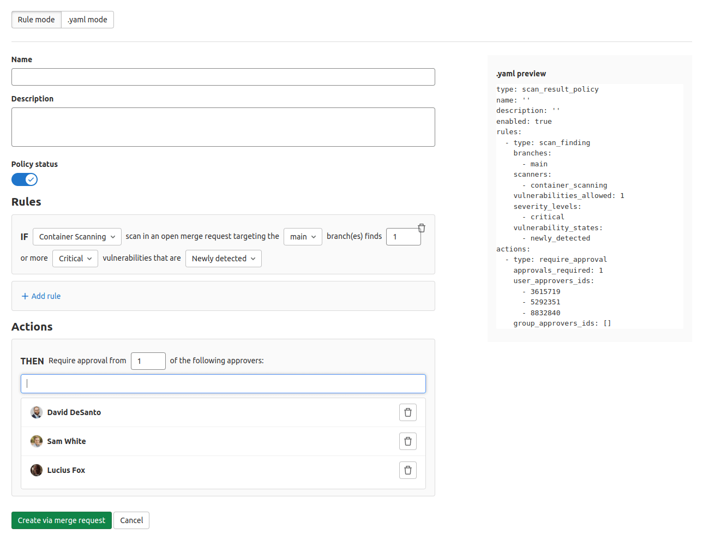
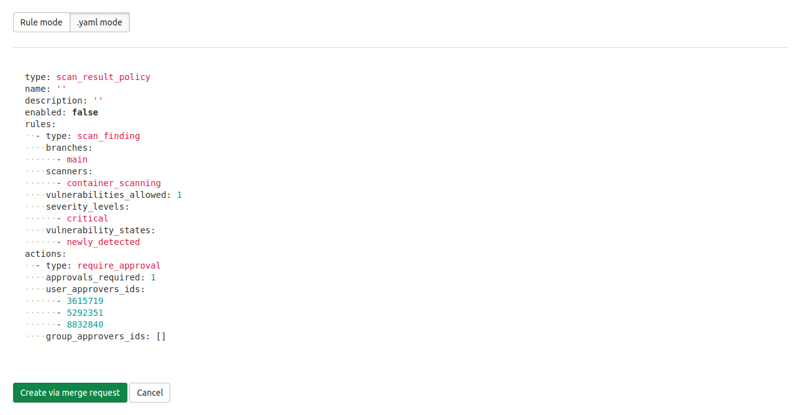

# Policies **(ULTIMATE)**

> - [Introduced](https://gitlab.com/groups/gitlab-org/-/epics/5329) in GitLab 13.10 with a flag named `security_orchestration_policies_configuration`. Disabled by default.
> - [Enabled on self-managed](https://gitlab.com/gitlab-org/gitlab/-/issues/321258) in GitLab 14.3.
> - [Feature flag removed](https://gitlab.com/gitlab-org/gitlab/-/issues/321258) in GitLab 14.4.

Policies in GitLab provide security teams a way to require scans of their choice to be run
whenever a project pipeline runs according to the configuration specified. Security teams can
therefore be confident that the scans they set up have not been changed, altered, or disabled. You
can access these by navigating to your project's **Security & Compliance > Policies** page.

GitLab supports the following security policies:

- [Scan Execution Policy](scan-execution-policies.md)
- [Scan Result Policy](scan-result-policies.md)

## Security policy project

All security policies are stored as YAML in a separate security policy project that gets linked to
the development project. This association can be a one-to-many relationship, allowing one security
policy project to apply to multiple development projects. Linked projects are not required to be in
the same group as the development projects to which they are linked.

Although it is possible to have one project linked to itself and to serve as both the development
project and the security policy project, this is not recommended. Keeping the security policy
project separate from the development project allows for complete separation of duties between
security/compliance teams and development teams.

All security policies are stored in the `.gitlab/security-policies/policy.yml` YAML file inside the
linked security policy project. The format for this YAML is specific to the type of policy that is
stored there. Examples and schema information are available for the following policy types:

- [Scan execution policy](scan-execution-policies.md#example-security-policies-project)
- [Scan result policy](scan-result-policies.md#example-security-scan-result-policies-project)

Most policy changes take effect as soon as the merge request is merged. Any changes that
do not go through a merge request and are committed directly to the default branch may require up to 10 minutes
before the policy changes take effect.

### Managing the linked security policy project

NOTE:
Only project Owners have the [permissions](../../permissions.md#project-members-permissions)
to select, edit, and unlink a security policy project.

As a project owner, take the following steps to create or edit an association between your current
project and a project that you would like to designate as the security policy project:

1. On the top bar, select **Main menu > Projects** and find your project.
1. On the left sidebar, select **Security & Compliance > Policies**.
1. Select **Edit Policy Project**, and search for and select the
   project you would like to link from the dropdown list.
1. Select **Save**.

To unlink a security policy project, follow the same steps but instead select the trash can icon in
the modal.

### Viewing the linked security policy project

All users who have access to the project policy page and are not project owners will instead view a
button linking out to the associated security policy project. If no security policy project has been
associated then the linking button does not appear.

## Policy management

The Policies page displays deployed
policies for all available environments. You can check a
policy's information (for example, description or enforcement
status), and create and edit deployed policies:

1. On the top bar, select **Main menu > Projects** and find your project.
1. On the left sidebar, select **Security & Compliance > Policies**.

## Policy editor

> [Introduced](https://gitlab.com/groups/gitlab-org/-/epics/3403) in GitLab 13.4.

You can use the policy editor to create, edit, and delete policies:

1. On the top bar, select **Main menu > Projects** and find your group.
1. On the left sidebar, select **Security & Compliance > Policies**.
   - To create a new policy, select **New policy** which is located in the **Policies** page's header.
     You can then select which type of policy to create.
   - To edit an existing policy, select **Edit policy** in the selected policy drawer.

The policy editor has two modes:

- The visual _Rule_ mode allows you to construct and preview policy
  rules using rule blocks and related controls.

  

- YAML mode allows you to enter a policy definition in `.yaml` format
  and is aimed at expert users and cases that the Rule mode doesn't
  support.

  

You can use both modes interchangeably and switch between them at any
time. If a YAML resource is incorrect or contains data not supported
by the Rule mode, Rule mode is automatically
disabled. If the YAML is incorrect, you must use YAML
mode to fix your policy before Rule mode is available again.

When you finish creating or editing your policy, save and apply it by selecting the
**Configure with a merge request** button and then merging the resulting merge request. When you
press this button, the policy YAML is validated and any resulting errors are displayed.
Additionally, if you are a project owner and a security policy project has not been previously
associated with this project, then a new project is created and associated automatically at the same
time that the first policy merge request is created.

## Managing projects in bulk via a script

You can use the [Vulnerability-Check Migration](https://gitlab.com/gitlab-org/gitlab/-/snippets/2328089) script to bulk create policies or associate security policy projects with development projects. For instructions and a demonstration of how to use the Vulnerability-Check Migration script, see [this video](https://youtu.be/biU1N26DfBc).

## Scan execution policies

See [Scan execution policies](scan-execution-policies.md).

## Scan result policy editor

See [Scan result policies](scan-result-policies.md).

## Roadmap

See the [Category Direction page](https://about.gitlab.com/direction/govern/security_policies/security_policy_management/)
for more information on the product direction of security policies within GitLab.

## Troubleshooting

### `Branch name 'update-policy-<timestamp>' does not follow the pattern '<branch_name_regex>'`

When you create a new security policy or change an existing policy, a new branch is automatically created with the branch name following the pattern `update-policy-<timestamp>`. For example: `update-policy-1659094451`.

If you have group or instance [push rules that do not allow branch name patterns](../../project/repository/push_rules.md#validate-branch-names) that contain the text `update-policy-<timestamp>`, you will get an error that states `Branch name 'update-policy-<timestamp>' does not follow the pattern '<branch_name_regex>'`.

The workaround is to amend your group or instance push rules to allow branches following the pattern `update-policy-` followed by an integer timestamp.
