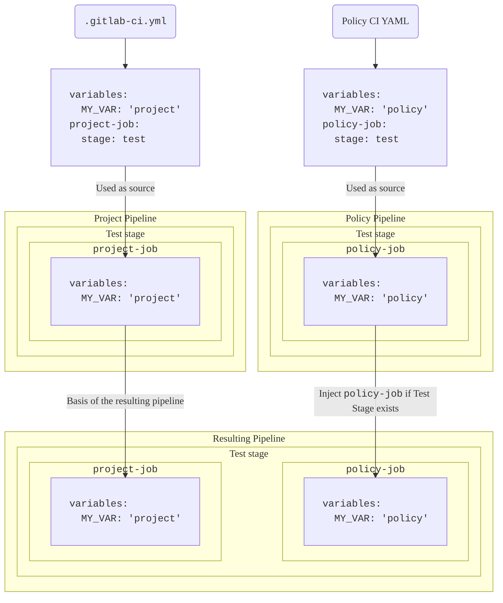



- Tier: Ultimate
- Offering: GitLab.com, GitLab Self-Managed, GitLab Dedicated





- [Introduced](https://gitlab.com/groups/gitlab-org/-/epics/13266) in GitLab 17.2 [with a flag](../../../administration/feature_flags/_index.md) named `pipeline_execution_policy_type`. Enabled by default.
- [Generally available](https://gitlab.com/gitlab-org/gitlab/-/issues/454278) in GitLab 17.3. Feature flag `pipeline_execution_policy_type` removed.



Use pipeline execution policies to manage and enforce CI/CD jobs for multiple projects with a single configuration.

- <i class="fa fa-youtube-play youtube" aria-hidden="true"></i> For a video walkthrough, see [Security Policies: Pipeline Execution Policy Type](https://www.youtube.com/watch?v=QQAOpkZ__pA).

## Schema



- [Enabled](https://gitlab.com/gitlab-org/gitlab/-/merge_requests/159858) the `suffix` field in GitLab 17.4.
- [Changed](https://gitlab.com/gitlab-org/gitlab/-/merge_requests/165096) pipeline execution so later stages wait for the `.pipeline-policy-pre` stage to complete in GitLab 17.7.



The YAML file with pipeline execution policies consists of an array of objects matching pipeline execution
policy schema nested under the `pipeline_execution_policy` key. You can configure a maximum of five
policies under the `pipeline_execution_policy` key per security policy project. Any other policies configured after
the first five are not applied.

When you save a new policy, GitLab validates its contents against [this JSON schema](https://gitlab.com/gitlab-org/gitlab/-/blob/master/ee/app/validators/json_schemas/security_orchestration_policy.json).
If you're not familiar with how to read [JSON schemas](https://json-schema.org/),
the following sections and tables provide an alternative.

| Field | Type | Required | Description |
|-------|------|----------|-------------|
| `pipeline_execution_policy` | `array` of pipeline execution policy | true | List of pipeline execution policies (maximum five) |

## `pipeline_execution_policy` schema

| Field | Type | Required | Description |
|-------|------|----------|-------------|
| `name` | `string` | true | Name of the policy. Maximum of 255 characters.|
| `description` (optional) | `string` | true | Description of the policy. |
| `enabled` | `boolean` | true | Flag to enable (`true`) or disable (`false`) the policy. |
| `content` | `object` of [`content`](#content-type) | true | Reference to the CI/CD configuration to inject into project pipelines. |
| `pipeline_config_strategy` | `string` | false | Can be `inject_policy`, `inject_ci` (deprecated), or `override_project_ci`. See [pipeline strategies](#pipeline-configuration-strategies) for more information. |
| `policy_scope` | `object` of [`policy_scope`](_index.md#configure-the-policy-scope) | false | Scopes the policy based on projects, groups, or compliance framework labels you specify. |
| `suffix` | `string` | false | Can either be `on_conflict` (default), or `never`. Defines the behavior for handling job naming conflicts. `on_conflict` applies a unique suffix to the job names for jobs that would break the uniqueness. `never` causes the pipeline to fail if the job names across the project and all applicable policies are not unique. |
| `skip_ci` | `object` of [`skip_ci`](pipeline_execution_policies.md#skip_ci-type) | false | Defines whether users can apply the `skip-ci` directive. By default, the use of `skip-ci` is ignored and as a result, pipelines with pipeline execution policies cannot be skipped. |
| `variables_override` | `object` of [`variables_override`](pipeline_execution_policies.md#variables_override-type) | false | Controls whether users can override the behavior of policy variables. By default, the policy variables are enforced with the highest precedence and users cannot override them. |

Note the following:

- Users that trigger a pipeline must have at least read access to the pipeline execution file specified in the pipeline execution policy, otherwise the pipelines do not start.
- If the pipeline execution file gets deleted or renamed, the pipelines in projects with the policy enforced might stop working.
- Pipeline execution policy jobs can be assigned to one of the two reserved stages:
  - `.pipeline-policy-pre` at the beginning of the pipeline, before the `.pre` stage.
  - `.pipeline-policy-post` at the very end of the pipeline, after the `.post` stage.
- Injecting jobs in any of the reserved stages is guaranteed to always work. Execution policy jobs can also be assigned to any standard (build, test, deploy) or user-declared stages. However, in this case, the jobs may be ignored depending on the project pipeline configuration.
- It is not possible to assign jobs to reserved stages outside of a pipeline execution policy.
- Choose unique job names for pipeline execution policies. Some CI/CD configurations are based on job names, which can lead to unwanted results if a job name exists multiple times in the same pipeline. For example, the `needs` keyword makes one job dependent on another. If there are multiple jobs with the name `example`, a job that `needs` the `example` job name depends on only one of the `example` job instances at random.
- Pipeline execution policies remain in effect even if the project lacks a CI/CD configuration file.
- The order of the policies matters for the applied suffix.
- If any policy applied to a given project has `suffix: never`, the pipeline fails if another job with the same name is already present in the pipeline.
- Pipeline execution policies are enforced on all branches and pipeline sources. However, for [merge request pipelines](../../../ci/pipelines/merge_request_pipelines.md#add-jobs-to-merge-request-pipelines), some `rules:` or `workflow:rules` configurations can prevent jobs from running. Use [workflow rules](../../../ci/yaml/workflow.md) to control when pipeline execution policies are enforced.

### `.pipeline-policy-pre` stage

Jobs in the `.pipeline-policy-pre` stage always execute. This stage is designed for security and compliance use cases.
Jobs in the pipeline do not begin until the `.pipeline-policy-pre` stage completes.

If you don't require this behavior for your workflow, you can use the `.pre` stage or a custom stage instead.

#### Ensure that `.pipeline-policy-pre` succeeds



- Status: Experiment





This feature is experimental and might change in future releases. Test it thoroughly in
non-production environments only, as it might be unstable in production.



To ensure that `.pipeline-policy-pre` completes and succeeds, enable the `ensure_pipeline_policy_pre_succeeds`
experiment in the security policy configuration. The `.gitlab/security-policies/policy.yml` YAML
configuration file is stored in your security policy project:

```yaml
experiments:
  ensure_pipeline_policy_pre_succeeds:
    enabled: true
```

If the `.pipeline-policy-pre` stage fails or all jobs in the stage are skipped, all jobs in later stages are skipped, including:

- Jobs with `needs: []`
- Jobs with `when: always`

When multiple pipeline execution policies apply, the experiment takes effect if enabled in any of them,
ensuring that `.pipeline-policy-pre` must succeed.

### Job naming best practice



- Naming conflict handling [introduced](https://gitlab.com/gitlab-org/gitlab/-/issues/473189) in GitLab 17.4.



There is no visible indicator that a job was generated by a security policy. To make it easier to identify jobs that were created by policies and avoid job name collisions, add a unique prefix or suffix to the job name.

Examples:

- Use: `policy1:deployments:sast`. This name is likely unique across all other policies and projects.
- Don't use: `sast`. This name is likely to be duplicated in other policies and projects.

Pipeline execution policies handle naming conflicts depending on the `suffix` attribute. If there are multiple jobs with the same name:

- Using `on_conflict` (default), a suffix is added to a job if its name conflicts with another job in the pipeline.
- Using `never`, no suffix is added in the event of a conflict and the pipeline fails.

The suffix is added based on the order in which the jobs are merged onto the main pipeline.

The order is as follows:

1. Project pipeline jobs
1. Project policy jobs (if applicable)
1. Group policy jobs (if applicable, ordered by hierarchy, the most top-level group is applied as last)

The applied suffix has the following format:

`:policy-<security-policy-project-id>-<policy-index>`.

Example of the resulting job: `sast:policy-123456-0`.

If multiple policies in on security policy project define the same job name, the numerical suffix corresponds to the index of the conflicting policy.

Example of the resulting jobs:

- `sast:policy-123456-0`
- `sast:policy-123456-1`

### Job stage best practice

Jobs defined in a pipeline execution policy can use any [stage](../../../ci/yaml/_index.md#stage)
defined in the project's CI/CD configuration, also the reserved stages `.pipeline-policy-pre` and
`.pipeline-policy-post`.



If your policy contains jobs only in the `.pre` and `.post` stages, the policy's pipeline is
evaluated as `empty`. It is not merged with the project's pipeline.

To use the `.pre` and `.post` stages in a pipeline execution policy, you must include at least one
other job that runs in a different stage. For example: `.pipeline-policy-pre`.



When you use the `inject_policy` [pipeline strategy](#pipeline-configuration-strategies), if a target project does not
contain its own `.gitlab-ci.yml` file, all policy stages are injected into the pipeline.

When you use the (deprecated) `inject_ci` [pipeline strategy](#pipeline-configuration-strategies), if a target project does not
contain its own `.gitlab-ci.yml` file, then the only stages available are the default pipeline
stages and the reserved stages.

When you enforce pipeline execution policies over projects with CI/CD configurations that you do not
have permissions to modify, you should define jobs in the `.pipeline-policy-pre` and `.pipeline-policy-post` stages.
These stages are always available, regardless of any project's CI/CD configuration.

When you use the `override_project_ci` [pipeline strategy](#pipeline-configuration-strategies) with multiple
pipeline execution policies and with custom stages, the stages must be defined in the same relative order
to be compatible with each other:

Valid configuration example:

```yaml
  - override-policy-1 stages: [build, test, policy-test, deploy]
  - override-policy-2 stages: [test, deploy]
```

Invalid configuration example:

```yaml
  - override-policy-1 stages: [build, test, policy-test, deploy]
  - override-policy-2 stages: [deploy, test]
```

The pipeline fails if one or more `override_project_ci` policies has an invalid `stages` configuration.

### `content` type

| Field | Type | Required | Description |
|-------|------|----------|-------------|
| `project` | `string` | true | The full GitLab project path to a project on the same GitLab instance. |
| `file` | `string` | true | A full file path relative to the root directory (/). The YAML files must have the `.yml` or `.yaml` extension. |
| `ref` | `string` | false | The ref to retrieve the file from. Defaults to the HEAD of the project when not specified. |

Use the `content` type in a policy to reference a CI/CD configuration stored in another repository.
This allows you to reuse the same CI/CD configuration across multiple policies, reducing the
overhead of maintaining these configurations. For example, if you have a custom secret detection
CI/CD configuration you want to enforce in policy A and policy B, you can create a single YAML configuration file and reference the configuration in both policies.

Prerequisites:

- Users triggering pipelines run in those projects on which a policy containing the `content` type
  is enforced must have at minimum read-only access to the project containing the CI/CD
- In projects that enforce pipeline execution policies, users must have at least read-only access to the project that contains the CI/CD configuration to trigger the pipeline.

  In GitLab 17.4 and later, you can grant the required read-only access for the CI/CD configuration file
  specified in a security policy project using the `content` type. To do so, enable the setting **Pipeline execution policies** in the general settings of the security policy project.
  Enabling this setting grants the user who triggered the pipeline access to
  read the CI/CD configuration file enforced by the pipeline execution policy. This setting does not grant the user access to any other parts of the project where the configuration file is stored.
  For more details, see [Grant access automatically](#grant-access-automatically).

### `skip_ci` type



- [Introduced](https://gitlab.com/gitlab-org/gitlab/-/merge_requests/173480) in GitLab 17.7.



Pipeline execution policies offer control over who can use the `[skip ci]` directive. You can specify certain users or service accounts that are allowed to use `[skip ci]` while still ensuring critical security and compliance checks are performed.

Use the `skip_ci` keyword to specify whether users are allowed to apply the `skip_ci` directive to skip the pipelines.
When the keyword is not specified, the `skip_ci` directive is ignored, preventing all users
from bypassing the pipeline execution policies.

| Field                   | Type     | Possible values          | Description |
|-------------------------|----------|--------------------------|-------------|
| `allowed` | `boolean`   | `true`, `false` | Flag to allow (`true`) or prevent (`false`) the use of the `skip-ci` directive for pipelines with enforced pipeline execution policies. |
| `allowlist`             | `object` | `users` | Specify users who are always allowed to use `skip-ci` directive, regardless of the `allowed` flag. Use `users:` followed by an array of objects with `id` keys representing user IDs. |

### `variables_override` type



- [Introduced](https://gitlab.com/groups/gitlab-org/-/epics/16430) in GitLab 18.1.



| Field                   | Type     | Possible values          | Description |
|-------------------------|----------|--------------------------|-------------|
| `allowed` | `boolean`   | `true`, `false` | When `true`, other configurations can override policy variables. When `false`, other configurations cannot override policy variables. |
| `exceptions` | `array` | `array` of `string` | Variables that are exceptions to the global rule. When `allowed: false`, the `exceptions` are an allowlist. When `allowed: true`, the `exceptions` are a denylist. |

This option controls how user-defined variables are handled in pipelines with policies enforced. This feature allows you to:

- Deny user-defined variables by default (recommended), which provides stronger security, but requires that you add all of the variables that should be customizable to the `exceptions` allowlist.
- Allow user-defined variables by default, which provides more flexibility but lower security, as you must add variables that can affect policy enforcement to the `exceptions` denylist.
- Define exceptions to the `allowed` global rule.

User-defined variables can affect the behavior of any policy jobs in the pipeline and can come from various sources:

- [Pipeline variables](../../../ci/variables/_index.md#use-pipeline-variables).
- [Project variables](../../../ci/variables/_index.md#for-a-project).
- [Group variables](../../../ci/variables/_index.md#for-a-group).
- [Instance variables](../../../ci/variables/_index.md#for-an-instance).

When the `variables_override` option is not specified, the "highest precedence" behavior is maintained. For more information about this behavior, see [precedence of variables in pipeline execution policies](#precedence-of-variables-in-pipeline-execution-policies).

When the pipeline execution policy controls variable precedence, the job logs include the configured `variables_override` options and the policy name.
To view these logs, `gitlab-runner` must be updated to version 18.1 or later.

#### Example `variables_override` configuration

Add the `variables_override` option to your pipeline execution policy configuration:

```yaml
pipeline_execution_policy:
  - name: Security Scans
    description: 'Enforce security scanning'
    enabled: true
    pipeline_config_strategy: inject_policy
    content:
      include:
        - project: gitlab-org/security-policies
          file: security-scans.yml
    variables_override:
      allowed: false
      exceptions:
        - CS_IMAGE
        - SAST_EXCLUDED_ANALYZERS
```

##### Enforcing security scans while allowing container customization (allowlist approach)

To enforce security scans but allow project teams to specify their own container image:

```yaml
variables_override:
  allowed: false
  exceptions:
    - CS_IMAGE
```

This configuration blocks all user-defined variables except `CS_IMAGE`, ensuring that security scans cannot be disabled, while allowing teams to customize the container image.

##### Prevent specific security variable overrides (denylist approach)

To allow most variables, but prevent disabling security scans:

```yaml
variables_override:
  allowed: true
  exceptions:
    - SECRET_DETECTION_DISABLED
    - SAST_DISABLED
    - DEPENDENCY_SCANNING_DISABLED
    - DAST_DISABLED
    - CONTAINER_SCANNING_DISABLED
```

This configuration allows all user-defined variables except those that could disable security scans.



While this configuration can provide flexibility, it is discouraged due to the security implications.
Any variable that is not explicitly listed in the `exceptions` can be injected by the users. As a result,
the policy configuration is not as well protected as when using the `allowlist` approach.



### `policy scope` schema

To customize policy enforcement, you can define a policy's scope to either include, or exclude,
specified projects, groups, or compliance framework labels. For more details, see
[Scope](_index.md#configure-the-policy-scope).

## Manage access to the CI/CD configuration

When you enforce pipeline execution policies on a project, users that trigger pipelines must have at least read-only access to the project that contains the policy CI/CD configuration. You can grant access to the project manually or automatically.

### Grant access manually

To allow users or groups to run pipelines with enforced pipeline execution policies, you can invite them to the project that contains the policy CI/CD configuration.

### Grant access automatically

You can automatically grant access to the policy CI/CD configuration for all users who run pipelines in projects with enforced pipeline execution policies.

Prerequisites:

- Make sure the pipeline execution policy CI/CD configuration is stored in a security policy project.
- In the general settings of the security policy project, enable the **Pipeline execution policies** setting.

If you don't yet have a security policy project and you want to create the first pipeline execution policy, create an empty project and link it as a security policy project.
To link the project:

1. In the group or project where you want to enforce the policy, select **Secure** > **Policies** > **Edit policy project**.
1. Select the security policy project.

The project becomes a security policy project, and the setting becomes available.



To create downstream pipelines using `$CI_JOB_TOKEN`, you need to make sure that projects and groups are authorized to request the security policy project.
In the security policy project, go to **Settings** > **CI/CD** > **Job token permissions** and add the authorized groups and projects to the allowlist.
If you don't see the **CI/CD** settings, go to **Settings** > **General** > **Visibility, project features, permissions** and enable **CI/CD**.



#### Configuration

1. In the policy project, select **Settings** > **General** > **Visibility, project features, permissions**.
1. Enable the **Pipeline execution policies** setting.
1. In the policy project, create a file for the policy CI/CD configuration.

   ```yaml
   # policy-ci.yml

   policy-job:
     script: ...
   ```

1. In the group or project where you want to enforce the policy, create a pipeline execution policy and specify the CI/CD configuration file for the security policy project.

   ```yaml
   pipeline_execution_policy:
   - name: My pipeline execution policy
     description: Enforces CI/CD jobs
     enabled: true
     pipeline_config_strategy: inject_policy
     content:
       include:
       - project: my-group/my-security-policy-project
         file: policy-ci.yml
   ```

## Pipeline configuration strategies

Pipeline configuration strategy defines the method for merging the policy configuration with the project pipeline. Pipeline execution policies execute the jobs defined in the `.gitlab-ci.yml` file in isolated pipelines, which are merged into the pipelines of the target projects.

### `inject_policy` type



- [Introduced](https://gitlab.com/gitlab-org/gitlab/-/issues/475152) in GitLab 17.9.



This strategy adds custom CI/CD configurations into the existing project pipeline without completely replacing the project's original CI/CD configuration. It is suitable when you want to enhance or extend the current pipeline with additional steps, such as adding new security scans, compliance checks, or custom scripts.

Unlike the deprecated `inject_ci` strategy, `inject_policy` allows you to inject custom policy stages into your pipeline, giving you more granular control over where policy rules are applied in your CI/CD workflow.

If you have multiple policies enabled, this strategy injects all of jobs from each policy.

When you use this strategy, a project CI/CD configuration cannot override any behavior defined in the policy pipelines because each pipeline has an isolated YAML configuration.

For projects without a `.gitlab-ci.yml` file, this strategy creates `.gitlab-ci.yml` file
implicitly. The executed pipeline contains only the jobs defined in the pipeline execution policy.



When a pipeline execution policy uses workflow rules that prevent policy jobs from running, the only jobs that
run are the project's CI/CD jobs. If the project uses workflow rules that prevent project CI/CD jobs from running,
the only jobs that run are the pipeline execution policy jobs.



#### Stages injection

The stages for the policy pipeline follow the usual CI/CD configuration.
You define the order in which a custom policy stage is injected into the project pipeline by providing the stages before and after the custom stages.

The project and policy pipeline stages are represented as a Directed Acyclic Graph (DAG), where nodes are stages and edges represent dependencies. When you combine pipelines, the individual DAGs are merged into a single, larger DAG. Afterward, a topological sorting is performed, which determines the order in which stages from all pipelines should execute. This sorting ensures that all dependencies are respected in the final order.
If there are conflicting dependencies, the pipeline fails to run. To fix the dependencies, ensure that stages used across the project and policies are aligned.

If a stage isn't explicitly defined in the policy pipeline configuration, the pipeline uses the default stages `stages: [build, test, deploy]`. If these stages are included, but listed in a different order, the pipeline fails with a `Cyclic dependencies detected when enforcing policies` error.

The following examples demonstrate this behavior. All examples assume the following project CI/CD configuration:

```yaml
# .gitlab-ci.yml
stages: [build, test, deploy]

project-build-job:
  stage: build
  script: ...

project-test-job:
  stage: test
  script: ...

project-deploy-job:
  stage: deploy
  script: ...
```

##### Example 1

```yaml
# policy-ci.yml
stages: [test, policy-stage, deploy]

policy-job:
  stage: policy-stage
  script: ...
```

In this example, the `policy-stage` stage:

- Must be injected after `test` stage, if present.
- Must be injected before `deploy` stage, if present.

Result: The pipeline contains the following stages: `[build, test, policy-stage, deploy]`.

Special cases:

- If the `.gitlab-ci.yml` specified the stages as `[build, deploy, test]`, the pipeline would fail with the error `Cyclic dependencies detected when enforcing policies` because the constraints cannot be satisfied. To fix the failure, adjust the project configuration to align the stages with the policies.
- If the `.gitlab-ci.yml` specified stages as `[build]`, the resulting pipeline has the following stages: `[build, policy-stage]`.

##### Example 2

```yaml
# policy-ci.yml
stages: [policy-stage, deploy]

policy-job:
  stage: policy-stage
  script: ...
```

In this example, the `policy-stage` stage:

- Must be injected before `deploy` stage, if present.

Result: The pipeline contains the following stages: `[build, test, policy-stage, deploy]`.

Special cases:

- If the `.gitlab-ci.yml` specified the stages as `[build, deploy, test]`, the resulting pipeline stages would be: `[build, policy-stage, deploy, test]`.
- If there is no `deploy` stage in the project pipeline, the `policy-stage` stage is injected at the end of the pipeline, just before `.pipeline-policy-post`.

##### Example 3

```yaml
# policy-ci.yml
stages: [test, policy-stage]

policy-job:
  stage: policy-stage
  script: ...
```

In this example, the `policy-stage` stage:

- Must be injected after `test` stage, if present.

Result: The pipeline contains the following stages: `[build, test, deploy, policy-stage]`.

Special cases:

- If there is no `test` stage in the project pipeline, the `policy-stage` stage is injected at the end of the pipeline, just before `.pipeline-policy-post`.

##### Example 4

```yaml
# policy-ci.yml
stages: [policy-stage]

policy-job:
  stage: policy-stage
  script: ...
```

In this example, the `policy-stage` stage has no constraints.

Result: The pipeline contains the following stages: `[build, test, deploy, policy-stage]`.

##### Example 5

```yaml
# policy-ci.yml
stages: [check, lint, test, policy-stage, deploy, verify, publish]

policy-job:
  stage: policy-stage
  script: ...
```

In this example, the `policy-stage` stage:

- Must be injected after the stages `check`, `lint`, `test`, if present.
- Must be injected before the stages `deploy`, `verify`, `publish`, if present.

Result: The pipeline contains the following stages: `[build, test, policy-stage, deploy]`.

Special cases:

- If the `.gitlab-ci.yml` specified stages as `[check, publish]`, the resulting pipeline has the following stages: `[check, policy-stage, publish]`

#### Default stage order

When stages are not defined in a policy, GitLab enforces the default stages order:

1. `.pre`
1. `build`
1. `test`
1. `deploy`
1. `.post`.

The default order may conflict with projects that use any of these default stages in a different order. For example, using `test` before `build` in `stages: [test, build, deploy]`.

#### Avoiding cyclic dependencies

Cyclic dependency errors occur when the stage order in a policy conflicts with the stage order in a project. To avoid these errors:

- Always explicitly define the stages in your policy to ensure the stage order is clear and compatible with your projects. If your policy uses the default stages `build`, `test`, or `deploy`, be aware that the order will be enforced on all projects.
- When you use only reserved stages (`.pipeline-policy-pre` and `.pipeline-policy-post`), you don't need to define the default stages in your policy as these reserved stages are always placed at the beginning and end of the pipeline.

By following these guidelines, you can create policies that work reliably across projects with different stage configurations.

### `inject_ci` (deprecated)



This feature was [deprecated](https://gitlab.com/gitlab-org/gitlab/-/issues/475152) in GitLab 17.9. Use [`inject_policy`](#inject_policy-type) instead as it supports the enforcement of custom policy stages.



This strategy adds custom CI/CD configurations into the existing project pipeline without completely replacing the project's original CI/CD configuration. It is suitable when you want to enhance or extend the current pipeline with additional steps, such as adding new security scans, compliance checks, or custom scripts.

Having multiple policies enabled injects all jobs additively.

When you use this strategy, a project CI/CD configuration cannot override any behavior defined in the policy pipelines because each pipeline has an isolated YAML configuration.

For projects without a `.gitlab-ci.yml` file, this strategy creates a `.gitlab-ci.yml` file
implicitly. This allows a pipeline containing only the jobs defined in the pipeline execution policy to
execute.



When a pipeline execution policy uses workflow rules that prevent policy jobs from running, the only jobs that
run are the project's CI/CD jobs. If the project uses workflow rules that prevent project CI/CD jobs from running,
the only jobs that run are the pipeline execution policy jobs.



### `override_project_ci`



- Updated handling of workflow rules [introduced](https://gitlab.com/gitlab-org/gitlab/-/merge_requests/175088) in GitLab 17.8 [with a flag](../../../administration/feature_flags/_index.md) named `policies_always_override_project_ci`. Enabled by default.
- Updated [handling of `override_project_ci`](https://gitlab.com/gitlab-org/gitlab/-/issues/504434) to allow scan execution policies to run together with pipeline execution policies, in GitLab 17.9.
- Updated handling of workflow rules [generally available](https://gitlab.com/gitlab-org/gitlab/-/issues/512877) in GitLab 17.10. Feature flag `policies_always_override_project_ci` removed.



This strategy replaces the project's existing CI/CD configuration with a new one defined by the pipeline execution policy. This strategy is ideal when the entire pipeline needs to be standardized or replaced, like when you want to enforce organization-wide CI/CD standards or compliance requirements in a highly regulated industry. To override the pipeline configuration, define the CI/CD jobs and do not use `include:project`.

The strategy takes precedence over other policies that use the `inject_ci` or `inject_policy` strategy. If a policy with `override_project_ci` applies, the project CI/CD configuration is ignored. However, other security policy configurations are not overridden.

When you use `override_project_ci` in a pipeline execution policy together with a scan execution policy,
the CI/CD configurations are merged and both policies are applied to the resulting pipeline.

Alternatively, you can merge the project's CI/CD configuration with the project's `.gitlab-ci.yml` instead of overriding it. To merge the configuration, use `include:project`. This strategy allows users to include the project CI/CD configuration in the pipeline execution policy configuration, enabling the users to customize the policy jobs. For example, they can combine the policy and project CI/CD configuration into one YAML file to override the `before_script` configuration or define required variables, such as `CS_IMAGE`, to define the required path to the container to scan. Here's a [short demo](https://youtu.be/W8tubneJ1X8) of this behavior.
The following diagram illustrates how variables defined at the project and policy levels are selected in the resulting pipeline:





The workflow rules in the pipeline execution policy override the project's original CI/CD configuration.
By defining workflow rules in the policy, you can set rules that are enforced across all linked projects,
like preventing the use of branch pipelines.



### Include a project's CI/CD configuration in the pipeline execution policy configuration

When you use the `override_project_ci` strategy, the project configuration can be included into the pipeline execution policy configuration:

```yaml
include:
  - project: $CI_PROJECT_PATH
    ref: $CI_COMMIT_SHA
    file: $CI_CONFIG_PATH
    rules:
      - exists:
          paths:
            - '$CI_CONFIG_PATH'
          project: '$CI_PROJECT_PATH'
          ref: '$CI_COMMIT_SHA'

compliance_job:
 ...
```

## CI/CD variables



Don't store sensitive information or credentials in variables because they are stored as part of the plaintext policy configuration
in a Git repository.



Pipeline execution jobs are executed in isolation. Variables defined in another policy or in the project's `.gitlab-ci.yml` file are not available in the pipeline execution policy
and cannot be overwritten from the outside, unless permitted by the [`variables_override` type](#variables_override-type).

Variables can be shared with pipeline execution policies using group or project settings, which follow the standard [CI/CD variable precedence](../../../ci/variables/_index.md#cicd-variable-precedence) rules. However, the precedence rules are more complex when using a pipeline execution policy as they can vary depending on the pipeline execution policy strategy:

- `inject_policy` strategy: If the variable is defined in the pipeline execution policy, the job always uses this value. If a variable is not defined in a pipeline execution policy, the job applies the value from the group or project settings.
- `inject_ci` strategy: If the variable is defined in the pipeline execution policy, the job always uses this value. If a variable is not defined in a pipeline execution policy, the job applies the value from the group or project settings.
- `override_project_ci` strategy: All jobs in the resulting pipeline are treated as policy jobs. Variables defined in the policy (including those in included files) take precedence over project and group variables. This means that variables from jobs in the CI/CD configuration of the included project take precedence over the variables defined in the project and group settings.

For more details on variable in pipeline execution policies, see [precedence of variable in pipeline execution policies](#precedence-of-variables-in-pipeline-execution-policies).

You can [define project or group variables in the UI](../../../ci/variables/_index.md#define-a-cicd-variable-in-the-ui).

### Precedence of variables in pipeline execution policies

When you use pipeline execution policies, especially with the `override_project_ci` strategy, the precedence of variable values defined in multiple places can differ from standard GitLab CI/CD pipelines. These are some important points to understand:

- When using `override_project_ci`, all jobs in the resulting pipeline are considered policy jobs, including those from the CI/CD configurations of included projects.
- Variables defined in a policy pipeline (for the entire instance or for a job) take precedence over variables defined in the project or group settings.
- This behavior applies to all jobs, including those included from the project's CI/CD configuration file (`.gitlab-ci.yml`).

#### Example

If a variable in a project's CI/CD configuration and a job variable defined in an included `.gitlab-ci.yml` file have the same name, the job variable takes precedence when using `override_project_ci`.

In the project's CI/CD settings, a `MY_VAR` variable is defined:

- Key: `MY_VAR`
- Value: `Project configuration variable value`

In `.gitlab-ci.yml` of the included project, the same variable is defined:

```yaml
project-job:
  variables:
    MY_VAR: "Project job variable value"
  script:
    - echo $MY_VAR  # This will output "Project job variable value"
```

In this case, the job variable value `Project job variable value` takes precedence.

### Prefill variables in manually-run pipelines



- [Introduced](https://gitlab.com/gitlab-org/gitlab/-/issues/527021) in GitLab 18.5.





This feature does not work with pipeline execution policies created before GitLab 18.5.
To use this feature with older pipeline execution policies, you can either:

- Make any change to the existing YAML configuration files for the pipeline execution policies.
- Copy, delete, and recreate the policies.

For more information, see [recreate pipeline execution policies](#recreate-pipeline-execution-policies).



You can use the `description`, `value` and `options` keywords to define CI/CD variables
that are [prefilled when a user runs a pipeline manually](../../../ci/pipelines/_index.md#prefill-variables-in-manual-pipelines).
Use the description to provide relevant information, such as what the variable is used for and what the acceptable values are.

You cannot prefill job-specific variables.

In manually-triggered pipelines, the **New pipeline** page displays all pipeline variables that have a `description` defined in the CI/CD configuration, from all applicable policies.

You must configure the prefilled variables as allowed using [`variables_override`](pipeline_execution_policies.md#variables_override-type),
otherwise the values used when manually triggering the pipelines are ignored.

#### Recreate pipeline execution policies

To recreate a pipeline execution policy:

<!-- markdownlint-disable MD044 -->

1. On the left sidebar, select **Search or go to** and find your group.
1. Select **Secure** > **Policies**.
1. Select the pipeline execution policy you want to recreate.
1. On the right sidebar, select the **YAML** tab and copy the contents of the entire policy file.
1. Next to the policies table, select the vertical ellipsis (), and select **Delete**.
1. Merge the generated merge request.
1. Go back to **Secure** > **Policies** and select **New policy**.
1. In the **Pipeline execution policy** section, select **Select policy**.
1. In the **.yaml mode**, paste the contents of the old policy.
1. Select **Update via merge request** and merge the generated merge request.

<!-- markdownlint-enable MD044 -->

## Behavior with `[skip ci]`

By default, to prevent a regular pipeline from triggering, users can push a commit to a protected branch with `[skip ci]` in the commit message. However, jobs defined with a pipeline execution policy are always triggered, as the policy ignores the `[skip ci]` directive. This prevents developers from skipping the execution of jobs defined in the policy, which ensures that critical security and compliance checks are always performed.

For more flexible control over `[skip ci]` behavior, see the [`skip_ci` type](#skip_ci-type) section.

## Examples

These examples demonstrate what you can achieve with pipeline execution policies.

### Pipeline execution policy

You can use the following example in a `.gitlab/security-policies/policy.yml` file stored in a
[security policy project](enforcement/security_policy_projects.md):

```yaml
---
pipeline_execution_policy:
- name: My pipeline execution policy
  description: Enforces CI/CD jobs
  enabled: true
  pipeline_config_strategy: override_project_ci
  content:
    include:
    - project: my-group/pipeline-execution-ci-project
      file: policy-ci.yml
      ref: main # optional
  policy_scope:
    projects:
      including:
      - id: 361
```

### Customize enforced jobs based on project variables

Pipeline execution policies adapt their behavior based on project-specific variables.
You can create flexible policies that provide sensible defaults while allowing individual
projects to customize certain aspects of the enforced jobs.

#### Variable evaluation

Rules in pipeline execution policies (such as `if: $PROJECT_CS_IMAGE`) are evaluated during policy execution, not based on the project's context. This means:

- Project variables are available in the policy using their standard names (for example, `$PROJECT_CS_IMAGE`).
- Project variables can take precedence over the policy-defined variables.
- The evaluation on which variable to use happens when GitLab constructs the policy pipeline.

#### Variable naming patterns

When you create customizable policies, follow these naming conventions:

- Policy variables: Use standard names (for example, `CS_IMAGE`) for default values.
- Project override variables: Use descriptive prefixes (for example, `PROJECT_CS_IMAGE`) to clearly indicate their purpose.

This pattern prevents naming conflicts and makes the intent clear.

#### Example: Container scanning with customizable image

This example shows how to create a policy that uses a default container image but allows projects to specify their own image:

```yaml
variables:
  CS_ANALYZER_IMAGE: "$CI_TEMPLATE_REGISTRY_HOST/security-products/container-scanning:8"
  CS_IMAGE: alpine:latest  # Default fallback value

policy::container-security:
  stage: .pipeline-policy-pre
  rules:
    - if: $PROJECT_CS_IMAGE  # Check if project defined a custom image
      variables:
        CS_IMAGE: $PROJECT_CS_IMAGE  # Use project's custom image
    - when: always  # Always run the job (with default or custom image)
  script:
    - echo "CS_ANALYZER_IMAGE:$CS_ANALYZER_IMAGE"
    - echo "CS_IMAGE:$CS_IMAGE"
```

How this works:

1. Default behavior: If no `PROJECT_CS_IMAGE` is defined in the project, `CS_IMAGE` remains `alpine:latest`.
1. Custom behavior: If a project defines `PROJECT_CS_IMAGE`, that value overrides `CS_IMAGE`.
1. Rule evaluation: The `if: $PROJECT_CS_IMAGE` condition is evaluated in the policy context and can access project variables.
1. Variable precedence: The policy's variable assignment takes precedence over the default value.

To customize the container image, projects must define `PROJECT_CS_IMAGE` as a [project variable](../../../ci/variables/_index.md#for-a-project), not specify it in the `.gitlab-ci.yml` file.

#### Summary of variable considerations

Variable sources:

- Project variables must be defined in the project's CI/CD settings, not in `.gitlab-ci.yml`.
- Policies can also access group variables and instance variables using their standard names.
- Policy variables take precedence over project variables when both are defined with the same name.

Rule evaluation:

- All `rules:` conditions in pipeline execution policies are evaluated when the policy executes. This means policies can access and react to project-specific variables.
- The evaluation happens during pipeline construction, before any jobs execute.

Best practices:

- Use descriptive variable names with prefixes (for example, `PROJECT_*`) for project overrides.
- Always provide sensible defaults in the policy.
- Document the available customization variables for your users.

### Customize enforced jobs using `.gitlab-ci.yml` and artifacts

Because policy pipelines run in isolation, pipeline execution policies cannot read variables from `.gitlab-ci.yml` directly.
If you want to use the variables in `.gitlab-ci.yml` instead of defining them in the project's CI/CD configuration,
you can use artifacts to pass variables from the `.gitlab-ci.yml` configuration to the pipeline execution policy's pipeline.

```yaml
# .gitlab-ci.yml

build-job:
  stage: build
  script:
    - echo "BUILD_VARIABLE=value_from_build_job" >> build.env
  artifacts:
    reports:
      dotenv: build.env
```

```yaml
stages:
- build
- test

test-job:
  stage: test
  script:
    - echo "$BUILD_VARIABLE" # Prints "value_from_build_job"
```

### Customize security scanner's behavior with `before_script` in project configurations

To customize the behavior of a security job enforced by a policy in the project's `.gitlab-ci.yml`, you can override `before_script`.
To do so, use the `override_project_ci` strategy in the policy and include the project's CI/CD configuration. Example pipeline execution policy configuration:

```yaml
# policy.yml
type: pipeline_execution_policy
name: Secret detection
description: >
  This policy enforces secret detection and allows projects to override the
  behavior of the scanner.
enabled: true
pipeline_config_strategy: override_project_ci
content:
  include:
    - project: gitlab-org/pipeline-execution-policies/compliance-project
      file: secret-detection.yml
```

```yaml
# secret-detection.yml
include:
  - project: $CI_PROJECT_PATH
    ref: $CI_COMMIT_SHA
    file: $CI_CONFIG_PATH
  - template: Jobs/Secret-Detection.gitlab-ci.yml
```

In the project's `.gitlab-ci.yml`, you can define `before_script` for the scanner:

```yaml
include:
  - template: Jobs/Secret-Detection.gitlab-ci.yml

secret_detection:
  before_script:
    - echo "Before secret detection"
```

By using `override_project_ci` and including the project's configuration, it allows for YAML configurations to be merged.

### Configure resource-specific variable control

You can allow teams to set global variables that can override pipeline execution policy variables, while still permitting job-specific overrides. This allows teams to set appropriate defaults for security scans, but use appropriate resources for other jobs.

Include in your `resource-optimized-scans.yml`:

```yaml
variables:
  # Default resource settings for all jobs
  KUBERNETES_MEMORY_REQUEST: 4Gi
  KUBERNETES_MEMORY_LIMIT: 4Gi
  # Default values that teams can override via project variables
  SAST_KUBERNETES_MEMORY_REQUEST: 4Gi

sast:
  variables:
    SAST_EXCLUDED_ANALYZERS: 'spotbugs'
    KUBERNETES_MEMORY_REQUEST: $SAST_KUBERNETES_MEMORY_REQUEST
    KUBERNETES_MEMORY_LIMIT: $SAST_KUBERNETES_MEMORY_REQUEST
```

Include in your `policy.yml`:

```yaml
pipeline_execution_policy:
- name: Resource-Optimized Security Policy
  description: Enforces security scans with efficient resource management
  enabled: true
  pipeline_config_strategy: inject_ci
  content:
    include:
    - project: security/policy-templates
      file: resource-optimized-scans.yml
      ref: main

  variables_override:
    allowed: false
    exceptions:
      # Allow scan-specific resource overrides
      - SAST_KUBERNETES_MEMORY_REQUEST
      - SECRET_DETECTION_KUBERNETES_MEMORY_REQUEST
      - CS_KUBERNETES_MEMORY_REQUEST
      # Allow necessary scan customization
      - CS_IMAGE
      - SAST_EXCLUDED_PATHS
```

This approach allows teams to set scan-specific resource variables (like `SAST_KUBERNETES_MEMORY_REQUEST`) using variable overrides without affecting all jobs in their pipeline, which provides better resource management for large projects. This example also shows the use of other common scan customization options that you can extend to developers. Make sure you document the available variables so your development teams can leverage them.

### Use group or project variables in a pipeline execution policy

You can use group or project variables in a pipeline execution policy.

With a project variable of `PROJECT_VAR="I'm a project"` the following pipeline execution policy job results in: `I'm a project`.

```yaml
pipeline execution policy job:
    stage: .pipeline-policy-pre
    script:
    - echo "$PROJECT_VAR"
```

### Include variables from the project configuration in a pipeline execution policy

Pipeline execution policies run in their own isolated context, which means variables defined in a project's `.gitlab-ci.yml` file are not automatically available to the policy jobs. However, you can include project-defined variables by referencing a separate variables file from your project.

Use this approach when:

- You need to use custom naming conventions for Docker containers.
- You want to maintain project-specific configurations that the policy should respect.
- You have multiple containers with different names but built from the same project.

#### Example: Include project variables file

Create a variables file in your project repository (for example, `gitlab-variables.yml`):

```yaml
# gitlab-variables.yml
variables:
  DOCKER_TLS_CERTDIR: "/certs"
  CS_IMAGE: ${CI_REGISTRY_IMAGE}:build
  CUSTOM_VARIABLE: "custom-value"
```

In your pipeline execution policy configuration, include this variables file:

```yaml
# Pipeline execution policy configuration
include:
  - project: $CI_PROJECT_PATH
    ref: $CI_COMMIT_SHA
    file: 'gitlab-variables.yml'
  - template: Jobs/Container-Scanning.gitlab-ci.yml

container_scanning:
  stage: test
  before_script:
    - echo "CS_IMAGE = $CS_IMAGE"
    - echo "CUSTOM_VARIABLE = $CUSTOM_VARIABLE"
```

This configuration:

1. Includes the `gitlab-variables.yml` file from the project being scanned.
1. Makes the variables defined in that file available to the policy jobs.
1. Allows each project to define its own variable values while maintaining a consistent policy structure.

#### Important considerations

- Variable precedence: Variables included from the project file follow the standard [variable precedence rules](#precedence-of-variables-in-pipeline-execution-policies) for pipeline execution policies.
- File location: The variables file can be located anywhere in your project repository. Use a descriptive name and location to make it easy to find and maintain.
- Avoid including full CI/CD configuration: When you use this approach, include only the variables file, not the entire `.gitlab-ci.yml`. Including the full CI/CD configuration can cause job duplication.
- Security: Don't store sensitive information in the variables file. Use [CI/CD variables](../../../ci/variables/_index.md#define-a-cicd-variable-in-the-ui) defined in the project or group settings for sensitive data.

#### Alternative: Use project CI/CD settings

If you don't require dynamically set variables, you can set a constant in the project's CI/CD settings (**Settings** > **CI/CD** > **Variables**) instead of using a separate file. These variables are automatically available to pipeline execution policy jobs without additional configuration.

### Enforce a variable's value by using a pipeline execution policy

The value of a variable defined in a pipeline execution policy overrides the value of a group or policy variable with the same name.
In this example, the project value of variable `PROJECT_VAR` is overwritten and the job results in: `I'm a pipeline execution policy`.

```yaml
variables:
  PROJECT_VAR: "I'm a pipeline execution policy"

pipeline execution policy job:
    stage: .pipeline-policy-pre
    script:
    - echo "$PROJECT_VAR"
```

### Example `policy.yml` with security policy scopes

In this example, the security policy's `policy_scope`:

- Includes any project with compliance frameworks with an ID of `9` applied to them.
- Excludes projects with an ID of `456`.

```yaml
pipeline_execution_policy:
- name: Pipeline execution policy
  description: ''
  enabled: true
  pipeline_config_strategy: inject_policy
  content:
    include:
    - project: my-group/pipeline-execution-ci-project
      file: policy-ci.yml
  policy_scope:
    compliance_frameworks:
    - id: 9
    projects:
      excluding:
      - id: 456
```

### Configure `ci_skip` in a pipeline execution policy

In the following example, the pipeline execution policy is enforced, and [skipping CI](#skip_ci-type) is disallowed except for the user with ID `75`.

```yaml
pipeline_execution_policy:
  - name: My pipeline execution policy with ci.skip exceptions
    description: 'Enforces CI/CD jobs'
    enabled: true
    pipeline_config_strategy: inject_policy
    content:
      include:
        - project: group-a/project1
          file: README.md
    skip_ci:
      allowed: false
      allowlist:
        users:
          - id: 75
```

### Configure the `exists` condition

Use the `exists` rule to configure the pipeline execution policy to include the CI/CD configuration file from the project when a certain file exists.

In the following example, the pipeline execution policy includes the CI/CD configuration from the project if a `Dockerfile` exists. You must set the `exists` rule to use `'$CI_PROJECT_PATH'` as the `project`, otherwise GitLab evaluates where the files exists in the project that holds the security policy CI/CD configuration.

```yaml
include:
  - project: $CI_PROJECT_PATH
    ref: $CI_COMMIT_SHA
    file: $CI_CONFIG_PATH
    rules:
      - exists:
          paths:
            - 'Dockerfile'
          project: '$CI_PROJECT_PATH'
```

To use this approach, the group or project must use the `override_project_ci` strategy.

### Enforce a container scanning `component` using a pipeline execution policy

You can use security scan components to improve the handling and enforcement of versioning.

```yaml
include:
  - component: gitlab.com/components/container-scanning/container-scanning@main
    inputs:
      cs_image: $CI_REGISTRY_IMAGE:$CI_COMMIT_SHA

container_scanning: # override component with additional configuration
  variables:
    CS_REGISTRY_USER: $CI_REGISTRY_USER
    CS_REGISTRY_PASSWORD: $CI_REGISTRY_PASSWORD
    SECURE_LOG_LEVEL: debug # add for verbose debugging of the container scanner
  before_script:
  - echo $CS_IMAGE # optionally add a before_script for additional debugging
```
