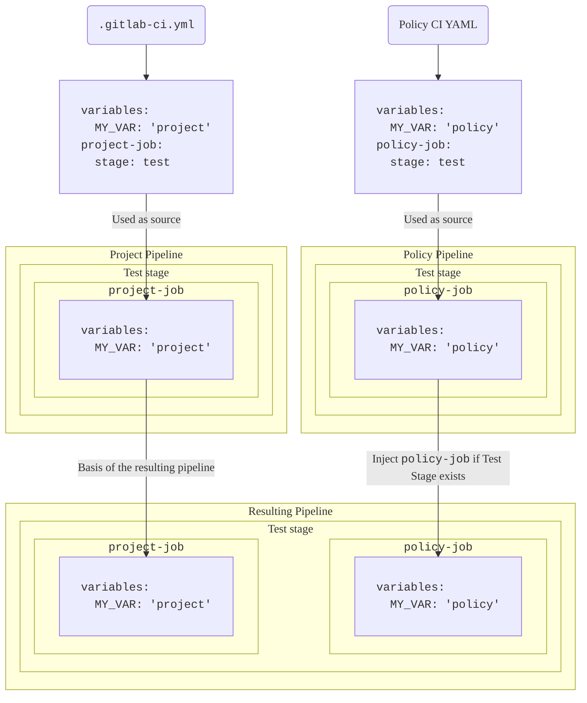

DETAILS:
**Tier:** Ultimate
**Offering:** GitLab.com, GitLab Self-Managed, GitLab Dedicated

> - [Introduced](https://gitlab.com/groups/gitlab-org/-/epics/13266) in GitLab 17.2 [with a flag](../../../administration/feature_flags.md) named `pipeline_execution_policy_type`. Enabled by default.
> - [Generally available](https://gitlab.com/gitlab-org/gitlab/-/issues/454278) in GitLab 17.3. Feature flag `pipeline_execution_policy_type` removed.

Use Pipeline execution policies to enforce CI/CD jobs for all applicable projects.

- <i class="fa fa-youtube-play youtube" aria-hidden="true"></i> For a video walkthrough, see [Security Policies: Pipeline Execution Policy Type](https://www.youtube.com/watch?v=QQAOpkZ__pA).

## Pipeline execution policies schema

> - [Enabled](https://gitlab.com/gitlab-org/gitlab/-/merge_requests/159858) the `suffix` field in GitLab 17.4.
> - [Changed](https://gitlab.com/gitlab-org/gitlab/-/merge_requests/165096) pipeline execution so later stages wait for the `.pipeline-policy-pre` stage to complete in GitLab 17.7. [with a flag](../../../administration/feature_flags.md) named `ensure_pipeline_policy_pre_stage_complete`. Disabled by default.

The YAML file with pipeline execution policies consists of an array of objects matching pipeline execution
policy schema nested under the `pipeline_execution_policy` key. You can configure a maximum of five
policies under the `pipeline_execution_policy` key per security policy project. Any other policies configured after
the first five are not applied.

When you save a new policy, GitLab validates its contents against [this JSON schema](https://gitlab.com/gitlab-org/gitlab/-/blob/master/ee/app/validators/json_schemas/security_orchestration_policy.json).
If you're not familiar with how to read [JSON schemas](https://json-schema.org/),
the following sections and tables provide an alternative.

| Field | Type | Required | Description |
|-------|------|----------|-------------|
| `pipeline_execution_policy` | `array` of pipeline execution policy | true | List of pipeline execution policies (maximum five) |

## Pipeline execution policy schema

| Field | Type | Required | Description |
|-------|------|----------|-------------|
| `name` | `string` | true | Name of the policy. Maximum of 255 characters.|
| `description` (optional) | `string` | true | Description of the policy. |
| `enabled` | `boolean` | true | Flag to enable (`true`) or disable (`false`) the policy. |
| `content` | `object` of [`content`](#content-type) | true | Reference to the CI/CD configuration to inject into project pipelines. |
| `pipeline_config_strategy` | `string` | false | Can either be `inject_ci` or `override_project_ci`. See [Pipeline strategies](#pipeline-strategies) for more information. |
| `policy_scope` | `object` of [`policy_scope`](_index.md#scope) | false | Scopes the policy based on projects, groups, or compliance framework labels you specify. |
| `suffix` | `string` | false | Can either be `on_conflict` (default), or `never`. Defines the behavior for handling job naming conflicts. `on_conflict` applies a unique suffix to the job names for jobs that would break the uniqueness. `never` causes the pipeline to fail if the job names across the project and all applicable policies are not unique. |
| `skip_ci` | `object` of [`skip_ci`](pipeline_execution_policies.md#skip_ci-type) | false | Defines whether users can apply the `skip-ci` directive. By default, the use of `skip-ci` is ignored and as a result, pipelines with pipeline execution policies cannot be skipped. |

Note the following:

- Users triggering a pipeline must have at least read access to the pipeline execution file specified in the pipeline execution policy, otherwise the pipelines do not start.
- If the pipeline execution file gets deleted or renamed, the pipelines in projects with the policy enforced might stop working.
- Pipeline execution policy jobs can be assigned to one of the two reserved stages:
  - `.pipeline-policy-pre` at the beginning of the pipeline, before the `.pre` stage.
  - `.pipeline-policy-post` at the very end of the pipeline, after the `.post` stage.
- Injecting jobs in any of the reserved stages is guaranteed to always work. Execution policy jobs can also be assigned to any standard (build, test, deploy) or user-declared stages. However, in this case, the jobs may be ignored depending on the project pipeline configuration.
- It is not possible to assign jobs to reserved stages outside of a pipeline execution policy.
- Regardless of the `needs` keyword, all jobs in a pipeline must wait until the `.pipeline-policy-pre` stage is complete before they start processing.
- Choose unique job names for pipeline execution policies. Some CI/CD configurations are based on job names, which can lead to unwanted results if a job name exists multiple times in the same pipeline. For example, the `needs` keyword makes one job dependent on another. If the are multiple jobs with the name `example`, a job that `needs` the `example` job name depend on only one of the `example` job instance at random.
- Pipeline execution policies remain in effect even if the project lacks a CI/CD configuration file.
- The order of the policies matters for the applied suffix.
- If any policy applied to a given project has `suffix: never`, the pipeline fails if another job with the same name is already present in the pipeline.
- Pipeline execution policies are enforced on all branches and pipeline sources. You can use [workflow rules](../../../ci/yaml/workflow.md) to control when pipeline execution policies are enforced.

### Job naming best practice

> - Naming conflict handling [introduced](https://gitlab.com/gitlab-org/gitlab/-/issues/473189) in GitLab 17.4.

There is no visible indicator for jobs coming from a security policy. Adding a unique prefix or suffix to job names makes it easier to identify them and avoid job name collisions.

Examples:

- `policy1:deployments:sast` - good, unique across policies and projects.
- `sast` - bad, likely to be used elsewhere.

Pipeline execution policies handles naming conflicts depending on the `suffix` attribute. If there are multiple name with the same job:

- Using `on_conflict` (default), a suffix is added to a job if its name conflicts with another job in the pipeline.
- Using `never`, no suffix is added in case of conflicts and the pipeline fails.

The suffix is added based on the order in which the jobs are merged onto the main pipeline.

The order is as follows:

1. Project pipeline jobs
1. Project policy jobs (if applicable)
1. Group policy jobs (if applicable, ordered by hierarchy, the most top-level group is applied as last)

The applied suffix has the following format:

`:policy-<security-policy-project-id>-<policy-index>`.

Example of the resulting job: `sast:policy-123456-0`.

If multiple policies in on security policy project define the same job name, the numerical suffix corresponds to the index of the conflicting policy.

Example of the resulting jobs:

- `sast:policy-123456-0`
- `sast:policy-123456-1`

### Job stage best practice

Jobs defined in a pipeline execution policy can use any [stage](../../../ci/yaml/_index.md#stage)
defined in the project's CI/CD configuration, also the reserved stages `.pipeline-policy-pre` and
`.pipeline-policy-post`.

NOTE:
If your policy contains jobs only in the `.pre` and `.post` stages, the policy's pipeline is
evaluated as "empty" and so is not merged with the project's pipeline. To use `.pre` and `.post`
stages in a pipeline execution policy, you **must** include another job running in another stage
which is available on the project, for example `.pipeline-policy-pre`.

When using the `inject_ci` [pipeline strategy](#pipeline-strategies), if a target project does not
contain its own `.gitlab-ci.yml` file, then the only stages available are the default pipeline
stages and the reserved stages.

When enforcing pipeline execution policies over projects whose CI/CD configuration you do not
control, you should define jobs in the `.pipeline-policy-pre` and `.pipeline-policy-post` stages.
These stages are always available, regardless of any project's CI/CD configuration.

When you use the `override_project_ci` [pipeline strategy](#pipeline-strategies) with multiple
pipeline execution policies and with custom stages, the stages must be defined in the same relative order
to be compatible with each other:

Valid configuration example:

```yaml
  - `override-policy-1` stages: `[build, test, policy-test, deploy]`
  - `override-policy-2` stages: `[test, deploy]`
```

Invalid configuration example:

```yaml
  - `override-policy-1` stages: `[build, test, policy-test, deploy]`
  - `override-policy-2` stages: `[deploy, test]`
```

The pipeline fails if one or more `override_project_ci` policies has an invalid `stages` configuration.

### `content` type

| Field | Type | Required | Description |
|-------|------|----------|-------------|
| `project` | `string` | true | The full GitLab project path to a project on the same GitLab instance. |
| `file` | `string` | true | A full file path relative to the root directory (/). The YAML files must have the `.yml` or `.yaml` extension. |
| `ref` | `string` | false | The ref to retrieve the file from. Defaults to the HEAD of the project when not specified. |

Use the `content` type in a policy to reference a CI/CD configuration stored in another repository.
This allows you to reuse the same CI/CD configuration across multiple policies, reducing the
overhead of maintaining these configurations. For example, if you have a custom secret detection
CI/CD configuration you want to enforce in policy A and policy B, you can create a single YAML configuration file and reference the configuration in both policies.

Prerequisites:

- Users triggering pipelines run in those projects on which a policy containing the `content` type
  is enforced must have at minimum read-only access to the project containing the CI/CD
- In projects that enforce pipeline execution policies, users must have at least read-only access to the project that contains the CI/CD configuration to trigger the pipeline.

  In GitLab 17.4 and later, you can grant the required read-only access for the CI/CD configuration file
  specified in a security policy project using the `content` type. To do so, enable the setting **Pipeline execution policies** in the general settings of the security policy project.
  Enabling this setting grants the user who triggered the pipeline access to
  read the CI/CD configuration file enforced by the pipeline execution policy. This setting does not grant the user access to any other parts of the project where the configuration file is stored.

### `skip_ci` type

> - [Introduced](https://gitlab.com/gitlab-org/gitlab/-/merge_requests/173480) in GitLab 17.7.

Pipeline execution policies offer control over who can use the `[skip ci]` directive. You can specify certain users or service accounts that are allowed to use `[skip ci]` while still ensuring critical security and compliance checks are performed.

Use the `skip_ci` keyword to specify whether users are allowed to apply the `skip_ci` directive to skip the pipelines.
When the keyword is not specified, the `skip_ci` directive is ignored, preventing all users
from bypassing the pipeline execution policies.

| Field                   | Type     | Possible values          | Description |
|-------------------------|----------|--------------------------|-------------|
| `allowed` | `boolean`   | `true`, `false` | Flag to allow (`true`) or prevent (`false`) the use of the `skip-ci` directive for pipelines with enforced pipeline execution policies. |
| `allowlist`             | `object` | `users` | Specify users who are always allowed to use `skip-ci` directive, regardless of the `allowed` flag. Use `users:` followed by an array of objects with `id` keys representing user IDs. |

### Policy scope schema

To customize policy enforcement, you can define a policy's scope to either include, or exclude,
specified projects, groups, or compliance framework labels. For more details, see
[Scope](_index.md#scope).

## Pipeline strategies

Pipeline configuration strategy defines the method for merging the policy configuration with the project pipeline. Pipeline execution policies execute the jobs defined in the `.gitlab-ci.yml` file in isolated pipelines, which are merged into the pipelines of the target projects.

### `inject_ci`

This strategy adds custom CI/CD configurations into the existing project pipeline without completely replacing the project's original CI/CD configuration. It is suitable when you want to enhance or extend the current pipeline with additional steps, such as adding new security scans, compliance checks, or custom scripts.

Having multiple policies enabled injects all jobs additively.

When using this strategy, a project CI/CD configuration cannot override any behavior defined in the policy pipelines because each pipeline has an isolated YAML configuration.

For projects without a `.gitlab-ci.yml` file, this strategy will create the `.gitlab-ci.yml` file
implicitly. That is, a pipeline containing only the jobs defined in the pipeline execution policy is
executed.

NOTE:
When a pipeline execution policy uses workflow rules that prevent policy jobs from running, the only jobs that
run are the project's CI/CD jobs. If the project uses workflow rules that prevent project CI/CD jobs from running,
the only jobs that run are the pipeline execution policy jobs.

### `override_project_ci`

> - Updated handling of workflow rules [introduced](https://gitlab.com/gitlab-org/gitlab/-/merge_requests/175088) in GitLab 17.8 [with a flag](../../../administration/feature_flags.md) named `policies_always_override_project_ci`. Enabled by default.

This strategy replaces the project's existing CI/CD configuration with a new one defined by the pipeline execution policy. This strategy is ideal when the entire pipeline needs to be standardized or replaced, like when you want to enforce organization-wide CI/CD standards or compliance requirements in a highly regulated industry. To override the pipeline configuration, define the CI/CD jobs and do not use `include:project`.

The strategy takes precedence over other policies that use the `inject_ci` strategy. If a policy with `override_project_ci` applies, the project CI/CD configuration is ignored. However, other security policy configurations are not overridden.

Alternatively, you can merge the project's CI/CD configuration with the project's `.gitlab-ci.yml` instead of overriding it. To merge the configuration, use `include:project`. This strategy allows users to include the project CI/CD configuration in the pipeline execution policy configuration, enabling the users to customize the policy jobs. For example, they can combine the policy and project CI/CD configuration into one YAML file to override the `before_script` configuration or define required variables, such as `CS_IMAGE`, to define the required path to the container to scan. Here's a [short demo](https://youtu.be/W8tubneJ1X8) of this behavior.
The following diagram illustrates how variables defined at the project and policy levels are selected in the resulting pipeline:



NOTE:
When a pipeline execution policy uses workflow rules that prevent policy jobs from running, the
project's original CI/CD configuration remains in effect instead of being overridden. You can
conditionally apply pipeline execution policies to control when the policy impacts the project's
CI/CD configuration. For example, if you set a workflow rule `if: $CI_PIPELINE_SOURCE ==
"merge_request_event"`, the project's CI/CD configuration is only overridden when the pipeline source
is a merge request event. However, if the feature flag `policies_always_override_project_ci` is enabled,
the workflow rules in the pipeline execution policy also override the project's original CI/CD configuration.
As a result, if workflow rules cause the pipeline execution policy to be filtered out, no pipeline is created.

### Include a project's CI/CD configuration in the pipeline execution policy configuration

When using `override_project_ci` strategy, the project configuration can be included into the pipeline execution policy configuration:

```yaml
include:
  - project: $CI_PROJECT_PATH
    ref: $CI_COMMIT_SHA
    file: $CI_CONFIG_PATH

compliance_job:
 ...
```

## CI/CD variables

Pipeline execution jobs are executed in isolation. Variables defined in another policy or in the project's `.gitlab-ci.yml` file are not available in the pipeline execution policy
and cannot be overwritten from the outside.

Variables can be shared with pipeline execution policies using group or project settings, which follow the standard [CI/CD variable precedence](../../../ci/variables/_index.md#cicd-variable-precedence) rules. However, the precedence rules are more complex when using a pipeline execution policy as they can vary depending on the pipeline execution policy strategy:

- `inject_ci` strategy: If the variable is defined in the pipeline execution policy, the job always uses this value. If a variable is not defined in a pipeline execution policy, the job applies the value from the group or project settings.
- `override_project_ci` strategy: All jobs in the resulting pipeline are treated as policy jobs. Variables defined in the policy (including those in included files) take precedence over project and group variables. This means that variables from jobs in the CI/CD configuration of the included project take precedence over the variables defined in the project and group settings.

For more details on variable in pipeline execution policies, see [precedence of variable in pipeline execution policies](#precedence-of-variables-in-pipeline-execution-policies).

You can [define project or group variables in the UI](../../../ci/variables/_index.md#define-a-cicd-variable-in-the-ui).

### Precedence of variables in pipeline execution policies

When using pipeline execution policies, especially with the `override_project_ci` strategy, the precedence of variable values defined in multiple places can differ from standard GitLab CI/CD pipelines. These are some important points to understand:

- When using `override_project_ci`, all jobs in the resulting pipeline are considered policy jobs, including those from the CI/CD configurations of included projects.
- Variables defined in a policy pipeline (for the entire instance or for a job) take precedence over variables defined in the project or group settings.
- This behavior applies to all jobs, including those included from the project's CI/CD configuration file (`.gitlab-ci.yml`).

### Example

If a variable in a project's CI/CD configuration and a job variable defined in an included `.gitlab-ci.yml` file have the same name, the job variable takes precedence when using `override_project_ci`.

In the project's CI/CD settings, a `MY_VAR` variable is defined:

- Key: `MY_VAR`
- Value: `Project configuration variable value`

In `.gitlab-ci.yml` of the included project, the same variable is defined:

```yaml
project-job:
  variables:
    MY_VAR: "Project job variable value"
  script:
    - echo $MY_VAR  # This will output "Project job variable value"
```

In this case, the job variable value `Project job variable value` takes precedence.

## Behavior with `[skip ci]`

By default, to prevent a regular pipeline from triggering, users can push a commit to a protected branch with `[skip ci]` in the commit message. However, jobs defined with a pipeline execution policy are always triggered, as the policy ignores the `[skip ci]` directive. This prevents developers from skipping the execution of jobs defined in the policy, which ensures that critical security and compliance checks are always performed.

For more flexible control over `[skip ci]` behavior, see the [`skip_ci` type](#skip_ci-type) section.

## Interaction with scan execution policies

When you use pipeline execution policies with the `override_ci` strategy, be aware that this can affect the behavior of [scan execution policies](scan_execution_policies.md):

- The scan execution policy may be overridden if both pipeline execution policies and scan execution policies are configured for a project, and the pipeline execution policy uses the `override_ci` strategy.

This is because the `override_ci` strategy removes all CI/CD configuration that is defined on the project level, including policies.

To ensure that both pipeline execution policies and scan execution policies are applied:

- Consider using a different strategy for pipeline execution policies, such as `inject_ci`.
- If you must use `override_ci`, include the scanner templates that you require in your pipeline execution policy to maintain the desired security scans.

Support for improvements in the integration between these policy types is proposed in [issue 504434](https://gitlab.com/gitlab-org/gitlab/-/issues/504434).

## Examples

These examples demonstrate what you can achieve with pipeline execution policies.

### Pipeline execution policy

You can use the following example in a `.gitlab/security-policies/policy.yml` file stored in a
[security policy project](_index.md#security-policy-project):

```yaml
---
pipeline_execution_policy:
- name: My pipeline execution policy
  description: Enforces CI/CD jobs
  enabled: true
  pipeline_config_strategy: override_project_ci
  content:
    include:
    - project: verify-issue-469027/policy-ci
      file: policy-ci.yml
      ref: main # optional
  policy_scope:
    projects:
      including:
      - id: 361
```

### Customize enforced jobs based on project variables

You can customize enforced jobs, based on the presence of a project variable. In this example,
the value of `CS_IMAGE` is defined in the policy as `alpine:latest`. However, if the project
also defines the value of `PROJECT_CS_IMAGE`, that value is used instead. The CI/CD variable must be a
predefined project variable, not defined in the project's `.gitlab-ci.yml` file.

```yaml
variables:
  CS_ANALYZER_IMAGE: "$CI_TEMPLATE_REGISTRY_HOST/security-products/container-scanning:7"
  CS_IMAGE: alpine:latest

policy::container-security:
  stage: .pipeline-policy-pre
  rules:
    - if: $PROJECT_CS_IMAGE
      variables:
        CS_IMAGE: $PROJECT_CS_IMAGE
    - when: always
  script:
    - echo "CS_ANALYZER_IMAGE:$CS_ANALYZER_IMAGE"
    - echo "CS_IMAGE:$CS_IMAGE"
```

### Customize security scanner's behavior with `before_script` in project configurations

To customize the behavior of a security job enforced by a policy in the project's `.gitlab-ci.yml`, you can override `before_script`.
To do so, use the `override_project_ci` strategy in the policy and include the project's CI/CD configuration. Example pipeline execution policy configuration:

```yaml
# policy.yml
type: pipeline_execution_policy
name: Secret detection
description: >-
  This policy enforces secret detection and allows projects to override the
  behavior of the scanner.
enabled: true
pipeline_config_strategy: override_project_ci
content:
  include:
    - project: gitlab-org/pipeline-execution-policies/compliance-project
      file: secret-detection.yml
```

```yaml
# secret-detection.yml
include:
  - project: $CI_PROJECT_PATH
    ref: $CI_COMMIT_SHA
    file: $CI_CONFIG_PATH
  - template: Jobs/Secret-Detection.gitlab-ci.yml
```

In the project's `.gitlab-ci.yml`, you can define `before_script` for the scanner:

```yaml
include:
  - template: Jobs/Secret-Detection.gitlab-ci.yml

secret_detection:
  before_script:
    - echo "Before secret detection"
```

By using `override_project_ci` and including the project's configuration, it allows for YAML configurations to be merged.

### Use group or project variables in a pipeline execution policy

You can use group or project variables in a pipeline execution policy.

With a project variable of `PROJECT_VAR="I'm a project"` the following pipeline execution policy job results in: `I'm a project`.

```yaml
pipeline execution policy job:
    stage: .pipeline-policy-pre
    script:
    - echo "$PROJECT_VAR"
```

### Enforce a variable's value by using a pipeline execution policy

The value of a variable defined in a pipeline execution policy overrides the value of a group or policy variable with the same name.
In this example, the project value of variable `PROJECT_VAR` is overwritten and the job results in: `I'm a pipeline execution policy`.

```yaml
variables:
  PROJECT_VAR: "I'm a pipeline execution policy"

pipeline execution policy job:
    stage: .pipeline-policy-pre
    script:
    - echo "$PROJECT_VAR"
```

### Example `policy.yml` with security policy scopes

In this example, the security policy's `policy_scope`:

- Includes any project with compliance frameworks with an ID of `9` applied to them.
- Excludes projects with an ID of `456`.

```yaml
pipeline_execution_policy:
- name: Pipeline execution policy
  description: ''
  enabled: true
  pipeline_config_strategy: inject_ci
  content:
    include:
    - project: my-group/pipeline-execution-ci-project
      file: policy-ci.yml
  policy_scope:
    compliance_frameworks:
    - id: 9
    projects:
      excluding:
      - id: 456
```

### Configure `ci_skip` in a pipeline execution policy

In the following example, the pipeline execution policy is enforced, and [skipping CI](#skip_ci-type) is disallowed except for the user with ID `75`.

```yaml
pipeline_execution_policy:
  - name: My pipeline execution policy with ci.skip exceptions
    description: 'Enforces CI/CD jobs'
    enabled: true
    pipeline_config_strategy: inject_ci
    content:
      include:
        - project: group-a/project1
          file: README.md
    skip_ci:
      allowed: false
      allowlist:
        users:
          - id: 75
```
