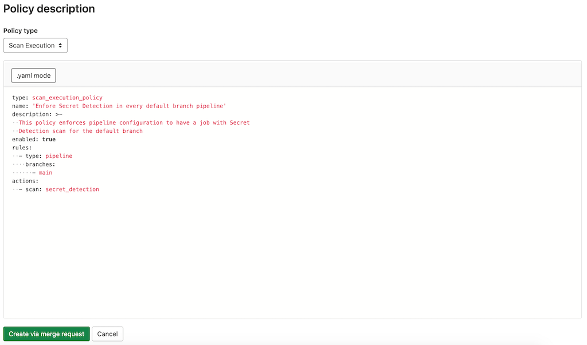

# Scan execution policies **(ULTIMATE)**

> Group-level security policies were [introduced](https://gitlab.com/groups/gitlab-org/-/epics/4425) in GitLab 15.2 [with a flag](../../../administration/feature_flags.md) named `group_level_security_policies`. Enabled by default.

Group, sub-group, or project owners can use scan execution policies to require that security scans run on a specified
schedule or with the project (or multiple projects if the policy is defined at a group or sub-group level) pipeline. Required scans are injected into the CI pipeline as new jobs
with a long, random job name. In the unlikely event of a job name collision, the security policy job overwrites
any pre-existing job in the pipeline. If a policy is created at the group-level, it will apply to every child
project or sub-group. A group-level policy cannot be edited from a child project or sub-group.

This feature has some overlap with [compliance framework pipelines](../../project/settings/#compliance-pipeline-configuration),
as we have not [unified the user experience for these two features](https://gitlab.com/groups/gitlab-org/-/epics/7312).
For details on the similarities and differences between these features, see
[Enforce scan execution](../#enforce-scan-execution).

NOTE:
Policy jobs are created in the `test` stage of the pipeline. If you modify the default pipeline
[`stages`](../../../ci/yaml/index.md#stages),
you must ensure that the `test` stage exists in the list. Otherwise, the pipeline fails to run and
an error appears that states `chosen stage does not exist`.

## Scan execution policy editor

NOTE:
Only group, sub-group, or project Owners have the [permissions](../../permissions.md#project-members-permissions)
to select Security Policy Project.

Once your policy is complete, save it by selecting **Create via merge request**
at the bottom of the editor. You are redirected to the merge request on the project's
configured security policy project. If one does not link to your project, a security
policy project is automatically created. Existing policies can also be
removed from the editor interface by selecting **Delete policy**
at the bottom of the editor.

Most policy changes take effect as soon as the merge request is merged. Any changes that
do not go through a merge request and are committed directly to the default branch may require up to 10 minutes
before the policy changes take effect.



The policy editor currently only supports the YAML mode. The Rule mode is tracked in the [Allow Users to Edit Rule-mode Scan Execution Policies in the Policy UI](https://gitlab.com/groups/gitlab-org/-/epics/5363) epic.

## Scan execution policies schema

The YAML file with scan execution policies consists of an array of objects matching scan execution
policy schema nested under the `scan_execution_policy` key. You can configure a maximum of 5
policies under the `scan_execution_policy` key. Any other policies configured after
the first 5 are not applied.

When you save a new policy, GitLab validates its contents against [this JSON schema](https://gitlab.com/gitlab-org/gitlab/-/blob/master/ee/app/validators/json_schemas/security_orchestration_policy.json).
If you're not familiar with how to read [JSON schemas](https://json-schema.org/),
the following sections and tables provide an alternative.

| Field | Type | Possible values | Description |
|-------|------|-----------------|-------------|
| `scan_execution_policy` | `array` of scan execution policy |  | List of scan execution policies (maximum 5) |

## Scan execution policy schema

| Field | Type | Possible values | Description |
|-------|------|-----------------|-------------|
| `name` | `string` |  | Name of the policy. Maximum of 255 characters.|
| `description` (optional) | `string` |  | Description of the policy. |
| `enabled` | `boolean` | `true`, `false` | Flag to enable (`true`) or disable (`false`) the policy. |
| `rules` | `array` of rules |  | List of rules that the policy applies. |
| `actions` | `array` of actions |  | List of actions that the policy enforces. |

## `pipeline` rule type

This rule enforces the defined actions whenever the pipeline runs for a selected branch.

| Field | Type | Possible values | Description |
|-------|------|-----------------|-------------|
| `type` | `string` | `pipeline` | The rule's type. |
| `branches` | `array` of `string` | `*` or the branch's name | The branch the given policy applies to (supports wildcard). |

## `schedule` rule type

This rule enforces the defined actions and schedules a scan on the provided date/time.

| Field      | Type | Possible values | Description |
|------------|------|-----------------|-------------|
| `type`     | `string` | `schedule` | The rule's type. |
| `branches` | `array` of `string` | `*` or the branch's name | The branch the given policy applies to (supports wildcard). |
| `cadence`  | `string` | CRON expression (for example, `0 0 * * *`) | A whitespace-separated string containing five fields that represents the scheduled time. <!--- start_remove The following content will be removed on remove_date: '2022-08-22' --> |
| `clusters` (removed) | `object` | | This field was [removed](https://gitlab.com/gitlab-org/gitlab/-/issues/356465) in 15.0. The cluster where the given policy enforces running selected scans (only for `container_scanning`/`cluster_image_scanning` scans). The key of the object is the name of the Kubernetes cluster configured for your project in GitLab. In the optionally provided value of the object, you can precisely select Kubernetes resources that are scanned. <!--- end_remove --> |

GitLab supports the following types of CRON syntax for the `cadence` field:

- A daily cadence of once per hour at a specified hour, for example: `0 18 * * *`
- A weekly cadence of once per week on a specified day and at a specified hour, for example: `0 13 * * 0`

It is possible that other elements of the CRON syntax will work in the cadence field, however, GitLab does not officially test or support them.

<!--- start_remove The following content will be removed on remove_date: '2022-08-22' -->

### `cluster` schema (removed)

This schema was [removed](https://gitlab.com/gitlab-org/gitlab/-/issues/356465) in 15.0.

Use this schema to define `clusters` objects in the [`schedule` rule type](#schedule-rule-type).

| Field        | Type                | Possible values          | Description |
|--------------|---------------------|--------------------------|-------------|
| `containers` | `array` of `string` | | The container name that is scanned (only the first value is currently supported). |
| `resources`  | `array` of `string` | | The resource name that is scanned (only the first value is currently supported). |
| `namespaces` | `array` of `string` | | The namespace that is scanned (only the first value is currently supported). |
| `kinds`      | `array` of `string` | `deployment`/`daemonset` | The resource kind that should be scanned (only the first value is currently supported). |

<!--- end_remove -->

## `scan` action type

This action executes the selected `scan` with additional parameters when conditions for at least one
rule in the defined policy are met.

| Field | Type | Possible values | Description |
|-------|------|-----------------|-------------|
| `scan` | `string` | `dast`, `secret_detection`, `sast`, `container_scanning`, `cluster_image_scanning` | The action's type. |
| `site_profile` | `string` | Name of the selected [DAST site profile](../dast/index.md#site-profile). | The DAST site profile to execute the DAST scan. This field should only be set if `scan` type is `dast`. |
| `scanner_profile` | `string` or `null` | Name of the selected [DAST scanner profile](../dast/index.md#scanner-profile). | The DAST scanner profile to execute the DAST scan. This field should only be set if `scan` type is `dast`.|
| `variables` | `object` | | A set of CI variables, supplied as an array of `key: value` pairs, to apply and enforce for the selected scan. The `key` is the variable name, with its `value` provided as a string. This parameter supports any variable that the GitLab CI job supports for the specified scan. |

Note the following:

- You must create the [site profile](../dast/index.md#site-profile) and [scanner profile](../dast/index.md#scanner-profile)
  with selected names for each project that is assigned to the selected Security Policy Project.
  Otherwise, the policy is not applied and a job with an error message is created instead.
- Once you associate the site profile and scanner profile by name in the policy, it is not possible
  to modify or delete them. If you want to modify them, you must first disable the policy by setting
  the `active` flag to `false`.
- When configuring policies with a scheduled DAST scan, the author of the commit in the security
  policy project's repository must have access to the scanner and site profiles. Otherwise, the scan
  is not scheduled successfully.
- For a secret detection scan, only rules with the default ruleset are supported. [Custom rulesets](../secret_detection/index.md#custom-rulesets)
  are not supported.
- A secret detection scan runs in `normal` mode when executed as part of a pipeline, and in
  [`historic`](../secret_detection/index.md#full-history-secret-detection)
  mode when executed as part of a scheduled scan.
- A container scanning and cluster image scanning scans configured for the `pipeline` rule type ignores the cluster defined in the `clusters` object.
  They use predefined CI/CD variables defined for your project. Cluster selection with the `clusters` object is supported for the `schedule` rule type.
  A cluster with a name provided in the `clusters` object must be created and configured for the project.
- The SAST scan uses the default template and runs in a [child pipeline](../../../ci/pipelines/parent_child_pipelines.md).

## Example security policies project

You can use this example in a `.gitlab/security-policies/policy.yml` file stored in a
[security policy project](index.md#security-policy-project):

```yaml
---
scan_execution_policy:
- name: Enforce DAST in every release pipeline
  description: This policy enforces pipeline configuration to have a job with DAST scan for release branches
  enabled: true
  rules:
  - type: pipeline
    branches:
    - release/*
  actions:
  - scan: dast
    scanner_profile: Scanner Profile A
    site_profile: Site Profile B
- name: Enforce DAST and secret detection scans every 10 minutes
  description: This policy enforces DAST and secret detection scans to run every 10 minutes
  enabled: true
  rules:
  - type: schedule
    branches:
    - main
    cadence: "*/10 * * * *"
  actions:
  - scan: dast
    scanner_profile: Scanner Profile C
    site_profile: Site Profile D
  - scan: secret_detection
- name: Enforce Secret Detection and Container Scanning in every default branch pipeline
  description: This policy enforces pipeline configuration to have a job with Secret Detection and Container Scanning scans for the default branch
  enabled: true
  rules:
  - type: pipeline
    branches:
    - main
  actions:
  - scan: secret_detection
  - scan: sast
    variables:
      SAST_EXCLUDED_ANALYZERS: brakeman
  - scan: container_scanning
```

In this example:

- For every pipeline executed on branches that match the `release/*` wildcard (for example, branch
  `release/v1.2.1`), DAST scans run with `Scanner Profile A` and `Site Profile B`.
- DAST and secret detection scans run every 10 minutes. The DAST scan runs with `Scanner Profile C`
  and `Site Profile D`.
- Secret detection, container scanning, and SAST scans run for every pipeline executed on the `main`
  branch. The SAST scan runs with the `SAST_EXCLUDED_ANALYZER` variable set to `"brakeman"`.
- Cluster Image Scanning scan runs every 24h. The scan runs on the `production-cluster` cluster and fetches vulnerabilities
  from the container with the name `database` configured for deployment with the name `production-application` in the `production-namespace` namespace.

## Example for scan execution policy editor

You can use this example in the YAML mode of the [scan execution policy editor](#scan-execution-policy-editor).
It corresponds to a single object from the previous example.

```yaml
name: Enforce Secret Detection and Container Scanning in every default branch pipeline
description: This policy enforces pipeline configuration to have a job with Secret Detection and Container Scanning scans for the default branch
enabled: true
rules:
  - type: pipeline
    branches:
      - main
actions:
  - scan: secret_detection
  - scan: container_scanning
```
