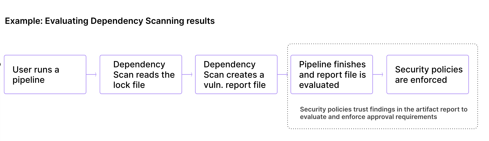

# Merge request approval policies

DETAILS:
**Tier:** Ultimate
**Offering:** GitLab.com, Self-managed, GitLab Dedicated

> - Group-level scan result policies [introduced](https://gitlab.com/groups/gitlab-org/-/epics/7622) in GitLab 15.6.
> - Scan result policies feature was renamed to merge request approval policies in GitLab 16.9.

NOTE:
Scan result policies feature was renamed to merge request approval policies in GitLab 16.9.

Use merge request approval policies to enforce project-level settings and approval rules based on scan results. For example, one type of scan
result policy is a security approval policy that allows approval to be required based on the
findings of one or more security scan jobs. Merge request approval policies are evaluated after a CI scanning job is fully executed and both vulnerability and license type policies are evaluated based on the job artifact reports that are published in the completed pipeline.

NOTE:
Merge request approval policies are applicable only to [protected](../../project/protected_branches.md) target branches.

NOTE:
When a protected branch is created or deleted, the policy approval rules synchronize, with a delay of 1 minute.

The following video gives you an overview of GitLab merge request approval policies (previously scan result policies):

<div class="video-fallback">
  See the video: <a href="https://youtu.be/w5I9gcUgr9U">Overview of GitLab Scan Result Policies</a>.
</div>
<figure class="video-container">
  <iframe src="https://www.youtube-nocookie.com/embed/w5I9gcUgr9U" frameborder="0" allowfullscreen> </iframe>
</figure>

## Requirements and limitations

- You must add the respective [security scanning tools](../index.md#application-coverage).
  Otherwise, merge request approval policies cannot get evaluated and the corresonding approvals stay required.
- The maximum number of merge request approval policies is five per security policy project.
- Each policy can have a maximum of five rules.
- All configured scanners must be present in the merge request's latest pipeline. If not, approvals are required even if some vulnerability criteria have not been met.
- Merge request approval policies evaluate findings and determine approval requirements based on the job artifact reports published in a completed pipeline. However, merge request approval policies do not check the integrity or authenticity of the scan results generated in the artifact reports.

## Merge request with multiple pipelines

> - [Introduced](https://gitlab.com/gitlab-org/gitlab/-/issues/379108) in GitLab 16.2 [with a flag](../../../administration/feature_flags.md) named `multi_pipeline_scan_result_policies`. Disabled by default.
> - [Generally available](https://gitlab.com/gitlab-org/gitlab/-/issues/409482) in GitLab 16.3. Feature flag `multi_pipeline_scan_result_policies` removed.
> - Support for parent-child pipelines [introduced](https://gitlab.com/gitlab-org/gitlab/-/issues/428591) in GitLab 16.11 [with a flag](../../../administration/feature_flags.md) named `approval_policy_parent_child_pipeline`. Disabled by default.

FLAG:
On self-managed GitLab, by default support for parent-child pipelines is not available. To make it available, an administrator can [enable the feature flag](../../../administration/feature_flags.md) named `approval_policy_parent_child_pipeline`.
On GitLab.com and GitLab Dedicated, this feature is not available.

A project can have multiple pipeline types configured. A single commit can initiate multiple
pipelines, each of which may contain a security scan.

- In GitLab 16.3 and later, the results of all completed pipelines for the latest commit in
  the merge request's source and target branch are evaluated and used to enforce the merge request approval policy.
  On-demand DAST pipelines are not considered.
- In GitLab 16.2 and earlier, only the results of the latest completed pipeline were evaluated
  when enforcing merge request approval policies.

If a project uses [merge request pipelines](../../../ci/pipelines/merge_request_pipelines.md), you must use the [`latest` security templates](../../../development/cicd/templates.md) so that the security scanning jobs are present in the pipeline.
For more information see [Use security scanning tools with merge request pipelines](../index.md#use-security-scanning-tools-with-merge-request-pipelines).

## Merge request approval policy editor

> - [Introduced](https://gitlab.com/gitlab-org/gitlab/-/merge_requests/77814) in GitLab 14.8.
> - [Enabled by default](https://gitlab.com/gitlab-org/gitlab/-/issues/369473) in GitLab 15.6.

NOTE:
Only project Owners have the [permissions](../../permissions.md#project-members-permissions)
to select Security Policy Project.

Once your policy is complete, save it by selecting **Configure with a merge request** at the bottom of the
editor. This redirects you to the merge request on the project's configured security policy project.
If a security policy project doesn't link to your project, GitLab creates such a project for you.
Existing policies can also be removed from the editor interface by selecting **Delete policy** at
the bottom of the editor.

Most policy changes take effect as soon as the merge request is merged. Any changes that
do not go through a merge request and are committed directly to the default branch may require up to 10 minutes
before the policy changes take effect.

The [policy editor](index.md#policy-editor) supports YAML mode and rule mode.

NOTE:
Propagating merge request approval policies created for groups with a large number of projects take a while to complete.

## Merge request approval policies schema

The YAML file with merge request approval policies consists of an array of objects matching the merge request approval
policy schema nested under the `approval_policy` key. You can configure a maximum of five policies under the `approval_policy` key.

NOTE:
Merge request approval policies were defined under the `scan_result_policy` key. Until GitLab 17.0, policies can be
defined under both keys. Starting from GitLab 17.0, only `approval_policy` key is supported.

When you save a new policy, GitLab validates its contents against [this JSON schema](https://gitlab.com/gitlab-org/gitlab/-/blob/master/ee/app/validators/json_schemas/security_orchestration_policy.json).
If you're not familiar with how to read [JSON schemas](https://json-schema.org/),
the following sections and tables provide an alternative.

| Field             | Type                          | Required | Possible values | Description                               |
|-------------------|-------------------------------|----------|-----------------|-------------------------------------------|
| `approval_policy` | `array` of Merge Request Approval Policy | true     |                 | List of merge request approval policies (maximum 5). |

## Merge request approval policy schema

> - The `approval_settings` fields were [introduced](https://gitlab.com/gitlab-org/gitlab/-/issues/418752) in GitLab 16.4 [with flags](../../../administration/feature_flags.md) named `scan_result_policies_block_unprotecting_branches`, `scan_result_any_merge_request`, or `scan_result_policies_block_force_push`. See the `approval_settings` section below for more information.

| Field               | Type               | Required | Possible values | Description                                              |
|---------------------|--------------------|----------|-----------------|----------------------------------------------------------|
| `name`              | `string`           | true     |                 | Name of the policy. Maximum of 255 characters.           |
| `description`       | `string`           | false    |                 | Description of the policy.                               |
| `enabled`           | `boolean`          | true     | `true`, `false` | Flag to enable (`true`) or disable (`false`) the policy. |
| `rules`             | `array` of rules   | true     |                 | List of rules that the policy applies.                   |
| `actions`           | `array` of actions | false    |                 | List of actions that the policy enforces.                |
| `approval_settings` | `object`           | false    |                 | Project settings that the policy overrides.              |

## `scan_finding` rule type

> - The merge request approval policy field `vulnerability_attributes` was [introduced](https://gitlab.com/gitlab-org/gitlab/-/merge_requests/123052) in GitLab 16.2 [with a flag](../../../administration/feature_flags.md) named `enforce_vulnerability_attributes_rules`. [Generally available](https://gitlab.com/gitlab-org/gitlab/-/issues/418784) in GitLab 16.3. Feature flag removed.
> - The merge request approval policy field `vulnerability_age` was [introduced](https://gitlab.com/gitlab-org/gitlab/-/merge_requests/123956) in GitLab 16.2.
> - The `branch_exceptions` field was [introduced](https://gitlab.com/gitlab-org/gitlab/-/issues/418741) in GitLab 16.3 [with a flag](../../../administration/feature_flags.md) named `security_policies_branch_exceptions`. [Generally available](https://gitlab.com/gitlab-org/gitlab/-/merge_requests/133753) in GitLab 16.5. Feature flag removed.

This rule enforces the defined actions based on security scan findings.

| Field | Type | Required | Possible values | Description |
|-------|------|----------|-----------------|-------------|
| `type` | `string` | true | `scan_finding` | The rule's type. |
| `branches` | `array` of `string` | true if `branch_type` field does not exist | `[]` or the branch's name | Applicable only to protected target branches. An empty array, `[]`, applies the rule to all protected target branches. Cannot be used with the `branch_type` field. |
| `branch_type` | `string` | true if `branches` field does not exist | `default` or `protected` | The types of protected branches the given policy applies to. Cannot be used with the `branches` field. Default branches must also be `protected`. |
| `branch_exceptions` | `array` of `string` | false |  Names of branches | Branches to exclude from this rule. |
| `scanners` | `array` of `string` | true | `sast`, `secret_detection`, `dependency_scanning`, `container_scanning`, `dast`, `coverage_fuzzing`, `api_fuzzing` | The security scanners for this rule to consider. `sast` includes results from both SAST and SAST IaC scanners. |
| `vulnerabilities_allowed` | `integer` | true | Greater than or equal to zero | Number of vulnerabilities allowed before this rule is considered. |
| `severity_levels` | `array` of `string` | true | `info`, `unknown`, `low`, `medium`, `high`, `critical` | The severity levels for this rule to consider. |
| `vulnerability_states` | `array` of `string` | true | `[]` or `newly_detected`, `detected`, `confirmed`, `resolved`, `dismissed`, `new_needs_triage`, `new_dismissed` | All vulnerabilities fall into two categories:<br><br>**Newly Detected Vulnerabilities** - the `newly_detected` policy option covers vulnerabilities identified in the merge request branch itself but that do not currently exist on the default branch. This policy option requires a pipeline to complete before the rule is evaluated so that it knows whether vulnerabilities are newly detected or not. Merge requests are blocked until the pipeline and necessary security scans are complete. The `newly_detected` option considers both of the following statuses:<br><br> • Detected<br> • Dismissed<br><br> The `new_needs_triage` option considers the status<br><br> • Detected<br><br> The `new_dismissed` option considers the status<br><br> • Dismissed<br><br>**Pre-Existing Vulnerabilities** - these policy options are evaluated immediately and do not require a pipeline complete as they consider only vulnerabilities previously detected in the default branch.<br><br> • `Detected` - the policy looks for vulnerabilities in the detected state.<br> • `Confirmed` - the policy looks for vulnerabilities in the confirmed state.<br> • `Dismissed` - the policy looks for vulnerabilities in the dismissed state.<br> • `Resolved` - the policy looks for vulnerabilities in the resolved state. <br><br>An empty array, `[]`, covers the same statuses as `newly_detected`. It is equivalent to specifying `['new_needs_triage', 'new_dismissed']`. |
| `vulnerability_attributes` | `object` | false | `{false_positive: boolean, fix_available: boolean}` | All vulnerability findings are considered by default. But filters can be applied for attributes to consider only vulnerability findings: <br><br> • With a fix available (`fix_available: true`)<br><br> • With no fix available (`fix_available: false`)<br> • That are false positive (`false_positive: true`)<br> • That are not false positive (`false_positive: false`)<br> • Or a combination of both. For example (`fix_available: true, false_positive: false`) |
| `vulnerability_age` | `object` | false | N/A | Filter pre-existing vulnerability findings by age. A vulnerability's age is calculated as the time since it was detected in the project. The criteria are `operator`, `value`, and  `interval`.<br>- The `operator` criterion specifies if the age comparison used is older than (`greater_than`) or younger than (`less_than`).<br>- The `value` criterion specifies the numeric value representing the vulnerability's age.<br>- The `interval` criterion specifies the unit of measure of the vulnerability's age: `day`, `week`, `month`, or `year`.<br><br>Example: `operator: greater_than`, `value: 30`, `interval: day`. |

## `license_finding` rule type

> - [Introduced](https://gitlab.com/groups/gitlab-org/-/epics/8092) in GitLab 15.9 [with a flag](../../../administration/feature_flags.md) named `license_scanning_policies`.
> - [Generally available](https://gitlab.com/gitlab-org/gitlab/-/issues/397644) in GitLab 15.11. Feature flag `license_scanning_policies` removed.
> - The `branch_exceptions` field was [introduced](https://gitlab.com/gitlab-org/gitlab/-/issues/418741) in GitLab 16.3 [with a flag](../../../administration/feature_flags.md) named `security_policies_branch_exceptions`. Enabled by default. [Generally available](https://gitlab.com/gitlab-org/gitlab/-/merge_requests/133753) in GitLab 16.5. Feature flag removed.

This rule enforces the defined actions based on license findings.

| Field                | Type                | Required                                   | Possible values              | Description |
|----------------------|---------------------|--------------------------------------------|------------------------------|-------------|
| `type`               | `string`            | true                                       | `license_finding`            | The rule's type. |
| `branches`           | `array` of `string` | true if `branch_type` field does not exist | `[]` or the branch's name    | Applicable only to protected target branches. An empty array, `[]`, applies the rule to all protected target branches. Cannot be used with the `branch_type` field. |
| `branch_type`        | `string`            | true if `branches` field does not exist    | `default` or `protected`     | The types of protected branches the given policy applies to. Cannot be used with the `branches` field. Default branches must also be `protected`. |
| `branch_exceptions`  | `array` of `string` | false                                      | Names of branches            | Branches to exclude from this rule. |
| `match_on_inclusion` | `boolean`           | true                                       | `true`, `false`              | **{warning}** **[Deprecated](https://gitlab.com/gitlab-org/gitlab/-/issues/424513)** in GitLab 16.9. Whether the rule matches inclusion or exclusion of licenses listed in `license_types`. When `false`, any detected licenses excluded from `license_types` require approval. |
| `license_types`      | `array` of `string` | true                                       | license types                | [SPDX license names](https://spdx.org/licenses) to match on, for example `Affero General Public License v1.0` or `MIT License`. |
| `license_states`     | `array` of `string` | true                                       | `newly_detected`, `detected` | Whether to match newly detected and/or previously detected licenses. The `newly_detected` state triggers approval when either a new package is introduced or when a new license for an existing package is detected. |

## `any_merge_request` rule type

> - The `branch_exceptions` field was [introduced](https://gitlab.com/gitlab-org/gitlab/-/issues/418741) in GitLab 16.3 [with a flag](../../../administration/feature_flags.md) named `security_policies_branch_exceptions`. Enabled by default. [Generally available](https://gitlab.com/gitlab-org/gitlab/-/merge_requests/133753) in GitLab 16.5. Feature flag removed.
> - The `any_merge_request` rule type was [introduced](https://gitlab.com/gitlab-org/gitlab/-/issues/418752) in GitLab 16.4. Enabled by default. [Generally available](https://gitlab.com/gitlab-org/gitlab/-/merge_requests/136298) in GitLab 16.6. Feature flag [removed](https://gitlab.com/gitlab-org/gitlab/-/issues/432127).

This rule enforces the defined actions for any merge request based on the commits signature.

| Field               | Type                | Required                                   | Possible values           | Description |
|---------------------|---------------------|--------------------------------------------|---------------------------|-------------|
| `type`              | `string`            | true                                       | `any_merge_request`       | The rule's type. |
| `branches`          | `array` of `string` | true if `branch_type` field does not exist | `[]` or the branch's name | Applicable only to protected target branches. An empty array, `[]`, applies the rule to all protected target branches. Cannot be used with the `branch_type` field. |
| `branch_type`       | `string`            | true if `branches` field does not exist    | `default` or `protected`  | The types of protected branches the given policy applies to. Cannot be used with the `branches` field. Default branches must also be `protected`. |
| `branch_exceptions` | `array` of `string` | false                                      | Names of branches         | Branches to exclude from this rule. |
| `commits`           | `string`            | true                                       | `any`, `unsigned`         | Whether the rule matches for any commits, or only if unsigned commits are detected in the merge request. |

## `require_approval` action type

This action sets an approval rule to be required when conditions are met for at least one rule in
the defined policy.

| Field | Type | Required | Possible values | Description |
|-------|------|----------|-----------------|-------------|
| `type` | `string` | true | `require_approval` | The action's type. |
| `approvals_required` | `integer` | true | Greater than or equal to zero | The number of MR approvals required. |
| `user_approvers` | `array` of `string` | false | Username of one of more users | The users to consider as approvers. Users must have access to the project to be eligible to approve. |
| `user_approvers_ids` | `array` of `integer` | false | ID of one of more users | The IDs of users to consider as approvers. Users must have access to the project to be eligible to approve. |
| `group_approvers` | `array` of `string` | false | Path of one of more groups | The groups to consider as approvers. Users with [direct membership in the group](../../project/merge_requests/approvals/rules.md#group-approvers) are eligible to approve. |
| `group_approvers_ids` | `array` of `integer` | false | ID of one of more groups | The IDs of groups to consider as approvers. Users with [direct membership in the group](../../project/merge_requests/approvals/rules.md#group-approvers) are eligible to approve. |
| `role_approvers` | `array` of `string` | false | One or more [roles](../../../user/permissions.md#roles) (for example: `owner`, `maintainer`)  | The roles to consider as approvers that are eligible to approve. |

## `send_bot_message` action type

> - The `send_bot_message` action type was [introduced](https://gitlab.com/gitlab-org/gitlab/-/issues/438269) in GitLab 16.11 [with a flag](../../../administration/feature_flags.md) named `approval_policy_disable_bot_comment`. Disabled by default.

FLAG:
On self-managed GitLab, by default this feature is not available.
To make it available, an administrator can [enable the feature flag](../../../administration/feature_flags.md) named `approval_policy_disable_bot_comment`.
On GitLab.com and GitLab Dedicated, this feature is not available.

This action enables configuration of the bot message in merge requests when policy violations are detected.
If the action is not specified, the bot message is enabled by default. If there are multiple policies defined,
the bot message is sent as long as at least one of those policies has the `send_bot_message` action is enabled.

| Field | Type | Required | Possible values | Description |
|-------|------|----------|-----------------|-------------|
| `type` | `string` | true | `send_bot_message` | The action's type. |
| `enabled` | `boolean` | true | `true`, `false` | Whether a bot message should be created when policy violations are detected. Default: `true` |

## `approval_settings`

> - The `block_group_branch_modification` field was [introduced](https://gitlab.com/gitlab-org/gitlab/-/issues/420724) in GitLab 16.8 [with flag](../../../administration/feature_flags.md) named `scan_result_policy_block_group_branch_modification`. Disabled by default.
> - The `block_unprotecting_branches` field was [introduced](https://gitlab.com/gitlab-org/gitlab/-/issues/423101) in GitLab 16.4 [with flag](../../../administration/feature_flags.md) named `scan_result_policy_settings`. Disabled by default.
> - The `scan_result_policy_settings` feature flag was replaced by the `scan_result_policies_block_unprotecting_branches` feature flag in 16.4.
> - The `block_unprotecting_branches` field was [replaced](https://gitlab.com/gitlab-org/gitlab/-/merge_requests/137153) by `block_branch_modification` field in GitLab 16.7.
> - The above field was [enabled on GitLab.com](https://gitlab.com/gitlab-org/gitlab/-/issues/423901) in GitLab 16.7.
> - The above field was [enabled on self-managed](https://gitlab.com/gitlab-org/gitlab/-/issues/423901) in GitLab 16.7.
> - The `prevent_approval_by_author`, `prevent_approval_by_commit_author`, `remove_approvals_with_new_commit`, and `require_password_to_approve` fields were [introduced](https://gitlab.com/gitlab-org/gitlab/-/issues/418752) in GitLab 16.4 [with flag](../../../administration/feature_flags.md) named `scan_result_any_merge_request`. Disabled by default.
> - The above fields were [enabled on GitLab.com](https://gitlab.com/gitlab-org/gitlab/-/issues/423988) in GitLab 16.6.
> - The above fields were [enabled on self-managed](https://gitlab.com/gitlab-org/gitlab/-/issues/423988) in GitLab 16.7.
> - Feature flag `scan_result_any_merge_request` [was removed](https://gitlab.com/gitlab-org/gitlab/-/issues/432127) in GitLab 16.8.
> - The `prevent_pushing_and_force_pushing` field was [introduced](https://gitlab.com/gitlab-org/gitlab/-/issues/420629) in GitLab 16.4 [with flag](../../../administration/feature_flags.md) named `scan_result_policies_block_force_push`. Disabled by default.
> - The above field was [enabled on GitLab.com](https://gitlab.com/gitlab-org/gitlab/-/issues/427260) in GitLab 16.6.
> - The above field was [enabled on self-managed](https://gitlab.com/gitlab-org/gitlab/-/issues/427260) in GitLab 16.7.
> - Feature flag `scan_result_policies_block_force_push` [was removed](https://gitlab.com/gitlab-org/gitlab/-/issues/432123) in GitLab 16.8.

FLAG:
On self-managed GitLab, by default the `block_branch_modification` field is available. To hide the feature, an administrator can [disable the feature flag](../../../administration/feature_flags.md) named `scan_result_policies_block_unprotecting_branches`. On GitLab.com and GitLab Dedicated, this feature is available.

The settings set in the policy overwrite settings in the project.

| Field                               | Type                  | Required | Possible values                                               | Applicable rule type | Description |
|-------------------------------------|-----------------------|----------|---------------------------------------------------------------|----------------------|-------------|
| `block_branch_modification`         | `boolean`             | false    | `true`, `false`                                               | All                  | When enabled, prevents a user from removing a branch from the protected branches list, deleting a protected branch, or changing the default branch if that branch is included in the security policy. This ensures users cannot remove protection status from a branch to merge vulnerable code. Enforced based on `branches`, `branch_type` and `policy_scope` and regardless of detected vulnerabilities. |
| `block_group_branch_modification`   | `boolean` or `object` | false    | `true`, `false`, `{ enabled: boolean, exceptions: [string] }` | All                  | When enabled, prevents a user from removing group-level protected branches on every group the policy applies to. If `block_branch_modification` is `true`, implicitly defaults to `true`. Enforced based on `branches`, `branch_type` and `policy_scope` and regardless of detected vulnerabilities. |
| `prevent_approval_by_author`        | `boolean`             | false    | `true`, `false`                                               | `Any merge request`  | When enabled, merge request authors cannot approve their own MRs. This ensures code authors cannot introduce vulnerabilities and approve code to merge. |
| `prevent_approval_by_commit_author` | `boolean`             | false    | `true`, `false`                                               | `Any merge request`  | When enabled, users who have contributed code to the MR are ineligible for approval. This ensures code committers cannot introduce vulnerabilities and approve code to merge. |
| `remove_approvals_with_new_commit`  | `boolean`             | false    | `true`, `false`                                               | `Any merge request`  | When enabled, if an MR receives all necessary approvals to merge, but then a new commit is added, new approvals are required. This ensures new commits that may include vulnerabilities cannot be introduced. |
| `require_password_to_approve`       | `boolean`             | false    | `true`, `false`                                               | `Any merge request`  | When enabled, there will be password confirmation on approvals. Password confirmation adds an extra layer of security. |
| `prevent_pushing_and_force_pushing` | `boolean`             | false    | `true`, `false`                                               | All                  | When enabled, prevents users from pushing and force pushing to a protected branch if that branch is included in the security policy. This ensures users do not bypass the merge request process to add vulnerable code to a branch. |

## Example security merge request approval policies project

You can use this example in a `.gitlab/security-policies/policy.yml` file stored in a
[security policy project](index.md#security-policy-project):

```yaml
---
approval_policy:
- name: critical vulnerability CS approvals
  description: critical severity level only for container scanning
  enabled: true
  rules:
  - type: scan_finding
    branches:
    - main
    scanners:
    - container_scanning
    vulnerabilities_allowed: 0
    severity_levels:
    - critical
    vulnerability_states:
    - newly_detected
    vulnerability_attributes:
      false_positive: true
      fix_available: true
  actions:
  - type: require_approval
    approvals_required: 1
    user_approvers:
    - adalberto.dare
- name: secondary CS approvals
  description: secondary only for container scanning
  enabled: true
  rules:
  - type: scan_finding
    branches:
    - main
    scanners:
    - container_scanning
    vulnerabilities_allowed: 1
    severity_levels:
    - low
    - unknown
    vulnerability_states:
    - detected
    vulnerability_age:
      operator: greater_than
      value: 30
      interval: day
  actions:
  - type: require_approval
    approvals_required: 1
    role_approvers:
    - owner
```

In this example:

- Every MR that contains new `critical` vulnerabilities identified by container scanning requires
  one approval from `alberto.dare`.
- Every MR that contains more than one preexisting `low` or `unknown` vulnerability older than 30 days identified by
  container scanning requires one approval from a project member with the Owner role.

## Example for Merge Request Approval Policy editor

You can use this example in the YAML mode of the [Merge Request Approval Policy editor](#merge-request-approval-policy-editor).
It corresponds to a single object from the previous example:

```yaml
type: approval_policy
name: critical vulnerability CS approvals
description: critical severity level only for container scanning
enabled: true
rules:
- type: scan_finding
  branches:
  - main
  scanners:
  - container_scanning
  vulnerabilities_allowed: 1
  severity_levels:
  - critical
  vulnerability_states:
  - newly_detected
actions:
- type: require_approval
  approvals_required: 1
  user_approvers:
  - adalberto.dare
```

## Understanding merge request approval policy approvals

> - The branch comparison logic for `scan_finding` was [changed](https://gitlab.com/gitlab-org/gitlab/-/issues/428518) in GitLab 16.8 [with a flag](../../../administration/feature_flags.md) named `scan_result_policy_merge_base_pipeline`. Disabled by default.
> - [Generally available](https://gitlab.com/gitlab-org/gitlab/-/issues/435297) in GitLab 16.9. Feature flag `scan_result_policy_merge_base_pipeline` removed.

### Scope of merge request approval policy comparison

- To determine when approval is required on a merge request, we compare completed pipelines for each supported pipeline source for the source and target branch (for example, `feature`/`main`). This ensures the most comprehensive evaluation of scan results.
- For the source branch, the comparison pipelines are all completed pipelines for each supported pipeline source for the latest commit in the source branch.
- For the target branch, we compare to all common ancestor's completed pipelines for each supported pipeline source.
- Merge request approval policies considers all supported pipeline sources (based on the [`CI_PIPELINE_SOURCE` variable](../../../ci/variables/predefined_variables.md)) when comparing results from both the source and target branches when determining if a merge request requires approval. Pipelines with source `webide` are not supported.
- In GitLab 16.11 and later, the child pipelines of each of the selected pipelines are also considered for comparison. This is available [with a flag](../../../administration/feature_flags.md) named `approval_policy_parent_child_pipeline`.

### Accepting risk and ignoring vulnerabilities in future merge requests

For merge request approval policies that are scoped to `newly_detected` findings, it's important to understand the implications of this vulnerability state. A finding is considered `newly_detected` if it exists on the merge request's branch but not on the default branch. When a merge request whose branch contains `newly_detected` findings is approved and merged, approvers are "accepting the risk" of those vulnerabilities. If one or more of the same vulnerabilities were detected after this time, their status would be `previously_detected` and so not be out of scope of a policy aimed at `newly_detected` findings. For example:

- A merge request approval policy is created to block critical SAST findings. If a SAST finding for CVE-1234 is approved, future merge requests with the same violation will not require approval in the project.

When using license approval policies, the combination of project, component (dependency), and license are considered in the evaluation. If a license is approved as an exception, future merge requests don't require approval for the same combination of project, component (dependency), and license. The component's version is not be considered in this case. If a previously approved package is updated to a new version, approvers will not need to re-approve. For example:

- A license approval policy is created to block merge requests with newly detected licenses matching `AGPL-1.0`. A change is made in project `demo` for component `osframework` that violates the policy. If approved and merged, future merge requests to `osframework` in project `demo` with the license `AGPL-1.0` don't require approval.

### Multiple approvals

There are several situations where the merge request approval policy requires an additional approval step. For example:

- The number of security jobs is reduced in the working branch and no longer matches the number of
  security jobs in the target branch. Users can't skip the Scanning Result Policies by removing
  scanning jobs from the CI/CD configuration. Only the security scans that are configured in the
  merge request approval policy rules are checked for removal.

  For example, consider a situation where the default branch pipeline has four security scans:
  `sast`, `secret_detection`, `container_scanning`, and `dependency_scanning`. A merge request approval
  policy enforces two scanners: `container_scanning` and `dependency_scanning`. If an MR removes a
  scan that is configured in merge request approval policy, `container_scanning` for example, an additional
  approval is required.
- Someone stops a pipeline security job, and users can't skip the security scan.
- A job in a merge request fails and is configured with `allow_failure: false`. As a result, the pipeline is in a blocked state.
- A pipeline has a manual job that must run successfully for the entire pipeline to pass.

### Managing scan findings used to evaluate approval requirements

Merge request approval policies evaluate the artifact reports generated by scanners in your pipelines after the pipeline has completed. Merge request approval policies focus on evaluating the results and determining approvals based on the scan result findings to identify potential risks, block merge requests, and require approval.

Merge request approval policies do not extend beyond that scope to reach into artifact files or scanners. Instead, we trust the results from artifact reports. This gives teams flexibility in managing their scan execution and supply chain, and customizing scan results generated in artifact reports (for example, to filter out false positives) if needed.

Lock file tampering, for example, is outside of the scope of security policy management, but may be mitigated through use of [Code owners](../../project/codeowners/index.md#codeowners-file) or [external status checks](../../project/merge_requests/status_checks.md). For more information, see [issue 433029](https://gitlab.com/gitlab-org/gitlab/-/issues/433029).



### Known issues

We have identified in [epic 11020](https://gitlab.com/groups/gitlab-org/-/epics/11020) common areas of confusion in scan result findings that need to be addressed. Below are a few of the known issues:

- When using `newly_detected`, some findings may require approval when they are not introduced by the merge request (such as a new CVE on a related dependency)
- Findings or errors that cause approval to be required on a merge request approval policy may not be evident in the Security MR widget. With `merge base` introduced in [issue 428518](https://gitlab.com/gitlab-org/gitlab/-/issues/428518) some cases were addressed. Support for displaying more granular details about what caused security policy violations is proposed in [epic 11185](https://gitlab.com/groups/gitlab-org/-/epics/11185).
- Security policy violations are distinct compared to findings displayed in the MR widgets. Some violations may not be present in the MR widget. We are working to harmonize our features in [epic 11020](https://gitlab.com/groups/gitlab-org/-/epics/11020) and to display policy violations explicitly in merge requests in [epic 11185](https://gitlab.com/groups/gitlab-org/-/epics/11185).
- When merged results pipelines are enabled for the project, along with branch pipelines for created MRs, the comparison between source and target branches depends on the order in which the source branch's pipeline finishes. This can create race conditions, a resolution of which is proposed in [issue 384927](https://gitlab.com/gitlab-org/gitlab/-/issues/384927). The approvals may behave differently, depending on which target branch pipeline is selected.

## Experimental features

DETAILS:
**Status:** Experiment

### Security policy scopes

Prerequisites:

- To enable these experimental features, a group owner or administrator must enable the experimental
  features:
  1. On the left sidebar, select **Search or go to** and find your group.
  1. Select **Settings > General**.
  1. Expand **Permissions and group features**.
  1. Select the **Security Policy Scopes** checkbox.
  1. Optional. Select **Enforce for all subgroups**.

     If the setting is not enforced for all subgroups, subgroup owners can manage the setting per subgroup.

Have feedback on our experimental features? We'd love to hear it! Please share your thoughts in our
[feedback issue](https://gitlab.com/gitlab-org/gitlab/-/issues/434425).

Security policy enforcement depends first on establishing a link between the group, subgroup, or
project on which you want to enforce policies, and the security policy project that contains the
policies. For example, if you are linking policies to a group, a group owner must create the link to
the security policy project. Then, all policies in the security policy project are inherited by all
projects in the group.

You can refine a security policy's scope to:

- _Include_ only projects containing a compliance framework label.
- _Include_ or _exclude_ selected projects from enforcement.

#### Policy scope schema

| Field | Type | Required | Possible values | Description |
|-------|------|----------|-----------------|-------------|
| `policy_scope` | `object` | false | `compliance_frameworks`, `projects` | Scopes the policy based on compliance framework labels or projects you define. |

#### `policy_scope` scope type

| Field | Type | Possible values | Description |
|-------|------|-----------------|-------------|
| `compliance_frameworks` | `array` |  | List of IDs of the compliance frameworks in scope of enforcement, in an array of objects with key `id`. |
| `projects` | `object` |  `including`, `excluding` | Use `excluding:` or `including:` then list the IDs of the projects you wish to include or exclude, in an array of objects with key `id`. |

#### Example `policy.yml` with security policy scopes

```yaml
---
approval_policy:
- name: critical vulnerability CS approvals
  description: critical severity level only for container scanning
  enabled: true
  rules:
  - type: scan_finding
    branches:
    - main
    scanners:
    - container_scanning
    vulnerabilities_allowed: 1
    severity_levels:
    - critical
    vulnerability_states:
    - newly_detected
  actions:
  - type: require_approval
    approvals_required: 1
    user_approvers:
    - adalberto.dare
  policy_scope:
    compliance_frameworks:
      - id: 2
      - id: 11
    projects:
      including:
        - id: 24
        - id: 27
```

## Troubleshooting

### Merge request rules widget shows a merge request approval policy is invalid or duplicated

DETAILS:
**Tier:** Ultimate
**Offering:** Self-managed, GitLab Dedicated

On GitLab self-managed from 15.0 to 16.4, the most likely cause is that the project was exported from a group and imported into another, and had merge request approval policy rules. These rules are stored in a separate project to the one that was exported. As a result, the project contains policy rules that reference entities that don't exist in the imported project's group. The result is policy rules that are invalid, duplicated, or both.

To remove all invalid merge request approval policy rules from a GitLab instance, an administrator can run the following script in the [Rails console](../../../administration/operations/rails_console.md).

```ruby
Project.joins(:approval_rules).where(approval_rules: { report_type: %i[scan_finding license_scanning] }).where.not(approval_rules: { security_orchestration_policy_configuration_id: nil }).find_in_batches.flat_map do |batch|
  batch.map do |project|
    # Get projects and their configuration_ids for applicable project rules
    [project, project.approval_rules.where(report_type: %i[scan_finding license_scanning]).pluck(:security_orchestration_policy_configuration_id).uniq]
  end.uniq.map do |project, configuration_ids| # We take only unique combinations of project + configuration_ids
    # If we find more configurations than what is available for the project, we take records with the extra configurations
    [project, configuration_ids - project.all_security_orchestration_policy_configurations.pluck(:id)]
  end.select { |_project, configuration_ids| configuration_ids.any? }
end.each do |project, configuration_ids|
  # For each found pair project + ghost configuration, we remove these rules for a given project
  Security::OrchestrationPolicyConfiguration.where(id: configuration_ids).each do |configuration|
    configuration.delete_scan_finding_rules_for_project(project.id)
  end
  # Ensure we sync any potential rules from new group's policy
  Security::ScanResultPolicies::SyncProjectWorker.perform_async(project.id)
end
```

### Debugging security approval policy approvals

GitLab SaaS users may submit a [support ticket](https://about.gitlab.com/support/) titled "Merge request approval policy debugging". Provide the following details:

- Group path, project path and optionally merge request ID
- Severity
- Current behavior
- Expected behavior

Support teams will investigate [logs](https://log.gprd.gitlab.net/) (`pubsub-sidekiq-inf-gprd*`) to identify the failure `reason`. Below is an example response snippet from logs. You can use this query to find logs related to approvals: `json.event.keyword: "update_approvals"` and `json.project_path: "group-path/project-path"`. Optionally, you can further filter by the merge request identifier using `json.merge_request_iid`:

```json
"json": {
  "project_path": "group-path/project-path",
  "merge_request_iid": 2,
  "missing_scans": [
    "api_fuzzing"
  ],
  "reason": "Scanner removed by MR",
  "event": "update_approvals",
}
```

Common failure reasons:

- Scanner removed by MR: Merge request approval policy expects that the scanners defined in the policy are present and that they successfully produce an artifact for comparison.
