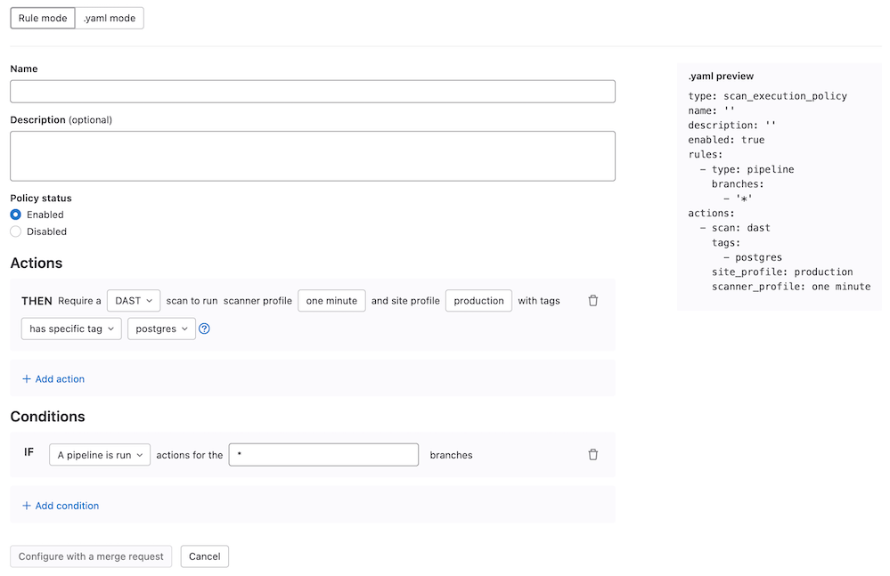

# Scan execution policies

DETAILS:
**Tier:** Ultimate
**Offering:** GitLab.com, Self-managed, GitLab Dedicated

> - Group-level security policies [introduced](https://gitlab.com/groups/gitlab-org/-/epics/4425) in GitLab 15.2.
> - Group-level security policies [enabled on GitLab.com](https://gitlab.com/gitlab-org/gitlab/-/issues/356258) in GitLab 15.4.
> - Operational container scanning [introduced](https://gitlab.com/groups/gitlab-org/-/epics/3410) in GitLab 15.5
> - Support for custom CI variables in the Scan Execution Policies editor [introduced](https://gitlab.com/groups/gitlab-org/-/epics/9566) in GitLab 16.2.
> - Enforcement of scan execution policies on projects with an existing GitLab CI/CD configuration [introduced](https://gitlab.com/groups/gitlab-org/-/epics/6880) in GitLab 16.2 [with a flag](../../../administration/feature_flags.md) named `scan_execution_policy_pipelines`. Feature flag `scan_execution_policy_pipelines` removed in GitLab 16.5.
> - Overriding predefined variables in scan execution policies [introduced](https://gitlab.com/gitlab-org/gitlab/-/issues/440855) in GitLab 16.10 [with a flag](../../../administration/feature_flags.md) named `allow_restricted_variables_at_policy_level`. Enabled by default.

Use scan execution policies to enforce security scans, either as part of the pipeline or on a
specified schedule. The security scans run with multiple project pipelines if you define the policy
at a group or subgroup level.

Scan execution policies are enforced for all applicable projects. For projects without a
`.gitlab-ci.yml` file, or where AutoDevOps is disabled, security policies create the
`.gitlab-ci.yml` file implicitly. This ensures policies enabling execution of secret detection,
static analysis, or other scanners that do not require a build in the project, are still able to
run and be enforced.

This feature has some overlap with [compliance pipelines](../../group/compliance_pipelines.md),
as we have not [unified the user experience for these two features](https://gitlab.com/groups/gitlab-org/-/epics/7312).
For details on the similarities and differences between these features, see
[Enforce scan execution](../index.md#enforce-scan-execution).

- <i class="fa fa-youtube-play youtube" aria-hidden="true"></i> For a video walkthrough, see [How to set up Security Scan Policies in GitLab](https://youtu.be/ZBcqGmEwORA?si=aeT4EXtmHjosgjBY).
- <i class="fa fa-youtube-play youtube" aria-hidden="true"></i> For an overview, see [Enforcing scan execution policies on projects with no GitLab CI/CD configuration](https://www.youtube.com/watch?v=sUfwQQ4-qHs).

## Jobs

Policy jobs for scans, other than DAST scans, are created in the `test` stage of the pipeline. If
you remove the `test` stage from the default pipeline, jobs run in the `scan-policies` stage
instead. This stage is injected into the CI/CD pipeline at evaluation time if it doesn't exist. If
the `build` stage exists, it is injected just after the `build` stage, otherwise it is injected at
the beginning of the pipeline. DAST scans always run in the `dast` stage. If this stage does not
exist, then a `dast` stage is injected at the end of the pipeline.

To avoid job name conflicts, a hyphen and a number is appended to the job name. The number is unique
per policy action.

## Scan execution policy editor

Use the scan execution policy editor to create or edit a scan execution policy.

Prerequisites:

- Only group, subgroup, or project Owners have the [permissions](../../permissions.md#project-members-permissions)
  to select Security Policy Project.
- The maximum number of scan execution policies is five per security policy project.

Once your policy is complete, save it by selecting **Configure with a merge request**
at the bottom of the editor. You are redirected to the merge request on the project's
configured security policy project. If one does not link to your project, a security
policy project is automatically created. Existing policies can also be
removed from the editor interface by selecting **Delete policy**
at the bottom of the editor.

Most policy changes take effect as soon as the merge request is merged. Any changes that
do not go through a merge request and are committed directly to the default branch may require up to 10 minutes
before the policy changes take effect.



NOTE:
Selection of site and scanner profiles using the rule mode editor for DAST execution policies differs based on
whether the policy is being created at the project or group level. For project-level policies the rule mode editor
presents a list of profiles to choose from that are already defined in the project. For group-level policies
you are required to type in the names of the profiles to use, and to prevent pipeline errors, profiles with
matching names must exist in all of the group's projects.

## Scan execution policies schema

The YAML file with scan execution policies consists of an array of objects matching scan execution
policy schema nested under the `scan_execution_policy` key. You can configure a maximum of 5
policies under the `scan_execution_policy` key. Any other policies configured after
the first 5 are not applied.

When you save a new policy, GitLab validates its contents against [this JSON schema](https://gitlab.com/gitlab-org/gitlab/-/blob/master/ee/app/validators/json_schemas/security_orchestration_policy.json).
If you're not familiar with how to read [JSON schemas](https://json-schema.org/),
the following sections and tables provide an alternative.

| Field | Type | Required | Possible values | Description |
|-------|------|----------|-----------------|-------------|
| `scan_execution_policy` | `array` of scan execution policy | true |  | List of scan execution policies (maximum 5) |

## Scan execution policy schema

| Field | Type | Required | Possible values | Description |
|-------|------|----------|-----------------|-------------|
| `name` | `string` | true |  | Name of the policy. Maximum of 255 characters.|
| `description` (optional) | `string` | true |  | Description of the policy. |
| `enabled` | `boolean` | true | `true`, `false` | Flag to enable (`true`) or disable (`false`) the policy. |
| `rules` | `array` of rules | true |  | List of rules that the policy applies. |
| `actions` | `array` of actions | true |  | List of actions that the policy enforces. |

## `pipeline` rule type

> - The `branch_type` field was [introduced](https://gitlab.com/gitlab-org/gitlab/-/issues/404774) in GitLab 16.1 [with a flag](../../../administration/feature_flags.md) named `security_policies_branch_type`. Generally available in GitLab 16.2. Feature flag removed.
> - The `branch_exceptions` field was [introduced](https://gitlab.com/gitlab-org/gitlab/-/issues/418741) in GitLab 16.3 [with a flag](../../../administration/feature_flags.md) named `security_policies_branch_exceptions`. Generally available in GitLab 16.5. Feature flag removed.

FLAG:
On self-managed GitLab, by default the `branch_exceptions` field is available. To hide the feature, an administrator can [disable the feature flag](../../../administration/feature_flags.md) named `security_policies_branch_exceptions`.
On GitLab.com and GitLab Dedicated, this feature is available.

This rule enforces the defined actions whenever the pipeline runs for a selected branch.

| Field | Type | Required | Possible values | Description |
|-------|------|----------|-----------------|-------------|
| `type` | `string` | true | `pipeline` | The rule's type. |
| `branches` <sup>1</sup> | `array` of `string` | true if `branch_type` field does not exist | `*` or the branch's name | The branch the given policy applies to (supports wildcard). |
| `branch_type` <sup>1</sup> | `string` | true if `branches` field does not exist |  `default`, `protected` or `all` | The types of branches the given policy applies to. |
| `branch_exceptions` | `array` of `string` | false |  Names of branches | Branches to exclude from this rule. |

1. You must specify only one of `branches` or `branch_type`.

## `schedule` rule type

> - The `branch_type` field was [introduced](https://gitlab.com/gitlab-org/gitlab/-/issues/404774) in GitLab 16.1 [with a flag](../../../administration/feature_flags.md) named `security_policies_branch_type`. Generally available in GitLab 16.2. Feature flag removed.
> - The `branch_exceptions` field was [introduced](https://gitlab.com/gitlab-org/gitlab/-/issues/418741) in GitLab 16.3 [with a flag](../../../administration/feature_flags.md) named `security_policies_branch_exceptions`. Generally available in GitLab 16.5. Feature flag removed.

WARNING:
In GitLab 16.1 and earlier, you should **not** use [direct transfer](../../../administration/settings/import_and_export_settings.md#enable-migration-of-groups-and-projects-by-direct-transfer) with scheduled scan execution policies. If using direct transfer, first upgrade to GitLab 16.2 and ensure security policy bots are enabled in the projects you are enforcing.

FLAG:
On self-managed GitLab, by default the `branch_exceptions` field is available. To hide the feature, an administrator can [disable the feature flag](../../../administration/feature_flags.md) named `security_policies_branch_exceptions`.
On GitLab.com and GitLab Dedicated, this feature is available.

This rule schedules a scan pipeline, enforcing the defined actions on the schedule defined in the `cadence` field. A scheduled pipeline does not run other jobs defined in the project's `.gitlab-ci.yml` file. When a project is linked to a security policy project, a security policy bot is created in the project and will become the author of any scheduled pipelines.

| Field      | Type | Required | Possible values | Description |
|------------|------|----------|-----------------|-------------|
| `type`     | `string` | true | `schedule` | The rule's type. |
| `branches` <sup>1</sup> | `array` of `string` | true if either `branch_type` or `agents` fields does not exist | `*` or the branch's name | The branch the given policy applies to (supports wildcard). |
| `branch_type` <sup>1</sup> | `string` | true if either `branches` or `agents` fields does not exist | `default`, `protected` or `all` | The types of branches the given policy applies to. |
| `branch_exceptions` | `array` of `string` | false |  Names of branches | Branches to exclude from this rule. |
| `cadence`  | `string` | true | CRON expression (for example, `0 0 * * *`) | A whitespace-separated string containing five fields that represents the scheduled time. |
| `timezone` | `string` | false | Time zone identifier (for example, `America/New_York`) | Time zone to apply to the cadence. Value must be an IANA Time Zone Database identifier. |
| `agents` <sup>1</sup>   | `object` | true if either `branch_type` or `branches` fields do not exists  |  | The name of the [GitLab agents](../../clusters/agent/index.md) where [Operational Container Scanning](../../clusters/agent/vulnerabilities.md) runs. The object key is the name of the Kubernetes agent configured for your project in GitLab. |

1. You must specify only one of `branches`, `branch_type`, or `agents`.

Scheduled scan pipelines are triggered by a security policy bot user that is a guest member of the project with elevated permissions for users of type `security_policy_bot` so it may carry out this task. Security policy bot users are automatically created when the security policy project is linked, and removed when the security policy project is unlinked.

If the project does not have a security policy bot user, the bot will be automatically created, and the following scheduled scan pipeline will use it.

GitLab supports the following types of CRON syntax for the `cadence` field:

- A daily cadence of once per hour around specified time, for example: `0 18 * * *`
- A weekly cadence of once per week on a specified day and around specified time, for example: `0 13 * * 0`

NOTE:
Other elements of the [CRON syntax](https://docs.oracle.com/cd/E12058_01/doc/doc.1014/e12030/cron_expressions.htm) may work in the cadence field if supported by the [cron](https://github.com/robfig/cron) we are using in our implementation, however, GitLab does not officially test or support them.
The comma (,), hyphens (-), or step operators (/) are not supported for minutes and hours.
An error is displayed if the cadence is invalid when creating or editing a policy.
The scheduled pipelines for a previously created policy using comma (,), hyphen(-), or step operator (/) in minutes or hours fields is skipped.
The pipelines that have been scheduled will use the `cadence` value to create a new pipeline around the time mentioned in the policy. The pipeline will be executed after a specified time when the resources become available to create it.

When using the `schedule` rule type in conjunction with the `agents` field, note the following:

- The GitLab agent for Kubernetes checks every 30 seconds to see if there is an applicable policy. When a policy is found, the scans are executed according to the `cadence` defined.
- The CRON expression is evaluated using the system-time of the Kubernetes-agent pod.

When using the `schedule` rule type in conjunction with the `branches` field, note the following:

- The cron worker runs on 15 minute intervals and starts any pipelines that were scheduled to run during the previous 15 minutes.
- Based on your rule, you might expect scheduled pipelines to run with an offset of up to 15 minutes.
- If a policy is enforced on a large number of projects or branches, it will be processed in batches, and it may take some time to create all pipelines.
- The CRON expression is evaluated in standard [UTC](https://www.timeanddate.com/worldclock/timezone/utc) time from GitLab.com. If you have a self-managed GitLab instance and have [changed the server time zone](../../../administration/timezone.md), the CRON expression is evaluated with the new time zone.


### `agent` schema

Use this schema to define `agents` objects in the [`schedule` rule type](#schedule-rule-type).

| Field        | Type                | Required | Description |
|--------------|---------------------|----------|-------------|
| `namespaces` | `array` of `string` | true | The namespace that is scanned. If empty, all namespaces are scanned. |

#### Policy example

```yaml
- name: Enforce Container Scanning in cluster connected through my-gitlab-agent for default and kube-system namespaces
  enabled: true
  rules:
  - type: schedule
    cadence: '0 10 * * *'
    agents:
      <agent-name>:
        namespaces:
        - 'default'
        - 'kube-system'
  actions:
  - scan: container_scanning
```

The keys for a schedule rule are:

- `cadence` (required): a [CRON expression](https://docs.oracle.com/cd/E12058_01/doc/doc.1014/e12030/cron_expressions.htm) for when the scans are run
- `agents:<agent-name>` (required): The name of the agent to use for scanning
- `agents:<agent-name>:namespaces` (optional): The Kubernetes namespaces to scan. If omitted, all namespaces are scanned.

## `scan` action type

> - Scan Execution Policies variable precedence was [changed](https://gitlab.com/gitlab-org/gitlab/-/issues/424028) in GitLab 16.7 [with a flag](../../../administration/feature_flags.md) named `security_policies_variables_precedence`. Enabled by default. [Feature flag removed in GitLab 16.8](https://gitlab.com/gitlab-org/gitlab/-/issues/435727).
> - Selection of security templates for given action (for projects) was [introduced](https://gitlab.com/gitlab-org/gitlab/-/issues/415427) in GitLab 17.1 [with feature flag](../../../administration/feature_flags.md) named `scan_execution_policies_with_latest_templates`. Disabled by default.
> - Selection of security templates for given action (for groups) was [introduced](https://gitlab.com/gitlab-org/gitlab/-/issues/468981) in GitLab 17.2 [with feature flag](../../../administration/feature_flags.md) named `scan_execution_policies_with_latest_templates_group`. Disabled by default.
> - Selection of security templates for given action (for projects and groups) was enabled on self-managed, and GitLab Dedicated ([1](https://gitlab.com/gitlab-org/gitlab/-/issues/461474), [2](https://gitlab.com/gitlab-org/gitlab/-/issues/468981)) in GitLab 17.2.
> - Selection of security templates for given action (for projects and groups) was generally available in GitLab 17.3. Feature flags `scan_execution_policies_with_latest_templates` and `scan_execution_policies_with_latest_templates_group` removed.

This action executes the selected `scan` with additional parameters when conditions for at least one
rule in the defined policy are met.

| Field | Type | Possible values | Description |
|-------|------|-----------------|-------------|
| `scan` | `string` | `sast`, `sast_iac`, `dast`, `secret_detection`, `container_scanning`, `dependency_scanning` | The action's type. |
| `site_profile` | `string` | Name of the selected [DAST site profile](../dast/on-demand_scan.md#site-profile). | The DAST site profile to execute the DAST scan. This field should only be set if `scan` type is `dast`. |
| `scanner_profile` | `string` or `null` | Name of the selected [DAST scanner profile](../dast/on-demand_scan.md#scanner-profile). | The DAST scanner profile to execute the DAST scan. This field should only be set if `scan` type is `dast`.|
| `variables` | `object` | | A set of CI variables, supplied as an array of `key: value` pairs, to apply and enforce for the selected scan. The `key` is the variable name, with its `value` provided as a string. This parameter supports any variable that the GitLab CI job supports for the specified scan. |
| `tags` | `array` of `string` | | A list of runner tags for the policy. The policy jobs are run by runner with the specified tags. |
| `template` | `string` | `default`, `latest` | CI/CD template edition to be enforced. The [`latest`](../../../development/cicd/templates.md#latest-version) edition may introduce breaking changes. |

NOTE:
If you have Merge Request Pipelines enabled for your project, you must select `template: latest` in your policy for each enforced scan. Using the latest template is crucial for compatibility with Merge Request Pipelines and allows you to take full advantage of GitLab security features. For more information on using security scanning tools with Merge Request Pipelines, please refer to our [security scanning documentation](../../application_security/index.md#use-security-scanning-tools-with-merge-request-pipelines).

### Scan field details

There are additional requirements for some of the `scan` action fields.
Some scanners also behave differently in a `scan` action than they do in a regular CI/CD pipeline-based scan.

#### Profiles

- You must create the [site profile](../dast/on-demand_scan.md#site-profile) and [scanner profile](../dast/on-demand_scan.md#scanner-profile)
  with selected names for each project that is assigned to the selected Security Policy Project.
  Otherwise, the policy is not applied and a job with an error message is created instead.
- Once you associate the site profile and scanner profile by name in the policy, it is not possible
  to modify or delete them. If you want to modify them, you must first disable the policy by setting
  the `active` flag to `false`.
- When configuring policies with a scheduled DAST scan, the author of the commit in the security
  policy project's repository must have access to the scanner and site profiles. Otherwise, the scan
  is not scheduled successfully.

#### Scanner behavior

- For Secret Detection:
  - Only rules with the default ruleset are supported. [Custom rulesets](../secret_detection/pipeline/index.md#customize-analyzer-rulesets) are not supported. Alternatively, you may configure a [remote configuration file](../secret_detection/pipeline/index.md#with-a-remote-ruleset) and set the `SECRET_DETECTION_RULESET_GIT_REFERENCE` variable.
  - By default, for `scheduled` scan execution policies, secret detection scans configured without any CI variables defined run first in `historic` mode (`SECRET_DETECTION_HISTORIC_SCAN` = `true`). All subsequent scheduled scans run in default mode with `SECRET_DETECTION_LOG_OPTIONS` set to the commit range between last run and current SHA. CI variables provided in the scan execution policy can override this behavior. Learn more about [historic mode](../secret_detection/pipeline/index.md#full-history-pipeline-secret-detection).
  - For `triggered` scan execution policies, secret detection works just like regular scan [configured manually in the `.gitlab-ci.yml`](../secret_detection/pipeline/index.md#edit-the-gitlab-ciyml-file-manually).
- A Container Scanning scan that is configured for the `pipeline` rule type ignores the agent defined in the `agents` object. The `agents` object is only considered for `schedule` rule types.
  An agent with a name provided in the `agents` object must be created and configured for the project.

#### CI/CD variables

Variables defined in a Scan Execution Policy follow the standard [CI/CD variable precedence](../../../ci/variables/index.md#cicd-variable-precedence).

Preconfigured values are used for the following CI/CD variables in any project on which a scan
execution policy is enforced. Their values can be overridden, but **only** if they are declared in
a policy. They **cannot** be overridden by group or project CI/CD variables:

```plaintext
DS_EXCLUDED_PATHS: spec, test, tests, tmp
SAST_EXCLUDED_PATHS: spec, test, tests, tmp
SECRET_DETECTION_EXCLUDED_PATHS: ''
SECRET_DETECTION_HISTORIC_SCAN: false
SAST_EXCLUDED_ANALYZERS: ''
DS_EXCLUDED_ANALYZERS: ''
```

In GitLab 16.9 and earlier:

- If the CI/CD variables suffixed `_EXCLUDED_PATHS` were declared in a policy, their values _could_
  be overridden by group or project CI/CD variables.
- If the CI/CD variables suffixed `_EXCLUDED_ANALYZERS` were declared in a policy, their values were
  ignored, regardless of where they were defined: policy, group, or project.

## Scope security policies to projects

> - [Introduced](https://gitlab.com/gitlab-org/gitlab/-/merge_requests/135398) in GitLab 16.7 [with a flag](../../../administration/feature_flags.md) named `security_policies_policy_scope`. Enabled by default.
> - [Generally available](https://gitlab.com/gitlab-org/gitlab/-/issues/443594) in GitLab 16.11. Feature flag `security_policies_policy_scope` removed.

Security policy enforcement depends first on establishing a link between:

- The group, subgroup, or project on which you want to enforce policies
- The security policy project that contains the policies.

For example, if you are linking policies to a group, a group owner must create the link to
the security policy project. Then, all policies in the security policy project are inherited by all
projects in the group.

You scope security policies to projects by setting the scopes in the `policy.yml` file to:

- _Include_ only projects with an applied [compliance framework](../../group/compliance_frameworks.md) by using
  the compliance framework's ID. To include projects, use `policy_scope.compliance_frameworks.id` to specify IDs of
  compliance frameworks that are applied to the projects.
- _Include_ or _exclude_ selected projects from enforcement by using the project's ID.

### Policy scope schema

A policy scope must conform to this schema.

| Field | Type | Required | Possible values | Description |
|-------|------|----------|-----------------|-------------|
| `policy_scope` | `object` | false | `compliance_frameworks`, `projects` | Scopes the policy based on compliance framework labels or projects you define. |

#### `policy_scope` scope type

Policy scopes are one of two types.

| Field | Type | Possible values | Description |
|-------|------|-----------------|-------------|
| `compliance_frameworks` | `array` |  | List of IDs of the compliance frameworks in scope of enforcement, in an array of objects with key `id`. |
| `projects` | `object` |  `including`, `excluding` | Use `excluding:` or `including:` then list the IDs of the projects you wish to include or exclude, in an array of objects with key `id`. |

#### Example `policy.yml` with security policy scopes

In this example, the security policy:

- Includes any project with compliance frameworks with an ID of either `2` or `11` applied to them.
- Excludes projects with an ID of either `24` or `27`.

```yaml
---
scan_execution_policy:
- name: Enforce DAST in every release pipeline
  description: This policy enforces pipeline configuration to have a job with DAST scan for release branches
  enabled: true
  rules:
  - type: pipeline
    branches:
    - release/*
  actions:
  - scan: dast
    scanner_profile: Scanner Profile A
    site_profile: Site Profile B
  policy_scope:
    compliance_frameworks:
      - id: 2
      - id: 11
- name: Enforce Secret Detection and Container Scanning in every default branch pipeline
  description: This policy enforces pipeline configuration to have a job with Secret Detection and Container Scanning scans for the default branch
  enabled: true
  rules:
  - type: pipeline
    branches:
    - main
  actions:
  - scan: secret_detection
  - scan: sast
    variables:
      SAST_EXCLUDED_ANALYZERS: brakeman
  policy_scope:
    projects:
      excluding:
        - id: 24
        - id: 27
```

## Example security policy project

You can use this example in a `.gitlab/security-policies/policy.yml` file stored in a
[security policy project](index.md#security-policy-project):

```yaml
---
scan_execution_policy:
- name: Enforce DAST in every release pipeline
  description: This policy enforces pipeline configuration to have a job with DAST scan for release branches
  enabled: true
  rules:
  - type: pipeline
    branches:
    - release/*
  actions:
  - scan: dast
    scanner_profile: Scanner Profile A
    site_profile: Site Profile B
- name: Enforce DAST and secret detection scans every 10 minutes
  description: This policy enforces DAST and secret detection scans to run every 10 minutes
  enabled: true
  rules:
  - type: schedule
    branches:
    - main
    cadence: "*/10 * * * *"
  actions:
  - scan: dast
    scanner_profile: Scanner Profile C
    site_profile: Site Profile D
  - scan: secret_detection
- name: Enforce Secret Detection and Container Scanning in every default branch pipeline
  description: This policy enforces pipeline configuration to have a job with Secret Detection and Container Scanning scans for the default branch
  enabled: true
  rules:
  - type: pipeline
    branches:
    - main
  actions:
  - scan: secret_detection
  - scan: sast
    variables:
      SAST_EXCLUDED_ANALYZERS: brakeman
  - scan: container_scanning
```

In this example:

- For every pipeline executed on branches that match the `release/*` wildcard (for example, branch
  `release/v1.2.1`)
  - DAST scans run with `Scanner Profile A` and `Site Profile B`.
- DAST and secret detection scans run every 10 minutes. The DAST scan runs with `Scanner Profile C`
  and `Site Profile D`.
- Secret detection, container scanning, and SAST scans run for every pipeline executed on the `main`
  branch. The SAST scan runs with the `SAST_EXCLUDED_ANALYZER` variable set to `"brakeman"`.

## Example for scan execution policy editor

You can use this example in the YAML mode of the [scan execution policy editor](#scan-execution-policy-editor).
It corresponds to a single object from the previous example.

```yaml
name: Enforce Secret Detection and Container Scanning in every default branch pipeline
description: This policy enforces pipeline configuration to have a job with Secret Detection and Container Scanning scans for the default branch
enabled: true
rules:
  - type: pipeline
    branches:
      - main
actions:
  - scan: secret_detection
  - scan: container_scanning
```

## Avoiding duplicate scans

Scan execution policies can cause the same type of scanner to run more than once if developers include scan jobs in the project's
`.gitlab-ci.yml` file. This behavior is intentional as scanners can run more than once with different variables and settings. For example, a
developer may want to try running a SAST scan with different variables than the one enforced by the security and compliance team. In
this case, two SAST jobs run in the pipeline, one with the developer's variables and one with the security and compliance team's variables.

If you want to avoid running duplicate scans, you can either remove the scans from the project's `.gitlab-ci.yml` file or disable your
local jobs by setting `SAST_DISABLED: "true"`. Disabling jobs this way does not prevent the security jobs defined by scan execution
policies from running.

## Experimental features

DETAILS:
**Status:** Experiment has ended

This experiment has concluded and will not continue. After receiving feedback within this experiment, we will be focusing our efforts on a new policy type for enforcement of custom CI. The experiment will be removed in 17.3.

Learn more about the [pipeline execution policy](pipeline_execution_policies.md).
