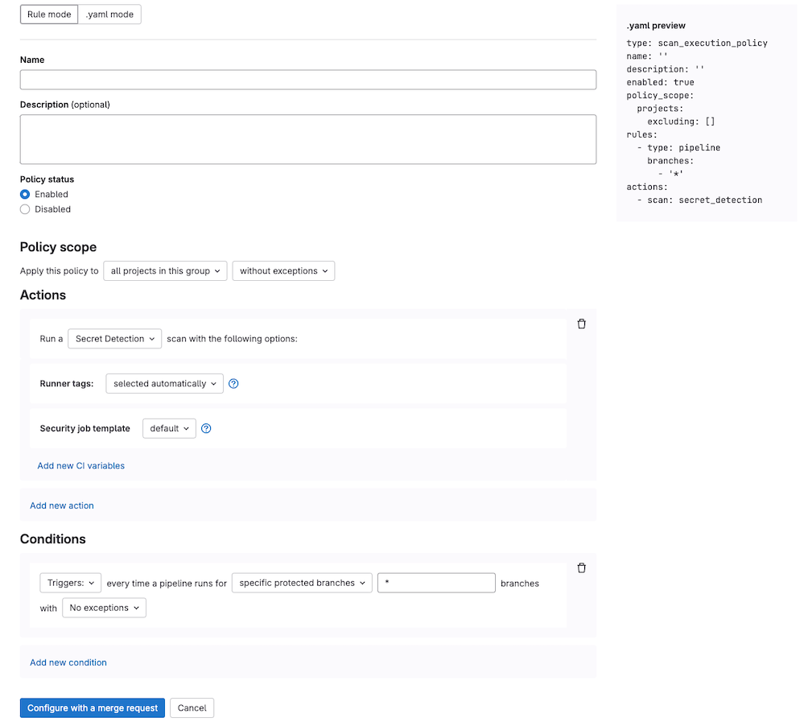

DETAILS:
**Tier:** Ultimate
**Offering:** GitLab.com, GitLab Self-Managed, GitLab Dedicated

> - Group-level security policies [introduced](https://gitlab.com/groups/gitlab-org/-/epics/4425) in GitLab 15.2.
> - Group-level security policies [enabled on GitLab.com](https://gitlab.com/gitlab-org/gitlab/-/issues/356258) in GitLab 15.4.
> - Operational container scanning [introduced](https://gitlab.com/groups/gitlab-org/-/epics/3410) in GitLab 15.5
> - Support for custom CI variables in the Scan Execution Policies editor [introduced](https://gitlab.com/groups/gitlab-org/-/epics/9566) in GitLab 16.2.
> - Enforcement of scan execution policies on projects with an existing GitLab CI/CD configuration [introduced](https://gitlab.com/groups/gitlab-org/-/epics/6880) in GitLab 16.2 [with a flag](../../../administration/feature_flags.md) named `scan_execution_policy_pipelines`. Feature flag `scan_execution_policy_pipelines` removed in GitLab 16.5.
> - Overriding predefined variables in scan execution policies [introduced](https://gitlab.com/gitlab-org/gitlab/-/issues/440855) in GitLab 16.10 [with a flag](../../../administration/feature_flags.md) named `allow_restricted_variables_at_policy_level`. Enabled by default. Feature flag `allow_restricted_variables_at_policy_level` removed in GitLab 17.5.

Use scan execution policies to enforce GitLab security scans based on the default or latest [security CI templates](https://gitlab.com/gitlab-org/gitlab/-/tree/master/lib/gitlab/ci/templates/Jobs), either as part of the pipeline or on a
specified schedule.

Scan execution policies are enforced across all projects that are linked to the security policy project and are within the scope of the policy. For projects without a
`.gitlab-ci.yml` file, or where AutoDevOps is disabled, security policies create the
`.gitlab-ci.yml` file implicitly. This ensures policies enabling execution of secret detection,
static analysis, or other scanners that do not require a build in the project, are still able to
run and be enforced.

Scan execution policies, compared to pipeline execution policies, provide a faster path to configure GitLab security scans across multiple projects to manage security and compliance.

If any of the following cases are true, use [pipeline execution policies](pipeline_execution_policies.md) instead:

- You require advanced configuration settings.
- You want to enforce custom CI/CD jobs or scripts.
- You want to enable third-party security scans through an enforced CI/CD job.

- <i class="fa fa-youtube-play youtube" aria-hidden="true"></i> For a video walkthrough, see [How to set up Security Scan Policies in GitLab](https://youtu.be/ZBcqGmEwORA?si=aeT4EXtmHjosgjBY).
- <i class="fa fa-youtube-play youtube" aria-hidden="true"></i> Learn more about [enforcing scan execution policies on projects with no GitLab CI/CD configuration](https://www.youtube.com/watch?v=sUfwQQ4-qHs).

## Restrictions

- You can assign a maximum of five rules to each policy.
- You can assign a maximum of five scan execution policies to each security policy project.
- Scan execution policies may be [overridden](pipeline_execution_policies.md#interaction-with-scan-execution-policies) by pipeline execution policies when you use `override_ci` strategy.

## Jobs

Policy jobs for scans, other than DAST scans, are created in the `test` stage of the pipeline. If
you remove the `test` stage from the default pipeline, jobs run in the `scan-policies` stage
instead. This stage is injected into the CI/CD pipeline at evaluation time if it doesn't exist. If
the `build` stage exists, it is injected just after the `build` stage, otherwise it is injected at
the beginning of the pipeline. DAST scans always run in the `dast` stage. If this stage does not
exist, then a `dast` stage is injected at the end of the pipeline.

To avoid job name conflicts, a hyphen and a number is appended to the job name. The number is unique
per policy action. For example `secret-detection` becomes `secret-detection-1`.

## Scan execution policy editor

Use the scan execution policy editor to create or edit a scan execution policy.

Prerequisites:

- By default, only group, subgroup, or project Owners have the [permissions](../../permissions.md#application-security)
  required to create or assign a security policy project. Alternatively, you can create a custom role with the permission to [manage security policy links](../../custom_roles/abilities.md#security-policy-management).

Once your policy is complete, save it by selecting **Configure with a merge request**
at the bottom of the editor. You are redirected to the merge request on the project's
configured security policy project. If one does not link to your project, a security
policy project is automatically created. Existing policies can also be
removed from the editor interface by selecting **Delete policy**
at the bottom of the editor to introduce a merge request to remove the policy from your `policy.yml` file.

Most policy changes take effect as soon as the merge request is merged. Any changes that
do not go through a merge request and are committed directly to the default branch may require up to 10 minutes
before the policy changes take effect.



NOTE:
Selection of site and scanner profiles using the rule mode editor for DAST execution policies differs based on
whether the policy is being created at the project or group level. For project-level policies the rule mode editor
presents a list of profiles to choose from that are already defined in the project. For group-level policies
you are required to type in the names of the profiles to use, and to prevent pipeline errors, profiles with
matching names must exist in all of the group's projects.

## Scan execution policies schema

The YAML file with scan execution policies consists of an array of objects matching scan execution
policy schema nested under the `scan_execution_policy` key. You can configure a maximum of 5
policies under the `scan_execution_policy` key. Any other policies configured after
the first 5 are not applied.

When you save a new policy, GitLab validates its contents against [this JSON schema](https://gitlab.com/gitlab-org/gitlab/-/blob/master/ee/app/validators/json_schemas/security_orchestration_policy.json).
If you're not familiar with how to read [JSON schemas](https://json-schema.org/),
the following sections and tables provide an alternative.

| Field | Type | Required | Possible values | Description |
|-------|------|----------|-----------------|-------------|
| `scan_execution_policy` | `array` of scan execution policy | true |  | List of scan execution policies (maximum 5) |

## Scan execution policy schema

> - Limit of actions per policy [introduced](https://gitlab.com/gitlab-org/gitlab/-/issues/472213) in GitLab 17.4 [with flags](../../../administration/feature_flags.md) named `scan_execution_policy_action_limit` (for projects) and `scan_execution_policy_action_limit_group` (for groups). Disabled by default.

FLAG:
The availability of the actions per policy limit is controlled by a feature flag.
For more information, see the history.

| Field          | Type                                         | Required | Description |
|----------------|----------------------------------------------|----------|-------------|
| `name`         | `string`                                     | true     | Name of the policy. Maximum of 255 characters. |
| `description`  | `string`                                     | false    | Description of the policy. |
| `enabled`      | `boolean`                                    | true     | Flag to enable (`true`) or disable (`false`) the policy. |
| `rules`        | `array` of rules                             | true     | List of rules that the policy applies. |
| `actions`      | `array` of actions                           | true     | List of actions that the policy enforces. Limited to a maximum of 10 in GitLab 18.0 and later. |
| `policy_scope` | `object` of [`policy_scope`](_index.md#scope) | false    | Defines the scope of the policy based on the projects, groups, or compliance framework labels you specify. |
| `skip_ci` | `object` of [`skip_ci`](#skip_ci-type) | false | Defines whether users can apply the `skip-ci` directive. |

### `skip_ci` type

> - [Introduced](https://gitlab.com/gitlab-org/gitlab/-/issues/482952) in GitLab 17.9.

Scan execution policies offer control over who can use the `[skip ci]` directive. You can specify certain users or service accounts that are allowed to use `[skip ci]` while still ensuring critical security and compliance checks are performed.

Use the `skip_ci` keyword to specify whether users are allowed to apply the `skip_ci` directive to skip the pipelines.
When the keyword is not specified, the `skip_ci` directive is ignored, preventing all users
from bypassing the pipeline execution policies.

| Field                   | Type     | Possible values          | Description |
|-------------------------|----------|--------------------------|-------------|
| `allowed` | `boolean`   | `true`, `false` | Flag to allow (`true`) or prevent (`false`) the use of the `skip-ci` directive for pipelines with enforced pipeline execution policies. |
| `allowlist`             | `object` | `users` | Specify users who are always allowed to use `skip-ci` directive, regardless of the `allowed` flag. Use `users:` followed by an array of objects with `id` keys representing user IDs. |

## `pipeline` rule type

> - The `branch_type` field was [introduced](https://gitlab.com/gitlab-org/gitlab/-/issues/404774) in GitLab 16.1 [with a flag](../../../administration/feature_flags.md) named `security_policies_branch_type`. Generally available in GitLab 16.2. Feature flag removed.
> - The `branch_exceptions` field was [introduced](https://gitlab.com/gitlab-org/gitlab/-/issues/418741) in GitLab 16.3 [with a flag](../../../administration/feature_flags.md) named `security_policies_branch_exceptions`. Generally available in GitLab 16.5. Feature flag removed.

This rule enforces the defined actions whenever the pipeline runs for a selected branch.

| Field | Type | Required | Possible values | Description |
|-------|------|----------|-----------------|-------------|
| `type` | `string` | true | `pipeline` | The rule's type. |
| `branches` <sup>1</sup> | `array` of `string` | true if `branch_type` field does not exist | `*` or the branch's name | The branch the given policy applies to (supports wildcard). For compatibility with merge request approval policies, you should target all branches to include the scans in the feature branch and default branch |
| `branch_type` <sup>1</sup> | `string` | true if `branches` field does not exist |  `default`, `protected` or `all` | The types of branches the given policy applies to. |
| `branch_exceptions` | `array` of `string` | false |  Names of branches | Branches to exclude from this rule. |

1. You must specify only one of `branches` or `branch_type`.

## `schedule` rule type

> - [Introduced](https://gitlab.com/gitlab-org/gitlab/-/issues/404774) the `branch_type` field in GitLab 16.1 [with a flag](../../../administration/feature_flags.md) named `security_policies_branch_type`. Generally available in GitLab 16.2. Feature flag removed.
> - [Introduced](https://gitlab.com/gitlab-org/gitlab/-/issues/418741) the `branch_exceptions` field in GitLab 16.3 [with a flag](../../../administration/feature_flags.md) named `security_policies_branch_exceptions`. Generally available in GitLab 16.5. Feature flag removed.
> - [Introduced](https://gitlab.com/gitlab-org/gitlab/-/merge_requests/147691) a new `scan_execution_pipeline_worker` worker to scheduled scans to create pipelines in GitLab 16.11 [with a flag](../../../administration/feature_flags.md).
> - [Introduced](https://gitlab.com/gitlab-org/gitlab/-/merge_requests/152855) a new application setting `security_policy_scheduled_scans_max_concurrency` in GitLab 17.1. The concurrency limit applies when both the `scan_execution_pipeline_worker` and `scan_execution_pipeline_concurrency_control` are enabled.
> - [Introduced](https://gitlab.com/gitlab-org/gitlab/-/merge_requests/158636) a concurrency limit for scan execution scheduled jobs in GitLab 17.3 [with a flag](../../../administration/feature_flags.md) named  `scan_execution_pipeline_concurrency_control`.
> - [Enabled](https://gitlab.com/gitlab-org/gitlab/-/issues/451890) the `scan_execution_pipeline_worker` feature flag on GitLab.com in GitLab 17.5.
> - [Feature flag](https://gitlab.com/gitlab-org/gitlab/-/issues/451890) `scan_execution_pipeline_worker` removed in GitLab 17.6.
> - [Feature flag](https://gitlab.com/gitlab-org/gitlab/-/issues/463802) `scan_execution_pipeline_concurrency_control` removed in GitLab 17.9.

WARNING:
In GitLab 16.1 and earlier, you should **not** use [direct transfer](../../../administration/settings/import_and_export_settings.md#enable-migration-of-groups-and-projects-by-direct-transfer) with scheduled scan execution policies. If using direct transfer, first upgrade to GitLab 16.2 and ensure security policy bots are enabled in the projects you are enforcing.

Use the `schedule` rule type to run security scanners on a schedule.

A scheduled pipeline:

- Runs only the scanners defined in the policy, not the jobs defined in the project's
  `.gitlab-ci.yml` file.
- Runs according to the schedule defined in the `cadence` field.
- Runs under a `security_policy_bot` user account in the project, with the Guest role and
  permissions to create pipelines and read the repository's content from a CI/CD job. This account
  is created when the policy is linked to a group or project.

| Field      | Type | Required | Possible values | Description |
|------------|------|----------|-----------------|-------------|
| `type`     | `string` | true | `schedule` | The rule's type. |
| `branches` <sup>1</sup> | `array` of `string` | true if either `branch_type` or `agents` fields does not exist | `*` or the branch's name | The branch the given policy applies to (supports wildcard). |
| `branch_type` <sup>1</sup> | `string` | true if either `branches` or `agents` fields does not exist | `default`, `protected` or `all` | The types of branches the given policy applies to. |
| `branch_exceptions` | `array` of `string` | false |  Names of branches | Branches to exclude from this rule. |
| `cadence`  | `string` | true | Cron expression with limited options. For example, `0 0 * * *` creates a schedule to run every day at midnight (12:00 AM). | A whitespace-separated string containing five fields that represents the scheduled time. |
| `timezone` | `string` | false | Time zone identifier (for example, `America/New_York`) | Time zone to apply to the cadence. Value must be an IANA Time Zone Database identifier. |
| `time_window` | `object` | false |  | Distribution and duration settings for scheduled security scans. |
| `agents` <sup>1</sup>   | `object` | true if either `branch_type` or `branches` fields do not exists  |  | The name of the [GitLab agents](../../clusters/agent/_index.md) where [Operational Container Scanning](../../clusters/agent/vulnerabilities.md) runs. The object key is the name of the Kubernetes agent configured for your project in GitLab. |

1. You must specify only one of `branches`, `branch_type`, or `agents`.

### Cadence

Use the `cadence` field to schedule when you want the policy's actions to run. The `cadence` field
uses [cron syntax](../../../topics/cron/_index.md), but with some restrictions:

- Only the following types of cron syntax are supported:
  - A daily cadence of once per hour around specified time, for example: `0 18 * * *`
  - A weekly cadence of once per week on a specified day and around specified time, for example: `0 13 * * 0`
- Use of the comma (,), hyphens (-), or step operators (/) are not supported for minutes and hours.
  Any scheduled pipeline using these characters is skipped.

Consider the following when choosing a value for the `cadence` field:

- Timing is based on UTC for GitLab SaaS and on the GitLab host's system time for GitLab
  self-managed. When testing new policies, it may appear pipelines are not running properly when in
  fact they are scheduled in your server's time zone.
- A scheduled pipeline starts around the time mentioned in the policy, when the resources become
  available to create it. In other words, the pipeline may not begin precisely at the timing
  specified in the policy.

When using the `schedule` rule type with the `agents` field:

- The GitLab agent for Kubernetes checks every 30 seconds to see if there is an applicable policy.
  When a policy is found, the scans are executed according to the `cadence` defined.
- The cron expression is evaluated using the system time of the Kubernetes-agent pod.

When using the `schedule` rule type with the `branches` field:

- The cron worker runs on 15 minute intervals and starts any pipelines that were scheduled to run
  during the previous 15 minutes. Therefore, scheduled pipelines may run with an offset of up to 15
  minutes.
- If a policy is enforced on a large number of projects or branches, the policy is processed in
  batches, and may take some time to create all pipelines.


### `agent` schema

Use this schema to define `agents` objects in the [`schedule` rule type](#schedule-rule-type).

| Field        | Type                | Required | Description |
|--------------|---------------------|----------|-------------|
| `namespaces` | `array` of `string` | true | The namespace that is scanned. If empty, all namespaces are scanned. |

#### Policy example

```yaml
- name: Enforce Container Scanning in cluster connected through my-gitlab-agent for default and kube-system namespaces
  enabled: true
  rules:
  - type: schedule
    cadence: '0 10 * * *'
    agents:
      <agent-name>:
        namespaces:
        - 'default'
        - 'kube-system'
  actions:
  - scan: container_scanning
```

The keys for a schedule rule are:

- `cadence` (required): a [Cron expression](../../../topics/cron/_index.md) for when the scans are
  run.
- `agents:<agent-name>` (required): The name of the agent to use for scanning.
- `agents:<agent-name>:namespaces` (optional): The Kubernetes namespaces to scan. If omitted, all namespaces are scanned.

### `time_window` schema

Define how scheduled scans are distributed over time with the `time_window` object in the [`schedule` rule type](#schedule-rule-type). You can configure `time_window` only in YAML mode of the policy editor.

| Field          | Type      | Required | Description                                                                                                                                                                          |
|----------------|-----------|----------|--------------------------------------------------------------------------------------------------------------------------------------------------------------------------------------|
| `distribution` | `string`  | true     | Distribution pattern for schedule scans. Currently only supports `random`, where scans will be distributed randomly in the interval defined by the `value` key of the `time_window`. |
| `value`        | `integer` | true     | The time window in seconds the schedule scans should run. Enter a value between 3600 (1 hour) and 86400 (24 hours).                                               |

#### Policy example

```yaml
- name: Enforce Container Scanning with a time window of 1 hour
  enabled: true
  rules:
  - type: schedule
    cadence: '0 10 * * *'
    time_window:
      value: 3600
      distribution: random
  actions:
  - scan: container_scanning
```

### Optimize scheduled pipelines for projects at scale

Consider performance when enabling scheduled scans across many projects.

If the `scan_execution_pipeline_concurrency_control` feature flag is not enabled:

- Scheduled pipelines run simultaneously across all projects and branches enforced by the policy.
- The first scheduled pipeline execution in each project creates a security bot user responsible for executing the schedules within each project.

To optimize performance for projects at scale:

- Roll out scheduled scan execution policies gradually, starting with a subset of projects. You can leverage security policy scopes to target specific groups, projects, or projects containing a given compliance framework label.
- You can configure the policy to run the schedules on runners with a specified `tag`. Consider setting up a dedicated runner in each project to handle schedules enforced from a policy to reduce impact to other runners.
- Test your implementation in a staging or lower environment before deploying to production. Monitor performance and adjust your rollout plan based on results.

NOTE:
Additional improvements for managing high-volume scheduled pipelines are planned in [Epic 13977](https://gitlab.com/groups/gitlab-org/-/epics/13997).

### Concurrency control

GitLab applies concurrency control when:

- The `scan_execution_pipeline_concurrency_control` feature flag is enabled
- You set the `time_window` property

The concurrency control distributes the scheduled pipelines according to the [`time_window` settings](#time_window-schema) defined in the policy.

## `scan` action type

> - Scan Execution Policies variable precedence was [changed](https://gitlab.com/gitlab-org/gitlab/-/issues/424028) in GitLab 16.7 [with a flag](../../../administration/feature_flags.md) named `security_policies_variables_precedence`. Enabled by default. [Feature flag removed in GitLab 16.8](https://gitlab.com/gitlab-org/gitlab/-/issues/435727).
> - Selection of security templates for given action (for projects) was [introduced](https://gitlab.com/gitlab-org/gitlab/-/issues/415427) in GitLab 17.1 [with feature flag](../../../administration/feature_flags.md) named `scan_execution_policies_with_latest_templates`. Disabled by default.
> - Selection of security templates for given action (for groups) was [introduced](https://gitlab.com/gitlab-org/gitlab/-/issues/468981) in GitLab 17.2 [with feature flag](../../../administration/feature_flags.md) named `scan_execution_policies_with_latest_templates_group`. Disabled by default.
> - Selection of security templates for given action (for projects and groups) was enabled on GitLab Self-Managed, and GitLab Dedicated ([1](https://gitlab.com/gitlab-org/gitlab/-/issues/461474), [2](https://gitlab.com/gitlab-org/gitlab/-/issues/468981)) in GitLab 17.2.
> - Selection of security templates for given action (for projects and groups) was generally available in GitLab 17.3. Feature flags `scan_execution_policies_with_latest_templates` and `scan_execution_policies_with_latest_templates_group` removed.

This action executes the selected `scan` with additional parameters when conditions for at least one
rule in the defined policy are met.

| Field | Type | Possible values | Description |
|-------|------|-----------------|-------------|
| `scan` | `string` | `sast`, `sast_iac`, `dast`, `secret_detection`, `container_scanning`, `dependency_scanning` | The action's type. |
| `site_profile` | `string` | Name of the selected [DAST site profile](../dast/on-demand_scan.md#site-profile). | The DAST site profile to execute the DAST scan. This field should only be set if `scan` type is `dast`. |
| `scanner_profile` | `string` or `null` | Name of the selected [DAST scanner profile](../dast/on-demand_scan.md#scanner-profile). | The DAST scanner profile to execute the DAST scan. This field should only be set if `scan` type is `dast`.|
| `variables` | `object` | | A set of CI variables, supplied as an array of `key: value` pairs, to apply and enforce for the selected scan. The `key` is the variable name, with its `value` provided as a string. This parameter supports any variable that the GitLab CI job supports for the specified scan. |
| `tags` | `array` of `string` | | A list of runner tags for the policy. The policy jobs are run by runner with the specified tags. |
| `template` | `string` | `default`, `latest` | CI/CD template version to be enforced. The [`latest`](../../../development/cicd/templates.md#latest-version) version may introduce breaking changes. See the `stable` and `latest` [security templates](https://gitlab.com/gitlab-org/gitlab/-/tree/master/lib/gitlab/ci/templates/Jobs). |
| `scan_settings` | `object` | | A set of scan settings, supplied as an array of `key: value` pairs, to apply and enforce for the selected scan. The `key` is the setting name, with its `value` provided as a boolean or string. This parameter supports the settings defined in [scan settings](#scan-settings). |

NOTE:
If you have Merge Request Pipelines enabled for your project, you must select `template: latest` in your policy for each enforced scan. Using the latest template is crucial for compatibility with Merge Request Pipelines and allows you to take full advantage of GitLab security features. For more information on using security scanning tools with Merge Request Pipelines, please refer to our [security scanning documentation](../detect/roll_out_security_scanning.md#use-security-scanning-tools-with-merge-request-pipelines).

### Scanner behavior

Some scanners behave differently in a `scan` action than they do in a regular CI/CD pipeline-based
scan.

- Static Application Security Testing (SAST): Runs only if the repository contains
  [files supported by SAST)](../sast/_index.md#supported-languages-and-frameworks).
- Secret detection:
  - Only rules with the default ruleset are supported.
    [Custom rulesets](../secret_detection/pipeline/_index.md#customize-analyzer-rulesets) are not
    supported. Instead, you can configure a
    [remote configuration file](../secret_detection/pipeline/_index.md#with-a-remote-ruleset) and set
    the `SECRET_DETECTION_RULESET_GIT_REFERENCE` variable.
  - For `scheduled` scan execution policies, secret detection by default runs first in `historic`
    mode (`SECRET_DETECTION_HISTORIC_SCAN` = `true`). All subsequent scheduled scans run in default
    mode with `SECRET_DETECTION_LOG_OPTIONS` set to the commit range between last run and current
    SHA. You can override this behavior by specifying CI/CD variables in the scan
    execution policy. For more information, see
    [Full history pipeline secret detection](../secret_detection/pipeline/_index.md#full-history-pipeline-secret-detection).
  - For `triggered` scan execution policies, secret detection works just like regular scan
    [configured manually in the `.gitlab-ci.yml`](../secret_detection/pipeline/_index.md#edit-the-gitlab-ciyml-file-manually).
- Container scanning: A scan that is configured for the `pipeline` rule type ignores the agent
  defined in the `agents` object. The `agents` object is only considered for `schedule` rule types.
  An agent with a name provided in the `agents` object must be created and configured for the
  project.

### DAST profiles

The following requirements apply when enforcing Dynamic Application Security Testing (DAST):

- For every project in the policy's scope the specified
  [site profile](../dast/on-demand_scan.md#site-profile) and
  [scanner profile](../dast/on-demand_scan.md#scanner-profile) must exist. If these are not
  available, the policy is not applied and a job with an error message is created instead.
- When a DAST site profile or scanner profile is named in an enabled scan execution policy, the
  profile cannot be modified or deleted. To edit or delete the profile, you must first set the
  policy to **Disabled** in the policy editor or set `enabled: false` in the YAML mode.
- When configuring policies with a scheduled DAST scan, the author of the commit in the security
  policy project's repository must have access to the scanner and site profiles. Otherwise, the scan
  is not scheduled successfully.

### Scan settings

The following settings are supported by the `scan_settings` parameter:

| Setting | Type | Required | Possible values | Default | Description |
|-------|------|----------|-----------------|-------------|-----------|
| `ignore_default_before_after_script` | `boolean` | false | `true`, `false` | `false` | Specifies whether to exclude any default `before_script` and `after_script` definitions in the pipeline configuration from the scan job. |

## CI/CD variables

Variables defined in a scan execution policy follow the standard [CI/CD variable precedence](../../../ci/variables/_index.md#cicd-variable-precedence).

Preconfigured values are used for the following CI/CD variables in any project on which a scan
execution policy is enforced. Their values can be overridden, but **only** if they are declared in
a policy. They **cannot** be overridden by group or project CI/CD variables:

```plaintext
DS_EXCLUDED_PATHS: spec, test, tests, tmp
SAST_EXCLUDED_PATHS: spec, test, tests, tmp
SECRET_DETECTION_EXCLUDED_PATHS: ''
SECRET_DETECTION_HISTORIC_SCAN: false
SAST_EXCLUDED_ANALYZERS: ''
DEFAULT_SAST_EXCLUDED_PATHS: spec, test, tests, tmp
DS_EXCLUDED_ANALYZERS: ''
```

In GitLab 16.9 and earlier:

- If the CI/CD variables suffixed `_EXCLUDED_PATHS` were declared in a policy, their values _could_
  be overridden by group or project CI/CD variables.
- If the CI/CD variables suffixed `_EXCLUDED_ANALYZERS` were declared in a policy, their values were
  ignored, regardless of where they were defined: policy, group, or project.

## Policy scope schema

To customize policy enforcement, you can define a policy's scope to either include, or exclude,
specified projects, groups, or compliance framework labels. For more details, see
[Scope](_index.md#scope).

## Example security policy project

You can use this example in a `.gitlab/security-policies/policy.yml` file stored in a
[security policy project](_index.md#security-policy-project):

```yaml
---
scan_execution_policy:
- name: Enforce DAST in every release pipeline
  description: This policy enforces pipeline configuration to have a job with DAST scan for release branches
  enabled: true
  rules:
  - type: pipeline
    branches:
    - release/*
  actions:
  - scan: dast
    scanner_profile: Scanner Profile A
    site_profile: Site Profile B
- name: Enforce DAST and secret detection scans every 10 minutes
  description: This policy enforces DAST and secret detection scans to run every 10 minutes
  enabled: true
  rules:
  - type: schedule
    branches:
    - main
    cadence: "*/10 * * * *"
  actions:
  - scan: dast
    scanner_profile: Scanner Profile C
    site_profile: Site Profile D
  - scan: secret_detection
    scan_settings:
      ignore_default_before_after_script: true
- name: Enforce Secret Detection and Container Scanning in every default branch pipeline
  description: This policy enforces pipeline configuration to have a job with Secret Detection and Container Scanning scans for the default branch
  enabled: true
  rules:
  - type: pipeline
    branches:
    - main
  actions:
  - scan: secret_detection
  - scan: sast
    variables:
      SAST_EXCLUDED_ANALYZERS: brakeman
  - scan: container_scanning
```

In this example:

- For every pipeline executed on branches that match the `release/*` wildcard (for example, branch
  `release/v1.2.1`)
  - DAST scans run with `Scanner Profile A` and `Site Profile B`.
- DAST and secret detection scans run every 10 minutes. The DAST scan runs with `Scanner Profile C`
  and `Site Profile D`.
- Secret detection, container scanning, and SAST scans run for every pipeline executed on the `main`
  branch. The SAST scan runs with the `SAST_EXCLUDED_ANALYZER` variable set to `"brakeman"`.

## Example for scan execution policy editor

You can use this example in the YAML mode of the [scan execution policy editor](#scan-execution-policy-editor).
It corresponds to a single object from the previous example.

```yaml
name: Enforce Secret Detection and Container Scanning in every default branch pipeline
description: This policy enforces pipeline configuration to have a job with Secret Detection and Container Scanning scans for the default branch
enabled: true
rules:
  - type: pipeline
    branches:
      - main
actions:
  - scan: secret_detection
  - scan: container_scanning
```

## Avoiding duplicate scans

Scan execution policies can cause the same type of scanner to run more than once if developers include scan jobs in the project's
`.gitlab-ci.yml` file. This behavior is intentional as scanners can run more than once with different variables and settings. For example, a
developer may want to try running a SAST scan with different variables than the one enforced by the security and compliance team. In
this case, two SAST jobs run in the pipeline, one with the developer's variables and one with the security and compliance team's variables.

If you want to avoid running duplicate scans, you can either remove the scans from the project's `.gitlab-ci.yml` file or skip your
local jobs with variables. Skipping jobs does not prevent any security jobs defined by scan execution
policies from running.

To skip scan jobs with variables, you can use:

- `SAST_DISABLED: "true"` to skip SAST jobs.
- `DAST_DISABLED: "true"` to skip DAST jobs.
- `CONTAINER_SCANNING_DISABLED: "true"` to skip container scanning jobs.
- `SECRET_DETECTION_DISABLED: "true"` to skip secret detection jobs.
- `DEPENDENCY_SCANNING_DISABLED: "true"` to skip dependency scanning jobs.

For an overview of all variables that can skip jobs, see [CI/CD variables documentation](../../../topics/autodevops/cicd_variables.md#job-skipping-variables)
