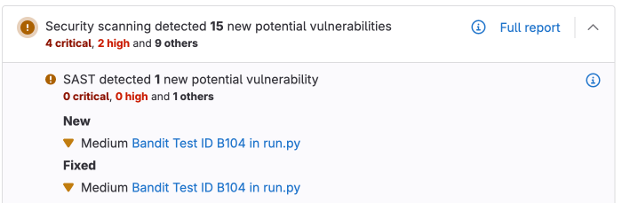
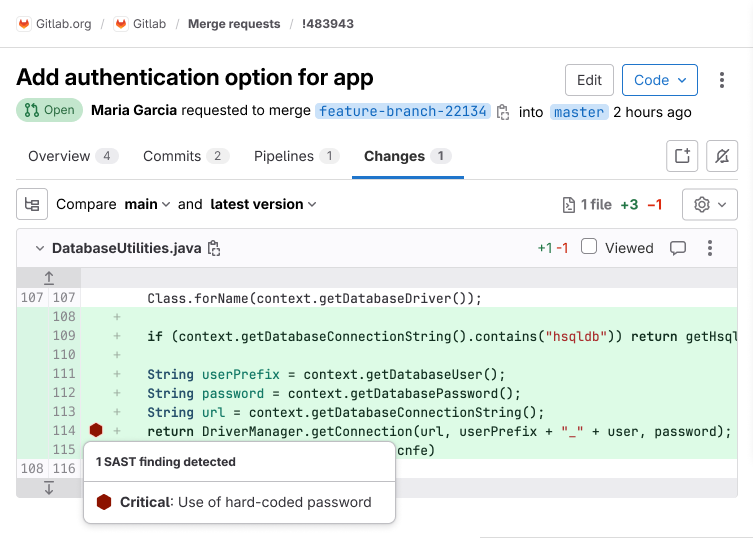

<style>
table.sast-table tr:nth-child(even) {
    background-color: transparent;
}

table.sast-table td {
    border-left: 1px solid #dbdbdb;
    border-right: 1px solid #dbdbdb;
    border-bottom: 1px solid #dbdbdb;
}

table.sast-table tr td:first-child {
    border-left: 0;
}

table.sast-table tr td:last-child {
    border-right: 0;
}

table.sast-table ul {
    font-size: 1em;
    list-style-type: none;
    padding-left: 0px;
    margin-bottom: 0px;
}

table.no-vertical-table-lines td {
    border-left: none;
    border-right: none;
    border-bottom: 1px solid #f0f0f0;
}

table.no-vertical-table-lines tr {
    border-top: none;
}
</style>

DETAILS:
**Tier:** Free, Premium, Ultimate
**Offering:** GitLab.com, GitLab Self-Managed, GitLab Dedicated

If you're using [GitLab CI/CD](../../../ci/_index.md), you can use Static Application Security
Testing (SAST) to check your source code for known vulnerabilities. You can run SAST analyzers in
any GitLab tier. The analyzers output JSON-formatted reports as job artifacts.

With GitLab Ultimate, SAST results are also processed so you can:

- Use them in approval workflows.
- Review them in the security dashboard.

For more information, see [Features](#features).

## Features

The following table lists the GitLab tiers in which each feature is available.

| Feature                                                                                  | In Free & Premium      | In Ultimate            |
|:-----------------------------------------------------------------------------------------|:-----------------------|:-----------------------|
| Basic scanning with [open-source analyzers](#supported-languages-and-frameworks)         | **{check-circle}** Yes | **{check-circle}** Yes |
| Downloadable [SAST JSON report](#download-a-sast-report)                                 | **{check-circle}** Yes | **{check-circle}** Yes |
| Cross-file, cross-function scanning with [GitLab Advanced SAST](gitlab_advanced_sast.md) | **{dotted-circle}** No | **{check-circle}** Yes |
| New findings in [merge request widget](#merge-request-widget)                            | **{dotted-circle}** No | **{check-circle}** Yes |
| New findings in [merge request changes view](#merge-request-changes-view)                | **{dotted-circle}** No | **{check-circle}** Yes |
| [Vulnerability Management](../vulnerabilities/_index.md)                                  | **{dotted-circle}** No | **{check-circle}** Yes |
| [UI-based scanner configuration](#configure-sast-by-using-the-ui)                        | **{dotted-circle}** No | **{check-circle}** Yes |
| [Ruleset customization](customize_rulesets.md)                                           | **{dotted-circle}** No | **{check-circle}** Yes |
| [Advanced Vulnerability Tracking](#advanced-vulnerability-tracking)                      | **{dotted-circle}** No | **{check-circle}** Yes |

## Requirements

Before you run a SAST analyzer in your instance, make sure you have the following:

- Linux-based GitLab Runner with the [`docker`](https://docs.gitlab.com/runner/executors/docker.html) or
  [`kubernetes`](https://docs.gitlab.com/runner/install/kubernetes.html) executor. If you're using
  hosted runners for GitLab.com, this is enabled by default.
  - Windows Runners are not supported.
  - CPU architectures other than amd64 are not supported.
- GitLab CI/CD configuration (`.gitlab-ci.yml`) must include the `test` stage, which is included by default. If you redefine the stages in the `.gitlab-ci.yml` file, the `test` stage is required.

## Supported languages and frameworks

GitLab SAST uses different scanning technologies depending on which programming languages are found in your project's source code.
Most languages are covered by [GitLab Advanced SAST](gitlab_advanced_sast.md) or by Semgrep-based scanning with [GitLab-managed rules](rules.md).

After you [enable SAST](#configuration), the right set of analyzers runs automatically even if your project uses more than one language.

For nearly all languages, GitLab SAST scans your source code directly, rather than requiring you to modify your build configuration or compile it to a binary first.
Only the SpotBugs-based analyzer, which is used to scan Groovy code, requires compilation.

For more information about our plans for language support in SAST, see the [category direction page](https://about.gitlab.com/direction/application_security_testing/static-analysis/sast/).

| Language / framework         | [Analyzer](analyzers.md) used for scanning                                                                                                | Minimum supported GitLab version  |
|------------------------------|-------------------------------------------------------------------------------------------------------------------------------------------|-----------------------------------|
| .NET (all versions, C# only) | [Semgrep](https://gitlab.com/gitlab-org/security-products/analyzers/semgrep) with [GitLab-managed rules](rules.md#semgrep-based-analyzer) | 15.4                              |
| .NET (all versions, C# only) | [GitLab Advanced SAST](gitlab_advanced_sast.md)                                      | 17.3                              |
| Apex (Salesforce)            | [PMD](https://gitlab.com/gitlab-org/security-products/analyzers/pmd-apex)                                                                 | 12.1                              |
| C                            | [Semgrep](https://gitlab.com/gitlab-org/security-products/analyzers/semgrep) with [GitLab-managed rules](rules.md#semgrep-based-analyzer) | 14.2                              |
| C/C++                        | [Semgrep](https://gitlab.com/gitlab-org/security-products/analyzers/semgrep) with [GitLab-managed rules](rules.md#semgrep-based-analyzer) | 16.11                             |
| Elixir (Phoenix)             | [Sobelow](https://gitlab.com/gitlab-org/security-products/analyzers/sobelow)                                                              | 11.1                              |
| Go                           | [Semgrep](https://gitlab.com/gitlab-org/security-products/analyzers/semgrep) with [GitLab-managed rules](rules.md#semgrep-based-analyzer) | 14.4                              |
| Go                           | [GitLab Advanced SAST](gitlab_advanced_sast.md)                                      | 17.3                              |
| Groovy <sup>1</sup>           | [SpotBugs](https://gitlab.com/gitlab-org/security-products/analyzers/spotbugs) with the find-sec-bugs plugin                              | 11.3 (Gradle) & 11.9 (Maven, SBT) |
| Helm Charts                  | [Kubesec](https://gitlab.com/gitlab-org/security-products/analyzers/kubesec)                                                              | 13.1                              |
| Java (any build system)      | [Semgrep](https://gitlab.com/gitlab-org/security-products/analyzers/semgrep) with [GitLab-managed rules](rules.md#semgrep-based-analyzer) | 14.10                             |
| Java (Android)               | [Semgrep](https://gitlab.com/gitlab-org/security-products/analyzers/semgrep) with [GitLab-managed rules](rules.md#semgrep-based-analyzer) | 16.11                             |
| Java (any build system)      | [GitLab Advanced SAST](gitlab_advanced_sast.md)                                      | 17.3                              |
| JavaScript                   | [Semgrep](https://gitlab.com/gitlab-org/security-products/analyzers/semgrep) with [GitLab-managed rules](rules.md#semgrep-based-analyzer) | 13.10                             |
| JavaScript                   | [GitLab Advanced SAST](gitlab_advanced_sast.md)                                      | 17.3                              |
| Kotlin (Android)             | [Semgrep](https://gitlab.com/gitlab-org/security-products/analyzers/semgrep) with [GitLab-managed rules](rules.md#semgrep-based-analyzer) | 16.11                             |
| Kotlin (General) <sup>1</sup> | [Semgrep](https://gitlab.com/gitlab-org/security-products/analyzers/semgrep) with [GitLab-managed rules](rules.md#semgrep-based-analyzer) | 16.11                             |
| Kubernetes manifests         | [Kubesec](https://gitlab.com/gitlab-org/security-products/analyzers/kubesec)                                                              | 12.6                              |
| Node.js                      | [Semgrep](https://gitlab.com/gitlab-org/security-products/analyzers/semgrep) with [GitLab-managed rules](rules.md#semgrep-based-analyzer) | 16.11                             |
| Node.js                      | [GitLab Advanced SAST](gitlab_advanced_sast.md)                                      | 17.3                              |
| Objective-C (iOS)            | [Semgrep](https://gitlab.com/gitlab-org/security-products/analyzers/semgrep) with [GitLab-managed rules](rules.md#semgrep-based-analyzer) | 16.11                             |
| PHP                          | [Semgrep](https://gitlab.com/gitlab-org/security-products/analyzers/semgrep) with [GitLab-managed rules](rules.md#semgrep-based-analyzer) | 16.11                             |
| Python                       | [Semgrep](https://gitlab.com/gitlab-org/security-products/analyzers/semgrep) with [GitLab-managed rules](rules.md#semgrep-based-analyzer) | 13.9                              |
| Python                       | [GitLab Advanced SAST](gitlab_advanced_sast.md)                                      | 17.3                              |
| React                        | [Semgrep](https://gitlab.com/gitlab-org/security-products/analyzers/semgrep) with [GitLab-managed rules](rules.md#semgrep-based-analyzer) | 13.10                             |
| Ruby                         | [Semgrep](https://gitlab.com/gitlab-org/security-products/analyzers/semgrep) with [GitLab-managed rules](rules.md#semgrep-based-analyzer) | 16.11                             |
| Ruby                         | [GitLab Advanced SAST](gitlab_advanced_sast.md)                                      | 17.5                              |
| Ruby on Rails                | [Semgrep](https://gitlab.com/gitlab-org/security-products/analyzers/semgrep) with [GitLab-managed rules](rules.md#semgrep-based-analyzer) | 16.11                             |
| Rust <sup>2</sup>            | [Semgrep](https://gitlab.com/gitlab-org/security-products/analyzers/semgrep) with user-provided [Custom rules](customize_rulesets.md)     | 17.1                              |
| Scala (any build system)     | [Semgrep](https://gitlab.com/gitlab-org/security-products/analyzers/semgrep) with [GitLab-managed rules](rules.md#semgrep-based-analyzer) | 16.0                              |
| Scala <sup>1</sup>           | [SpotBugs](https://gitlab.com/gitlab-org/security-products/analyzers/spotbugs) with the find-sec-bugs plugin                              | 11.0 (SBT) & 11.9 (Gradle, Maven) |
| Swift (iOS)                  | [Semgrep](https://gitlab.com/gitlab-org/security-products/analyzers/semgrep) with [GitLab-managed rules](rules.md#semgrep-based-analyzer) | 16.11                             |
| TypeScript                   | [Semgrep](https://gitlab.com/gitlab-org/security-products/analyzers/semgrep) with [GitLab-managed rules](rules.md#semgrep-based-analyzer) | 13.10                             |
| TypeScript                   | [GitLab Advanced SAST](gitlab_advanced_sast.md)                                      | 17.3                              |

**Footnotes:**

1. The SpotBugs-based analyzer supports [Gradle](https://gradle.org/), [Maven](https://maven.apache.org/), and [SBT](https://www.scala-sbt.org/). It can also be used with variants like the [Gradle wrapper](https://docs.gradle.org/current/userguide/gradle_wrapper.html), [Grails](https://grails.org/), and the [Maven wrapper](https://github.com/takari/maven-wrapper). However, SpotBugs has [limitations](https://gitlab.com/gitlab-org/gitlab/-/issues/350801) when used against [Ant](https://ant.apache.org/)-based projects. You should use the GitLab Advanced SAST or Semgrep-based analyzer for Ant-based Java or Scala projects.
1. Requires a custom ruleset and an override to the semgrep-sast CI job. See [Scanning Rust applications](_index.md#scanning-rust-applications) for an example.

To learn more about SAST analyzers that are no longer supported, see [Analyzers that have reached End of Support](analyzers.md#analyzers-that-have-reached-end-of-support).

## Advanced vulnerability tracking

DETAILS:
**Tier:** Ultimate
**Offering:** GitLab.com, GitLab Self-Managed, GitLab Dedicated

Source code is volatile; as developers make changes, source code may move within files or between files.
Security analyzers may have already reported vulnerabilities that are being tracked in the [Vulnerability Report](../vulnerability_report/_index.md).
These vulnerabilities are linked to specific problematic code fragments so that they can be found and fixed.
If the code fragments are not tracked reliably as they move, vulnerability management is harder because the same vulnerability could be reported again.

GitLab SAST uses an advanced vulnerability tracking algorithm to more accurately identify when the same vulnerability has moved within a file due to refactoring or unrelated changes.

Advanced vulnerability tracking is available in a subset of the [supported languages](#supported-languages-and-frameworks) and [analyzers](analyzers.md):

- C, in the Semgrep-based only
- C++, in the Semgrep-based only
- C#, in the GitLab Advanced SAST and Semgrep-based analyzers
- Go, in the GitLab Advanced SAST and Semgrep-based analyzers
- Java, in the GitLab Advanced SAST and Semgrep-based analyzers
- JavaScript, in the GitLab Advanced SAST and Semgrep-based analyzers
- PHP, in the Semgrep-based analyzer only
- Python, in the GitLab Advanced SAST and Semgrep-based analyzers
- Ruby, in the Semgrep-based analyzer only

Support for more languages and analyzers is tracked in [this epic](https://gitlab.com/groups/gitlab-org/-/epics/5144).

For more information, see the confidential project `https://gitlab.com/gitlab-org/security-products/post-analyzers/tracking-calculator`. The content of this project is available only to GitLab team members.

## Automatic vulnerability resolution

> - [Introduced](https://gitlab.com/gitlab-org/gitlab/-/issues/368284) in GitLab 15.9 [with a project-level flag](../../../administration/feature_flags.md) named `sec_mark_dropped_findings_as_resolved`.
> - Enabled by default in GitLab 15.10. On GitLab.com, [contact Support](https://about.gitlab.com/support/) if you need to disable the flag for your project.
> - [Feature flag removed](https://gitlab.com/gitlab-org/gitlab/-/issues/375128) in GitLab 16.2.

To help you focus on the vulnerabilities that are still relevant, GitLab SAST automatically [resolves](../vulnerabilities/_index.md#vulnerability-status-values) vulnerabilities when:

- You [disable a predefined rule](customize_rulesets.md#disable-predefined-rules).
- We remove a rule from the default ruleset.

Automatic resolution is available only for findings from the [Semgrep-based analyzer](https://gitlab.com/gitlab-org/security-products/analyzers/semgrep).
The Vulnerability Management system leaves a comment on automatically-resolved vulnerabilities so you still have a historical record of the vulnerability.

If you re-enable the rule later, the findings are reopened for triage.

## Supported distributions

The default scanner images are built on a base Alpine image for size and maintainability.

### FIPS-enabled images

GitLab offers an image version, based on the [Red Hat UBI](https://www.redhat.com/en/blog/introducing-red-hat-universal-base-image) base image,
that uses a FIPS 140-validated cryptographic module. To use the FIPS-enabled image, you can either:

- Set the `SAST_IMAGE_SUFFIX` to `-fips`.
- Add the `-fips` extension to the default image name.

For example:

```yaml
variables:
  SAST_IMAGE_SUFFIX: '-fips'

include:
  - template: Jobs/SAST.gitlab-ci.yml
```

A FIPS-compliant image is only available for the GitLab Advanced SAST and Semgrep-based analyzer.

WARNING:
To use SAST in a FIPS-compliant manner, you must [exclude other analyzers from running](analyzers.md#customize-analyzers). If you use a FIPS-enabled image to run Advanced SAST or Semgrep in [a runner with non-root user](https://docs.gitlab.com/runner/install/kubernetes_helm_chart_configuration.html#run-with-non-root-user), you must update the `run_as_user` attribute under `runners.kubernetes.pod_security_context` to use the ID of `gitlab` user [created by the image](https://gitlab.com/gitlab-org/security-products/analyzers/semgrep/-/blob/a5d822401014f400b24450c92df93467d5bbc6fd/Dockerfile.fips#L58), which is `1000`.

## Vulnerability details

SAST vulnerabilities are named according to the primary Common Weakness Enumeration (CWE) identifier for the discovered vulnerability.
Read the description of each vulnerability finding to learn more about the specific issue that the scanner has detected.

For more information on SAST coverage, see [SAST rules](rules.md).

## Download a SAST report

Each SAST analyzer outputs a JSON report as a job artifact.
The file contains details of all detected vulnerabilities.
You can [download](../../../ci/jobs/job_artifacts.md#download-job-artifacts) the file for processing outside GitLab.

For more information, see:

- [SAST report file schema](https://gitlab.com/gitlab-org/security-products/security-report-schemas/-/blob/master/dist/sast-report-format.json)
- [Example SAST report file](https://gitlab.com/gitlab-org/security-products/analyzers/semgrep/-/blob/main/qa/expect/js/default/gl-sast-report.json)

## View SAST results

DETAILS:
**Tier:** Ultimate
**Offering:** GitLab.com, GitLab Self-Managed, GitLab Dedicated

In Ultimate, the [SAST report file](#download-a-sast-report) is processed by GitLab and the details are shown in the UI:

- [Merge request widget](#merge-request-widget)
- [Merge request changes view](#merge-request-changes-view)
- [Vulnerability report](../vulnerability_report/_index.md)
- [Pipeline security report](../vulnerability_report/pipeline.md)

A pipeline consists of multiple jobs, including SAST and DAST scanning. If any job fails to finish
for any reason, the security dashboard does not show SAST scanner output. For example, if the SAST
job finishes but the DAST job fails, the security dashboard does not show SAST results. On failure,
the analyzer outputs an [exit code](../../../development/integrations/secure.md#exit-code).

### Merge request widget

SAST results display in the merge request widget area if a report from the target branch is available for comparison.
The merge request widget shows:

- new SAST findings that are introduced by the MR.
- existing findings that are resolved by the MR.

The results are compared using [Advanced Vulnerability Tracking](#advanced-vulnerability-tracking) whenever it is available.



### Merge request changes view

> - [Introduced](https://gitlab.com/groups/gitlab-org/-/epics/10959) in GitLab 16.6 with a [flag](../../../administration/feature_flags.md) named `sast_reports_in_inline_diff`. Disabled by default.
> - Enabled by default in GitLab 16.8.
> - [Feature flag removed](https://gitlab.com/gitlab-org/gitlab/-/issues/410191) in GitLab 16.9.

SAST results display in the merge request **Changes** view. Lines containing SAST
issues are marked by a symbol beside the gutter. Select the symbol to see the list of issues, then select an issue to see its details.



## Contribute your scanner

The [Security Scanner Integration](../../../development/integrations/secure.md) documentation explains how to integrate other security scanners into GitLab.

## Configuration

SAST scanning runs in your CI/CD pipeline.
When you add the GitLab-managed CI/CD template to your pipeline, the right [SAST analyzers](analyzers.md) automatically scan your code and save results as [SAST report artifacts](../../../ci/yaml/artifacts_reports.md#artifactsreportssast).

To configure SAST for a project you can:

- Use [Auto SAST](../../../topics/autodevops/stages.md#auto-sast), provided by
  [Auto DevOps](../../../topics/autodevops/_index.md).
- [Configure SAST in your CI/CD YAML](#configure-sast-in-your-cicd-yaml).
- [Configure SAST by using the UI](#configure-sast-by-using-the-ui).

You can enable SAST across many projects by [enforcing scan execution](../_index.md#enforce-scan-execution).

To configure Advanced SAST (available in GitLab Ultimate only), follow these [instructions](gitlab_advanced_sast.md#configuration).

You can [change configuration variables](_index.md#available-cicd-variables) or [customize detection rules](customize_rulesets.md) if needed, but GitLab SAST is designed to be used in its default configuration.

### Configure SAST in your CI/CD YAML

To enable SAST, you [include](../../../ci/yaml/_index.md#includetemplate)
the [`SAST.gitlab-ci.yml` template](https://gitlab.com/gitlab-org/gitlab/-/blob/master/lib/gitlab/ci/templates/Jobs/SAST.gitlab-ci.yml).
The template is provided as a part of your GitLab installation.

Copy and paste the following to the bottom of the `.gitlab-ci.yml` file. If an `include` line
already exists, add only the `template` line below it.

```yaml
include:
  - template: Jobs/SAST.gitlab-ci.yml
```

The included template creates SAST jobs in your CI/CD pipeline and scans
your project's source code for possible vulnerabilities.

The results are saved as a
[SAST report artifact](../../../ci/yaml/artifacts_reports.md#artifactsreportssast)
that you can later download and analyze.
When downloading, you always receive the most recent SAST artifact available.

### Stable vs latest SAST templates

SAST provides two templates for incorporating security testing into your CI/CD pipelines:

- [`SAST.gitlab-ci.yml`](https://gitlab.com/gitlab-org/gitlab/-/blob/master/lib/gitlab/ci/templates/Jobs/SAST.gitlab-ci.yml) (recommended)

  The stable template offers a reliable and consistent SAST experience. You should use the stable template for most users and projects that require stability and predictable behavior in their CI/CD pipelines.

- [`SAST.latest.gitlab-ci.yml`](https://gitlab.com/gitlab-org/gitlab/-/blob/master/lib/gitlab/ci/templates/Jobs/SAST.latest.gitlab-ci.yml)

  This template is for those who want to access and test cutting-edge features. It is not considered stable and may include breaking changes that are planned for the next major release. This template allows you to try new features and updates before they become part of the stable release, making it ideal for those comfortable with potential instability and eager to provide feedback on new functionality.

### Configure SAST by using the UI

You can enable and configure SAST by using the UI, either with the default settings or with customizations.
The method you can use depends on your GitLab license tier.

#### Configure SAST with customizations

DETAILS:
**Tier:** Ultimate
**Offering:** GitLab.com, GitLab Self-Managed, GitLab Dedicated

> [Removed](https://gitlab.com/gitlab-org/gitlab/-/issues/410013) individual SAST analyzers configuration options from the UI in GitLab 16.2.

NOTE:
The configuration tool works best with no existing `.gitlab-ci.yml` file, or with a minimal
configuration file. If you have a complex GitLab configuration file it may not be parsed
successfully, and an error may occur.

To enable and configure SAST with customizations:

1. On the left sidebar, select **Search or go to** and find your project.
1. Select **Secure > Security configuration**.
1. If the latest pipeline for the default branch of the project has completed
   and produced valid `SAST` artifacts, select **Configure SAST**, otherwise
   select **Enable SAST** in the Static Application Security Testing (SAST) row.
1. Enter the custom SAST values.

   Custom values are stored in the `.gitlab-ci.yml` file. For CI/CD variables not in the SAST
   Configuration page, their values are inherited from the GitLab SAST template.
1. Select **Create Merge Request**.
1. Review and merge the merge request.

Pipelines now include a SAST job.

#### Configure SAST with default settings only

NOTE:
The configuration tool works best with no existing `.gitlab-ci.yml` file, or with a minimal
configuration file. If you have a complex GitLab configuration file it may not be parsed
successfully, and an error may occur.

To enable and configure SAST with default settings:

1. On the left sidebar, select **Search or go to** and find your project.
1. Select **Secure > Security configuration**.
1. In the SAST section, select **Configure with a merge request**.
1. Review and merge the merge request to enable SAST.

Pipelines now include a SAST job.

### Overriding SAST jobs

To override a job definition, (for example, change properties like `variables`, `dependencies`, or [`rules`](../../../ci/yaml/_index.md#rules)),
declare a job with the same name as the SAST job to override. Place this new job after the template
inclusion and specify any additional keys under it. For example, this enables `FAIL_NEVER` for the
`spotbugs` analyzer:

```yaml
include:
  - template: Jobs/SAST.gitlab-ci.yml

spotbugs-sast:
  variables:
    FAIL_NEVER: 1
```

### Pinning to minor image version

The GitLab-managed CI/CD template specifies a major version and automatically pulls the latest analyzer release within that major version.

In some cases, you may need to use a specific version.
For example, you might need to avoid a regression in a later release.

To override the automatic update behavior, set the `SAST_ANALYZER_IMAGE_TAG` CI/CD variable
in your CI/CD configuration file after you include the [`SAST.gitlab-ci.yml` template](https://gitlab.com/gitlab-org/gitlab/-/blob/master/lib/gitlab/ci/templates/Jobs/SAST.gitlab-ci.yml).

Only set this variable within a specific job.
If you set it [at the top level](../../../ci/variables/_index.md#define-a-cicd-variable-in-the-gitlab-ciyml-file), the version you set is used for other SAST analyzers.

You can set the tag to:

- A major version, like `3`. Your pipelines use any minor or patch updates that are released within this major version.
- A minor version, like `3.7`. Your pipelines use any patch updates that are released within this minor version.
- A patch version, like `3.7.0`. Your pipelines don't receive any updates.

This example uses a specific minor version of the `semgrep` analyzer and a specific patch version of the `brakeman` analyzer:

```yaml
include:
  - template: Jobs/SAST.gitlab-ci.yml

semgrep-sast:
  variables:
    SAST_ANALYZER_IMAGE_TAG: "3.7"

brakeman-sast:
  variables:
    SAST_ANALYZER_IMAGE_TAG: "3.1.1"
```

### Using CI/CD variables to pass credentials for private repositories

Some analyzers require downloading the project's dependencies to
perform the analysis. In turn, such dependencies may live in private Git
repositories and thus require credentials like username and password to download them.
Depending on the analyzer, such credentials can be provided to
it via [custom CI/CD variables](#custom-cicd-variables).

#### Using a CI/CD variable to pass username and password to a private Maven repository

If your private Maven repository requires login credentials,
you can use the `MAVEN_CLI_OPTS` CI/CD variable.

For more information, see [how to use private Maven repositories](../dependency_scanning/_index.md#authenticate-with-a-private-maven-repository).

### Enabling Kubesec analyzer

You need to set `SCAN_KUBERNETES_MANIFESTS` to `"true"` to enable the
Kubesec analyzer. In `.gitlab-ci.yml`, define:

```yaml
include:
  - template: Jobs/SAST.gitlab-ci.yml

variables:
  SCAN_KUBERNETES_MANIFESTS: "true"
```

### Scanning Rust applications

To scan Rust applications, you must:

1. Provide a custom ruleset for Rust. Create a file named `sast-ruleset.toml` in a `.gitlab/` directory at the root of your repository. Add the following contents:

   ```toml
   [semgrep]
     description = "Rust ruleset for Semgrep"
     targetdir = "/sgrules"
     timeout = 60

     [[semgrep.passthrough]]
       type  = "url"
       value = "https://semgrep.dev/c/p/rust"
       target = "rust.yml"
   ```

   This configuration uses the open-source Semgrep ruleset. Read more on [customizing rulesets](customize_rulesets.md).

1. Override the `semgrep-sast` job to add a rule that detects Rust (`.rs`) files. Define the following in the `.gitlab-ci.yml` file:

   ```yaml
   include:
     - template: Jobs/SAST.gitlab-ci.yml

   semgrep-sast:
     rules:
       - if: $CI_COMMIT_BRANCH
         exists:
           - '**/*.rs'
           # include any other file extensions you need to scan from the semgrep-sast template: Jobs/SAST.gitlab-ci.yml
   ```

### Pre-compilation

Most GitLab SAST analyzers directly scan your source code without compiling it first.
However, for technical reasons, the SpotBugs-based analyzer scans compiled bytecode.

By default, the SpotBugs-based analyzer automatically attempts to fetch dependencies and compile your code so it can be scanned.
Automatic compilation can fail if:

- your project requires custom build configurations.
- you use language versions that aren't built into the analyzer.

To resolve these issues, you can skip the analyzer's compilation step and directly provide artifacts from an earlier stage in your pipeline instead.
This strategy is called _pre-compilation_.

To use pre-compilation:

1. Output your project's dependencies to a directory in the project's working directory, then save that directory as an artifact by [setting the `artifacts: paths` configuration](../../../ci/yaml/_index.md#artifactspaths).
1. Provide the `COMPILE: "false"` CI/CD variable to the analyzer job to disable automatic compilation.
1. Add your compilation stage as a dependency for the analyzer job.

To allow the analyzer to recognize the compiled artifacts, you must explicitly specify the path to
the vendored directory.
This configuration can vary depending on how the project is set up.
For Maven projects, you can use `MAVEN_REPO_PATH`.
See [Analyzer settings](#analyzer-settings) for the complete list of available options.

The following example pre-compiles a Maven project and provides it to the SpotBugs-based SAST analyzer:

```yaml
stages:
  - build
  - test

include:
  - template: Jobs/SAST.gitlab-ci.yml

build:
  image: maven:3.6-jdk-8-slim
  stage: build
  script:
    - mvn package -Dmaven.repo.local=./.m2/repository
  artifacts:
    paths:
      - .m2/
      - target/

spotbugs-sast:
  dependencies:
    - build
  variables:
    MAVEN_REPO_PATH: $CI_PROJECT_DIR/.m2/repository
    COMPILE: "false"
  artifacts:
    reports:
      sast: gl-sast-report.json
```

### Running jobs in merge request pipelines

See [Use security scanning tools with merge request pipelines](../detect/roll_out_security_scanning.md#use-security-scanning-tools-with-merge-request-pipelines).

### Available CI/CD variables

SAST can be configured using the [`variables`](../../../ci/yaml/_index.md#variables) parameter in
`.gitlab-ci.yml`.

WARNING:
All customization of GitLab security scanning tools should be tested in a merge request before
merging these changes to the default branch. Failure to do so can give unexpected results,
including a large number of false positives.

The following example includes the SAST template to override the `SEARCH_MAX_DEPTH`
variable to `10` in all jobs. The template is [evaluated before](../../../ci/yaml/_index.md#include) the pipeline
configuration, so the last mention of the variable takes precedence.

```yaml
include:
  - template: Jobs/SAST.gitlab-ci.yml

variables:
  SEARCH_MAX_DEPTH: 10
```

#### Custom Certificate Authority

To trust a custom Certificate Authority, set the `ADDITIONAL_CA_CERT_BUNDLE` variable to the bundle
of CA certs that you want to trust in the SAST environment. The `ADDITIONAL_CA_CERT_BUNDLE` value should contain the [text representation of the X.509 PEM public-key certificate](https://www.rfc-editor.org/rfc/rfc7468#section-5.1). For example, to configure this value in the `.gitlab-ci.yml` file, use the following:

```yaml
variables:
  ADDITIONAL_CA_CERT_BUNDLE: |
      -----BEGIN CERTIFICATE-----
      MIIGqTCCBJGgAwIBAgIQI7AVxxVwg2kch4d56XNdDjANBgkqhkiG9w0BAQsFADCB
      ...
      jWgmPqF3vUbZE0EyScetPJquRFRKIesyJuBFMAs=
      -----END CERTIFICATE-----
```

The `ADDITIONAL_CA_CERT_BUNDLE` value can also be configured as a [custom variable in the UI](../../../ci/variables/_index.md#for-a-project), either as a `file`, which requires the path to the certificate, or as a variable, which requires the text representation of the certificate.

#### Docker images

The following are Docker image-related CI/CD variables.

| CI/CD variable            | Description                                                                                                                           |
|---------------------------|---------------------------------------------------------------------------------------------------------------------------------------|
| `SECURE_ANALYZERS_PREFIX` | Override the name of the Docker registry providing the default images (proxy). Read more about [customizing analyzers](analyzers.md). |
| `SAST_EXCLUDED_ANALYZERS` | Names of default images that should never run. Read more about [customizing analyzers](analyzers.md).                                 |
| `SAST_ANALYZER_IMAGE_TAG` | Override the default version of analyzer image. Read more about [pinning the analyzer image version](#pinning-to-minor-image-version).                                 |
| `SAST_IMAGE_SUFFIX`       | Suffix added to the image name. If set to `-fips`, `FIPS-enabled` images are used for scan. See [FIPS-enabled images](#fips-enabled-images) for more details. |

#### Vulnerability filters

<table class="sast-table">
  <thead>
    <tr>
      <th>CI/CD variable</th>
      <th>Description</th>
      <th>Default Value</th>
      <th>Analyzer</th>
    </tr>
  </thead>
  <tbody>
    <tr>
      <td rowspan="3">
        <code>SAST_EXCLUDED_PATHS</code>
      </td>
      <td rowspan="3">
        Comma-separated list of paths for excluding vulnerabilities. The exact handling of this variable depends on which analyzer is used.<sup><b><a href="#sast-excluded-paths-description">1</a></b></sup>
      </td>
      <td rowspan="3">
        <code>
          <a href="https://gitlab.com/gitlab-org/gitlab/blob/v17.3.0-ee/lib/gitlab/ci/templates/Jobs/SAST.gitlab-ci.yml#L13">spec, test, tests, tmp</a>
        </code>
      </td>
      <td>
        <a href="https://gitlab.com/gitlab-org/security-products/analyzers/semgrep">Semgrep</a><sup><b><a href="#sast-excluded-paths-semgrep">2</a></b>,</sup><sup><b><a href="#sast-excluded-paths-all-other-sast-analyzers">3</a></b></sup>
      </td>
    </tr>
    <tr>
      <td>
        <a href="gitlab_advanced_sast.md">GitLab Advanced SAST</a><sup><b><a href="#sast-excluded-paths-semgrep">2</a></b>,</sup><sup><b><a href="#sast-excluded-paths-all-other-sast-analyzers">3</a></b></sup>
      </td>
    </tr>
    <tr>
      <td>
        All other SAST analyzers<sup><b><a href="#sast-excluded-paths-all-other-sast-analyzers">3</a></b></sup>
      </td>
    </tr>
    <tr>
      <td>
        <!-- markdownlint-disable MD044 -->
        <code>SAST_SPOTBUGS_EXCLUDED_BUILD_PATHS</code>
        <!-- markdownlint-enable MD044 -->
      </td>
      <td>
        Comma-separated list of paths for excluding directories from being built and scanned.
      </td>
      <td>None</td>
      <td>
        <a href="https://gitlab.com/gitlab-org/security-products/analyzers/spotbugs">SpotBugs</a><sup><b><a href="#sast-spotbugs-excluded-build-paths-description">4</a></b></sup>
      </td>
    </tr>
    <tr>
      <td rowspan="3">
        <code>SEARCH_MAX_DEPTH</code>
      </td>
      <td rowspan="3">
        The number of directory levels the analyzer will descend into when searching for matching files to scan.<sup><b><a href="#search-max-depth-description">5</a></b></sup>
      </td>
      <td rowspan="2">
        <code>
          <a href="https://gitlab.com/gitlab-org/gitlab/-/blob/v17.3.0-ee/lib/gitlab/ci/templates/Jobs/SAST.gitlab-ci.yml#L54">20</a>
        </code>
      </td>
      <td>
        <a href="https://gitlab.com/gitlab-org/security-products/analyzers/semgrep">Semgrep</a>
      </td>
    </tr>
    <tr>
      <td>
        <a href="gitlab_advanced_sast.md">GitLab Advanced SAST</a>
      </td>
    </tr>
    <tr>
      <td>
        <code>
          <a href="https://gitlab.com/gitlab-org/gitlab/blob/v17.3.0-ee/lib/gitlab/ci/templates/Jobs/SAST.gitlab-ci.yml#L26">4</a>
        </code>
      </td>
      <td>
        All other SAST analyzers
      </td>
    </tr>
  </tbody>
</table>

**Footnotes:**

1. <a id="sast-excluded-paths-description"></a>You might need to exclude temporary directories used by your build tool as
   these can generate false positives. To exclude paths, copy and paste the default excluded paths, then **add** your
   own paths to be excluded. If you don't specify the default excluded paths, the defaults are overridden and _only_ the
   paths you specify are excluded from SAST scans.

1. <a id="sast-excluded-paths-semgrep"></a>For these analyzers, `SAST_EXCLUDED_PATHS` is implemented as a **pre-filter**,
   which is applied _before_ the scan is executed.

   The analyzer skips any files or directories whose path matches one of the comma-separated patterns.

   For example, if `SAST_EXCLUDED_PATHS` is set to `*.py,tests`:

   - `*.py` ignores the following:
      - `foo.py`
      - `src/foo.py`
      - `foo.py/bar.sh`
   - `tests` ignores:
      - `tests/foo.py`
      - `a/b/tests/c/foo.py`

   Each pattern is a glob-style pattern that uses the same syntax as [gitignore](https://git-scm.com/docs/gitignore#_pattern_format).

1. <a id="sast-excluded-paths-all-other-sast-analyzers"></a>For these analyzers, `SAST_EXCLUDED_PATHS` is implemented as
   a **post-filter**, which is applied _after_ the scan is executed.

   Patterns can be globs (see [`doublestar.Match`](https://pkg.go.dev/github.com/bmatcuk/doublestar/v4@v4.0.2#Match) for supported
   patterns), or file or folder paths (for example, `doc,spec`). Parent directories also match patterns.

   The post-filter implementation of `SAST_EXCLUDED_PATHS` is available for all SAST analyzers. Some
   SAST analyzers such as those with superscript **[2](#sast-excluded-paths-semgrep)** implement `SAST_EXCLUDED_PATHS`
   as both a pre-filter and post-filter. A pre-filter is more efficient because it reduces the number of files
   to be scanned.

   For analyzers that support `SAST_EXCLUDED_PATHS` as both a pre-filter and post-filter, the pre-filter is applied first,
   then the post-filter is applied to any vulnerabilities that remain.

1. <a id="sast-spotbugs-excluded-build-paths-description"></a> For this variable, Path patterns can be globs
   (see [`doublestar.Match`](https://pkg.go.dev/github.com/bmatcuk/doublestar/v4@v4.0.2#Match) for supported patterns).
   Directories are excluded from the build process if the path pattern matches a supported build file:

   - `build.sbt`
   - `grailsw`
   - `gradlew`
   - `build.gradle`
   - `mvnw`
   - `pom.xml`
   - `build.xml`

   For example, to exclude building and scanning a `maven` project containing a build file with the path `project/subdir/pom.xml`, pass a glob pattern that explicitly matches the build file, such as `project/*/*.xml` or `**/*.xml`, or an exact match such as `project/subdir/pom.xml`.

   Passing a parent directory for the pattern, such as `project` or `project/subdir`, does _not_ exclude the directory from being built, because in this case, the build file is _not_ explicitly matched by the pattern.

1. <a id="search-max-depth-description"></a>The [SAST CI/CD template](https://gitlab.com/gitlab-org/gitlab/blob/v17.4.1-ee/lib/gitlab/ci/templates/Jobs/SAST.gitlab-ci.yml)
   searches the repository to detect the programming languages
   used, and selects the matching analyzers. Then, each analyzer searches the codebase to find the specific files or directories
   it should scan. Set the value of `SEARCH_MAX_DEPTH` to specify how many directory levels the analyzer's search phase should span.

#### Analyzer settings

Some analyzers can be customized with CI/CD variables.

| CI/CD variable              | Analyzer   | Description                                                                                                                                                                                                                        |
|-----------------------------|------------|------------------------------------------------------------------------------------------------------------------------------------------------------------------------------------------------------------------------------------|
| `GITLAB_ADVANCED_SAST_ENABLED` | GitLab Advanced SAST | Set to `true` to enable [GitLab Advanced SAST](gitlab_advanced_sast.md) scanning (available in GitLab Ultimate only). Default: `false`. |
| `SCAN_KUBERNETES_MANIFESTS` | Kubesec    | Set to `"true"` to scan Kubernetes manifests.                                                                                                                                                                                      |
| `KUBESEC_HELM_CHARTS_PATH`  | Kubesec    | Optional path to Helm charts that `helm` uses to generate a Kubernetes manifest that `kubesec` scans. If dependencies are defined, `helm dependency build` should be ran in a `before_script` to fetch the necessary dependencies. |
| `KUBESEC_HELM_OPTIONS`      | Kubesec    | Additional arguments for the `helm` executable.                                                                                                                                                                                    |
| `COMPILE`                   | SpotBugs   | Set to `false` to disable project compilation and dependency fetching.                                                                                                                                                                                                        |
| `ANT_HOME`                  | SpotBugs   | The `ANT_HOME` variable.                                                                                                                                                                                                        |
| `ANT_PATH`                  | SpotBugs   | Path to the `ant` executable.                                                                                                                                                                                                     |
| `GRADLE_PATH`               | SpotBugs   | Path to the `gradle` executable.                                                                                                                                                                                                   |
| `JAVA_OPTS`                 | SpotBugs   | Additional arguments for the `java` executable.                                                                                                                                                                                    |
| `JAVA_PATH`                 | SpotBugs   | Path to the `java` executable.                                                                                                                                                                                                     |
| `SAST_JAVA_VERSION`         | SpotBugs   | Which Java version to use. [Starting in GitLab 15.0](https://gitlab.com/gitlab-org/gitlab/-/issues/352549), supported versions are `11` and `17` (default). Before GitLab 15.0, supported versions are `8` (default) and `11`.     |
| `MAVEN_CLI_OPTS`            | SpotBugs   | Additional arguments for the `mvn` or `mvnw` executable.                                                                                                                                                                           |
| `MAVEN_PATH`                | SpotBugs   | Path to the `mvn` executable.                                                                                                                                                                                                      |
| `MAVEN_REPO_PATH`           | SpotBugs   | Path to the Maven local repository (shortcut for the `maven.repo.local` property).                                                                                                                                                 |
| `SBT_PATH`                  | SpotBugs   | Path to the `sbt` executable.                                                                                                                                                                                                      |
| `FAIL_NEVER`                | SpotBugs   | Set to `1` to ignore compilation failure.                                                                                                                                                                                          |
| `SAST_SEMGREP_METRICS` | Semgrep | Set to `"false"` to disable sending anonymized scan metrics to [r2c](https://semgrep.dev). Default: `true`. |
| `SAST_SCANNER_ALLOWED_CLI_OPTS`        | Semgrep | CLI options (arguments with value, or flags) that are passed to the underlying security scanner when running scan operation. Only a limited set of [options](#security-scanner-configuration) are accepted. Separate a CLI option and its value using either a blank space or equals (`=`) character. For example: `name1 value1` or `name1=value1`. Multiple options must be separated by blank spaces. For example: `name1 value1 name2 value2`. [Introduced](https://gitlab.com/gitlab-org/gitlab/-/issues/368565) in GitLab 15.3. |
| `SAST_RULESET_GIT_REFERENCE` | All     | Defines a path to a custom ruleset configuration. If a project has a `.gitlab/sast-ruleset.toml` file committed, that local configuration takes precedence and the file from `SAST_RULESET_GIT_REFERENCE` isn’t used. This variable is available for the Ultimate tier only.|
| `SECURE_ENABLE_LOCAL_CONFIGURATION` | All     | Enables the option to use custom ruleset configuration. If `SECURE_ENABLE_LOCAL_CONFIGURATION` is set to `false`, the project's custom ruleset configuration file at `.gitlab/sast-ruleset.toml` is ignored and the file from `SAST_RULESET_GIT_REFERENCE` or the default configuration takes precedence. |

#### Security scanner configuration

SAST analyzers internally use OSS security scanners to perform the analysis. We set the recommended
configuration for the security scanner so that you need not to worry about tuning them. However,
there can be some rare cases where our default scanner configuration does not suit your
requirements.

To allow some customization of scanner behavior, you can add a limited set of flags to the
underlying scanner. Specify the flags in the `SAST_SCANNER_ALLOWED_CLI_OPTS` CI/CD variable. These
flags are added to the scanner's CLI options.

<table class="sast-table">
  <thead>
    <tr>
      <th>Analyzer</th>
      <th>CLI option</th>
      <th>Description</th>
    </tr>
  </thead>
  <tbody>
    <tr>
      <td rowspan="1">
        GitLab Advanced SAST
      </td>
      <td>
        <code>--multi-core</code>
      </td>
      <td>
        Specify the number of CPU cores to utilize for scanning. This can significantly improve scan performance on multi-core systems. When setting this value, ensure that the number of cores specified does not exceed the total number of cores available to the container. Note that multi-core execution will require proportionally more memory than single-core execution. Exceeding the available cores or memory resources may lead to resource contention and suboptimal performance. Defaults to <code>1</code>.
      </td>
    </tr>
    <tr>
      <td rowspan="3">
        <a href="https://gitlab.com/gitlab-org/security-products/analyzers/semgrep">Semgrep</a>
      </td>
      <td>
        <code>--max-memory</code>
      </td>
      <td>
        Sets the maximum system memory in MB to use when running a rule on a single file.
      </td>
    </tr>
    <tr>
      <td>
        <code>--max-target-bytes</code>
      </td>
      <td>
        <p>
          Maximum size for a file to be scanned. Any input program larger than this is ignored.
          Set to <code>0</code> or a negative value to disable this filter. Bytes can be specified with or without a unit of measurement,
          for example: <code>12.5kb</code>, <code>1.5MB</code>, or <code>123</code>. Defaults to <code>1000000</code> bytes.
        </p>
        <p>
          <b>Note:</b>
          You should keep this flag set to the default value. Also, avoid changing this flag to scan minified
          JavaScript, which is unlikely to work well, <code>DLLs</code>, <code>JARs</code> or other binary files
          because binary files are not scanned.
        </p>
      </td>
    </tr>
    <tr>
      <td>
        <code>--timeout</code>
      </td>
      <td>
        Maximum time in seconds to spend running a rule on a single file. Set to <code>0</code> to have no time limit.
        Timeout value must be an integer, for example: <code>10</code> or <code>15</code>. Defaults to <code>5</code>.
      </td>
    </tr>
    <tr>
      <td>
        <a href="https://gitlab.com/gitlab-org/security-products/analyzers/spotbugs">SpotBugs</a>
      </td>
      <td>
        <code>-effort</code>
      </td>
      <td>
        Sets the analysis effort level. Valid values are, in increasing order of precision and ability to detect more vulnerabilities
        <code>min</code>, <code>less</code>, <code>more</code> and <code>max</code>. Default value is set to
        <code>max</code> which may require more memory and time to complete the scan, depending on the project's size. If you
        face memory or performance issues, you can reduce the analysis effort level to a lower value. For example:
        <code>-effort less</code>.
      </td>
    </tr>
  </tbody>
</table>

#### Custom CI/CD variables

In addition to the aforementioned SAST configuration CI/CD variables,
all [custom variables](../../../ci/variables/_index.md#define-a-cicd-variable-in-the-ui) are propagated
to the underlying SAST analyzer images if
[the SAST vendored template](#configuration) is used.

### Exclude code from analysis

You can mark individual lines, or blocks, of code to be excluded from being analyzed for
vulnerabilities. You should manage all vulnerabilities through Vulnerability Management, or adjust the scanned file paths
using `SAST_EXCLUDED_PATHS` before using this method of finding-by-finding comment annotation.

When using the Semgrep-based analyzer, the following options are also available:

- Ignore a line of code - add `// nosemgrep:` comment to the end of the line (the prefix is according to the development language).

  Java example:

  ```java
  vuln_func(); // nosemgrep
  ```

  Python example:

  ```python
  vuln_func(); # nosemgrep
  ```

- Ignore a line of code for specific rule - add `// nosemgrep: RULE_ID` comment at the end of the line (the prefix is according to the development language).

- Ignore a file or directory - create a `.semgrepignore` file in your repository's root directory or your project's working directory and add patterns for files and folders there.

For more details see [Semgrep documentation](https://semgrep.dev/docs/ignoring-files-folders-code).

## Running SAST in an offline environment

DETAILS:
**Tier:** Free, Premium, Ultimate
**Offering:** GitLab Self-Managed

For instances in an environment with limited, restricted, or intermittent access
to external resources through the internet, some adjustments are required for the SAST job to
run successfully. For more information, see [Offline environments](../offline_deployments/_index.md).

### Requirements for offline SAST

To use SAST in an offline environment, you need:

- GitLab Runner with the [`docker` or `kubernetes` executor](#requirements).
- A Docker container registry with locally available copies of SAST [analyzer](https://gitlab.com/gitlab-org/security-products/analyzers) images.
- Configure certificate checking of packages (optional).

GitLab Runner has a [default `pull_policy` of `always`](https://docs.gitlab.com/runner/executors/docker.html#using-the-always-pull-policy),
meaning the runner tries to pull Docker images from the GitLab container registry even if a local
copy is available. The GitLab Runner [`pull_policy` can be set to `if-not-present`](https://docs.gitlab.com/runner/executors/docker.html#using-the-if-not-present-pull-policy)
in an offline environment if you prefer using only locally available Docker images. However, we
recommend keeping the pull policy setting to `always` if not in an offline environment, as this
enables the use of updated scanners in your CI/CD pipelines.

### Make GitLab SAST analyzer images available inside your Docker registry

For SAST with all [supported languages and frameworks](#supported-languages-and-frameworks),
import the following default SAST analyzer images from `registry.gitlab.com` into your
[local Docker container registry](../../packages/container_registry/_index.md):

```plaintext
registry.gitlab.com/security-products/gitlab-advanced-sast:1
registry.gitlab.com/security-products/kubesec:5
registry.gitlab.com/security-products/pmd-apex:5
registry.gitlab.com/security-products/semgrep:5
registry.gitlab.com/security-products/sobelow:5
registry.gitlab.com/security-products/spotbugs:5
```

The process for importing Docker images into a local offline Docker registry depends on
**your network security policy**. Consult your IT staff to find an accepted and approved
process by which external resources can be imported or temporarily accessed. These scanners are [periodically updated](../_index.md#vulnerability-scanner-maintenance)
with new definitions, and you may be able to make occasional updates on your own.

For details on saving and transporting Docker images as a file, see the Docker documentation on
[`docker save`](https://docs.docker.com/reference/cli/docker/image/save/), [`docker load`](https://docs.docker.com/reference/cli/docker/image/load/),
[`docker export`](https://docs.docker.com/reference/cli/docker/container/export/), and [`docker import`](https://docs.docker.com/reference/cli/docker/image/import/).

#### If support for Custom Certificate Authorities are needed

Support for custom certificate authorities was introduced in the following versions.

| Analyzer               | Version                                                                                                    |
| --------               | -------                                                                                                    |
| `kubesec`              | [v2.1.0](https://gitlab.com/gitlab-org/security-products/analyzers/kubesec/-/releases/v2.1.0)              |
| `pmd-apex`             | [v2.1.0](https://gitlab.com/gitlab-org/security-products/analyzers/pmd-apex/-/releases/v2.1.0)             |
| `semgrep`              | [v0.0.1](https://gitlab.com/gitlab-org/security-products/analyzers/semgrep/-/releases/v0.0.1)              |
| `sobelow`              | [v2.2.0](https://gitlab.com/gitlab-org/security-products/analyzers/sobelow/-/releases/v2.2.0)              |
| `spotbugs`             | [v2.7.1](https://gitlab.com/gitlab-org/security-products/analyzers/spotbugs/-/releases/v2.7.1)             |

### Set SAST CI/CD variables to use local SAST analyzers

Add the following configuration to your `.gitlab-ci.yml` file. You must replace
`SECURE_ANALYZERS_PREFIX` to refer to your local Docker container registry:

```yaml
include:
  - template: Jobs/SAST.gitlab-ci.yml

variables:
  SECURE_ANALYZERS_PREFIX: "localhost:5000/analyzers"
```

The SAST job should now use local copies of the SAST analyzers to scan your code and generate
security reports without requiring internet access.

### Configure certificate checking of packages

If a SAST job invokes a package manager, you must configure its certificate verification. In an
offline environment, certificate verification with an external source is not possible. Either use a
self-signed certificate or disable certificate verification. Refer to the package manager's
documentation for instructions.

## Running SAST in SELinux

By default SAST analyzers are supported in GitLab instances hosted on SELinux. Adding a `before_script` in an [overridden SAST job](#overriding-sast-jobs) may not work as runners hosted on SELinux have restricted permissions.
