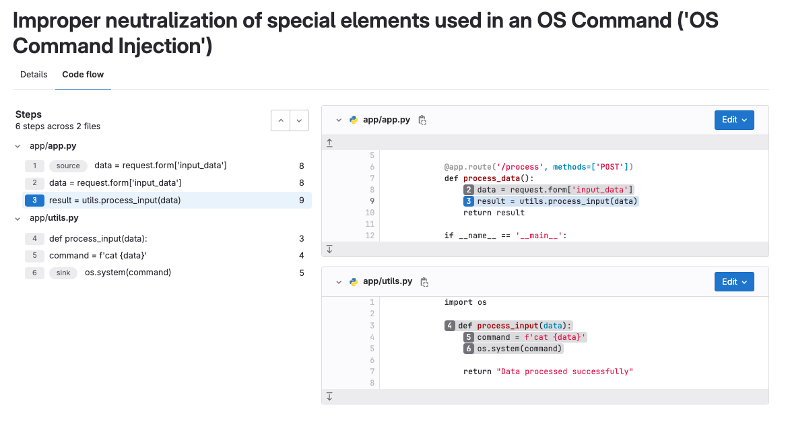

# GitLab Advanced SAST analyzer

DETAILS:
**Tier:** Ultimate
**Offering:** GitLab.com, Self-managed, GitLab Dedicated

> - Introduced in GitLab 17.1 as an [experiment](../../../policy/experiment-beta-support.md) for Python.
> - Support for Go and Java added in 17.2.
> - [Changed](https://gitlab.com/gitlab-org/gitlab/-/issues/461859) to beta in GitLab 17.2.
> - Support for JavaScript, TypeScript and C# added in 17.3.
> - [Changed](https://gitlab.com/gitlab-org/gitlab/-/issues/474094) to GA in GitLab 17.3.
> - Support for Java Server Pages (JSP) added in GitLab 17.4.

GitLab Advanced SAST is a Static Application Security Testing (SAST) analyzer
designed to discover vulnerabilities by performing cross-function and cross-file taint analysis.

GitLab Advanced SAST is an opt-in feature.
When it is enabled, the GitLab Advanced SAST analyzer scans all the files of the supported languages,
using the GitLab Advanced SAST predefined ruleset.
The Semgrep analyzer will not scan these files.

All vulnerabilities identified by the GitLab Advanced SAST analyzer will be reported,
including vulnerabilities previously reported by the Semgrep analyzer.
An automated transition process is proposed for the future,
in which the Vulnerability Management system will automatically de-duplicate findings
that were identified by both the GitLab Advanced SAST analyzer and the Semgrep analyzer.
It's proposed that the capability will be based on the advanced tracking algorithm
and will keep the original record of the vulnerability
(if it was first identified by Semgrep, then the Semgrep finding).

NOTE:
In case a duplicated vulnerability was already introduced (in the interim time until the deduplication is available),the deduplication capability will not deduplicate it. The capability will be relevant only for validating new vulnerabilities that are not already duplicated.

By following the paths user inputs take, the analyzer identifies potential points
where untrusted data can influence the execution of your application in unsafe ways,
ensuring that injection vulnerabilities, such as SQL injection and cross-site scripting (XSS),
are detected even when they span multiple functions and files.

GitLab Advanced SAST includes the following features:

- Source detection: Usually user input that can be tweaked by a malicious entity.
- Sink detection: Sensitive function calls, whose arguments should not be controlled by the user.
- Cross-function analysis: Tracks data flow through different functions to detect vulnerabilities that span multiple functions.
- Cross-file analysis: Tracks data flow across different files, discovering vulnerabilities at a deeper level.
- Sanitizer detection: Avoid false positive results in case the user input is properly sanitized.

<i class="fa fa-youtube-play youtube" aria-hidden="true"></i>
For an overview of GitLab Advanced SAST and how it works, see [GitLab Advanced SAST: Accelerating Vulnerability Resolution](https://youtu.be/xDa1MHOcyn8).

For a product tour, see the [GitLab Advanced SAST product tour](https://gitlab.navattic.com/advanced-sast).

## Supported languages

GitLab Advanced SAST supports the following languages with cross-function and cross-file taint analysis:

- C#
- Go
- Java, including Java Server Pages (JSP)
- JavaScript, TypeScript
- Python
- Ruby

## Configuration

Enable the Advanced SAST analyzer to discover vulnerabilities in your application by performing
cross-function and cross-file taint analysis. You can then adjust its behavior by using CI/CD
variables.

### Requirements

Like other GitLab SAST analyzers, the Advanced SAST analyzer requires a runner and a CI/CD pipeline; see [SAST requirements](index.md#requirements) for details.

On GitLab self-managed, you must also use a GitLab version that supports Advanced SAST:

- You should use GitLab 17.4 or later if possible. GitLab 17.4 includes a new code-flow view, vulnerability deduplication, and further updates to the SAST CI/CD template.
- The [SAST CI/CD templates](index.md#stable-vs-latest-sast-templates) were updated to include Advanced SAST in the following releases:
  - The stable template includes Advanced SAST in GitLab 17.3 or later.
  - The latest template includes Advanced SAST in GitLab 17.2 or later. Note that you [should not mix latest and stable templates](../index.md#template-editions) in a single project.
- At a minimum, GitLab Advanced SAST requires version 17.1 or later.

### Enable Advanced SAST scanning

Advanced SAST is included in the standard GitLab SAST CI/CD template, but isn't yet enabled by default.
To enable it, set the CI/CD variable `GITLAB_ADVANCED_SAST_ENABLED` to `true`.
You can set this variable in different ways depending on how you manage your CI/CD configuration.

#### Edit the CI/CD pipeline definition manually

If you've already enabled GitLab SAST scanning in your project, add a new CI/CD variable to enable GitLab SAST.

This minimal YAML file includes the [stable SAST template](index.md#stable-vs-latest-sast-templates) and enables Advanced SAST:

```yaml
include:
  - template: Jobs/SAST.gitlab-ci.yml

variables:
  GITLAB_ADVANCED_SAST_ENABLED: 'true'
```

#### Enforce it in a Scan Execution Policy

To enable Advanced SAST in a [Scan Execution Policy](../policies/scan_execution_policies.md), update your policy's scan action to set the CI/CD variable `GITLAB_ADVANCED_SAST_ENABLED` to `true`.
You can set this variable by:

- Selecting it from the menu in the [policy editor](../policies/scan_execution_policies.md#scan-execution-policy-editor).
- Adding it to the [`variables` object](../policies/scan_execution_policies.md#scan-action-type) in the scan action.

#### By using the pipeline editor

To enable Advanced SAST by using the pipeline editor:

1. In your project, select **Build > Pipeline editor**.
1. If no `.gitlab-ci.yml` file exists, select **Configure pipeline**, then delete the example
   content.
1. Update the CI/CD configuration to:
   - Include one of the GitLab-managed [SAST CI/CD templates](index.md#stable-vs-latest-sast-templates) if it is not [already included](index.md#configure-sast-in-your-cicd-yaml).
       - In GitLab 17.3 or later, you should use the stable template, `Jobs/SAST.gitlab-ci.yml`.
       - In GitLab 17.2, Advanced SAST is only available in the latest template, `Jobs/SAST.latest.gitlab-ci.yml`. Note that you [should not mix latest and stable templates](../index.md#template-editions) in a single project.
       - In GitLab 17.1, you must manually copy the contents of the Advanced SAST job into your CI/CD pipeline definition.
   - Set the CI/CD variable `GITLAB_ADVANCED_SAST_ENABLED` to `true`.

   See the [minimal YAML example above](#edit-the-cicd-pipeline-definition-manually).
1. Select the **Validate** tab, then select **Validate pipeline**.

   The message **Simulation completed successfully** confirms the file is valid.
1. Select the **Edit** tab.
1. Complete the fields. Do not use the default branch for the **Branch** field.
1. Select the **Start a new merge request with these changes** checkbox, then select **Commit
   changes**.
1. Complete the fields according to your standard workflow, then select **Create
   merge request**.
1. Review and edit the merge request according to your standard workflow, then select **Merge**.

Pipelines now include an Advanced SAST job.

## Vulnerability code flow

> - [Introduced](https://gitlab.com/gitlab-org/gitlab/-/issues/458062) in GitLab 17.2 [with a flag](../../../administration/feature_flags.md) named `vulnerability_code_flow`. Disabled by default.
> - [Enabled on GitLab.com](https://gitlab.com/gitlab-org/gitlab/-/issues/465776) in GitLab 17.4.

FLAG:
The availability of this feature is controlled by a feature flag.
For more information, see the history.
This feature is available for testing, but not ready for production use.

For some vulnerabilities detected by Advanced SAST, a **Code flow** tab is available in the [Vulnerability Page](../vulnerabilities/index.md).
A vulnerability's code flow is the path the data takes from the user input (source) to the vulnerable line of code (sink),
through all assignments, manipulation, and sanitization. This information helps you understand and evaluate the
vulnerability's context, impact, and risk.

The **Code flow** tab shows:

- The steps from source to sink.
- The relevant files, including code snippets.



## Troubleshooting

If you encounter issues while using GitLab Advanced SAST, refer to the [troubleshooting guide](troubleshooting.md).

## Feedback

Feel free to add your feedback in the dedicated [issue 466322](https://gitlab.com/gitlab-org/gitlab/-/issues/466322).
