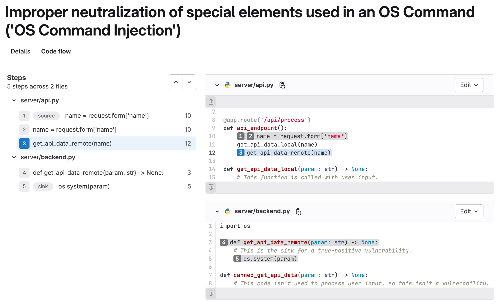



- Tier: Ultimate
- Offering: GitLab.com, GitLab Self-Managed, GitLab Dedicated





- Introduced in GitLab 17.1 as an [experiment](../../../policy/development_stages_support.md) for Python.
- Support for Go and Java added in 17.2.
- [Changed](https://gitlab.com/gitlab-org/gitlab/-/issues/461859) from experiment to beta in GitLab 17.2.
- Support for JavaScript, TypeScript, and C# added in 17.3.
- [Generally available](https://gitlab.com/gitlab-org/gitlab/-/issues/474094) in GitLab 17.3.
- Support for Java Server Pages (JSP) added in GitLab 17.4.
- Support for PHP [added](https://gitlab.com/groups/gitlab-org/-/epics/14273) in GitLab 18.1.



GitLab Advanced SAST is a Static Application Security Testing (SAST) analyzer
designed to discover vulnerabilities by performing cross-function and cross-file taint analysis.

GitLab Advanced SAST is an opt-in feature.
When it is enabled, the GitLab Advanced SAST analyzer scans all the files of the supported languages,
using the GitLab Advanced SAST predefined ruleset.
The Semgrep analyzer will not scan these files.

All vulnerabilities identified by the GitLab Advanced SAST analyzer will be reported,
including vulnerabilities previously reported by the Semgrep-based analyzer.
An automated [transition process](#transitioning-from-semgrep-to-gitlab-advanced-sast) de-duplicates findings
when GitLab Advanced SAST locates the same type of vulnerability in the same location as the Semgrep-based analyzer.

<i class="fa fa-youtube-play youtube" aria-hidden="true"></i>
For an overview of GitLab Advanced SAST and how it works, see [GitLab Advanced SAST: Accelerating Vulnerability Resolution](https://youtu.be/xDa1MHOcyn8).

For a product tour, see the [GitLab Advanced SAST product tour](https://gitlab.navattic.com/advanced-sast).

## Feature comparison

| Feature                                                                      | SAST                                                                                                                                      | Advanced SAST                                                                                                                               |
|------------------------------------------------------------------------------|-------------------------------------------------------------------------------------------------------------------------------------------|---------------------------------------------------------------------------------------------------------------------------------------------|
| Depth of Analysis                                                            | Limited ability to detect complex vulnerabilities; analysis is limited to a single file, and (with limited exceptions) a single function. | Detects complex vulnerabilities using cross-file, cross-function taint analysis.                                                            |
| Accuracy                                                                     | More likely to create false-positive results due to limited context.                                                                      | Creates fewer false-positive results by using cross-file, cross-function taint analysis to focus on truly exploitable vulnerabilities.      |
| Remediation Guidance                                                         | Vulnerability findings are identified by line number.                                                                                     | Detailed [code flow view](#vulnerability-code-flow) shows how the vulnerability flows through the program, allowing for faster remediation. |
| Works with GitLab Duo Vulnerability Explanation and Vulnerability Resolution | Yes.                                                                                                                                      | Yes.                                                                                                                                        |
| Language coverage                                                            | [More expansive](_index.md#supported-languages-and-frameworks).                                                                            | [More limited](#supported-languages).                                                                                                       |

## When vulnerabilities are reported

GitLab Advanced SAST uses cross-file, cross-function scanning with taint analysis to trace the flow of user input into the program.
By following the paths user inputs take, the analyzer identifies potential points
where untrusted data can influence the execution of your application in unsafe ways,
ensuring that injection vulnerabilities, such as SQL injection and cross-site scripting (XSS),
are detected even when they span multiple functions and files.

To minimize noise, GitLab Advanced SAST only reports taint-based vulnerabilities when there is a verifiable flow that brings untrusted user input source to a sensitive sink.
Other products may report vulnerabilities with less validation.

GitLab Advanced SAST is tuned to emphasize input that crosses trust boundaries, like values that are sourced from HTTP requests.
The set of untrusted input sources does not include command-line arguments, environment variables, or other inputs that are typically provided by the user operating the program.

For details of which types of vulnerabilities GitLab Advanced SAST detects, see [GitLab Advanced SAST CWE coverage](advanced_sast_coverage.md).

## Transitioning from Semgrep to GitLab Advanced SAST

When you migrate from Semgrep to GitLab Advanced SAST, an automated transition process deduplicates vulnerabilities. This process links previously detected Semgrep vulnerabilities with corresponding GitLab Advanced SAST findings, replacing them when a match is found.

### How vulnerability transition works

After enabling Advanced SAST scanning in the **default branch** (see [Enable GitLab Advanced SAST scanning](#enable-gitlab-advanced-sast-scanning)), when a scan runs and detects vulnerabilities, it checks whether any of them should replace existing Semgrep vulnerabilities based on the following conditions.

#### Conditions for deduplication

1. **Matching Identifier**:
   - At least one of the GitLab Advanced SAST vulnerability's identifiers (excluding CWE and OWASP) must match the **primary identifier** of an existing Semgrep vulnerability.
   - The primary identifier is the first identifier in the vulnerability's identifiers array in the [SAST report](_index.md#download-a-sast-report).
   - For example, if a GitLab Advanced SAST vulnerability has identifiers including `bandit.B506` and a Semgrep vulnerability's primary identifier is also `bandit.B506`, this condition is met.

1. **Matching Location**:
   - The vulnerabilities must be associated with the **same location** in the code. This is determined using one of the following fields in a vulnerability in the [SAST report](_index.md#download-a-sast-report):
     - Tracking field (if present)
     - Location field (if the Tracking field is absent)

### Changes to the vulnerability

When the conditions are met, the existing Semgrep vulnerability is converted into a GitLab Advanced SAST vulnerability. This updated vulnerability appears in the [Vulnerability Report](../vulnerability_report/_index.md) with the following changes:

- The scanner type updates from Semgrep to GitLab Advanced SAST.
- Any additional identifiers present in the GitLab Advanced SAST vulnerability are added to the existing vulnerability.
- All other details of the vulnerability remain unchanged.

### Handling duplicated vulnerabilities

In some cases, Semgrep vulnerabilities may still appear as duplicates if the [deduplication conditions](#conditions-for-deduplication) are not met. To resolve this in the [Vulnerability Report](../vulnerability_report/_index.md):

1. [Filter vulnerabilities](../vulnerability_report/_index.md#filtering-vulnerabilities) by Advanced SAST scanner and [export the results in CSV format](../vulnerability_report/_index.md#export-details).
1. [Filter vulnerabilities](../vulnerability_report/_index.md#filtering-vulnerabilities) by Semgrep scanner. These are likely the vulnerabilities that were not deduplicated.
1. For each Semgrep vulnerability, check if it has a corresponding match in the exported Advanced SAST results.
1. If a duplicate exists, resolve the Semgrep vulnerability appropriately.

## Supported languages

GitLab Advanced SAST supports the following languages with cross-function and cross-file taint analysis:

- C#
- Go
- Java, including Java Server Pages (JSP)
- JavaScript, TypeScript
- PHP
- Python
- Ruby

### PHP known issues

When analyzing PHP code, GitLab Advanced SAST has the following limitations:

- **Dynamic file inclusion**: Dynamic file inclusion statements (`include`, `include_once`, `require`, `require_once`) using variables for file paths are not supported in this release. Only static file inclusion paths are supported for cross-file analysis. See [issue 527341](https://gitlab.com/gitlab-org/gitlab/-/issues/527341).
- **Case sensitivity**: PHP's case-insensitive nature for function names, class names, and method names is not fully supported in cross-file analysis. See [issue 526528](https://gitlab.com/gitlab-org/gitlab/-/issues/526528).

## Configuration

Enable the GitLab Advanced SAST analyzer to discover vulnerabilities in your application by performing
cross-function and cross-file taint analysis. You can then adjust its behavior by using CI/CD
variables.

### Available CI/CD variables

GitLab Advanced SAST can be configured using the following CI/CD variables.

| CI/CD variable                 | Default | Description                                                                   |
|--------------------------------|---------|-------------------------------------------------------------------------------|
| `GITLAB_ADVANCED_SAST_ENABLED` | `false` | Set to `true` to enable GitLab Advanced SAST scanning, or `false` to disable. |
| `FF_GLAS_ENABLE_PHP_SUPPORT`   | `true`  | Set to `true` to analyze PHP files, or false to disable.                      |

### Requirements

Like other GitLab SAST analyzers, the GitLab Advanced SAST analyzer requires a runner and a CI/CD pipeline; see [SAST requirements](_index.md#getting-started) for details.

On GitLab Self-Managed, you must also use a GitLab version that supports GitLab Advanced SAST:

- You should use GitLab 17.4 or later if possible. GitLab 17.4 includes a new code-flow view, vulnerability deduplication, and further updates to the SAST CI/CD template.
- The [SAST CI/CD templates](_index.md#stable-vs-latest-sast-templates) were updated to include GitLab Advanced SAST in the following releases:
  - The stable template includes GitLab Advanced SAST in GitLab 17.3 or later.
  - The latest template includes GitLab Advanced SAST in GitLab 17.2 or later. Don't mix [latest and stable templates](../detect/security_configuration.md#template-editions) in a single project.
- At a minimum, GitLab Advanced SAST requires version 17.1 or later.

### Enable GitLab Advanced SAST scanning

GitLab Advanced SAST is included in the standard GitLab SAST CI/CD template, but isn't yet enabled by default.
To enable it, set the CI/CD variable `GITLAB_ADVANCED_SAST_ENABLED` to `true`.
You can set this variable in different ways depending on how you manage your CI/CD configuration.

#### Edit the CI/CD pipeline definition manually

If you've already enabled GitLab SAST scanning in your project, add a CI/CD variable to enable
GitLab Advanced SAST.

This minimal YAML file includes the [stable SAST template](_index.md#stable-vs-latest-sast-templates) and enables GitLab Advanced SAST:

```yaml
include:
  - template: Jobs/SAST.gitlab-ci.yml

variables:
  GITLAB_ADVANCED_SAST_ENABLED: 'true'
```

#### Enforce it in a Scan Execution Policy

To enable GitLab Advanced SAST in a [Scan Execution Policy](../policies/scan_execution_policies.md), update your policy's scan action to set the CI/CD variable `GITLAB_ADVANCED_SAST_ENABLED` to `true`.
You can set this variable by:

- Selecting it from the menu in the [policy editor](../policies/scan_execution_policies.md#scan-execution-policy-editor).
- Adding it to the [`variables` object](../policies/scan_execution_policies.md#scan-action-type) in the scan action.

#### By using the pipeline editor

To enable GitLab Advanced SAST by using the pipeline editor:

1. In your project, select **Build > Pipeline editor**.
1. If no `.gitlab-ci.yml` file exists, select **Configure pipeline**, then delete the example
   content.
1. Update the CI/CD configuration to:
   - Include one of the GitLab-managed [SAST CI/CD templates](_index.md#stable-vs-latest-sast-templates) if it is not [already included](_index.md#configure-sast-in-your-cicd-yaml).
       - In GitLab 17.3 or later, you should use the stable template, `Jobs/SAST.gitlab-ci.yml`.
       - In GitLab 17.2, GitLab Advanced SAST is only available in the latest template, `Jobs/SAST.latest.gitlab-ci.yml`. Don't mix [latest and stable templates](../detect/security_configuration.md#template-editions) in a single project.
       - In GitLab 17.1, you must manually copy the contents of the GitLab Advanced SAST job into your CI/CD pipeline definition.
   - Set the CI/CD variable `GITLAB_ADVANCED_SAST_ENABLED` to `true`.

   See the [minimal YAML example](#edit-the-cicd-pipeline-definition-manually).
1. Select the **Validate** tab, then select **Validate pipeline**.

   The message **Simulation completed successfully** confirms the file is valid.
1. Select the **Edit** tab.
1. Complete the fields. Do not use the default branch for the **Branch** field.
1. Select the **Start a new merge request with these changes** checkbox, then select **Commit
   changes**.
1. Complete the fields according to your standard workflow, then select **Create
   merge request**.
1. Review and edit the merge request according to your standard workflow, then select **Merge**.

Pipelines now include a GitLab Advanced SAST job.

### Disable GitLab Advanced SAST scanning

Advanced SAST scanning is not enabled by default, but it may be enabled at the group level or in another way that affects multiple projects.

To explicitly disable Advanced SAST scanning in a project, set the CI/CD variable `GITLAB_ADVANCED_SAST_ENABLED` to `false`.
You can set this variable anywhere you can configure CI/CD variables, including the same ways you can [enable Advanced SAST scanning](#enable-gitlab-advanced-sast-scanning).

## Vulnerability code flow



- Introduced in GitLab 17.3 [with several flags](../../../administration/feature_flags/_index.md). Enabled by default.
- Enabled on GitLab Self-Managed and GitLab Dedicated in GitLab 17.7.
- Generally available in GitLab 17.7. All feature flags removed.



For specific types of vulnerabilities, GitLab Advanced SAST provides code flow information.
A vulnerability's code flow is the path the data takes from the user input (source) to the vulnerable line of code (sink), through all assignments, manipulation, and sanitization.
This information helps you understand and evaluate the vulnerability's context, impact, and risk.
Code flow information is available for vulnerabilities that are detected by tracing input from a source to a sink, including:

- SQL injection
- Command injection
- Cross-site scripting (XSS)
- Path traversal

The code flow information is shown the **Code flow** tab and includes:

- The steps from source to sink.
- The relevant files, including code snippets.



## Customize GitLab Advanced SAST

You can disable GitLab Advanced SAST rules or edit their metadata, just as you can other analyzers.
For details, see [Customize rulesets](customize_rulesets.md#disable-predefined-gitlab-advanced-sast-rules).

## Request source code of LGPL-licensed components in GitLab Advanced SAST

To request information about the source code of LGPL-licensed components in GitLab Advanced SAST,
[contact GitLab Support](https://about.gitlab.com/support/).

To ensure a quick response, include the GitLab Advanced SAST analyzer version in your request.

Because this feature is only available at the Ultimate tier, you must be associated with an organization with that level of support entitlement.

## Feedback

Feel free to add your feedback in the dedicated [issue 466322](https://gitlab.com/gitlab-org/gitlab/-/issues/466322).

## Troubleshooting

When working with GitLab Advanced SAST, you might encounter the following issues.

### Slow scans or timeouts with Advanced SAST

Because [Advanced SAST](gitlab_advanced_sast.md) scans your program in detail, scans can sometimes
take a long time to complete, especially for large repositories. If you're experiencing performance
issues, consider following the recommendations here.

#### Reduce scan time by excluding files

Because each file is analyzed against all applicable rules, you can reduce the number of files
scanned to decrease scan time. To do this, use the
[SAST_EXCLUDED_PATHS](_index.md#vulnerability-filters) variable to exclude folders that do not need
to be scanned. Effective exclusions vary, but might include:

- Database migrations
- Unit tests
- Dependency directories, such as `node_modules/`
- Build directories

#### Optimize scans with multi-core scanning

Multi-core scanning is enabled by default in the Advanced SAST (analyzer version v1.1.10 and later).
You can increase the runner size to make more resources available for scanning. For self-hosted
runners, you may need to customize the `--multi-core` flag in the
[security scanner configuration](_index.md#security-scanner-configuration).

#### When to seek support

If you've followed these optimization steps and your Advanced SAST scan is still running longer than
expected, reach out to GitLab Support for further assistance with the following information:

- [GitLab Advanced SAST analyzer version](#identify-the-gitlab-advanced-sast-analyzer-version)
- Programming language used in your repository
- [Debug logs](../troubleshooting_application_security.md#debug-level-logging)
- [Performance debugging artifact](#generate-a-performance-debugging-artifact)

##### Identify the GitLab Advanced SAST analyzer version

To identify the GitLab Advanced SAST analyzer version:

1. On the left sidebar, select **Search or go to** and find your project.
1. Select **Build > Jobs**.
1. Locate the `gitlab-advanced-sast` job.
1. In the output of the job, search for the string `GitLab GitLab Advanced SAST analyzer`.

You should find the version at the end of line with that string. For example:

```plaintext
[INFO] [GitLab Advanced SAST] [2025-01-24T15:51:03Z] ▶ GitLab GitLab Advanced SAST analyzer v1.1.1
```

In this example, the version is `1.1.1`.

##### Generate a performance debugging artifact

To generate the `trace.ctf` artifact, add the following to your `.gitlab-ci.yml`.

Set `RUNNER_SCRIPT_TIMEOUT` to at least 10 minutes shorter than `timeout` to ensure the artifact has
time to upload.

```yaml
include:
  - template: Jobs/SAST.gitlab-ci.yml

variables:
  GITLAB_ADVANCED_SAST_ENABLED: 'true'
  MEMTRACE: 'trace.ctf'
  DISABLE_MULTI_CORE: true # Disable multi core when collecting memtrace

gitlab-advanced-sast:
  artifacts:
    paths:
      - '**/trace.ctf'  # Collects all trace.ctf files generated by this job
    expire_in: 1 week   # Sets retention for artifacts
    when: always        # Ensures artifact export even if the job fails
  variables:
    RUNNER_SCRIPT_TIMEOUT: 50m
  timeout: 1h
```
