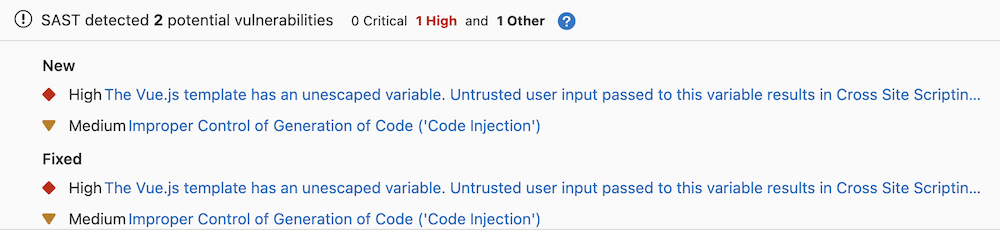
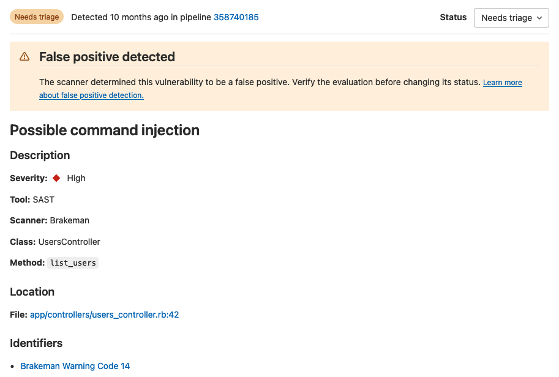

# Static Application Security Testing (SAST) **(FREE)**

> All open source (OSS) analyzers were moved from GitLab Ultimate to GitLab Free in GitLab 13.3.

NOTE:
The whitepaper ["A Seismic Shift in Application Security"](https://about.gitlab.com/resources/whitepaper-seismic-shift-application-security/)
explains how 4 of the top 6 attacks were application based. Download it to learn how to protect your
organization.

If you're using [GitLab CI/CD](../../../ci/index.md), you can use Static Application Security
Testing (SAST) to check your source code for known vulnerabilities. You can run SAST analyzers in
any GitLab tier. The analyzers output JSON-formatted reports as job artifacts.

With GitLab Ultimate, SAST results are also processed so you can:

- See them in merge requests.
- Use them in approval workflows.
- Review them in the security dashboard.

For more details, see the [Summary of features per tier](#summary-of-features-per-tier).



The results are sorted by the priority of the vulnerability:

<!-- vale gitlab.SubstitutionWarning = NO -->

1. Critical
1. High
1. Medium
1. Low
1. Info
1. Unknown

<!-- vale gitlab.SubstitutionWarning = YES -->

A pipeline consists of multiple jobs, including SAST and DAST scanning. If any job fails to finish
for any reason, the security dashboard does not show SAST scanner output. For example, if the SAST
job finishes but the DAST job fails, the security dashboard does not show SAST results. On failure,
the analyzer outputs an [exit code](../../../development/integrations/secure.md#exit-code).

## Use cases

- Your code has a potentially dangerous attribute in a class, or unsafe code
  that can lead to unintended code execution.
- Your application is vulnerable to cross-site scripting (XSS) attacks that can
  be leveraged to unauthorized access to session data.

## Requirements

SAST runs in the `test` stage, which is available by default. If you redefine the stages in the `.gitlab-ci.yml` file, the `test` stage is required.

To run SAST jobs, by default, you need GitLab Runner with the
[`docker`](https://docs.gitlab.com/runner/executors/docker.html) or
[`kubernetes`](https://docs.gitlab.com/runner/install/kubernetes.html) executor.
If you're using the shared runners on GitLab.com, this is enabled by default.

WARNING:
GitLab SAST analyzers don't support running on Windows or on any CPU architectures other than amd64.

WARNING:
If you use your own runners, make sure the Docker version installed
is **not** `19.03.0`. See [troubleshooting information](#error-response-from-daemon-error-processing-tar-file-docker-tar-relocation-error) for details.

## Supported languages and frameworks

GitLab SAST supports scanning a variety of programming languages and frameworks.
Once you [enable SAST](#configuration), the right set of analyzers runs automatically even if your project uses more than one language.

For more information about our plans for language support in SAST, see the [category direction page](https://about.gitlab.com/direction/secure/static-analysis/sast/#language-support).

| Language / framework         | [Analyzer](analyzers.md) used for scanning                                                                   | Minimum supported GitLab version                                                        |
|------------------------------|--------------------------------------------------------------------------------------------------------------|-----------------------------------------------------------------------------------------|
| .NET Core                    | [Security Code Scan](https://gitlab.com/gitlab-org/security-products/analyzers/security-code-scan)           | 11.0                                                                                    |
| .NET Framework<sup>1</sup>   | [Security Code Scan](https://gitlab.com/gitlab-org/security-products/analyzers/security-code-scan)           | 13.0                                                                                    |
| .NET (all versions, C# only) | [Semgrep](https://gitlab.com/gitlab-org/security-products/analyzers/semgrep) with [GitLab-managed rules](https://gitlab.com/gitlab-org/security-products/analyzers/semgrep/-/blob/main/RULES.md)       | 15.4                                                                                    |
| Apex (Salesforce)            | [PMD](https://gitlab.com/gitlab-org/security-products/analyzers/pmd-apex)                                    | 12.1                                                                                    |
| C                            | [Semgrep](https://gitlab.com/gitlab-org/security-products/analyzers/semgrep) with [GitLab-managed rules](https://gitlab.com/gitlab-org/security-products/analyzers/semgrep/-/blob/main/RULES.md)       | 14.2                                                                                    |
| C/C++                        | [Flawfinder](https://gitlab.com/gitlab-org/security-products/analyzers/flawfinder)                           | 10.7                                                                                    |
| Elixir (Phoenix)             | [Sobelow](https://gitlab.com/gitlab-org/security-products/analyzers/sobelow)                                 | 11.1                                                                                    |
| Go<sup>3</sup>               | [Gosec](https://gitlab.com/gitlab-org/security-products/analyzers/gosec)                                     | 10.7                                                                                    |
| Go                           | [Semgrep](https://gitlab.com/gitlab-org/security-products/analyzers/semgrep) with [GitLab-managed rules](https://gitlab.com/gitlab-org/security-products/analyzers/semgrep/-/blob/main/RULES.md)       | 14.4                                                                                    |
| Groovy<sup>2</sup>           | [SpotBugs](https://gitlab.com/gitlab-org/security-products/analyzers/spotbugs) with the find-sec-bugs plugin | 11.3 (Gradle) & 11.9 (Maven, SBT)                                                       |
| Helm Charts                  | [Kubesec](https://gitlab.com/gitlab-org/security-products/analyzers/kubesec)                                 | 13.1                                                                                    |
| Java (any build system)      | [Semgrep](https://gitlab.com/gitlab-org/security-products/analyzers/semgrep) with [GitLab-managed rules](https://gitlab.com/gitlab-org/security-products/analyzers/semgrep/-/blob/main/RULES.md)       | 14.10                                                                                   |
| Java<sup>2, 3</sup>          | [SpotBugs](https://gitlab.com/gitlab-org/security-products/analyzers/spotbugs) with the find-sec-bugs plugin | 10.6 (Maven), 10.8 (Gradle) & 11.9 (SBT)                                                |
| Java (Android)               | [MobSF (beta)](https://gitlab.com/gitlab-org/security-products/analyzers/mobsf)                              | 13.5                                                                                    |
| JavaScript<sup>3</sup>       | [ESLint security plugin](https://gitlab.com/gitlab-org/security-products/analyzers/eslint)                   | 11.8                                                                                    |
| JavaScript                   | [Semgrep](https://gitlab.com/gitlab-org/security-products/analyzers/semgrep) with [GitLab-managed rules](https://gitlab.com/gitlab-org/security-products/analyzers/semgrep/-/blob/main/RULES.md)       | 13.10                                                                                   |
| Kotlin (Android)             | [MobSF (beta)](https://gitlab.com/gitlab-org/security-products/analyzers/mobsf)                              | 13.5                                                                                    |
| Kotlin (General)<sup>2</sup> | [SpotBugs](https://gitlab.com/gitlab-org/security-products/analyzers/spotbugs) with the find-sec-bugs plugin | 13.11                                                                                   |
| Kubernetes manifests         | [Kubesec](https://gitlab.com/gitlab-org/security-products/analyzers/kubesec)                                 | 12.6                                                                                    |
| Node.js                      | [NodeJsScan](https://gitlab.com/gitlab-org/security-products/analyzers/nodejs-scan)                          | 11.1                                                                                    |
| Objective-C (iOS)            | [MobSF (beta)](https://gitlab.com/gitlab-org/security-products/analyzers/mobsf)                              | 13.5                                                                                    |
| PHP                          | [phpcs-security-audit](https://gitlab.com/gitlab-org/security-products/analyzers/phpcs-security-audit)       | 10.8                                                                                    |
| Python<sup>3</sup>           | [bandit](https://gitlab.com/gitlab-org/security-products/analyzers/bandit)                                   | 10.3                                                                                    |
| Python                       | [Semgrep](https://gitlab.com/gitlab-org/security-products/analyzers/semgrep) with [GitLab-managed rules](https://gitlab.com/gitlab-org/security-products/analyzers/semgrep/-/blob/main/RULES.md)       | 13.9                                                                                    |
| React<sup>3</sup>            | [ESLint react plugin](https://gitlab.com/gitlab-org/security-products/analyzers/eslint)                      | 12.5                                                                                    |
| React                        | [Semgrep](https://gitlab.com/gitlab-org/security-products/analyzers/semgrep) with [GitLab-managed rules](https://gitlab.com/gitlab-org/security-products/analyzers/semgrep/-/blob/main/RULES.md)       | 13.10                                                                                   |
| Ruby                         | [brakeman](https://gitlab.com/gitlab-org/security-products/analyzers/brakeman)                               | 13.9                                                                                    |
| Ruby on Rails                | [brakeman](https://gitlab.com/gitlab-org/security-products/analyzers/brakeman)                               | 10.3                                                                                    |
| Scala<sup>2</sup>            | [SpotBugs](https://gitlab.com/gitlab-org/security-products/analyzers/spotbugs) with the find-sec-bugs plugin | 11.0 (SBT) & 11.9 (Gradle, Maven)                                                       |
| Swift (iOS)                  | [MobSF (beta)](https://gitlab.com/gitlab-org/security-products/analyzers/mobsf)                              | 13.5                                                                                    |
| TypeScript<sup>3</sup>       | [ESLint security plugin](https://gitlab.com/gitlab-org/security-products/analyzers/eslint)                   | 11.9, [merged](https://gitlab.com/gitlab-org/gitlab/-/issues/36059) with ESLint in 13.2 |
| TypeScript                   | [Semgrep](https://gitlab.com/gitlab-org/security-products/analyzers/semgrep) with [GitLab-managed rules](https://gitlab.com/gitlab-org/security-products/analyzers/semgrep/-/blob/main/RULES.md)       | 13.10                                                                                   |

1. .NET 4 support is limited. The analyzer runs in a Linux container and does not have access to Windows-specific libraries or features. Use the Semgrep-based scanner if you need .NET 4 support.
1. The SpotBugs-based analyzer supports [Gradle](https://gradle.org/), [Maven](https://maven.apache.org/), and [SBT](https://www.scala-sbt.org/). It can also be used with variants like the
[Gradle wrapper](https://docs.gradle.org/current/userguide/gradle_wrapper.html),
[Grails](https://grails.org/),
and the [Maven wrapper](https://github.com/takari/maven-wrapper). However, SpotBugs has [limitations](https://gitlab.com/gitlab-org/gitlab/-/issues/350801) when used against [Ant](https://ant.apache.org/)-based projects. We recommend using the Semgrep-based analyzer for Ant-based Java projects.
1. These analyzers reached [End of Support](https://about.gitlab.com/handbook/product/gitlab-the-product/#end-of-support) status [in GitLab 15.4](https://gitlab.com/gitlab-org/gitlab/-/issues/352554).

## Multi-project support

> [Introduced](https://gitlab.com/groups/gitlab-org/-/epics/4895) in GitLab 13.7.

GitLab SAST can scan repositories that contain multiple projects.

The following analyzers have multi-project support:

- Bandit
- ESLint
- Gosec
- Kubesec
- NodeJsScan
- MobSF
- PMD
- Security Code Scan
- Semgrep
- SpotBugs
- Sobelow

### Enable multi-project support for Security Code Scan

Multi-project support in the Security Code Scan requires a Solution (`.sln`) file in the root of
the repository. For details on the Solution format, see the Microsoft reference [Solution (`.sln`) file](https://learn.microsoft.com/en-us/visualstudio/extensibility/internals/solution-dot-sln-file?view=vs-2019).

## False positive detection **(ULTIMATE)**

> - Introduced for Ruby in GitLab 14.2.
> - [Introduced](https://gitlab.com/gitlab-org/gitlab/-/issues/378622) for Go in GitLab 15.8.

GitLab SAST can identify certain types of false positive results in the output of other tools.
These results are flagged as false positives on the [Vulnerability Report](../vulnerability_report/index.md) and the [Vulnerability Page](../vulnerabilities/index.md).

False positive detection is available in a subset of the [supported languages](#supported-languages-and-frameworks) and [analyzers](analyzers.md):

- Go, in the Semgrep-based analyzer
- Ruby, in the Brakeman-based analyzer



## Advanced vulnerability tracking **(ULTIMATE)**

> [Introduced](https://gitlab.com/groups/gitlab-org/-/epics/5144) in GitLab 14.2.

Source code is volatile; as developers make changes, source code may move within files or between files.
Security analyzers may have already reported vulnerabilities that are being tracked in the [Vulnerability Report](../vulnerability_report/index.md).
These vulnerabilities are linked to specific problematic code fragments so that they can be found and fixed.
If the code fragments are not tracked reliably as they move, vulnerability management is harder because the same vulnerability could be reported again.

GitLab SAST uses an advanced vulnerability tracking algorithm to more accurately identify when the same vulnerability has moved within a file due to refactoring or unrelated changes.

Advanced vulnerability tracking is available in a subset of the [supported languages](#supported-languages-and-frameworks) and [analyzers](analyzers.md):

- C, in the Semgrep-based analyzer only
- Go, in the Semgrep-based analyzer only
- Java, in the Semgrep-based analyzer only
- JavaScript, in the Semgrep-based analyzer only
- Python, in the Semgrep-based analyzer only
- Ruby, in the Brakeman-based analyzer

Support for more languages and analyzers is tracked in [this epic](https://gitlab.com/groups/gitlab-org/-/epics/5144).

For more information, see the confidential project `https://gitlab.com/gitlab-org/security-products/post-analyzers/tracking-calculator`. The content of this project is available only to GitLab team members.

## Automatic vulnerability resolution

> - [Introduced](https://gitlab.com/gitlab-org/gitlab/-/issues/368284) in GitLab 15.9 [with a project-level flag](../../../administration/feature_flags.md) named `sec_mark_dropped_findings_as_resolved`.
> - Enabled by default in GitLab 15.10. On GitLab.com, [contact Support](https://about.gitlab.com/support/) if you need to disable the flag for your project.

To help you focus on the vulnerabilities that are still relevant, GitLab SAST automatically [resolves](../vulnerabilities/index.md#vulnerability-status-values) vulnerabilities when:

- You [disable a predefined rule](customize_rulesets.md#disable-predefined-rules).
- We remove a rule from the default ruleset.

Automatic resolution is available only for findings from the [Semgrep-based analyzer](https://gitlab.com/gitlab-org/security-products/analyzers/semgrep).
The Vulnerability Management system leaves a comment on automatically-resolved vulnerabilities so you still have a historical record of the vulnerability.

If you re-enable the rule later, the findings are reopened for triage.

## Supported distributions

The default scanner images are built on a base Alpine image for size and maintainability.

### FIPS-enabled images

> [Introduced](https://gitlab.com/groups/gitlab-org/-/epics/6479) in GitLab 14.10.

GitLab offers an image version, based on the [Red Hat UBI](https://www.redhat.com/en/blog/introducing-red-hat-universal-base-image) base image,
that uses a FIPS 140-validated cryptographic module. To use the FIPS-enabled image, you can either:

- Set the `SAST_IMAGE_SUFFIX` to `-fips`.
- Add the `-fips` extension to the default image name.

For example:

```yaml
variables:
  SAST_IMAGE_SUFFIX: '-fips'

include:
  - template: Security/SAST.gitlab-ci.yml
```

A FIPS-compliant image is only available for the Semgrep-based analyzer.

To use SAST in a FIPS-compliant manner, you must [exclude other analyzers from running](analyzers.md#customize-analyzers).

## Summary of features per tier

Different features are available in different [GitLab tiers](https://about.gitlab.com/pricing/),
as shown in the following table:

| Capability                                                        | In Free & Premium   | In Ultimate        |
|:---------------------------------------------------------------- -|:--------------------|:-------------------|
| Automatically scan code with [appropriate analyzers](#supported-languages-and-frameworks) | **{check-circle}**  | **{check-circle}** |
| [Configure SAST scanners](#configuration)                         | **{check-circle}**  | **{check-circle}** |
| [Customize SAST settings](#available-cicd-variables)              | **{check-circle}**  | **{check-circle}** |
| Download [JSON Report](#reports-json-format)                      | **{check-circle}**  | **{check-circle}** |
| See new findings in merge request widget                          | **{dotted-circle}** | **{check-circle}** |
| [Manage vulnerabilities](../vulnerabilities/index.md)             | **{dotted-circle}** | **{check-circle}** |
| [Access the Security Dashboard](../security_dashboard/index.md)   | **{dotted-circle}** | **{check-circle}** |
| [Configure SAST by using the UI](#configure-sast-by-using-the-ui) | **{dotted-circle}** | **{check-circle}** |
| [Customize SAST rulesets](customize_rulesets.md)                  | **{dotted-circle}** | **{check-circle}** |
| [Detect False Positives](#false-positive-detection)               | **{dotted-circle}** | **{check-circle}** |
| [Track moved vulnerabilities](#advanced-vulnerability-tracking)   | **{dotted-circle}** | **{check-circle}** |

## Contribute your scanner

The [Security Scanner Integration](../../../development/integrations/secure.md) documentation explains how to integrate other security scanners into GitLab.

## Configuration

SAST scanning runs in your CI/CD pipeline.
When you add the GitLab-managed CI/CD template to your pipeline, the right [SAST analyzers](analyzers.md) automatically scan your code and save results as [SAST report artifacts](../../../ci/yaml/artifacts_reports.md#artifactsreportssast).

To configure SAST for a project you can:

- Use [Auto SAST](../../../topics/autodevops/stages.md#auto-sast), provided by
  [Auto DevOps](../../../topics/autodevops/index.md).
- [Configure SAST in your CI/CD YAML](#configure-sast-in-your-cicd-yaml).
- [Configure SAST by using the UI](#configure-sast-by-using-the-ui).

You can enable SAST across many projects by [enforcing scan execution](../index.md#enforce-scan-execution).

### Configure SAST in your CI/CD YAML

To enable SAST, you [include](../../../ci/yaml/index.md#includetemplate)
the [`SAST.gitlab-ci.yml` template](https://gitlab.com/gitlab-org/gitlab/-/blob/master/lib/gitlab/ci/templates/Jobs/SAST.gitlab-ci.yml).
The template is provided as a part of your GitLab installation.

Add the following to your `.gitlab-ci.yml` file:

```yaml
include:
  - template: Jobs/SAST.gitlab-ci.yml
```

The included template creates SAST jobs in your CI/CD pipeline and scans
your project's source code for possible vulnerabilities.

The results are saved as a
[SAST report artifact](../../../ci/yaml/artifacts_reports.md#artifactsreportssast)
that you can later download and analyze.
When downloading, you always receive the most recent SAST artifact available.

### Configure SAST by using the UI

You can enable and configure SAST by using the UI, either with the default settings or with customizations.
The method you can use depends on your GitLab license tier.

#### Configure SAST with customizations **(ULTIMATE)**

> - [Introduced](https://gitlab.com/groups/gitlab-org/-/epics/3659) in GitLab 13.3.
> - [Improved](https://gitlab.com/gitlab-org/gitlab/-/issues/232862) in GitLab 13.4.
> - [Improved](https://gitlab.com/groups/gitlab-org/-/epics/3635) in GitLab 13.5.

NOTE:
The configuration tool works best with no existing `.gitlab-ci.yml` file, or with a minimal
configuration file. If you have a complex GitLab configuration file it may not be parsed
successfully, and an error may occur.

To enable and configure SAST with customizations:

1. On the top bar, select **Main menu > Projects** and find your project.
1. On the left sidebar, select **Security and Compliance > Security configuration**.
1. If the project does not have a `.gitlab-ci.yml` file, select **Enable SAST** in the Static
   Application Security Testing (SAST) row, otherwise select **Configure SAST**.
1. Enter the custom SAST values.

   Custom values are stored in the `.gitlab-ci.yml` file. For CI/CD variables not in the SAST
   Configuration page, their values are inherited from the GitLab SAST template.

1. Optionally, expand the **SAST analyzers** section, select individual
   [SAST analyzers](analyzers.md) and enter custom analyzer values.
1. Select **Create Merge Request**.
1. Review and merge the merge request.

Pipelines now include a SAST job.

#### Configure SAST with default settings only

> [Introduced](https://about.gitlab.com/releases/2021/02/22/gitlab-13-9-released/#security-configuration-page-for-all-users) in GitLab 13.9

NOTE:
The configuration tool works best with no existing `.gitlab-ci.yml` file, or with a minimal
configuration file. If you have a complex GitLab configuration file it may not be parsed
successfully, and an error may occur.

To enable and configure SAST with default settings:

1. On the top bar, select **Main menu > Projects** and find your project.
1. On the left sidebar, select **Security and Compliance** > **Configuration**.
1. In the SAST section, select **Configure with a merge request**.
1. Review and merge the merge request to enable SAST.

Pipelines now include a SAST job.

### Overriding SAST jobs

WARNING:
Beginning in GitLab 13.0, the use of [`only` and `except`](../../../ci/yaml/index.md#only--except)
is no longer supported. When overriding the template, you must use [`rules`](../../../ci/yaml/index.md#rules) instead.

To override a job definition, (for example, change properties like `variables` or `dependencies`),
declare a job with the same name as the SAST job to override. Place this new job after the template
inclusion and specify any additional keys under it. For example, this enables `FAIL_NEVER` for the
`spotbugs` analyzer:

```yaml
include:
  - template: Security/SAST.gitlab-ci.yml

spotbugs-sast:
  variables:
    FAIL_NEVER: 1
```

### Pinning to minor image version

The GitLab-managed CI/CD template specifies a major version and automatically pulls the latest analyzer release within that major version.

In some cases, you may need to use a specific version.
For example, you might need to avoid a regression in a later release.

To override the automatic update behavior, set the `SAST_ANALYZER_IMAGE_TAG` CI/CD variable
in your CI/CD configuration file after you include the [`SAST.gitlab-ci.yml` template](https://gitlab.com/gitlab-org/gitlab/-/blob/master/lib/gitlab/ci/templates/Jobs/SAST.gitlab-ci.yml).

Only set this variable within a specific job.
If you set it [at the top level](../../../ci/variables/index.md#define-a-cicd-variable-in-the-gitlab-ciyml-file), the version you set is used for other SAST analyzers.

You can set the tag to:

- A major version, like `3`. Your pipelines use any minor or patch updates that are released within this major version.
- A minor version, like `3.7`. Your pipelines use any patch updates that are released within this minor version.
- A patch version, like `3.7.0`. Your pipelines don't receive any updates.

This example uses a specific minor version of the `semgrep` analyzer and a specific patch version of the `brakeman` analyzer:

```yaml
include:
  - template: Security/SAST.gitlab-ci.yml

semgrep-sast:
  variables:
    SAST_ANALYZER_IMAGE_TAG: "3.7"

brakeman-sast:
  variables:
    SAST_ANALYZER_IMAGE_TAG: "3.1.1"
```

### Using CI/CD variables to pass credentials for private repositories

Some analyzers require downloading the project's dependencies to
perform the analysis. In turn, such dependencies may live in private Git
repositories and thus require credentials like username and password to download them.
Depending on the analyzer, such credentials can be provided to
it via [custom CI/CD variables](#custom-cicd-variables).

#### Using a CI/CD variable to pass username and password to a private Go repository

If your Go project depends on private modules, see
[Fetch modules from private projects](../../packages/go_proxy/index.md#fetch-modules-from-private-projects)
for how to provide authentication over HTTPS.

To specify credentials via `~/.netrc` provide a `before_script` containing the following:

```yaml
gosec-sast:
  before_script:
    - |
      cat <<EOF > ~/.netrc
      machine gitlab.com
      login $CI_DEPLOY_USER
      password $CI_DEPLOY_PASSWORD
      EOF
```

#### Using a CI/CD variable to pass username and password to a private Maven repository

If your private Maven repository requires login credentials,
you can use the `MAVEN_CLI_OPTS` CI/CD variable.

Read more on [how to use private Maven repositories](../index.md#using-private-maven-repositories).

### Enabling Kubesec analyzer

> [Introduced](https://gitlab.com/gitlab-org/gitlab/-/issues/12752) in GitLab 12.6.

You need to set `SCAN_KUBERNETES_MANIFESTS` to `"true"` to enable the
Kubesec analyzer. In `.gitlab-ci.yml`, define:

```yaml
include:
  - template: Security/SAST.gitlab-ci.yml

variables:
  SCAN_KUBERNETES_MANIFESTS: "true"
```

### Pre-compilation

Most GitLab SAST analyzers directly scan your source code without compiling it first.
However, for technical reasons, some analyzers can only scan compiled code.

By default, these analyzers automatically attempt to fetch dependencies and compile your code so it can be scanned.
Automatic compilation can fail if:

- your project requires custom build configurations.
- you use language versions that aren't built into the analyzer.

To resolve these issues, you can skip the analyzer's compilation step and directly provide artifacts from an earlier stage in your pipeline instead.
This strategy is called _pre-compilation_.

Pre-compilation is available for the analyzers that support the `COMPILE` CI/CD variable.
See [Analyzer settings](#analyzer-settings) for the current list.

To use pre-compilation:

1. Output your project's dependencies to a directory in the project's working directory, then save that directory as an artifact by [setting the `artifacts: paths` configuration](../../../ci/yaml/index.md#artifactspaths).
1. Provide the `COMPILE: "false"` CI/CD variable to the analyzer to disable automatic compilation.
1. Add your compilation stage as a dependency for the analyzer job.

To allow the analyzer to recognize the compiled artifacts, you must explicitly specify the path to
the vendored directory.
This configuration can vary per analyzer. For Maven projects, you can use `MAVEN_REPO_PATH`.
See [Analyzer settings](#analyzer-settings) for the complete list of available options.

The following example pre-compiles a Maven project and provides it to the SpotBugs SAST analyzer:

```yaml
stages:
  - build
  - test

include:
  - template: Security/SAST.gitlab-ci.yml

build:
  image: maven:3.6-jdk-8-slim
  stage: build
  script:
    - mvn package -Dmaven.repo.local=./.m2/repository
  artifacts:
    paths:
      - .m2/
      - target/

spotbugs-sast:
  dependencies:
    - build
  variables:
    MAVEN_REPO_PATH: $CI_PROJECT_DIR/.m2/repository
    COMPILE: "false"
  artifacts:
    reports:
      sast: gl-sast-report.json
```

### Available CI/CD variables

SAST can be configured using the [`variables`](../../../ci/yaml/index.md#variables) parameter in
`.gitlab-ci.yml`.

WARNING:
All customization of GitLab security scanning tools should be tested in a merge request before
merging these changes to the default branch. Failure to do so can give unexpected results,
including a large number of false positives.

The following example includes the SAST template to override the `SEARCH_MAX_DEPTH`
variable to `10`. The template is [evaluated before](../../../ci/yaml/index.md#include) the pipeline
configuration, so the last mention of the variable takes precedence.

```yaml
include:
  - template: Security/SAST.gitlab-ci.yml

variables:
  SEARCH_MAX_DEPTH: 10
```

#### Logging level

> [Introduced](https://gitlab.com/gitlab-org/gitlab/-/issues/10880) in GitLab 13.1.

To control the verbosity of logs, set the `SECURE_LOG_LEVEL` environment variable. Messages of this
logging level or higher are output.

From highest to lowest severity, the logging levels are:

- `fatal`
- `error`
- `warn`
- `info` (default)
- `debug`

#### Custom Certificate Authority

To trust a custom Certificate Authority, set the `ADDITIONAL_CA_CERT_BUNDLE` variable to the bundle
of CA certs that you want to trust in the SAST environment. The `ADDITIONAL_CA_CERT_BUNDLE` value should contain the [text representation of the X.509 PEM public-key certificate](https://www.rfc-editor.org/rfc/rfc7468#section-5.1). For example, to configure this value in the `.gitlab-ci.yml` file, use the following:

```yaml
variables:
  ADDITIONAL_CA_CERT_BUNDLE: |
      -----BEGIN CERTIFICATE-----
      MIIGqTCCBJGgAwIBAgIQI7AVxxVwg2kch4d56XNdDjANBgkqhkiG9w0BAQsFADCB
      ...
      jWgmPqF3vUbZE0EyScetPJquRFRKIesyJuBFMAs=
      -----END CERTIFICATE-----
```

The `ADDITIONAL_CA_CERT_BUNDLE` value can also be configured as a [custom variable in the UI](../../../ci/variables/index.md#for-a-project), either as a `file`, which requires the path to the certificate, or as a variable, which requires the text representation of the certificate.

#### Docker images

The following are Docker image-related CI/CD variables.

| CI/CD variable            | Description                                                                                                                           |
|---------------------------|---------------------------------------------------------------------------------------------------------------------------------------|
| `SECURE_ANALYZERS_PREFIX` | Override the name of the Docker registry providing the default images (proxy). Read more about [customizing analyzers](analyzers.md). |
| `SAST_EXCLUDED_ANALYZERS` | Names of default images that should never run. Read more about [customizing analyzers](analyzers.md).                                 |
| `SAST_ANALYZER_IMAGE_TAG` | Override the default version of analyzer image. Read more about [pinning the analyzer image version](#pinning-to-minor-image-version).                                 |
| `SAST_IMAGE_SUFFIX`       | Suffix added to the image name. If set to `-fips`, `FIPS-enabled` images are used for scan. See [FIPS-enabled images](#fips-enabled-images) for more details. [Introduced](https://gitlab.com/gitlab-org/gitlab/-/issues/355518) in GitLab 14.10. |

#### Vulnerability filters

Some analyzers make it possible to filter out vulnerabilities under a given threshold.

| CI/CD variable               | Default value            | Description                                                                                                                                                                                                                 |
|------------------------------|--------------------------|-----------------------------------------------------------------------------------------------------------------------------------------------------------------------------------------------------------------------------|
| `SAST_EXCLUDED_PATHS`        | `spec, test, tests, tmp` | Exclude vulnerabilities from output based on the paths. This is a comma-separated list of patterns. Patterns can be globs (see [`doublestar.Match`](https://pkg.go.dev/github.com/bmatcuk/doublestar/v4@v4.0.2#Match) for supported patterns), or file or folder paths (for example, `doc,spec`). Parent directories also match patterns. You might need to exclude temporary directories used by your build tool as these can generate false positives. To exclude paths, copy and paste the default excluded paths, then **add** your own paths to be excluded. If you don't specify the default excluded paths, you override the defaults and _only_ paths you specify are excluded from the SAST scans. |
| `SEARCH_MAX_DEPTH`           | 4                        | SAST searches the repository to detect the programming languages used, and selects the matching analyzers. Set the value of `SEARCH_MAX_DEPTH` to specify how many directory levels the search phase should span. After the analyzers have been selected, the _entire_ repository is analyzed. |
| `SAST_BANDIT_EXCLUDED_PATHS` |                          | Comma-separated list of paths to exclude from scan. Uses Python's [`fnmatch` syntax](https://docs.python.org/2/library/fnmatch.html); For example: `'*/tests/*, */venv/*'`. [Removed](https://gitlab.com/gitlab-org/gitlab/-/issues/352554) in GitLab 15.4. |
| `SAST_BRAKEMAN_LEVEL`        | 1                        | Ignore Brakeman vulnerabilities under given confidence level. Integer, 1=Low 3=High.                                                                                                                                        |
| `SAST_FLAWFINDER_LEVEL`      | 1                        | Ignore Flawfinder vulnerabilities under given risk level. Integer, 0=No risk, 5=High risk.                                                                                                                                  |
| `SAST_GOSEC_LEVEL`           | 0                        | Ignore Gosec vulnerabilities under given confidence level. Integer, 0=Undefined, 1=Low, 2=Medium, 3=High. [Removed](https://gitlab.com/gitlab-org/gitlab/-/issues/352554) in GitLab 15.4. |

#### Analyzer settings

Some analyzers can be customized with CI/CD variables.

| CI/CD variable              | Analyzer   | Description                                                                                                                                                                                                                        |
|-----------------------------|------------|------------------------------------------------------------------------------------------------------------------------------------------------------------------------------------------------------------------------------------|
| `SCAN_KUBERNETES_MANIFESTS` | Kubesec    | Set to `"true"` to scan Kubernetes manifests.                                                                                                                                                                                      |
| `KUBESEC_HELM_CHARTS_PATH`  | Kubesec    | Optional path to Helm charts that `helm` uses to generate a Kubernetes manifest that `kubesec` scans. If dependencies are defined, `helm dependency build` should be ran in a `before_script` to fetch the necessary dependencies. |
| `KUBESEC_HELM_OPTIONS`      | Kubesec    | Additional arguments for the `helm` executable.                                                                                                                                                                                    |
| `COMPILE`                   | Gosec, SpotBugs   | Set to `false` to disable project compilation and dependency fetching. [Introduced for `SpotBugs`](https://gitlab.com/gitlab-org/gitlab/-/issues/195252) analyzer in GitLab 13.1 and [`Gosec`](https://gitlab.com/gitlab-org/gitlab/-/issues/330678) analyzer in GitLab 14.0.  |
| `ANT_HOME`                  | SpotBugs   | The `ANT_HOME` variable.                                                                                                                                                                                                        |
| `ANT_PATH`                  | SpotBugs   | Path to the `ant` executable.                                                                                                                                                                                                     |
| `GRADLE_PATH`               | SpotBugs   | Path to the `gradle` executable.                                                                                                                                                                                                   |
| `JAVA_OPTS`                 | SpotBugs   | Additional arguments for the `java` executable.                                                                                                                                                                                    |
| `JAVA_PATH`                 | SpotBugs   | Path to the `java` executable.                                                                                                                                                                                                     |
| `SAST_JAVA_VERSION`         | SpotBugs   | Which Java version to use. [Starting in GitLab 15.0](https://gitlab.com/gitlab-org/gitlab/-/issues/352549), supported versions are `11` and `17` (default). Before GitLab 15.0, supported versions are `8` (default) and `11`.     |
| `MAVEN_CLI_OPTS`            | SpotBugs   | Additional arguments for the `mvn` or `mvnw` executable.                                                                                                                                                                           |
| `MAVEN_PATH`                | SpotBugs   | Path to the `mvn` executable.                                                                                                                                                                                                      |
| `MAVEN_REPO_PATH`           | SpotBugs   | Path to the Maven local repository (shortcut for the `maven.repo.local` property).                                                                                                                                                 |
| `SBT_PATH`                  | SpotBugs   | Path to the `sbt` executable.                                                                                                                                                                                                      |
| `FAIL_NEVER`                | SpotBugs   | Set to `1` to ignore compilation failure.                                                                                                                                                                                          |
| `SAST_GOSEC_CONFIG`         | Gosec      | **{warning}** **[Removed](https://gitlab.com/gitlab-org/gitlab/-/issues/328301)** in GitLab 14.0 - use custom rulesets instead. Path to configuration for Gosec (optional).                                                                                                                                                                                        |
| `PHPCS_SECURITY_AUDIT_PHP_EXTENSIONS` | phpcs-security-audit | Comma separated list of additional PHP Extensions.                                                                                                                                                             |
| `SAST_DISABLE_BABEL`        | NodeJsScan | **{warning}** **[Removed](https://gitlab.com/gitlab-org/gitlab/-/merge_requests/64025)** in GitLab 13.5 |
| `SAST_SEMGREP_METRICS` | Semgrep | Set to `"false"` to disable sending anonymized scan metrics to [r2c](https://semgrep.dev). Default: `true`. Introduced in GitLab 14.0 from the [confidential issue](../../project/issues/confidential_issues.md) `https://gitlab.com/gitlab-org/gitlab/-/issues/330565`.      |
| `SAST_SCANNER_ALLOWED_CLI_OPTS`        | Semgrep | CLI options (arguments with value, or flags) that are passed to the underlying security scanner when running scan operation. Only a limited set of [options](#security-scanner-configuration) are accepted. Separate a CLI option and its value using either a blank space or equals (`=`) character. For example: `name1 value1` or `name1=value1`. Multiple options must be separated by blank spaces. For example: `name1 value1 name2 value2`. [Introduced](https://gitlab.com/gitlab-org/gitlab/-/issues/368565) in GitLab 15.3. |

#### Security scanner configuration

SAST analyzers internally use OSS security scanners to perform the analysis. We set the recommended
configuration for the security scanner so that you need not to worry about tuning them. However,
there can be some rare cases where our default scanner configuration does not suit your
requirements.

To allow some customization of scanner behavior, you can add a limited set of flags to the
underlying scanner. Specify the flags in the `SAST_SCANNER_ALLOWED_CLI_OPTS` CI/CD variable. These
flags are added to the scanner's CLI options.

| Analyzer                                                                     | CLI option         | Description |
|------------------------------------------------------------------------------|--------------------|------------------------------------------------------------------------------|
| [Semgrep](https://gitlab.com/gitlab-org/security-products/analyzers/semgrep) | `--max-memory`     | Sets the maximum system memory to use when running a rule on a single file. Measured in MB. |
| [Flawfinder](https://gitlab.com/gitlab-org/security-products/analyzers/flawfinder) | `--neverignore` | Never ignore security issues, even if they have an “ignore” directive in a comment. Adding this option is likely to result in the analyzer detecting additional vulnerability findings which cannot be automatically resolved. |

#### Custom CI/CD variables

> [Introduced](https://gitlab.com/gitlab-org/gitlab/-/merge_requests/18193) in GitLab 12.5.

In addition to the aforementioned SAST configuration CI/CD variables,
all [custom variables](../../../ci/variables/index.md#define-a-cicd-variable-in-the-ui) are propagated
to the underlying SAST analyzer images if
[the SAST vendored template](#configuration) is used.

NOTE:
In [GitLab 13.3 and earlier](https://gitlab.com/gitlab-org/gitlab/-/issues/220540),
variables whose names started with the following prefixes are **not** propagated to either the
analyzer containers or SAST Docker container: `DOCKER_`, `CI`, `GITLAB_`, `FF_`, `HOME`, `PWD`,
`OLDPWD`, `PATH`, `SHLVL`, `HOSTNAME`.

### Experimental features

You can receive early access to experimental features. Experimental features might be added,
removed, or promoted to regular features at any time.

Experimental features available are:

- Enable scanning of iOS and Android apps using the [MobSF analyzer](https://gitlab.com/gitlab-org/security-products/analyzers/mobsf/).
- Disable the following rules in the [Semgrep analyzer](https://gitlab.com/gitlab-org/security-products/analyzers/semgrep) that are known to cause a high rate of false positives:
  - [`eslint.detect-object-injection`](https://gitlab.com/gitlab-org/security-products/analyzers/semgrep/-/blob/6c4764567d9854f5e4a4a35dacf5a68def7fb4c1/rules/eslint.yml#L751-773)

#### Enable experimental features

To enable experimental features, add the following to your `.gitlab-ci.yml` file:

```yaml
include:
  - template: Security/SAST.gitlab-ci.yml

variables:
  SAST_EXPERIMENTAL_FEATURES: "true"
```

## Reports JSON format

SAST outputs a report file in JSON format. The report file contains details of all found vulnerabilities.
To download the report file, you can either:

- Download the file from the CI/CD pipelines page.
- In the pipelines tab on merge requests, set [`artifacts: paths`](../../../ci/yaml/index.md#artifactspaths) to `gl-sast-report.json`.

For information, see [Download job artifacts](../../../ci/jobs/job_artifacts.md#download-job-artifacts).

For details of the report file's schema, see
[SAST report file schema](https://gitlab.com/gitlab-org/security-products/security-report-schemas/-/blob/master/dist/sast-report-format.json).

For an example SAST report file, see [`gl-secret-detection-report.json`](https://gitlab.com/gitlab-org/security-products/analyzers/secrets/-/blob/master/qa/expect/secrets/gl-secret-detection-report.json) example.

## Running SAST in an offline environment

For self-managed GitLab instances in an environment with limited, restricted, or intermittent access
to external resources through the internet, some adjustments are required for the SAST job to
run successfully. For more information, see [Offline environments](../offline_deployments/index.md).

### Requirements for offline SAST

To use SAST in an offline environment, you need:

- GitLab Runner with the [`docker` or `kubernetes` executor](#requirements).
- A Docker Container Registry with locally available copies of SAST [analyzer](https://gitlab.com/gitlab-org/security-products/analyzers) images.
- Configure certificate checking of packages (optional).

GitLab Runner has a [default `pull_policy` of `always`](https://docs.gitlab.com/runner/executors/docker.html#using-the-always-pull-policy),
meaning the runner tries to pull Docker images from the GitLab container registry even if a local
copy is available. The GitLab Runner [`pull_policy` can be set to `if-not-present`](https://docs.gitlab.com/runner/executors/docker.html#using-the-if-not-present-pull-policy)
in an offline environment if you prefer using only locally available Docker images. However, we
recommend keeping the pull policy setting to `always` if not in an offline environment, as this
enables the use of updated scanners in your CI/CD pipelines.

### Make GitLab SAST analyzer images available inside your Docker registry

For SAST with all [supported languages and frameworks](#supported-languages-and-frameworks),
import the following default SAST analyzer images from `registry.gitlab.com` into your
[local Docker container registry](../../packages/container_registry/index.md):

```plaintext
registry.gitlab.com/security-products/brakeman:3
registry.gitlab.com/security-products/flawfinder:3
registry.gitlab.com/security-products/kubesec:3
registry.gitlab.com/security-products/nodejs-scan:3
registry.gitlab.com/security-products/phpcs-security-audit:3
registry.gitlab.com/security-products/pmd-apex:3
registry.gitlab.com/security-products/security-code-scan:3
registry.gitlab.com/security-products/semgrep:3
registry.gitlab.com/security-products/sobelow:3
registry.gitlab.com/security-products/spotbugs:3
```

The process for importing Docker images into a local offline Docker registry depends on
**your network security policy**. Consult your IT staff to find an accepted and approved
process by which external resources can be imported or temporarily accessed. These scanners are [periodically updated](../index.md#vulnerability-scanner-maintenance)
with new definitions, and you may be able to make occasional updates on your own.

For details on saving and transporting Docker images as a file, see the Docker documentation on
[`docker save`](https://docs.docker.com/engine/reference/commandline/save/), [`docker load`](https://docs.docker.com/engine/reference/commandline/load/),
[`docker export`](https://docs.docker.com/engine/reference/commandline/export/), and [`docker import`](https://docs.docker.com/engine/reference/commandline/import/).

#### If support for Custom Certificate Authorities are needed

Support for custom certificate authorities was introduced in the following versions.

| Analyzer               | Version                                                                                                    |
| --------               | -------                                                                                                    |
| `bandit`<sup>1</sup>   | [v2.3.0](https://gitlab.com/gitlab-org/security-products/analyzers/bandit/-/releases/v2.3.0)               |
| `brakeman`             | [v2.1.0](https://gitlab.com/gitlab-org/security-products/analyzers/brakeman/-/releases/v2.1.0)             |
| `eslint`<sup>1</sup>   | [v2.9.2](https://gitlab.com/gitlab-org/security-products/analyzers/eslint/-/releases/v2.9.2)               |
| `flawfinder`           | [v2.3.0](https://gitlab.com/gitlab-org/security-products/analyzers/flawfinder/-/releases/v2.3.0)           |
| `gosec`<sup>1</sup>    | [v2.5.0](https://gitlab.com/gitlab-org/security-products/analyzers/gosec/-/releases/v2.5.0)                |
| `kubesec`              | [v2.1.0](https://gitlab.com/gitlab-org/security-products/analyzers/kubesec/-/releases/v2.1.0)              |
| `nodejs-scan`          | [v2.9.5](https://gitlab.com/gitlab-org/security-products/analyzers/nodejs-scan/-/releases/v2.9.5)          |
| `phpcs-security-audit` | [v2.8.2](https://gitlab.com/gitlab-org/security-products/analyzers/phpcs-security-audit/-/releases/v2.8.2) |
| `pmd-apex`             | [v2.1.0](https://gitlab.com/gitlab-org/security-products/analyzers/pmd-apex/-/releases/v2.1.0)             |
| `security-code-scan`   | [v2.7.3](https://gitlab.com/gitlab-org/security-products/analyzers/security-code-scan/-/releases/v2.7.3)   |
| `semgrep`              | [v0.0.1](https://gitlab.com/gitlab-org/security-products/analyzers/semgrep/-/releases/v0.0.1)              |
| `sobelow`              | [v2.2.0](https://gitlab.com/gitlab-org/security-products/analyzers/sobelow/-/releases/v2.2.0)              |
| `spotbugs`             | [v2.7.1](https://gitlab.com/gitlab-org/security-products/analyzers/spotbugs/-/releases/v2.7.1)             |

1. These analyzers were deprecated in GitLab 14.8 and [reached End of Support](https://gitlab.com/gitlab-org/gitlab/-/issues/352554) in GitLab 15.4.

### Set SAST CI/CD variables to use local SAST analyzers

Add the following configuration to your `.gitlab-ci.yml` file. You must replace
`SECURE_ANALYZERS_PREFIX` to refer to your local Docker container registry:

```yaml
include:
  - template: Security/SAST.gitlab-ci.yml

variables:
  SECURE_ANALYZERS_PREFIX: "localhost:5000/analyzers"
```

The SAST job should now use local copies of the SAST analyzers to scan your code and generate
security reports without requiring internet access.

### Configure certificate checking of packages

If a SAST job invokes a package manager, you must configure its certificate verification. In an
offline environment, certificate verification with an external source is not possible. Either use a
self-signed certificate or disable certificate verification. Refer to the package manager's
documentation for instructions.

## Running SAST in SELinux

By default SAST analyzers are supported in GitLab instances hosted on SELinux. Adding a `before_script` in an [overridden SAST job](#overriding-sast-jobs) may not work as runners hosted on SELinux have restricted permissions.

## Troubleshooting

### SAST debug logging

Increase the [Secure scanner log verbosity](#logging-level) to `debug` in a global CI variable to help troubleshoot SAST jobs.

```yaml
variables:
  SECURE_LOG_LEVEL: "debug"
```

### Pipeline errors related to changes in the GitLab-managed CI/CD template

The [GitLab-managed SAST CI/CD template](#configure-sast-in-your-cicd-yaml) controls which [analyzer](analyzers.md) jobs run and how they're configured. While using the template, you might experience a job failure or other pipeline error. For example, you might:

- See an error message like `'<your job>' needs 'spotbugs-sast' job, but 'spotbugs-sast' is not in any previous stage` when you view an affected pipeline.
- Experience another type of unexpected issue with your CI/CD pipeline configuration.

If you're experiencing a job failure or seeing a SAST-related `yaml invalid` pipeline status, you can temporarily revert to an older version of the template so your pipelines keep working while you investigate the issue. To use an older version of the template, change the existing `include` statement in your CI/CD YAML file to refer to a specific template version, such as `v15.3.3-ee`:

```yaml
include:
  remote: 'https://gitlab.com/gitlab-org/gitlab/-/raw/v15.3.3-ee/lib/gitlab/ci/templates/Jobs/SAST.gitlab-ci.yml'
```

If your GitLab instance has limited network connectivity, you can also download the file and host it elsewhere.

We recommend that you only use this solution temporarily and that you return to [the standard template](#configure-sast-in-your-cicd-yaml) as soon as possible.

### Errors in a specific analyzer job

GitLab SAST [analyzers](analyzers.md) are released as container images.
If you're seeing a new error that doesn't appear to be related to [the GitLab-managed SAST CI/CD template](#configure-sast-in-your-cicd-yaml) or changes in your own project, you can try [pinning the affected analyzer to a specific older version](#pinning-to-minor-image-version).

Each [analyzer project](analyzers.md#sast-analyzers) has a `CHANGELOG.md` file listing the changes made in each available version.

### `exec /bin/sh: exec format error` message in job log

GitLab SAST analyzers [only support](#requirements) running on the `amd64` CPU architecture.
This message indicates that the job is being run on a different architecture, such as `arm`.

### `Error response from daemon: error processing tar file: docker-tar: relocation error`

This error occurs when the Docker version that runs the SAST job is `19.03.0`.
Consider updating to Docker `19.03.1` or greater. Older versions are not
affected. Read more in
[this issue](https://gitlab.com/gitlab-org/gitlab/-/issues/13830#note_211354992 "Current SAST container fails").

### Getting warning message `gl-sast-report.json: no matching files`

For information on this, see the [general Application Security troubleshooting section](../../../ci/jobs/job_artifacts_troubleshooting.md#error-message-no-files-to-upload).

### Error: `sast is used for configuration only, and its script should not be executed`

For information on this, see the [GitLab Secure troubleshooting section](../index.md#error-job-is-used-for-configuration-only-and-its-script-should-not-be-executed).

### Limitation when using rules:exists

The [SAST CI template](https://gitlab.com/gitlab-org/gitlab/-/blob/master/lib/gitlab/ci/templates/Security/SAST.gitlab-ci.yml)
uses the `rules:exists` parameter. For performance reasons, a maximum number of matches are made
against the given glob pattern. If the number of matches exceeds the maximum, the `rules:exists`
parameter returns `true`. Depending on the number of files in your repository, a SAST job might be
triggered even if the scanner doesn't support your project. For more details about this issue, see
the [`rules:exists` documentation](../../../ci/yaml/index.md#rulesexists).

### SpotBugs UTF-8 unmappable character errors

These errors occur when UTF-8 encoding isn't enabled on a SpotBugs build and there are UTF-8
characters in the source code. To fix this error, enable UTF-8 for your project's build tool.

For Gradle builds, add the following to your `build.gradle` file:

```gradle
compileJava.options.encoding = 'UTF-8'
tasks.withType(JavaCompile) {
    options.encoding = 'UTF-8'
}
```

For Maven builds, add the following to your `pom.xml` file:

```xml
<properties>
  <project.build.sourceEncoding>UTF-8</project.build.sourceEncoding>
</properties>
```

### SpotBugs Error: `Project couldn't be built`

If your job is failing at the build step with the message "Project couldn't be built", it's most likely because your job is asking SpotBugs to build with a tool that isn't part of its default tools. For a list of the SpotBugs default tools, see [SpotBugs' asdf dependencies](https://gitlab.com/gitlab-org/security-products/analyzers/spotbugs/-/raw/master/config/.tool-versions).

The solution is to use [pre-compilation](#pre-compilation). Pre-compilation ensures the images required by SpotBugs are available in the job's container.

### Flawfinder encoding error

This occurs when Flawfinder encounters an invalid UTF-8 character. To fix this, convert all source code in your project to UTF-8 character encoding. This can be done with [`cvt2utf`](https://github.com/x1angli/cvt2utf) or [`iconv`](https://www.gnu.org/software/libiconv/documentation/libiconv-1.13/iconv.1.html) either over the entire project or per job using the [`before_script`](../../../ci/yaml/index.md#before_script) feature.

### Semgrep slowness, unexpected results, or other errors

If Semgrep is slow, reports too many false positives or false negatives, crashes, fails, or is otherwise broken, see the Semgrep docs for [troubleshooting GitLab SAST](https://semgrep.dev/docs/troubleshooting/gitlab-sast/).

### SAST job fails with message `strconv.ParseUint: parsing "0.0": invalid syntax`

Invoking Docker-in-Docker is the likely cause of this error. Docker-in-Docker is:

- Disabled by default in GitLab 13.0 and later.
- Unsupported from GitLab 13.4 and later.

Several workarounds are available. From GitLab version 13.0 and later, you must not use
Docker-in-Docker.

#### Workaround 1: Pin analyzer versions (GitLab 12.1 and earlier)

Set the following variables for the SAST job. This pins the analyzer versions to the last known
working version, allowing SAST with Docker-in-Docker to complete as it did previously:

```yaml
sast:
  variables:
    SAST_DEFAULT_ANALYZERS: ""
    SAST_ANALYZER_IMAGES: "registry.gitlab.com/gitlab-org/security-products/analyzers/bandit:2.9.6, registry.gitlab.com/gitlab-org/security-products/analyzers/brakeman:2.11.0, registry.gitlab.com/gitlab-org/security-products/analyzers/eslint:2.10.0, registry.gitlab.com/gitlab-org/security-products/analyzers/flawfinder:2.11.1, registry.gitlab.com/gitlab-org/security-products/analyzers/gosec:2.14.0, registry.gitlab.com/gitlab-org/security-products/analyzers/nodejs-scan:2.11.0, registry.gitlab.com/gitlab-org/security-products/analyzers/phpcs-security-audit:2.9.1, registry.gitlab.com/gitlab-org/security-products/analyzers/pmd-apex:2.9.0, registry.gitlab.com/gitlab-org/security-products/analyzers/secrets:3.12.0, registry.gitlab.com/gitlab-org/security-products/analyzers/security-code-scan:2.13.0, registry.gitlab.com/gitlab-org/security-products/analyzers/sobelow:2.8.0, registry.gitlab.com/gitlab-org/security-products/analyzers/spotbugs:2.13.6, registry.gitlab.com/gitlab-org/security-products/analyzers/tslint:2.4.0"
```

Remove any analyzers you don't need from the `SAST_ANALYZER_IMAGES` list. Keep
`SAST_DEFAULT_ANALYZERS` set to an empty string `""`.

#### Workaround 2: Disable Docker-in-Docker for SAST and Dependency Scanning (GitLab 12.3 and later)

Disable Docker-in-Docker for SAST. Individual `<analyzer-name>-sast` jobs are created for each
analyzer that runs in your CI/CD pipeline.

```yaml
include:
  - template: SAST.gitlab-ci.yml

variables:
  SAST_DISABLE_DIND: "true"
```

#### Workaround 3: Upgrade to GitLab 13.x and use the defaults

From GitLab 13.0, SAST defaults to not using Docker-in-Docker. In GitLab 13.4 and later, SAST using
Docker-in-Docker is [no longer supported](https://gitlab.com/gitlab-org/gitlab/-/issues/220540).
If you have this problem on GitLab 13.x and later, you have customized your SAST job to
use Docker-in-Docker. To resolve this, comment out any customizations you've made to
your SAST CI job definition and [follow the documentation](index.md#configuration)
to reconfigure, using the new and improved job definition default values.

```yaml
include:
  - template: Security/SAST.gitlab-ci.yml
```

### MobSF job fails with error message `Reading from Info.plist`

This error happens when `Info.plist` file is missing a `CFBundleIdentifier` key and string value.
